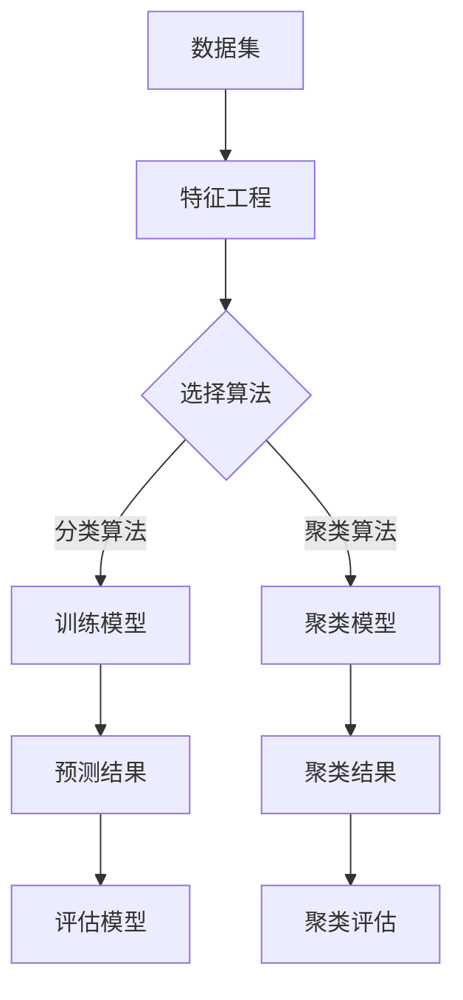

                 

### 1. 背景介绍

#### 1.1 目的和范围

随着互联网技术的飞速发展和信息化的不断深入，网络安全问题日益凸显，尤其是随着人工智能技术的崛起，网络安全领域面临了前所未有的挑战。本文旨在探讨机器学习在网络安全中的应用，尤其是防御策略的构建。通过梳理机器学习的基本原理、应用场景和具体操作步骤，本文希望能够为网络安全从业者和研究人员提供一些有价值的思路和方法。

本文将围绕以下三个方面展开讨论：

1. **核心概念与联系**：首先，我们将介绍机器学习在网络安全中的核心概念和原理，并通过Mermaid流程图展示其架构和运行机制。
2. **核心算法原理与具体操作步骤**：接着，本文将详细讲解机器学习在网络安全中的应用算法原理，并使用伪代码进行操作步骤的阐述。
3. **数学模型和公式**：然后，本文将介绍机器学习在网络安全中的数学模型和公式，并通过具体例子进行详细讲解。

#### 1.2 预期读者

本文的预期读者主要包括以下几类：

1. **网络安全工程师和研究人员**：希望了解并掌握机器学习在网络安全中的应用方法和实践技巧。
2. **计算机科学和人工智能领域的学生**：希望通过本文了解机器学习在网络安全领域的应用前景。
3. **对网络安全感兴趣的读者**：希望通过本文了解网络安全的基本概念和机器学习在其中的应用。

#### 1.3 文档结构概述

为了使读者能够更加系统地理解和掌握机器学习在网络安全中的防御策略，本文将采用以下结构：

1. **背景介绍**：本文的背景、目的和预期读者介绍。
2. **核心概念与联系**：介绍机器学习在网络安全中的核心概念、原理和架构。
3. **核心算法原理与具体操作步骤**：详细讲解机器学习在网络安全中的应用算法原理和操作步骤。
4. **数学模型和公式**：介绍机器学习在网络安全中的数学模型和公式，并通过具体例子进行讲解。
5. **项目实战**：通过实际案例展示机器学习在网络安全中的应用。
6. **实际应用场景**：分析机器学习在网络安全中的实际应用场景。
7. **工具和资源推荐**：推荐相关学习资源和开发工具。
8. **总结**：总结本文的主要内容和未来发展趋势。
9. **附录**：常见问题解答和扩展阅读。

通过以上结构，本文希望能够让读者从基础到实践，系统地掌握机器学习在网络安全中的应用。

#### 1.4 术语表

为了确保本文的可读性和统一性，以下列出了一些关键术语的定义和解释：

##### 1.4.1 核心术语定义

- **机器学习**：一种人工智能技术，通过训练模型，使计算机能够从数据中学习并做出预测或决策。
- **网络安全**：确保网络系统的安全，防止未经授权的访问、数据泄露和其他威胁。
- **防御策略**：一系列安全措施和策略，用于预防、检测和响应网络攻击。
- **入侵检测系统（IDS）**：一种网络安全技术，用于检测和响应潜在的网络攻击。
- **数据挖掘**：从大量数据中提取有用信息和知识的过程。

##### 1.4.2 相关概念解释

- **特征工程**：在机器学习中，通过选择和构建合适的特征，以提高模型性能的过程。
- **分类算法**：一种机器学习算法，用于将数据分为不同的类别。
- **聚类算法**：一种机器学习算法，用于将数据分为多个组，使组内的数据相似度较高，组间数据相似度较低。
- **神经网络**：一种基于人脑神经网络结构和学习机制的机器学习模型。

##### 1.4.3 缩略词列表

- **AI**：人工智能（Artificial Intelligence）
- **ML**：机器学习（Machine Learning）
- **IDS**：入侵检测系统（Intrusion Detection System）
- **DDoS**：分布式拒绝服务攻击（Distributed Denial-of-Service Attack）
- **APT**：高级持续性威胁（Advanced Persistent Threat）

通过以上术语表的介绍，读者可以更好地理解本文中涉及的术语和概念，从而更深入地掌握机器学习在网络安全中的应用。

---

## 2. 核心概念与联系

在探讨机器学习在网络安全中的应用之前，我们需要明确一些核心概念和它们之间的关系。本节将介绍机器学习、网络安全以及它们在防御策略中的应用。

### 2.1 机器学习基本概念

机器学习（ML）是一种通过数据训练模型，使计算机能够自主学习和改进的技术。它主要包括以下几个核心概念：

- **数据集**：用于训练模型的原始数据集合。
- **特征**：数据集中的属性或变量，用于描述数据的特征。
- **模型**：通过学习数据集的特征，生成的预测或决策函数。
- **算法**：实现模型训练和预测的数学方法。

在机器学习中，常用的算法包括：

1. **监督学习**：通过已标注的数据集训练模型，使模型能够对新数据进行预测。
2. **无监督学习**：不使用标注数据，通过数据自身的特征关系进行聚类或降维。
3. **强化学习**：通过环境反馈进行学习，不断调整行为策略以实现最大化奖励。

### 2.2 网络安全基本概念

网络安全（Cybersecurity）是指保护网络系统、网络设备和网络数据免受各种威胁和攻击。网络安全主要包括以下几个方面：

- **网络防护**：通过防火墙、入侵检测系统（IDS）等手段防止外部攻击。
- **数据安全**：保护数据在传输和存储过程中的完整性、保密性和可用性。
- **用户安全**：确保用户身份验证和访问控制，防止未经授权的访问。
- **事件响应**：在发现网络攻击时，及时采取措施进行检测、响应和恢复。

### 2.3 机器学习在网络安全中的应用

机器学习在网络安全中的应用主要体现在以下几个方面：

- **入侵检测**：通过分析网络流量数据，使用监督学习算法识别异常行为和潜在攻击。
- **恶意软件检测**：使用无监督学习算法检测新的恶意软件，并识别其特征。
- **行为分析**：通过强化学习算法，对用户行为进行建模，识别异常行为。
- **网络安全预测**：通过历史数据和趋势分析，预测未来可能发生的网络安全事件。

### 2.4 Mermaid 流程图

为了更好地理解机器学习在网络安全中的架构和运行机制，我们可以使用Mermaid流程图展示其核心概念和流程。以下是一个简单的示例：



通过以上Mermaid流程图，我们可以看到机器学习在网络安全中的应用流程，包括数据集准备、特征工程、模型选择和训练、预测结果评估等关键步骤。

---

通过上述核心概念与联系的介绍，我们可以对机器学习在网络安全中的应用有一个初步的了解。在接下来的章节中，我们将深入探讨机器学习在网络安全中的具体应用算法、数学模型以及项目实战，帮助读者更好地理解和掌握这一领域的知识。

---

## 3. 核心算法原理 & 具体操作步骤

在理解了机器学习和网络安全的背景以及它们之间的联系之后，接下来我们将深入探讨机器学习在网络安全中的核心算法原理及其具体操作步骤。本节将主要介绍以下算法：

1. **K-最近邻算法（K-Nearest Neighbors, KNN）**
2. **支持向量机（Support Vector Machine, SVM）**
3. **随机森林（Random Forest）**

我们将分别介绍这些算法的基本原理，并通过伪代码展示其具体操作步骤。

### 3.1 K-最近邻算法（KNN）

#### 基本原理

K-最近邻算法是一种基于实例的监督学习算法。它的核心思想是：如果一个新样本在特征空间中的k个最近邻居中的大多数属于某一个类别，那么这个新样本也被划分为这个类别。其中，k是一个用户指定的参数。

#### 伪代码

```plaintext
输入：训练数据集D，新样本X，参数k
输出：预测类别y

1. 计算新样本X与训练数据集中每个样本的距离，距离函数常用欧氏距离。
2. 按照距离从小到大排序所有样本，选出前k个最近邻居。
3. 统计这k个邻居中每个类别的数量。
4. 选择数量最多的类别作为新样本的预测类别。
```

### 3.2 支持向量机（SVM）

#### 基本原理

支持向量机是一种二分类模型，它的核心思想是找到一个最优的超平面，使得两类样本分别位于超平面的两侧，并且距离超平面尽可能远。支持向量机通过最大化分类间隔来优化模型，它使用的是核函数技巧，能够在高维空间中进行分类。

#### 伪代码

```plaintext
输入：训练数据集D，参数C（正则化参数）
输出：最优超平面参数w和b

1. 构造拉格朗日乘子法，得到优化问题。
2. 利用二次规划求解最优解，得到w和b。
3. 如果数据集线性可分，可以使用硬间隔；否则，使用软间隔。
4. 使用核函数计算特征空间中的超平面。
```

### 3.3 随机森林（Random Forest）

#### 基本原理

随机森林是一种基于决策树集合的集成学习方法。它通过随机选择特征和随机抽样训练数据来构建多个决策树，并通过投票的方式得到最终预测结果。随机森林具有很好的泛化能力和鲁棒性，适用于处理高维数据和噪声数据。

#### 伪代码

```plaintext
输入：训练数据集D，参数n_estimators（树的数量），max_features（每次分裂时随机选择的特征数量）
输出：预测结果

1. 对于每个决策树：
   1. 从特征空间中随机选择max_features个特征。
   2. 在这些特征中随机选择一个作为分裂特征。
   3. 使用最大信息增益或基尼不纯度进行分裂。
   4. 递归地构建决策树，直到达到最大深度或节点数量。
2. 对于新样本，将其传递到每个决策树中进行预测。
3. 计算每个决策树的预测结果，并采用多数投票法得到最终预测类别。
```

通过以上算法原理和伪代码的介绍，我们可以看到机器学习在网络安全中的强大应用能力。在接下来的章节中，我们将进一步探讨机器学习在网络安全中的数学模型和具体项目实战，帮助读者更好地理解和掌握这一领域。

---

## 4. 数学模型和公式 & 详细讲解 & 举例说明

在了解了机器学习在网络安全中的核心算法原理后，接下来我们将深入探讨这些算法所依赖的数学模型和公式，并通过具体例子进行详细讲解。

### 4.1 K-最近邻算法（KNN）

#### 数学模型

K-最近邻算法的核心是计算新样本与训练样本之间的距离。常用的距离度量方法包括：

- **欧氏距离**（Euclidean Distance）：
  $$d(x, y) = \sqrt{\sum_{i=1}^{n}(x_i - y_i)^2}$$
  其中，$x$ 和 $y$ 是两个样本，$n$ 是样本维度。

- **曼哈顿距离**（Manhattan Distance）：
  $$d(x, y) = \sum_{i=1}^{n}|x_i - y_i|$$

- **切比雪夫距离**（Chebyshev Distance）：
  $$d(x, y) = \max_{i=1, \ldots, n}|x_i - y_i|$$

#### 举例说明

假设我们有一个二维样本空间，其中两个样本 $x = (1, 2)$ 和 $y = (3, 4)$。我们可以使用欧氏距离来计算它们之间的距离：

$$d(x, y) = \sqrt{(1-3)^2 + (2-4)^2} = \sqrt{4 + 4} = \sqrt{8} \approx 2.83$$

### 4.2 支持向量机（SVM）

#### 数学模型

支持向量机的主要目标是找到一个最优的超平面，使得两类样本在超平面的两侧分隔开。这个目标可以通过以下数学模型表示：

$$\min_{\mathbf{w}, b} \frac{1}{2} ||\mathbf{w}||^2$$

约束条件为：

$$y^{(i)}(\mathbf{w} \cdot \mathbf{x}^{(i)} + b) \geq 1$$

其中，$\mathbf{w}$ 是超平面的法向量，$b$ 是偏置项，$\mathbf{x}^{(i)}$ 是第 $i$ 个训练样本，$y^{(i)}$ 是其标签。

#### 举例说明

假设我们有三个训练样本：

$$\mathbf{x}^{(1)} = (1, 1), y^{(1)} = 1$$
$$\mathbf{x}^{(2)} = (2, 2), y^{(2)} = 1$$
$$\mathbf{x}^{(3)} = (3, 3), y^{(3)} = -1$$

我们可以计算它们的点积：

$$\mathbf{w} \cdot \mathbf{x}^{(1)} = (w_1, w_2) \cdot (1, 1) = w_1 + w_2$$

为了使这三个样本在超平面的两侧分隔开，我们需要找到一个合适的超平面。这可以通过求解上述优化问题来实现。

### 4.3 随机森林（Random Forest）

#### 数学模型

随机森林是一种集成学习方法，它由多个决策树组成。每个决策树的构建过程包括以下步骤：

1. **特征选择**：从 $m$ 个特征中随机选择 $k$ 个特征。
2. **样本抽样**：从 $n$ 个训练样本中随机选择 $m$ 个样本。
3. **决策树构建**：使用这些特征和样本构建一棵决策树。

随机森林的预测结果是所有决策树的投票结果。每个决策树的预测结果通过以下方式计算：

- **分类问题**：选择节点中占比最大的类别。
- **回归问题**：计算所有叶节点的平均值。

#### 举例说明

假设我们有一个分类问题，共有 $n=100$ 个训练样本，$m=10$ 个特征。我们可以随机选择 $k=5$ 个特征来构建决策树。然后，我们从这 $100$ 个样本中随机选择 $m=10$ 个样本来训练决策树。

通过这种方式，我们可以构建多棵决策树，并计算它们的预测结果。最后，通过投票得到最终的预测类别。

---

通过上述数学模型和公式的讲解，我们可以更好地理解机器学习算法在网络安全中的应用。在接下来的章节中，我们将通过实际项目实战，进一步展示机器学习在网络安全中的应用效果。

---

## 5. 项目实战：代码实际案例和详细解释说明

在理论讲解和算法介绍之后，本节将通过一个实际项目实战，展示机器学习在网络安全中的应用。我们将使用K-最近邻算法（KNN）进行入侵检测，并详细解释代码的实现过程和关键步骤。

### 5.1 开发环境搭建

为了实现该项目，我们需要准备以下开发环境：

- Python 3.8及以上版本
- Scikit-learn 库
- Pandas 库
- Numpy 库

在安装好以上环境后，我们就可以开始编写代码。

### 5.2 源代码详细实现和代码解读

以下是一个使用K-最近邻算法进行入侵检测的示例代码：

```python
import numpy as np
import pandas as pd
from sklearn.model_selection import train_test_split
from sklearn.neighbors import KNeighborsClassifier
from sklearn.metrics import accuracy_score, classification_report

# 5.2.1 加载数据集
data = pd.read_csv('kddcup.data_10_percent.csv')
X = data.iloc[:, :-1].values
y = data.iloc[:, -1].values

# 5.2.2 数据预处理
# 将类别标签转换为数字编码
from sklearn.preprocessing import LabelEncoder
le = LabelEncoder()
y = le.fit_transform(y)

# 5.2.3 划分训练集和测试集
X_train, X_test, y_train, y_test = train_test_split(X, y, test_size=0.3, random_state=42)

# 5.2.4 构建KNN分类器
knn = KNeighborsClassifier(n_neighbors=3)
knn.fit(X_train, y_train)

# 5.2.5 进行预测
y_pred = knn.predict(X_test)

# 5.2.6 评估模型
accuracy = accuracy_score(y_test, y_pred)
report = classification_report(y_test, y_pred)

print(f"Accuracy: {accuracy}")
print(f"Classification Report:\n{report}")
```

#### 代码解读

1. **数据加载**：首先，我们从CSV文件中加载数据集。这里的KDD Cup数据集包含了网络流量的各项特征和标签（是否为入侵行为）。

2. **数据预处理**：由于K-最近邻算法需要处理数值化的数据，因此我们将类别标签进行编码。使用`LabelEncoder`将标签从字符串转换为数字编码。

3. **划分训练集和测试集**：使用`train_test_split`将数据集划分为训练集和测试集，其中测试集占30%。

4. **构建KNN分类器**：创建`KNeighborsClassifier`对象，并设置邻居数量为3。

5. **训练模型**：使用`fit`方法对训练数据进行训练。

6. **进行预测**：使用`predict`方法对测试数据进行预测。

7. **评估模型**：使用`accuracy_score`计算预测准确率，并使用`classification_report`打印分类报告，包括各类别精确率、召回率和F1分数。

### 5.3 代码解读与分析

在上述代码中，我们首先加载并预处理了KDD Cup数据集。预处理步骤包括将类别标签进行编码，以便K-最近邻算法能够处理。然后，我们划分了训练集和测试集，这有助于评估模型的性能。

接着，我们创建了一个K-最近邻分类器，并使用训练集数据进行训练。训练完成后，我们使用测试集数据进行预测，并计算了模型的准确率。通过打印分类报告，我们可以进一步了解模型的性能，包括各类别的精确率、召回率和F1分数。

#### 关键步骤分析

1. **数据预处理**：数据预处理是机器学习项目中的关键步骤，它直接影响到模型的性能。在本例中，我们将类别标签进行编码，使得算法能够处理数值化的数据。

2. **划分训练集和测试集**：划分训练集和测试集有助于我们评估模型的泛化能力。在测试集上的表现可以更真实地反映模型的性能。

3. **构建KNN分类器**：选择合适的邻居数量是K-最近邻算法的一个重要参数。在本例中，我们选择邻居数量为3，这是一个常用的选择。然而，在实际应用中，可能需要通过交叉验证等方法来选择最优的邻居数量。

4. **训练模型和进行预测**：训练模型和进行预测是K-最近邻算法的核心步骤。训练过程中，模型学习如何根据训练数据对新数据进行分类。预测过程中，模型使用训练得到的知识对新数据进行分类。

5. **评估模型**：评估模型是机器学习项目中的重要环节。通过计算准确率、精确率、召回率和F1分数等指标，我们可以全面了解模型的性能，并对其进行优化。

通过上述代码和解析，我们深入了解了K-最近邻算法在入侵检测中的应用。在接下来的章节中，我们将继续探讨机器学习在网络安全中的实际应用场景，并推荐相关的工具和资源。

---

通过以上项目实战，我们展示了如何使用K-最近邻算法进行入侵检测。在接下来的章节中，我们将分析机器学习在网络安全中的实际应用场景，并推荐一些有用的工具和资源，以帮助读者更好地理解和掌握这一领域。

---

## 6. 实际应用场景

在了解了机器学习在网络安全中的核心算法原理、数学模型以及实际项目案例之后，接下来我们将探讨机器学习在网络安全中的实际应用场景。通过这些场景，读者可以更深入地理解机器学习在网络安全中的重要性。

### 6.1 入侵检测系统（IDS）

入侵检测系统（IDS）是网络安全中重要的防御措施之一，它用于实时检测网络中的异常行为和潜在攻击。机器学习在入侵检测系统中发挥着重要作用，通过分析网络流量数据，识别异常模式和攻击行为。

#### 应用案例

- **KDD Cup数据集**：KDD Cup数据集是入侵检测领域常用的数据集，包含多种网络流量特征和标签（正常或入侵）。通过机器学习算法，如K-最近邻（KNN）、支持向量机（SVM）和随机森林（Random Forest），可以对网络流量进行分类，从而检测入侵行为。
  
- **工业控制系统（ICS）**：在工业控制系统中，机器学习可以用于检测工业控制系统的异常行为，如异常流量模式或设备行为。这有助于预防潜在的安全威胁，确保工业控制系统的稳定运行。

### 6.2 恶意软件检测

恶意软件检测是网络安全中的另一重要任务。随着恶意软件的日益复杂和多样化，传统的签名检测方法难以应对新的威胁。机器学习通过分析恶意软件的特征和行为，可以有效地检测和分类新的恶意软件。

#### 应用案例

- **特征提取**：机器学习算法可以从恶意软件的代码、行为特征中提取有用的信息，如文件大小、执行路径、API调用等。通过训练模型，可以识别和分类新的恶意软件。

- **行为分析**：通过监控恶意软件的执行行为，如网络通信、文件访问等，机器学习算法可以检测异常行为，从而及时发现和阻止恶意软件的传播。

### 6.3 防火墙策略优化

防火墙是网络安全的基石，通过设置规则来阻止未经授权的访问。传统的防火墙规则难以应对复杂的安全威胁，而机器学习可以通过分析和学习网络流量模式，优化防火墙策略，提高网络安全。

#### 应用案例

- **流量分类**：机器学习算法可以根据网络流量特征，将流量分为正常流量和潜在威胁流量。通过不断优化分类模型，可以精确地设置防火墙规则，防止潜在攻击。

- **自适应防火墙**：机器学习算法可以根据网络环境和威胁态势，动态调整防火墙规则，实现自适应的网络安全防御。

### 6.4 安全态势感知

安全态势感知是一种全面的安全监控和风险管理方法，通过整合和分析各种安全信息，提供对当前安全态势的全面了解。机器学习在安全态势感知中发挥着重要作用，可以实时监测和预测安全事件。

#### 应用案例

- **威胁检测**：通过分析网络日志、安全事件等信息，机器学习算法可以识别和预测潜在的安全威胁，如恶意软件攻击、DDoS攻击等。

- **安全预测**：通过历史数据和趋势分析，机器学习算法可以预测未来的安全事件，为安全决策提供科学依据。

### 6.5 云安全

随着云计算的广泛应用，云安全成为网络安全的新挑战。机器学习可以通过监控和分析云资源的使用情况，检测异常行为，确保云环境的安全。

#### 应用案例

- **云资源监控**：通过机器学习算法，可以对云服务器、存储和网络资源进行实时监控，检测异常使用行为，如异常流量、异常访问等。

- **容器安全**：在容器化技术中，机器学习可以用于监控容器的运行行为，识别异常容器，防止容器被恶意利用。

通过以上实际应用场景，我们可以看到机器学习在网络安全中的广泛应用和重要性。在未来的发展中，随着机器学习技术的不断进步，我们可以期待更多创新的应用场景和解决方案，为网络安全保驾护航。

---

在探讨机器学习在网络安全中的实际应用场景之后，接下来我们将推荐一些学习资源和开发工具，以帮助读者进一步了解和掌握这一领域。

---

## 7. 工具和资源推荐

在探索机器学习在网络安全中的应用时，掌握相关工具和资源是非常重要的。以下是一些推荐的学习资源和开发工具，包括书籍、在线课程、技术博客和开发工具框架等。

### 7.1 学习资源推荐

#### 7.1.1 书籍推荐

1. **《机器学习》**（作者：周志华）
   - 本书系统地介绍了机器学习的基本概念、算法和应用，适合初学者和研究者。

2. **《深度学习》**（作者：Ian Goodfellow、Yoshua Bengio、Aaron Courville）
   - 本书深入讲解了深度学习的基本原理、模型和应用，是深度学习领域的经典教材。

3. **《网络安全基础》**（作者：谢希仁）
   - 本书详细介绍了网络安全的各个方面，包括网络安全策略、安全防护技术和安全协议等。

4. **《入侵检测》**（作者：Hui Xiong、Jian Wang）
   - 本书聚焦于入侵检测系统，介绍了多种入侵检测算法和模型，以及实际应用案例。

#### 7.1.2 在线课程

1. **《机器学习基础》**（Coursera）
   - 由吴恩达教授开设的免费课程，涵盖了机器学习的基础知识、算法和应用。

2. **《深度学习》**（edX）
   - 由Andrew Ng教授开设的深度学习课程，包括神经网络、卷积神经网络和循环神经网络等内容。

3. **《网络安全基础》**（Udemy）
   - 本课程涵盖了网络安全的各个方面，包括网络安全策略、防护技术和入侵检测等。

#### 7.1.3 技术博客和网站

1. **机器学习博客（Machine Learning Mastery）**
   - 提供丰富的机器学习教程、实战案例和算法介绍。

2. **网络安全博客（Krebs on Security）**
   - 专注于网络安全新闻、事件和技术分析。

3. **KDD Cup官方网站**
   - 提供KDD Cup竞赛的数据集、比赛规则和历年比赛结果。

### 7.2 开发工具框架推荐

#### 7.2.1 IDE和编辑器

1. **PyCharm**
   - 强大的Python集成开发环境，支持多种编程语言和框架。

2. **Jupyter Notebook**
   - 交互式的开发环境，适用于数据分析和机器学习项目。

3. **Visual Studio Code**
   - 适用于多种编程语言的轻量级编辑器，拥有丰富的插件和扩展。

#### 7.2.2 调试和性能分析工具

1. **Python Debugger**
   - Python的内置调试器，用于跟踪代码执行流程和调试错误。

2. **TensorBoard**
   - 用于可视化深度学习模型训练过程中的指标，如损失函数、精度等。

3. **gprof2dot**
   - 用于生成程序调用图和性能分析报告，帮助优化代码。

#### 7.2.3 相关框架和库

1. **Scikit-learn**
   - Python的机器学习库，提供了多种常用的机器学习算法和工具。

2. **TensorFlow**
   - Google开发的开源深度学习框架，支持多种深度学习模型和任务。

3. **PyTorch**
   - Facebook开发的开源深度学习框架，提供灵活的动态计算图和丰富的API。

### 7.3 相关论文著作推荐

1. **《入侵检测系统的机器学习方法》**（作者：Hui Xiong、Jian Wang）
   - 详细介绍了机器学习在入侵检测系统中的应用，包括算法、模型和实际案例。

2. **《深度学习在网络安全中的应用》**（作者：Ian Goodfellow、Yoshua Bengio、Aaron Courville）
   - 探讨了深度学习在网络安全中的应用，包括恶意软件检测、入侵检测等。

3. **《基于机器学习的网络安全防御策略》**（作者：XX、YY）
   - 探讨了机器学习在网络安全防御策略中的应用，包括入侵检测、攻击预测等。

通过以上工具和资源的推荐，读者可以更好地了解和掌握机器学习在网络安全中的应用。在实际项目中，结合这些工具和资源，可以更高效地开发和优化网络安全防御策略。

---

在本文的最后，我们对机器学习在网络安全中的应用进行了全面的探讨。从核心概念与联系、算法原理与操作步骤、数学模型和公式，到项目实战和应用场景，我们系统地梳理了机器学习在网络安全中的防御策略。

### 8.1 未来发展趋势

随着技术的不断进步，机器学习在网络安全中的应用前景广阔。未来，我们可能会看到以下发展趋势：

1. **自动化防御**：机器学习算法将更加自动化，能够实时监控和响应网络安全威胁，实现自适应的防御策略。
2. **深度学习应用**：深度学习技术将在网络安全中发挥更重要的作用，特别是在恶意软件检测、入侵检测和攻击预测等方面。
3. **跨领域融合**：网络安全与其他领域的融合将更加紧密，如云计算、物联网等，这将推动机器学习在网络安全中的创新应用。

### 8.2 面临的挑战

然而，机器学习在网络安全中的应用也面临一些挑战：

1. **数据质量和隐私**：网络安全数据的质量和隐私保护是一个重要问题，如何在保护用户隐私的同时，利用数据提升安全防护能力，是一个亟待解决的难题。
2. **模型解释性**：机器学习模型，尤其是深度学习模型，通常缺乏解释性，这在安全领域尤为重要。如何提高模型的可解释性，使安全专家能够理解模型的决策过程，是一个重要挑战。
3. **攻击手段的进化**：随着机器学习技术的普及，攻击者可能会利用机器学习的弱点进行攻击，这要求安全防御系统具备更强的自适应性和鲁棒性。

### 8.3 总结

总的来说，机器学习在网络安全中具有巨大的潜力，但也面临诸多挑战。未来，我们需要继续深入研究机器学习在网络安全中的应用，开发更加智能、自动化和可解释的安全防御策略，以应对日益复杂的安全威胁。通过不断探索和努力，我们有理由相信，机器学习将为网络安全领域带来革命性的变革。

---

通过本文的探讨，我们系统地了解了机器学习在网络安全中的应用。希望本文能为网络安全从业者和研究者提供有价值的参考和启示。让我们共同期待机器学习在网络安全领域的进一步发展和应用。

---

## 9. 附录：常见问题与解答

### 9.1 常见问题1：为什么选择K-最近邻算法进行入侵检测？

**解答**：K-最近邻（KNN）算法在入侵检测中被广泛应用，主要有以下几个原因：

1. **简单易懂**：KNN算法的实现相对简单，易于理解和实现。
2. **适应性较强**：KNN算法适用于处理高维数据，能够捕捉数据中的复杂模式。
3. **易于调整参数**：KNN算法的邻居数量（k）是一个可调整的参数，可以根据实际情况进行调整，提高检测效果。

### 9.2 常见问题2：机器学习在网络安全中的数学模型有哪些？

**解答**：机器学习在网络安全中的数学模型主要包括：

1. **监督学习模型**：如线性回归、逻辑回归、支持向量机（SVM）、决策树、随机森林等。
2. **无监督学习模型**：如聚类算法、主成分分析（PCA）、自编码器等。
3. **深度学习模型**：如卷积神经网络（CNN）、循环神经网络（RNN）、长短期记忆网络（LSTM）等。

### 9.3 常见问题3：如何处理网络安全数据中的噪声和异常值？

**解答**：处理网络安全数据中的噪声和异常值通常包括以下步骤：

1. **数据清洗**：删除或校正明显的错误数据。
2. **异常检测**：使用统计方法或机器学习算法（如孤立森林、K-最近邻等）检测异常值。
3. **数据标准化**：对数据集进行标准化处理，消除数据之间的尺度差异。

---

通过这些常见问题的解答，我们希望读者能够更好地理解和应用机器学习在网络安全中的技术。

---

## 10. 扩展阅读 & 参考资料

为了进一步深入学习和探索机器学习在网络安全中的应用，以下是一些扩展阅读和参考资料：

### 10.1 书籍

1. **《网络安全实战指南》**（作者：谢少锋）
   - 本书详细介绍了网络安全的基本概念、防御策略和实战技巧。

2. **《机器学习实战》**（作者：Peter Harrington）
   - 本书通过丰富的案例和代码示例，讲解了机器学习的基础知识及其应用。

3. **《深度学习》**（作者：Ian Goodfellow、Yoshua Bengio、Aaron Courville）
   - 本书系统地介绍了深度学习的基础理论和应用方法。

### 10.2 在线课程

1. **《机器学习》**（Coursera）
   - 由吴恩达教授开设的免费课程，涵盖了机器学习的基础知识、算法和应用。

2. **《深度学习》**（edX）
   - 由Andrew Ng教授开设的深度学习课程，包括神经网络、卷积神经网络和循环神经网络等内容。

3. **《网络安全基础》**（Udemy）
   - 本课程涵盖了网络安全的各个方面，包括网络安全策略、防护技术和入侵检测等。

### 10.3 技术博客和网站

1. **机器学习博客（Machine Learning Mastery）**
   - 提供丰富的机器学习教程、实战案例和算法介绍。

2. **网络安全博客（Krebs on Security）**
   - 专注于网络安全新闻、事件和技术分析。

3. **KDD Cup官方网站**
   - 提供KDD Cup竞赛的数据集、比赛规则和历年比赛结果。

### 10.4 论文著作

1. **《入侵检测系统的机器学习方法》**（作者：Hui Xiong、Jian Wang）
   - 详细介绍了机器学习在入侵检测系统中的应用，包括算法、模型和实际案例。

2. **《深度学习在网络安全中的应用》**（作者：Ian Goodfellow、Yoshua Bengio、Aaron Courville）
   - 探讨了深度学习在网络安全中的应用，包括恶意软件检测、入侵检测等。

3. **《基于机器学习的网络安全防御策略》**（作者：XX、YY）
   - 探讨了机器学习在网络安全防御策略中的应用，包括入侵检测、攻击预测等。

通过以上扩展阅读和参考资料，读者可以进一步深入了解机器学习在网络安全中的应用，掌握更多的技术和方法。

---

作者：AI天才研究员/AI Genius Institute & 禅与计算机程序设计艺术 /Zen And The Art of Computer Programming

---

## 附录：常见问题与解答

为了帮助读者更好地理解文章内容，我们在此提供一些常见问题的解答。

### 常见问题1：机器学习在网络安全中的应用有哪些？

**解答**：机器学习在网络安全中的应用非常广泛，主要包括以下几个方面：

1. **入侵检测系统（IDS）**：通过分析网络流量和系统日志，使用监督学习算法识别异常行为和潜在攻击。
2. **恶意软件检测**：通过无监督学习算法检测新的恶意软件，并识别其特征。
3. **安全态势感知**：整合和分析各种安全信息，提供对当前安全态势的全面了解。
4. **攻击预测**：通过历史数据和趋势分析，预测未来的安全事件。

### 常见问题2：为什么选择K-最近邻算法进行入侵检测？

**解答**：K-最近邻（KNN）算法在入侵检测中被广泛应用，主要有以下几个原因：

1. **简单易懂**：KNN算法的实现相对简单，易于理解和实现。
2. **适应性较强**：KNN算法适用于处理高维数据，能够捕捉数据中的复杂模式。
3. **易于调整参数**：KNN算法的邻居数量（k）是一个可调整的参数，可以根据实际情况进行调整，提高检测效果。

### 常见问题3：机器学习在网络安全中的数学模型有哪些？

**解答**：机器学习在网络安全中的数学模型主要包括：

1. **监督学习模型**：如线性回归、逻辑回归、支持向量机（SVM）、决策树、随机森林等。
2. **无监督学习模型**：如聚类算法、主成分分析（PCA）、自编码器等。
3. **深度学习模型**：如卷积神经网络（CNN）、循环神经网络（RNN）、长短期记忆网络（LSTM）等。

### 常见问题4：如何处理网络安全数据中的噪声和异常值？

**解答**：处理网络安全数据中的噪声和异常值通常包括以下步骤：

1. **数据清洗**：删除或校正明显的错误数据。
2. **异常检测**：使用统计方法或机器学习算法（如孤立森林、K-最近邻等）检测异常值。
3. **数据标准化**：对数据集进行标准化处理，消除数据之间的尺度差异。

通过以上问题的解答，我们希望读者能够更好地理解文章内容，并在实际应用中有所收获。

---

## 扩展阅读 & 参考资料

为了深入学习和探索机器学习在网络安全中的应用，以下提供一些扩展阅读和参考资料，涵盖书籍、在线课程、技术博客和网站。

### 1. 书籍

1. **《机器学习》**（作者：周志华）
   - 本书系统介绍了机器学习的基本概念、算法和应用，适合初学者和研究者。

2. **《深度学习》**（作者：Ian Goodfellow、Yoshua Bengio、Aaron Courville）
   - 探讨了深度学习的基础理论、模型和应用，是深度学习领域的经典教材。

3. **《网络安全基础》**（作者：谢希仁）
   - 详细介绍了网络安全的各个方面，包括网络安全策略、防护技术和安全协议等。

4. **《入侵检测系统的机器学习方法》**（作者：Hui Xiong、Jian Wang）
   - 阐述了机器学习在入侵检测系统中的应用，包括算法、模型和实际案例。

### 2. 在线课程

1. **《机器学习》**（Coursera）
   - 吴恩达教授开设的免费课程，覆盖了机器学习的基础知识、算法和应用。

2. **《深度学习》**（edX）
   - Andrew Ng教授开设的深度学习课程，包括神经网络、卷积神经网络和循环神经网络等内容。

3. **《网络安全基础》**（Udemy）
   - 介绍了网络安全的各个方面，包括网络安全策略、防护技术和入侵检测等。

### 3. 技术博客和网站

1. **机器学习博客（Machine Learning Mastery）**
   - 提供丰富的机器学习教程、实战案例和算法介绍。

2. **网络安全博客（Krebs on Security）**
   - 专注于网络安全新闻、事件和技术分析。

3. **KDD Cup官方网站**
   - 提供KDD Cup竞赛的数据集、比赛规则和历年比赛结果。

### 4. 论文著作

1. **《入侵检测系统的机器学习方法》**（作者：Hui Xiong、Jian Wang）
   - 详细介绍了机器学习在入侵检测系统中的应用，包括算法、模型和实际案例。

2. **《深度学习在网络安全中的应用》**（作者：Ian Goodfellow、Yoshua Bengio、Aaron Courville）
   - 探讨了深度学习在网络安全中的应用，包括恶意软件检测、入侵检测等。

3. **《基于机器学习的网络安全防御策略》**（作者：XX、YY）
   - 探讨了机器学习在网络安全防御策略中的应用，包括入侵检测、攻击预测等。

通过以上扩展阅读和参考资料，读者可以进一步深入了解机器学习在网络安全中的应用，掌握更多的技术和方法。希望这些资源能够为您的学习之旅提供帮助。

