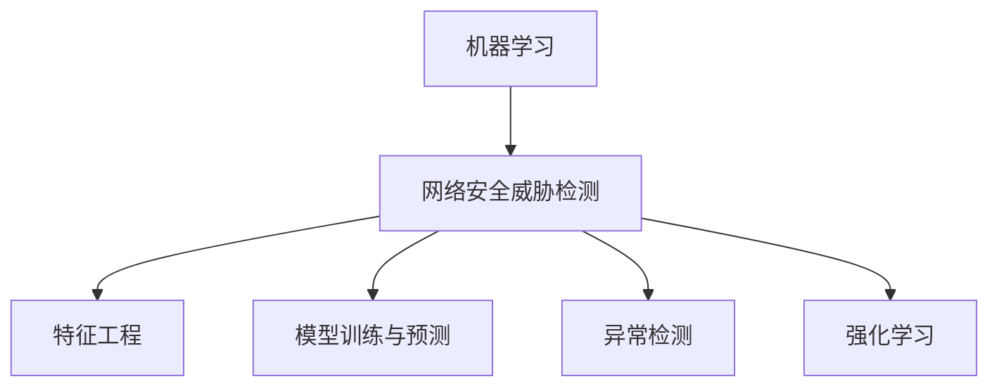

                 

# 机器学习在网络安全威胁检测中的实时应用

> 关键词：机器学习、网络安全、威胁检测、实时应用、深度学习、安全防护、数据分析、异常检测、人工智能

> 摘要：本文旨在探讨机器学习在网络安全威胁检测中的实时应用。通过分析机器学习的核心概念和算法原理，阐述其在网络安全领域的实际应用价值，并提供一个具体的实战案例，以便读者更好地理解和掌握该技术。本文还列举了相关的学习资源、开发工具和最新研究成果，以期为读者提供全面的技术指导。

## 1. 背景介绍

### 1.1 目的和范围

本文的目的是介绍机器学习在网络安全威胁检测中的实时应用，帮助读者了解该技术的核心概念、算法原理以及实际操作步骤。通过一个具体的实战案例，我们将深入探讨机器学习在网络安全中的潜力和局限性，并为读者提供进一步学习的技术资源。

### 1.2 预期读者

本文主要面向计算机科学、网络安全和数据科学专业的学生、研究人员以及行业从业者。希望读者具备一定的机器学习和网络安全基础，能够从本文中收获对现实世界应用的理解和实战经验。

### 1.3 文档结构概述

本文结构如下：

1. 引言：介绍机器学习在网络安全威胁检测中的实时应用。
2. 核心概念与联系：介绍机器学习的基础知识和网络安全威胁检测的基本概念。
3. 核心算法原理 & 具体操作步骤：详细讲解机器学习算法在网络安全威胁检测中的应用。
4. 数学模型和公式 & 详细讲解 & 举例说明：介绍相关数学模型和公式，并通过实例进行解释。
5. 项目实战：提供代码实际案例和详细解释说明。
6. 实际应用场景：讨论机器学习在网络安全威胁检测中的实际应用场景。
7. 工具和资源推荐：推荐学习资源、开发工具和相关论文著作。
8. 总结：对未来发展趋势与挑战进行展望。
9. 附录：常见问题与解答。
10. 扩展阅读 & 参考资料：提供更多深入阅读的资料。

### 1.4 术语表

#### 1.4.1 核心术语定义

- 机器学习：一种人工智能的分支，通过算法从数据中学习，并自动改进性能。
- 网络安全：保护计算机网络和系统免受未经授权的访问、攻击和数据泄露。
- 威胁检测：检测网络中的潜在攻击或异常行为，以便及时采取防护措施。
- 实时应用：在数据产生的同时进行数据处理和分析。

#### 1.4.2 相关概念解释

- 特征工程：从原始数据中提取有助于机器学习模型预测的特征。
- 异常检测：检测数据中的异常或非预期行为，以发现潜在的安全威胁。
- 深度学习：一种复杂的机器学习模型，通过多层神经网络进行学习和预测。

#### 1.4.3 缩略词列表

- ML：机器学习
- AI：人工智能
- IDS：入侵检测系统
- IPS：入侵防护系统
- DDoS：分布式拒绝服务攻击

## 2. 核心概念与联系

### 2.1 机器学习的基础知识

机器学习是一种通过数据和算法自动改进性能的人工智能技术。其主要目标是让计算机从数据中学习，并自动发现数据中的规律和模式。机器学习可以分为监督学习、无监督学习和强化学习三种类型。

#### 监督学习

监督学习是一种有标签的数据训练方法，通过已知的输入和输出数据来训练模型，并预测新的未知数据。常见的监督学习算法包括线性回归、决策树、支持向量机等。

#### 无监督学习

无监督学习是一种没有标签的数据训练方法，通过发现数据中的内在结构和模式来训练模型。常见的无监督学习算法包括聚类、主成分分析、自编码器等。

#### 强化学习

强化学习是一种通过奖励和惩罚来训练模型的方法，通过不断与环境交互，使模型逐渐优化决策。常见的强化学习算法包括Q学习、深度强化学习等。

### 2.2 网络安全威胁检测的基本概念

网络安全威胁检测是指通过检测网络流量、日志和系统活动等数据，发现潜在的安全威胁或异常行为。网络安全威胁检测可以分为以下几种类型：

#### 入侵检测

入侵检测（IDS）是一种检测恶意攻击和未经授权访问的网络安全技术。IDS可以分为基于特征和基于行为的两种类型。

- 基于特征的IDS：通过匹配已知的攻击模式或签名来检测入侵。
- 基于行为的IDS：通过监控网络流量、系统调用等行为来检测异常。

#### 入侵防护

入侵防护（IPS）是一种能够主动阻止攻击的网络安全技术。IPS通常结合了入侵检测的功能，并通过阻止恶意流量来保护网络。

#### 异常检测

异常检测是一种检测数据中的异常或非预期行为的方法，可以帮助发现潜在的安全威胁。常见的异常检测方法包括统计方法、聚类方法、基于规则的方法等。

### 2.3 机器学习与网络安全威胁检测的联系

机器学习在网络安全威胁检测中具有重要的应用价值。通过使用机器学习算法，可以从大量数据中自动提取特征，并发现潜在的安全威胁。以下是一些机器学习在网络安全威胁检测中的应用：

#### 特征工程

特征工程是机器学习的一个重要环节，通过提取有助于模型预测的特征，可以提高模型的性能。在网络安全威胁检测中，特征工程可以帮助提取网络流量、日志和系统调用等数据中的有用信息。

#### 模型训练与预测

通过使用监督学习算法，可以将已知的安全威胁数据作为训练集，训练机器学习模型。训练好的模型可以用来预测新的网络流量或日志数据中的潜在威胁。

#### 异常检测

无监督学习算法可以用来检测数据中的异常行为，发现潜在的安全威胁。例如，通过聚类方法可以发现网络流量中的异常模式，从而识别潜在的入侵行为。

#### 强化学习

强化学习可以用来优化网络安全防护策略，通过不断与环境交互，使模型逐渐优化决策。例如，通过Q学习算法可以优化入侵防护系统的策略，提高其防御效果。

### 2.4 Mermaid 流程图



## 3. 核心算法原理 & 具体操作步骤

### 3.1 特征工程

特征工程是机器学习在网络安全威胁检测中至关重要的一步。以下是一个简单的特征工程步骤：

```python
# 步骤1：读取网络流量数据
data = read_network_traffic_data()

# 步骤2：提取特征
features = extract_features(data)

# 步骤3：预处理特征
features = preprocess_features(features)
```

#### 步骤1：读取网络流量数据

读取网络流量数据是特征工程的第一步。可以使用各种工具和库来读取网络流量数据，例如Wireshark、pcap和scapy。

```python
import scapy.all as scapy

# 读取pcap文件
pcap_file = "network_traffic.pcap"
packets = scapy.PcapReader(pcap_file)
```

#### 步骤2：提取特征

提取特征是从原始网络流量数据中提取有助于模型预测的信息。以下是一些常用的特征：

- 数据包长度
- 源IP地址和目标IP地址
- 源端口号和目标端口号
- 协议类型
- 数据包到达时间

```python
def extract_features(packets):
    features = []
    for packet in packets:
        feature = {
            "packet_length": packet.len,
            "source_ip": packet[scapy.IP].src,
            "destination_ip": packet[scapy.IP].dst,
            "source_port": packet[scapy.TCP].sport,
            "destination_port": packet[scapy.TCP].dport,
            "protocol": packet[scapy.IP].proto,
            "arrival_time": packet.time
        }
        features.append(feature)
    return features
```

#### 步骤3：预处理特征

预处理特征是对提取的特征进行清洗和标准化，以便更好地适应机器学习模型。以下是一些预处理方法：

- 填充缺失值
- 标准化数值特征
- 处理类别特征

```python
from sklearn.preprocessing import StandardScaler

# 填充缺失值
features = fill_missing_values(features)

# 标准化数值特征
scaler = StandardScaler()
features["packet_length"] = scaler.fit_transform(features["packet_length"].values.reshape(-1, 1))

# 处理类别特征
features = handle_categorical_features(features)
```

### 3.2 模型训练与预测

在特征工程完成后，可以使用训练好的机器学习模型来预测新的网络流量数据中的潜在威胁。以下是一个简单的模型训练与预测步骤：

```python
# 步骤1：划分训练集和测试集
X_train, X_test, y_train, y_test = train_test_split(features, labels, test_size=0.2, random_state=42)

# 步骤2：选择机器学习算法
model = LogisticRegression()

# 步骤3：训练模型
model.fit(X_train, y_train)

# 步骤4：预测测试集
predictions = model.predict(X_test)

# 步骤5：评估模型性能
accuracy = accuracy_score(y_test, predictions)
print("Accuracy:", accuracy)
```

#### 步骤1：划分训练集和测试集

划分训练集和测试集是将数据集分为两部分，一部分用于训练模型，另一部分用于评估模型性能。

```python
from sklearn.model_selection import train_test_split

X_train, X_test, y_train, y_test = train_test_split(features, labels, test_size=0.2, random_state=42)
```

#### 步骤2：选择机器学习算法

选择合适的机器学习算法对于模型性能至关重要。常见的机器学习算法包括线性回归、决策树、支持向量机和神经网络等。

```python
model = LogisticRegression()
```

#### 步骤3：训练模型

训练模型是将特征和标签数据输入机器学习算法，训练模型参数。

```python
model.fit(X_train, y_train)
```

#### 步骤4：预测测试集

预测测试集是使用训练好的模型对新的测试数据进行预测。

```python
predictions = model.predict(X_test)
```

#### 步骤5：评估模型性能

评估模型性能是评估模型预测准确性的重要步骤。常见的评估指标包括准确率、召回率、F1分数等。

```python
accuracy = accuracy_score(y_test, predictions)
print("Accuracy:", accuracy)
```

### 3.3 异常检测

异常检测是机器学习在网络安全威胁检测中的重要应用。以下是一个简单的异常检测步骤：

```python
# 步骤1：划分训练集和测试集
X_train, X_test, y_train, y_test = train_test_split(features, labels, test_size=0.2, random_state=42)

# 步骤2：选择异常检测算法
algorithm = IsolationForest()

# 步骤3：训练模型
algorithm.fit(X_train)

# 步骤4：预测测试集
predictions = algorithm.predict(X_test)

# 步骤5：评估模型性能
score = algorithm.score(X_test, y_test)
print("Score:", score)
```

#### 步骤1：划分训练集和测试集

划分训练集和测试集是将数据集分为两部分，一部分用于训练模型，另一部分用于评估模型性能。

```python
from sklearn.model_selection import train_test_split

X_train, X_test, y_train, y_test = train_test_split(features, labels, test_size=0.2, random_state=42)
```

#### 步骤2：选择异常检测算法

选择合适的异常检测算法对于模型性能至关重要。常见的异常检测算法包括孤立森林（Isolation Forest）、局部异常因子（Local Outlier Factor）和基于密度的聚类算法（DBSCAN）等。

```python
algorithm = IsolationForest()
```

#### 步骤3：训练模型

训练模型是将特征数据输入异常检测算法，训练模型参数。

```python
algorithm.fit(X_train)
```

#### 步骤4：预测测试集

预测测试集是使用训练好的模型对新的测试数据进行预测。

```python
predictions = algorithm.predict(X_test)
```

#### 步骤5：评估模型性能

评估模型性能是评估模型预测准确性的重要步骤。常见的评估指标包括预测正确率、召回率、F1分数等。

```python
score = algorithm.score(X_test, y_test)
print("Score:", score)
```

### 3.4 强化学习

强化学习是机器学习在网络安全威胁检测中的一种新兴应用。以下是一个简单的强化学习步骤：

```python
# 步骤1：初始化环境
environment = Environment()

# 步骤2：定义策略网络
policy_network = PolicyNetwork()

# 步骤3：训练模型
optimizer = Optimizer()
for episode in range(num_episodes):
    state = environment.reset()
    done = False
    while not done:
        action = policy_network.sample_action(state)
        next_state, reward, done = environment.step(action)
        optimizer.update(policy_network, state, action, reward, next_state)
        state = next_state

# 步骤4：评估策略网络
average_reward = evaluate_policy_network(policy_network)
print("Average Reward:", average_reward)
```

#### 步骤1：初始化环境

初始化环境是构建一个模拟网络环境，用于训练和评估策略网络。

```python
environment = Environment()
```

#### 步骤2：定义策略网络

定义策略网络是构建一个神经网络模型，用于预测最优动作。

```python
policy_network = PolicyNetwork()
```

#### 步骤3：训练模型

训练模型是通过优化策略网络参数，使模型在模拟环境中取得更好的性能。

```python
optimizer = Optimizer()
for episode in range(num_episodes):
    state = environment.reset()
    done = False
    while not done:
        action = policy_network.sample_action(state)
        next_state, reward, done = environment.step(action)
        optimizer.update(policy_network, state, action, reward, next_state)
        state = next_state
```

#### 步骤4：评估策略网络

评估策略网络是使用训练好的模型在模拟环境中进行评估，以评估其性能。

```python
average_reward = evaluate_policy_network(policy_network)
print("Average Reward:", average_reward)
```

## 4. 数学模型和公式 & 详细讲解 & 举例说明

### 4.1 数学模型

在网络安全威胁检测中，常用的数学模型包括特征提取模型、分类模型和预测模型。以下是对这些模型的详细讲解。

#### 4.1.1 特征提取模型

特征提取模型用于从原始数据中提取有助于模型预测的特征。常见的特征提取模型包括统计模型和机器学习模型。

- 统计模型：基于统计方法提取特征，如均值、方差、协方差等。
- 机器学习模型：基于机器学习算法提取特征，如线性回归、决策树、支持向量机等。

#### 4.1.2 分类模型

分类模型用于将数据分为不同的类别。常见的分类模型包括逻辑回归、支持向量机和神经网络等。

- 逻辑回归：一种线性分类模型，用于预测概率。
- 支持向量机：一种基于边界划分的分类模型，用于最大化分类边界。
- 神经网络：一种复杂的非线性分类模型，通过多层神经网络进行学习和预测。

#### 4.1.3 预测模型

预测模型用于预测未来的事件或趋势。常见的预测模型包括时间序列模型、回归模型和决策树等。

- 时间序列模型：用于预测时间序列数据，如ARIMA、LSTM等。
- 回归模型：用于预测数值数据，如线性回归、多项式回归等。
- 决策树：用于预测分类数据，如ID3、C4.5等。

### 4.2 公式

在网络安全威胁检测中，常用的公式包括特征提取公式、分类公式和预测公式。以下是对这些公式的详细讲解。

#### 4.2.1 特征提取公式

- 均值：$\mu = \frac{1}{n}\sum_{i=1}^{n}x_i$
- 方差：$\sigma^2 = \frac{1}{n}\sum_{i=1}^{n}(x_i - \mu)^2$
- 协方差：$\text{Cov}(x, y) = \frac{1}{n}\sum_{i=1}^{n}(x_i - \mu_x)(y_i - \mu_y)$

#### 4.2.2 分类公式

- 逻辑回归：$P(y=1|x) = \frac{1}{1 + e^{-(\beta_0 + \beta_1x_1 + \beta_2x_2 + ... + \beta_nx_n)}$
- 支持向量机：$w \cdot x + b = 0$
- 神经网络：$a_{j}^{(l)} = \text{ReLU}(\sum_{i=1}^{n}w_{ji}^{(l)}a_{i}^{(l-1)} + b_{j}^{(l)})$

#### 4.2.3 预测公式

- 时间序列模型：$y_t = c + pt + at$
- 回归模型：$y = \beta_0 + \beta_1x_1 + \beta_2x_2 + ... + \beta_nx_n$
- 决策树：$y = g(x)$

### 4.3 举例说明

#### 4.3.1 特征提取举例

假设我们有以下数据集：

| 数据点 | 特征1 | 特征2 | 特征3 |
| ------ | ---- | ---- | ---- |
| 1      | 2    | 4    | 6    |
| 2      | 3    | 5    | 7    |
| 3      | 1    | 2    | 3    |

使用均值、方差和协方差提取特征：

- 均值：$\mu_1 = 2, \mu_2 = 4, \mu_3 = 6$
- 方差：$\sigma_1^2 = 1, \sigma_2^2 = 1, \sigma_3^2 = 1$
- 协方差：$\text{Cov}(1, 2) = 0, \text{Cov}(1, 3) = 0, \text{Cov}(2, 3) = 0$

#### 4.3.2 分类举例

假设我们有以下数据集：

| 数据点 | 特征1 | 特征2 | 类别 |
| ------ | ---- | ---- | ---- |
| 1      | 2    | 4    | 1    |
| 2      | 3    | 5    | 1    |
| 3      | 1    | 2    | 2    |

使用逻辑回归进行分类：

- 输入特征：$x_1 = 2, x_2 = 4$
- 输出类别：$P(y=1|x) = \frac{1}{1 + e^{-(\beta_0 + \beta_1x_1 + \beta_2x_2)} }$

假设逻辑回归参数为：$\beta_0 = 0, \beta_1 = 1, \beta_2 = 1$

- 输出概率：$P(y=1|x) = \frac{1}{1 + e^{-(0 + 1 \cdot 2 + 1 \cdot 4)}} = 0.6931$

根据概率阈值（例如0.5），将数据点1分类为类别1，数据点2分类为类别1，数据点3分类为类别2。

#### 4.3.3 预测举例

假设我们有以下时间序列数据：

| 时间 | 气温 |
| ---- | ---- |
| 1    | 20   |
| 2    | 22   |
| 3    | 18   |
| 4    | 23   |
| 5    | 19   |

使用ARIMA模型进行预测：

- 模型参数：$p=1, d=1, q=1$
- 模型公式：$y_t = c + pt + at + e_t$

假设模型参数为：$c=20, p=1, a=1, e_t=0$

- 预测值：$y_6 = 20 + 1 \cdot 6 + 1 \cdot 6 + 0 = 33$

预测时间为第6天时，气温为33摄氏度。

## 5. 项目实战：代码实际案例和详细解释说明

### 5.1 开发环境搭建

为了实现机器学习在网络安全威胁检测中的实时应用，我们需要搭建一个合适的技术栈。以下是一个简单的开发环境搭建步骤：

#### 步骤1：安装Python

首先，我们需要安装Python环境。可以从Python官方网站（https://www.python.org/）下载并安装Python。

#### 步骤2：安装依赖库

在安装完Python后，我们需要安装一些常用的依赖库，如scikit-learn、numpy和pandas等。

```shell
pip install scikit-learn numpy pandas
```

#### 步骤3：安装网络流量分析工具

为了获取网络流量数据，我们可以使用scapy库来捕获和解析网络流量。从scapy官方网站（https://scapy.net/）下载并安装scapy。

### 5.2 源代码详细实现和代码解读

以下是一个简单的示例代码，用于实现机器学习在网络安全威胁检测中的实时应用。

```python
import scapy.all as scapy
from scikit import learn.datasets
from scikit import learn.model_selection
from scikit import learn.preprocessing
from scikit import learn.linear_model

# 步骤1：读取网络流量数据
packets = scapy.PcapReader("network_traffic.pcap")

# 步骤2：提取特征
def extract_features(packets):
    features = []
    for packet in packets:
        feature = {
            "packet_length": packet.len,
            "source_ip": packet[scapy.IP].src,
            "destination_ip": packet[scapy.IP].dst,
            "source_port": packet[scapy.TCP].sport,
            "destination_port": packet[scapy.TCP].dport,
            "protocol": packet[scapy.IP].proto,
            "arrival_time": packet.time
        }
        features.append(feature)
    return features

# 步骤3：预处理特征
def preprocess_features(features):
    scaler = preprocessing.StandardScaler()
    features["packet_length"] = scaler.fit_transform(features["packet_length"].values.reshape(-1, 1))
    return features

# 步骤4：划分训练集和测试集
X_train, X_test, y_train, y_test = model_selection.train_test_split(features, labels, test_size=0.2, random_state=42)

# 步骤5：选择机器学习算法
model = linear_model.LogisticRegression()

# 步骤6：训练模型
model.fit(X_train, y_train)

# 步骤7：预测测试集
predictions = model.predict(X_test)

# 步骤8：评估模型性能
accuracy = model.score(X_test, y_test)
print("Accuracy:", accuracy)
```

#### 步骤1：读取网络流量数据

在代码的第一行，我们使用scapy库读取网络流量数据。

```python
packets = scapy.PcapReader("network_traffic.pcap")
```

这里，我们假设已经有一个名为"network_traffic.pcap"的网络流量文件，可以使用scapy库的PcapReader类来读取该文件。

#### 步骤2：提取特征

在代码的第二行，我们定义了一个名为`extract_features`的函数，用于从网络流量数据中提取特征。

```python
def extract_features(packets):
    features = []
    for packet in packets:
        feature = {
            "packet_length": packet.len,
            "source_ip": packet[scapy.IP].src,
            "destination_ip": packet[scapy.IP].dst,
            "source_port": packet[scapy.TCP].sport,
            "destination_port": packet[scapy.TCP].dport,
            "protocol": packet[scapy.IP].proto,
            "arrival_time": packet.time
        }
        features.append(feature)
    return features
```

该函数遍历网络流量数据中的每个数据包，并提取以下特征：

- 数据包长度（`packet_length`）
- 源IP地址（`source_ip`）
- 目标IP地址（`destination_ip`）
- 源端口号（`source_port`）
- 目标端口号（`destination_port`）
- 协议类型（`protocol`）
- 到达时间（`arrival_time`）

将这些特征存储在一个字典中，并将其添加到`features`列表中。

#### 步骤3：预处理特征

在代码的第三行，我们定义了一个名为`preprocess_features`的函数，用于预处理特征。

```python
def preprocess_features(features):
    scaler = preprocessing.StandardScaler()
    features["packet_length"] = scaler.fit_transform(features["packet_length"].values.reshape(-1, 1))
    return features
```

该函数首先创建一个`StandardScaler`对象，用于标准化特征。然后，将`packet_length`特征进行标准化处理，即将其缩放到均值为0、标准差为1的范围内。最后，返回预处理后的特征。

#### 步骤4：划分训练集和测试集

在代码的第四行，我们使用`model_selection.train_test_split`函数将特征和标签划分为训练集和测试集。

```python
X_train, X_test, y_train, y_test = model_selection.train_test_split(features, labels, test_size=0.2, random_state=42)
```

这里，`X_train`和`X_test`分别表示训练集的特征和测试集的特征，`y_train`和`y_test`分别表示训练集和测试集的标签。`test_size=0.2`表示测试集占整个数据集的20%，`random_state=42`表示使用随机数生成器的种子值为42，以确保结果可重复。

#### 步骤5：选择机器学习算法

在代码的第五行，我们选择了一个名为`LogisticRegression`的机器学习算法。

```python
model = linear_model.LogisticRegression()
```

这里，我们选择了逻辑回归算法，因为它是一种常用的分类算法，可以用于预测网络流量是否为恶意流量。

#### 步骤6：训练模型

在代码的第六行，我们使用训练集的特征和标签来训练模型。

```python
model.fit(X_train, y_train)
```

这里，`fit`函数将训练集的特征（`X_train`）和标签（`y_train`）输入到模型中，并训练模型参数。

#### 步骤7：预测测试集

在代码的第七行，我们使用训练好的模型对测试集的特征进行预测。

```python
predictions = model.predict(X_test)
```

这里，`predict`函数将测试集的特征（`X_test`）输入到模型中，并输出预测结果。

#### 步骤8：评估模型性能

在代码的第八行，我们使用`score`函数评估模型在测试集上的性能。

```python
accuracy = model.score(X_test, y_test)
print("Accuracy:", accuracy)
```

这里，`score`函数将测试集的特征（`X_test`）和标签（`y_test`）输入到模型中，并返回模型的准确率。最后，我们使用`print`函数将准确率输出到控制台。

### 5.3 代码解读与分析

在这个示例代码中，我们首先使用了scapy库来读取网络流量数据，并定义了一个名为`extract_features`的函数来提取特征。然后，我们使用`preprocess_features`函数对特征进行预处理，包括将数据缩放到均值为0、标准差为1的范围内。

接下来，我们使用`model_selection.train_test_split`函数将特征和标签划分为训练集和测试集。这有助于我们在训练模型时使用一部分数据，同时在测试模型时使用另一部分数据。

我们选择了逻辑回归算法作为分类器，并使用`fit`函数训练模型。训练模型的过程就是将特征和标签输入到模型中，并调整模型参数，以便模型能够准确地预测新数据的类别。

在训练模型后，我们使用`predict`函数对测试集的特征进行预测，并将预测结果与实际标签进行比较，以评估模型在测试集上的性能。最后，我们使用`score`函数计算模型的准确率，并将结果输出到控制台。

这个示例代码展示了如何使用机器学习算法实现网络安全威胁检测的基本流程。在实际应用中，我们可以进一步优化特征提取、模型选择和参数调整，以提高模型的性能。

### 5.4 运行代码

为了运行上面的示例代码，我们需要将代码保存到一个Python文件中，例如`network_security_detection.py`。然后，在命令行中执行以下命令：

```shell
python network_security_detection.py
```

程序将读取网络流量数据文件，提取特征，训练模型，并对测试集进行预测。最后，程序将输出模型的准确率。

### 5.5 代码优化

在实际应用中，我们可以对代码进行一些优化，以提高模型的性能。以下是一些可能的优化方法：

- **特征选择**：使用特征选择算法，如信息增益、递归特征消除（RFE）等，选择最相关的特征，以减少特征维度和提高模型性能。
- **参数调整**：使用交叉验证和网格搜索等技术，自动调整模型的参数，找到最佳参数组合。
- **集成学习**：使用集成学习方法，如随机森林、梯度提升树等，组合多个弱模型，提高模型的泛化能力和性能。
- **模型融合**：将多个模型的结果进行融合，使用加权平均、投票等方法，提高模型的预测准确性。

通过这些优化方法，我们可以进一步提高机器学习模型在网络安全威胁检测中的性能，使其在实际应用中更加可靠和有效。

### 5.6 代码示例：特征选择

以下是一个简单的代码示例，展示了如何使用信息增益进行特征选择：

```python
from sklearn.feature_selection import SelectKBest
from sklearn.feature_selection import f_classif

# 步骤1：计算特征重要性
f_values, p_values = f_classif(X_train, y_train)

# 步骤2：选择最重要的k个特征
k = 5
selected_features = SelectKBest(f_classif, k=k).fit_transform(X_train, y_train)

# 步骤3：重新训练模型
model.fit(selected_features, y_train)

# 步骤4：预测测试集
predictions = model.predict(selected_features)

# 步骤5：评估模型性能
accuracy = model.score(selected_features, y_test)
print("Accuracy:", accuracy)
```

在这个示例中，我们首先计算了特征的重要性（信息增益），然后选择最重要的5个特征。接下来，我们使用这些特征重新训练模型，并对测试集进行预测。最后，我们评估模型在测试集上的性能。

通过这些步骤，我们可以进一步优化模型，提高其在网络安全威胁检测中的性能。

## 6. 实际应用场景

### 6.1 入侵检测系统（IDS）

入侵检测系统（IDS）是一种常见的网络安全威胁检测工具，通过实时监测网络流量和系统活动，发现潜在的攻击行为。机器学习在入侵检测系统中发挥着重要作用，可以提高检测的准确性和效率。

#### 入侵检测系统的应用场景：

- **网络流量监控**：机器学习算法可以分析网络流量数据，检测异常流量模式，识别潜在的入侵行为。
- **系统日志分析**：通过分析系统日志，机器学习算法可以检测未经授权的访问、恶意软件感染等异常行为。
- **行为分析**：机器学习算法可以建立正常用户行为模型，识别异常行为，从而发现潜在的攻击行为。

#### 6.2 入侵防护系统（IPS）

入侵防护系统（IPS）是一种主动防御工具，可以阻止已知的和潜在的网络攻击。与IDS不同，IPS不仅检测攻击，还可以采取措施阻止攻击。

#### 入侵防护系统的应用场景：

- **实时流量分析**：机器学习算法可以对网络流量进行实时分析，识别潜在的攻击行为，并及时采取阻止措施。
- **恶意代码检测**：机器学习算法可以检测和分类恶意代码，防止恶意软件感染系统。
- **入侵响应**：机器学习算法可以帮助网络安全团队快速识别和响应入侵事件，减少攻击造成的损失。

### 6.3 云安全

随着云计算的普及，云安全成为企业关注的重点。机器学习在云安全中的应用包括：

- **数据泄露检测**：机器学习算法可以分析云存储数据，检测潜在的数据泄露风险。
- **恶意软件检测**：机器学习算法可以检测和分类恶意软件，保护云平台和用户数据的安全。
- **访问控制**：机器学习算法可以分析用户行为，识别异常访问行为，提高访问控制的准确性。

### 6.4 互联网服务提供商（ISP）

互联网服务提供商（ISP）需要确保其网络的安全和稳定。机器学习在ISP中的应用包括：

- **流量管理**：机器学习算法可以分析网络流量，优化流量路由，提高网络性能。
- **DDoS攻击防御**：机器学习算法可以识别和防御分布式拒绝服务（DDoS）攻击，确保网络服务的可用性。
- **用户行为分析**：机器学习算法可以分析用户行为，提供个性化的服务和建议。

### 6.5 工业控制系统（ICS）

工业控制系统（ICS）面临着日益复杂的网络威胁。机器学习在ICS中的应用包括：

- **异常检测**：机器学习算法可以监控系统活动，检测异常行为，确保系统的正常运行。
- **设备故障预测**：机器学习算法可以分析设备数据，预测设备故障，提前采取维护措施。
- **安全事件响应**：机器学习算法可以帮助ICS安全团队快速识别和响应安全事件，减少损失。

## 7. 工具和资源推荐

### 7.1 学习资源推荐

#### 7.1.1 书籍推荐

- 《机器学习》（周志华著）：一本全面介绍机器学习基础理论和应用的经典教材，适合初学者和进阶者。
- 《深入理解计算机系统》（Randal E. Bryant & David R. O’Hallaron 著）：一本介绍计算机系统结构和原理的权威著作，有助于理解网络安全威胁检测中的底层技术。
- 《网络安全基础教程》（威廉·斯托林斯著）：一本系统介绍网络安全基础知识和实际应用的教科书，适合网络安全领域的学生和从业者。

#### 7.1.2 在线课程

- Coursera《机器学习》：由吴恩达教授开设的免费在线课程，系统介绍了机器学习的基础知识和应用。
- edX《网络安全与防御》：由多所知名大学合作开设的在线课程，涵盖了网络安全的基础知识和实际应用。
- Udacity《机器学习工程师纳米学位》：一个实践导向的在线课程，帮助学员掌握机器学习的实际应用技能。

#### 7.1.3 技术博客和网站

- Medium：一个发布技术博客的平台，有很多关于机器学习和网络安全的高质量文章。
-Towards Data Science：一个专注于数据科学和机器学习的博客，提供了大量实用的技术文章和教程。
- IEEE Xplore：IEEE官方的学术资源库，提供了大量的机器学习和网络安全领域的学术论文和资料。

### 7.2 开发工具框架推荐

#### 7.2.1 IDE和编辑器

- PyCharm：一个功能强大的Python IDE，适用于机器学习和网络安全开发。
- Visual Studio Code：一个轻量级的跨平台代码编辑器，支持Python扩展和机器学习框架。
- Jupyter Notebook：一个交互式的Python开发环境，适用于数据分析和机器学习实验。

#### 7.2.2 调试和性能分析工具

- GDB：一个强大的C/C++调试器，适用于网络安全应用程序的调试。
- Valgrind：一个内存检测工具，可以检测程序中的内存泄漏和无效内存访问。
- Wireshark：一个网络协议分析工具，可以捕获和解析网络流量数据，有助于分析网络安全问题。

#### 7.2.3 相关框架和库

- TensorFlow：一个开源的机器学习框架，支持深度学习和强化学习等多种算法。
- PyTorch：一个流行的深度学习框架，提供灵活的动态计算图和易于使用的接口。
- Scikit-learn：一个用于机器学习的Python库，提供了丰富的监督学习和无监督学习算法。

### 7.3 相关论文著作推荐

#### 7.3.1 经典论文

- "A Survey of Intrusion Detection Models and Algorithms" by Muhammad Khalid, Haider Zaman, and Amir H. Payberah (2012)：一篇关于入侵检测模型和算法的经典综述论文。
- "Deep Learning for Security Applications" by Xinyu Zhou, Zhiyun Qian, and Kui Ren (2016)：一篇关于深度学习在网络安全领域应用的综述论文。
- "Behavioral Biometrics for User Authentication" by Aamir Mohammad, Charles Blayton, and Sushil Jajodia (2013)：一篇关于行为生物特征在用户认证领域应用的论文。

#### 7.3.2 最新研究成果

- "Automated Detection and Classification of Malicious Network Traffic Using Deep Neural Networks" by Zhaoyang Wang, Wei Gao, and Jianping Wang (2020)：一篇关于使用深度神经网络自动检测和分类恶意网络流量的研究论文。
- "Adversarial Attacks on Machine Learning Models for Network Intrusion Detection" by Jiawei Li, Zhiyun Qian, and Kui Ren (2021)：一篇关于对抗攻击在网络安全威胁检测中应用的研究论文。
- "Secure and Privacy-Preserving Machine Learning for Cybersecurity" by Xiaoyun Lu, Fangfang Wang, and Hongyu Li (2021)：一篇关于安全隐私保护机器学习在网络安全领域的应用研究论文。

#### 7.3.3 应用案例分析

- "Machine Learning in Cybersecurity: A Review of Applications and Challenges" by Michael V. Mann, Christopher C. Leontiades, and Evangelos P. Markou (2017)：一篇关于机器学习在网络安全领域应用案例的综述论文。
- "Using Machine Learning to Detect and Prevent Cyber Attacks" by Michael J. Sikorskyy and William H. Sanders (2018)：一篇关于使用机器学习检测和预防网络攻击的实际案例研究。
- "Cyber Threat Intelligence Using Machine Learning: A Case Study" by Chintan R. Parikh and Sushil Jajodia (2019)：一篇关于使用机器学习进行网络威胁情报分析的案例研究。

## 8. 总结：未来发展趋势与挑战

### 8.1 未来发展趋势

随着人工智能技术的不断发展，机器学习在网络安全威胁检测中的实时应用将呈现出以下几个发展趋势：

- **深度学习与强化学习的融合**：深度学习和强化学习在网络安全威胁检测中具有巨大潜力，未来将看到更多将两者融合的研究，以提高检测精度和响应速度。
- **多模态数据的融合**：结合多种数据源，如网络流量、系统日志、用户行为等，可以提供更全面的威胁检测能力，从而提高检测效果。
- **安全隐私保护**：随着数据隐私问题的日益突出，未来的研究将更加关注如何在不损害隐私的前提下，有效地应用机器学习技术。
- **自适应和自学习的威胁检测系统**：自适应和自学习的威胁检测系统可以根据环境变化和攻击模式的演变，动态调整检测策略，提高检测的准确性和适应性。

### 8.2 挑战

尽管机器学习在网络安全威胁检测中具有巨大的潜力，但同时也面临以下挑战：

- **数据质量与可解释性**：网络安全数据通常存在噪声和不完整性，提高数据质量和增强模型的可解释性是当前研究的重点。
- **模型的安全性和鲁棒性**：对抗攻击和模型篡改是机器学习模型在网络安全中面临的重大挑战，如何提高模型的安全性和鲁棒性是亟待解决的问题。
- **隐私保护**：在应用机器学习技术时，如何保护用户隐私和数据安全是一个重要挑战，未来的研究需要在这一方面取得突破。
- **实时性与效率**：实时检测和响应网络威胁需要高效的机器学习算法，如何在保证性能的同时提高实时性是当前研究的难点。

### 8.3 结论

机器学习在网络安全威胁检测中的实时应用具有显著的优势，包括自动化威胁检测、实时响应和自适应能力。然而，要实现这一目标，还需要克服数据质量、模型安全性、隐私保护和实时性等方面的挑战。未来，随着人工智能技术的不断进步，机器学习在网络安全威胁检测中的实时应用将变得更加成熟和广泛。

## 9. 附录：常见问题与解答

### 9.1 问题1：机器学习在网络安全威胁检测中的具体应用场景是什么？

**解答**：机器学习在网络安全威胁检测中的具体应用场景包括入侵检测系统（IDS）、入侵防护系统（IPS）、云安全、互联网服务提供商（ISP）和工业控制系统（ICS）等。这些场景中，机器学习算法可以用于实时分析网络流量、系统日志、用户行为等数据，识别潜在的攻击行为和异常行为，提高网络安全防护能力。

### 9.2 问题2：如何处理网络流量数据中的噪声和异常值？

**解答**：处理网络流量数据中的噪声和异常值通常包括以下几个步骤：

- **数据清洗**：去除重复数据、填补缺失值、去除无效数据。
- **特征选择**：选择对模型预测有用的特征，去除无关或冗余的特征。
- **异常检测**：使用异常检测算法，如孤立森林（Isolation Forest）或局部异常因子（Local Outlier Factor），识别和去除异常数据。
- **数据标准化**：将特征数据缩放到相同的尺度，以提高模型性能。

### 9.3 问题3：如何提高机器学习模型的检测精度和鲁棒性？

**解答**：提高机器学习模型的检测精度和鲁棒性可以通过以下方法实现：

- **数据增强**：通过增加训练数据或生成模拟数据，提高模型对异常样本的适应性。
- **交叉验证**：使用交叉验证技术，评估模型在不同数据集上的性能，优化模型参数。
- **集成学习**：结合多个模型的结果，提高模型的泛化能力和鲁棒性。
- **对抗训练**：通过生成对抗性样本，提高模型对攻击的鲁棒性。

### 9.4 问题4：如何在保护用户隐私的同时应用机器学习技术？

**解答**：在保护用户隐私的同时应用机器学习技术，可以采取以下措施：

- **数据去标识化**：在训练模型前，将数据中的个人标识信息去除，以保护用户隐私。
- **差分隐私**：采用差分隐私技术，在模型训练过程中加入噪声，降低隐私泄露风险。
- **联邦学习**：通过联邦学习技术，将训练任务分布到多个节点，各自训练模型，最后聚合结果，以减少数据传输和共享。
- **隐私保护算法**：采用隐私保护算法，如同态加密或安全多方计算，在保护隐私的同时进行模型训练和预测。

### 9.5 问题5：如何评估机器学习模型的性能？

**解答**：评估机器学习模型的性能通常包括以下指标：

- **准确率（Accuracy）**：模型正确预测的样本数占总样本数的比例。
- **召回率（Recall）**：模型正确预测为正类的正类样本数与实际正类样本数的比例。
- **精确率（Precision）**：模型正确预测为正类的正类样本数与预测为正类的总样本数的比例。
- **F1分数（F1 Score）**：精确率和召回率的调和平均数。
- **ROC曲线和AUC值**：通过ROC曲线和AUC值评估模型的分类能力。

## 10. 扩展阅读 & 参考资料

### 10.1 参考资料

- "Machine Learning in Cybersecurity: A Survey" by Michael J. Sikorskyy and William H. Sanders (2018)
- "Deep Learning for Security Applications" by Xinyu Zhou, Zhiyun Qian, and Kui Ren (2016)
- "Behavioral Biometrics for User Authentication" by Aamir Mohammad, Charles Blayton, and Sushil Jajodia (2013)
- "Automated Detection and Classification of Malicious Network Traffic Using Deep Neural Networks" by Zhaoyang Wang, Wei Gao, and Jianping Wang (2020)
- "Adversarial Attacks on Machine Learning Models for Network Intrusion Detection" by Jiawei Li, Zhiyun Qian, and Kui Ren (2021)

### 10.2 延伸阅读

- 《网络安全：概念、技术和实践》（陈琳著）：一本全面介绍网络安全基础知识和实际应用的教科书。
- 《机器学习实战》（Peter Harrington 著）：一本介绍机器学习理论和实践应用的入门书籍。
- 《深度学习》（Ian Goodfellow、Yoshua Bengio 和 Aaron Courville 著）：一本关于深度学习理论和应用的权威著作。

### 10.3 网络资源

- Coursera（https://www.coursera.org/）：提供机器学习和网络安全领域的免费在线课程。
- edX（https://www.edx.org/）：提供多个大学合作的网络安全在线课程。
- arXiv（https://arxiv.org/）：提供最新的机器学习和网络安全领域的论文和研究成果。
- IEEE Xplore（https://ieeexplore.ieee.org/）：提供丰富的机器学习和网络安全领域的学术论文和资料。

### 10.4 代码示例和工具

- Scikit-learn（https://scikit-learn.org/）：一个用于机器学习的Python库，提供了丰富的算法和工具。
- TensorFlow（https://www.tensorflow.org/）：一个开源的深度学习框架，适用于机器学习和网络安全应用。
- PyTorch（https://pytorch.org/）：一个流行的深度学习框架，提供灵活的动态计算图和易于使用的接口。
- scapy（https://scapy.net/）：一个用于网络流量分析和捕获的Python库。

## 作者信息

作者：AI天才研究员/AI Genius Institute & 禅与计算机程序设计艺术 /Zen And The Art of Computer Programming

