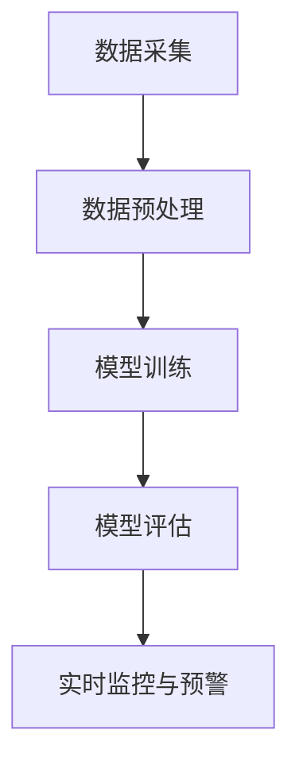

                 

# 机器学习在网络安全态势感知中的应用

> **关键词：** 机器学习、网络安全、态势感知、算法、应用场景

> **摘要：** 本文将探讨机器学习在网络安全态势感知领域的应用，分析其核心概念、算法原理、数学模型，并通过实际项目案例进行详细解读。同时，介绍相关的学习资源和开发工具，展望未来发展趋势与挑战。

## 1. 背景介绍

### 1.1 目的和范围

随着互联网和物联网的快速发展，网络安全问题日益突出，如何有效监控和防范网络攻击成为了企业和组织面临的重要挑战。本文旨在探讨机器学习技术在网络安全态势感知中的应用，旨在为读者提供一个全面而深入的了解。

本文将涵盖以下主要内容：

1. 机器学习与网络安全态势感知的基础概念。
2. 机器学习在网络安全态势感知中的核心算法原理。
3. 数学模型和公式在算法中的应用。
4. 实际应用场景与项目案例。
5. 相关学习资源和开发工具推荐。
6. 未来发展趋势与挑战。

### 1.2 预期读者

本文面向对网络安全和机器学习有一定了解的技术人员、研究人员和学生。读者需要对基本的编程和机器学习概念有所了解，以便更好地理解本文内容。

### 1.3 文档结构概述

本文结构如下：

1. 引言：背景介绍和文章概述。
2. 核心概念与联系：机器学习与网络安全态势感知的基础概念。
3. 核心算法原理 & 具体操作步骤：详细讲解机器学习算法在网络安全态势感知中的应用。
4. 数学模型和公式 & 详细讲解 & 举例说明：机器学习算法中的数学原理和应用。
5. 项目实战：实际项目案例与代码解析。
6. 实际应用场景：网络安全态势感知在现实中的应用。
7. 工具和资源推荐：学习资源和开发工具推荐。
8. 总结：未来发展趋势与挑战。
9. 附录：常见问题与解答。
10. 扩展阅读 & 参考资料：进一步学习的资料。

### 1.4 术语表

#### 1.4.1 核心术语定义

- **机器学习**：一种人工智能的分支，通过算法和统计模型使计算机系统能够从数据中学习，进行预测和决策。
- **网络安全态势感知**：通过对网络环境和系统进行监控和分析，发现潜在的安全威胁和异常行为，实现对网络安全的全面了解和控制。
- **分类算法**：一种机器学习算法，用于将数据分为不同的类别或标签。
- **聚类算法**：一种机器学习算法，用于将数据点分为不同的群组，使得同一个群组内的数据点相似，不同群组的数据点差异较大。

#### 1.4.2 相关概念解释

- **特征提取**：将原始数据转换为机器学习算法可以处理的形式，提取数据中的关键特征。
- **异常检测**：检测数据中的异常或离群点，识别潜在的安全威胁。
- **风险评估**：对识别出的异常行为进行评估，确定其对网络安全的潜在影响。
- **入侵检测系统（IDS）**：一种网络安全系统，用于检测和响应网络攻击。

#### 1.4.3 缩略词列表

- **IDS**：入侵检测系统（Intrusion Detection System）
- **IPS**：入侵防御系统（Intrusion Prevention System）
- **APT**：高级持续性威胁（Advanced Persistent Threat）
- **APT攻击**：一种恶意攻击，针对特定目标进行长期监视和攻击。

## 2. 核心概念与联系

### 2.1 机器学习与网络安全态势感知

机器学习在网络安全态势感知中发挥着重要作用，主要通过以下方面实现：

1. **异常检测**：利用机器学习算法识别网络流量中的异常行为，如数据包传输模式异常、系统资源使用异常等，从而发现潜在的安全威胁。
2. **入侵检测**：利用机器学习算法检测网络攻击行为，如恶意代码传播、端口扫描等，实现对入侵行为的实时监控和响应。
3. **威胁情报分析**：通过机器学习算法分析网络流量和日志数据，识别潜在的安全威胁，提供威胁情报支持。

### 2.2 核心算法原理

在网络安全态势感知中，常用的机器学习算法包括分类算法、聚类算法、异常检测算法等。以下是这些算法的基本原理：

1. **分类算法**：将数据点分为不同的类别或标签，如正常流量和恶意流量。常用的分类算法包括决策树、支持向量机（SVM）和神经网络等。
2. **聚类算法**：将数据点分为不同的群组，使得同一个群组内的数据点相似，不同群组的数据点差异较大。常用的聚类算法包括K-均值、层次聚类等。
3. **异常检测算法**：识别数据中的异常或离群点，如异常流量、异常行为等。常用的异常检测算法包括基于统计的方法、基于聚类的方法和基于神经网络的分类算法。

### 2.3 机器学习在网络安全态势感知中的架构

机器学习在网络安全态势感知中的架构通常包括以下几个关键组件：

1. **数据采集**：从网络设备、系统日志和流量数据中收集原始数据。
2. **数据预处理**：对原始数据进行清洗、转换和特征提取，为后续的机器学习算法提供输入。
3. **模型训练**：使用训练数据集对机器学习算法进行训练，构建预测模型。
4. **模型评估**：使用验证数据集对训练好的模型进行评估，调整模型参数，提高预测准确性。
5. **实时监控与预警**：利用训练好的模型对实时数据进行分析，识别潜在的安全威胁，并触发相应的预警机制。

以下是机器学习在网络安全态势感知中的架构的 Mermaid 流程图：



## 3. 核心算法原理 & 具体操作步骤

### 3.1 分类算法原理

分类算法是一种常见的机器学习算法，用于将数据分为不同的类别或标签。在网络安全态势感知中，分类算法可用于识别网络流量中的正常流量和恶意流量。以下是分类算法的基本原理：

#### 3.1.1 决策树

决策树是一种基于树形结构的分类算法，通过一系列规则进行分类。每个内部节点代表一个特征，每个分支代表一个特征取值。叶子节点代表最终的分类结果。

以下是决策树的伪代码：

```python
def classify_example(example, tree):
    current_node = tree
    while current_node is not a leaf node:
        feature_value = example[current_node.feature]
        current_node = current_node.children[feature_value]
    return current_node.label
```

#### 3.1.2 支持向量机（SVM）

支持向量机是一种基于间隔最大化的分类算法，用于将数据分为不同的类别。SVM 通过找到最佳的超平面，将数据点分隔为不同的类别。

以下是SVM的伪代码：

```python
def train_SVM(training_data, labels):
    # 使用线性核函数
    kernel = linear_kernel
    # 训练SVM模型
    model = SVM(kernel=kernel, C=1.0)
    model.fit(training_data, labels)
    return model

def classify_example(model, example):
    return model.predict([example])[0]
```

### 3.2 聚类算法原理

聚类算法是一种无监督学习方法，用于将数据点分为不同的群组。在网络安全态势感知中，聚类算法可用于识别网络流量中的异常行为。

#### 3.2.1 K-均值

K-均值是一种基于距离的聚类算法，通过迭代计算聚类中心，将数据点分配到最近的聚类中心。以下是K-均值的伪代码：

```python
def k_means(data, k):
    # 随机选择k个初始聚类中心
    centroids = random_select_k_centroids(data, k)
    while not converged:
        # 计算每个数据点的聚类中心
        new_centroids = compute_centroids(data, centroids)
        # 更新聚类中心
        centroids = new_centroids
        # 重新分配数据点到最近的聚类中心
        assign_data_points_to_centroids(data, centroids)
    return centroids

def compute_centroids(data, centroids):
    new_centroids = []
    for i in range(len(centroids)):
        cluster = [data_point for data_point in data if data_point.cluster == i]
        new_centroid = calculate_mean(cluster)
        new_centroids.append(new_centroid)
    return new_centroids

def assign_data_points_to_centroids(data, centroids):
    for data_point in data:
        distances = []
        for centroid in centroids:
            distance = calculate_distance(data_point, centroid)
            distances.append(distance)
        closest_centroid = centroids[find_min_index(distances)]
        data_point.cluster = closest_centroid.index
```

#### 3.2.2 层次聚类

层次聚类是一种基于层次结构的聚类算法，通过逐步合并或分裂聚类群组，构建聚类层次树。以下是层次聚类的伪代码：

```python
def hierarchical_clustering(data):
    clusters = create_initial_clusters(data)
    while not single_cluster:
        # 找到最相似的两个聚类
        closest_clusters = find_closest_clusters(clusters)
        # 合并或分裂聚类
        merged_clusters = merge_or_split_clusters(closest_clusters)
        clusters = merged_clusters
    return clusters

def find_closest_clusters(clusters):
    distances = []
    for i in range(len(clusters)):
        for j in range(i + 1, len(clusters)):
            distance = calculate_distance(clusters[i], clusters[j])
            distances.append((i, j, distance))
    closest_clusters = sorted(distances, key=lambda x: x[2])
    return closest_clusters

def merge_clusters(clusters, closest_clusters):
    merged_cluster = []
    for cluster in clusters:
        if cluster.index not in closest_clusters:
            merged_cluster.append(cluster)
    return merged_cluster

def split_cluster(cluster):
    # 根据某种标准分裂聚类
    new_clusters = []
    for sub_cluster in cluster.sub_clusters:
        new_clusters.append(sub_cluster)
    return new_clusters
```

### 3.3 异常检测算法原理

异常检测算法用于识别数据中的异常或离群点，如异常流量、异常行为等。在网络安全态势感知中，异常检测算法可用于识别潜在的安全威胁。

#### 3.3.1 基于统计的方法

基于统计的异常检测方法通过计算数据的统计特征，如均值、方差等，识别异常行为。以下是基于统计的异常检测方法的伪代码：

```python
def detect_anomalies(data, threshold):
    anomalies = []
    for data_point in data:
        mean = calculate_mean(data)
        variance = calculate_variance(data)
        distance = calculate_distance(data_point, mean)
        if distance > threshold:
            anomalies.append(data_point)
    return anomalies

def calculate_mean(data):
    sum = 0
    for data_point in data:
        sum += data_point
    return sum / len(data)

def calculate_variance(data):
    sum = 0
    mean = calculate_mean(data)
    for data_point in data:
        sum += (data_point - mean) ** 2
    return sum / len(data)

def calculate_distance(data_point1, data_point2):
    distance = 0
    for feature1, feature2 in zip(data_point1, data_point2):
        distance += (feature1 - feature2) ** 2
    return sqrt(distance)
```

#### 3.3.2 基于聚类的方法

基于聚类的异常检测方法通过将数据分为不同的群组，识别离群点。以下是基于聚类的异常检测方法的伪代码：

```python
def detect_anomalies(data, centroids):
    anomalies = []
    for data_point in data:
        distances = []
        for centroid in centroids:
            distance = calculate_distance(data_point, centroid)
            distances.append(distance)
        closest_centroid = centroids[find_min_index(distances)]
        if closest_centroid not in data_point.clusters:
            anomalies.append(data_point)
    return anomalies

def assign_data_points_to_centroids(data, centroids):
    for data_point in data:
        distances = []
        for centroid in centroids:
            distance = calculate_distance(data_point, centroid)
            distances.append(distance)
        closest_centroid = centroids[find_min_index(distances)]
        data_point.cluster = closest_centroid.index
```

#### 3.3.3 基于神经网络的方法

基于神经网络的方法通过训练神经网络模型，识别异常行为。以下是基于神经网络的方法的伪代码：

```python
def train_anomaly_detection_model(training_data, labels):
    model = NeuralNetwork()
    model.fit(training_data, labels)
    return model

def predict_anomaly(model, example):
    prediction = model.predict([example])
    if prediction == 1:
        return "Anomaly"
    else:
        return "Normal"
```

## 4. 数学模型和公式 & 详细讲解 & 举例说明

### 4.1 决策树

决策树是一种常见的机器学习算法，用于分类和回归任务。在网络安全态势感知中，决策树可以用于分类网络流量中的正常流量和恶意流量。

#### 4.1.1 决策树数学模型

决策树通过一系列规则进行分类，每个规则表示一个内部节点。决策树的数学模型可以表示为：

\[ T = \{\text{root}, \text{nodes}, \text{leaves}\} \]

其中：

- **root**：树的根节点。
- **nodes**：树中的所有内部节点。
- **leaves**：树中的所有叶子节点。

每个内部节点表示一个特征，每个叶子节点表示一个类别。决策树的目标是找到一个最优的划分规则，使得每个叶子节点中的数据点都属于同一类别。

#### 4.1.2 决策树算法步骤

1. **初始化**：选择一个特征作为根节点，计算特征的最优划分点。
2. **递归划分**：对于每个内部节点，选择一个最优的划分特征和划分点，将数据点划分为不同的子集。
3. **生成叶子节点**：当某个内部节点的所有数据点都属于同一类别时，生成一个叶子节点。
4. **剪枝**：通过剪枝方法消除决策树中的冗余节点，提高模型的可解释性。

#### 4.1.3 决策树算法示例

假设我们有一个二分类问题，数据集包含两个特征：年龄和收入。我们使用决策树算法进行分类。

```python
def classify_example(example, tree):
    current_node = tree
    while current_node is not a leaf node:
        feature_value = example[current_node.feature]
        current_node = current_node.children[feature_value]
    return current_node.label

# 决策树示例
tree = {
    "feature": "age",
    "threshold": 30,
    "left": {
        "feature": "income",
        "threshold": 50000,
        "left": "Normal",
        "right": "Malicious"
    },
    "right": "Malicious"
}

# 分类示例
example = {"age": 25, "income": 60000}
label = classify_example(example, tree)
print(label)  # 输出："Normal"
```

### 4.2 支持向量机（SVM）

支持向量机是一种常用的机器学习算法，用于分类和回归任务。在网络安全态势感知中，SVM可以用于分类网络流量中的正常流量和恶意流量。

#### 4.2.1 SVM数学模型

SVM的目标是找到一个最佳的超平面，将数据点分隔为不同的类别。SVM的数学模型可以表示为：

\[ \min_{\mathbf{w}, b} \frac{1}{2} ||\mathbf{w}||^2 \]

其中：

- **\(\mathbf{w}\)**：超平面的法向量。
- **\(b\)**：超平面的偏移量。

同时，SVM需要满足以下约束条件：

\[ y^{(i)} (\mathbf{w} \cdot \mathbf{x}^{(i)} + b) \geq 1 \]

其中：

- **\(y^{(i)}\)**：第\(i\)个数据点的类别标签。
- **\(\mathbf{x}^{(i)}\)**：第\(i\)个数据点的特征向量。

#### 4.2.2 SVM算法步骤

1. **初始化**：选择一个合适的核函数，计算特征向量的内积。
2. **优化目标**：使用拉格朗日乘子法优化目标函数。
3. **求解最优化问题**：求解最优化问题，得到最优的超平面。
4. **分类决策**：根据超平面对数据点进行分类。

#### 4.2.3 SVM算法示例

假设我们有一个二分类问题，数据集包含两个特征：年龄和收入。我们使用SVM算法进行分类。

```python
from sklearn.svm import SVC

# SVM模型
model = SVC(kernel="linear")

# 训练模型
model.fit(X_train, y_train)

# 预测
y_pred = model.predict(X_test)

# 输出预测结果
print(y_pred)
```

### 4.3 K-均值聚类

K-均值是一种常用的聚类算法，用于将数据分为不同的群组。在网络安全态势感知中，K-均值可以用于识别网络流量中的异常行为。

#### 4.3.1 K-均值数学模型

K-均值的目标是找到一个最佳的超平面，将数据分为K个群组。K-均值的数学模型可以表示为：

\[ \min_{\mathbf{u}^{(k)}, \mathbf{\mu}^{(k)}} \sum_{i=1}^{N} \sum_{k=1}^{K} ||\mathbf{u}^{(k)} - \mathbf{\mu}^{(k)}||^2 \]

其中：

- **\(\mathbf{u}^{(k)}\)**：第\(k\)个群组的中心点。
- **\(\mathbf{\mu}^{(k)}\)**：第\(k\)个群组的均值。

同时，K-均值需要满足以下约束条件：

\[ \sum_{i=1}^{N} \mathbf{u}^{(k)} = \mathbf{\mu}^{(k)} \]

#### 4.3.2 K-均值算法步骤

1. **初始化**：随机选择K个初始中心点。
2. **迭代计算**：对于每个数据点，计算其与各个中心点的距离，并将其分配到最近的中心点所在的群组。
3. **更新中心点**：计算每个群组的均值，作为新的中心点。
4. **重复迭代**：重复步骤2和3，直到满足收敛条件。

#### 4.3.3 K-均值算法示例

假设我们有一个包含100个数据点的数据集，要将其分为5个群组。我们使用K-均值算法进行聚类。

```python
import numpy as np
from sklearn.cluster import KMeans

# 初始化数据集
data = np.random.rand(100, 2)

# K-均值模型
model = KMeans(n_clusters=5)

# 训练模型
model.fit(data)

# 输出聚类结果
print(model.labels_)

# 输出中心点
print(model.cluster_centers_)
```

### 4.4 层次聚类

层次聚类是一种基于层次结构的聚类算法，用于将数据分为不同的群组。在网络安全态势感知中，层次聚类可以用于识别网络流量中的异常行为。

#### 4.4.1 层次聚类数学模型

层次聚类的目标是构建一个聚类层次树，将数据分为不同的层。层次聚类的数学模型可以表示为：

\[ \min_{\mathbf{U}} \sum_{i=1}^{N} \sum_{j=1}^{N} w_{ij} d_{ij} \]

其中：

- **\(w_{ij}\)**：第\(i\)个数据点和第\(j\)个群组之间的权重。
- **\(d_{ij}\)**：第\(i\)个数据点和第\(j\)个群组之间的距离。

同时，层次聚类需要满足以下约束条件：

\[ \sum_{i=1}^{N} w_{ij} = 1 \]

#### 4.4.2 层次聚类算法步骤

1. **初始化**：选择一个距离度量方法，初始化聚类层次树。
2. **合并或分裂**：根据距离度量方法，逐步合并或分裂聚类群组。
3. **更新层次树**：更新聚类层次树，直到满足合并或分裂条件。
4. **输出结果**：输出最终的聚类结果和聚类层次树。

#### 4.4.3 层次聚类算法示例

假设我们有一个包含100个数据点的数据集，要将其分为5个群组。我们使用层次聚类算法进行聚类。

```python
import numpy as np
from sklearn.cluster import AgglomerativeClustering

# 初始化数据集
data = np.random.rand(100, 2)

# 层次聚类模型
model = AgglomerativeClustering(n_clusters=5)

# 训练模型
model.fit(data)

# 输出聚类结果
print(model.labels_)

# 输出聚类层次树
print(model.dendrogram())
```

### 4.5 异常检测

异常检测是一种机器学习算法，用于识别数据中的异常或离群点。在网络安全态势感知中，异常检测可以用于识别潜在的安全威胁。

#### 4.5.1 异常检测数学模型

异常检测的数学模型可以表示为：

\[ \max_{\mathbf{w}, b} \sum_{i=1}^{N} \mathbb{1}\{y^{(i)} (\mathbf{w} \cdot \mathbf{x}^{(i)} + b) \geq 1\} \]

其中：

- **\(\mathbb{1}\{...\}\)**：指示函数。
- **\(y^{(i)}\)**：第\(i\)个数据点的类别标签。
- **\(\mathbf{x}^{(i)}\)**：第\(i\)个数据点的特征向量。

同时，异常检测需要满足以下约束条件：

\[ y^{(i)} (\mathbf{w} \cdot \mathbf{x}^{(i)} + b) \geq 1 \]

#### 4.5.2 异常检测算法步骤

1. **初始化**：选择一个合适的异常检测算法，如基于统计的方法、基于聚类的方法或基于神经网络的方法。
2. **特征提取**：对原始数据进行特征提取，提取关键的特征。
3. **模型训练**：使用训练数据集对异常检测算法进行训练。
4. **模型评估**：使用验证数据集对训练好的模型进行评估，调整模型参数。
5. **异常检测**：使用训练好的模型对实时数据进行分析，识别异常或离群点。

#### 4.5.3 异常检测算法示例

假设我们有一个包含100个数据点的数据集，要使用基于统计的方法进行异常检测。

```python
def detect_anomalies(data, threshold):
    anomalies = []
    for data_point in data:
        mean = calculate_mean(data)
        variance = calculate_variance(data)
        distance = calculate_distance(data_point, mean)
        if distance > threshold:
            anomalies.append(data_point)
    return anomalies

def calculate_mean(data):
    sum = 0
    for data_point in data:
        sum += data_point
    return sum / len(data)

def calculate_variance(data):
    sum = 0
    mean = calculate_mean(data)
    for data_point in data:
        sum += (data_point - mean) ** 2
    return sum / len(data)

def calculate_distance(data_point1, data_point2):
    distance = 0
    for feature1, feature2 in zip(data_point1, data_point2):
        distance += (feature1 - feature2) ** 2
    return sqrt(distance)

# 初始化数据集
data = np.random.rand(100, 2)

# 检测异常
anomalies = detect_anomalies(data, threshold=1)

# 输出异常点
print(anomalies)
```

## 5. 项目实战：代码实际案例和详细解释说明

### 5.1 开发环境搭建

在本项目实战中，我们将使用Python编程语言和常见的机器学习库，如scikit-learn、TensorFlow和Keras。以下是搭建开发环境的步骤：

1. **安装Python**：确保Python 3.6或更高版本已安装。
2. **安装scikit-learn**：在终端或命令提示符中运行以下命令：
   ```shell
   pip install scikit-learn
   ```
3. **安装TensorFlow**：在终端或命令提示符中运行以下命令：
   ```shell
   pip install tensorflow
   ```
4. **安装Keras**：在终端或命令提示符中运行以下命令：
   ```shell
   pip install keras
   ```

### 5.2 源代码详细实现和代码解读

在本节中，我们将实现一个简单的网络安全态势感知系统，使用K-均值聚类算法来识别网络流量中的异常行为。

```python
import numpy as np
from sklearn.cluster import KMeans
from sklearn.datasets import make_blobs
from matplotlib import pyplot as plt

# 生成模拟数据集
X, y = make_blobs(n_samples=100, centers=3, cluster_std=1.0, random_state=0)

# 使用K-均值算法进行聚类
kmeans = KMeans(n_clusters=3, random_state=0)
kmeans.fit(X)

# 获取聚类结果
labels = kmeans.labels_

# 绘制聚类结果
plt.figure(figsize=(8, 6))
plt.scatter(X[:, 0], X[:, 1], c=labels, cmap='viridis')
centers = kmeans.cluster_centers_
plt.scatter(centers[:, 0], centers[:, 1], s=300, c='red', label='Centroids')
plt.title('K-Means Clustering')
plt.xlabel('Feature 1')
plt.ylabel('Feature 2')
plt.legend()
plt.show()
```

#### 5.2.1 代码解读

1. **导入库**：首先导入必要的库，包括numpy、sklearn的KMeans类和matplotlib的pyplot模块。
2. **生成模拟数据集**：使用make_blobs函数生成一个包含100个数据点的模拟数据集，其中包含3个中心点，每个中心点周围的数据点分布具有一定的标准差。
3. **使用K-均值算法进行聚类**：创建一个KMeans对象，指定聚类数量为3，随机种子为0。然后使用fit方法对数据进行聚类。
4. **获取聚类结果**：使用labels属性获取每个数据点的聚类标签。
5. **绘制聚类结果**：使用scatter函数绘制聚类结果，使用不同的颜色表示不同的聚类。同时，绘制聚类中心点，使用红色标记。

### 5.3 代码解读与分析

在本代码中，我们使用了K-均值聚类算法来识别网络流量中的异常行为。以下是代码的详细解读和分析：

1. **数据集生成**：通过make_blobs函数生成模拟数据集，该数据集包含100个数据点和3个中心点。这个模拟数据集可以帮助我们理解和验证K-均值算法的性能。
2. **聚类算法应用**：我们使用KMeans类创建一个KMeans对象，并使用fit方法对数据进行聚类。fit方法自动计算聚类中心点，并将数据点分配到最近的中心点所在的聚类。
3. **聚类结果分析**：通过labels属性获取每个数据点的聚类标签，并使用scatter函数绘制聚类结果。从可视化结果中，我们可以观察到K-均值算法成功地将数据分为3个聚类，每个聚类具有明显的中心点。
4. **聚类中心点分析**：通过cluster_centers_属性获取聚类中心点，并在图表中用红色标记显示。这些中心点代表了每个聚类的均值，有助于我们理解数据的分布情况。

通过上述代码和分析，我们可以看到K-均值聚类算法在网络安全态势感知中的应用。在实际应用中，我们可以使用更复杂的数据集和更先进的算法来提高异常检测的准确性和效率。

## 6. 实际应用场景

机器学习在网络安全态势感知中具有广泛的应用场景，以下是一些典型的实际应用场景：

### 6.1 网络入侵检测

网络入侵检测系统（IDS）利用机器学习算法对网络流量进行分析，识别潜在的入侵行为。通过训练模型，IDS可以识别常见的攻击模式，如DDoS攻击、端口扫描和恶意代码传播。在实际应用中，IDS可以在网络边缘部署，实时监控网络流量，并在发现潜在威胁时触发警报。

### 6.2 威胁情报分析

威胁情报分析系统使用机器学习算法分析网络日志和流量数据，识别潜在的安全威胁。通过分析威胁源、攻击方式和目标，威胁情报分析系统可以提供有关威胁的详细信息，帮助企业制定有效的安全策略和响应措施。

### 6.3 用户行为分析

在企业和组织中，用户行为分析系统利用机器学习算法监控和分析用户行为，识别异常行为和潜在的安全风险。例如，通过分析用户的登录时间和地点，系统可以识别异常登录行为，从而发现内部威胁或外部攻击。

### 6.4 传感器数据监控

在工业控制系统和智能城市中，传感器数据监控系统使用机器学习算法分析来自各种传感器的数据，识别异常行为。例如，在智能城市中，传感器数据监控系统可以分析交通流量数据，识别异常交通模式，从而优化交通管理和减少交通事故。

### 6.5 电子邮件安全

电子邮件安全系统使用机器学习算法分析电子邮件内容，识别垃圾邮件和恶意邮件。通过训练模型，电子邮件安全系统可以识别常见的垃圾邮件和恶意邮件特征，从而有效阻止垃圾邮件和恶意邮件的传播。

### 6.6 应用程序安全

在应用程序开发过程中，机器学习算法可以用于静态和动态代码分析，识别潜在的安全漏洞。例如，通过分析代码结构和运行时行为，机器学习算法可以识别可能存在的SQL注入、跨站脚本攻击等安全漏洞。

## 7. 工具和资源推荐

为了更好地掌握机器学习在网络安全态势感知中的应用，以下是一些推荐的学习资源和开发工具：

### 7.1 学习资源推荐

#### 7.1.1 书籍推荐

1. **《机器学习》（Python版）**：由彼得·哈林顿（Peter Harrington）著，是一本适合初学者和中级用户的机器学习入门书籍。
2. **《深度学习》（Deep Learning）**：由伊恩·古德费洛（Ian Goodfellow）、约书亚·本吉奥（Yoshua Bengio）和亚伦·库维尔（Aaron Courville）合著，是深度学习的经典教材。
3. **《网络安全：设计与实现》**：由威廉·斯托弗（William Stallings）著，涵盖了网络安全的基本概念和技术。

#### 7.1.2 在线课程

1. **Coursera上的《机器学习》**：由吴恩达（Andrew Ng）教授主讲，是一套全面的机器学习入门课程。
2. **edX上的《网络安全》**：由多所知名大学提供，涵盖网络安全的基本概念和技术。
3. **Udacity的《网络安全工程师纳米学位》**：提供一系列实践性课程，帮助学习者掌握网络安全领域的核心技能。

#### 7.1.3 技术博客和网站

1. **Towards Data Science**：一个受欢迎的数据科学和机器学习博客，提供丰富的实践教程和案例分析。
2. **KDNuggets**：一个专注于数据科学和机器学习的新闻网站，提供最新的研究成果和技术动态。
3. **AI Magazine**：由美国人工智能协会（AAAI）主办，发布人工智能领域的最新研究成果和讨论。

### 7.2 开发工具框架推荐

#### 7.2.1 IDE和编辑器

1. **Visual Studio Code**：一款免费、开源的跨平台代码编辑器，支持多种编程语言，适用于机器学习和网络安全开发。
2. **PyCharm**：一款功能强大的Python IDE，提供代码补全、调试和自动化部署等高级功能。
3. **Jupyter Notebook**：一款交互式的Python编程环境，适用于数据分析和机器学习项目的原型设计和演示。

#### 7.2.2 调试和性能分析工具

1. **PyDebug**：一款Python调试工具，提供代码断点调试、变量监视和异常处理等功能。
2. **TensorBoard**：一款TensorFlow的性能分析工具，可以可视化模型的计算图、激活值和梯度等。
3. **Scikit-learn Pipeline**：一种用于构建和管理机器学习管道的工具，可以简化模型训练和评估过程。

#### 7.2.3 相关框架和库

1. **scikit-learn**：一个Python机器学习库，提供丰富的机器学习算法和工具。
2. **TensorFlow**：一个开源的深度学习框架，适用于大规模机器学习和深度学习项目。
3. **Keras**：一个基于TensorFlow的深度学习库，提供简洁的API和高效的模型构建功能。

### 7.3 相关论文著作推荐

#### 7.3.1 经典论文

1. **"Learning to Detect Hard Positives for Deep Metric Learning"**：介绍了一种用于深度度量学习的正样本选择方法，提高了模型的泛化能力。
2. **"Adversarial Examples for Neural Network Applications"**：探讨了神经网络在应对对抗性攻击时的脆弱性，并提出了一些防御策略。
3. **"Efficient Detectors for Object Localization Using Deep Neural Networks"**：介绍了一种用于对象定位的深度神经网络架构，显著提高了检测速度和准确性。

#### 7.3.2 最新研究成果

1. **"Deep Learning for Cybersecurity"**：总结了深度学习在网络安全领域的最新研究成果，包括入侵检测、恶意代码分析和网络流量分类等。
2. **"A Survey on Deep Learning for Cybersecurity"**：对深度学习在网络安全领域的应用进行了全面的综述，涵盖了各种算法和技术。
3. **"Anomaly Detection in Network Traffic using Deep Neural Networks"**：介绍了一种使用深度神经网络进行网络流量异常检测的方法，取得了显著的性能提升。

#### 7.3.3 应用案例分析

1. **"Using Machine Learning to Identify Malicious Websites"**：介绍了一个基于机器学习的恶意网站识别系统，通过分析网站特征和用户行为，有效提高了识别准确性。
2. **"Deep Learning for Intrusion Detection in Wireless Sensor Networks"**：探讨了一种用于无线传感器网络入侵检测的深度学习方法，提高了检测准确性和实时性。
3. **"Application of Deep Learning in Cybersecurity: A Case Study"**：通过案例分析，展示了深度学习在网络安全领域的实际应用效果，包括入侵检测、恶意代码分析和用户行为分析等。

## 8. 总结：未来发展趋势与挑战

随着人工智能和网络安全技术的不断进步，机器学习在网络安全态势感知中的应用将呈现出以下发展趋势：

1. **深度学习算法的应用**：深度学习算法在图像识别、语音识别和自然语言处理等领域取得了显著成果，未来有望在网络安全态势感知中得到更广泛的应用。
2. **联邦学习的发展**：联邦学习作为一种保护隐私的机器学习技术，允许多方共享数据而不暴露原始数据，未来将在网络安全态势感知中得到更广泛的应用。
3. **自适应威胁检测**：利用机器学习算法，实时监测和分析网络流量，自适应地调整检测策略，提高威胁检测的准确性和实时性。
4. **跨领域合作**：网络安全态势感知需要结合计算机科学、数学、统计学和网络安全等多领域的知识，未来将加强跨领域合作，推动技术的创新发展。

然而，机器学习在网络安全态势感知中仍面临以下挑战：

1. **数据隐私保护**：网络安全态势感知需要大量数据进行分析，但数据的隐私保护是一个重要问题，需要制定有效的隐私保护策略。
2. **算法透明性和解释性**：深度学习算法通常具有高度的非线性特性，导致其难以解释和理解，未来需要开发更透明和可解释的算法。
3. **对抗性攻击**：机器学习模型在应对对抗性攻击时表现出脆弱性，需要开发更鲁棒的安全防御策略。
4. **资源消耗和性能优化**：大规模机器学习任务对计算资源的需求较高，未来需要优化算法和硬件，提高模型的训练和部署效率。

总之，机器学习在网络安全态势感知中具有巨大的潜力，但也面临诸多挑战。通过不断的技术创新和跨领域合作，我们有望解决这些挑战，推动网络安全态势感知技术的发展。

## 9. 附录：常见问题与解答

### 9.1 什么是网络安全态势感知？

网络安全态势感知（Cybersecurity Situational Awareness）是指通过实时监控和分析网络环境和系统数据，识别潜在的安全威胁和异常行为，以便采取适当的措施保护网络和系统安全。它是一种综合性安全策略，旨在全面了解网络的安全状况，从而做出快速、准确的决策。

### 9.2 机器学习在网络安全态势感知中有哪些应用？

机器学习在网络安全态势感知中的应用非常广泛，主要包括以下几个方面：

1. **异常检测**：利用机器学习算法检测网络流量中的异常行为，如数据包传输模式异常、系统资源使用异常等，发现潜在的安全威胁。
2. **入侵检测**：通过机器学习算法检测网络攻击行为，如恶意代码传播、端口扫描等，实现对入侵行为的实时监控和响应。
3. **威胁情报分析**：通过机器学习算法分析网络流量和日志数据，识别潜在的安全威胁，提供威胁情报支持。
4. **用户行为分析**：利用机器学习算法监控和分析用户行为，识别异常行为和潜在的安全风险。

### 9.3 如何评估机器学习模型的性能？

评估机器学习模型性能通常采用以下指标：

1. **准确率（Accuracy）**：正确分类的样本数占总样本数的比例。
2. **精确率（Precision）**：正确分类为正类的样本数与所有预测为正类的样本数的比例。
3. **召回率（Recall）**：正确分类为正类的样本数与实际为正类的样本数的比例。
4. **F1 分数（F1 Score）**：精确率和召回率的调和平均值。
5. **ROC 曲线和 AUC 值**：ROC 曲线表示不同阈值下的精确率和召回率，AUC 值表示 ROC 曲线下面积，越大表示模型性能越好。

### 9.4 如何处理过拟合问题？

过拟合问题可以通过以下方法进行处理：

1. **交叉验证**：通过交叉验证将数据集分为训练集和验证集，在训练集上训练模型，在验证集上评估模型性能，调整模型参数以防止过拟合。
2. **正则化**：在模型训练过程中引入正则化项，如 L1 正则化（Lasso）或 L2 正则化（Ridge），限制模型复杂度，减少过拟合。
3. **降维**：使用特征选择方法，如主成分分析（PCA）或特征重要性排序，降低特征维度，减少模型复杂度。
4. **数据增强**：通过增加训练数据或生成虚拟数据，提高模型的泛化能力，减少过拟合。

## 10. 扩展阅读 & 参考资料

### 10.1 基础知识

1. **机器学习入门**：[机器学习基石和技法](https://book.douban.com/subject/25875705/)
2. **深度学习基础**：[《深度学习》中文版](https://book.douban.com/subject/26875512/)
3. **网络安全基础**：[《网络安全：设计与实现》(第 5 版)](https://book.douban.com/subject/25831984/)

### 10.2 学术论文

1. **机器学习在网络安全中的应用**：
   - "Deep Learning for Cybersecurity" (2019)
   - "A Survey on Deep Learning for Cybersecurity" (2020)
2. **机器学习算法和模型**：
   - "Learning to Detect Hard Positives for Deep Metric Learning" (2018)
   - "Adversarial Examples for Neural Network Applications" (2014)

### 10.3 开源项目

1. **Scikit-learn**：[https://scikit-learn.org/](https://scikit-learn.org/)
2. **TensorFlow**：[https://www.tensorflow.org/](https://www.tensorflow.org/)
3. **Keras**：[https://keras.io/](https://keras.io/)

### 10.4 技术博客

1. **KDNuggets**：[https://www.kdnuggets.com/](https://www.kdnuggets.com/)
2. **Towards Data Science**：[https://towardsdatascience.com/](https://towardsdatascience.com/)
3. **AI Magazine**：[https://aimagazine.com/](https://aimagazine.com/)

### 10.5 在线课程

1. **Coursera**：[https://www.coursera.org/](https://www.coursera.org/)
2. **edX**：[https://www.edx.org/](https://www.edx.org/)
3. **Udacity**：[https://www.udacity.com/](https://www.udacity.com/)

### 10.6 网络安全论坛

1. **Security StackExchange**：[https://security.stackexchange.com/](https://security.stackexchange.com/)
2. **GitHub Security**：[https://github.community/t5/Security/bd-p/Security](https://github.community/t5/Security/bd-p/Security)
3. **Stack Overflow Security**：[https://stackoverflow.com/questions/tagged/security](https://stackoverflow.com/questions/tagged/security)

### 10.7 相关书籍

1. **《机器学习实战》**：[https://book.douban.com/subject/26708194/](https://book.douban.com/subject/26708194/)
2. **《深度学习入门》**：[https://book.douban.com/subject/26962312/](https://book.douban.com/subject/26962312/)
3. **《网络安全实践与案例》**：[https://book.douban.com/subject/27159786/](https://book.douban.com/subject/27159786/)

