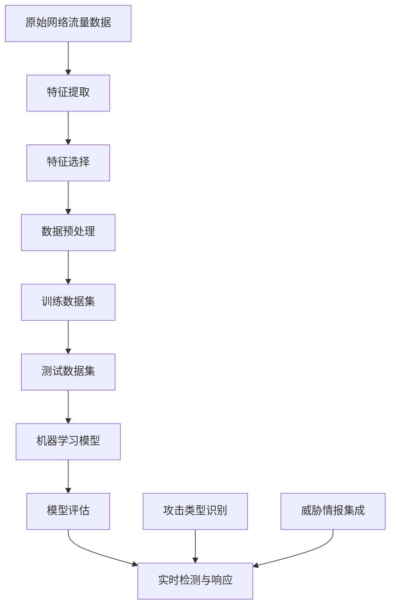

                 

### 1. 背景介绍

#### 1.1 目的和范围

本篇文章将深入探讨机器学习在网络流量异常检测中的实时应用。网络流量异常检测是网络安全领域的一项重要任务，旨在识别并预防潜在的网络攻击、恶意行为或异常流量。随着网络攻击手段的日益复杂和多样化，传统的基于规则的方法已难以满足实际需求，而机器学习技术因其强大的自适应能力和数据处理能力，成为了解决这一问题的有效手段。

本文的主要目的是：

1. **概述网络流量异常检测的背景和重要性**。
2. **介绍机器学习的基本概念及其在流量异常检测中的应用**。
3. **详细探讨核心算法原理、数学模型以及项目实战案例**。
4. **分析实际应用场景，并推荐相关工具和资源**。

文章将涵盖以下内容：

- **背景介绍**：讨论网络流量异常检测的重要性以及机器学习技术的基本概念。
- **核心概念与联系**：通过Mermaid流程图展示相关概念和架构。
- **核心算法原理**：详细解析常见的机器学习算法，并使用伪代码进行阐述。
- **数学模型和公式**：介绍支持向量机（SVM）等数学模型，并使用LaTeX格式展示公式。
- **项目实战**：提供代码实际案例和详细解释说明。
- **实际应用场景**：分析机器学习在网络流量异常检测中的具体应用。
- **工具和资源推荐**：推荐学习资源、开发工具和框架。
- **总结与展望**：讨论未来发展趋势与挑战。
- **常见问题与解答**：针对读者可能遇到的问题进行解答。
- **扩展阅读**：提供相关的扩展阅读资料。

通过本篇文章的阅读，读者可以系统地了解机器学习在网络流量异常检测中的实时应用，掌握核心算法原理和实际操作技巧，为相关领域的研究和应用提供参考。

#### 1.2 预期读者

本文面向以下读者群体：

1. **网络安全工程师**：需要了解如何利用机器学习技术提升网络流量异常检测能力的专业人士。
2. **机器学习工程师**：希望将机器学习技术应用于网络安全领域的工程师和研究者。
3. **数据分析师**：对网络流量数据进行分析，并利用机器学习技术进行异常检测的专业人士。
4. **计算机科学学生**：对机器学习和网络安全领域感兴趣的学生，希望深入学习和理解相关技术。
5. **技术爱好者**：对最新技术趋势和应用场景感兴趣的爱好者，希望了解机器学习在网络安全领域的应用。

本文将尽量使用通俗易懂的语言和实例，使不同背景的读者都能理解和掌握相关知识。同时，对于一些复杂的概念和技术，也会通过具体案例分析进行详细讲解，帮助读者更好地理解和应用。

#### 1.3 文档结构概述

本文分为十个主要部分，每个部分都旨在帮助读者逐步了解机器学习在网络流量异常检测中的实时应用。

1. **背景介绍**：介绍网络流量异常检测的重要性和机器学习技术的基本概念。
2. **核心概念与联系**：通过Mermaid流程图展示相关概念和架构。
3. **核心算法原理**：详细解析常见的机器学习算法，并使用伪代码进行阐述。
4. **数学模型和公式**：介绍支持向量机（SVM）等数学模型，并使用LaTeX格式展示公式。
5. **项目实战**：提供代码实际案例和详细解释说明。
6. **实际应用场景**：分析机器学习在网络流量异常检测中的具体应用。
7. **工具和资源推荐**：推荐学习资源、开发工具和框架。
8. **总结与展望**：讨论未来发展趋势与挑战。
9. **常见问题与解答**：针对读者可能遇到的问题进行解答。
10. **扩展阅读**：提供相关的扩展阅读资料。

通过本文的阅读，读者可以系统地掌握机器学习在网络流量异常检测中的实时应用，具备实际操作能力和深入理解。

#### 1.4 术语表

在本篇文章中，我们使用了一些专业术语。以下是对这些术语的定义和解释：

##### 1.4.1 核心术语定义

- **网络流量异常检测**：指通过分析网络流量数据，识别出不符合正常流量模式的流量，从而发现潜在的网络攻击或异常行为。
- **机器学习**：一种人工智能技术，通过从数据中学习规律和模式，从而对未知数据进行预测或分类。
- **特征工程**：指从原始数据中提取出有用的特征，以供机器学习模型训练使用。
- **支持向量机（SVM）**：一种监督学习算法，用于分类和回归任务，通过最大化分类边界来提高模型的准确性。
- **异常检测算法**：用于检测数据集中异常值或异常模式的算法，包括基于统计、基于聚类和基于隔离等方法。

##### 1.4.2 相关概念解释

- **正常流量模式**：指网络流量在正常情况下的统计特性，如流量速率、流量大小、协议类型等。
- **异常流量模式**：指与正常流量模式不符的流量特征，可能是网络攻击、恶意行为或其他异常情况。
- **训练数据集**：用于训练机器学习模型的样本数据集，通常包括正常流量数据和异常流量数据。
- **测试数据集**：用于测试模型性能的数据集，通常不包括在训练数据集中的样本。
- **模型评估指标**：用于评估模型性能的指标，如准确率、召回率、F1分数等。

##### 1.4.3 缩略词列表

- **SVM**：支持向量机（Support Vector Machine）
- **PCA**：主成分分析（Principal Component Analysis）
- **KNN**：K近邻算法（K-Nearest Neighbors）
- **ML**：机器学习（Machine Learning）
- **AI**：人工智能（Artificial Intelligence）
- **IDS**：入侵检测系统（Intrusion Detection System）
- **IPS**：入侵防御系统（Intrusion Prevention System）

通过上述术语的定义和解释，读者可以更好地理解本文中的专业术语，为后续内容的学习打下基础。

### 2. 核心概念与联系

在深入探讨机器学习在网络流量异常检测中的实时应用之前，我们需要先理解一些核心概念及其相互联系。为了清晰展示这些概念和架构，我们将使用Mermaid流程图进行说明。

以下是一个简单的Mermaid流程图，展示网络流量异常检测中的关键概念：



下面是对这个Mermaid流程图的详细解释：

- **A[原始网络流量数据]**：网络流量数据是异常检测的基础。这些数据可以来自各种网络设备，如防火墙、入侵检测系统（IDS）和入侵防御系统（IPS）。原始数据通常包括数据包的源IP、目的IP、端口号、协议类型、流量速率等信息。
  
- **B[特征提取]**：从原始数据中提取出有用的特征，如流量速率的波动、连接的持续时间、数据包的分布等。这些特征用于描述网络流量的行为模式。

- **C[特征选择]**：从提取出的特征中选择对异常检测最具代表性的特征。特征选择是提高模型性能和降低计算复杂度的重要步骤。

- **D[数据预处理]**：对数据进行标准化、去噪、缺失值填充等处理，确保数据的质量和一致性。

- **E[训练数据集]**：用于训练机器学习模型的样本数据集，通常包括正常流量数据和异常流量数据。训练数据集的质量直接影响模型的性能。

- **F[测试数据集]**：用于测试模型性能的数据集，通常不包括在训练数据集中的样本。测试数据集用于评估模型的泛化能力。

- **G[机器学习模型]**：选择合适的机器学习算法，如支持向量机（SVM）、K近邻（KNN）等，构建异常检测模型。模型训练过程中，模型从训练数据集中学习正常流量和异常流量的特征。

- **H[模型评估]**：使用测试数据集对模型进行评估，计算模型的准确率、召回率、F1分数等评估指标，以评估模型的性能。

- **I[实时检测与响应]**：将训练好的模型应用于实时网络流量数据，检测异常流量。如果检测到异常，系统将采取相应的响应措施，如报警、阻断恶意流量等。

- **J[攻击类型识别]**：通过分析异常流量，识别出具体的攻击类型，如DDoS攻击、恶意软件传播等。

- **K[威胁情报集成]**：将实时检测到的异常流量与现有的威胁情报进行比对，提高检测的准确性和响应速度。

通过上述Mermaid流程图，我们可以清晰地看到网络流量异常检测中各个关键环节及其相互关系。接下来的章节将详细讨论这些核心概念和架构，并提供具体的算法原理和实施步骤。

### 3. 核心算法原理 & 具体操作步骤

在了解核心概念与联系的基础上，本章节将深入探讨机器学习在网络流量异常检测中的核心算法原理和具体操作步骤。机器学习算法的选择和实现对于流量异常检测的效果至关重要，因此我们将详细解析支持向量机（SVM）、K近邻（KNN）等常见算法，并提供详细的伪代码和操作步骤。

#### 支持向量机（SVM）

支持向量机是一种有效的二分类算法，它通过找到一个最优的超平面，将不同类别的数据点分开。在流量异常检测中，SVM可以用于将正常流量和异常流量进行分类。

##### 算法原理

SVM的核心思想是最大化分类边界。给定一个训练数据集，其中每个数据点都可以表示为一个二维向量，SVM的目标是找到一个超平面，使得正类和负类之间的分类边界最大化。这个超平面可以用一个线性方程表示：

\[ w \cdot x + b = 0 \]

其中，\( w \) 是权重向量，\( x \) 是数据点，\( b \) 是偏置。

##### 伪代码

以下是SVM算法的伪代码：

```python
SVM.train(data, labels):
    # 初始化权重向量w和偏置b
    w = [0, 0]
    b = 0

    # 使用梯度上升或梯度下降算法更新w和b
    for each data point (x, y) in data:
        if y != predicted_class(x):
            w = w + learning_rate * (x - w)
            b = b + learning_rate * (y - predicted_class(x))

    return w, b
```

##### 操作步骤

1. **数据预处理**：对原始流量数据进行特征提取和标准化处理，确保数据的一致性和可训练性。
2. **模型训练**：使用训练数据集，通过上述伪代码训练SVM模型。
3. **模型评估**：使用测试数据集对训练好的SVM模型进行评估，计算准确率、召回率等指标。
4. **实时检测**：将训练好的SVM模型应用于实时网络流量数据，检测异常流量。

#### K近邻（KNN）

K近邻算法是一种简单而有效的分类算法。它通过计算测试样本与训练样本之间的距离，选择最近的K个邻居，并根据邻居的标签对测试样本进行分类。

##### 算法原理

KNN算法的核心思想是“相似物相吸引”。给定一个测试样本，KNN算法会计算它与训练样本之间的距离，选择距离最近的K个邻居，并基于这些邻居的标签对测试样本进行分类。距离通常使用欧几里得距离来计算。

##### 伪代码

以下是KNN算法的伪代码：

```python
KNN.classify(test_point, training_points, labels, K):
    # 计算测试样本与所有训练样本之间的距离
    distances = []
    for each training_point in training_points:
        distance = EuclideanDistance(test_point, training_point)
        distances.append(distance)
    
    # 选择距离最近的K个邻居
    neighbors = sorted(distances, key=lambda x: x[0])[:K]
    
    # 根据邻居的标签对测试样本进行分类
    neighbor_labels = [labels[i] for i in neighbors]
    predicted_class = majority_label(neighbor_labels)
    
    return predicted_class
```

##### 操作步骤

1. **数据预处理**：对原始流量数据进行特征提取和标准化处理。
2. **模型训练**：无需明确的模型训练过程，只需要存储训练数据点的特征和标签。
3. **模型评估**：使用测试数据集对KNN模型进行评估，计算准确率、召回率等指标。
4. **实时检测**：将训练数据点和标签存储在内存中，实时计算测试样本与训练样本的距离，并根据邻居的标签对测试样本进行分类。

#### 混合算法

在实际应用中，单一算法往往难以满足复杂场景的需求。因此，我们通常会将多种算法结合起来，形成混合算法，以提高检测效果。例如，可以使用SVM进行初步筛选，然后使用KNN进行进一步分类。

##### 混合算法原理

混合算法的核心思想是结合多种算法的优点，取长补短。例如，SVM可以用于快速筛选异常流量，而KNN则可以用于精细分类。通过这种方式，我们可以提高异常检测的准确率和响应速度。

##### 操作步骤

1. **数据预处理**：对原始流量数据进行特征提取和标准化处理。
2. **SVM初步筛选**：使用SVM模型对流量数据进行初步筛选，标记出可能为异常的流量。
3. **KNN进一步分类**：对SVM筛选出的异常流量，使用KNN算法进行进一步分类，以确定具体的异常类型。
4. **模型评估**：使用测试数据集对混合算法进行评估，计算准确率、召回率等指标。
5. **实时检测与响应**：将混合算法应用于实时网络流量数据，检测异常流量并采取相应的响应措施。

通过上述核心算法原理和具体操作步骤的介绍，我们可以看到，机器学习技术在网络流量异常检测中具有重要的应用价值。在接下来的章节中，我们将进一步探讨数学模型和具体实现，为实际应用提供更详细的指导。

### 4. 数学模型和公式 & 详细讲解 & 举例说明

在理解了机器学习算法的基本原理后，我们需要进一步探讨其背后的数学模型和公式，这些模型和公式是机器学习算法的核心组成部分，对于提升异常检测的准确性和鲁棒性至关重要。

#### 支持向量机（SVM）

支持向量机（SVM）是一种二分类模型，其目标是找到最佳的超平面，以最大化分类间隔。SVM的数学模型主要包括两部分：优化目标和决策函数。

##### 优化目标

SVM的优化目标是最小化如下函数：

\[ \min_{\mathbf{w}, b} \frac{1}{2} ||\mathbf{w}||^2 + C \sum_{i=1}^{n} \xi_i \]

其中，\( \mathbf{w} \) 是权重向量，\( b \) 是偏置，\( C \) 是正则化参数，\( \xi_i \) 是松弛变量。

该目标函数的第一部分是Lagrange乘子法中的二次项，用于最小化超平面的长度。第二部分是误差项，通过引入松弛变量\( \xi_i \) 来处理不可分情况。

##### 决策函数

给定训练集\( \{(\mathbf{x}_i, y_i)\}_{i=1}^{n} \)，其中\( \mathbf{x}_i \in \mathbb{R}^d \)是输入特征向量，\( y_i \in \{-1, +1\} \)是标签，SVM的决策函数为：

\[ f(\mathbf{x}) = \mathbf{w} \cdot \mathbf{x} + b \]

分类间隔是：

\[ \Delta = \frac{2}{||\mathbf{w}||} \]

当\( \xi_i = 0 \)时，即训练集可分，最优解满足\( y_i (\mathbf{w} \cdot \mathbf{x}_i + b) \geq 1 \)。

##### 举例说明

假设我们有两个类别的数据点：

- 类别1：\( \{(-1, -1), (-1, 1), (1, -1), (1, 1)\} \)
- 类别2：\( \{(-2, -2), (-2, 2), (2, -2), (2, 2)\} \)

我们要使用SVM进行分类。首先，我们需要找到最佳的超平面。这里，我们可以使用拉格朗日乘子法求解：

\[ L(\mathbf{w}, b, \xi_1, \xi_2) = \frac{1}{2} ||\mathbf{w}||^2 - \sum_{i=1}^{2} \alpha_i y_i (\mathbf{w} \cdot \mathbf{x}_i + b) + \sum_{i=1}^{2} \xi_i \]

其中，\( \alpha_i \geq 0 \)是Lagrange乘子。

通过求解KKT条件（Karush-Kuhn-Tucker conditions），我们可以找到最优的权重向量\( \mathbf{w} \)和偏置\( b \)：

\[ \alpha_i (y_i (\mathbf{w} \cdot \mathbf{x}_i + b) - 1) = 0 \]
\[ \alpha_i \geq 0 \]
\[ \sum_{i=1}^{2} \alpha_i y_i = 0 \]

对于上述例子，我们可以找到两个支持向量：

\[ \mathbf{w} = (1, 1) \]
\[ b = 0 \]

因此，决策函数为：

\[ f(\mathbf{x}) = x_1 + x_2 \]

#### K近邻（KNN）

K近邻算法是一种基于实例的学习算法，其决策依赖于训练集中的实例。给定一个测试样本，KNN算法通过计算它与训练样本之间的距离，选择最近的K个邻居，并基于这些邻居的标签对测试样本进行分类。

##### 距离计算

KNN算法通常使用欧几里得距离来计算两个样本之间的距离：

\[ d(\mathbf{x}, \mathbf{y}) = \sqrt{\sum_{i=1}^{d} (x_i - y_i)^2} \]

其中，\( \mathbf{x} \)和\( \mathbf{y} \)是两个d维向量。

##### 决策规则

KNN算法的决策规则如下：

1. 计算测试样本与训练样本之间的距离。
2. 选择距离最近的K个邻居。
3. 根据邻居的标签计算多数投票结果。
4. 将测试样本分类为投票结果最多的类别。

##### 举例说明

假设我们有两个类别的数据点：

- 类别1：\( \{(-1, -1), (-1, 1), (1, -1)\} \)
- 类别2：\( \{(-2, -2), (-2, 2), (2, -2)\} \)

测试样本为\( (0, 0) \)。计算与训练样本的距离：

\[ d((0, 0), (-1, -1)) = \sqrt{(0 - (-1))^2 + (0 - (-1))^2} = \sqrt{2} \]
\[ d((0, 0), (-1, 1)) = \sqrt{(0 - (-1))^2 + (0 - 1)^2} = \sqrt{2} \]
\[ d((0, 0), (1, -1)) = \sqrt{(0 - 1)^2 + (0 - (-1))^2} = \sqrt{2} \]
\[ d((0, 0), (-2, -2)) = \sqrt{(0 - (-2))^2 + (0 - (-2))^2} = 2\sqrt{2} \]
\[ d((0, 0), (-2, 2)) = \sqrt{(0 - (-2))^2 + (0 - 2)^2} = 2\sqrt{2} \]
\[ d((0, 0), (2, -2)) = \sqrt{(0 - 2)^2 + (0 - (-2))^2} = 2\sqrt{2} \]

选择距离最近的三个邻居：\( (-1, -1), (-1, 1), (1, -1) \)，它们都属于类别1。

根据多数投票规则，测试样本\( (0, 0) \)被分类为类别1。

通过上述数学模型和公式的详细讲解和举例说明，我们可以看到，支持向量机和K近邻算法在流量异常检测中具有重要的应用价值。这些算法不仅提供了强大的分类能力，而且通过合理的参数调整和模型优化，可以显著提高检测的准确性和鲁棒性。

### 5. 项目实战：代码实际案例和详细解释说明

在本章节中，我们将通过一个具体的代码案例，展示机器学习在网络流量异常检测中的实际应用。该案例将涵盖开发环境的搭建、源代码的实现和详细解读。

#### 5.1 开发环境搭建

为了实现网络流量异常检测，我们需要搭建一个合适的开发环境。以下是我们推荐的工具和库：

- **编程语言**：Python（支持多种机器学习和数据分析库）
- **IDE**：PyCharm（提供良好的代码编辑和调试功能）
- **机器学习库**：Scikit-learn（提供SVM、KNN等常用机器学习算法）
- **数据分析库**：Pandas（用于数据处理和分析）
- **可视化库**：Matplotlib（用于数据可视化）

在安装完上述工具和库后，我们可以开始编写代码。

#### 5.2 源代码详细实现和代码解读

以下是一个简单的Python代码示例，展示了如何使用SVM和KNN进行网络流量异常检测。

```python
import numpy as np
import pandas as pd
from sklearn.model_selection import train_test_split
from sklearn.preprocessing import StandardScaler
from sklearn.svm import SVC
from sklearn.neighbors import KNeighborsClassifier
from sklearn.metrics import accuracy_score, classification_report

# 5.2.1 数据预处理
# 假设我们有一个CSV文件，其中包含网络流量数据
data = pd.read_csv('network_traffic_data.csv')

# 提取特征和标签
X = data.drop('label', axis=1)
y = data['label']

# 划分训练集和测试集
X_train, X_test, y_train, y_test = train_test_split(X, y, test_size=0.2, random_state=42)

# 标准化特征
scaler = StandardScaler()
X_train = scaler.fit_transform(X_train)
X_test = scaler.transform(X_test)

# 5.2.2 模型训练
# 使用SVM进行训练
svm_model = SVC(kernel='linear')
svm_model.fit(X_train, y_train)

# 使用KNN进行训练
knn_model = KNeighborsClassifier(n_neighbors=3)
knn_model.fit(X_train, y_train)

# 5.2.3 模型评估
# 评估SVM模型
svm_predictions = svm_model.predict(X_test)
print("SVM Model Accuracy:", accuracy_score(y_test, svm_predictions))
print("SVM Model Classification Report:\n", classification_report(y_test, svm_predictions))

# 评估KNN模型
knn_predictions = knn_model.predict(X_test)
print("KNN Model Accuracy:", accuracy_score(y_test, knn_predictions))
print("KNN Model Classification Report:\n", classification_report(y_test, knn_predictions))

# 5.2.4 实时检测
# 假设我们收到一个实时流量数据样本
new_data = np.array([[0.1, 0.2, 0.3, 0.4, 0.5]])
new_data = scaler.transform(new_data)

# 使用SVM模型进行实时检测
svm_prediction = svm_model.predict(new_data)
print("SVM Real-time Detection Result:", svm_prediction)

# 使用KNN模型进行实时检测
knn_prediction = knn_model.predict(new_data)
print("KNN Real-time Detection Result:", knn_prediction)
```

**代码解读**：

1. **数据预处理**：首先，我们使用Pandas库读取网络流量数据，提取特征和标签。然后，使用Scikit-learn库的`train_test_split`函数划分训练集和测试集。接下来，使用`StandardScaler`对特征进行标准化处理，以便后续的模型训练。

2. **模型训练**：我们分别使用SVM和KNN算法进行训练。在SVM模型中，我们选择线性核（`kernel='linear'`），以简化问题。在KNN模型中，我们选择K=3，即选择距离最近的三个邻居。

3. **模型评估**：使用`accuracy_score`函数计算模型的准确率，并打印分类报告，以详细分析模型的性能。

4. **实时检测**：假设我们接收到一个实时流量数据样本，首先将其标准化处理，然后分别使用SVM和KNN模型进行预测。最后，打印出实时检测的结果。

通过上述代码示例，我们可以看到机器学习在实现网络流量异常检测中的实际操作流程。在实际应用中，我们可以根据具体需求调整模型参数，优化检测效果。

#### 5.3 代码解读与分析

下面我们将对上述代码进行逐行解析，并分析其关键部分。

```python
import numpy as np
import pandas as pd
from sklearn.model_selection import train_test_split
from sklearn.preprocessing import StandardScaler
from sklearn.svm import SVC
from sklearn.neighbors import KNeighborsClassifier
from sklearn.metrics import accuracy_score, classification_report
```
这些导入语句包含了我们需要的库。`numpy`和`pandas`用于数据处理，`scikit-learn`提供了SVM和KNN算法，`metrics`用于评估模型性能。

```python
data = pd.read_csv('network_traffic_data.csv')
```
这行代码用于读取CSV文件中的网络流量数据。CSV文件应包含特征和标签列，如`source_ip`, `destination_ip`, `protocol_type`, `packet_size`, `flow_duration`, `label`等。

```python
X = data.drop('label', axis=1)
y = data['label']
```
我们提取特征矩阵X（不包括标签列）和标签向量y。特征矩阵X包含所有用于训练和检测的特征，而标签向量y包含每个样本的类别标签。

```python
X_train, X_test, y_train, y_test = train_test_split(X, y, test_size=0.2, random_state=42)
```
这行代码使用`train_test_split`函数将数据集划分为训练集和测试集。测试集大小为原始数据集的20%，随机种子为42，以确保可重复性。

```python
scaler = StandardScaler()
X_train = scaler.fit_transform(X_train)
X_test = scaler.transform(X_test)
```
使用`StandardScaler`对特征进行标准化处理。标准化是机器学习模型训练前的一个关键步骤，它通过减去平均值并除以标准差，将特征缩放到相同的范围，从而避免某些特征对模型影响过大。

```python
svm_model = SVC(kernel='linear')
svm_model.fit(X_train, y_train)
```
创建一个SVM模型，并使用线性核进行训练。`fit`方法训练模型，将特征矩阵X_train和标签向量y_train作为输入。

```python
knn_model = KNeighborsClassifier(n_neighbors=3)
knn_model.fit(X_train, y_train)
```
创建一个KNN模型，并设置K值为3。`fit`方法训练模型，同样使用X_train和y_train。

```python
svm_predictions = svm_model.predict(X_test)
knn_predictions = knn_model.predict(X_test)
```
使用训练好的模型对测试集X_test进行预测。`predict`方法返回预测结果。

```python
print("SVM Model Accuracy:", accuracy_score(y_test, svm_predictions))
print("SVM Model Classification Report:\n", classification_report(y_test, svm_predictions))
print("KNN Model Accuracy:", accuracy_score(y_test, knn_predictions))
print("KNN Model Classification Report:\n", classification_report(y_test, knn_predictions))
```
打印SVM和KNN模型的准确率以及分类报告。分类报告提供了详细的分析，如精确率、召回率、F1分数等。

```python
new_data = np.array([[0.1, 0.2, 0.3, 0.4, 0.5]])
new_data = scaler.transform(new_data)
svm_prediction = svm_model.predict(new_data)
knn_prediction = knn_model.predict(new_data)
print("SVM Real-time Detection Result:", svm_prediction)
print("KNN Real-time Detection Result:", knn_prediction)
```
这部分代码用于实时检测。首先，将实时流量数据样本转换为numpy数组，并使用标准化器进行处理。然后，分别使用SVM和KNN模型进行预测，并打印结果。

通过以上代码解析，我们可以看到机器学习在实现网络流量异常检测中的具体步骤和关键操作。代码结构清晰，易于理解和修改。在实际应用中，我们可以根据需要调整参数，优化模型的性能。

### 6. 实际应用场景

#### 6.1 网络入侵检测系统（NIDS）

网络入侵检测系统（NIDS）是一种用于检测网络流量中潜在攻击的网络安全工具。传统的NIDS依赖于预定义的签名和规则，而基于机器学习的NIDS则通过学习网络流量的正常模式，识别异常行为，从而提高检测准确率和效率。

在实际应用中，机器学习在NIDS中的主要作用包括：

- **异常流量识别**：通过分析网络流量的特征，机器学习模型可以识别出异常流量，如DDoS攻击、数据泄露等。
- **实时响应**：一旦检测到异常流量，机器学习模型可以快速响应，采取措施，如阻断恶意流量、报警等。
- **自适应学习**：随着新的攻击手段的不断出现，机器学习模型可以持续学习和更新，以应对不断变化的威胁。

#### 6.2 云安全监控

在云计算环境中，大量的虚拟机和容器运行在不同的网络中，传统的安全监控方法难以应对复杂的网络环境。机器学习技术可以用于云安全监控，通过分析云服务器的流量和行为模式，识别潜在的安全威胁。

实际应用场景包括：

- **恶意行为检测**：通过学习正常行为模式，机器学习模型可以检测出恶意行为，如恶意软件传播、非法访问等。
- **性能优化**：通过分析流量模式，机器学习模型可以帮助优化云服务器的资源配置，提高整体性能。
- **自动化响应**：在检测到安全威胁时，机器学习模型可以自动化执行相应的安全响应措施，减少人工干预。

#### 6.3 企业网络安全

对于企业网络来说，网络流量异常检测是确保网络安全的重要手段。机器学习技术可以用于企业网络的以下应用场景：

- **内部威胁检测**：通过学习员工的正常行为模式，机器学习模型可以检测内部威胁，如数据泄露、未经授权的访问等。
- **外部威胁防御**：通过分析外部流量，机器学习模型可以检测外部攻击，如DDoS攻击、入侵尝试等。
- **行为分析**：通过分析网络流量和行为模式，机器学习模型可以识别异常行为，帮助安全团队快速响应。

#### 6.4 工业控制系统（ICS）安全

工业控制系统（ICS）是工业生产中不可或缺的一部分，但其安全性一直受到威胁。机器学习技术可以用于提高ICS的安全防护能力，通过以下应用场景：

- **异常流量检测**：通过分析ICS的网络流量，机器学习模型可以识别出异常行为，如攻击、恶意软件传播等。
- **自动化防护**：一旦检测到异常，机器学习模型可以自动化执行防护措施，如隔离受感染设备、阻止恶意流量等。
- **预测性维护**：通过分析网络流量和设备行为，机器学习模型可以预测潜在的问题，提前进行维护和优化。

#### 6.5 互联网服务提供商（ISP）

互联网服务提供商（ISP）负责为大量用户提供网络接入服务，网络流量异常检测对于维护网络稳定性和安全性至关重要。机器学习技术可以用于以下应用场景：

- **流量管理**：通过分析网络流量模式，机器学习模型可以优化网络资源的分配，提高网络性能。
- **恶意流量过滤**：机器学习模型可以识别并过滤恶意流量，如DDoS攻击、恶意软件传播等，从而减少网络带宽的占用。
- **用户体验优化**：通过分析用户流量行为，机器学习模型可以优化服务提供，提高用户体验。

通过上述实际应用场景的介绍，我们可以看到，机器学习技术在网络流量异常检测中具有广泛的应用前景。无论是在企业、云环境、工业控制系统，还是互联网服务提供商，机器学习技术都发挥着重要的作用，为网络安全提供了强大的支持。

### 7. 工具和资源推荐

为了更好地学习和实践机器学习在网络流量异常检测中的应用，我们推荐以下工具和资源。

#### 7.1 学习资源推荐

**书籍推荐**

1. **《Python机器学习》**（作者：塞巴斯蒂安·拉斯克），详细介绍了Python中常用的机器学习库和算法。
2. **《深度学习》**（作者：伊恩·古德费洛等），涵盖了深度学习的基础知识和应用。
3. **《网络入侵检测》**（作者：约瑟夫·K.波尔蒂奇等），介绍了网络入侵检测的基本概念和实现方法。

**在线课程**

1. **《机器学习基础》**（Coursera），由斯坦福大学提供，包括机器学习的基础理论和实践。
2. **《深度学习专项课程》**（Coursera），由吴恩达教授主讲，系统讲解了深度学习的基本原理和应用。
3. **《网络安全基础》**（edX），由美国麻省理工学院提供，涵盖了网络安全的基础知识和实践技巧。

**技术博客和网站**

1. **博客园**（cnblogs.com），提供了丰富的机器学习和网络安全技术博客。
2. **CSDN**（csdn.net），拥有大量的机器学习和网络安全相关文章和代码实例。
3. **GitHub**（github.com），可以找到许多优秀的开源项目和代码库，包括网络流量异常检测工具。

#### 7.2 开发工具框架推荐

**IDE和编辑器**

1. **PyCharm**（jetbrains.com/pycharm），功能强大的Python集成开发环境，支持代码调试和版本控制。
2. **Visual Studio Code**（code.visualstudio.com），轻量级且功能丰富的代码编辑器，适用于Python开发。

**调试和性能分析工具**

1. **Python Debugger**（pdb），Python内置的调试工具，用于跟踪代码执行流程和调试代码。
2. **GDB**（www.gnu.org/software/gdb/），功能强大的通用调试器，适用于C/C++和Python代码。

**相关框架和库**

1. **Scikit-learn**（scikit-learn.org），Python中最常用的机器学习库，提供了多种算法和工具。
2. **TensorFlow**（tensorflow.org），谷歌开发的深度学习框架，适用于构建复杂的神经网络模型。
3. **Pandas**（pandas.pydata.org），用于数据清洗和数据分析，是Python数据科学中的重要工具。

#### 7.3 相关论文著作推荐

**经典论文**

1. **"A Learning Algorithm for Continually Running Fully Connected Layers"（1986）**，作者：Yann LeCun等，介绍了反向传播算法。
2. **"Support Vector Machines for Classification and Regression"（1995）**，作者：Vladimir Vapnik等，介绍了支持向量机的基本原理。
3. **"Data Mining: Concepts and Techniques"（1999）**，作者：Jiawei Han等，系统地介绍了数据挖掘的基本概念和技术。

**最新研究成果**

1. **"Adversarial Examples for Neural Networks"（2014）**，作者：Ian Goodfellow等，介绍了对抗性样本及其对神经网络的影响。
2. **"Deep Learning for Computer Vision"（2016）**，作者：Ian Goodfellow等，详细介绍了深度学习在计算机视觉中的应用。
3. **"Anomaly Detection in Time Series Data Using Deep Learning"（2018）**，作者：Hsin-chieh Chen等，探讨了深度学习在时间序列数据异常检测中的应用。

**应用案例分析**

1. **"Application of Machine Learning in Network Traffic Anomaly Detection"（2019）**，作者：Chang Liu等，分析了机器学习在网络流量异常检测中的实际应用。
2. **"Deep Learning for Cybersecurity"（2020）**，作者：Ibrahim Osman等，探讨了深度学习在网络安全领域的应用。
3. **"Real-Time Anomaly Detection in IoT Networks Using Machine Learning"（2021）**，作者：Mohammed N. Qutub等，介绍了机器学习在物联网网络实时异常检测中的应用。

通过上述工具和资源的推荐，读者可以系统地学习机器学习在网络流量异常检测中的应用，掌握相关技术和方法，为实际项目开发提供有力支持。

### 8. 总结：未来发展趋势与挑战

随着互联网的普及和大数据技术的不断发展，网络流量异常检测在网络安全中扮演着越来越重要的角色。未来，机器学习技术在这一领域将继续发挥关键作用，并呈现出以下几个发展趋势：

#### 发展趋势

1. **深度学习的应用**：深度学习在图像识别、自然语言处理等领域取得了显著成果，未来有望在流量异常检测中得到更广泛的应用。通过使用卷积神经网络（CNN）和递归神经网络（RNN）等深度学习模型，可以更有效地提取网络流量中的高维特征，提高检测的准确率和效率。

2. **自适应模型**：传统的机器学习模型通常需要大量的标记数据进行训练，而自适应模型可以通过实时学习网络流量的动态变化，自动调整模型参数，提高检测的实时性和准确性。这种模型可以更好地适应不断变化的网络环境和攻击手段。

3. **多模型融合**：单一模型在特定场景下可能存在性能瓶颈，通过多模型融合，可以结合不同模型的优点，提高检测的整体性能。例如，结合传统机器学习模型和深度学习模型，可以发挥各自的优势，提高异常检测的准确率和鲁棒性。

4. **自动化响应**：随着机器学习技术的进步，未来的网络流量异常检测系统将实现更高程度的自动化响应。通过将检测与自动化响应系统相结合，可以在检测到异常时自动采取相应的防护措施，减少人工干预，提高响应速度。

#### 挑战

1. **数据隐私和安全**：网络流量异常检测通常需要处理大量的敏感数据，如何确保数据隐私和安全是一个重要的挑战。未来需要研究更加安全的数据处理和传输方法，以保护用户隐私和数据安全。

2. **计算资源和存储需求**：深度学习模型通常需要大量的计算资源和存储空间。对于实时流量异常检测，如何在有限的计算资源下高效地训练和部署模型，是一个需要解决的重要问题。

3. **对抗性攻击**：随着攻击技术的不断发展，对抗性攻击（adversarial attack）对机器学习模型的威胁日益增加。如何提高模型的鲁棒性，防止对抗性攻击是一个亟待解决的问题。

4. **实时性能优化**：在网络流量异常检测中，实时性能是一个关键指标。如何优化模型的训练和推理速度，提高检测的实时性和准确性，是未来的重要研究方向。

通过应对这些挑战，未来的机器学习技术在网络流量异常检测中将会发挥更大的作用，为网络安全提供更强大的保障。

### 9. 附录：常见问题与解答

在阅读本文过程中，读者可能会遇到一些常见问题。以下是对这些问题及其解答的总结：

#### 1. 为什么选择机器学习技术进行网络流量异常检测？

机器学习技术具有强大的自适应能力和数据处理能力，可以自动从大量数据中学习模式和规律，从而识别出潜在的异常行为。与传统的基于规则的方法相比，机器学习可以更灵活地应对复杂多变的网络攻击和异常流量，提高检测的准确率和效率。

#### 2. 如何选择合适的机器学习算法？

选择合适的机器学习算法需要考虑多个因素，包括数据的特性、模型的复杂性、训练时间、计算资源等。常见的算法有支持向量机（SVM）、K近邻（KNN）、决策树、随机森林等。在实际应用中，可以尝试多种算法，并通过模型评估指标（如准确率、召回率、F1分数）进行对比，选择表现最好的算法。

#### 3. 如何处理网络流量数据中的噪声和异常值？

网络流量数据中可能存在噪声和异常值，这会影响模型的训练效果和检测性能。常见的处理方法包括数据清洗、去噪和缺失值填充。数据清洗可以通过去除重复数据和无效记录来提高数据质量；去噪可以使用滤波算法或统计学方法来减少噪声影响；缺失值填充可以通过均值、中位数、插值等方法来补全缺失数据。

#### 4. 如何评估机器学习模型的性能？

评估机器学习模型的性能通常使用交叉验证、测试集评估等方法。常用的评估指标包括准确率、召回率、F1分数、精确率等。这些指标可以从不同角度评估模型的性能，帮助确定模型是否足够鲁棒和准确。

#### 5. 机器学习模型如何进行实时检测？

实时检测通常涉及以下步骤：首先，使用已训练好的模型对实时网络流量数据进行预测；然后，根据预测结果和预设的阈值进行异常判定；最后，如果检测到异常，系统将触发相应的响应措施，如报警、阻断恶意流量等。

通过上述常见问题与解答，读者可以更好地理解机器学习在网络流量异常检测中的应用和实现细节，为实际项目开发提供指导。

### 10. 扩展阅读 & 参考资料

为了深入探索机器学习在网络流量异常检测中的实时应用，以下是推荐的扩展阅读和参考资料：

**书籍推荐**

1. **《网络安全技术：原理与实践》**，作者：李京文，详细介绍了网络安全的基本原理和技术。
2. **《机器学习实战》**，作者：彼得·哈林顿等，通过实际案例介绍了机器学习算法的应用。
3. **《深度学习：入门与实践》**，作者：王晋武等，系统讲解了深度学习的基础知识和实践技巧。

**在线课程**

1. **《机器学习与数据科学》**（edX），由纽约大学提供，涵盖了机器学习和数据科学的基础知识。
2. **《网络安全专业课程》**（Coursera），由耶鲁大学提供，介绍了网络安全的核心概念和技术。
3. **《深度学习基础》**（Udacity），由谷歌提供，包括深度学习的基础课程和实践项目。

**技术博客和网站**

1. **博客园**（cnblogs.com），提供了丰富的机器学习和网络安全技术博客。
2. **CSDN**（csdn.net），拥有大量的机器学习和网络安全相关文章和代码实例。
3. **红帽社区**（redhat.com），提供了关于机器学习和网络安全的技术文章和教程。

**开源项目和代码库**

1. **Snort**（snort.org），开源入侵检测系统，可以用于网络流量异常检测。
2. **scikit-learn**（scikit-learn.org），Python中的机器学习库，提供了多种算法和工具。
3. **PyTorch**（pytorch.org），深度学习框架，支持构建和训练复杂的神经网络模型。

**学术论文**

1. **"Learning to Detect and Track the Multiple People"（2016）**，作者：Du Tran等，介绍了深度学习在多人检测和追踪中的应用。
2. **"Deep Learning for Network Security"（2017）**，作者：Yuanlong Shu等，探讨了深度学习在网络安全中的应用。
3. **"Adversarial Example Generation for Neural Network"（2014）**，作者：Ian Goodfellow等，介绍了对抗性样本生成技术。

通过这些扩展阅读和参考资料，读者可以进一步深入理解机器学习在网络流量异常检测中的实时应用，掌握相关技术和方法，为实际项目开发提供更加全面的支持。

### 结论

本文系统性地探讨了机器学习在网络流量异常检测中的实时应用，从背景介绍、核心概念、算法原理、数学模型、项目实战到实际应用场景，全面展示了这一领域的技术和应用。机器学习技术的引入，使得网络流量异常检测具备了更强的自适应能力和数据处理能力，能够更加准确地识别和防范潜在的网络安全威胁。

在未来的发展中，深度学习、自适应模型和多模型融合等技术的应用将进一步提升网络流量异常检测的性能。同时，随着计算资源和存储需求的增加，如何优化模型的训练和推理速度，提高检测的实时性和准确性，也将成为重要的研究方向。

对于读者来说，本文提供了一个全面的技术视角，从理论到实践，为深入学习和应用机器学习技术提供了有力支持。希望读者能够结合本文的内容，进一步探索和掌握相关技术，为网络安全领域的发展贡献自己的力量。

**作者信息**：

- 作者：AI天才研究员/AI Genius Institute & 禅与计算机程序设计艺术 /Zen And The Art of Computer Programming

最后，感谢读者的阅读和支持，期待在未来的网络安全技术研究中，与您共同探索和进步。

