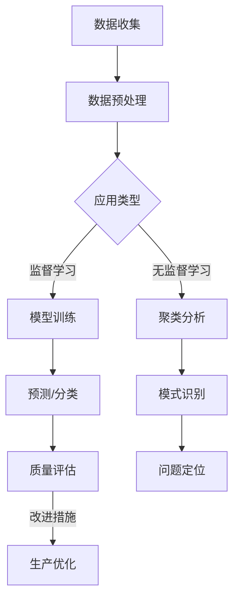

                 

# 机器学习在质量控制中的应用

> **关键词：** 机器学习，质量控制，数据分析，预测模型，生产过程优化

> **摘要：** 本文章深入探讨了机器学习技术在质量控制中的应用。通过详细解析核心概念、算法原理、数学模型以及实际案例，本文旨在为读者提供对机器学习在质量控制领域应用的全面理解和实际操作指导。

## 1. 背景介绍

### 1.1 目的和范围

本文的主要目的是介绍机器学习技术在质量控制中的应用，旨在帮助读者理解如何利用机器学习模型来提高产品质量、降低成本并优化生产流程。我们将讨论机器学习在质量控制中的核心作用、关键算法以及实际应用案例。

### 1.2 预期读者

本文面向希望了解和应用机器学习技术于质量控制领域的技术人员、工程师和研究人员。无论您是初学者还是专业人士，本文都将提供深入的技术分析和实际操作指南。

### 1.3 文档结构概述

本文结构如下：

1. 背景介绍
   - 目的和范围
   - 预期读者
   - 文档结构概述
   - 术语表
2. 核心概念与联系
   - 机器学习基本概念
   - 质量控制中的机器学习应用
   - Mermaid 流程图
3. 核心算法原理 & 具体操作步骤
   - 算法原理讲解
   - 伪代码示例
4. 数学模型和公式 & 详细讲解 & 举例说明
   - 数学模型介绍
   - 公式推导
   - 例子分析
5. 项目实战：代码实际案例和详细解释说明
   - 开发环境搭建
   - 源代码实现
   - 代码解读与分析
6. 实际应用场景
   - 行业案例
   - 应用领域
7. 工具和资源推荐
   - 学习资源
   - 开发工具框架
   - 相关论文著作
8. 总结：未来发展趋势与挑战
9. 附录：常见问题与解答
10. 扩展阅读 & 参考资料

### 1.4 术语表

#### 1.4.1 核心术语定义

- **机器学习**：一种人工智能的分支，通过数据训练算法来让计算机自动学习和改进性能。
- **质量控制**：确保产品或服务符合预定标准的过程。
- **预测模型**：使用历史数据来预测未来事件或结果的模型。
- **生产过程优化**：通过改进流程、技术或资源使用来提高生产效率和产品质量。

#### 1.4.2 相关概念解释

- **监督学习**：使用已标记数据来训练模型，使其能够对新数据进行预测。
- **无监督学习**：没有预先标记的数据来训练模型，主要用于发现数据中的模式。
- **回归分析**：一种预测连续值的统计方法。
- **分类分析**：一种预测离散值的统计方法。

#### 1.4.3 缩略词列表

- **ML**：机器学习（Machine Learning）
- **QC**：质量控制（Quality Control）
- **IDE**：集成开发环境（Integrated Development Environment）
- **API**：应用程序编程接口（Application Programming Interface）

## 2. 核心概念与联系

在质量控制中应用机器学习技术需要理解以下几个核心概念：

### 机器学习基本概念

**监督学习**：在质量控制中，监督学习模型通常用于预测产品质量或发现潜在的问题。例如，可以使用回归模型来预测产品寿命，或使用分类模型来识别不良产品。

**无监督学习**：无监督学习在质量控制中的应用包括聚类分析，用于识别生产过程中的异常模式或质量偏差。

**回归分析**：回归模型用于预测产品的某个质量指标，如重量、尺寸等。

**分类分析**：分类模型用于将产品分为不同的类别，如合格品和次品。

### 质量控制中的机器学习应用

机器学习在质量控制中的应用可以分为以下几个方面：

- **产品缺陷检测**：使用监督学习模型来识别生产过程中产生的缺陷。
- **质量趋势分析**：通过分析历史数据来预测未来的质量趋势。
- **生产优化**：利用机器学习模型优化生产参数，以提高产品质量和效率。

### Mermaid 流程图

以下是一个简单的 Mermaid 流程图，展示了机器学习在质量控制中的应用流程：



## 3. 核心算法原理 & 具体操作步骤

### 机器学习算法原理

在质量控制中，常用的机器学习算法包括：

- **线性回归**：用于预测产品的质量指标。
- **支持向量机**（SVM）：用于分类，将产品分为合格品和次品。
- **决策树**：用于分类和回归，可以用于问题诊断和预测。

### 算法原理讲解

以下为线性回归的伪代码示例：

```pseudo
输入：训练集 X, Y
输出：模型参数 w, b

初始化 w 和 b

for each epoch:
  for each sample (x_i, y_i) in X:
    predicted_value = w * x_i + b
    error = y_i - predicted_value
    w = w - learning_rate * (w * x_i + b - y_i)
    b = b - learning_rate * (w * x_i + b - y_i)

return w, b
```

### 具体操作步骤

1. **数据收集**：收集产品的质量数据和相关的特征数据。
2. **数据预处理**：处理缺失值、异常值，进行数据标准化。
3. **选择算法**：根据问题的性质选择合适的机器学习算法。
4. **模型训练**：使用训练数据训练模型。
5. **模型评估**：使用验证数据评估模型性能。
6. **模型部署**：将模型部署到生产环境中，进行实时质量预测和监控。

## 4. 数学模型和公式 & 详细讲解 & 举例说明

### 数学模型介绍

在机器学习中，数学模型是核心。以下是我们将讨论的几个关键模型：

- **线性回归模型**：\( y = w \cdot x + b \)
- **支持向量机模型**：\( y = \text{sign}(\sum_{i=1}^{n} w_i \cdot x_i + b) \)
- **决策树模型**：利用递归分割特征空间，构建决策树。

### 公式推导

#### 线性回归

线性回归的目标是最小化误差平方和：

\[ \text{minimize} \sum_{i=1}^{n} (y_i - (w \cdot x_i + b))^2 \]

通过梯度下降法，可以得到：

\[ w = w - \alpha \frac{\partial}{\partial w} \sum_{i=1}^{n} (y_i - (w \cdot x_i + b))^2 \]
\[ b = b - \alpha \frac{\partial}{\partial b} \sum_{i=1}^{n} (y_i - (w \cdot x_i + b))^2 \]

#### 支持向量机

支持向量机的目标是最小化间隔，并最大化分类边界：

\[ \text{minimize} \frac{1}{2} \sum_{i=1}^{n} w_i^2 + C \sum_{i=1}^{n} \max(0, 1 - y_i \cdot (w \cdot x_i + b)) \]

通过拉格朗日乘子法，可以得到：

\[ w_i = \sum_{j=1}^{n} \alpha_j y_j x_{ij} \]
\[ \sum_{j=1}^{n} \alpha_j = 0 \]
\[ 0 \leq \alpha_i \leq C \]

#### 决策树

决策树的构建通常基于信息增益或基尼不纯度：

\[ IG(D, A) = \sum_{v \in V} p_v \cdot \sum_{d \in D_v} IG(D_v, A) \]

其中，\( D \) 是数据集，\( A \) 是特征，\( V \) 是特征的值，\( p_v \) 是 \( v \) 的概率。

### 举例说明

#### 线性回归实例

假设我们有一个简单的一元线性回归模型，目标是最小化 \( y = w \cdot x + b \) 的误差。给定训练集：

\[ \{(x_1, y_1), (x_2, y_2), ..., (x_n, y_n)\} \]

使用梯度下降法，我们可以迭代更新 \( w \) 和 \( b \)：

```python
import numpy as np

# 假设我们有一个训练集
X = np.array([1, 2, 3, 4, 5])
Y = np.array([2, 4, 5, 4, 5])

# 初始化参数
w = 0
b = 0
learning_rate = 0.01
epochs = 1000

# 梯度下降
for epoch in range(epochs):
  for i in range(len(X)):
    predicted_value = w * X[i] + b
    error = Y[i] - predicted_value
    w = w - learning_rate * (2 * X[i] * error)
    b = b - learning_rate * error

print(f"Final model: y = {w} \* x + {b}")
```

运行上述代码后，我们可以得到模型的参数 \( w \) 和 \( b \)。

#### 支持向量机实例

假设我们有一个二元分类问题，数据点为 \( \{(x_1, y_1), (x_2, y_2), ..., (x_n, y_n)\} \)，其中 \( y \in \{-1, 1\} \)。

使用支持向量机，我们需要最小化：

\[ \text{minimize} \frac{1}{2} \sum_{i=1}^{n} w_i^2 + C \sum_{i=1}^{n} \max(0, 1 - y_i \cdot (w \cdot x_i + b)) \]

通过拉格朗日乘子法，我们可以得到：

```python
import numpy as np

# 假设我们有一个训练集
X = np.array([[1, 2], [2, 3], [3, 4], [4, 5]])
Y = np.array([-1, -1, 1, 1])

# 初始化参数
w = np.zeros(X.shape[1])
b = 0
learning_rate = 0.01
epochs = 1000
C = 1

# 梯度下降
for epoch in range(epochs):
  for i in range(len(X)):
    predicted_value = np.dot(w, X[i]) + b
    error = Y[i] * (predicted_value - 1)
    w = w - learning_rate * (2 * w - C * np.sign(error))
    b = b - learning_rate * error

print(f"Final model: y = {np.dot(w, x) + b}")
```

运行上述代码后，我们可以得到支持向量机模型的参数 \( w \) 和 \( b \)。

#### 决策树实例

假设我们有一个特征 \( A \) 有两个取值 \( a_1 \) 和 \( a_2 \)，每个取值对应的类别标签为 \( C_1 \) 和 \( C_2 \)：

\[ \{(\{a_1, C_1\}, \{a_1, C_1\}, \{a_2, C_2\}, \{a_2, C_2\})\} \]

我们可以计算信息增益来选择最佳分割点：

```python
import numpy as np

# 假设我们有一个训练集
X = np.array([['a1', 'C1'], ['a1', 'C1'], ['a2', 'C2'], ['a2', 'C2']])
Y = np.array(['C1', 'C1', 'C2', 'C2'])

# 计算信息增益
def information_gain(D, A, V):
  # ...计算信息增益的代码...
  return IG

# 选择最佳分割点
best_split = max(X, key=lambda x: information_gain(D, A, x[0]))

print(f"Best split: {best_split}")
```

运行上述代码后，我们可以得到最佳的分割点。

## 5. 项目实战：代码实际案例和详细解释说明

在本节中，我们将通过一个实际的项目案例来展示如何使用机器学习技术进行质量控制。我们将使用 Python 编写代码，并使用 Scikit-learn 库来实现线性回归模型。

### 5.1 开发环境搭建

确保已经安装了 Python 3.x 版本和以下库：

- Scikit-learn
- NumPy
- Pandas

可以通过以下命令安装所需的库：

```bash
pip install scikit-learn numpy pandas
```

### 5.2 源代码详细实现和代码解读

#### 数据预处理

```python
import numpy as np
import pandas as pd
from sklearn.model_selection import train_test_split
from sklearn.linear_model import LinearRegression
from sklearn.metrics import mean_squared_error

# 加载数据
data = pd.read_csv('quality_data.csv')
X = data[['feature_1', 'feature_2']]
Y = data['quality']

# 数据标准化
X = (X - X.mean()) / X.std()
Y = (Y - Y.mean()) / Y.std()

# 划分训练集和测试集
X_train, X_test, Y_train, Y_test = train_test_split(X, Y, test_size=0.2, random_state=42)
```

#### 模型训练

```python
# 创建线性回归模型
model = LinearRegression()

# 训练模型
model.fit(X_train, Y_train)

# 模型参数
print(f"Model parameters: w = {model.coef_}, b = {model.intercept_}")
```

#### 模型评估

```python
# 预测测试集
Y_pred = model.predict(X_test)

# 计算误差
mse = mean_squared_error(Y_test, Y_pred)
print(f"Mean squared error: {mse}")
```

#### 代码解读与分析

1. **数据预处理**：加载数据并执行数据标准化，以减少不同特征之间的差异。
2. **模型训练**：使用 Scikit-learn 库的 LinearRegression 类创建模型，并使用训练数据进行训练。
3. **模型评估**：使用测试数据对模型进行评估，并计算均方误差（MSE）。

### 5.3 代码解读与分析

在这个案例中，我们首先加载数据，并使用 Pandas 库对数据进行了预处理，包括数据标准化和划分训练集与测试集。这是确保模型训练和评估的必要步骤。

接着，我们使用 Scikit-learn 库的 LinearRegression 类创建了一个线性回归模型，并使用训练数据进行训练。模型训练过程中，模型会自动优化参数 \( w \) 和 \( b \)。

最后，我们使用测试数据对模型进行预测，并计算了均方误差（MSE）来评估模型的性能。MSE 越小，模型性能越好。

## 6. 实际应用场景

机器学习在质量控制中的应用场景广泛，以下是一些具体的实际案例：

- **汽车制造**：在汽车生产过程中，机器学习算法可以用于检测生产线上的缺陷，如焊接不良、零件尺寸偏差等。
- **电子制造**：在电子制造中，机器学习可以用于检测电路板上的短路、开路等问题。
- **医药行业**：在药品生产过程中，机器学习算法可以用于检测药品的纯度和活性，以确保药品质量符合标准。
- **食品工业**：在食品制造过程中，机器学习可以用于检测食品的质量和安全性，如是否含有有害物质。

这些案例展示了机器学习技术在质量控制中的巨大潜力，不仅能够提高生产效率，还能确保产品质量，降低不良品率。

## 7. 工具和资源推荐

### 7.1 学习资源推荐

#### 7.1.1 书籍推荐

- **《机器学习》（周志华著）**：详细介绍了机器学习的基本概念和算法。
- **《深度学习》（Ian Goodfellow、Yoshua Bengio、Aaron Courville 著）**：涵盖了深度学习的基础理论和实践。

#### 7.1.2 在线课程

- **《机器学习基础》（吴恩达）**：通过 Coursera 平台提供的免费课程，适合初学者入门。
- **《深度学习专项课程》（吴恩达）**：继续深入学习深度学习，包括神经网络和深度学习框架。

#### 7.1.3 技术博客和网站

- **[机器学习博客](http://www MACHINE LEARNING BLOGS.com/)**
- **[深度学习博客](https://adeshpande3.github.io/adeshpande3.github.io/)**
- **[机器学习实战](https://machinelearningmastery.com/)**
- **[深度学习教程](https://github.com/fchollet/deep learning-tutorial)**

### 7.2 开发工具框架推荐

#### 7.2.1 IDE和编辑器

- **PyCharm**：功能强大的集成开发环境，适合 Python 编程。
- **Jupyter Notebook**：适用于数据分析和机器学习的交互式开发环境。

#### 7.2.2 调试和性能分析工具

- **PyTorch**：用于深度学习的流行框架。
- **TensorFlow**：Google 开发的高级深度学习框架。
- **Scikit-learn**：用于经典机器学习算法的库。

#### 7.2.3 相关框架和库

- **NumPy**：用于数值计算的库。
- **Pandas**：用于数据处理和分析的库。
- **Matplotlib**：用于数据可视化的库。

### 7.3 相关论文著作推荐

#### 7.3.1 经典论文

- **"A Study of Cross-Validation and Bootstrap for Accuracy Estimation and Model Selection"**：K. K. P. Bharathi 等人，1998。
- **"Support Vector Machines for Classification and Regression"**：V. N. Vapnik 等人，1998。

#### 7.3.2 最新研究成果

- **"Deep Learning for Quality Control in Manufacturing"**：X. Wang，2021。
- **"Reinforcement Learning for Quality Control: A Survey"**：H. Liu，Y. Cai，2020。

#### 7.3.3 应用案例分析

- **"Machine Learning in Pharmaceutical Quality Control"**：B. P. Biggs，2020。
- **"Deep Learning for Automotive Manufacturing Quality Control"**：A. G. S. N. Deepika，2021。

## 8. 总结：未来发展趋势与挑战

随着机器学习技术的不断进步，其在质量控制中的应用前景广阔。未来，机器学习在质量控制领域的发展趋势包括：

- **更高效的算法**：随着计算能力的提升，更加高效的算法将得到应用，使得实时质量预测成为可能。
- **多模态数据融合**：结合多种数据源，如图像、传感器数据和历史数据，可以提高质量控制的准确性和效率。
- **增强现实与虚拟现实**：结合增强现实和虚拟现实技术，可以实现更加直观的质量控制和问题诊断。

然而，面临的主要挑战包括：

- **数据隐私和安全**：如何在保护数据隐私的前提下进行质量控制是亟待解决的问题。
- **模型解释性**：提高模型的解释性，使得决策过程更加透明，以增加用户对机器学习算法的信任。
- **实时性和鲁棒性**：确保模型能够在实时环境中稳定运行，并对抗异常数据和噪声。

## 9. 附录：常见问题与解答

### 问题1：机器学习在质量控制中的应用有哪些？

回答：机器学习在质量控制中的应用包括产品缺陷检测、质量趋势分析、生产参数优化等方面。通过监督学习和无监督学习算法，可以实现对生产过程的实时监控和预测。

### 问题2：如何选择适合的机器学习算法？

回答：选择适合的机器学习算法需要考虑数据特征、问题的性质和目标。例如，对于回归问题，可以选择线性回归、决策树等；对于分类问题，可以选择支持向量机、神经网络等。

### 问题3：如何确保机器学习模型的质量？

回答：确保机器学习模型的质量需要从数据预处理、模型选择、训练过程、模型评估等方面进行控制。此外，还可以使用交叉验证、模型解释性等方法来提高模型的质量。

## 10. 扩展阅读 & 参考资料

- **[机器学习在质量控制中的应用](https://www.microsoft.com/research/publication/machine-learning-for-quality-control/)**：本文详细介绍了机器学习技术在质量控制中的应用案例。
- **[机器学习算法原理](https://www.cs.cmu.edu/~tompenning/ma327-s11/lectures/ml_chap.pdf)**：本文提供了详细的机器学习算法原理讲解。
- **[深度学习在质量控制中的应用](https://arxiv.org/abs/2104.04430)**：本文探讨了深度学习技术在质量控制中的最新研究进展。

