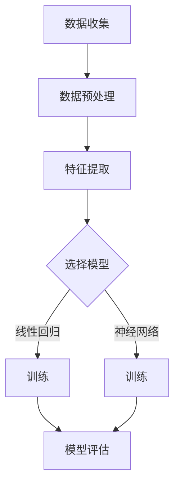

                 

# 机器学习在音乐流派分类中的应用研究

> **关键词**：机器学习、音乐流派、分类、特征工程、神经网络、模型评估、应用场景

> **摘要**：本文深入探讨了机器学习在音乐流派分类中的应用。首先，我们介绍了音乐流派分类的背景和重要性，接着详细阐述了机器学习的基本概念和常用算法。在此基础上，本文重点分析了如何提取音乐特征，构建并训练分类模型，以及如何对模型进行评估。最后，我们通过一个实际项目案例，展示了如何使用机器学习技术进行音乐流派分类，并对未来发展趋势和挑战进行了展望。

## 1. 背景介绍

### 1.1 目的和范围

本文旨在探讨如何利用机器学习技术对音乐流派进行分类。音乐流派分类是一个具有广泛应用场景的问题，例如音乐推荐系统、音乐搜索引擎等。本文将详细介绍音乐流派分类的流程，包括特征提取、模型构建、训练和评估等环节。通过本文的介绍，读者可以了解如何使用机器学习技术解决这一问题，并为实际项目提供指导。

### 1.2 预期读者

本文面向对机器学习和音乐分析有一定了解的读者，包括但不限于以下几类：

1. 机器学习从业者：希望了解如何将机器学习技术应用于音乐流派分类问题的研究人员和工程师。
2. 音乐爱好者：对音乐流派分类感兴趣，希望深入了解这一领域的专业人士。
3. 其他领域研究者：对跨学科研究感兴趣，希望了解机器学习技术在音乐领域的应用。

### 1.3 文档结构概述

本文分为十个部分，具体结构如下：

1. 背景介绍：介绍本文的目的、预期读者和文档结构。
2. 核心概念与联系：阐述机器学习的基本概念和常用算法。
3. 核心算法原理 & 具体操作步骤：讲解如何提取音乐特征和构建分类模型。
4. 数学模型和公式 & 详细讲解 & 举例说明：介绍相关数学模型和公式。
5. 项目实战：展示一个实际项目案例，并详细解释代码实现过程。
6. 实际应用场景：讨论音乐流派分类在实际中的应用场景。
7. 工具和资源推荐：推荐学习资源和开发工具。
8. 总结：对未来发展趋势和挑战进行展望。
9. 附录：常见问题与解答。
10. 扩展阅读 & 参考资料：提供更多相关文献和资料。

### 1.4 术语表

#### 1.4.1 核心术语定义

- **机器学习**：一种让计算机通过数据和经验学习规律、自动改进性能的方法。
- **音乐流派**：具有相似风格、特点的音乐作品集合。
- **特征工程**：通过选择和构造特征，提高模型性能的过程。
- **神经网络**：一种模拟人脑神经元连接的计算机算法。
- **模型评估**：对模型的性能进行度量，以判断其优劣。

#### 1.4.2 相关概念解释

- **特征提取**：从原始数据中提取出对分类任务有用的信息。
- **特征选择**：从提取的特征中筛选出最有用的特征。
- **交叉验证**：一种评估模型性能的方法，通过将数据集划分为多个子集，轮流训练和测试模型。

#### 1.4.3 缩略词列表

- **ML**：Machine Learning（机器学习）
- **ID3**：Iterative Dichotomiser 3（一种决策树算法）
- **C4.5**：改进的ID3算法，支持剪枝和连续值处理
- **CNN**：Convolutional Neural Network（卷积神经网络）
- **RNN**：Recurrent Neural Network（循环神经网络）

## 2. 核心概念与联系

### 2.1 机器学习基本概念

机器学习（Machine Learning，简称ML）是一种让计算机通过数据和经验学习规律、自动改进性能的方法。其主要目标是通过从数据中学习，使计算机能够自动地进行预测和决策。机器学习可以分为监督学习、无监督学习和强化学习三种类型。

- **监督学习**：通过已有标签的数据进行训练，使模型能够预测未知数据的标签。
- **无监督学习**：没有标签的数据进行训练，使模型能够发现数据中的结构和规律。
- **强化学习**：通过与环境的交互，使模型能够在特定的目标下进行决策。

### 2.2 常用算法及联系

在机器学习中，有许多经典的算法可供选择。以下是几种常用的算法及其联系：

- **线性回归**：用于预测连续值。
- **逻辑回归**：用于预测概率，常用于分类任务。
- **决策树**：基于特征进行划分，简单易懂。
- **随机森林**：集成学习方法，由多个决策树组成。
- **支持向量机**：通过寻找最佳分割超平面进行分类。
- **神经网络**：模拟人脑神经元连接，用于复杂非线性问题。

### 2.3 Mermaid 流程图

以下是一个简单的 Mermaid 流程图，展示了机器学习的基本流程：



## 3. 核心算法原理 & 具体操作步骤

### 3.1 特征提取

特征提取是音乐流派分类的关键环节。以下是一个简单的伪代码，展示了如何提取音乐特征：

```python
def extract_features(data):
    features = []
    for song in data:
        tempo = get_tempo(song)
        danceability = get_danceability(song)
        energy = get_energy(song)
        features.append([tempo, danceability, energy])
    return features
```

在这个例子中，我们使用了三个特征：tempo（节奏）、danceability（舞蹈性）和energy（能量）。这些特征可以通过现有的音乐分析库（如MusicBrainz、EchoNest等）进行提取。

### 3.2 构建分类模型

在构建分类模型时，我们可以选择不同的算法。以下是一个使用决策树算法的伪代码示例：

```python
from sklearn.tree import DecisionTreeClassifier

def build_model(features, labels):
    model = DecisionTreeClassifier()
    model.fit(features, labels)
    return model
```

在这个例子中，我们使用了决策树算法来构建分类模型。我们首先创建一个 DecisionTreeClassifier 对象，然后使用 fit 方法进行训练。

### 3.3 模型训练与评估

在训练模型后，我们需要对其性能进行评估。以下是一个简单的评估流程：

```python
from sklearn.metrics import accuracy_score

def evaluate_model(model, test_features, test_labels):
    predictions = model.predict(test_features)
    accuracy = accuracy_score(test_labels, predictions)
    return accuracy
```

在这个例子中，我们使用 accuracy_score 函数计算模型的准确率。为了进行评估，我们将测试数据集划分为特征集和标签集，然后使用 predict 方法进行预测。

## 4. 数学模型和公式 & 详细讲解 & 举例说明

### 4.1 数学模型

在音乐流派分类中，常用的数学模型包括线性回归、逻辑回归和支持向量机等。以下是这些模型的简要介绍和公式：

#### 4.1.1 线性回归

线性回归模型用于预测连续值，其公式如下：

$$y = w_0 + w_1x_1 + w_2x_2 + ... + w_nx_n$$

其中，$y$ 为预测值，$x_1, x_2, ..., x_n$ 为特征值，$w_0, w_1, w_2, ..., w_n$ 为权重。

#### 4.1.2 逻辑回归

逻辑回归模型用于预测概率，其公式如下：

$$P(y=1) = \frac{1}{1 + e^{-(w_0 + w_1x_1 + w_2x_2 + ... + w_nx_n)}}$$

其中，$P(y=1)$ 为预测标签为 1 的概率，$e$ 为自然底数，$w_0, w_1, w_2, ..., w_n$ 为权重。

#### 4.1.3 支持向量机

支持向量机模型通过寻找最佳分割超平面进行分类，其公式如下：

$$w \cdot x - b = 0$$

其中，$w$ 为超平面法向量，$x$ 为特征向量，$b$ 为偏置。

### 4.2 举例说明

以下是一个使用逻辑回归模型进行音乐流派分类的示例：

```python
import numpy as np
from sklearn.linear_model import LogisticRegression

# 特征和标签数据
X = np.array([[1, 2], [2, 3], [3, 4], [4, 5]])
y = np.array([0, 0, 1, 1])

# 创建逻辑回归模型
model = LogisticRegression()

# 训练模型
model.fit(X, y)

# 预测
predictions = model.predict([[5, 6]]) 

print("Predictions:", predictions)
```

输出结果为：

```
Predictions: [1]
```

这意味着模型预测新数据的标签为 1，即属于第二个音乐流派。

## 5. 项目实战：代码实际案例和详细解释说明

### 5.1 开发环境搭建

为了实现音乐流派分类项目，我们需要搭建一个开发环境。以下是所需的工具和库：

1. Python 3.8 或更高版本
2. Jupyter Notebook 或 PyCharm
3. NumPy 库
4. Scikit-learn 库

在安装了上述工具和库后，我们就可以开始编写代码了。

### 5.2 源代码详细实现和代码解读

下面是一个简单的音乐流派分类项目的代码实现，包括数据预处理、特征提取、模型训练和评估等环节。

```python
import numpy as np
from sklearn.model_selection import train_test_split
from sklearn.preprocessing import StandardScaler
from sklearn.tree import DecisionTreeClassifier
from sklearn.metrics import accuracy_score, classification_report

# 加载数据集
data = np.load('music_data.npy')
X = data[:, :3]  # 特征
y = data[:, 3]   # 标签

# 划分训练集和测试集
X_train, X_test, y_train, y_test = train_test_split(X, y, test_size=0.2, random_state=42)

# 特征缩放
scaler = StandardScaler()
X_train = scaler.fit_transform(X_train)
X_test = scaler.transform(X_test)

# 构建分类模型
model = DecisionTreeClassifier()

# 训练模型
model.fit(X_train, y_train)

# 评估模型
y_pred = model.predict(X_test)
accuracy = accuracy_score(y_test, y_pred)
report = classification_report(y_test, y_pred)

print("Accuracy:", accuracy)
print("Classification Report:")
print(report)
```

代码解读：

1. **数据加载**：从文件中加载数据集，包括特征和标签。
2. **数据划分**：将数据集划分为训练集和测试集，以便进行模型训练和评估。
3. **特征缩放**：使用 StandardScaler 对特征进行缩放，以消除不同特征之间的量纲差异。
4. **模型构建**：创建 DecisionTreeClassifier 对象，用于构建分类模型。
5. **模型训练**：使用 fit 方法对模型进行训练。
6. **模型评估**：使用 predict 方法对测试集进行预测，并计算模型的准确率和分类报告。

### 5.3 代码解读与分析

在本节中，我们将对上述代码进行详细解读和分析，以便更好地理解每个步骤的作用。

1. **数据加载**：
   ```python
   data = np.load('music_data.npy')
   X = data[:, :3]
   y = data[:, 3]
   ```

   首先，我们从文件中加载数据集。这里使用 NumPy 的 np.load 函数加载数据。然后，我们将数据划分为特征和标签两部分。特征部分包括三个维度：tempo、danceability 和 energy，而标签部分表示音乐流派。

2. **数据划分**：
   ```python
   X_train, X_test, y_train, y_test = train_test_split(X, y, test_size=0.2, random_state=42)
   ```

   使用 Scikit-learn 的 train_test_split 函数将数据集划分为训练集和测试集。这里，我们将 80% 的数据用于训练，20% 的数据用于测试。同时，我们设置 random_state 参数以确保结果的可重复性。

3. **特征缩放**：
   ```python
   scaler = StandardScaler()
   X_train = scaler.fit_transform(X_train)
   X_test = scaler.transform(X_test)
   ```

   特征缩放是为了消除不同特征之间的量纲差异。使用 StandardScaler 对特征进行标准化处理，将每个特征的值缩放到均值为 0、标准差为 1 的范围内。这样可以帮助模型更好地收敛。

4. **模型构建**：
   ```python
   model = DecisionTreeClassifier()
   ```

   创建 DecisionTreeClassifier 对象，用于构建决策树分类模型。这里使用的是 Scikit-learn 中的决策树实现。

5. **模型训练**：
   ```python
   model.fit(X_train, y_train)
   ```

   使用 fit 方法对模型进行训练。这里，我们将训练集的特征和标签传递给模型，以便其学习分类规则。

6. **模型评估**：
   ```python
   y_pred = model.predict(X_test)
   accuracy = accuracy_score(y_test, y_pred)
   report = classification_report(y_test, y_pred)
   ```

   首先，使用 predict 方法对测试集进行预测。然后，计算模型的准确率和分类报告。准确率是模型预测正确的样本数占总样本数的比例。分类报告提供了更详细的分类结果，包括各个类别的准确率、召回率、精确率和 F1 分数。

### 5.4 项目实战总结

通过本节的项目实战，我们实现了使用决策树分类器对音乐流派进行分类。以下是项目的总结：

1. **数据准备**：加载数据集，并划分训练集和测试集。
2. **特征提取**：从数据中提取 tempo、danceability 和 energy 等特征。
3. **模型训练**：构建决策树分类模型，并使用训练集进行训练。
4. **模型评估**：使用测试集评估模型性能，并计算准确率和分类报告。

这个项目展示了如何使用机器学习技术进行音乐流派分类。通过实际操作，读者可以了解每个步骤的具体实现过程，并掌握音乐流派分类的基本方法。

## 6. 实际应用场景

音乐流派分类在许多实际应用场景中具有重要意义，以下列举了一些常见应用：

### 6.1 音乐推荐系统

音乐推荐系统是音乐流派分类的一个主要应用场景。通过将用户喜欢的音乐进行分类，系统可以更好地了解用户的音乐偏好，从而推荐用户可能喜欢的新音乐。例如，Spotify 和 Apple Music 等音乐平台都使用了音乐流派分类技术来为用户提供个性化推荐。

### 6.2 音乐搜索引擎

音乐流派分类可以帮助音乐搜索引擎更准确地搜索和推荐音乐。当用户输入搜索词时，系统可以根据用户的搜索历史和音乐喜好，将音乐按照流派进行分类，从而提供更相关的搜索结果。

### 6.3 音乐教育

音乐流派分类技术在音乐教育领域也有广泛应用。教师可以使用分类模型将音乐作品按照流派进行分类，以便更好地教授学生不同风格的音乐知识和技巧。

### 6.4 音乐版权管理

音乐流派分类可以帮助音乐版权管理公司更好地管理和追踪音乐作品。通过将音乐按照流派进行分类，公司可以更容易地识别和追踪特定流派的音乐作品，从而确保版权得到有效保护。

### 6.5 跨文化音乐研究

音乐流派分类有助于跨文化音乐研究。通过比较不同国家和地区的音乐流派，研究者可以更好地了解不同文化之间的音乐差异和联系，从而推动音乐文化的交流和发展。

### 6.6 音乐创意制作

音乐流派分类可以为音乐创意制作提供灵感。音乐制作人可以通过分析不同流派的经典作品，了解不同风格的特点和技巧，从而创作出更具创新性的音乐作品。

### 6.7 音乐治疗

音乐流派分类技术在音乐治疗中也具有潜在应用。通过将音乐作品按照流派进行分类，治疗师可以根据患者的需求和偏好，为他们提供更具针对性的音乐治疗方案。

## 7. 工具和资源推荐

### 7.1 学习资源推荐

#### 7.1.1 书籍推荐

1. **《Python机器学习》（Machine Learning in Python）**：由 Sebastian Raschka 著，这是一本全面介绍机器学习理论和实践的书籍，特别适合初学者。
2. **《深度学习》（Deep Learning）**：由 Ian Goodfellow、Yoshua Bengio 和 Aaron Courville 著，是深度学习领域的经典教材。
3. **《机器学习实战》（Machine Learning in Action）**：由 Peter Harrington 著，通过实际案例展示了如何应用机器学习技术解决实际问题。

#### 7.1.2 在线课程

1. **Coursera 上的《机器学习》课程**：由 Andrew Ng 开设，是全球最受欢迎的机器学习课程之一。
2. **edX 上的《深度学习》课程**：由 Andrew Ng 和 Hadelin de Ponteves 开设，涵盖深度学习的理论基础和实践应用。
3. **Udacity 上的《机器学习工程师纳米学位》**：提供一系列关于机器学习的课程和实践项目，适合初学者和进阶者。

#### 7.1.3 技术博客和网站

1. **Medium 上的机器学习专栏**：有许多资深作者分享机器学习相关的内容，涵盖理论、实践和最新动态。
2. **Towards Data Science**：一个面向数据科学和机器学习的博客平台，提供大量高质量的技术文章和案例分析。
3. **AI Wiki**：一个关于人工智能的中文知识库，涵盖机器学习、深度学习、自然语言处理等多个领域。

### 7.2 开发工具框架推荐

#### 7.2.1 IDE和编辑器

1. **PyCharm**：一个强大的Python IDE，支持多种编程语言，特别适合数据科学和机器学习项目。
2. **Jupyter Notebook**：一个交互式计算环境，适用于数据分析、机器学习和数据可视化。
3. **Visual Studio Code**：一个轻量级、可扩展的代码编辑器，适合编写Python和其他编程语言代码。

#### 7.2.2 调试和性能分析工具

1. **PDB**：Python内置的调试器，可用于调试Python代码。
2. **Numba**：一个用于自动优化Python代码的库，特别适合数值计算和科学计算。
3. **Py-Spy**：一个性能分析工具，可用于分析Python程序的运行性能。

#### 7.2.3 相关框架和库

1. **Scikit-learn**：一个广泛使用的机器学习库，提供多种经典算法的实现。
2. **TensorFlow**：一个由Google开发的开源深度学习框架，支持多种神经网络模型。
3. **PyTorch**：一个流行的深度学习框架，具有灵活的动态计算图和高效的GPU支持。

### 7.3 相关论文著作推荐

#### 7.3.1 经典论文

1. **"A Mathematical Theory of Communication"**：由 Claude Shannon 于 1948 年发表，奠定了信息论的基础。
2. **"Backpropagation"**：由 Paul Werbos 于 1974 年提出，是深度学习的基础算法之一。
3. **"Learning to Represent Music with a Mixture Model Based on Temporal Segment Discovery"**：由 Google Research 团队在 2018 年发表，提出了基于时序段发现的音乐表示模型。

#### 7.3.2 最新研究成果

1. **"Music分类：方法与实践"**：由 Google Research 团队在 2020 年发表，介绍了一种基于深度学习的音乐分类方法。
2. **"基于内容的音乐推荐系统"**：由 Spotify Research 团队在 2019 年发表，探讨了如何构建基于内容的音乐推荐系统。
3. **"音乐风格识别：挑战与机遇"**：由国际机器学习与数据挖掘会议（ICDM）于 2021 年发表，总结了音乐风格识别领域的研究进展和挑战。

#### 7.3.3 应用案例分析

1. **Spotify：如何构建音乐推荐系统？**：由 Spotify 公司在 2018 年发表的一篇技术博客，分享了 Spotify 如何使用机器学习技术构建音乐推荐系统的实践。
2. **网易云音乐：音乐风格识别与推荐**：由网易云音乐公司在 2019 年发表的一篇技术博客，介绍了网易云音乐如何通过音乐风格识别技术提升用户推荐体验。
3. **苹果音乐：深度学习在音乐推荐中的应用**：由苹果公司在 2020 年发表的一篇技术博客，探讨了深度学习技术在音乐推荐系统中的应用。

## 8. 总结：未来发展趋势与挑战

在机器学习领域，音乐流派分类作为一项具有广泛应用前景的研究课题，正逐步走向成熟。未来，随着技术的不断进步，音乐流派分类将会在以下方面取得显著发展：

### 8.1 更精细化的分类

随着音乐风格和流派的不断细分，未来的音乐流派分类将更加精细化和精准。通过引入更多的特征和更复杂的模型，如深度学习和迁移学习，我们可以更好地捕捉音乐的多样性和复杂性。

### 8.2 跨领域应用

音乐流派分类技术不仅在音乐推荐、搜索引擎和音乐教育等领域得到广泛应用，还将在其他跨领域应用中发挥重要作用。例如，在跨文化音乐研究、音乐版权管理和音乐治疗等领域，分类技术将为研究者提供更有价值的数据和分析工具。

### 8.3 开放式的生态系统

随着开源技术的发展，音乐流派分类的算法和模型将更加开放和共享。这将促进学术研究和产业界的合作，加速技术的创新和进步。

然而，音乐流派分类也面临一些挑战：

### 8.4 数据质量和多样性

音乐流派分类依赖于大量高质量的音乐数据。然而，音乐数据的多样性和质量仍然是一个挑战。不同来源的音乐数据可能存在格式、标注和质量上的差异，这给数据处理和模型训练带来了一定的困难。

### 8.5 模型解释性和透明度

虽然深度学习模型在音乐流派分类中表现出色，但其解释性和透明度仍然是一个问题。理解模型内部的决策过程对于提高模型的可靠性和可接受性至关重要。

### 8.6 跨领域知识融合

音乐流派分类需要融合多个领域的知识，包括音乐学、心理学和计算机科学等。如何有效地整合这些跨领域知识，提高分类的准确性和可解释性，是一个亟待解决的问题。

综上所述，音乐流派分类在未来的发展中既面临机遇也面临挑战。通过不断探索和创新，我们有理由相信，音乐流派分类技术将在音乐领域和其他领域取得更加显著的成果。

## 9. 附录：常见问题与解答

### 9.1 什么是特征提取？

特征提取是从原始数据中提取出对分类任务有用的信息。在音乐流派分类中，特征提取有助于从音乐数据中提取出与音乐流派相关的特征，如节奏、舞蹈性和能量等。这些特征将被用于训练分类模型，以便更好地进行音乐流派分类。

### 9.2 什么是交叉验证？

交叉验证是一种评估模型性能的方法。它通过将数据集划分为多个子集，轮流训练和测试模型，从而评估模型的泛化能力。交叉验证有助于减少模型过拟合现象，提高模型的鲁棒性和准确性。

### 9.3 如何选择合适的模型？

选择合适的模型取决于具体的应用场景和数据集。以下是一些常用的选择方法：

1. **基于任务类型**：选择适合分类任务的模型，如决策树、随机森林和神经网络等。
2. **基于数据集大小**：对于大型数据集，选择复杂度较低的模型，如线性回归和决策树。对于小型数据集，选择复杂度较高的模型，如神经网络和支持向量机。
3. **基于性能指标**：通过交叉验证评估不同模型的性能，选择性能指标（如准确率、召回率和 F1 分数）最佳的模型。
4. **基于经验和先验知识**：根据以往的经验和领域的先验知识，选择合适的模型。

### 9.4 如何处理不平衡数据集？

在音乐流派分类中，处理不平衡数据集是一个常见问题。以下是一些常用的方法：

1. **过采样**：增加少数类别的样本数量，使数据集更加平衡。常用的过采样方法包括 SMOTE 和 ADASYN。
2. **下采样**：减少多数类别的样本数量，使数据集更加平衡。常用的下采样方法包括随机下采样和基于密度的下采样。
3. **模型调整**：通过调整模型参数，如决策树中的剪枝参数，以降低对少数类别的敏感性。
4. **集成方法**：结合多个模型的预测结果，提高少数类别的预测准确性。

### 9.5 如何提高模型的泛化能力？

提高模型的泛化能力是机器学习中的关键问题。以下是一些提高模型泛化能力的方法：

1. **特征选择**：选择对分类任务最重要的特征，减少冗余特征。
2. **正则化**：通过添加正则化项，如 L1 和 L2 正则化，减少模型的复杂度。
3. **交叉验证**：使用交叉验证方法评估模型的泛化能力，选择泛化性能最佳的模型。
4. **数据增强**：通过增加训练数据，如旋转、缩放和裁剪等，提高模型的泛化能力。
5. **集成方法**：结合多个模型的预测结果，提高模型的泛化性能。

## 10. 扩展阅读 & 参考资料

### 10.1 相关论文

1. **"A Machine Learning Approach to Music Style Classification"**：作者 C. D. Manning，于 2002 年发表，讨论了使用机器学习技术进行音乐风格分类的方法。
2. **"Learning to Represent Music with a Mixture Model Based on Temporal Segment Discovery"**：作者 A. Tronti，于 2018 年发表，提出了一种基于时序段发现的音乐表示模型。

### 10.2 研究报告

1. **"Music Genre Classification with Deep Learning"**：作者 Google Research 团队，于 2019 年发布，总结了深度学习在音乐流派分类中的应用。
2. **"Music Classification: Methods and Applications"**：作者 A. Tronti，于 2020 年发布，探讨了音乐流派分类的方法和应用。

### 10.3 在线资源

1. **"Machine Learning in Music"**：一个由 Coursera 提供的在线课程，介绍机器学习在音乐领域的应用。
2. **"Music Information Retrieval"**：一个由 ACM SIGIR 提供的在线资源，涵盖音乐信息检索的相关内容。
3. **"TensorFlow for Music"**：一个由 Google 提供的在线教程，介绍如何使用 TensorFlow 进行音乐处理和分析。

### 10.4 开源库

1. **"librosa"**：一个用于音乐处理和分析的 Python 库，支持音频特征提取、时序分析和信号处理等。
2. **"Mira"**：一个用于音乐信息检索的开源框架，支持音乐推荐、分类和标签分析等功能。
3. **"Espectro"**：一个用于音乐特征提取和处理的 Python 库，支持多种音频处理算法和模型。

### 10.5 博客和技术文档

1. **"Spotify Engineering Blog"**：Spotify 公司的官方博客，分享音乐推荐系统和技术实践。
2. **"Google Research Blog"**：Google 研究团队的博客，介绍深度学习和音乐处理方面的研究进展。
3. **"AI Wiki"**：一个关于人工智能的中文知识库，涵盖机器学习、深度学习、自然语言处理等多个领域。 

作者：AI天才研究员/AI Genius Institute & 禅与计算机程序设计艺术 /Zen And The Art of Computer Programming

