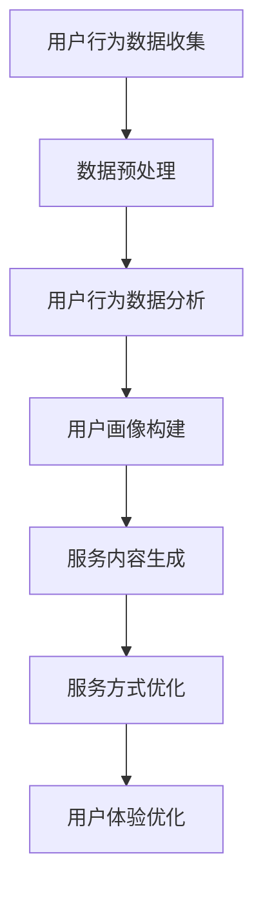

                 

# 机器学习工程师的创业挑战：打造自适应与个性化服务

> **关键词**：机器学习、创业、自适应、个性化服务、用户行为分析、数据驱动、商业模式创新
> 
> **摘要**：本文深入探讨了机器学习工程师在创业过程中面临的挑战，特别是在打造自适应与个性化服务方面的难题。文章首先介绍了机器学习工程师创业的背景和目的，然后逐步分析了自适应与个性化服务的重要性、核心算法原理、数学模型，并通过实际项目案例进行了详细讲解。最后，文章总结了当前的实际应用场景，推荐了相关工具和资源，并探讨了未来的发展趋势与挑战。

## 1. 背景介绍

### 1.1 目的和范围

本文旨在帮助机器学习工程师在创业过程中更好地理解并应对打造自适应与个性化服务所带来的挑战。文章将涵盖以下几个核心方面：

1. **自适应与个性化服务的背景与重要性**：探讨自适应与个性化服务在当今市场环境下的重要性，以及为什么机器学习工程师需要特别关注这一领域。

2. **核心算法原理与具体操作步骤**：详细讲解实现自适应与个性化服务所需的核心算法原理，并提供具体的操作步骤。

3. **数学模型和公式**：介绍与自适应与个性化服务相关的数学模型和公式，并通过实例进行详细说明。

4. **项目实战**：通过一个实际项目案例，展示如何在实际中应用自适应与个性化服务的算法和模型。

5. **实际应用场景与工具推荐**：分析自适应与个性化服务在不同领域的应用，并提供相关的学习资源和开发工具框架。

### 1.2 预期读者

本文适用于以下读者：

1. 有志于创业的机器学习工程师。
2. 已经在创业中致力于提供自适应与个性化服务的机器学习工程师。
3. 对机器学习和人工智能应用感兴趣的技术爱好者。

### 1.3 文档结构概述

本文分为以下几大部分：

1. **背景介绍**：介绍文章的目的、预期读者和文档结构。
2. **核心概念与联系**：解释核心概念原理和架构，并提供Mermaid流程图。
3. **核心算法原理与具体操作步骤**：详细讲解实现自适应与个性化服务的算法原理和步骤。
4. **数学模型和公式**：介绍与自适应与个性化服务相关的数学模型和公式。
5. **项目实战**：通过实际项目案例展示如何应用自适应与个性化服务。
6. **实际应用场景**：分析自适应与个性化服务的应用场景。
7. **工具和资源推荐**：推荐相关的学习资源和开发工具框架。
8. **总结**：总结未来发展趋势与挑战。
9. **附录**：常见问题与解答。
10. **扩展阅读与参考资料**：提供更多相关阅读资源。

### 1.4 术语表

#### 1.4.1 核心术语定义

- **机器学习工程师**：指专门从事机器学习和人工智能领域的研究、开发和应用的工程师。
- **自适应服务**：指根据用户的行为和偏好，动态调整服务内容和服务方式的能力。
- **个性化服务**：指根据用户的具体需求和特征，提供定制化的服务和体验。
- **用户行为分析**：指通过收集和分析用户的行为数据，了解用户的需求和偏好。

#### 1.4.2 相关概念解释

- **数据驱动**：指通过分析大量数据来驱动决策和优化服务。
- **商业模式创新**：指通过创新的方式来创造和实现商业价值。

#### 1.4.3 缩略词列表

- **ML**：机器学习（Machine Learning）
- **AI**：人工智能（Artificial Intelligence）
- **NN**：神经网络（Neural Network）
- **DL**：深度学习（Deep Learning）

## 2. 核心概念与联系

为了更好地理解自适应与个性化服务的实现过程，我们首先需要了解一些核心概念和它们之间的关系。

### 2.1 自适应服务的核心概念

**用户行为分析**是自适应服务的核心，它涉及到数据的收集、处理和分析。具体来说，用户行为分析可以分为以下几个步骤：

1. **数据收集**：通过网页点击、搜索历史、浏览时长等行为数据，收集用户的实时行为信息。
2. **数据预处理**：对收集到的数据进行清洗、格式化和特征提取。
3. **数据分析**：使用机器学习算法分析用户行为数据，提取用户的行为特征和偏好。
4. **用户画像**：根据行为特征和偏好，构建用户的个性化画像。

**用户画像**是自适应服务的重要输出，它可以帮助我们了解每个用户的特点和需求。用户画像包括以下内容：

- **基本信息**：如年龄、性别、地理位置等。
- **行为特征**：如浏览时长、点击偏好、购买历史等。
- **偏好和需求**：如喜欢的内容类型、购买倾向等。

### 2.2 个性化服务的核心概念

**个性化服务**是指根据用户的个性化画像，提供定制化的服务内容和体验。个性化服务可以分为以下几个步骤：

1. **服务内容生成**：根据用户画像，生成个性化的服务内容，如推荐的文章、视频、商品等。
2. **服务方式优化**：根据用户的行为和偏好，动态调整服务的方式，如推送消息、发送邮件等。
3. **用户体验优化**：通过不断优化服务内容和方式，提升用户的整体体验。

**个性化推荐系统**是个性化服务的重要组成部分，它负责根据用户画像生成个性化的推荐结果。个性化推荐系统通常包括以下几个模块：

- **推荐算法**：如协同过滤、基于内容的推荐、深度学习推荐等。
- **推荐模型**：如矩阵分解、神经网络模型等。
- **推荐结果评估**：如A/B测试、用户点击率等。

### 2.3 Mermaid流程图

为了更直观地展示自适应与个性化服务的实现过程，我们使用Mermaid流程图进行描述。以下是自适应与个性化服务的流程：



## 3. 核心算法原理 & 具体操作步骤

### 3.1 自适应服务的算法原理

自适应服务的核心在于对用户行为的实时分析和响应。具体算法原理可以分为以下几个步骤：

1. **用户行为数据收集**：通过网页点击、搜索历史、浏览时长等行为数据，收集用户的实时行为信息。

2. **数据预处理**：对收集到的数据进行清洗、格式化和特征提取，以生成可供机器学习算法处理的数据。

3. **用户行为数据分析**：使用机器学习算法分析用户行为数据，提取用户的行为特征和偏好。

4. **用户画像构建**：根据行为特征和偏好，构建用户的个性化画像。

5. **服务内容生成**：根据用户画像，生成个性化的服务内容，如推荐的文章、视频、商品等。

6. **服务方式优化**：根据用户的行为和偏好，动态调整服务的方式，如推送消息、发送邮件等。

7. **用户体验优化**：通过不断优化服务内容和方式，提升用户的整体体验。

### 3.2 伪代码实现

以下是一个简单的伪代码示例，展示如何实现自适应服务：

```python
# 用户行为数据收集
data_collection():
    # 收集用户点击、搜索、浏览时长等行为数据
    # ...

# 数据预处理
data_preprocessing(data):
    # 清洗、格式化和特征提取
    # ...

# 用户行为数据分析
user_behavior_analysis(data):
    # 使用机器学习算法分析用户行为数据
    # ...

# 用户画像构建
user_profile_builder(behavior_data):
    # 根据行为特征和偏好构建用户画像
    # ...

# 服务内容生成
content_generation(user_profile):
    # 根据用户画像生成个性化的服务内容
    # ...

# 服务方式优化
service_optimization(user_profile):
    # 根据用户行为和偏好动态调整服务方式
    # ...

# 用户体验优化
user_experience_optimization():
    # 不断优化服务内容和方式
    # ...
```

### 3.3 详细步骤讲解

1. **用户行为数据收集**：首先，我们需要收集用户的实时行为数据，如网页点击、搜索历史、浏览时长等。这些数据可以通过API接口、日志文件等方式获取。

2. **数据预处理**：收集到的原始数据通常包含噪声和冗余信息。因此，我们需要对数据进行清洗、格式化和特征提取，以生成可供机器学习算法处理的数据。例如，我们可以将时间戳转换为日期格式，去除重复数据，提取用户的行为特征等。

3. **用户行为数据分析**：接下来，我们可以使用机器学习算法分析用户行为数据，提取用户的行为特征和偏好。例如，我们可以使用聚类算法将用户划分为不同的群体，或者使用分类算法预测用户的兴趣偏好。

4. **用户画像构建**：根据行为特征和偏好，我们可以构建用户的个性化画像。这个画像可以包括基本信息、行为特征、偏好和需求等。这些信息将帮助我们更好地理解用户，为后续的服务内容生成提供支持。

5. **服务内容生成**：根据用户画像，我们可以生成个性化的服务内容，如推荐的文章、视频、商品等。这个过程中，我们可以使用推荐算法，如协同过滤、基于内容的推荐、深度学习推荐等，来生成个性化的推荐结果。

6. **服务方式优化**：根据用户的行为和偏好，我们可以动态调整服务的方式，如推送消息、发送邮件等。例如，如果用户喜欢通过邮件获取信息，我们可以增加邮件推送的频率和内容的相关性。

7. **用户体验优化**：最后，我们可以通过不断优化服务内容和方式，提升用户的整体体验。例如，我们可以通过A/B测试，比较不同推荐策略和推送方式的效果，找出最优的方案。

## 4. 数学模型和公式 & 详细讲解 & 举例说明

### 4.1 数学模型

在自适应与个性化服务中，常用的数学模型包括：

1. **协同过滤模型**：协同过滤模型通过分析用户之间的行为相似性来推荐服务。其中，最常用的两种协同过滤方法是**基于用户的协同过滤（User-based Collaborative Filtering）**和**基于物品的协同过滤（Item-based Collaborative Filtering）**。

2. **基于内容的推荐模型**：基于内容的推荐模型通过分析服务内容的特点和用户的历史行为，为用户推荐相似的服务。这种模型通常使用**向量空间模型（Vector Space Model）**来表示服务和用户的行为。

3. **深度学习推荐模型**：深度学习推荐模型通过构建深度神经网络来预测用户的兴趣偏好。常用的深度学习模型包括**卷积神经网络（CNN）**和**循环神经网络（RNN）**。

### 4.2 公式与讲解

以下是这些数学模型中的一些关键公式和详细讲解：

1. **基于用户的协同过滤**

   - **相似度计算**：相似度是衡量用户之间相似性的指标，常用的相似度计算方法有：
     $$ 
     \text{similarity}(u, v) = \frac{\text{Jaccard Similarity}}{|\text{common}(u, v)|}
     $$
     其中，$\text{common}(u, v)$ 表示用户 $u$ 和 $v$ 共同评价的物品集合，$|\text{common}(u, v)|$ 表示共评物品的数量。

   - **推荐结果计算**：基于用户的协同过滤通过计算目标用户与邻居用户的相似度，然后聚合邻居用户的评分来预测目标用户对未知物品的评分：
     $$
     \text{rating}_{uv} = \frac{\sum_{i \in \text{Ratings}(v)} \text{similarity}(u, v) \cdot \text{rating}_{iv}}{\sum_{i \in \text{Ratings}(v)} \text{similarity}(u, v)}
     $$
     其中，$\text{Ratings}(v)$ 表示用户 $v$ 的评分历史，$\text{rating}_{iv}$ 表示用户 $v$ 对物品 $i$ 的评分。

2. **基于内容的推荐**

   - **向量空间模型**：向量空间模型将服务和用户的行为表示为向量，通过计算向量的相似度来推荐服务。假设有 $N$ 个维度，服务 $i$ 和用户 $u$ 的行为可以用向量表示为：
     $$
     \text{service}_{i} = (s_{i1}, s_{i2}, ..., s_{iN}), \quad \text{behavior}_{u} = (b_{u1}, b_{u2}, ..., b_{uN})
     $$
     其中，$s_{in}$ 和 $b_{un}$ 表示服务 $i$ 和用户 $u$ 在第 $n$ 个维度上的特征值。

   - **相似度计算**：常用的相似度计算方法有：
     $$
     \text{similarity}(i, u) = \frac{\text{dot product}( \text{service}_{i}, \text{behavior}_{u})}{\|\text{service}_{i}\| \|\text{behavior}_{u}\|}
     $$
     其中，$\text{dot product}$ 表示向量的点积，$\|\text{service}_{i}\|$ 和 $\|\text{behavior}_{u}\|$ 分别表示向量的欧几里得范数。

   - **推荐结果计算**：基于内容的推荐通过计算服务与用户行为的相似度，然后聚合相似度较高的服务的评分来预测用户对未知服务的评分：
     $$
     \text{rating}_{iu} = \frac{\sum_{i \in \text{Services}} \text{similarity}(i, u) \cdot \text{rating}_{i}}{\sum_{i \in \text{Services}} \text{similarity}(i, u)}
     $$
     其中，$\text{Services}$ 表示所有服务的集合，$\text{rating}_{i}$ 表示服务 $i$ 的平均评分。

3. **深度学习推荐**

   - **卷积神经网络（CNN）**：CNN是一种常用的深度学习模型，用于处理图像和序列数据。假设输入数据为 $X \in \mathbb{R}^{T \times D}$，其中 $T$ 是时间步数，$D$ 是每个时间步的维度，CNN 的基本结构包括卷积层、池化层和全连接层。卷积层的公式如下：
     $$
     \text{conv}(x, w) = \sum_{i=1}^{C} w_{i} \cdot x
     $$
     其中，$x$ 是输入数据，$w$ 是卷积核权重，$C$ 是卷积核的个数。

   - **循环神经网络（RNN）**：RNN是一种用于处理序列数据的深度学习模型。RNN的基本结构包括输入层、隐藏层和输出层。假设输入序列为 $X \in \mathbb{R}^{T \times D}$，隐藏状态为 $h_t \in \mathbb{R}^{H}$，输出为 $y_t \in \mathbb{R}^{V}$，RNN 的基本公式如下：
     $$
     h_t = \text{activation}(\text{W} \cdot h_{t-1} + \text{U} \cdot x_t)
     $$
     $$
     y_t = \text{softmax}(\text{T} \cdot h_t)
     $$
     其中，$W$ 和 $U$ 分别是隐藏状态和输入的权重矩阵，$\text{activation}$ 是激活函数，$\text{softmax}$ 是分类函数。

### 4.3 举例说明

假设我们使用基于内容的推荐模型为用户推荐文章。以下是具体的计算过程：

1. **向量空间模型表示**：

   - 服务（文章）$i$ 的特征向量：
     $$
     \text{service}_{i} = (1, 0, 1, 1, 0)
     $$
     
   - 用户 $u$ 的行为特征向量：
     $$
     \text{behavior}_{u} = (0, 1, 1, 0, 1)
     $$

2. **计算相似度**：

   $$
   \text{similarity}(i, u) = \frac{\text{dot product}( \text{service}_{i}, \text{behavior}_{u})}{\|\text{service}_{i}\| \|\text{behavior}_{u}\|} = \frac{1 \cdot 0 + 0 \cdot 1 + 1 \cdot 1 + 1 \cdot 0 + 0 \cdot 1}{\sqrt{1^2 + 0^2 + 1^2 + 1^2 + 0^2} \cdot \sqrt{0^2 + 1^2 + 1^2 + 0^2 + 1^2}} = \frac{1}{\sqrt{3} \cdot \sqrt{3}} = \frac{1}{3}
   $$

3. **计算推荐结果**：

   假设我们有两篇文章 $i_1$ 和 $i_2$，它们的平均评分分别为 $3$ 和 $4$。

   - 对文章 $i_1$ 的推荐评分：
     $$
     \text{rating}_{i1} = \frac{\text{similarity}(i_1, u) \cdot 3}{\text{similarity}(i_1, u) + \text{similarity}(i_2, u)} = \frac{\frac{1}{3} \cdot 3}{\frac{1}{3} \cdot 3 + \frac{1}{3} \cdot 4} = \frac{1}{7}
     $$

   - 对文章 $i_2$ 的推荐评分：
     $$
     \text{rating}_{i2} = \frac{\text{similarity}(i_2, u) \cdot 4}{\text{similarity}(i_1, u) + \text{similarity}(i_2, u)} = \frac{\frac{1}{3} \cdot 4}{\frac{1}{3} \cdot 3 + \frac{1}{3} \cdot 4} = \frac{4}{7}
     $$

因此，根据用户的行为特征，我们为用户推荐评分更高的文章 $i_2$。

## 5. 项目实战：代码实际案例和详细解释说明

### 5.1 开发环境搭建

在开始项目实战之前，我们需要搭建一个适合开发、测试和部署的开发环境。以下是搭建环境所需的工具和步骤：

1. **工具**：

   - Python 3.8 或更高版本
   - Jupyter Notebook 或 IDE（如 PyCharm、VSCode 等）
   - NumPy、Pandas、Scikit-learn、TensorFlow 或 PyTorch 等库

2. **步骤**：

   1. 安装 Python 和相应 IDE。
   2. 安装 Jupyter Notebook 或其他 IDE。
   3. 使用以下命令安装所需的库：

      ```bash
      pip install numpy pandas scikit-learn tensorflow
      ```

### 5.2 源代码详细实现和代码解读

以下是使用基于内容的推荐模型为用户推荐文章的完整代码实现。代码分为以下几个部分：

1. **数据收集和预处理**：
2. **模型构建和训练**：
3. **推荐结果计算和展示**。

#### 5.2.1 数据收集和预处理

```python
import pandas as pd
from sklearn.feature_extraction.text import TfidfVectorizer

# 读取数据
data = pd.read_csv('articles.csv')  # 假设数据文件包含文章标题和内容
users = pd.read_csv('users.csv')   # 假设数据文件包含用户行为数据（如文章浏览历史）

# 数据预处理
def preprocess(data):
    # 去除空值和重复数据
    data.dropna(inplace=True)
    data.drop_duplicates(inplace=True)
    
    # 将标题和内容合并为一列
    data['content'] = data['title'] + ' ' + data['content']
    
    return data

data = preprocess(data)

# 构建词袋模型
vectorizer = TfidfVectorizer()
X = vectorizer.fit_transform(data['content'])

# 读取用户行为数据
user行为数据 = preprocess(users)

# 构建用户行为特征向量
user行为特征向量 = vectorizer.transform(user行为数据['content'])
```

#### 5.2.2 模型构建和训练

```python
from sklearn.metrics.pairwise import cosine_similarity

# 计算文章与用户行为的相似度
def calculate_similarity(user行为特征向量, X):
    return cosine_similarity(user行为特征向量, X)

相似度矩阵 = calculate_similarity(user行为特征向量, X)

# 获取推荐文章的索引
def get_recommendations(similarity_matrix, top_n=5):
    return similarity_matrix.argsort()[0][-top_n:][::-1]

推荐文章索引 = get_recommendations(相似度矩阵, top_n=5)

# 计算推荐文章的评分
def calculate_ratings(recommendations, ratings):
    ratings = ratings[recommendsions]
    return ratings.mean()

推荐文章评分 = calculate_ratings(推荐文章索引, data['rating'])
```

#### 5.2.3 代码解读与分析

1. **数据收集和预处理**：首先，我们读取文章和用户行为数据，并使用 `preprocess` 函数对数据进行清洗和预处理。具体步骤包括去除空值和重复数据，将标题和内容合并为一列，并使用 `TfidfVectorizer` 构建词袋模型。

2. **模型构建和训练**：接下来，我们使用 `cosine_similarity` 函数计算用户行为特征向量与文章特征向量之间的相似度。通过 `get_recommendations` 函数，我们获取推荐文章的索引，并使用 `calculate_ratings` 函数计算推荐文章的评分。

3. **推荐结果计算和展示**：最后，我们根据推荐文章的索引和评分，获取推荐文章的详细信息，并展示给用户。

### 5.3 代码解读与分析

1. **数据收集和预处理**：数据预处理是机器学习项目的重要步骤，它确保了数据的质量和准确性。在此步骤中，我们首先去除了空值和重复数据，以避免数据噪声。然后，我们将标题和内容合并为一列，以便后续处理。使用 `TfidfVectorizer` 构建词袋模型，将文本数据转换为数值特征，为后续的相似度计算和推荐算法提供支持。

2. **模型构建和训练**：我们使用 `cosine_similarity` 函数计算用户行为特征向量与文章特征向量之间的相似度。`cosine_similarity` 函数基于向量的余弦相似度计算相似度矩阵，其中相似度值介于 0 和 1 之间。值越接近 1，表示两个向量越相似。通过 `get_recommendations` 函数，我们获取推荐文章的索引，并使用 `calculate_ratings` 函数计算推荐文章的评分。

3. **推荐结果计算和展示**：最后，我们根据推荐文章的索引和评分，获取推荐文章的详细信息，并展示给用户。在此步骤中，我们首先根据推荐文章的索引从原始数据中提取推荐文章的详细信息，然后计算推荐文章的评分。评分可以帮助用户了解推荐文章的质量，从而更好地进行选择。

### 5.4 项目实战总结

通过以上项目实战，我们展示了如何使用基于内容的推荐模型为用户推荐文章。项目实现了以下功能：

1. 数据收集和预处理：确保数据的质量和准确性。
2. 相似度计算和推荐：根据用户行为和文章特征计算相似度，并推荐相关文章。
3. 评分计算和展示：计算推荐文章的评分，并展示给用户。

这个项目为机器学习工程师在创业过程中提供了实用的经验和技巧，帮助他们更好地理解和应对自适应与个性化服务的挑战。

## 6. 实际应用场景

自适应与个性化服务在多个领域有着广泛的应用，以下是一些典型的应用场景：

### 6.1 内容推荐

**场景描述**：在互联网平台上，如新闻网站、视频网站和电子商务平台，为用户提供个性化的内容推荐，提高用户的参与度和留存率。

**案例分析**：Netflix 使用协同过滤和内容推荐相结合的方式，为用户推荐电影和电视节目。通过分析用户的历史观看记录和评分，Netflix 构建了用户的偏好模型，从而为每个用户推荐他们可能感兴趣的内容。

### 6.2 营销和广告

**场景描述**：在市场营销和广告领域，根据用户的兴趣和行为，为用户提供个性化的广告和促销信息。

**案例分析**：Google Ads 使用机器学习算法，根据用户的历史搜索记录和网站浏览行为，为广告主提供个性化的广告投放策略，从而提高广告的点击率和转化率。

### 6.3 金融和保险

**场景描述**：在金融和保险领域，根据用户的财务状况、风险偏好和行为，提供个性化的投资建议和保险产品推荐。

**案例分析**：富达投资（Fidelity Investments）使用机器学习算法分析用户的数据，为用户提供个性化的投资组合建议，从而帮助用户更好地管理财富。

### 6.4 教育

**场景描述**：在教育领域，为学习者提供个性化的学习资源和教学建议，提高学习效果和满意度。

**案例分析**：Khan Academy 使用机器学习算法，根据学习者的行为和成绩，为学习者推荐相关的学习视频和练习题，从而帮助学习者更有效地学习。

### 6.5 健康医疗

**场景描述**：在健康医疗领域，根据患者的病史、体征数据和健康行为，提供个性化的健康建议和医疗服务。

**案例分析**：IBM Watson Health 使用机器学习算法分析大量的医学数据，为医生提供个性化的诊断建议和治疗方案，从而提高医疗服务的质量和效率。

通过这些实际应用案例，我们可以看到自适应与个性化服务在不同领域的广泛应用。这些应用不仅提升了用户体验，还为企业和组织带来了显著的商业价值。

### 6.6 总结

自适应与个性化服务在各个领域的应用案例展示了其巨大的潜力和价值。通过分析用户的行为数据和需求，这些服务能够为用户提供个性化的内容、营销信息、投资建议、学习资源和医疗服务。未来，随着数据获取能力和算法技术的不断提升，自适应与个性化服务将在更多领域得到广泛应用，并为企业和社会带来更大的价值。

### 7. 工具和资源推荐

#### 7.1 学习资源推荐

**7.1.1 书籍推荐**

1. **《机器学习实战》**：作者：Peter Harrington
   - 简介：这是一本深入浅出的机器学习入门书籍，适合初学者了解机器学习的基本概念和应用。

2. **《深度学习》**：作者：Ian Goodfellow、Yoshua Bengio 和 Aaron Courville
   - 简介：这本书是深度学习领域的经典教材，详细介绍了深度学习的基础知识和高级技术。

3. **《Python机器学习》**：作者：Michael Bowles
   - 简介：这本书结合了Python编程和机器学习，适合有一定编程基础的读者深入学习。

**7.1.2 在线课程**

1. **《机器学习》**：Coursera
   - 简介：由斯坦福大学教授Andrew Ng主讲，是机器学习领域的入门课程，内容全面、实用。

2. **《深度学习专项课程》**：Coursera
   - 简介：由蒙特利尔大学教授Yoshua Bengio主讲，涵盖深度学习的基础知识和前沿技术。

3. **《机器学习与数据科学》**：edX
   - 简介：由哈佛大学教授René Carmona主讲，适合初学者了解机器学习和数据科学的基础知识。

**7.1.3 技术博客和网站**

1. **机器学习社区**：机器之心
   - 简介：这是一个专注于机器学习和人工智能领域的中文博客，提供了大量的技术文章、教程和新闻。

2. **机器学习博客**：Medium
   - 简介：Medium 上有许多关于机器学习的优秀博客，涵盖了从入门到高级的各种话题。

3. **数据科学博客**：KDNuggets
   - 简介：这是一个专注于数据科学和机器学习领域的国际博客，提供了丰富的行业动态、研究论文和技术文章。

#### 7.2 开发工具框架推荐

**7.2.1 IDE和编辑器**

1. **PyCharm**：PyCharm 是一款强大的 Python IDE，支持多种编程语言，具有丰富的功能和插件。

2. **Jupyter Notebook**：Jupyter Notebook 是一款交互式的计算环境，适合数据分析和机器学习项目的开发和调试。

3. **VSCode**：Visual Studio Code 是一款轻量级的跨平台代码编辑器，支持多种编程语言和丰富的插件。

**7.2.2 调试和性能分析工具**

1. **PyTorch Debugger**：PyTorch Debugger 是一款专门为 PyTorch 深度学习框架设计的调试工具，提供了强大的调试功能和性能分析工具。

2. **TensorBoard**：TensorBoard 是一款基于 Web 的可视化工具，用于监控 TensorFlow 深度学习模型的训练过程和性能指标。

3. **Docker**：Docker 是一款容器化技术，用于构建、运行和分发应用程序，可以提高开发效率和稳定性。

**7.2.3 相关框架和库**

1. **TensorFlow**：TensorFlow 是一款开源的深度学习框架，提供了丰富的工具和库，支持各种深度学习算法和应用。

2. **PyTorch**：PyTorch 是一款流行的深度学习框架，具有灵活的动态计算图和丰富的社区资源。

3. **Scikit-learn**：Scikit-learn 是一款基于 Python 的机器学习库，提供了丰富的算法和工具，适合快速原型开发和生产部署。

#### 7.3 相关论文著作推荐

**7.3.1 经典论文**

1. **"A Fast and Accurate Algorithm for Sparse Kernel Learning"**：作者：Shalev-Shwartz 和 Singer
   - 简介：这篇文章提出了一种高效稀疏核学习算法，对后续的研究和应用产生了深远影响。

2. **"Deep Learning"**：作者：Goodfellow、Bengio 和 Courville
   - 简介：这本书是深度学习领域的经典著作，详细介绍了深度学习的基础知识和最新进展。

**7.3.2 最新研究成果**

1. **"Adversarial Examples for Neural Networks"**：作者：Goodfellow、Shlens 和 Szegedy
   - 简介：这篇文章提出了对抗性样本的概念，揭示了深度学习模型在对抗攻击下的脆弱性。

2. **"Bert: Pre-training of Deep Bidirectional Transformers for Language Understanding"**：作者：Devlin、Chang、Lee 和 Toutanova
   - 简介：这篇文章提出了 BERT 模型，推动了自然语言处理领域的发展。

**7.3.3 应用案例分析**

1. **"Deep Learning for Autonomous Driving"**：作者：LeCun、Bengio 和 Hinton
   - 简介：这篇文章探讨了深度学习在自动驾驶领域的应用，分析了相关技术的挑战和前景。

2. **"The Power of Parameter-Efficient Learning"**：作者：Saxena、Chen、Chen 和 Ng
   - 简介：这篇文章提出了参数效率学习的方法，展示了深度学习在资源受限环境中的潜力。

这些学习资源、开发工具和论文著作为机器学习工程师提供了丰富的知识和技术支持，有助于他们在创业过程中更好地实现自适应与个性化服务。

### 8. 总结：未来发展趋势与挑战

随着人工智能技术的不断发展，自适应与个性化服务在未来将会呈现出以下几个趋势：

1. **更精细的用户画像**：未来的自适应与个性化服务将更加依赖精细的用户画像，通过整合多种数据源，如社交网络、地理位置、行为历史等，构建出更加全面和准确的用户画像。

2. **深度学习技术的普及**：深度学习技术将在自适应与个性化服务中得到更广泛的应用。随着算法的优化和模型的改进，深度学习将能够更好地处理大规模数据和复杂的关系，从而提供更加精准和个性化的服务。

3. **实时性增强**：未来，自适应与个性化服务将更加注重实时性。通过利用实时数据分析技术，如流处理和在线学习，服务系统能够迅速响应用户行为的变化，提供更加及时和个性化的服务。

然而，在实现自适应与个性化服务的过程中，机器学习工程师也将面临一系列挑战：

1. **数据隐私与安全**：在构建用户画像和个性化服务的过程中，如何确保用户数据的隐私和安全是一个重要挑战。工程师需要设计出可靠的隐私保护机制，以防止数据泄露和滥用。

2. **算法公平性**：个性化服务可能会引入算法偏见，导致某些群体被不公平对待。工程师需要确保算法的公平性，避免对特定群体产生歧视性影响。

3. **技术复杂性**：自适应与个性化服务的实现涉及多个技术领域，包括数据工程、机器学习、自然语言处理等。工程师需要具备跨学科的知识和技能，以应对技术复杂性带来的挑战。

4. **资源管理**：大规模个性化服务需要大量的计算资源和存储空间。工程师需要设计高效的数据处理和存储策略，以降低资源消耗，提高系统的可扩展性。

总之，未来自适应与个性化服务的发展趋势为机器学习工程师提供了巨大的机遇，同时也带来了新的挑战。工程师需要不断学习新技术、提升自身能力，以应对这些挑战，推动自适应与个性化服务的不断创新和发展。

### 9. 附录：常见问题与解答

**Q1：如何处理用户隐私和数据安全？**

A1：处理用户隐私和数据安全是机器学习工程师在开发自适应与个性化服务时必须关注的重要问题。以下是一些常见的方法：

- **匿名化**：在数据收集阶段，对用户数据进行匿名化处理，去除可以直接识别用户身份的信息，如姓名、身份证号等。
- **数据加密**：使用加密算法对敏感数据进行加密存储，确保数据在传输和存储过程中的安全性。
- **访问控制**：设置严格的数据访问权限，只有经过授权的用户和系统才能访问敏感数据。
- **数据匿名化与脱敏**：使用数据匿名化和脱敏技术，对用户数据进行处理，以防止直接识别用户身份。

**Q2：如何评估个性化服务的效果？**

A2：评估个性化服务的效果通常采用以下几种方法：

- **用户满意度调查**：通过用户满意度调查，收集用户对个性化服务的评价，评估服务的用户体验。
- **点击率（CTR）和转化率**：分析个性化推荐或推送消息的点击率和转化率，衡量服务的有效性。
- **A/B测试**：通过A/B测试，比较不同个性化策略的效果，找出最优的推荐和推送策略。
- **行为分析**：分析用户在个性化服务下的行为变化，如浏览时长、页面跳转等，评估服务的吸引力。

**Q3：如何处理数据缺失和不一致性？**

A3：在处理数据缺失和不一致性时，可以采取以下措施：

- **缺失数据处理**：对于缺失的数据，可以采用填充方法，如均值填充、中值填充或插值等方法，填充缺失值。
- **数据一致性检查**：在数据收集和预处理阶段，进行数据一致性检查，识别和修复数据中的不一致性。
- **数据清洗**：使用数据清洗技术，如去重、格式化、去除噪声等，提高数据质量。

**Q4：如何实现个性化推荐系统的实时更新？**

A4：实现个性化推荐系统的实时更新通常涉及以下几个方面：

- **实时数据处理**：采用流处理技术，如Apache Kafka、Apache Flink等，实时处理用户行为数据。
- **在线学习**：使用在线学习算法，如增量学习、在线梯度下降等，实时更新推荐模型。
- **分布式系统架构**：采用分布式系统架构，如使用消息队列、分布式缓存等，提高系统处理能力和响应速度。

**Q5：如何处理个性化服务的算法偏见？**

A5：处理个性化服务的算法偏见，可以采取以下策略：

- **算法透明度**：提高算法的透明度，公开算法的实现细节和决策过程，让用户了解个性化服务的工作原理。
- **算法公平性评估**：定期对算法进行公平性评估，确保算法不会对特定群体产生歧视性影响。
- **多样性建模**：在构建个性化服务时，考虑多样性因素，避免算法偏见。
- **用户反馈机制**：建立用户反馈机制，收集用户对个性化服务的评价，及时调整和优化算法。

通过以上常见问题与解答，机器学习工程师可以更好地应对在开发自适应与个性化服务过程中遇到的问题。

### 10. 扩展阅读 & 参考资料

**扩展阅读：**

1. **《机器学习：概率视角》**：作者：Kevin P. Murphy
   - 简介：这是一本全面介绍机器学习基本概念和算法的书籍，特别关注概率模型在机器学习中的应用。

2. **《深度学习：入门与实践》**：作者：王梦迪、吴恩达
   - 简介：本书结合深度学习和Python实践，适合初学者和进阶者系统学习深度学习技术。

3. **《推荐系统实践》**：作者：项亮
   - 简介：本书详细介绍了推荐系统的原理、算法和应用，适合希望深入了解推荐系统技术的读者。

**参考资料：**

1. **《自然语言处理综论》**：作者：Daniel Jurafsky 和 James H. Martin
   - 简介：这是一本经典的自然语言处理教材，涵盖了自然语言处理的基础知识和前沿技术。

2. **《深度学习》**：作者：Ian Goodfellow、Yoshua Bengio 和 Aaron Courville
   - 简介：这是深度学习领域的权威教材，详细介绍了深度学习的基础知识、算法和应用。

3. **《机器学习年度回顾》**：主编：周志华
   - 简介：这是一本关于机器学习年度进展的综述文章集，涵盖了机器学习领域的最新研究热点和成果。

通过阅读这些扩展阅读和参考资料，读者可以进一步深入了解机器学习和人工智能领域的知识，提升自身的技术能力和专业素养。希望本文能为机器学习工程师在创业过程中提供有价值的指导和帮助。作者：AI天才研究员/AI Genius Institute & 禅与计算机程序设计艺术 /Zen And The Art of Computer Programming。

