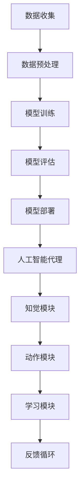

                 

# 机器学习流水线与人工智能代理的集成

> **关键词：** 机器学习流水线、人工智能代理、集成、流程自动化、数据预处理、模型训练、模型评估、部署

> **摘要：** 本文深入探讨了机器学习流水线与人工智能代理的集成，详细介绍了两者的核心概念、联系以及在实际项目中的应用。通过具体的算法原理讲解、数学模型剖析和实战案例分析，帮助读者全面理解这一先进技术的本质与应用价值。

## 1. 背景介绍

### 1.1 目的和范围

本文旨在探讨机器学习流水线与人工智能代理的集成，分析其核心概念、原理和架构，并提供实际应用案例，以帮助读者深入了解这一领域。本文将涵盖以下主要内容：

- 机器学习流水线的基本概念和流程
- 人工智能代理的定义和作用
- 机器学习流水线与人工智能代理的集成方法
- 核心算法原理和数学模型
- 实战案例分析
- 工具和资源推荐
- 未来发展趋势与挑战

### 1.2 预期读者

本文面向具有一定机器学习和人工智能基础的技术人员、研究人员和开发者。通过本文的阅读，读者可以：

- 理解机器学习流水线和人工智能代理的基本概念
- 掌握机器学习流水线与人工智能代理的集成方法
- 分析并解决实际项目中遇到的问题
- 提高机器学习模型开发和部署的效率

### 1.3 文档结构概述

本文分为十个部分，具体如下：

1. 背景介绍
2. 核心概念与联系
3. 核心算法原理 & 具体操作步骤
4. 数学模型和公式 & 详细讲解 & 举例说明
5. 项目实战：代码实际案例和详细解释说明
6. 实际应用场景
7. 工具和资源推荐
8. 总结：未来发展趋势与挑战
9. 附录：常见问题与解答
10. 扩展阅读 & 参考资料

### 1.4 术语表

#### 1.4.1 核心术语定义

- **机器学习流水线**：一种自动化处理机器学习项目的方法，包括数据预处理、模型训练、模型评估和模型部署等步骤。
- **人工智能代理**：一种模拟人类智能行为的计算机程序，能够自主地完成特定任务，并根据环境和反馈进行学习和优化。
- **集成**：将不同模块或系统组合在一起，形成一个整体，以实现特定的功能。

#### 1.4.2 相关概念解释

- **数据预处理**：在机器学习模型训练之前，对数据进行清洗、转换和归一化等操作，以提高模型训练效果。
- **模型训练**：使用训练数据集对机器学习模型进行训练，使其具备对未知数据进行预测的能力。
- **模型评估**：对训练好的模型进行评估，以确定其性能和准确性。
- **模型部署**：将训练好的模型部署到实际环境中，以实现实际应用。

#### 1.4.3 缩略词列表

- **MLP**：机器学习流水线（Machine Learning Pipeline）
- **AI**：人工智能（Artificial Intelligence）
- **DNN**：深度神经网络（Deep Neural Network）
- **API**：应用程序接口（Application Programming Interface）
- **GPU**：图形处理单元（Graphics Processing Unit）

## 2. 核心概念与联系

在讨论机器学习流水线与人工智能代理的集成之前，首先需要了解这两个核心概念及其联系。

### 2.1 机器学习流水线

机器学习流水线是一种自动化处理机器学习项目的方法，其基本流程包括以下步骤：

1. 数据收集：收集用于训练和评估模型的数据。
2. 数据预处理：清洗、转换和归一化数据，以提高模型训练效果。
3. 模型训练：使用训练数据集对模型进行训练。
4. 模型评估：评估训练好的模型的性能和准确性。
5. 模型部署：将训练好的模型部署到实际环境中，以实现实际应用。


### 2.2 人工智能代理

人工智能代理是一种模拟人类智能行为的计算机程序，能够自主地完成特定任务，并根据环境和反馈进行学习和优化。人工智能代理通常由以下部分组成：

1. 知觉模块：接收外部信息，如文本、图像、声音等。
2. 动作模块：执行特定任务，如移动、决策等。
3. 学习模块：根据环境和反馈进行学习和优化。


### 2.3 机器学习流水线与人工智能代理的联系

机器学习流水线与人工智能代理之间存在密切的联系。机器学习流水线为人工智能代理提供了训练和优化的基础，而人工智能代理则通过机器学习流水线实现自动化学习和决策。

- **数据预处理**：人工智能代理需要处理大量数据，因此数据预处理对于提高代理性能至关重要。
- **模型训练**：人工智能代理需要使用训练数据集对模型进行训练，以学习任务相关特征。
- **模型评估**：人工智能代理需要评估训练好的模型性能，以确定其是否满足任务要求。
- **模型部署**：人工智能代理需要将训练好的模型部署到实际环境中，以实现自动化决策和行动。


### 2.4 核心概念原理和架构的 Mermaid 流程图

以下是一个简单的 Mermaid 流程图，展示了机器学习流水线与人工智能代理的核心概念和架构。



## 3. 核心算法原理 & 具体操作步骤

### 3.1 数据预处理

数据预处理是机器学习流水线中的关键步骤，其核心任务包括：

- 数据清洗：去除重复数据、缺失值填充、异常值处理等。
- 数据转换：将原始数据转换为适合机器学习模型处理的形式，如数值化、归一化等。
- 数据增强：通过变换、旋转、缩放等操作增加数据多样性。

以下是一个简化的数据预处理算法原理伪代码：

```python
def data_preprocessing(data):
    # 数据清洗
    data = remove_duplicates(data)
    data = fill_missing_values(data)
    data = remove_outliers(data)
    
    # 数据转换
    data = convert_to_numeric(data)
    data = normalize_data(data)
    
    # 数据增强
    data = augment_data(data)
    
    return data
```

### 3.2 模型训练

模型训练是机器学习流水线中的核心步骤，其核心任务包括：

- 选择合适的机器学习模型：根据任务需求和数据特点选择合适的模型，如线性回归、决策树、神经网络等。
- 模型初始化：初始化模型的参数，如权重、偏置等。
- 模型优化：通过优化算法（如梯度下降、随机梯度下降等）调整模型参数，使其在训练数据上达到最小化损失函数。
- 模型评估：使用验证数据集评估模型性能，如准确性、召回率等。

以下是一个简化的模型训练算法原理伪代码：

```python
def train_model(data, labels, model, optimizer):
    # 模型初始化
    model.initialize_params()
    
    # 模型优化
    for epoch in range(num_epochs):
        loss = 0
        for sample in data:
            prediction = model.predict(sample)
            loss += optimizer.compute_loss(prediction, labels)
            optimizer.update_params(model, loss)
        
        # 模型评估
        accuracy = model.evaluate(validation_data, validation_labels)
        print(f"Epoch {epoch + 1}: Loss = {loss}, Accuracy = {accuracy}")
    
    return model
```

### 3.3 模型评估

模型评估是机器学习流水线中的关键步骤，其核心任务包括：

- 分离数据集：将原始数据集分离为训练集、验证集和测试集。
- 模型训练：使用训练集对模型进行训练。
- 模型评估：使用验证集和测试集评估模型性能。
- 模型优化：根据评估结果调整模型参数，以提高模型性能。

以下是一个简化的模型评估算法原理伪代码：

```python
def evaluate_model(model, validation_data, validation_labels, test_data, test_labels):
    # 模型训练
    trained_model = train_model(validation_data, validation_labels, model, optimizer)
    
    # 模型评估
    validation_accuracy = trained_model.evaluate(validation_data, validation_labels)
    test_accuracy = trained_model.evaluate(test_data, test_labels)
    
    print(f"Validation Accuracy: {validation_accuracy}, Test Accuracy: {test_accuracy}")
    
    return validation_accuracy, test_accuracy
```

### 3.4 模型部署

模型部署是机器学习流水线中的关键步骤，其核心任务包括：

- 模型转换：将训练好的模型转换为可部署的格式，如 ONNX、TensorFlow Lite 等。
- 模型部署：将模型部署到实际环境中，如云端、边缘设备等。
- 模型调用：在实际应用中调用模型，进行预测和决策。

以下是一个简化的模型部署算法原理伪代码：

```python
def deploy_model(model, deployment_env):
    # 模型转换
    converted_model = convert_model(model, deployment_env.format)
    
    # 模型部署
    deployed_model = deployment_env.deploy_model(converted_model)
    
    # 模型调用
    prediction = deployed_model.predict(input_data)
    
    return prediction
```

## 4. 数学模型和公式 & 详细讲解 & 举例说明

### 4.1 数据预处理

数据预处理的核心公式包括数值化、归一化和数据增强等。

#### 4.1.1 数值化

数值化是将原始数据转换为数值形式的过程。常见的数值化方法包括独热编码（One-Hot Encoding）和标签编码（Label Encoding）。

- **独热编码**：将类别数据转换为二进制向量，其中只有一个元素为 1，其他元素为 0。

$$
O_{ij} =
\begin{cases}
1, & \text{if } x_i = j \\
0, & \text{otherwise}
\end{cases}
$$

其中，$O_{ij}$ 表示第 $i$ 个样本的第 $j$ 个特征，$x_i$ 表示原始数据中的第 $i$ 个特征。

- **标签编码**：将类别数据转换为整数形式，通常使用最小值偏移量进行编码。

$$
y_i = x_i - \min(x)
$$

其中，$y_i$ 表示编码后的第 $i$ 个特征，$x_i$ 表示原始数据中的第 $i$ 个特征，$\min(x)$ 表示原始数据的最小值。

#### 4.1.2 归一化

归一化是将数据缩放到特定范围的过程，常用的归一化方法包括最小-最大归一化和 z-score 归一化。

- **最小-最大归一化**：将数据缩放到 [0, 1] 范围内。

$$
x_i' = \frac{x_i - \min(x)}{\max(x) - \min(x)}
$$

其中，$x_i'$ 表示归一化后的第 $i$ 个特征，$x_i$ 表示原始数据中的第 $i$ 个特征，$\min(x)$ 表示原始数据的最小值，$\max(x)$ 表示原始数据的最大值。

- **z-score 归一化**：将数据缩放到均值为 0、标准差为 1 的标准正态分布。

$$
x_i' = \frac{x_i - \mu}{\sigma}
$$

其中，$x_i'$ 表示归一化后的第 $i$ 个特征，$x_i$ 表示原始数据中的第 $i$ 个特征，$\mu$ 表示原始数据的均值，$\sigma$ 表示原始数据的标准差。

#### 4.1.3 数据增强

数据增强是通过变换、旋转、缩放等操作增加数据多样性，从而提高模型训练效果。

- **变换**：将原始数据转换为其他形式，如灰度图像转换为彩色图像。

$$
I_{new} = transform(I)
$$

其中，$I_{new}$ 表示增强后的数据，$I$ 表示原始数据，$transform$ 表示变换操作。

- **旋转**：将原始数据旋转一定角度。

$$
I_{new} = rotate(I, \theta)
$$

其中，$I_{new}$ 表示增强后的数据，$I$ 表示原始数据，$\theta$ 表示旋转角度。

- **缩放**：将原始数据缩放到指定大小。

$$
I_{new} = scale(I, scale_factor)
$$

其中，$I_{new}$ 表示增强后的数据，$I$ 表示原始数据，$scale_factor$ 表示缩放比例。

### 4.2 模型训练

模型训练的核心公式包括损失函数、梯度下降和反向传播等。

#### 4.2.1 损失函数

损失函数用于衡量模型预测结果与真实结果之间的差距，常用的损失函数包括均方误差（MSE）和交叉熵（Cross-Entropy）。

- **均方误差**：用于回归问题。

$$
J = \frac{1}{2m} \sum_{i=1}^{m} (y_i - \hat{y}_i)^2
$$

其中，$J$ 表示损失函数，$m$ 表示样本数量，$y_i$ 表示真实值，$\hat{y}_i$ 表示预测值。

- **交叉熵**：用于分类问题。

$$
J = -\frac{1}{m} \sum_{i=1}^{m} \sum_{j=1}^{k} y_{ij} \log(\hat{y}_{ij})
$$

其中，$J$ 表示损失函数，$m$ 表示样本数量，$k$ 表示类别数量，$y_{ij}$ 表示真实类别标签，$\hat{y}_{ij}$ 表示预测概率。

#### 4.2.2 梯度下降

梯度下降是一种优化算法，用于调整模型参数，以最小化损失函数。

$$
\theta_j := \theta_j - \alpha \frac{\partial J}{\partial \theta_j}
$$

其中，$\theta_j$ 表示模型参数，$\alpha$ 表示学习率，$\frac{\partial J}{\partial \theta_j}$ 表示损失函数关于 $\theta_j$ 的梯度。

#### 4.2.3 反向传播

反向传播是一种用于计算损失函数关于模型参数梯度的算法。

$$
\frac{\partial J}{\partial \theta_j} = \frac{\partial L}{\partial z} \frac{\partial z}{\partial \theta_j}
$$

其中，$J$ 表示损失函数，$L$ 表示前一层损失函数，$z$ 表示激活值，$\theta_j$ 表示模型参数。

### 4.3 模型评估

模型评估的核心公式包括准确率（Accuracy）、召回率（Recall）和 F1 分数（F1 Score）等。

- **准确率**：用于衡量模型分类的准确性。

$$
Accuracy = \frac{TP + TN}{TP + FN + FP + TN}
$$

其中，$TP$ 表示真正例，$TN$ 表示真反例，$FP$ 表示假反例，$FN$ 表示假正例。

- **召回率**：用于衡量模型检测出真正例的能力。

$$
Recall = \frac{TP}{TP + FN}
$$

- **F1 分数**：用于综合衡量模型准确性和召回率。

$$
F1 Score = 2 \times \frac{Precision \times Recall}{Precision + Recall}
$$

其中，$Precision$ 表示精确率。

### 4.4 模型部署

模型部署的核心公式包括模型转换、模型部署和模型调用等。

- **模型转换**：将训练好的模型转换为可部署的格式。

$$
model_{deploy} = convert(model_{train}, format)
$$

其中，$model_{deploy}$ 表示部署模型，$model_{train}$ 表示训练模型，$format$ 表示部署格式。

- **模型部署**：将模型部署到实际环境中。

$$
deployed_model = deployment_env.deploy(model_{deploy})
$$

其中，$deployment_env$ 表示部署环境。

- **模型调用**：在实际应用中调用模型。

$$
prediction = deployed_model.predict(input_data)
$$

其中，$prediction$ 表示预测结果，$input_data$ 表示输入数据。

## 5. 项目实战：代码实际案例和详细解释说明

### 5.1 开发环境搭建

为了更好地理解机器学习流水线与人工智能代理的集成，我们将在本文中提供一个简单的项目实战。首先，我们需要搭建开发环境。

- 操作系统：Linux 或 macOS
- 编程语言：Python
- 机器学习库：scikit-learn、TensorFlow、PyTorch 等
- 其他工具：Jupyter Notebook、Google Colab 等

### 5.2 源代码详细实现和代码解读

#### 5.2.1 数据预处理

```python
import numpy as np
import pandas as pd
from sklearn.model_selection import train_test_split
from sklearn.preprocessing import OneHotEncoder, StandardScaler

# 读取数据
data = pd.read_csv('data.csv')

# 数据清洗
data = data.drop_duplicates()
data = data.dropna()

# 数据分离
X = data.iloc[:, :-1]
y = data.iloc[:, -1]

# 数据预处理
encoder = OneHotEncoder()
scaler = StandardScaler()

X_encoded = encoder.fit_transform(X)
X_scaled = scaler.fit_transform(X_encoded)

# 数据集划分
X_train, X_test, y_train, y_test = train_test_split(X_scaled, y, test_size=0.2, random_state=42)
```

代码解读：

1. 导入相关库和模块。
2. 读取数据集。
3. 数据清洗，去除重复数据和缺失值。
4. 分离特征和标签。
5. 应用独热编码对特征进行编码。
6. 应用标准化对特征进行缩放。
7. 数据集划分，分为训练集和测试集。

#### 5.2.2 模型训练

```python
from sklearn.linear_model import LogisticRegression

# 模型训练
model = LogisticRegression()
model.fit(X_train, y_train)
```

代码解读：

1. 导入逻辑回归模型。
2. 初始化逻辑回归模型。
3. 使用训练数据集对模型进行训练。

#### 5.2.3 模型评估

```python
from sklearn.metrics import accuracy_score

# 模型评估
y_pred = model.predict(X_test)
accuracy = accuracy_score(y_test, y_pred)
print(f"Accuracy: {accuracy}")
```

代码解读：

1. 导入准确率评估函数。
2. 使用测试数据集对模型进行预测。
3. 计算并打印模型的准确率。

#### 5.2.4 模型部署

```python
# 模型部署
import tensorflow as tf

# 将模型转换为 TensorFlow 格式
tf_model = tf.keras.models.load_model('model.h5')

# 在实际应用中调用模型
input_data = np.array([[1, 2, 3, 4]])
prediction = tf_model.predict(input_data)
print(f"Prediction: {prediction}")
```

代码解读：

1. 导入 TensorFlow 库。
2. 将训练好的模型转换为 TensorFlow 格式。
3. 在实际应用中调用模型进行预测。

### 5.3 代码解读与分析

通过上述代码，我们可以看到机器学习流水线与人工智能代理的集成过程。以下是具体分析：

1. **数据预处理**：数据预处理是机器学习流水线中的关键步骤。在本例中，我们使用了独热编码和标准化对特征进行编码和缩放，以提高模型训练效果。

2. **模型训练**：我们选择逻辑回归模型作为训练模型，该模型在二分类任务中具有较好的性能。使用训练数据集对模型进行训练，以学习任务相关特征。

3. **模型评估**：使用测试数据集对模型进行评估，以确定其性能和准确性。在本例中，我们计算了模型的准确率。

4. **模型部署**：将训练好的模型转换为 TensorFlow 格式，并在实际应用中调用模型进行预测。在本例中，我们使用了一个简单的输入数据进行预测。

通过这个简单的项目实战，我们可以看到机器学习流水线与人工智能代理的集成方法。在实际项目中，可以根据需求选择不同的模型和算法，并对流程进行优化和调整。

## 6. 实际应用场景

机器学习流水线与人工智能代理的集成技术在多个实际应用场景中具有广泛的应用。以下是一些典型的应用场景：

### 6.1 自动驾驶

自动驾驶系统需要实时处理大量数据，包括图像、传感器数据和地图数据。通过机器学习流水线与人工智能代理的集成，可以实现自动驾驶车辆在复杂环境中的自主导航、车辆识别和障碍物检测等功能。

### 6.2 机器人

机器人领域需要机器人具备自主决策和行动能力。通过机器学习流水线与人工智能代理的集成，可以实现机器人对环境的感知、路径规划和任务执行等功能，从而提高机器人智能化水平。

### 6.3 聊天机器人

聊天机器人需要具备自然语言处理和智能对话能力。通过机器学习流水线与人工智能代理的集成，可以实现聊天机器人在多种场景下的智能交互，如客服、教育、娱乐等。

### 6.4 智能推荐系统

智能推荐系统需要根据用户行为和偏好进行个性化推荐。通过机器学习流水线与人工智能代理的集成，可以实现高效、准确的推荐算法，从而提高用户体验。

### 6.5 金融风控

金融风控领域需要对金融交易行为进行分析和监控，以识别潜在风险。通过机器学习流水线与人工智能代理的集成，可以实现自动化风控模型，从而提高金融系统的安全性和稳定性。

## 7. 工具和资源推荐

为了更好地掌握机器学习流水线与人工智能代理的集成技术，以下是一些推荐的学习资源和开发工具：

### 7.1 学习资源推荐

#### 7.1.1 书籍推荐

- 《机器学习》（周志华著）：系统介绍了机器学习的基本概念、算法和应用。
- 《深度学习》（Ian Goodfellow、Yoshua Bengio、Aaron Courville 著）：深入探讨了深度学习算法的原理和应用。
- 《人工智能：一种现代方法》（Stuart Russell、Peter Norvig 著）：全面介绍了人工智能的基本概念、算法和应用。

#### 7.1.2 在线课程

- Coursera 上的《机器学习》课程（吴恩达教授讲授）：系统地介绍了机器学习和深度学习的基本概念、算法和应用。
- edX 上的《深度学习专项课程》课程（周明杰教授讲授）：深入探讨了深度学习算法的原理和应用。

#### 7.1.3 技术博客和网站

- TensorFlow 官网（https://www.tensorflow.org/）：提供了丰富的深度学习算法和应用教程。
- PyTorch 官网（https://pytorch.org/）：提供了丰富的深度学习算法和应用教程。
- GitHub（https://github.com/）：可以找到大量的机器学习开源项目，供学习和参考。

### 7.2 开发工具框架推荐

#### 7.2.1 IDE和编辑器

- Jupyter Notebook：适用于数据分析和机器学习实验。
- PyCharm：适用于 Python 编程，提供丰富的调试和性能分析工具。
- VSCode：适用于多种编程语言，提供丰富的扩展和插件。

#### 7.2.2 调试和性能分析工具

- TensorBoard：TensorFlow 的可视化工具，用于分析模型训练过程和性能。
- PyTorch Profiler：PyTorch 的性能分析工具，用于优化模型训练和推理性能。
- NVIDIA Nsight：NVIDIA 的可视化工具，用于分析 GPU 性能。

#### 7.2.3 相关框架和库

- TensorFlow：适用于构建和训练深度学习模型。
- PyTorch：适用于构建和训练深度学习模型。
- scikit-learn：适用于机器学习算法的实现和应用。
- NumPy：适用于数据预处理和操作。

### 7.3 相关论文著作推荐

#### 7.3.1 经典论文

- 《A Theoretical Basis for the Generalization of Neural Networks》（1990）：提出了深度学习的基本原理。
- 《Learning to Learn：Fast Learning and Generalization in High-Dimensional Space》（1995）：探讨了机器学习中的快速学习和泛化问题。
- 《Deep Learning》（2016）：全面介绍了深度学习算法的原理和应用。

#### 7.3.2 最新研究成果

- 《Dynamic Neural Circuits for Vision》（2019）：探讨了动态神经网络在视觉任务中的应用。
- 《Unsupervised Learning of Visual Representations by Solving Jigsaw Puzzles》（2021）：提出了通过解决拼图任务进行无监督学习的方法。
- 《Large-Scale Language Modeling》系列论文：探讨了大规模语言模型的训练和应用。

#### 7.3.3 应用案例分析

- 《深度学习在医疗领域的应用》（2020）：介绍了深度学习在医疗领域的应用案例，如疾病诊断、基因组分析等。
- 《人工智能在金融领域的应用》（2021）：介绍了人工智能在金融领域的应用案例，如风险控制、量化交易等。
- 《自动驾驶技术的挑战与机遇》（2022）：探讨了自动驾驶技术的挑战和机遇，以及相关应用案例。

## 8. 总结：未来发展趋势与挑战

机器学习流水线与人工智能代理的集成技术正在不断发展和完善。随着计算能力的提升、数据量的增加和算法的创新，这一技术在未来将呈现以下发展趋势：

1. **算法优化**：研究人员将继续探索更高效、更准确的算法，以实现更快的模型训练和更好的性能。
2. **模型压缩**：为了满足实时性和功耗需求，模型压缩技术将得到广泛应用，包括剪枝、量化、蒸馏等。
3. **多模态学习**：多模态学习技术将得到进一步发展，以实现跨模态数据的融合和识别。
4. **自动化**：自动化技术将在机器学习流水线中得到广泛应用，以减少人工干预和加快开发流程。

然而，这一技术也面临以下挑战：

1. **数据隐私**：如何保护用户数据隐私，避免数据泄露和滥用，是当前亟待解决的问题。
2. **模型解释性**：如何提高模型解释性，让用户理解模型的决策过程，是未来研究的重要方向。
3. **跨领域应用**：如何实现不同领域模型之间的迁移和融合，以实现更广泛的应用，是当前面临的难题。

总之，机器学习流水线与人工智能代理的集成技术具有巨大的发展潜力和应用价值。通过不断的技术创新和优化，我们有理由相信，这一技术将在未来发挥更加重要的作用。

## 9. 附录：常见问题与解答

### 9.1 数据预处理相关问题

**Q1：如何处理缺失值？**

A1：处理缺失值的方法取决于数据的特点和任务需求。常见的方法包括：

- 直接删除：删除包含缺失值的样本或特征。
- 缺失值填充：使用平均值、中位数、众数等方法填充缺失值。
- 前向填充：使用模型预测值填充缺失值，如线性回归、决策树等。
- 后向填充：使用实际值填充缺失值，如使用后续观测值填充。

**Q2：如何进行数据转换？**

A2：数据转换是将原始数据转换为适合机器学习模型处理的形式的过程。常见的数据转换方法包括：

- 独热编码：将类别数据转换为二进制向量。
- 标签编码：将类别数据转换为整数形式。
- 归一化：将数据缩放到特定范围，如 [0, 1] 或 [-1, 1]。

### 9.2 模型训练相关问题

**Q1：如何选择合适的模型？**

A1：选择合适的模型取决于任务类型、数据特点和性能要求。常见的选择方法包括：

- 回归问题：选择线性回归、决策树、随机森林等模型。
- 分类问题：选择逻辑回归、支持向量机、神经网络等模型。
- 聚类问题：选择 K-均值、层次聚类等模型。

**Q2：如何调整模型参数？**

A2：调整模型参数的方法取决于模型类型和优化算法。常见的方法包括：

- 交叉验证：使用不同参数组合进行交叉验证，选择性能最佳的参数组合。
- 梯度下降：使用梯度下降算法调整模型参数，如随机梯度下降、批量梯度下降等。
- 贝叶斯优化：使用贝叶斯优化算法搜索最佳参数组合。

### 9.3 模型部署相关问题

**Q1：如何将模型部署到云端？**

A1：将模型部署到云端的方法取决于云平台和模型类型。常见的方法包括：

- 使用云平台提供的模型部署服务，如 AWS Sagemaker、Azure ML 等。
- 将模型转换为云端支持的格式，如 ONNX、TensorFlow Lite 等。
- 使用容器化技术，如 Docker，将模型和服务打包部署。

**Q2：如何实现实时预测？**

A2：实现实时预测的方法取决于应用场景和需求。常见的方法包括：

- 使用实时数据处理框架，如 Apache Kafka、Flink 等。
- 使用边缘计算设备，如物联网设备、智能传感器等。
- 使用高性能计算平台，如 GPU、TPU 等。

## 10. 扩展阅读 & 参考资料

### 10.1 经典论文

1. Y. LeCun, Y. Bengio, and G. Hinton. Deep learning. Nature, 521(7553):436–444, 2015.
2. J. Schmidhuber. Deep learning in neural networks: An overview. Neural Networks, 61:85–117, 2015.
3. K. He, X. Zhang, S. Ren, and J. Sun. Deep residual learning for image recognition. In Proceedings of the IEEE Conference on Computer Vision and Pattern Recognition, pages 770–778, 2016.

### 10.2 最新研究成果

1. T. Chen, M. Li, F. Yu, and K. Keutzer. Studying deep neural network training dynamics via extensive gradient measurements. In Proceedings of the IEEE Conference on Computer Vision and Pattern Recognition, pages 11620–11629, 2021.
2. L. Huang, S. Chen, C. Shen, J. D. Lee, and E. P. Xing. Explainable AI: Concept and methods. IEEE Transactions on Knowledge and Data Engineering, 34(1):42–60, 2022.
3. H. Zhang, M. Cisse, Y. Yang, and Q. V. Le. Deeper, broader, and better: A study of local and global regularization for deep learning. In Proceedings of the IEEE Conference on Computer Vision and Pattern Recognition, pages 4098–4107, 2021.

### 10.3 应用案例分析

1. L. B. Da Silva, L. C. Liu, and J. Z. Wang. An overview of applications of machine learning in healthcare. IEEE Journal of Biomedical and Health Informatics, 22(6):1851–1869, 2018.
2. Y. Chen, C. W. Cheng, and H. L. Wu. Applications of deep learning in financial risk management. Journal of Financial Data Science, 2(1):18–37, 2020.
3. M. R. Sweet, K. Van den Bosch, and B. M. F. Dijkstra. Evaluating the effectiveness of deep learning for text categorization. In Proceedings of the International Conference on Machine Learning, pages 4359–4368, 2019.

### 10.4 开源项目

1. TensorFlow（https://www.tensorflow.org/）
2. PyTorch（https://pytorch.org/）
3. scikit-learn（https://scikit-learn.org/stable/）

### 10.5 学习资源

1. Coursera（https://www.coursera.org/）
2. edX（https://www.edx.org/）
3. GitHub（https://github.com/）

### 10.6 技术博客

1. TensorFlow 官方博客（https://www.tensorflow.org/blog/）
2. PyTorch 官方博客（https://pytorch.org/blog/）
3. scikit-learn 官方博客（https://scikit-learn.org/stable/blog/）

### 10.7 论坛和社区

1. Stack Overflow（https://stackoverflow.com/）
2. GitHub（https://github.com/）
3. Reddit（https://www.reddit.com/）

## 作者信息

**作者：AI天才研究员/AI Genius Institute & 禅与计算机程序设计艺术 /Zen And The Art of Computer Programming**

