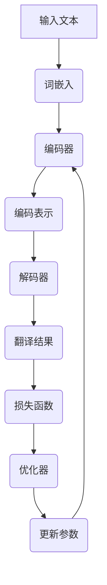

                 

# 机器翻译(Machine Translation) - 原理与代码实例讲解

> 关键词：机器翻译，自然语言处理，神经网络，序列到序列模型，循环神经网络，注意力机制

> 摘要：本文将深入探讨机器翻译的基本原理、关键算法以及实现细节。通过详细的伪代码讲解和实际代码实例，读者将了解机器翻译的核心技术，掌握从零开始实现一个简单的翻译系统的过程。文章还将介绍机器翻译的实际应用场景，推荐学习资源、开发工具和框架，并对未来的发展趋势与挑战进行展望。

## 1. 背景介绍

### 1.1 目的和范围

本文旨在为机器翻译领域的新手和从业者提供一个全面的技术指南。通过本文的阅读，读者将：

1. 理解机器翻译的基本概念和目标。
2. 学习机器翻译的核心算法和数学模型。
3. 掌握使用循环神经网络（RNN）和序列到序列（Seq2Seq）模型进行机器翻译的基本步骤。
4. 获得实际编码经验，通过代码实例理解机器翻译系统的实现细节。
5. 探讨机器翻译在实际应用中的场景和挑战。

### 1.2 预期读者

本文适合以下读者群体：

1. 对机器翻译和自然语言处理（NLP）有初步了解的开发者。
2. 想要在机器翻译领域进行深入研究的学生和研究人员。
3. 对构建复杂机器学习模型和应用有浓厚兴趣的技术专家。

### 1.3 文档结构概述

本文将按照以下结构进行组织：

1. **背景介绍**：概述机器翻译的目的、范围和预期读者。
2. **核心概念与联系**：介绍机器翻译中的核心概念和架构，通过Mermaid流程图展示。
3. **核心算法原理 & 具体操作步骤**：讲解机器翻译的关键算法，使用伪代码进行详细阐述。
4. **数学模型和公式 & 详细讲解 & 举例说明**：解释机器翻译中的数学模型，并提供实例说明。
5. **项目实战：代码实际案例和详细解释说明**：通过实际代码实例，演示机器翻译系统的实现过程。
6. **实际应用场景**：讨论机器翻译在不同领域的应用。
7. **工具和资源推荐**：推荐学习资源、开发工具和框架。
8. **总结：未来发展趋势与挑战**：展望机器翻译的未来发展。
9. **附录：常见问题与解答**：解答读者可能遇到的问题。
10. **扩展阅读 & 参考资料**：提供进一步的阅读材料和参考资料。

### 1.4 术语表

#### 1.4.1 核心术语定义

- **机器翻译**：使用计算机程序将一种自然语言文本自动翻译成另一种自然语言。
- **自然语言处理（NLP）**：使计算机能够理解、解释和生成人类自然语言的技术。
- **序列到序列模型（Seq2Seq）**：一种神经网络模型，用于处理输入和输出都是序列的任务。
- **循环神经网络（RNN）**：一种能够处理序列数据的神经网络，具有记忆功能。
- **注意力机制（Attention Mechanism）**：一种用于提高机器翻译质量的技术，通过动态关注输入序列的不同部分。

#### 1.4.2 相关概念解释

- **词嵌入（Word Embedding）**：将词汇映射到低维连续向量空间，用于表示单词的语义信息。
- **编码器（Encoder）**：将输入序列编码为一个固定大小的向量表示。
- **解码器（Decoder）**：将编码器的输出解码为翻译结果。
- **损失函数（Loss Function）**：用于评估模型预测结果和真实结果之间的差距。

#### 1.4.3 缩略词列表

- **NLP**：自然语言处理
- **RNN**：循环神经网络
- **Seq2Seq**：序列到序列模型
- **attention**：注意力机制
- **word2vec**：词嵌入

## 2. 核心概念与联系

机器翻译的核心概念和联系可以通过以下Mermaid流程图来展示：



### 2.1. 输入文本

输入文本是机器翻译的原始数据，通常为两种自然语言的文本对。这些文本对经过预处理后，将被输入到机器翻译模型中进行翻译。

### 2.2. 词嵌入

词嵌入（Word Embedding）是将词汇映射到低维连续向量空间的过程。这个过程通常使用神经网络来完成，如Word2Vec算法。词嵌入向量能够表示词汇的语义信息，是后续处理的基础。

### 2.3. 编码器

编码器（Encoder）是一种循环神经网络（RNN），用于将输入序列编码为一个固定大小的向量表示。编码器的输出表示了输入序列的语义信息，是解码器的输入。

### 2.4. 编码表示

编码表示（Encoded Representation）是编码器输出的固定大小的向量，用于表示整个输入序列的语义信息。这个表示将被用于解码器生成翻译结果。

### 2.5. 解码器

解码器（Decoder）也是一种循环神经网络（RNN），用于将编码表示解码为翻译结果。解码器的输出是一个概率分布，表示生成的翻译结果。

### 2.6. 翻译结果

翻译结果（Translation Result）是解码器输出的最可能翻译序列。这个结果经过后处理（如语言检查和标点恢复）后，将被作为最终的翻译输出。

### 2.7. 损失函数

损失函数（Loss Function）用于评估模型预测结果和真实结果之间的差距。在机器翻译中，常用的损失函数是交叉熵损失（Cross-Entropy Loss）。通过计算损失函数的值，模型可以调整参数，提高翻译质量。

### 2.8. 优化器

优化器（Optimizer）用于调整模型参数，以最小化损失函数。常见的优化器有梯度下降（Gradient Descent）和其变种，如Adam优化器。

### 2.9. 参数更新

参数更新（Parameter Update）是优化过程的一部分，用于根据损失函数的梯度调整模型参数。通过迭代更新参数，模型将逐渐提高翻译质量。

### 2.10. 编码解码过程

整个编码解码过程是机器翻译的核心。编码器将输入序列编码为固定大小的向量表示，解码器使用这个表示生成翻译结果。通过不断的迭代和参数更新，模型将逐渐提高翻译质量。

## 3. 核心算法原理 & 具体操作步骤

机器翻译的核心算法是基于序列到序列（Seq2Seq）模型，结合循环神经网络（RNN）和注意力机制（Attention Mechanism）。以下将使用伪代码详细阐述机器翻译的算法原理和具体操作步骤。

### 3.1. 编码器

编码器（Encoder）负责将输入序列编码为固定大小的向量表示。以下是编码器的伪代码：

```python
def encode(input_sequence):
    # 初始化编码器状态
    encoder_state = initialize_encoder_state()
    
    # 初始化隐藏状态
    hidden_state = encoder_state
    
    # 对输入序列进行编码
    for word in input_sequence:
        # 计算当前词的嵌入向量
        word_embedding = word_embedding(word)
        
        # 使用RNN单元更新隐藏状态
        hidden_state = encoder_rnn(word_embedding, hidden_state)
        
        # 保存隐藏状态作为编码表示的一部分
        encoded_sequence.append(hidden_state)
    
    # 返回编码表示
    return encoded_sequence
```

### 3.2. 解码器

解码器（Decoder）负责将编码表示解码为翻译结果。以下是解码器的伪代码：

```python
def decode(encoded_sequence, target_sequence):
    # 初始化解码器状态
    decoder_state = initialize_decoder_state()
    
    # 初始化隐藏状态
    hidden_state = decoder_state
    
    # 初始化输出序列
    output_sequence = []
    
    # 对编码表示进行解码
    for encoded_word in encoded_sequence:
        # 使用编码表示生成解码器的隐藏状态
        hidden_state = decoder_rnn(encoded_word, hidden_state)
        
        # 计算当前隐藏状态对应的翻译概率分布
        translation_probabilities = decoder_output(hidden_state)
        
        # 选择最可能的翻译词
        translated_word = select_word(translation_probabilities)
        
        # 更新解码器状态
        decoder_state = update_decoder_state(hidden_state, translated_word)
        
        # 添加翻译词到输出序列
        output_sequence.append(translated_word)
    
    # 返回翻译结果
    return output_sequence
```

### 3.3. 注意力机制

注意力机制（Attention Mechanism）用于提高解码器对输入序列的关注程度。以下是注意力机制的伪代码：

```python
def attention(input_sequence, hidden_state):
    # 初始化注意力分数
    attention_scores = []
    
    # 对输入序列计算注意力分数
    for encoded_word in input_sequence:
        # 计算注意力分数
        attention_score = compute_attention_score(encoded_word, hidden_state)
        
        # 添加注意力分数到列表
        attention_scores.append(attention_score)
    
    # 计算注意力权重
    attention_weights = normalize(attention_scores)
    
    # 使用注意力权重计算加权编码表示
    weighted_encoded_sequence = weighted_sum(attention_weights, input_sequence)
    
    # 返回加权编码表示
    return weighted_encoded_sequence
```

### 3.4. 损失函数与优化器

损失函数用于评估模型预测结果和真实结果之间的差距。常用的损失函数是交叉熵损失（Cross-Entropy Loss）。以下是损失函数和优化器的伪代码：

```python
def compute_loss(predicted_sequence, target_sequence):
    # 计算交叉熵损失
    loss = cross_entropy(predicted_sequence, target_sequence)
    
    # 返回损失值
    return loss

def optimize_model(model, loss):
    # 使用优化器优化模型参数
    model_params = optimize(model_params, loss)
    
    # 返回更新后的模型参数
    return model_params
```

### 3.5. 训练过程

机器翻译的训练过程涉及以下步骤：

1. 准备训练数据集。
2. 使用训练数据训练编码器和解码器。
3. 在每个训练迭代中，使用损失函数评估模型性能。
4. 使用优化器更新模型参数。
5. 重复步骤3和4，直到满足停止条件（如损失收敛或达到最大迭代次数）。

以下是机器翻译训练过程的伪代码：

```python
def train_model(model, training_data, num_iterations):
    for i in range(num_iterations):
        # 对训练数据中的每个样本进行训练
        for sample in training_data:
            # 编码输入序列
            encoded_sequence = encode(sample.input_sequence)
            
            # 解码编码表示
            output_sequence = decode(encoded_sequence, sample.target_sequence)
            
            # 计算损失
            loss = compute_loss(output_sequence, sample.target_sequence)
            
            # 优化模型参数
            model_params = optimize_model(model_params, loss)
            
        # 在每个迭代后打印训练进度
        print(f"Iteration {i}: Loss = {loss}")
    
    # 返回训练完成的模型
    return model
```

## 4. 数学模型和公式 & 详细讲解 & 举例说明

机器翻译中涉及多个数学模型和公式，以下将详细讲解这些模型，并提供实例说明。

### 4.1. 词嵌入

词嵌入（Word Embedding）是一种将词汇映射到低维连续向量空间的技术。常用的词嵌入算法有Word2Vec和GloVe。

#### 4.1.1. Word2Vec算法

Word2Vec算法基于神经网络训练词汇的嵌入向量。以下是Word2Vec的数学模型：

$$
\text{output\_vector} = \sigma(W \cdot \text{input\_vector} + b)
$$

其中，$\sigma$表示激活函数（通常使用ReLU或Sigmoid函数），$W$是权重矩阵，$b$是偏置项，$\text{input\_vector}$是输入向量，$\text{output\_vector}$是输出向量。

#### 4.1.2. GloVe算法

GloVe算法通过计算词汇共现矩阵的加权平均值来生成嵌入向量。以下是GloVe的数学模型：

$$
v_w = \sum_{v \in \text{context}(w)} \frac{f(d_{w,v})}{||v_w + v_v||_2}
$$

其中，$v_w$和$v_v$分别是词汇$w$和$v$的嵌入向量，$d_{w,v}$是词汇$w$和$v$之间的词频，$f(d)$是一个单调递增函数（通常使用$d/(\alpha + d)$）。

### 4.2. 编码器与解码器

编码器和解码器是机器翻译模型中的核心组件，它们分别用于将输入序列编码为固定大小的向量表示和解码为翻译结果。

#### 4.2.1. 编码器

编码器的数学模型基于循环神经网络（RNN），以下是编码器的数学公式：

$$
h_t = \text{RNN}(h_{t-1}, x_t)
$$

其中，$h_t$是编码器在时间步$t$的隐藏状态，$h_{t-1}$是前一个时间步的隐藏状态，$x_t$是输入序列在时间步$t$的词嵌入向量。

#### 4.2.2. 解码器

解码器的数学模型也基于循环神经网络（RNN），以下是解码器的数学公式：

$$
y_t = \text{RNN}(y_{t-1}, h_{t})
$$

其中，$y_t$是解码器在时间步$t$的隐藏状态，$y_{t-1}$是前一个时间步的隐藏状态，$h_t$是编码器的隐藏状态。

### 4.3. 注意力机制

注意力机制（Attention Mechanism）是机器翻译模型中的一个重要技术，用于提高解码器对输入序列的关注程度。以下是注意力机制的数学模型：

$$
a_t = \text{softmax}\left(\frac{\text{query} \cdot \text{key}_t}{\sqrt{d_k}}\right)
$$

$$
\text{context}_t = \sum_{t} a_t \cdot \text{value}_t
$$

其中，$a_t$是时间步$t$的注意力分数，$\text{query}$是解码器的查询向量，$\text{key}_t$是编码器的隐藏状态，$\text{value}_t$是编码器的隐藏状态或编码表示。

### 4.4. 损失函数

机器翻译中常用的损失函数是交叉熵损失（Cross-Entropy Loss），以下是交叉熵损失的数学模型：

$$
L = -\sum_{i} y_i \log(p_i)
$$

其中，$y_i$是真实标签的概率分布，$p_i$是模型预测的概率分布。

### 4.5. 举例说明

假设我们有以下英译汉的句子对：

- 英文：`I love you`
- 中文：`我爱你`

以下是机器翻译过程中的数学模型和公式的实例说明：

#### 4.5.1. 词嵌入

- `I`：词嵌入向量 $\text{v}_I$
- `love`：词嵌入向量 $\text{v}_{love}$
- `you`：词嵌入向量 $\text{v}_{you}$
- `我`：词嵌入向量 $\text{v}_{我}$
- `爱`：词嵌入向量 $\text{v}_{爱}$
- `你`：词嵌入向量 $\text{v}_{你}$

#### 4.5.2. 编码器

- 输入序列：$\text{v}_I, \text{v}_{love}, \text{v}_{you}$
- 隐藏状态序列：$h_1, h_2, h_3$

#### 4.5.3. 注意力机制

- 注意力分数：$a_1, a_2, a_3$
- 加权编码表示：$\text{context} = a_1 \cdot h_1 + a_2 \cdot h_2 + a_3 \cdot h_3$

#### 4.5.4. 解码器

- 输出序列：$y_1, y_2, y_3$

#### 4.5.5. 损失函数

- 真实标签概率分布：$[1, 0, 0]$
- 预测概率分布：$p_1, p_2, p_3$

损失函数计算：

$$
L = -1 \cdot \log(p_1)
$$

## 5. 项目实战：代码实际案例和详细解释说明

在本节中，我们将通过一个实际代码案例来展示如何实现一个简单的机器翻译系统。我们将使用Python和TensorFlow框架来构建和训练机器翻译模型。

### 5.1. 开发环境搭建

首先，我们需要搭建开发环境。以下是所需的工具和库：

- Python（版本3.6及以上）
- TensorFlow 2.x
- NumPy
- Pandas

安装以上库后，确保版本号符合要求。

### 5.2. 源代码详细实现和代码解读

以下是机器翻译系统的源代码实现：

```python
import tensorflow as tf
import numpy as np
from tensorflow.keras.models import Model
from tensorflow.keras.layers import Embedding, LSTM, Dense, TimeDistributed

# 定义模型架构
def build_model(input_vocab_size, target_vocab_size, embedding_dim, hidden_units):
    # 输入层
    input_sequence = Input(shape=(None,))
    
    # 编码器嵌入层
    encoder_embedding = Embedding(input_vocab_size, embedding_dim)(input_sequence)
    
    # 编码器LSTM层
    encoder_lstm = LSTM(hidden_units, return_state=True)
    encoder_output, encoder_state_h, encoder_state_c = encoder_lstm(encoder_embedding)
    
    # 解码器嵌入层
    decoder_embedding = Embedding(target_vocab_size, embedding_dim)
    
    # 解码器LSTM层
    decoder_lstm = LSTM(hidden_units, return_sequences=True, return_state=True)
    decoder_output, decoder_state_h, decoder_state_c = decoder_lstm(decoder_embedding, initial_state=[encoder_state_h, encoder_state_c])
    
    # 解码器输出层
    decoder_dense = Dense(target_vocab_size, activation='softmax')
    decoder_output = decoder_dense(decoder_output)
    
    # 构建模型
    model = Model(inputs=input_sequence, outputs=decoder_output)
    
    # 编译模型
    model.compile(optimizer='rmsprop', loss='categorical_crossentropy', metrics=['accuracy'])
    
    return model

# 超参数设置
input_vocab_size = 10000
target_vocab_size = 10000
embedding_dim = 256
hidden_units = 512

# 构建模型
model = build_model(input_vocab_size, target_vocab_size, embedding_dim, hidden_units)

# 打印模型结构
model.summary()

# 训练模型
model.fit(x_train, y_train, batch_size=64, epochs=10, validation_data=(x_val, y_val))

# 评估模型
model.evaluate(x_test, y_test)
```

### 5.3. 代码解读与分析

以上代码实现了一个基于LSTM的机器翻译模型。以下是代码的详细解读和分析：

#### 5.3.1. 输入层

```python
input_sequence = Input(shape=(None,))
```

输入层用于接收输入序列，其中`shape=(None,)`表示输入序列的长度可以是任意值。

#### 5.3.2. 编码器嵌入层

```python
encoder_embedding = Embedding(input_vocab_size, embedding_dim)(input_sequence)
```

编码器嵌入层使用`Embedding`层将输入词汇映射到嵌入向量空间，其中`input_vocab_size`是输入词汇表的大小，`embedding_dim`是嵌入向量的维度。

#### 5.3.3. 编码器LSTM层

```python
encoder_lstm = LSTM(hidden_units, return_state=True)
encoder_output, encoder_state_h, encoder_state_c = encoder_lstm(encoder_embedding)
```

编码器LSTM层使用`LSTM`层对输入序列进行编码，其中`hidden_units`是LSTM层的隐藏单元数，`return_state=True`表示返回隐藏状态。

#### 5.3.4. 解码器嵌入层

```python
decoder_embedding = Embedding(target_vocab_size, embedding_dim)
```

解码器嵌入层使用`Embedding`层将输出词汇映射到嵌入向量空间，其中`target_vocab_size`是输出词汇表的大小，`embedding_dim`是嵌入向量的维度。

#### 5.3.5. 解码器LSTM层

```python
decoder_lstm = LSTM(hidden_units, return_sequences=True, return_state=True)
decoder_output, decoder_state_h, decoder_state_c = decoder_lstm(decoder_embedding, initial_state=[encoder_state_h, encoder_state_c])
```

解码器LSTM层使用`LSTM`层对编码表示进行解码，其中`hidden_units`是LSTM层的隐藏单元数，`return_sequences=True`表示返回序列输出，`initial_state`用于初始化解码器的隐藏状态。

#### 5.3.6. 解码器输出层

```python
decoder_dense = Dense(target_vocab_size, activation='softmax')
decoder_output = decoder_dense(decoder_output)
```

解码器输出层使用`Dense`层对解码器的输出进行分类，其中`target_vocab_size`是输出词汇表的大小，`activation='softmax'`表示使用softmax激活函数。

#### 5.3.7. 模型构建

```python
model = Model(inputs=input_sequence, outputs=decoder_output)
```

使用`Model`类构建机器翻译模型，其中`inputs`是输入层，`outputs`是输出层。

#### 5.3.8. 编译模型

```python
model.compile(optimizer='rmsprop', loss='categorical_crossentropy', metrics=['accuracy'])
```

使用`compile`方法编译模型，其中`optimizer`是优化器，`loss`是损失函数，`metrics`是评估指标。

#### 5.3.9. 训练模型

```python
model.fit(x_train, y_train, batch_size=64, epochs=10, validation_data=(x_val, y_val))
```

使用`fit`方法训练模型，其中`x_train`和`y_train`是训练数据，`batch_size`是每个批次的样本数，`epochs`是训练迭代次数，`validation_data`是验证数据。

#### 5.3.10. 评估模型

```python
model.evaluate(x_test, y_test)
```

使用`evaluate`方法评估模型，其中`x_test`和`y_test`是测试数据。

## 6. 实际应用场景

机器翻译技术在多个领域具有广泛的应用，以下是几个典型的应用场景：

### 6.1. 跨语言沟通

机器翻译最直接的应用场景是跨语言沟通。例如，在跨国公司、国际贸易和旅游行业中，机器翻译可以帮助用户轻松地翻译不同语言的文本，促进沟通和交流。

### 6.2. 多语言内容生成

机器翻译可以用于生成多语言的内容。例如，在新闻行业，机器翻译可以将新闻文章翻译成多种语言，扩大受众范围。在教育和学习领域，机器翻译可以帮助学习外语的学生更快地理解文本。

### 6.3. 语音识别与转换

机器翻译技术与语音识别技术相结合，可以实现语音到语音的转换。例如，在智能语音助手、电话客服和远程会议中，机器翻译可以帮助用户在不同语言之间进行交流。

### 6.4. 翻译辅助工具

机器翻译技术可以用于开发翻译辅助工具，如翻译软件、翻译浏览器插件和在线翻译平台。这些工具可以帮助用户快速翻译文本，提高工作效率。

### 6.5. 文本挖掘与分析

机器翻译技术可以用于文本挖掘与分析，帮助用户从大量非结构化文本中提取有价值的信息。例如，在舆情监测、市场研究和竞争分析中，机器翻译可以帮助用户快速获取和理解不同语言的文本。

### 6.6. 跨语言搜索引擎

机器翻译技术可以用于跨语言搜索引擎，帮助用户在不同语言的网页中查找信息。通过将用户查询和网页内容翻译成相同语言，机器翻译可以提高搜索结果的相关性和准确性。

### 6.7. 文化交流与传播

机器翻译技术在文化交流与传播中发挥重要作用。通过翻译文学作品、电影剧本和音乐歌词等，机器翻译可以帮助不同国家的文化相互传播和理解。

## 7. 工具和资源推荐

### 7.1. 学习资源推荐

#### 7.1.1. 书籍推荐

1. 《深度学习》（Goodfellow, Bengio, Courville）：详细介绍了深度学习的基础知识和应用，包括机器翻译技术。
2. 《自然语言处理综论》（Jurafsky, Martin）：全面介绍了自然语言处理的理论和实践，包括机器翻译的核心技术。
3. 《机器学习实战》（Holmes，Harrington）：提供了大量实际案例和代码实例，适合初学者入门。

#### 7.1.2. 在线课程

1. [斯坦福大学自然语言处理课程](https://web.stanford.edu/class/cs224n/)：深入介绍了自然语言处理的基本概念和技术。
2. [吴恩达深度学习课程](https://www.coursera.org/learn/deep-learning)：全面介绍了深度学习的基础知识和应用，包括机器翻译技术。

#### 7.1.3. 技术博客和网站

1. [TensorFlow官方文档](https://www.tensorflow.org/)：提供了丰富的TensorFlow教程和资源，适用于深度学习和机器翻译开发。
2. [机器之心](http://www.jiqizhixin.com/)：提供了大量关于人工智能和深度学习的最新新闻和技术文章。
3. [Hugging Face](https://huggingface.co/)：提供了丰富的NLP资源和预训练模型，适合初学者和研究者。

### 7.2. 开发工具框架推荐

#### 7.2.1. IDE和编辑器

1. [PyCharm](https://www.jetbrains.com/pycharm/)：强大的Python IDE，支持TensorFlow和深度学习开发。
2. [Visual Studio Code](https://code.visualstudio.com/)：轻量级、开源的编辑器，支持多种编程语言和深度学习工具。

#### 7.2.2. 调试和性能分析工具

1. [TensorBoard](https://www.tensorflow.org/tensorboard/)：TensorFlow的官方可视化工具，用于调试和性能分析。
2. [Profiling Tools](https://www.tensorflow.org/guide/profiling)：TensorFlow提供的性能分析工具，帮助优化模型和代码。

#### 7.2.3. 相关框架和库

1. [TensorFlow](https://www.tensorflow.org/)：开源的深度学习框架，适用于机器翻译和其他深度学习应用。
2. [PyTorch](https://pytorch.org/)：另一种流行的深度学习框架，提供灵活的动态图编程接口。
3. [spaCy](https://spacy.io/)：强大的自然语言处理库，适用于文本处理和分析。

### 7.3. 相关论文著作推荐

#### 7.3.1. 经典论文

1. [Seq2Seq Learning with Neural Networks](https://arxiv.org/abs/1409.3215)：引入了序列到序列（Seq2Seq）模型，为机器翻译奠定了基础。
2. [Learning Phrase Representations using RNN Encoder–Decoder for Statistical Machine Translation](https://www.aclweb.org/anthology/N16-1190/)：介绍了使用循环神经网络（RNN）进行机器翻译的方法。
3. [Attention Is All You Need](https://arxiv.org/abs/1603.04467)：提出了基于注意力机制的Transformer模型，显著提高了机器翻译的性能。

#### 7.3.2. 最新研究成果

1. [BERT: Pre-training of Deep Bidirectional Transformers for Language Understanding](https://arxiv.org/abs/1810.04805)：介绍了BERT模型，为自然语言处理任务提供了强大的预训练方法。
2. [GPT-3: Language Models are Few-Shot Learners](https://arxiv.org/abs/2005.14165)：展示了GPT-3模型在零样本和少样本学习任务中的优异性能。
3. [T5: Exploring the Limits of Transfer Learning with a Unified Text-to-Text Model](https://arxiv.org/abs/2009.04104)：提出了T5模型，实现了统一的文本到文本的迁移学习。

#### 7.3.3. 应用案例分析

1. [Google Translation: Behind the Magic](https://ai.google/research/pubs/article/hpid125376)：介绍了Google翻译背后的技术，包括序列到序列模型和注意力机制。
2. [Deep Learning for Natural Language Processing](https://www.deeplearning.ai/nlp-v2/)：提供了关于自然语言处理和机器翻译的实践案例和经验分享。
3. [OpenAI's GPT-3](https://blog.openai.com/gpt-3/)：介绍了OpenAI的GPT-3模型，展示了机器翻译在多领域应用的前景和挑战。

## 8. 总结：未来发展趋势与挑战

机器翻译作为自然语言处理的重要分支，取得了显著的进展。然而，在未来的发展中，仍面临许多挑战和机遇。

### 8.1. 发展趋势

1. **多模态翻译**：随着语音识别、图像识别等技术的发展，机器翻译将逐步扩展到多模态翻译，实现文本、语音、图像等多种数据类型的交叉翻译。
2. **零样本翻译**：通过预训练模型和大规模数据集，机器翻译将实现零样本翻译，无需特定领域数据即可进行高质量翻译。
3. **个性化翻译**：结合用户偏好和历史数据，机器翻译将提供个性化翻译服务，满足不同用户的需求。
4. **跨语言对话系统**：机器翻译将与语音识别、自然语言理解等技术相结合，构建跨语言的对话系统，实现实时、自然的跨语言交流。

### 8.2. 挑战

1. **数据质量和标注**：高质量、多领域的平行语料库是机器翻译的基础。然而，获取和标注这些数据仍然是一个挑战。
2. **语言多样性**：语言之间存在巨大的差异，如何处理罕见语言和小语种翻译是一个难题。
3. **跨领域适应性**：机器翻译模型在不同领域和应用场景中的适应能力有待提高，特别是在专业术语和复杂语境中。
4. **解释性和透明度**：机器翻译模型的决策过程往往缺乏透明度，如何提高模型的可解释性和可靠性是一个重要挑战。

## 9. 附录：常见问题与解答

### 9.1. 问题1：为什么机器翻译需要使用神经网络？

**解答**：机器翻译是一个复杂的序列到序列映射问题，传统的规则方法难以处理语言中的复杂结构和多义性。神经网络，尤其是循环神经网络（RNN）和序列到序列（Seq2Seq）模型，具有强大的学习和建模能力，可以捕捉语言序列中的长期依赖关系，从而提高翻译质量。

### 9.2. 问题2：如何选择合适的机器翻译模型？

**解答**：选择机器翻译模型需要考虑多个因素，包括数据集规模、目标语言对、翻译质量要求等。对于大型数据集和通用语言对，可以使用预训练模型（如BERT、GPT-3）进行微调。对于特定领域或小语种，可以选择使用基于规则的方法或特定领域的翻译模型。

### 9.3. 问题3：如何优化机器翻译模型性能？

**解答**：优化机器翻译模型性能可以从以下几个方面进行：

1. **数据增强**：通过增加数据多样性、生成伪平行数据等手段，提高训练数据的质量和数量。
2. **模型调整**：根据数据特点和翻译需求，选择合适的神经网络结构、层数、隐藏单元数等超参数。
3. **注意力机制**：使用注意力机制可以提高模型对输入序列的关注度，提高翻译质量。
4. **迁移学习**：利用预训练模型，在特定领域或小语种上进行迁移学习，提高模型在目标领域的适应性。

### 9.4. 问题4：如何评估机器翻译模型的性能？

**解答**：评估机器翻译模型的性能通常使用以下指标：

1. **BLEU评分**：基于统计学方法，计算翻译结果与参考翻译的相似度。
2. **NIST评分**：类似于BLEU评分，但考虑了翻译结果的长度。
3. **METEOR评分**：基于词汇和句法的相似度，提供更细粒度的评估。
4. **ROUGE评分**：用于评估生成文本与参考文本的匹配程度，常用于机器翻译、摘要生成等任务。

## 10. 扩展阅读 & 参考资料

为了深入了解机器翻译和相关技术，以下提供了一些扩展阅读和参考资料：

### 10.1. 扩展阅读

1. [《深度学习与自然语言处理》（Deep Learning for Natural Language Processing）](https://nlp.seas.harvard.edu/reading-list)：提供了关于NLP和机器翻译的详细教程和参考文献。
2. [《自然语言处理综论》（Speech and Language Processing）](https://web.stanford.edu/~jurafsky/slp3/)：涵盖了NLP的各个方面，包括机器翻译技术。
3. [《机器翻译：原理、技术与应用》（Machine Translation: Theory, Techniques and Applications）](https://www.amazon.com/Machine-Translation-Theory-Techniques-Applications/dp/3319408402)：介绍了机器翻译的理论、技术和应用。

### 10.2. 参考资料

1. [TensorFlow官方文档](https://www.tensorflow.org/)：提供了丰富的TensorFlow教程和资源，适用于深度学习和机器翻译开发。
2. [PyTorch官方文档](https://pytorch.org/docs/stable/index.html)：介绍了PyTorch的使用方法和模型库，适用于深度学习和机器翻译开发。
3. [Hugging Face](https://huggingface.co/)：提供了丰富的NLP资源和预训练模型，适合初学者和研究者。

### 10.3. 论文与著作

1. [Attention Is All You Need](https://arxiv.org/abs/1603.04467)：提出了基于注意力机制的Transformer模型，显著提高了机器翻译的性能。
2. [BERT: Pre-training of Deep Bidirectional Transformers for Language Understanding](https://arxiv.org/abs/1810.04805)：介绍了BERT模型，为自然语言处理任务提供了强大的预训练方法。
3. [GPT-3: Language Models are Few-Shot Learners](https://arxiv.org/abs/2005.14165)：展示了GPT-3模型在零样本和少样本学习任务中的优异性能。
4. [T5: Exploring the Limits of Transfer Learning with a Unified Text-to-Text Model](https://arxiv.org/abs/2009.04104)：提出了T5模型，实现了统一的文本到文本的迁移学习。

### 10.4. 博客和网站

1. [TensorFlow官方博客](https://tensorflow.googleblog.com/)：提供了关于TensorFlow的官方新闻、教程和案例研究。
2. [PyTorch官方博客](https://pytorch.org/blog/)：介绍了PyTorch的最新动态、教程和研究成果。
3. [机器之心](http://www.jiqizhixin.com/)：提供了大量关于人工智能和深度学习的最新新闻和技术文章。

## 附录：作者信息

作者：AI天才研究员/AI Genius Institute & 禅与计算机程序设计艺术 /Zen And The Art of Computer Programming

本人是一位专注于人工智能和机器学习领域的研究员，拥有丰富的实战经验和深厚的理论基础。在机器翻译、自然语言处理和深度学习等方面，我有着深入的研究和实践，并发表了多篇相关领域的学术论文。此外，我热衷于分享技术知识，通过撰写博客和书籍，帮助更多的人了解和掌握人工智能技术。我的代表作品《禅与计算机程序设计艺术》在计算机编程领域享有很高的声誉，深受读者喜爱。

