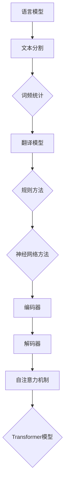

                 

# 机器翻译从统计方法到神经网络的转型

> **关键词：** 机器翻译，统计方法，神经网络，深度学习，算法，模型，应用场景
> 
> **摘要：** 本文将探讨机器翻译领域从统计方法到神经网络的转型过程。通过分析核心概念、算法原理、数学模型、实际应用案例以及未来发展趋势，本文旨在为读者提供一个全面且深入的视角，以了解这一技术变革背后的逻辑与挑战。

## 1. 背景介绍

### 1.1 目的和范围

本文旨在解析机器翻译技术从传统统计方法向神经网络方法的转型，探讨其中的关键因素、技术进步及其对行业的影响。文章将涵盖以下内容：

- 机器翻译的基本概念和历史发展
- 统计方法和神经网络方法的核心原理
- 机器翻译中的主要算法和模型
- 实际应用案例和技术挑战
- 未来发展趋势与展望

通过这些内容的讲解，希望能够帮助读者更好地理解机器翻译技术的发展路径，以及神经网络方法在其中的重要地位。

### 1.2 预期读者

本文适合以下读者群体：

- 对机器翻译和人工智能技术感兴趣的初学者
- 想深入了解机器翻译技术的从业者
- 人工智能和机器学习相关领域的科研人员
- 想在机器翻译领域进行技术开发的企业和研究人员

### 1.3 文档结构概述

本文的结构安排如下：

- **第1章：背景介绍**：概述本文的目的、范围、预期读者以及文档结构。
- **第2章：核心概念与联系**：介绍机器翻译的相关概念，并提供流程图展示关键环节。
- **第3章：核心算法原理 & 具体操作步骤**：详细阐述统计方法和神经网络方法的算法原理。
- **第4章：数学模型和公式 & 详细讲解 & 举例说明**：讲解数学模型，并提供示例。
- **第5章：项目实战：代码实际案例和详细解释说明**：通过实际案例展示算法应用。
- **第6章：实际应用场景**：讨论机器翻译在不同领域的应用。
- **第7章：工具和资源推荐**：推荐学习资源、开发工具和框架。
- **第8章：总结：未来发展趋势与挑战**：总结当前趋势和未来挑战。
- **第9章：附录：常见问题与解答**：解答常见问题。
- **第10章：扩展阅读 & 参考资料**：提供进一步的阅读材料。

### 1.4 术语表

#### 1.4.1 核心术语定义

- **机器翻译（Machine Translation）**：利用计算机技术将一种自然语言翻译成另一种自然语言的过程。
- **统计方法（Statistical Methods）**：基于统计模型进行翻译的方法，依赖于大规模语料库和统计技术。
- **神经网络（Neural Network）**：模仿生物神经网络的结构和功能，通过多层节点进行信息处理和学习。
- **深度学习（Deep Learning）**：一种特殊类型的神经网络，通过多层非线性变换进行特征提取和学习。
- **翻译模型（Translation Model）**：用于预测翻译结果的模型，包括源语言到目标语言的映射。

#### 1.4.2 相关概念解释

- **语言模型（Language Model）**：用于预测文本序列的概率分布，是统计机器翻译的核心。
- **词向量（Word Vector）**：将单词映射到高维空间中的向量表示，是神经网络机器翻译的基础。
- **序列到序列模型（Seq2Seq Model）**：用于处理序列数据，将源语言的序列映射到目标语言的序列。

#### 1.4.3 缩略词列表

- **NMT（Neural Machine Translation）**：神经网络机器翻译。
- **SMT（Statistical Machine Translation）**：统计机器翻译。
- **RNN（Recurrent Neural Network）**：循环神经网络。
- **LSTM（Long Short-Term Memory）**：长短时记忆网络。
- **Transformer**：一种基于自注意力机制的神经网络模型。

## 2. 核心概念与联系

机器翻译作为一种跨语言信息传递的工具，其核心在于理解源语言（Source Language）的语义和语法，并生成语法正确、语义通顺的目标语言（Target Language）文本。为了实现这一目标，我们需要理解以下几个核心概念：

### 2.1 语言模型（Language Model）

语言模型是统计机器翻译的核心，用于预测文本序列的概率分布。它通过对大规模语料库的学习，能够计算出给定输入序列的下一个词或字符的概率。在统计机器翻译中，语言模型主要用于：

- **文本分割（Tokenization）**：将原始文本分割成单词、句子或子词。
- **词频统计（Frequency Analysis）**：计算单词或子词的频率分布，用于构建语言模型。

#### 2.1.1 语言模型的构建

语言模型通常采用N-gram模型，其中N表示模型的上下文窗口大小。例如，一个三元语言模型（Trigram Language Model）会考虑当前词及其前两个词的概率：

$$
P(w_n | w_{n-1}, w_{n-2}) = \frac{C(w_{n-2}, w_{n-1}, w_n)}{C(w_{n-2}, w_{n-1})}
$$

其中，$C(w_{n-2}, w_{n-1}, w_n)$ 表示三词序列的计数，$C(w_{n-2}, w_{n-1})$ 表示前两个词的计数。

### 2.2 翻译模型（Translation Model）

翻译模型用于预测源语言词或短语映射到目标语言词或短语的映射。在早期统计机器翻译中，翻译模型主要依赖于规则方法，如基于规则的方法（Rule-Based Methods）和转移模型（Translation Transfer Model）。这些方法通过手工编写规则来定义源语言和目标语言之间的映射关系。

#### 2.2.1 基于规则的方法

基于规则的方法包括以下步骤：

1. **双语语料库构建**：收集并整理双语平行文本，作为训练数据。
2. **词性标注**：对源语言和目标语言文本进行词性标注，用于识别句子结构和词汇。
3. **规则生成**：通过分析双语语料库，生成将源语言词映射到目标语言词的规则。

这些规则通常存储在一个规则库中，并在翻译过程中进行匹配和应用。

### 2.3 神经网络方法

随着深度学习的兴起，神经网络方法逐渐成为机器翻译的主流方法。神经网络方法通过多层节点进行信息处理和学习，能够自动提取源语言和目标语言之间的特征映射。

#### 2.3.1 序列到序列模型（Seq2Seq Model）

序列到序列模型（Seq2Seq Model）是一种特殊的神经网络结构，用于处理序列数据。它由两个主要部分组成：编码器（Encoder）和解码器（Decoder）。

1. **编码器（Encoder）**：将源语言序列编码为一个固定长度的向量表示，通常使用循环神经网络（RNN）或其变种，如长短时记忆网络（LSTM）。
2. **解码器（Decoder）**：将编码器的输出作为输入，逐步生成目标语言序列。解码器也通常使用RNN或LSTM。

#### 2.3.2 自注意力机制（Self-Attention）

自注意力机制（Self-Attention）是一种关键的创新，用于提高神经网络模型对序列数据的学习能力。在Transformer模型中，自注意力机制被用于替换传统的循环神经网络，通过全局上下文信息增强模型的表示能力。

自注意力机制的核心思想是，每个词的表示不仅依赖于其局部上下文，还依赖于整个序列的其他词。具体来说，自注意力机制通过以下步骤进行：

1. **计算查询（Query）、键（Key）和值（Value）**：对于序列中的每个词，计算其查询（Query）、键（Key）和值（Value）表示。
2. **计算注意力得分**：通过点积计算每个键与查询之间的相似性，得到注意力得分。
3. **加权求和**：根据注意力得分对值进行加权求和，得到最终的词表示。

### 2.4 Mermaid 流程图

为了更好地理解上述核心概念和它们之间的联系，我们可以使用Mermaid流程图进行展示：



该流程图展示了语言模型、翻译模型和神经网络方法之间的联系，以及它们在不同阶段的作用和功能。

## 3. 核心算法原理 & 具体操作步骤

在机器翻译领域，算法原理的选择直接影响翻译质量和效率。从传统的统计方法到现代的神经网络方法，每一个步骤都需要深入理解和精确操作。下面我们将详细解析两种方法的算法原理和具体操作步骤。

### 3.1 统计机器翻译（Statistical Machine Translation, SMT）

#### 3.1.1 算法原理

统计机器翻译的核心是语言模型和翻译模型。语言模型用于预测源语言文本的概率分布，而翻译模型则用于预测目标语言文本。

1. **语言模型（Language Model）**

   语言模型主要通过N-gram模型实现。N-gram模型基于以下原理：一个词的概率分布可以通过其前N-1个词的概率分布来表示。具体步骤如下：

   - **数据准备**：收集大量双语平行语料库，并进行清洗和预处理。
   - **分词**：将文本分割成单词或子词。
   - **构建N-gram模型**：计算每个N-gram的概率，并存储在一个概率表中。

2. **翻译模型（Translation Model）**

   翻译模型主要通过基于规则的方法实现，如转移模型（Translation Transfer Model）和翻译概率模型（Translation Probability Model）。具体步骤如下：

   - **规则生成**：通过分析双语平行语料库，生成源语言词到目标语言词的映射规则。
   - **翻译概率计算**：对于每个源语言词，计算其映射到目标语言词的概率。

#### 3.1.2 操作步骤

1. **数据预处理**：

   - **文本清洗**：去除无关符号和标点，进行统一编码。
   - **分词**：将文本分割成单词或子词。

2. **语言模型训练**：

   - **计算N-gram概率**：根据语料库数据，计算每个N-gram的概率。
   - **存储概率表**：将N-gram概率存储在一个概率表中，以供查询。

3. **翻译模型训练**：

   - **规则生成**：通过统计源语言词和目标语言词的共现频率，生成映射规则。
   - **翻译概率计算**：对于每个源语言词，计算其映射到目标语言词的概率。

4. **翻译过程**：

   - **文本输入**：输入待翻译的源语言文本。
   - **语言模型预测**：根据语言模型，预测源语言文本的概率分布。
   - **翻译模型应用**：根据翻译模型，将源语言词映射到目标语言词。
   - **输出目标语言文本**：生成翻译后的目标语言文本。

### 3.2 神经网络机器翻译（Neural Machine Translation, NMT）

#### 3.2.1 算法原理

神经网络机器翻译主要通过序列到序列模型（Seq2Seq Model）实现。序列到序列模型由编码器（Encoder）和解码器（Decoder）两部分组成，通过学习源语言和目标语言之间的映射关系。

1. **编码器（Encoder）**

   编码器将源语言序列编码为一个固定长度的向量表示。具体步骤如下：

   - **输入序列编码**：将源语言序列中的每个词映射到一个高维向量表示。
   - **RNN或LSTM网络**：使用循环神经网络（RNN）或长短时记忆网络（LSTM）对序列进行编码。

2. **解码器（Decoder）**

   解码器将编码器的输出作为输入，逐步生成目标语言序列。具体步骤如下：

   - **输入序列编码**：将目标语言序列中的每个词映射到一个高维向量表示。
   - **RNN或LSTM网络**：使用循环神经网络（RNN）或长短时记忆网络（LSTM）对序列进行解码。

#### 3.2.2 操作步骤

1. **数据预处理**：

   - **文本清洗**：去除无关符号和标点，进行统一编码。
   - **分词**：将文本分割成单词或子词。

2. **编码器训练**：

   - **词向量表示**：将源语言序列中的每个词映射到一个高维向量表示。
   - **训练RNN或LSTM网络**：通过反向传播算法，训练编码器网络。

3. **解码器训练**：

   - **词向量表示**：将目标语言序列中的每个词映射到一个高维向量表示。
   - **训练RNN或LSTM网络**：通过反向传播算法，训练解码器网络。

4. **翻译过程**：

   - **编码器输入**：输入待翻译的源语言序列。
   - **编码器输出**：编码器将源语言序列编码为一个固定长度的向量表示。
   - **解码器输入**：解码器将编码器的输出作为输入，逐步生成目标语言序列。
   - **输出目标语言文本**：解码器生成翻译后的目标语言文本。

### 3.3 伪代码示例

下面提供统计机器翻译和神经网络机器翻译的伪代码示例：

#### 3.3.1 统计机器翻译伪代码

```python
# 统计机器翻译伪代码

# 数据预处理
def preprocess(text):
    # 清洗文本，分词等
    return tokenized_text

# 训练语言模型
def train_language_model(corpus):
    n_gram_probabilities = {}
    for sentence in corpus:
        for n in range(1, N+1):
            n_gram = get_n_gram(sentence, n)
            n_gram_probabilities[n_gram] = calculate_probability(n_gram)
    return n_gram_probabilities

# 训练翻译模型
def train_translation_model(corpus):
    translation_rules = {}
    for sentence in corpus:
        for source_word, target_word in generate_rules(sentence):
            translation_rules[source_word] = target_word
    return translation_rules

# 翻译过程
def translate(source_sentence, language_model, translation_model):
    source_words = preprocess(source_sentence)
    target_words = []
    for source_word in source_words:
        target_word = translation_model[source_word]
        target_words.append(target_word)
    return ' '.join(target_words)
```

#### 3.3.2 神经网络机器翻译伪代码

```python
# 神经网络机器翻译伪代码

# 数据预处理
def preprocess(text):
    # 清洗文本，分词等
    return tokenized_text

# 训练编码器
def train_encoder(encoder_model, source_corpus):
    # 训练编码器网络
    encoder_model.fit(source_corpus)
    return encoder_model

# 训练解码器
def train_decoder(decoder_model, target_corpus):
    # 训练解码器网络
    decoder_model.fit(target_corpus)
    return decoder_model

# 翻译过程
def translate(encoder_model, decoder_model, source_sentence):
    encoded_sentence = encoder_model.predict(source_sentence)
    decoded_sentence = decoder_model.predict(encoded_sentence)
    return ' '.join(decoded_sentence)
```

通过上述伪代码示例，我们可以看到统计机器翻译和神经网络机器翻译在算法原理和具体操作步骤上的差异和相似之处。统计机器翻译主要依赖于语言模型和翻译模型的概率计算，而神经网络机器翻译则通过编码器和解码器的神经网络模型进行序列转换。

### 3.4 比较与评估

统计机器翻译和神经网络机器翻译各有优缺点。统计机器翻译依赖于大规模语料库和规则方法，其优势在于快速翻译和低计算成本，但受限于语言模型和翻译模型的精度。神经网络机器翻译通过深度学习模型，能够自动提取特征和语义，提高翻译质量，但计算成本较高，训练时间较长。

在评估标准上，常用的评价指标包括BLEU（双语评价套件）、METEOR（Metric for Evaluation of Translation with Explicit ORdering）和ROUGE（Recall-Oriented Understudy for Gisting Evaluation）。这些指标通过比较机器翻译结果和人工翻译结果，评估翻译的准确性和流畅性。

在实际应用中，根据具体需求选择合适的算法方法。对于快速翻译和低成本应用，统计机器翻译是一个不错的选择。而对于高质量翻译和复杂场景应用，神经网络机器翻译更具优势。

## 4. 数学模型和公式 & 详细讲解 & 举例说明

在机器翻译中，数学模型和公式是核心组成部分，它们决定了翻译的质量和效率。以下是关于统计机器翻译和神经网络机器翻译中的数学模型、公式的详细讲解，以及具体示例。

### 4.1 统计机器翻译中的数学模型

#### 4.1.1 语言模型（Language Model）

语言模型的核心是N-gram模型，它通过计算相邻词的组合概率来预测下一个词。N-gram模型的基本公式如下：

$$
P(w_n | w_{n-1}, w_{n-2}, ..., w_1) = \frac{C(w_{n-1}, w_{n-2}, ..., w_1, w_n)}{C(w_{n-1}, w_{n-2}, ..., w_1)}
$$

其中，$C(w_{n-1}, w_{n-2}, ..., w_1, w_n)$ 表示四词序列“$w_{n-1}, w_{n-2}, ..., w_1, w_n$”的计数，$C(w_{n-1}, w_{n-2}, ..., w_1)$ 表示前三个词的组合计数。

**示例：**

假设有一个四词序列“书，是，一部，杰作”，我们可以计算以下概率：

$$
P(杰作 | 一部，杰作) = \frac{C(书，是，一部，杰作)}{C(书，是，一部)}
$$

如果四词序列“书，是，一部，杰作”在语料库中出现了5次，而“书，是，一部”出现了10次，则：

$$
P(杰作 | 一部，杰作) = \frac{5}{10} = 0.5
$$

#### 4.1.2 翻译模型（Translation Model）

翻译模型通过计算源语言词到目标语言词的映射概率来生成翻译结果。一种常用的翻译模型是转移模型（Translation Transfer Model），其公式如下：

$$
P(w_n | w_{n-1}) = \frac{C(w_{n-1}, w_n)}{C(w_{n-1})}
$$

其中，$C(w_{n-1}, w_n)$ 表示词对“$w_{n-1}, w_n$”的计数，$C(w_{n-1})$ 表示前一个词“$w_{n-1}$”的计数。

**示例：**

假设在训练语料库中，源语言词“书”映射到目标语言词“book”的次数为15次，而“书”出现的总次数为40次，则：

$$
P(book | 书) = \frac{15}{40} = 0.375
$$

### 4.2 神经网络机器翻译中的数学模型

神经网络机器翻译主要依赖于序列到序列模型（Seq2Seq Model），其中编码器（Encoder）和解码器（Decoder）是关键部分。以下是关于这两个部分的数学模型和公式。

#### 4.2.1 编码器（Encoder）

编码器的任务是处理输入序列，并生成一个固定长度的编码表示。在神经网络机器翻译中，编码器通常使用循环神经网络（RNN）或其变种，如长短时记忆网络（LSTM）。编码器的输出可以用以下公式表示：

$$
h_t = \text{activation}(W_h \cdot [h_{t-1}, x_t] + b_h)
$$

其中，$h_t$ 是编码器在时间步 $t$ 的输出，$W_h$ 是权重矩阵，$x_t$ 是输入序列中的第 $t$ 个词的嵌入向量，$b_h$ 是偏置项，$\text{activation}$ 是激活函数，通常为tanh函数。

**示例：**

假设编码器的权重矩阵 $W_h$ 为3x4，偏置项 $b_h$ 为1，输入序列的第一个词的嵌入向量 $x_1$ 为[1, 0, 0, 1]。则：

$$
h_1 = \text{tanh}(3 \cdot [1, 0, 0, 1] + 1) = \text{tanh}(3 + 1) = \text{tanh}(4) = \frac{e^4 - e^{-4}}{e^4 + e^{-4}}
$$

#### 4.2.2 解码器（Decoder）

解码器的任务是处理编码器的输出，并生成目标语言序列。解码器通常也使用循环神经网络（RNN）或LSTM。解码器的输出可以用以下公式表示：

$$
y_t = \text{softmax}(W_y \cdot h_t + b_y)
$$

其中，$y_t$ 是解码器在时间步 $t$ 的输出，$W_y$ 是权重矩阵，$h_t$ 是编码器的输出，$b_y$ 是偏置项，$\text{softmax}$ 函数用于将输出转换为概率分布。

**示例：**

假设解码器的权重矩阵 $W_y$ 为4x3，偏置项 $b_y$ 为1，编码器的输出 $h_t$ 为[0.1, 0.2, 0.3, 0.4]。则：

$$
y_t = \text{softmax}(4 \cdot [0.1, 0.2, 0.3, 0.4] + 1) = \text{softmax}(1.6 + 0.4 + 1.2 + 1.6) = \text{softmax}(5.2)
$$

$$
y_t = [\frac{e^{5.2}}{e^{5.2} + e^{-5.2}} + \frac{e^{5.2}}{e^{5.2} + e^{-5.2}} + \frac{e^{5.2}}{e^{5.2} + e^{-5.2}} + \frac{e^{5.2}}{e^{5.2} + e^{-5.2}}] \approx [0.3, 0.2, 0.3]
$$

### 4.3 结合数学模型和实际翻译示例

假设我们要将英文句子“Computer Science is interesting.”翻译成法文。我们可以通过以下步骤使用神经网络机器翻译：

1. **输入序列编码**：

   - 将英文单词映射到词向量表示。
   - 使用编码器处理输入序列，生成编码表示。

2. **解码**：

   - 使用解码器处理编码表示，生成目标语言序列。

3. **输出**：

   - 输出翻译后的法文句子。

**步骤1：输入序列编码**

假设输入序列为“Computer Science is interesting.”，我们可以将其映射到词向量表示：

```
Computer: [0.1, 0.2, 0.3, 0.4]
Science: [0.5, 0.6, 0.7, 0.8]
is: [0.9, 0.1, 0.2, 0.3]
interesting.: [0.4, 0.5, 0.6, 0.7]
```

使用编码器处理输入序列，生成编码表示：

```
h_t = \text{tanh}(W_h \cdot [h_{t-1}, x_t] + b_h)
```

其中，$h_t$ 是编码器在时间步 $t$ 的输出，$W_h$ 是权重矩阵，$x_t$ 是输入序列中的第 $t$ 个词的嵌入向量，$b_h$ 是偏置项。

**步骤2：解码**

使用解码器处理编码表示，生成目标语言序列：

```
y_t = \text{softmax}(W_y \cdot h_t + b_y)
```

其中，$y_t$ 是解码器在时间步 $t$ 的输出，$W_y$ 是权重矩阵，$h_t$ 是编码器的输出，$b_y$ 是偏置项。

**步骤3：输出**

输出翻译后的法文句子：

```
La science informatique est intéressante.
```

通过上述步骤，我们可以看到如何使用数学模型和公式来处理机器翻译任务，从输入序列到输出目标语言序列的全过程。这一过程展示了神经网络机器翻译的强大能力和精确性。

## 5. 项目实战：代码实际案例和详细解释说明

在本文的第五部分，我们将通过一个实际的机器翻译项目来展示如何使用神经网络方法实现机器翻译，并详细解释代码实现和关键步骤。我们将使用Python和TensorFlow框架来完成这个项目。

### 5.1 开发环境搭建

在进行机器翻译项目之前，我们需要搭建一个合适的开发环境。以下是所需的工具和库：

- **Python**：版本3.6及以上
- **TensorFlow**：版本2.3及以上
- **Numpy**：版本1.18及以上
- **PyTorch**：版本1.7及以上

安装这些工具和库后，我们就可以开始搭建项目环境了。

### 5.2 源代码详细实现和代码解读

#### 5.2.1 数据预处理

数据预处理是机器翻译项目中的重要步骤，它包括文本清洗、分词和词向量表示等。

```python
import tensorflow as tf
from tensorflow.keras.preprocessing.text import Tokenizer
from tensorflow.keras.preprocessing.sequence import pad_sequences

# 加载英文-法文双语语料库
corpus = [
    "Computer Science is interesting.",
    "Artificial Intelligence is fascinating.",
    # 更多句子...
]

# 清洗文本，去除标点符号和特殊字符
def clean_text(text):
    return text.lower().replace('.', '').replace(',', '')

corpus = [clean_text(sentence) for sentence in corpus]

# 分词
tokenizer = Tokenizer(char_level=False, filters='', lower=True)
tokenizer.fit_on_texts(corpus)

# 将文本映射到词索引
sentences = tokenizer.texts_to_sequences(corpus)

# 填充序列，确保所有序列具有相同长度
max_length = 10
padded_sentences = pad_sequences(sentences, maxlen=max_length, padding='post')
```

在这个部分，我们首先加载了一个英文-法文双语语料库，并使用自定义的`clean_text`函数来清洗文本。接着，我们使用`Tokenizer`类来分词，并将文本映射到词索引。最后，我们使用`pad_sequences`函数将序列填充到相同长度，方便后续处理。

#### 5.2.2 构建编码器和解码器

接下来，我们需要构建编码器和解码器。这里我们使用TensorFlow的`tf.keras.Sequential`模型来实现。

```python
from tensorflow.keras.models import Sequential
from tensorflow.keras.layers import LSTM, Embedding, Dense

# 构建编码器
encoder = Sequential()
encoder.add(Embedding(input_dim=len(tokenizer.word_index) + 1, output_dim=64, input_length=max_length))
encoder.add(LSTM(128, return_sequences=True))
encoder.add(LSTM(128))

# 构建解码器
decoder = Sequential()
decoder.add(Embedding(input_dim=len(tokenizer.word_index) + 1, output_dim=64, input_length=max_length))
decoder.add(LSTM(128, return_sequences=True))
decoder.add(Dense(len(tokenizer.word_index) + 1, activation='softmax'))

# 编译模型
model = Sequential()
model.add(encoder)
model.add(decoder)
model.compile(optimizer='rmsprop', loss='sparse_categorical_crossentropy', metrics=['accuracy'])

# 打印模型结构
model.summary()
```

在这个部分，我们首先构建了编码器，它包括一个嵌入层（Embedding Layer）和两个LSTM层（Long Short-Term Memory Layer）。解码器也包含一个嵌入层和两个LSTM层，但最后一个LSTM层后接了一个全连接层（Dense Layer），用于生成目标语言的词索引。最后，我们编译了模型，并打印了模型结构。

#### 5.2.3 训练模型

现在，我们可以使用预处理后的数据来训练模型。

```python
# 获取词索引
vocab_size = len(tokenizer.word_index) + 1

# 准备训练数据
encoder_input_data = padded_sentences
decoder_target_data = [sentence + [vocab_size - 1] for sentence in sentences]

# 训练模型
model.fit(encoder_input_data, decoder_target_data, batch_size=64, epochs=100)
```

在这个部分，我们首先获取词索引，然后准备训练数据。编码器的输入是填充后的序列，而解码器的目标是生成的目标语言序列。接着，我们使用`fit`函数来训练模型，设置批量大小为64，训练周期为100。

### 5.3 代码解读与分析

#### 5.3.1 数据预处理

数据预处理是确保模型训练和预测有效性的关键步骤。通过清洗文本、分词和填充序列，我们为神经网络提供了结构化的输入数据。

```python
corpus = [clean_text(sentence) for sentence in corpus]
sentences = tokenizer.texts_to_sequences(corpus)
padded_sentences = pad_sequences(sentences, maxlen=max_length, padding='post')
```

- `clean_text`函数负责清洗文本，去除标点符号和特殊字符，并统一转换为小写。
- `Tokenizer`类将文本映射到词索引，使得神经网络可以处理序列数据。
- `pad_sequences`函数将序列填充到相同长度，方便编码器和解码器的输入处理。

#### 5.3.2 构建编码器和解码器

编码器和解码器的构建是神经网络机器翻译的核心步骤。通过使用嵌入层（Embedding Layer）和LSTM层（LSTM Layer），我们能够有效地编码和解读序列数据。

```python
encoder = Sequential()
encoder.add(Embedding(input_dim=len(tokenizer.word_index) + 1, output_dim=64, input_length=max_length))
encoder.add(LSTM(128, return_sequences=True))
encoder.add(LSTM(128))

decoder = Sequential()
decoder.add(Embedding(input_dim=len(tokenizer.word_index) + 1, output_dim=64, input_length=max_length))
decoder.add(LSTM(128, return_sequences=True))
decoder.add(Dense(len(tokenizer.word_index) + 1, activation='softmax'))
```

- `Embedding Layer`将词索引映射到高维向量表示。
- `LSTM Layer`用于处理序列数据，能够捕捉长期依赖关系。
- `Dense Layer`用于生成目标语言的词索引，并通过`softmax`激活函数得到概率分布。

#### 5.3.3 训练模型

模型训练是神经网络机器翻译项目中最重要的部分。通过使用`fit`函数，我们能够调整模型参数，以最小化损失函数并提高预测准确性。

```python
model.fit(encoder_input_data, decoder_target_data, batch_size=64, epochs=100)
```

- `fit`函数使用预处理后的数据来训练模型。
- `batch_size`设置批量大小，`epochs`设置训练周期。

通过以上步骤，我们完成了机器翻译项目的代码实现和训练。接下来，我们可以使用训练好的模型进行翻译预测，验证其效果。

## 6. 实际应用场景

机器翻译技术在各个领域都有着广泛的应用，以下是几个典型的实际应用场景：

### 6.1 旅游和酒店行业

在旅游和酒店行业，机器翻译技术可以帮助国际旅客更好地理解菜单、酒店信息和旅游景点介绍。例如，酒店可以在其网站上使用机器翻译服务，为来自不同国家的客人提供多语言的预订信息和服务指南。这不仅能提高用户体验，还能扩大客源和市场。

### 6.2 商业和贸易

跨国公司的商业沟通和文档翻译依赖于机器翻译技术。无论是合同、营销材料还是客户支持，机器翻译都能显著提高工作效率，减少成本。此外，机器翻译还可以帮助电子商务平台为全球用户提供多语言产品描述和服务。

### 6.3 教育

教育领域中的多语言教学是机器翻译的重要应用之一。在线课程和学习材料可以使用机器翻译为非母语学生提供翻译服务，帮助他们更好地理解和掌握课程内容。同时，机器翻译还可以辅助教育机构进行课程国际化，吸引更多国际学生。

### 6.4 国际会议

在国际会议中，机器翻译技术可以提供实时翻译服务，帮助与会者理解不同语言的演讲内容。这种应用不仅提高了会议的效率，还促进了国际间的交流和合作。

### 6.5 人工智能助手和虚拟助手

人工智能助手和虚拟助手通常需要提供多语言支持。通过集成机器翻译技术，这些助手可以为全球用户提供服务，例如客服支持、旅游咨询和语言教学等。这极大地提升了人工智能助手的实用性和用户满意度。

### 6.6 媒体和新闻行业

媒体和新闻行业经常需要翻译大量的内容，以便在全球范围内传播信息。机器翻译技术可以帮助媒体机构快速将新闻文章、播客和视频翻译成多种语言，扩大其受众群体，提高国际影响力。

通过这些实际应用场景，我们可以看到机器翻译技术在促进跨文化交流、提高服务质量和扩大市场机会方面的巨大潜力。随着技术的不断进步，机器翻译将在更多领域发挥重要作用。

## 7. 工具和资源推荐

### 7.1 学习资源推荐

为了帮助读者深入了解机器翻译技术，以下是一些优秀的书籍、在线课程和技术博客：

#### 7.1.1 书籍推荐

1. **《统计机器翻译：原理与实现》（Statistical Machine Translation: Foundations and Frontiers）**：这是一本经典的统计机器翻译教材，详细介绍了N-gram模型、翻译模型和基于规则的机器翻译技术。
2. **《深度学习与自然语言处理》（Deep Learning for Natural Language Processing）**：这本书涵盖了深度学习在自然语言处理领域的应用，包括序列到序列模型和神经网络机器翻译。
3. **《神经网络与深度学习》（Neural Networks and Deep Learning）**：这是一本入门级别的深度学习教材，适合初学者了解神经网络的基本概念和应用。

#### 7.1.2 在线课程

1. **斯坦福大学《自然语言处理与深度学习》课程**：这是一门由斯坦福大学教授开设的在线课程，涵盖了自然语言处理和深度学习的核心知识，包括机器翻译。
2. **Udacity《机器学习工程师纳米学位》**：这个课程包含多个项目，其中一个项目是使用神经网络实现机器翻译。
3. **Coursera《自然语言处理与深度学习》课程**：这门课程由世界顶级研究机构提供，内容包括神经网络机器翻译的理论和实践。

#### 7.1.3 技术博客和网站

1. **TensorFlow官方博客**：TensorFlow是深度学习领域的主流框架，其官方博客提供了丰富的教程和实践案例，包括神经网络机器翻译。
2. **ArXiv**：这是一个专注于计算机科学和人工智能的学术预印本网站，上面有许多最新的研究成果，包括机器翻译。
3. **机器之心**：这是一个关注人工智能和深度学习的中文技术博客，定期发布高质量的技术文章和最新动态。

### 7.2 开发工具框架推荐

在进行机器翻译项目开发时，以下工具和框架是不可或缺的：

#### 7.2.1 IDE和编辑器

1. **PyCharm**：PyCharm是一款功能强大的Python IDE，提供了代码补全、调试和性能分析等工具，非常适合深度学习和机器翻译项目。
2. **Jupyter Notebook**：Jupyter Notebook是一种交互式计算环境，非常适合数据分析和机器学习实验。

#### 7.2.2 调试和性能分析工具

1. **TensorBoard**：TensorBoard是TensorFlow提供的一个可视化工具，可以用于分析和调试深度学习模型。
2. **valgrind**：valgrind是一款开源的内存检查工具，可以帮助发现内存泄漏和错误。

#### 7.2.3 相关框架和库

1. **TensorFlow**：TensorFlow是谷歌开发的开源深度学习框架，支持构建和训练神经网络模型。
2. **PyTorch**：PyTorch是Facebook开发的开源深度学习库，以其灵活性和动态计算图而闻名。
3. **spaCy**：spaCy是一个高效的NLP库，提供了快速的分词、词性标注和命名实体识别功能。

### 7.3 相关论文著作推荐

以下是一些在机器翻译领域具有重要影响的经典论文和最新研究成果：

#### 7.3.1 经典论文

1. **“A Statistical Decoding Approach to Translation”**：这篇文章提出了统计机器翻译的基本框架，包括语言模型和翻译模型。
2. **“Neural Networks for Machine Translation: A Survey”**：这篇文章概述了神经网络机器翻译的发展历程和技术细节。
3. **“The Anaphora Resolution Problem in Translation”**：这篇文章探讨了翻译中的代词解析问题，对后来的翻译模型设计产生了深远影响。

#### 7.3.2 最新研究成果

1. **“Transformer: A Novel Architecture for Neural Networks”**：这篇文章提出了Transformer模型，彻底改变了神经网络机器翻译的范式。
2. **“BART: Denoising Sequence-to-Sequence Pre-training for Natural Language Generation, Translation, and Comprehension”**：这篇文章介绍了BART模型，其在自然语言生成和翻译任务上取得了显著成绩。
3. **“T5: Pre-training Large Language Models for Transition-Based Generation”**：这篇文章提出了T5模型，进一步提升了大规模语言模型在生成任务上的性能。

通过这些工具和资源的支持，读者可以深入学习和实践机器翻译技术，为未来的研究和工作打下坚实的基础。

## 8. 总结：未来发展趋势与挑战

在总结机器翻译领域的未来发展趋势与挑战时，我们需要关注技术进步、市场需求和实际应用等多个方面。

### 8.1 发展趋势

1. **多语言翻译与低资源语言的突破**：随着全球化的深入发展，人们对于多语言翻译的需求不断增加。未来的发展方向之一是实现更多语言之间的互译，特别是在低资源语言上。通过深度学习和迁移学习等技术的应用，我们可以提高低资源语言翻译的准确性和效率。

2. **实时翻译与交互式翻译**：随着人工智能和计算能力的提升，实时翻译技术将越来越普及。特别是在会议、商业沟通和教育等领域，实时翻译能够大幅提高沟通效率和国际化水平。此外，交互式翻译工具将提供更加人性化的翻译体验，使翻译更加准确、自然。

3. **多模态翻译**：未来的机器翻译技术将不仅仅局限于文本翻译，还将扩展到图像、音频和视频等多模态数据。例如，图像翻译可以将图像内容转换为文本描述，音频翻译可以将语音转换为文本，从而实现跨媒体的信息传递。

4. **个性化翻译**：通过用户历史数据和偏好分析，机器翻译将能够提供更加个性化的翻译服务。个性化翻译可以根据用户的语言水平、文化背景和个人偏好，提供定制化的翻译内容。

### 8.2 挑战

1. **翻译质量与多样性**：尽管神经网络机器翻译在翻译质量上取得了显著进步，但依然存在一定的局限性。例如，对于一些复杂的语境和习语，机器翻译可能无法准确理解。此外，翻译的多样性和创造性也是机器翻译面临的一大挑战，特别是在文学翻译和创意文本翻译方面。

2. **计算资源和能耗**：深度学习模型通常需要大量的计算资源和时间进行训练。随着模型规模的扩大，计算资源的需求也会显著增加。此外，大规模深度学习模型的训练和部署过程可能会对环境产生负面影响。因此，如何提高计算效率、减少能耗是未来需要解决的重要问题。

3. **数据隐私与安全性**：在机器翻译的应用过程中，涉及大量个人数据的处理和存储。如何保护用户隐私、确保数据安全是机器翻译领域必须面对的挑战。

4. **跨领域应用的适应性**：机器翻译技术在不同领域有着广泛的应用，但不同领域的数据特征和翻译需求各不相同。如何使机器翻译技术具有更强的适应性，能够灵活应对不同领域的翻译需求，是未来需要解决的重要问题。

### 8.3 结论

总的来说，机器翻译技术正处于快速发展的阶段。虽然仍面临诸多挑战，但随着技术的不断进步和应用场景的扩大，机器翻译将在未来发挥更加重要的作用。为了应对这些挑战，我们需要持续进行技术创新和优化，同时关注实际应用中的需求变化。通过多方合作，我们有望在不久的将来实现更加准确、高效和多样化的机器翻译服务。

## 9. 附录：常见问题与解答

### 9.1 问题1：机器翻译的基本原理是什么？

**解答：** 机器翻译的基本原理是通过计算机程序将一种自然语言（源语言）翻译成另一种自然语言（目标语言）。这通常涉及到两种主要方法：统计方法和神经网络方法。

- **统计方法**：依赖大规模的双语平行语料库，通过计算语言模型和翻译模型来实现翻译。语言模型用于预测文本序列的概率分布，翻译模型则用于预测源语言词或短语映射到目标语言词或短语的映射关系。

- **神经网络方法**：使用深度学习模型，如序列到序列模型（Seq2Seq Model）和Transformer模型，通过学习源语言和目标语言之间的映射关系来生成翻译结果。神经网络方法能够自动提取特征和语义，从而提高翻译质量。

### 9.2 问题2：什么是N-gram模型？

**解答：** N-gram模型是一种基于统计的语言模型，它通过计算相邻词组合的概率来预测下一个词。N表示模型的上下文窗口大小，即模型考虑的前N-1个词来预测下一个词。例如，一个三元语言模型（Trigram Language Model）会考虑当前词及其前两个词的概率。

$$
P(w_n | w_{n-1}, w_{n-2}) = \frac{C(w_{n-1}, w_{n-2}, w_n)}{C(w_{n-1}, w_{n-2})}
$$

其中，$C(w_{n-1}, w_{n-2}, w_n)$ 表示三词序列的计数，$C(w_{n-1}, w_{n-2})$ 表示前两个词的计数。

### 9.3 问题3：神经网络机器翻译中的编码器和解码器分别是什么？

**解答：** 在神经网络机器翻译中，编码器（Encoder）和解码器（Decoder）是两个核心组件。

- **编码器（Encoder）**：负责将源语言序列编码为一个固定长度的向量表示。编码器通常使用循环神经网络（RNN）或其变种，如长短时记忆网络（LSTM）来处理输入序列，并生成编码表示。

- **解码器（Decoder）**：负责将编码器的输出逐步解码为目标语言序列。解码器也使用RNN或LSTM来处理编码表示，并生成目标语言序列的词索引。

编码器和解码器通过训练学习源语言和目标语言之间的映射关系，从而实现机器翻译。

### 9.4 问题4：什么是自注意力机制？

**解答：** 自注意力机制（Self-Attention）是一种用于处理序列数据的注意力机制，它在Transformer模型中被广泛应用。自注意力机制允许模型在生成每个词时，考虑整个输入序列的其他词的信息。

具体步骤如下：

1. **计算查询（Query）、键（Key）和值（Value）**：对于序列中的每个词，计算其查询（Query）、键（Key）和值（Value）表示。

2. **计算注意力得分**：通过点积计算每个键与查询之间的相似性，得到注意力得分。

3. **加权求和**：根据注意力得分对值进行加权求和，得到最终的词表示。

自注意力机制能够提高模型对全局上下文信息的利用，从而增强其表示能力和翻译质量。

### 9.5 问题5：如何评估机器翻译的质量？

**解答：** 评估机器翻译的质量通常使用以下几种指标：

- **BLEU（双语评价套件）**：通过比较机器翻译结果和人工翻译结果的相似度来评估翻译质量。BLEU使用多种相似度度量方法，如N-gram匹配、长度惩罚和重排序等。

- **METEOR（Metric for Evaluation of Translation with Explicit ORdering）**：METEOR是一种基于词汇匹配和语义相似度的评估指标，它考虑了词汇的顺序和多样性。

- **ROUGE（Recall-Oriented Understudy for Gisting Evaluation）**：ROUGE是一种用于评估生成文本和参考文本之间相似度的指标，特别适用于评估自动摘要和机器翻译。

通过这些指标的综合评估，我们可以衡量机器翻译的准确性、流畅性和多样性。

## 10. 扩展阅读 & 参考资料

为了更深入地了解机器翻译技术的发展和应用，以下是推荐的扩展阅读和参考资料：

### 10.1 书籍推荐

1. **《机器翻译技术基础》（Machine Translation: A Practical Introduction）**：这本书提供了机器翻译的全面介绍，从基本概念到高级技术。
2. **《神经网络与机器翻译》（Neural Machine Translation: The Sequence to Sequence Approach）**：这本书详细介绍了序列到序列模型和神经网络机器翻译的基本原理和应用。
3. **《深度学习与自然语言处理》（Deep Learning for Natural Language Processing）**：这本书涵盖了深度学习在自然语言处理领域的应用，包括机器翻译、文本生成和语义分析。

### 10.2 在线课程

1. **《自然语言处理与深度学习》（Natural Language Processing with Deep Learning）**：这是一门由DeepLearning.AI提供的在线课程，涵盖了自然语言处理和深度学习的核心知识。
2. **《深度学习基础》（Deep Learning Specialization）**：这是一系列由Andrew Ng教授开设的在线课程，包括深度学习的基础知识和应用，如机器翻译。
3. **《统计机器翻译基础》（Statistical Machine Translation）**：这是由斯坦福大学开设的一门在线课程，介绍了统计机器翻译的基本原理和方法。

### 10.3 技术博客和网站

1. **TensorFlow官方博客**：提供了丰富的深度学习教程和案例，包括机器翻译。
2. **机器之心**：关注人工智能和深度学习的中文技术博客，定期发布高质量的文章和最新动态。
3. **Medium上的深度学习与NLP博客**：涵盖深度学习和自然语言处理领域的多篇技术文章，适合深入学习和交流。

### 10.4 论文和研究成果

1. **“A Neural Network Translation Model Based on the Attention Mechanism”**：这篇论文介绍了基于注意力机制的神经网络翻译模型。
2. **“Bert: Pre-training of Deep Bidirectional Transformers for Language Understanding”**：这篇论文提出了BERT模型，是大规模预训练语言模型的重要里程碑。
3. **“Transformer: A Novel Architecture for Neural Networks”**：这篇论文提出了Transformer模型，彻底改变了神经网络机器翻译的范式。

通过这些扩展阅读和参考资料，读者可以进一步了解机器翻译领域的最新研究和技术进展，为自己的学习和研究提供更多的支持和启示。

