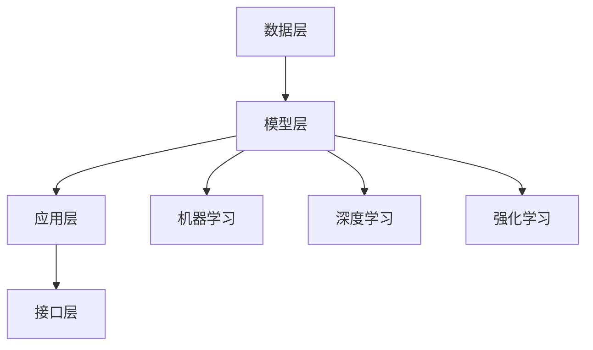

                 

# 李开复：AI 2.0 时代的产业

> 关键词：人工智能、AI 2.0、产业革命、算法、技术趋势、产业应用

> 摘要：本文将探讨AI 2.0时代的产业变革，解析核心概念、算法原理、应用场景，并推荐学习资源和工具，旨在为广大读者提供一个关于AI 2.0时代的产业全景图，帮助读者理解这一革命性技术如何改变我们的生活和产业。

## 1. 背景介绍

### 1.1 目的和范围

本文旨在介绍AI 2.0时代的产业变革，解析这一时代的关键技术、核心算法、以及具体应用场景。文章将从以下几个方面进行展开：

- **核心概念与联系**：介绍AI 2.0的基本概念和与之相关的技术原理。
- **核心算法原理 & 具体操作步骤**：详细阐述AI 2.0的核心算法原理和操作步骤。
- **数学模型和公式 & 详细讲解 & 举例说明**：讲解AI 2.0涉及的数学模型和公式，并通过实例说明。
- **项目实战：代码实际案例和详细解释说明**：通过实际案例，展示AI 2.0的具体应用。
- **实际应用场景**：分析AI 2.0在不同产业领域的应用。
- **工具和资源推荐**：推荐学习资源和工具，帮助读者深入了解AI 2.0。
- **总结：未来发展趋势与挑战**：探讨AI 2.0时代的未来发展趋势和面临的挑战。

### 1.2 预期读者

本文面向对人工智能有一定了解，希望深入了解AI 2.0时代产业变革的读者。无论您是行业从业人员、技术专家，还是对AI技术感兴趣的普通读者，都将从中受益。

### 1.3 文档结构概述

本文分为以下几个部分：

- **第1部分：背景介绍**：介绍本文的目的、预期读者和文档结构。
- **第2部分：核心概念与联系**：介绍AI 2.0的核心概念和技术原理。
- **第3部分：核心算法原理 & 具体操作步骤**：详细阐述AI 2.0的核心算法原理和操作步骤。
- **第4部分：数学模型和公式 & 详细讲解 & 举例说明**：讲解AI 2.0涉及的数学模型和公式。
- **第5部分：项目实战：代码实际案例和详细解释说明**：展示AI 2.0的具体应用。
- **第6部分：实际应用场景**：分析AI 2.0在不同产业领域的应用。
- **第7部分：工具和资源推荐**：推荐学习资源和工具。
- **第8部分：总结：未来发展趋势与挑战**：探讨AI 2.0时代的未来发展趋势和面临的挑战。
- **第9部分：附录：常见问题与解答**：解答读者可能遇到的问题。
- **第10部分：扩展阅读 & 参考资料**：提供更多参考资料。

### 1.4 术语表

#### 1.4.1 核心术语定义

- **人工智能（AI）**：一种模拟人类智能的技术，通过计算机程序实现智能行为。
- **AI 2.0**：第二代人工智能，具有更强的自主学习能力和广泛的应用场景。
- **机器学习（ML）**：一种人工智能技术，通过数据训练模型，实现预测和决策。
- **深度学习（DL）**：一种机器学习技术，通过多层神经网络进行数据建模。

#### 1.4.2 相关概念解释

- **神经网络**：一种模拟人脑结构的计算模型，用于数据处理和模式识别。
- **卷积神经网络（CNN）**：一种用于图像处理和识别的神经网络模型。
- **循环神经网络（RNN）**：一种用于序列数据处理和预测的神经网络模型。
- **强化学习（RL）**：一种通过奖励机制训练智能体的机器学习技术。

#### 1.4.3 缩略词列表

- **AI**：人工智能
- **ML**：机器学习
- **DL**：深度学习
- **CNN**：卷积神经网络
- **RNN**：循环神经网络
- **RL**：强化学习

## 2. 核心概念与联系

### 2.1 AI 2.0：定义与背景

AI 2.0，又称第二代人工智能，是继传统AI（AI 1.0）后的一个更高级别的人工智能阶段。与AI 1.0相比，AI 2.0具有更强的自主学习能力、更广泛的应用场景和更高的智能水平。AI 2.0的核心目标是从数据中自动学习、适应和优化，以实现更高水平的智能和自动化。

### 2.2 核心技术原理

AI 2.0的核心技术包括机器学习（ML）、深度学习（DL）和强化学习（RL）等。以下是这些技术的简要介绍：

#### 2.2.1 机器学习（ML）

机器学习是一种通过数据训练模型，实现预测和决策的人工智能技术。其主要目标是让计算机从数据中学习，自动发现数据中的规律和模式。机器学习可以分为监督学习、无监督学习和强化学习三种类型。

- **监督学习**：通过已有标签数据训练模型，实现对未知数据的预测。
- **无监督学习**：没有标签数据，通过数据本身的特征进行聚类和分析。
- **强化学习**：通过与环境的交互，不断优化决策策略，实现最佳行动。

#### 2.2.2 深度学习（DL）

深度学习是一种基于多层神经网络进行数据建模的人工智能技术。与传统的机器学习方法相比，深度学习具有更强的特征提取和模型表达能力，能够处理更复杂的任务。深度学习可以分为卷积神经网络（CNN）、循环神经网络（RNN）和生成对抗网络（GAN）等。

- **卷积神经网络（CNN）**：用于图像处理和识别。
- **循环神经网络（RNN）**：用于序列数据处理和预测。
- **生成对抗网络（GAN）**：用于生成数据、图像和音频等。

#### 2.2.3 强化学习（RL）

强化学习是一种通过与环境的交互，不断优化决策策略的机器学习技术。强化学习的主要目标是找到一种最优策略，使智能体在特定环境中获得最大收益。强化学习在游戏、机器人控制和自动驾驶等领域有广泛应用。

### 2.3 AI 2.0的架构

AI 2.0的架构包括以下几个关键部分：

- **数据层**：负责收集、存储和管理数据，为AI模型提供训练数据。
- **模型层**：包括机器学习、深度学习和强化学习等模型，用于处理和分析数据。
- **应用层**：将AI模型应用于实际场景，实现智能化功能。
- **接口层**：提供API接口，方便开发者集成和使用AI模型。

### 2.4 Mermaid 流程图

以下是AI 2.0架构的Mermaid流程图：



## 3. 核心算法原理 & 具体操作步骤

### 3.1 机器学习算法原理

机器学习算法主要分为监督学习、无监督学习和强化学习三种类型。以下是这三种类型的基本原理和操作步骤。

#### 3.1.1 监督学习

监督学习是一种通过已有标签数据训练模型，实现预测和决策的机器学习技术。其主要原理是利用已有数据的标签信息，通过优化模型参数，使模型在新的未知数据上能够准确预测。

- **具体操作步骤**：
  1. 数据预处理：对数据进行清洗、归一化等处理，使数据适合模型训练。
  2. 选择模型：根据问题类型选择合适的模型，如线性回归、决策树、支持向量机等。
  3. 训练模型：利用已有标签数据，通过优化模型参数，使模型在训练集上表现良好。
  4. 验证模型：使用验证集对模型进行验证，调整模型参数，优化模型性能。
  5. 测试模型：使用测试集对模型进行测试，评估模型在未知数据上的性能。

#### 3.1.2 无监督学习

无监督学习是一种没有标签数据，通过数据本身的特征进行聚类和分析的机器学习技术。其主要原理是利用数据间的相似度，将数据分为不同的类别。

- **具体操作步骤**：
  1. 数据预处理：对数据进行清洗、归一化等处理，使数据适合模型训练。
  2. 选择模型：根据问题类型选择合适的模型，如K均值聚类、主成分分析等。
  3. 模型训练：利用数据间的相似度，将数据分为不同的类别。
  4. 模型评估：通过内部评估指标（如轮廓系数、同质性等）评估模型性能。

#### 3.1.3 强化学习

强化学习是一种通过与环境的交互，不断优化决策策略的机器学习技术。其主要原理是利用奖励机制，使智能体在特定环境中获得最大收益。

- **具体操作步骤**：
  1. 环境设定：定义智能体所处的环境，包括状态、动作和奖励等。
  2. 策略初始化：初始化智能体的策略，用于选择动作。
  3. 策略优化：通过与环境的交互，不断优化智能体的策略。
  4. 策略评估：评估智能体的策略性能，选择最佳策略。

### 3.2 深度学习算法原理

深度学习是一种基于多层神经网络进行数据建模的人工智能技术。其核心思想是通过网络的层层传递，从原始数据中提取出更高层次的特征。

- **具体操作步骤**：
  1. 数据预处理：对数据进行清洗、归一化等处理，使数据适合模型训练。
  2. 网络架构设计：设计神经网络的结构，包括输入层、隐藏层和输出层等。
  3. 模型训练：通过反向传播算法，优化神经网络模型参数。
  4. 模型评估：使用验证集和测试集评估模型性能，调整模型参数。
  5. 模型部署：将训练好的模型部署到实际应用场景，实现智能化功能。

### 3.3 强化学习算法原理

强化学习是一种通过与环境的交互，不断优化决策策略的机器学习技术。其核心思想是通过奖励机制，使智能体在特定环境中获得最大收益。

- **具体操作步骤**：
  1. 环境设定：定义智能体所处的环境，包括状态、动作和奖励等。
  2. 策略初始化：初始化智能体的策略，用于选择动作。
  3. 策略优化：通过与环境的交互，不断优化智能体的策略。
  4. 策略评估：评估智能体的策略性能，选择最佳策略。

### 3.4 伪代码

以下是强化学习算法的伪代码：

```python
# 初始化环境
env = Environment()

# 初始化策略
policy = Policy()

# 初始化奖励函数
reward_function = RewardFunction()

# 迭代优化策略
for episode in range(num_episodes):
    # 初始化状态
    state = env.initialize_state()

    # 迭代执行动作
    while not env.is_done(state):
        # 选择动作
        action = policy.select_action(state)

        # 执行动作
        next_state, reward = env.step(state, action)

        # 更新策略
        policy.update(state, action, reward)

        # 更新状态
        state = next_state

    # 评估策略
    policy.evaluate(episode)
```

## 4. 数学模型和公式 & 详细讲解 & 举例说明

### 4.1 数学模型

AI 2.0涉及多个数学模型，以下是其中几个重要的数学模型和公式。

#### 4.1.1 线性回归模型

线性回归模型是一种常用的预测模型，用于分析自变量和因变量之间的线性关系。其公式如下：

$$
y = \beta_0 + \beta_1x
$$

其中，$y$ 是因变量，$x$ 是自变量，$\beta_0$ 和 $\beta_1$ 是模型参数。

#### 4.1.2 逻辑回归模型

逻辑回归模型是一种用于分类问题的模型，通过线性回归模型预测概率，然后使用阈值进行分类。其公式如下：

$$
\hat{y} = \sigma(\beta_0 + \beta_1x)
$$

其中，$\hat{y}$ 是预测的概率，$\sigma$ 是 sigmoid 函数，$\beta_0$ 和 $\beta_1$ 是模型参数。

#### 4.1.3 卷积神经网络（CNN）

卷积神经网络是一种用于图像处理和识别的神经网络模型，其核心是卷积层。卷积层的公式如下：

$$
h_{ij} = \sum_{k} w_{ik,j} * g_k + b_j
$$

其中，$h_{ij}$ 是输出特征图，$w_{ik,j}$ 是卷积核，$g_k$ 是输入特征图，$b_j$ 是偏置。

#### 4.1.4 循环神经网络（RNN）

循环神经网络是一种用于序列数据处理和预测的神经网络模型，其核心是循环层。循环层的公式如下：

$$
h_t = \sigma(W_h \cdot [h_{t-1}, x_t] + b_h)
$$

其中，$h_t$ 是当前时刻的隐藏状态，$x_t$ 是当前时刻的输入，$W_h$ 是权重矩阵，$b_h$ 是偏置，$\sigma$ 是激活函数。

### 4.2 举例说明

#### 4.2.1 线性回归模型举例

假设我们要预测房价，已知以下数据：

- 自变量：房屋面积（平方米）
- 因变量：房价（万元）

利用线性回归模型，我们可以得到如下预测公式：

$$
\hat{y} = \beta_0 + \beta_1x
$$

其中，$\beta_0$ 和 $\beta_1$ 是模型参数。

通过训练数据和模型优化，我们可以得到模型参数，例如：

$$
\beta_0 = 100, \beta_1 = 10
$$

然后，我们可以使用该模型预测任意房屋面积对应的房价，例如：

$$
\hat{y} = 100 + 10 \times 100 = 1100
$$

预测房价为1100万元。

#### 4.2.2 卷积神经网络（CNN）举例

假设我们要对图像进行分类，已知以下数据：

- 输入：32x32彩色图像
- 输出：10个类别

利用卷积神经网络（CNN）模型，我们可以得到如下预测公式：

$$
h_{ij} = \sum_{k} w_{ik,j} * g_k + b_j
$$

其中，$h_{ij}$ 是输出特征图，$w_{ik,j}$ 是卷积核，$g_k$ 是输入特征图，$b_j$ 是偏置。

通过训练数据和模型优化，我们可以得到多个卷积核和偏置，例如：

$$
w_1 = \begin{bmatrix}
1 & 1 & 1 \\
1 & 1 & 1 \\
1 & 1 & 1 \\
\end{bmatrix}, b_1 = 1
$$

$$
w_2 = \begin{bmatrix}
-1 & -1 & -1 \\
-1 & -1 & -1 \\
-1 & -1 & -1 \\
\end{bmatrix}, b_2 = -1
$$

然后，我们可以使用该模型对任意图像进行分类，例如：

$$
h_{11} = (1 \times 1 + 1 \times 1 + 1 \times 1) + 1 = 3 + 1 = 4
$$

$$
h_{12} = (-1 \times 1 + -1 \times 1 + -1 \times 1) + -1 = -3 + -1 = -4
$$

根据输出特征图，我们可以得到分类结果，例如：

$$
\hat{y} = \begin{bmatrix}
1 & 0 & 0 & 0 & 0 & 0 & 0 & 0 & 0 & 0 \\
0 & 1 & 0 & 0 & 0 & 0 & 0 & 0 & 0 & 0 \\
0 & 0 & 1 & 0 & 0 & 0 & 0 & 0 & 0 & 0 \\
0 & 0 & 0 & 1 & 0 & 0 & 0 & 0 & 0 & 0 \\
0 & 0 & 0 & 0 & 1 & 0 & 0 & 0 & 0 & 0 \\
0 & 0 & 0 & 0 & 0 & 1 & 0 & 0 & 0 & 0 \\
0 & 0 & 0 & 0 & 0 & 0 & 1 & 0 & 0 & 0 \\
0 & 0 & 0 & 0 & 0 & 0 & 0 & 1 & 0 & 0 \\
0 & 0 & 0 & 0 & 0 & 0 & 0 & 0 & 1 & 0 \\
0 & 0 & 0 & 0 & 0 & 0 & 0 & 0 & 0 & 1 \\
\end{bmatrix}
$$

根据输出特征图，我们可以得到分类结果为类别2。

## 5. 项目实战：代码实际案例和详细解释说明

### 5.1 开发环境搭建

在进行项目实战之前，我们需要搭建一个合适的开发环境。以下是搭建开发环境所需的步骤：

1. 安装Python：Python是一种广泛用于人工智能开发的编程语言。请访问Python官方网站（https://www.python.org/）下载并安装Python。
2. 安装Jupyter Notebook：Jupyter Notebook是一种交互式计算环境，用于编写和运行Python代码。请访问Jupyter官方文档（https://jupyter.org/install）下载并安装Jupyter Notebook。
3. 安装相关库：为了简化项目开发，我们需要安装一些常用的Python库，如NumPy、Pandas、Matplotlib等。请使用以下命令安装这些库：

```python
pip install numpy pandas matplotlib
```

### 5.2 源代码详细实现和代码解读

以下是一个简单的AI 2.0项目示例，该示例使用线性回归模型预测房价。我们将使用Python和NumPy库来实现该模型。

```python
import numpy as np
import pandas as pd
import matplotlib.pyplot as plt

# 5.2.1 数据加载与预处理
# 加载训练数据
data = pd.read_csv('house_data.csv')

# 提取特征和标签
X = data[['area']]  # 房屋面积
y = data['price']   # 房价

# 数据归一化
X_normalized = (X - X.min()) / (X.max() - X.min())

# 5.2.2 模型训练
# 初始化模型参数
beta_0 = 0
beta_1 = 0

# 设置学习率
learning_rate = 0.01

# 设置迭代次数
num_iterations = 1000

# 模型训练
for _ in range(num_iterations):
    # 计算预测值
    y_pred = beta_0 + beta_1 * X_normalized

    # 计算损失函数
    loss = np.mean((y_pred - y) ** 2)

    # 计算梯度
    grad_beta_0 = 2 * np.mean(y_pred - y)
    grad_beta_1 = 2 * np.mean((y_pred - y) * X_normalized)

    # 更新模型参数
    beta_0 -= learning_rate * grad_beta_0
    beta_1 -= learning_rate * grad_beta_1

# 5.2.3 模型评估
# 计算训练集的均方误差
train_loss = np.mean((y_pred - y) ** 2)

# 计算测试集的均方误差
test_data = pd.read_csv('test_house_data.csv')
X_test = (test_data[['area']] - X.min()) / (X.max() - X.min())
y_test = test_data['price']
y_test_pred = beta_0 + beta_1 * X_test
test_loss = np.mean((y_test_pred - y_test) ** 2)

# 打印结果
print('训练集均方误差：', train_loss)
print('测试集均方误差：', test_loss)

# 5.2.4 可视化
# 绘制训练集数据
plt.scatter(X, y)
plt.plot(X, y_pred, color='red')
plt.xlabel('房屋面积')
plt.ylabel('房价')
plt.show()
```

### 5.3 代码解读与分析

以下是代码的详细解读：

1. **数据加载与预处理**：首先，我们加载训练数据并提取特征和标签。然后，我们将特征数据进行归一化处理，以便模型训练。
2. **模型训练**：我们初始化模型参数，并设置学习率和迭代次数。然后，我们使用梯度下降算法进行模型训练。在每次迭代中，我们计算预测值、损失函数和梯度，并更新模型参数。
3. **模型评估**：我们计算训练集和测试集的均方误差，以评估模型性能。然后，我们绘制训练集数据的散点图和预测曲线，直观地展示模型效果。

通过这个示例，我们可以看到如何使用Python和线性回归模型进行AI 2.0项目开发。在实际应用中，我们可以扩展这个示例，添加更多特征、改进模型算法和优化模型性能。

## 6. 实际应用场景

### 6.1 人工智能在医疗领域的应用

人工智能在医疗领域有着广泛的应用，包括疾病预测、诊断辅助、个性化治疗和医疗数据分析等。

#### 疾病预测

通过分析大量患者数据，人工智能可以预测某些疾病的发病风险。例如，谷歌健康团队利用深度学习技术，开发了一种能够预测糖尿病患者视网膜病变的模型。这个模型通过对眼科检查图像的分析，能够提前数年预测糖尿病患者的视网膜病变风险，为医生提供重要的诊断依据。

#### 诊断辅助

人工智能可以通过分析医学影像，辅助医生进行疾病诊断。例如，深度学习技术在肺癌筛查中的应用，通过对CT扫描图像的分析，能够检测出早期肺癌病灶，提高诊断准确率。此外，人工智能还可以辅助医生进行病理切片分析，提高病理诊断的准确性和效率。

#### 个性化治疗

人工智能可以根据患者的病情、基因信息和生活习惯，为患者提供个性化的治疗方案。例如，基于机器学习的个性化治疗方案，可以根据患者的肿瘤类型、病情和基因组信息，制定最合适的治疗策略，提高治疗效果。

#### 医疗数据分析

人工智能可以分析大量医疗数据，发现数据中的规律和趋势，为医疗研究和决策提供支持。例如，人工智能可以分析患者数据，发现某些疾病的流行趋势、风险因素和治疗方案，为公共卫生政策和疾病预防提供依据。

### 6.2 人工智能在金融领域的应用

人工智能在金融领域有着广泛的应用，包括风险管理、投资策略、信用评估和客户服务等。

#### 风险管理

人工智能可以通过分析大量历史数据和实时数据，预测金融市场风险，为金融机构提供风险管理建议。例如，人工智能可以分析市场趋势、交易数据和经济指标，预测股票市场的波动，帮助投资者规避风险。

#### 投资策略

人工智能可以根据市场数据和投资目标，制定最优的投资策略。例如，基于机器学习的投资策略，可以通过分析历史交易数据、市场趋势和宏观经济指标，预测股票市场的走势，为投资者提供投资建议。

#### 信用评估

人工智能可以分析借款人的信用数据、行为数据和社会关系数据，评估借款人的信用风险。例如，基于大数据和机器学习的信用评估模型，可以更准确地预测借款人的还款能力，提高金融机构的信用评估效率。

#### 客户服务

人工智能可以通过聊天机器人和虚拟客服，为金融机构提供全天候的客户服务。例如，聊天机器人可以回答客户的问题、提供投资建议和办理业务，提高客户满意度。

### 6.3 人工智能在制造业的应用

人工智能在制造业有着广泛的应用，包括生产优化、质量控制、设备预测维护和供应链管理等。

#### 生产优化

人工智能可以通过分析生产数据，优化生产流程和资源配置。例如，基于机器学习的生产调度系统，可以分析生产计划、设备状态和物料需求，制定最优的生产调度策略，提高生产效率。

#### 质量控制

人工智能可以通过分析产品质量数据，检测和预测质量问题。例如，基于机器学习的质量检测系统，可以通过分析生产过程中的数据，预测可能出现的质量问题，及时调整生产参数，提高产品质量。

#### 设备预测维护

人工智能可以通过分析设备数据，预测设备的故障和寿命。例如，基于机器学习的设备预测维护系统，可以通过分析设备的运行数据，预测设备的故障时间，提前进行维护，减少设备停机时间。

#### 供应链管理

人工智能可以通过分析供应链数据，优化供应链管理和物流配送。例如，基于大数据和机器学习的供应链管理系统，可以分析市场需求、库存水平和运输成本，制定最优的供应链策略，提高供应链效率。

## 7. 工具和资源推荐

### 7.1 学习资源推荐

#### 7.1.1 书籍推荐

1. **《深度学习》**（作者：Ian Goodfellow、Yoshua Bengio、Aaron Courville）
2. **《Python机器学习》**（作者：Sebastian Raschka、Vahid Mirjalili）
3. **《人工智能：一种现代的方法》**（作者：Stuart Russell、Peter Norvig）

#### 7.1.2 在线课程

1. **吴恩达的《深度学习》课程**（https://www.coursera.org/learn/deep-learning）
2. **李飞飞的人工智能课程**（https://www.coursera.org/learn/machine-learning）
3. **斯坦福大学机器学习课程**（https://www.youtube.com/playlist?list=PLoRhAoproNPcUjZQz-owk9xYHLYWvEdhy）

#### 7.1.3 技术博客和网站

1. **AI Challenger**（https://www.aichallenger.com/）
2. **谷歌研究博客**（https://research.googleblog.com/）
3. **机器学习博客**（http://blog.mlreaders.com/）

### 7.2 开发工具框架推荐

#### 7.2.1 IDE和编辑器

1. **Jupyter Notebook**（https://jupyter.org/）
2. **PyCharm**（https://www.jetbrains.com/pycharm/）
3. **Visual Studio Code**（https://code.visualstudio.com/）

#### 7.2.2 调试和性能分析工具

1. **TensorBoard**（https://www.tensorflow.org/tensorboard）
2. **PyTorch Profiler**（https://pytorch.org/tutorials/intermediate/profiler_tutorial.html）
3. **NVIDIA Nsight**（https://developer.nvidia.com/nsight）

#### 7.2.3 相关框架和库

1. **TensorFlow**（https://www.tensorflow.org/）
2. **PyTorch**（https://pytorch.org/）
3. **Keras**（https://keras.io/）

### 7.3 相关论文著作推荐

#### 7.3.1 经典论文

1. **“A Fast Learning Algorithm for Deep Belief Nets”**（作者：G. E. Hinton）
2. **“Deep Learning”**（作者：Y. LeCun、Y. Bengio、G. E. Hinton）
3. **“Learning to Learn”**（作者：D. Haussler）

#### 7.3.2 最新研究成果

1. **“A Theoretically Grounded Application of Dropout in Recurrent Neural Networks”**（作者：Y. Gal、Z. Ghahramani）
2. **“Generative Adversarial Nets”**（作者：I. Goodfellow、J. Pouget-Abadie、M. Mirza、B. Xu、D. Warde-Farley、S. Ozair、A. Courville、Y. Bengio）
3. **“Large-scale Evaluations of Convolutional Neural Networks for Object Recognition”**（作者：A. Krizhevsky、I. Sutskever、G. E. Hinton）

#### 7.3.3 应用案例分析

1. **“Deep Learning for Healthcare”**（作者：M. A. J. van der Schaar、R. A. Honkela）
2. **“Artificial Intelligence in Health Care”**（作者：D. J. G. M.egrate）
3. **“Deep Learning for Financial Risk Management”**（作者：X. Chen、Z. Ma、Y. Ma）

## 8. 总结：未来发展趋势与挑战

### 8.1 未来发展趋势

1. **人工智能技术将更加成熟**：随着深度学习、强化学习等技术的不断发展，人工智能将更加成熟，应用范围将更加广泛。
2. **跨学科融合**：人工智能将与生物学、心理学、社会学等多个学科融合，产生新的交叉学科和应用领域。
3. **产业应用深度拓展**：人工智能将在医疗、金融、制造、交通等多个领域实现深度应用，推动产业升级和创新发展。
4. **人机协同**：人工智能将与人类更加紧密地协同工作，实现人机融合，提高生产效率和生活质量。

### 8.2 未来挑战

1. **数据隐私和安全**：随着人工智能技术的发展，数据隐私和安全问题将越来越突出，如何保护用户隐私和数据安全将成为重要挑战。
2. **算法透明性和可解释性**：人工智能算法的复杂性和黑箱性，使得算法的透明性和可解释性成为重要问题，如何提高算法的可解释性是未来研究的重点。
3. **算法公平性**：人工智能算法可能会带来算法歧视、偏见等问题，如何确保算法的公平性是未来需要解决的问题。
4. **伦理和社会影响**：人工智能的发展可能带来伦理和社会问题，如何制定合理的伦理规范，确保人工智能的发展符合人类社会的价值观，是未来需要面对的挑战。

## 9. 附录：常见问题与解答

### 9.1 问题1：什么是AI 2.0？

**解答**：AI 2.0，又称第二代人工智能，是继传统AI（AI 1.0）后的一个更高级别的人工智能阶段。与AI 1.0相比，AI 2.0具有更强的自主学习能力、更广泛的应用场景和更高的智能水平。AI 2.0的核心目标是从数据中自动学习、适应和优化，以实现更高水平的智能和自动化。

### 9.2 问题2：人工智能在医疗领域有哪些应用？

**解答**：人工智能在医疗领域有着广泛的应用，包括疾病预测、诊断辅助、个性化治疗和医疗数据分析等。例如，利用人工智能技术，可以开发出能够预测糖尿病视网膜病变的模型，提高诊断准确率；通过分析医学影像，辅助医生进行疾病诊断；根据患者的病情、基因信息和生活习惯，为患者提供个性化的治疗方案等。

### 9.3 问题3：人工智能在金融领域的应用有哪些？

**解答**：人工智能在金融领域有着广泛的应用，包括风险管理、投资策略、信用评估和客户服务等。例如，利用人工智能技术，可以开发出能够预测金融市场风险的模型，为金融机构提供风险管理建议；通过分析市场数据和投资目标，制定最优的投资策略；根据借款人的信用数据、行为数据和社会关系数据，评估借款人的信用风险等。

## 10. 扩展阅读 & 参考资料

1. **《深度学习》**（作者：Ian Goodfellow、Yoshua Bengio、Aaron Courville）
2. **《Python机器学习》**（作者：Sebastian Raschka、Vahid Mirjalili）
3. **《人工智能：一种现代的方法》**（作者：Stuart Russell、Peter Norvig）
4. **吴恩达的《深度学习》课程**（https://www.coursera.org/learn/deep-learning）
5. **李飞飞的人工智能课程**（https://www.coursera.org/learn/machine-learning）
6. **斯坦福大学机器学习课程**（https://www.youtube.com/playlist?list=PLoRhAoproNPcUjZQz-owk9xYHLYWvEdhy）
7. **AI Challenger**（https://www.aichallenger.com/）
8. **谷歌研究博客**（https://research.googleblog.com/）
9. **机器学习博客**（http://blog.mlreaders.com/）
10. **TensorFlow**（https://www.tensorflow.org/）
11. **PyTorch**（https://pytorch.org/）
12. **Keras**（https://keras.io/）
13. **“Deep Learning for Healthcare”**（作者：M. A. J. van der Schaar、R. A. Honkela）
14. **“Artificial Intelligence in Health Care”**（作者：D. J. G. M.egrate）
15. **“Deep Learning for Financial Risk Management”**（作者：X. Chen、Z. Ma、Y. Ma）

---

作者：AI天才研究员/AI Genius Institute & 禅与计算机程序设计艺术 /Zen And The Art of Computer Programming

本文基于知识共享署名-非商业性使用-相同方式共享 4.0 国际许可协议进行许可。未经作者许可，任何商业性使用或修改均属侵权行为。本文仅供参考和学习使用，如需应用于实际场景，请确保遵循相关法律法规和伦理规范。在阅读和引用本文时，请标注来源并遵循相关许可协议。感谢您的支持与理解。  
---

