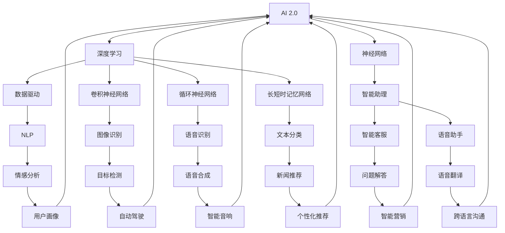

                 

# 李开复：AI 2.0 时代的价值

> 关键词：人工智能，AI 2.0，深度学习，数据，智能助理，技术应用，未来发展

> 摘要：本文将探讨AI 2.0时代的价值，从核心概念、算法原理、数学模型、项目实战、应用场景等多个角度，全面解析AI技术的演进及其对各行各业的影响。本文旨在为读者提供一份深入浅出的AI技术指南，帮助读者理解AI 2.0时代的机遇与挑战。

## 1. 背景介绍

### 1.1 目的和范围

本文旨在深入探讨AI 2.0时代的价值，解析其核心概念、算法原理、数学模型和应用场景，帮助读者全面了解AI技术的演进及其在各行各业的应用。文章将围绕以下几个主题展开：

1. AI 2.0时代的背景与核心概念
2. 深度学习与神经网络的基本原理
3. 数据驱动的智能助理技术
4. AI技术在各行业的应用案例
5. AI技术的未来发展趋势与挑战

### 1.2 预期读者

本文面向对人工智能技术有一定了解的读者，包括程序员、数据科学家、AI研究者、企业决策者等。希望通过本文，读者能够更深入地理解AI 2.0时代的价值，掌握相关技术，并能够在实际工作中应用这些技术。

### 1.3 文档结构概述

本文共分为10个部分，具体结构如下：

1. 引言：介绍AI 2.0时代的背景与价值
2. 背景介绍：概述本文的目的、预期读者和文档结构
3. 核心概念与联系：阐述AI 2.0时代的关键概念及其关系
4. 核心算法原理 & 具体操作步骤：详细讲解AI算法原理与操作步骤
5. 数学模型和公式 & 详细讲解 & 举例说明：介绍AI技术的数学模型与公式
6. 项目实战：代码实际案例和详细解释说明
7. 实际应用场景：分析AI技术在各行业的应用
8. 工具和资源推荐：推荐学习资源、开发工具和框架
9. 总结：未来发展趋势与挑战
10. 附录：常见问题与解答

### 1.4 术语表

#### 1.4.1 核心术语定义

- AI 2.0：指第二代人工智能技术，具有更强的自我学习和智能决策能力，能够实现更高效、更广泛的应用。
- 深度学习：一种基于神经网络的人工智能技术，通过多层神经网络模拟人脑神经元之间的连接和相互作用，实现图像、语音、文本等数据的自动识别和分类。
- 数据驱动：指人工智能系统在学习和决策过程中，主要依赖于数据输入，通过大量数据训练模型，提高系统性能和准确性。
- 智能助理：一种基于人工智能技术的软件或硬件系统，能够根据用户需求提供个性化服务，如智能客服、语音助手等。

#### 1.4.2 相关概念解释

- 神经网络：一种模拟生物神经系统的计算模型，由多个神经元组成，通过前向传播和反向传播算法进行训练和优化。
- 深层神经网络：由多层神经元组成的神经网络，能够学习更复杂的特征和模式，广泛应用于图像、语音和文本识别等领域。
- 梯度下降：一种优化神经网络模型参数的算法，通过不断调整参数，使模型在训练数据上的误差最小化。

#### 1.4.3 缩略词列表

- AI：人工智能
- DL：深度学习
- CNN：卷积神经网络
- RNN：循环神经网络
- LSTM：长短时记忆网络
- NLP：自然语言处理

## 2. 核心概念与联系

在AI 2.0时代，核心概念包括深度学习、神经网络、数据驱动和智能助理。这些概念相互关联，共同构成了AI 2.0时代的技术体系。下面将使用Mermaid流程图（节点中不含特殊字符）展示这些核心概念及其关系。



### 2.1 深度学习与神经网络

深度学习是一种基于神经网络的人工智能技术，通过多层神经网络模拟人脑神经元之间的连接和相互作用，实现图像、语音、文本等数据的自动识别和分类。深度学习可以分为卷积神经网络（CNN）、循环神经网络（RNN）和长短时记忆网络（LSTM）等不同类型。

- **卷积神经网络（CNN）**：主要用于图像识别和分类，通过卷积层、池化层和全连接层等结构，提取图像的局部特征和整体特征。
- **循环神经网络（RNN）**：主要用于序列数据的处理，如语音识别、文本生成等，通过循环结构保留序列信息。
- **长短时记忆网络（LSTM）**：是RNN的一种改进，能够学习长序列信息，广泛应用于语音识别、机器翻译等领域。

### 2.2 数据驱动与智能助理

数据驱动是指人工智能系统在学习和决策过程中，主要依赖于数据输入，通过大量数据训练模型，提高系统性能和准确性。智能助理是一种基于人工智能技术的软件或硬件系统，能够根据用户需求提供个性化服务，如智能客服、语音助手等。

- **智能客服**：通过自然语言处理技术，实现与用户的实时对话，提供问题解答和咨询服务。
- **语音助手**：通过语音识别和语音合成技术，实现人机交互，提供语音控制、语音查询等功能。

### 2.3 AI 2.0时代的关键概念关系

AI 2.0时代的关键概念之间存在着密切的联系，共同构成了一个完整的技术体系。深度学习、神经网络、数据驱动和智能助理等技术相互促进，推动了人工智能技术的快速发展。通过这些技术，AI系统能够实现更高效、更智能的应用，为各行各业带来深刻的变革。

## 3. 核心算法原理 & 具体操作步骤

在AI 2.0时代，深度学习是一种核心算法，其基本原理是通过多层神经网络模拟人脑神经元之间的连接和相互作用，实现图像、语音、文本等数据的自动识别和分类。本文将详细介绍深度学习的算法原理，并通过伪代码阐述其具体操作步骤。

### 3.1 深度学习的算法原理

深度学习算法主要分为以下几个步骤：

1. **数据预处理**：对输入数据（图像、语音、文本等）进行预处理，包括归一化、缩放、裁剪等操作。
2. **前向传播**：将预处理后的数据输入神经网络，通过多层神经网络进行特征提取和融合。
3. **损失函数计算**：计算输出结果与真实值之间的误差，通过损失函数衡量模型性能。
4. **反向传播**：根据损失函数，通过反向传播算法更新神经网络模型参数，优化模型性能。
5. **模型评估**：使用验证集或测试集评估模型性能，包括准确率、召回率、F1值等指标。

### 3.2 深度学习的具体操作步骤

以下是一个简单的深度学习算法的伪代码，用于实现图像分类任务。

```python
# 数据预处理
data = preprocess_data(input_data)

# 初始化神经网络模型
model = NeuralNetwork()

# 前向传播
output = model.forward_pass(data)

# 计算损失函数
loss = loss_function(output, true_labels)

# 反向传播
model.backward_pass(loss)

# 模型评估
accuracy = evaluate_model(model, test_data)
print("Accuracy:", accuracy)
```

### 3.3 神经网络模型参数优化

在深度学习过程中，神经网络模型参数的优化是一个关键问题。通常，我们使用梯度下降算法（Gradient Descent）来优化模型参数，具体步骤如下：

1. **计算梯度**：计算模型参数的梯度，即损失函数关于每个参数的偏导数。
2. **更新参数**：根据梯度方向和步长，更新模型参数。
3. **重复迭代**：重复执行步骤1和步骤2，直到满足停止条件（如损失函数收敛或达到预设迭代次数）。

以下是一个使用梯度下降算法优化神经网络参数的伪代码示例。

```python
# 初始化模型参数
parameters = initialize_parameters()

# 设置学习率
learning_rate = 0.01

# 停止条件
max_iterations = 1000
loss_threshold = 0.001

# 梯度下降迭代
for i in range(max_iterations):
    # 前向传播
    output = model.forward_pass(data)

    # 计算损失函数
    loss = loss_function(output, true_labels)

    # 计算梯度
    gradients = model.compute_gradients(loss)

    # 更新参数
    parameters = update_parameters(parameters, gradients, learning_rate)

    # 模型评估
    if i % 100 == 0:
        accuracy = evaluate_model(model, test_data)
        print("Iteration:", i, "Accuracy:", accuracy)

    # 停止条件
    if loss < loss_threshold:
        break

# 输出最终参数
print("Final parameters:", parameters)
```

通过上述伪代码，我们可以看到深度学习算法的基本原理和具体操作步骤。在实际应用中，深度学习算法需要结合具体任务和数据集进行调整和优化，以达到最佳性能。

## 4. 数学模型和公式 & 详细讲解 & 举例说明

在深度学习中，数学模型和公式起到了至关重要的作用，它们决定了神经网络的训练过程和性能。本文将详细介绍深度学习中的几个核心数学模型和公式，并通过具体的例子进行说明。

### 4.1 损失函数

损失函数是深度学习中的核心组件，用于衡量模型输出与真实值之间的差距。最常见的损失函数包括均方误差（MSE）和交叉熵（Cross Entropy）。

#### 均方误差（MSE）

均方误差是回归问题中最常用的损失函数，其公式如下：

$$
MSE = \frac{1}{m} \sum_{i=1}^{m} (y_i - \hat{y}_i)^2
$$

其中，$y_i$为真实值，$\hat{y}_i$为模型预测值，$m$为样本数量。

#### 交叉熵（Cross Entropy）

交叉熵是分类问题中最常用的损失函数，其公式如下：

$$
CE = -\frac{1}{m} \sum_{i=1}^{m} \sum_{c=1}^{C} y_i(c) \log(\hat{y}_i(c))
$$

其中，$y_i(c)$为第$i$个样本在第$c$类上的真实概率，$\hat{y}_i(c)$为模型预测的概率。

### 4.2 梯度下降算法

梯度下降是一种优化神经网络参数的算法，其核心思想是沿着损失函数梯度的反方向更新参数，以最小化损失函数。其基本公式如下：

$$
\theta = \theta - \alpha \frac{\partial J}{\partial \theta}
$$

其中，$\theta$为参数，$J$为损失函数，$\alpha$为学习率。

### 4.3 反向传播算法

反向传播是深度学习训练过程中的关键步骤，用于计算损失函数关于每个参数的梯度。其基本步骤如下：

1. **前向传播**：计算模型输出和损失函数。
2. **计算梯度**：计算损失函数关于每个参数的梯度。
3. **反向传播**：将梯度反向传播到上一层。
4. **更新参数**：根据梯度方向和步长更新参数。

### 4.4 举例说明

假设我们有一个简单的神经网络，用于对二分类问题进行预测。网络的输入层有1个神经元，隐藏层有2个神经元，输出层有1个神经元。

#### 数据集

我们有一个包含100个样本的数据集，每个样本是一个二维向量$(x_1, x_2)$，标签为$y \in \{0, 1\}$。

#### 模型参数

网络权重$W_1, W_2, W_3$和偏置$b_1, b_2, b_3$。

#### 训练过程

1. **前向传播**：将输入$(x_1, x_2)$输入网络，通过激活函数计算出输出$\hat{y}$。

$$
\hat{y} = \sigma(W_3 \cdot \sigma(W_2 \cdot \sigma(W_1 \cdot x + b_1) + b_2) + b_3)
$$

2. **计算损失函数**：使用交叉熵损失函数计算损失。

$$
J = -\frac{1}{m} \sum_{i=1}^{m} [y_i \cdot \log(\hat{y}_i) + (1 - y_i) \cdot \log(1 - \hat{y}_i)]
$$

3. **反向传播**：计算损失函数关于每个参数的梯度。

$$
\frac{\partial J}{\partial W_1} = \frac{1}{m} \sum_{i=1}^{m} [x_i \cdot (1 - \hat{y}_i) \cdot \hat{y}_i \cdot (1 - \hat{y}_i)]
$$

$$
\frac{\partial J}{\partial W_2} = \frac{1}{m} \sum_{i=1}^{m} [\sigma(W_1 \cdot x + b_1) \cdot (1 - \sigma(W_1 \cdot x + b_1)) \cdot W_3 \cdot (1 - \hat{y}_i) \cdot \hat{y}_i \cdot (1 - \hat{y}_i)]
$$

$$
\frac{\partial J}{\partial W_3} = \frac{1}{m} \sum_{i=1}^{m} [\sigma(W_2 \cdot \sigma(W_1 \cdot x + b_1) + b_2) \cdot (1 - \sigma(W_2 \cdot \sigma(W_1 \cdot x + b_1) + b_2)) \cdot (1 - \hat{y}_i) \cdot \hat{y}_i \cdot (1 - \hat{y}_i)]
$$

4. **更新参数**：使用梯度下降算法更新参数。

$$
W_1 = W_1 - \alpha \cdot \frac{\partial J}{\partial W_1}
$$

$$
W_2 = W_2 - \alpha \cdot \frac{\partial J}{\partial W_2}
$$

$$
W_3 = W_3 - \alpha \cdot \frac{\partial J}{\partial W_3}
$$

通过上述步骤，我们可以完成一次训练迭代，不断更新模型参数，优化模型性能。

### 4.5 实际案例

假设我们有一个分类问题，需要将数据集分为两类。我们可以使用上述方法，通过训练迭代逐步优化模型参数，提高分类准确率。

1. **初始化参数**：随机初始化网络权重和偏置。
2. **前向传播**：计算模型输出。
3. **计算损失函数**：使用交叉熵损失函数计算损失。
4. **反向传播**：计算损失函数关于每个参数的梯度。
5. **更新参数**：使用梯度下降算法更新参数。
6. **评估模型**：使用验证集评估模型性能。

通过多次迭代训练，我们可以得到一个性能良好的分类模型。

## 5. 项目实战：代码实际案例和详细解释说明

为了更好地理解AI 2.0时代的技术，我们将通过一个实际项目来展示如何使用深度学习算法实现图像分类任务。本文将详细介绍项目的开发环境搭建、源代码实现和代码解读与分析。

### 5.1 开发环境搭建

在开始项目之前，我们需要搭建一个合适的开发环境。以下是搭建环境所需的软件和工具：

1. **操作系统**：Windows/Linux/Mac OS
2. **编程语言**：Python 3.7及以上版本
3. **深度学习框架**：TensorFlow 2.0及以上版本
4. **数据预处理库**：NumPy、Pandas
5. **可视化库**：Matplotlib、Seaborn

安装步骤：

1. 安装操作系统，配置Python环境。
2. 安装深度学习框架TensorFlow。

```bash
pip install tensorflow
```

3. 安装数据预处理库和可视化库。

```bash
pip install numpy pandas matplotlib seaborn
```

### 5.2 源代码详细实现和代码解读

以下是一个简单的图像分类项目的源代码，我们将通过注释来详细解释代码的实现过程。

```python
import tensorflow as tf
from tensorflow.keras import layers
import numpy as np
import matplotlib.pyplot as plt

# 5.2.1 加载数据集
# 这里我们使用Keras内置的MNIST手写数字数据集
(x_train, y_train), (x_test, y_test) = tf.keras.datasets.mnist.load_data()

# 5.2.2 数据预处理
# 将数据集的像素值缩放到[0, 1]范围内，并将标签转换为独热编码
x_train = x_train.astype("float32") / 255
x_test = x_test.astype("float32") / 255
y_train = tf.keras.utils.to_categorical(y_train, 10)
y_test = tf.keras.utils.to_categorical(y_test, 10)

# 5.2.3 构建模型
# 我们使用一个简单的卷积神经网络作为分类器
model = tf.keras.Sequential([
    layers.Conv2D(32, (3, 3), activation='relu', input_shape=(28, 28, 1)),
    layers.MaxPooling2D((2, 2)),
    layers.Conv2D(64, (3, 3), activation='relu'),
    layers.MaxPooling2D((2, 2)),
    layers.Conv2D(64, (3, 3), activation='relu'),
    layers.Flatten(),
    layers.Dense(64, activation='relu'),
    layers.Dense(10, activation='softmax')
])

# 5.2.4 编译模型
# 使用Adam优化器和交叉熵损失函数编译模型
model.compile(optimizer='adam',
              loss='categorical_crossentropy',
              metrics=['accuracy'])

# 5.2.5 训练模型
# 使用训练集训练模型，设置训练次数为10轮
history = model.fit(x_train, y_train, epochs=10, batch_size=128, validation_split=0.2)

# 5.2.6 评估模型
# 使用测试集评估模型性能
test_loss, test_acc = model.evaluate(x_test, y_test, verbose=2)
print(f"Test accuracy: {test_acc:.4f}")

# 5.2.7 可视化训练过程
# 绘制训练过程中的损失函数和准确率
plt.figure(figsize=(12, 4))
plt.subplot(1, 2, 1)
plt.plot(history.history['loss'], label='Training loss')
plt.plot(history.history['val_loss'], label='Validation loss')
plt.legend()
plt.subplot(1, 2, 2)
plt.plot(history.history['accuracy'], label='Training accuracy')
plt.plot(history.history['val_accuracy'], label='Validation accuracy')
plt.legend()
plt.show()
```

### 5.3 代码解读与分析

1. **加载数据集**：我们使用Keras内置的MNIST手写数字数据集。该数据集包含60,000个训练样本和10,000个测试样本，每个样本是一个28x28的灰度图像。

2. **数据预处理**：我们将数据集的像素值缩放到[0, 1]范围内，并将标签转换为独热编码。这是因为在多分类问题中，独热编码能够更好地表示标签。

3. **构建模型**：我们使用一个简单的卷积神经网络（CNN）作为分类器。该模型包含两个卷积层和两个池化层，以及两个全连接层。卷积层用于提取图像特征，全连接层用于分类。

4. **编译模型**：我们使用Adam优化器和交叉熵损失函数编译模型。Adam优化器能够自适应调整学习率，交叉熵损失函数能够衡量模型输出与真实标签之间的差距。

5. **训练模型**：我们使用训练集训练模型，设置训练次数为10轮。在训练过程中，我们使用128个样本作为一批次进行训练，并保留20%的样本作为验证集。

6. **评估模型**：我们使用测试集评估模型性能，输出测试准确率。

7. **可视化训练过程**：我们绘制训练过程中的损失函数和准确率，以便观察模型在训练过程中的性能变化。

通过以上步骤，我们成功实现了图像分类任务，展示了如何使用深度学习算法进行数据预处理、模型构建、模型训练和性能评估。

## 6. 实际应用场景

AI 2.0技术已经在各个行业取得了显著的成果，以下是几个典型的实际应用场景：

### 6.1 医疗保健

在医疗保健领域，AI 2.0技术被广泛应用于疾病诊断、药物研发和患者监护等方面。例如，基于深度学习的算法可以分析医疗影像，帮助医生快速准确地诊断疾病，如乳腺癌、肺癌等。此外，AI技术还能预测疾病风险，为患者提供个性化的健康管理方案。

### 6.2 零售业

在零售业，AI 2.0技术被用于客户行为分析、库存管理和个性化推荐等方面。通过分析客户购买记录、浏览历史等数据，AI技术能够预测客户需求，提供个性化的购物体验。同时，AI技术还能优化库存管理，减少库存成本，提高销售额。

### 6.3 金融行业

在金融行业，AI 2.0技术被用于风险控制、信用评估和智能投顾等方面。AI算法能够分析海量交易数据，识别潜在风险，提高风险控制能力。此外，AI技术还能评估客户信用等级，为金融机构提供可靠的信用评估依据。同时，智能投顾通过分析客户投资偏好和市场数据，提供个性化的投资建议。

### 6.4 自动驾驶

在自动驾驶领域，AI 2.0技术被用于环境感知、路径规划和决策控制等方面。自动驾驶汽车通过搭载的传感器和摄像头，实时获取道路信息，使用深度学习算法进行目标检测、障碍物识别和路径规划，确保车辆安全行驶。

### 6.5 教育领域

在教育领域，AI 2.0技术被用于智能教学、学习评估和个性化辅导等方面。AI技术可以分析学生的学习数据，识别学习需求和问题，为教师提供个性化的教学建议。同时，AI技术还能进行学习效果评估，帮助学生更好地掌握知识。

### 6.6 能源管理

在能源管理领域，AI 2.0技术被用于智能电网、节能优化和可再生能源管理等方面。AI算法能够分析能源消耗数据，优化电网运行，提高能源利用效率。同时，AI技术还能预测能源需求，为可再生能源的调度和管理提供支持。

通过以上实际应用场景，我们可以看到AI 2.0技术在各个领域的广泛应用，为各行各业带来了深刻的变革。随着AI技术的不断发展和创新，未来其在更多领域的应用前景将更加广阔。

## 7. 工具和资源推荐

### 7.1 学习资源推荐

为了更好地了解和学习AI 2.0技术，以下是几个推荐的学习资源：

#### 7.1.1 书籍推荐

1. **《深度学习》（Deep Learning）**：由Ian Goodfellow、Yoshua Bengio和Aaron Courville合著，是一本深度学习领域的经典教材，详细介绍了深度学习的理论基础和实践方法。
2. **《Python深度学习》（Python Deep Learning）**：由François Chollet编写，是一本适合初学者的深度学习入门书籍，通过丰富的实例和代码，讲解了深度学习的应用和实践。
3. **《机器学习实战》（Machine Learning in Action）**：由Peter Harrington编写，通过具体的实战案例，介绍了机器学习的基本概念和算法实现。

#### 7.1.2 在线课程

1. **吴恩达的《深度学习专项课程》（Deep Learning Specialization）**：由斯坦福大学教授吴恩达主讲，是一套系统的深度学习课程，包括神经网络基础、卷积神经网络、循环神经网络等主题。
2. **Coursera的《机器学习》（Machine Learning）**：由斯坦福大学教授Andrew Ng主讲，是一套全面的机器学习课程，涵盖了线性回归、逻辑回归、决策树、神经网络等算法。
3. **Udacity的《深度学习工程师纳米学位》（Deep Learning Engineer Nanodegree）**：通过项目驱动的学习模式，帮助学习者掌握深度学习的基础知识和实际应用。

#### 7.1.3 技术博客和网站

1. **Medium上的《AI·科技·人文》（AI, Tech, Humanity）**：该博客由李开复撰写，内容涵盖人工智能、科技和人文等多个领域，为读者提供了丰富的AI技术和应用案例。
2. **ArXiv**：一个提供最新机器学习和深度学习论文的学术数据库，为研究者提供了丰富的学术资源。
3. **GitHub**：一个开源代码托管平台，上面有大量的深度学习和机器学习项目的源代码，可以方便学习者学习和参考。

### 7.2 开发工具框架推荐

为了更好地进行AI 2.0技术的开发和应用，以下是几个推荐的开发工具和框架：

#### 7.2.1 IDE和编辑器

1. **Jupyter Notebook**：一个基于Web的交互式计算环境，适合进行数据分析和机器学习实验。
2. **PyCharm**：一款功能强大的Python IDE，提供了丰富的开发工具和插件，适合进行深度学习和机器学习项目开发。
3. **Visual Studio Code**：一款轻量级的代码编辑器，通过扩展插件，可以支持Python、TensorFlow等多种编程语言和框架。

#### 7.2.2 调试和性能分析工具

1. **TensorBoard**：一个基于Web的可视化工具，用于分析和调试TensorFlow模型。
2. **NVIDIA Nsight**：一套用于NVIDIA GPU性能分析的工具，可以监控和优化深度学习模型的运行。
3. **PyTorch Profiler**：一个用于分析PyTorch模型性能的工具，可以识别和优化模型中的性能瓶颈。

#### 7.2.3 相关框架和库

1. **TensorFlow**：一个开源的深度学习框架，适用于各种规模的深度学习任务。
2. **PyTorch**：一个流行的深度学习框架，具有灵活的动态图计算能力，适合研究和开发。
3. **Keras**：一个基于TensorFlow和PyTorch的高层API，提供了简洁的接口和丰富的预训练模型。
4. **Scikit-learn**：一个用于机器学习的开源库，提供了丰富的算法和工具，适用于数据分析和模型评估。

### 7.3 相关论文著作推荐

为了更深入地了解AI 2.0技术的发展和研究，以下是几个推荐的论文和著作：

1. **《深度学习：原理及实践》（Deep Learning: Principles and Practice）**：这是一本综合性的深度学习教材，涵盖了深度学习的理论基础和实际应用。
2. **《神经网络与深度学习》（Neural Networks and Deep Learning）**：由Ian Goodfellow、Yoshua Bengio和Aaron Courville合著，是一本全面介绍神经网络和深度学习技术的经典著作。
3. **《强化学习》（Reinforcement Learning: An Introduction）**：由Richard S. Sutton和Barto编写，介绍了强化学习的基本原理和应用。

通过以上推荐的学习资源、开发工具和论文著作，我们可以更好地了解AI 2.0技术的理论和实践，为我们在相关领域的学习和研究提供有力的支持。

## 8. 总结：未来发展趋势与挑战

AI 2.0时代的发展正处于快速变革的时期，未来发展趋势和挑战并存。以下是几个关键点：

### 8.1 发展趋势

1. **技术的不断进步**：随着深度学习、神经网络等技术的不断发展和优化，AI系统的性能和适用范围将得到进一步提升。
2. **跨领域的融合**：AI技术将在更多领域得到应用，如医疗、金融、教育、能源等，实现跨领域的融合与创新。
3. **自主学习和进化**：未来的AI系统将具备更强的自主学习和进化能力，能够通过自我调整和优化，实现更高效、更智能的应用。
4. **开源生态的繁荣**：随着AI开源社区和平台的不断壮大，更多的开源工具和框架将涌现，为AI技术的发展提供强大的支持。

### 8.2 挑战

1. **数据隐私和安全**：随着AI技术的广泛应用，数据隐私和安全问题日益突出，如何保障用户数据的安全和隐私成为一项重要挑战。
2. **算法透明性和可解释性**：当前许多AI算法缺乏透明性和可解释性，如何提高算法的可解释性，使其更易于被用户理解和接受，是未来需要解决的问题。
3. **资源消耗和能耗**：深度学习模型在训练过程中需要大量计算资源，如何优化模型结构，降低资源消耗和能耗，是未来需要关注的重要问题。
4. **伦理和法律问题**：随着AI技术的快速发展，其应用也引发了一系列伦理和法律问题，如自动化决策、歧视问题等，如何制定合理的伦理规范和法律框架，是未来需要解决的问题。

总之，AI 2.0时代的发展前景广阔，同时也面临诸多挑战。未来，我们需要在技术创新、伦理规范、法律框架等方面共同努力，推动AI技术的健康、可持续发展。

## 9. 附录：常见问题与解答

### 9.1 AI 2.0是什么？

AI 2.0是指第二代人工智能技术，具有更强的自我学习和智能决策能力，能够实现更高效、更广泛的应用。与传统的AI 1.0技术相比，AI 2.0在深度学习、神经网络、数据驱动和智能助理等方面取得了显著进展。

### 9.2 深度学习与神经网络的关系是什么？

深度学习是一种基于神经网络的人工智能技术，通过多层神经网络模拟人脑神经元之间的连接和相互作用，实现图像、语音、文本等数据的自动识别和分类。神经网络是深度学习的基础，而深度学习则是在神经网络的基础上，通过增加网络层数和优化算法，实现更复杂的特征提取和模式识别。

### 9.3 深度学习的核心算法是什么？

深度学习的核心算法主要包括卷积神经网络（CNN）、循环神经网络（RNN）和长短时记忆网络（LSTM）等。这些算法通过模拟人脑神经元之间的连接和相互作用，实现图像、语音、文本等数据的自动识别和分类。

### 9.4 数据驱动与智能助理的关系是什么？

数据驱动是指人工智能系统在学习和决策过程中，主要依赖于数据输入，通过大量数据训练模型，提高系统性能和准确性。智能助理是一种基于人工智能技术的软件或硬件系统，能够根据用户需求提供个性化服务，如智能客服、语音助手等。数据驱动是智能助理技术的基础，而智能助理则是数据驱动应用的典型代表。

### 9.5 如何提高深度学习模型的性能？

提高深度学习模型性能的方法包括：

1. **增加网络层数**：通过增加网络层数，可以提取更复杂的特征，提高模型性能。
2. **优化网络结构**：选择合适的网络结构，如卷积神经网络（CNN）、循环神经网络（RNN）等，可以更好地适应不同类型的数据。
3. **数据预处理**：对输入数据进行预处理，如归一化、缩放、裁剪等，可以提高模型训练的效率和性能。
4. **优化算法**：使用更高效的优化算法，如Adam优化器，可以加快模型训练速度，提高性能。
5. **调整超参数**：通过调整学习率、批量大小等超参数，可以优化模型性能。

### 9.6 深度学习在哪些领域有应用？

深度学习在多个领域有广泛应用，包括：

1. **医疗保健**：用于疾病诊断、药物研发、患者监护等。
2. **零售业**：用于客户行为分析、库存管理、个性化推荐等。
3. **金融行业**：用于风险控制、信用评估、智能投顾等。
4. **自动驾驶**：用于环境感知、路径规划、决策控制等。
5. **教育领域**：用于智能教学、学习评估、个性化辅导等。
6. **能源管理**：用于智能电网、节能优化、可再生能源管理等。

## 10. 扩展阅读 & 参考资料

1. **《深度学习》（Deep Learning）**：Ian Goodfellow、Yoshua Bengio和Aaron Courville著，深度学习领域的经典教材，详细介绍了深度学习的理论基础和实践方法。
2. **《Python深度学习》（Python Deep Learning）**：François Chollet著，适合初学者的深度学习入门书籍，通过丰富的实例和代码，讲解了深度学习的应用和实践。
3. **《机器学习实战》（Machine Learning in Action）**：Peter Harrington著，通过具体的实战案例，介绍了机器学习的基本概念和算法实现。
4. **吴恩达的《深度学习专项课程》（Deep Learning Specialization）**：由斯坦福大学教授吴恩达主讲，包括神经网络基础、卷积神经网络、循环神经网络等主题。
5. **《神经网络与深度学习》（Neural Networks and Deep Learning）**：Ian Goodfellow、Yoshua Bengio和Aaron Courville合著，全面介绍神经网络和深度学习技术的经典著作。
6. **《强化学习》（Reinforcement Learning: An Introduction）**：Richard S. Sutton和Barto编写，介绍了强化学习的基本原理和应用。

