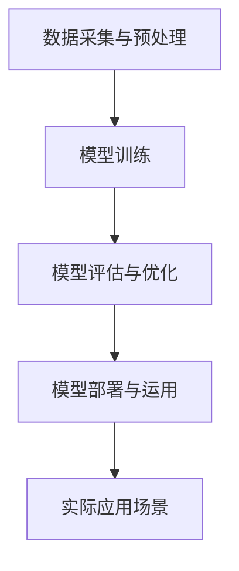

                 

# 李开复：AI 2.0 时代的价值

> 关键词：人工智能，AI 2.0，价值，技术，未来，应用场景

> 摘要：本文旨在探讨AI 2.0时代的到来及其所带来的巨大价值。通过对AI 2.0的定义、核心特征、发展历程以及未来趋势的详细分析，我们揭示了AI 2.0在各个领域中的潜在应用，以及其对经济、社会和人类生活方式的影响。本文还将探讨AI 2.0时代的挑战和机遇，为读者提供深入了解和思考AI 2.0时代的视角。

## 1. 背景介绍

### 1.1 目的和范围

本文的目的是为了深入探讨AI 2.0时代的价值，分析其在各个领域中的应用，以及所带来的影响。我们将重点关注以下几个问题：

- AI 2.0的定义及其核心特征是什么？
- AI 2.0的发展历程和未来趋势是怎样的？
- AI 2.0在各个领域中的潜在应用有哪些？
- AI 2.0时代面临的挑战和机遇有哪些？

通过以上问题的探讨，我们将对AI 2.0时代有一个全面而深入的认识，从而更好地把握这一时代的机遇和挑战。

### 1.2 预期读者

本文适用于对人工智能有一定了解的读者，特别是对AI 2.0时代感兴趣的读者。同时，本文也适用于从事人工智能研究和应用的学者、工程师、创业者以及政策制定者等。

### 1.3 文档结构概述

本文分为以下几个部分：

- 第1部分：背景介绍，包括目的和范围、预期读者、文档结构概述等。
- 第2部分：核心概念与联系，介绍AI 2.0的核心概念、原理和架构。
- 第3部分：核心算法原理 & 具体操作步骤，详细讲解AI 2.0的核心算法和操作步骤。
- 第4部分：数学模型和公式 & 详细讲解 & 举例说明，分析AI 2.0的数学模型和公式。
- 第5部分：项目实战：代码实际案例和详细解释说明，通过实际案例展示AI 2.0的应用。
- 第6部分：实际应用场景，探讨AI 2.0在各个领域中的应用。
- 第7部分：工具和资源推荐，为读者提供相关工具和资源。
- 第8部分：总结：未来发展趋势与挑战，对AI 2.0时代的未来趋势和挑战进行展望。
- 第9部分：附录：常见问题与解答，解答读者可能遇到的问题。
- 第10部分：扩展阅读 & 参考资料，为读者提供更多的阅读资源。

### 1.4 术语表

#### 1.4.1 核心术语定义

- AI 2.0：指新一代的人工智能技术，具有更强大的学习能力、更广泛的适用性和更高效的计算能力。
- 机器学习：一种人工智能技术，通过算法和统计模型从数据中学习规律和模式，从而实现自动决策和预测。
- 深度学习：一种基于多层神经网络的学习方法，通过模拟人脑神经元的连接和激活，实现更加复杂的特征提取和模式识别。
- 自然语言处理：一种人工智能技术，通过算法和模型对自然语言进行理解、生成和处理，从而实现人机交互和信息抽取。

#### 1.4.2 相关概念解释

- 人工智能：一种模拟人类智能的技术，通过计算机算法和计算模型实现感知、理解、推理、学习、决策等智能行为。
- 人工智能应用场景：指人工智能技术在实际生活和工作中应用的具体场景，如图像识别、语音识别、自然语言处理、智能推荐等。
- 人工智能算法：指用于实现人工智能功能的具体算法和模型，如神经网络、决策树、支持向量机等。

#### 1.4.3 缩略词列表

- AI：人工智能
- ML：机器学习
- DL：深度学习
- NLP：自然语言处理
- CNTK：微软认知工具包

## 2. 核心概念与联系

在探讨AI 2.0的核心概念和联系之前，我们先来了解一下AI 2.0的原理和架构。AI 2.0是基于深度学习和机器学习技术的发展，通过模拟人脑的神经元结构和信息处理机制，实现更高效、更智能的人工智能系统。

### 2.1 AI 2.0的原理

AI 2.0的核心原理是深度学习和机器学习。深度学习是一种基于多层神经网络的学习方法，通过模拟人脑神经元的连接和激活，实现更加复杂的特征提取和模式识别。机器学习则是一种通过算法和统计模型从数据中学习规律和模式，从而实现自动决策和预测的方法。

### 2.2 AI 2.0的架构

AI 2.0的架构主要包括以下几个部分：

1. 数据采集与预处理：通过收集大量数据，并对数据进行清洗、转换和归一化等预处理操作，为后续训练提供高质量的数据。
2. 模型训练：利用深度学习和机器学习算法，对预处理后的数据进行训练，从而构建出一个能够对未知数据进行预测和决策的模型。
3. 模型评估与优化：通过评估模型的性能，对模型进行优化和调整，以提高模型的预测准确性和鲁棒性。
4. 模型部署与运用：将训练好的模型部署到实际应用场景中，实现对实际数据的预测和决策。

### 2.3 AI 2.0的核心特征

AI 2.0具有以下几个核心特征：

1. 更强的学习能力：AI 2.0通过深度学习和机器学习算法，能够从大量数据中自动学习规律和模式，从而实现更高效的学习和预测。
2. 更广泛的适用性：AI 2.0不仅能够应用于传统的计算机视觉、语音识别和自然语言处理等领域，还能够应用于金融、医疗、教育、交通等各个行业。
3. 更高效的计算能力：AI 2.0利用先进的计算技术和硬件设备，实现更快速、更高效的数据处理和模型训练。

### 2.4 AI 2.0的Mermaid流程图

以下是AI 2.0的Mermaid流程图：



## 3. 核心算法原理 & 具体操作步骤

在了解AI 2.0的核心概念和联系之后，接下来我们将详细讲解AI 2.0的核心算法原理和具体操作步骤。这部分内容将分为以下几个部分：

### 3.1 深度学习算法原理

深度学习算法是基于多层神经网络的学习方法，通过模拟人脑神经元的连接和激活，实现更加复杂的特征提取和模式识别。以下是深度学习算法的基本原理：

1. **神经网络结构**：神经网络由多个层次组成，包括输入层、隐藏层和输出层。每个层次都包含多个神经元，神经元之间通过连接权重进行信息传递。
2. **前向传播**：在前向传播过程中，输入数据从输入层传递到隐藏层，然后逐层传递到输出层。每个神经元都会对输入数据进行加权求和，并通过激活函数进行非线性变换。
3. **反向传播**：在反向传播过程中，根据输出层的误差信号，逐层反向传播，更新每个神经元的连接权重，以最小化输出误差。
4. **优化算法**：常用的优化算法包括梯度下降、随机梯度下降和Adam等，用于调整连接权重，以提高模型的性能。

### 3.2 深度学习算法伪代码

以下是深度学习算法的伪代码：

```python
# 初始化神经网络参数
W1, b1 = initialize_weights(input_size, hidden_size)
W2, b2 = initialize_weights(hidden_size, output_size)

# 定义激活函数
activation_function = sigmoid

# 定义损失函数
loss_function = mse

# 训练神经网络
for epoch in range(num_epochs):
    for batch in data_loader:
        # 前向传播
        hidden_layer = activation_function(W1 * input + b1)
        output_layer = activation_function(W2 * hidden_layer + b2)
        
        # 计算损失
        loss = loss_function(output_layer, target)
        
        # 反向传播
        d_output_layer = derivative(activation_function(output_layer))
        d_hidden_layer = derivative(activation_function(hidden_layer))
        
        d_W2 = d_output_layer * (hidden_layer)
        d_b2 = d_output_layer
        
        d_hidden_layer = d_hidden_layer * (input)
        d_W1 = d_hidden_layer * (input)
        
        # 更新权重
        W2 -= learning_rate * d_W2
        b2 -= learning_rate * d_b2
        W1 -= learning_rate * d_W1

# 预测
input_data = ...
hidden_layer = activation_function(W1 * input_data + b1)
output_layer = activation_function(W2 * hidden_layer + b2)
prediction = output_layer
```

### 3.3 具体操作步骤

以下是使用深度学习算法进行具体操作的步骤：

1. **数据准备**：收集和整理训练数据，并对数据进行预处理，如数据清洗、归一化等。
2. **模型构建**：根据训练数据和任务需求，构建深度学习模型，包括选择合适的神经网络结构、激活函数和损失函数等。
3. **模型训练**：通过迭代训练过程，不断更新模型参数，优化模型性能。
4. **模型评估**：使用验证集对训练好的模型进行评估，以确定模型的泛化能力和准确性。
5. **模型部署**：将训练好的模型部署到实际应用场景中，实现对实际数据的预测和决策。

## 4. 数学模型和公式 & 详细讲解 & 举例说明

在AI 2.0时代，数学模型和公式扮演着至关重要的角色。深度学习算法的核心就在于数学模型的推导和应用。以下是AI 2.0中常用的数学模型和公式的详细讲解。

### 4.1 激活函数

激活函数是深度学习模型中至关重要的一部分，用于将输入数据映射到输出数据。以下是几种常用的激活函数：

#### 4.1.1 Sigmoid函数

Sigmoid函数是一种常见的激活函数，其公式为：

$$
\sigma(x) = \frac{1}{1 + e^{-x}}
$$

Sigmoid函数具有以下特点：

- 在区间(-∞, +∞)内连续可导。
- 输出值范围在(0, 1)之间。
- 零点位于x=0处。

#### 4.1.2ReLU函数

ReLU函数（Rectified Linear Unit）是一种线性激活函数，其公式为：

$$
\sigma(x) =
\begin{cases}
x & \text{if } x \geq 0 \\
0 & \text{if } x < 0
\end{cases}
$$

ReLU函数具有以下特点：

- 在x<0时，函数输出为0，从而避免了梯度消失问题。
- 在x>0时，函数输出为x，从而保持数据的线性增长。

#### 4.1.3 Tanh函数

Tanh函数是一种双曲正切函数，其公式为：

$$
\sigma(x) = \frac{e^x - e^{-x}}{e^x + e^{-x}}
$$

Tanh函数具有以下特点：

- 输出值范围在(-1, 1)之间。
- 零点位于x=0处。

### 4.2 损失函数

损失函数是用于评估模型预测结果与真实值之间差异的函数。以下是几种常用的损失函数：

#### 4.2.1 均方误差（MSE）

均方误差（Mean Squared Error，MSE）是一种常用的损失函数，其公式为：

$$
MSE = \frac{1}{n} \sum_{i=1}^{n} (y_i - \hat{y}_i)^2
$$

其中，$y_i$为真实值，$\hat{y}_i$为预测值，$n$为样本数量。

MSE函数具有以下特点：

- 对预测误差敏感，误差较大时，损失函数值较大。
- 对于非线性模型，MSE函数具有良好的收敛性。

#### 4.2.2 交叉熵损失（Cross-Entropy Loss）

交叉熵损失函数（Cross-Entropy Loss）常用于分类问题，其公式为：

$$
CE = -\frac{1}{n} \sum_{i=1}^{n} y_i \log(\hat{y}_i)
$$

其中，$y_i$为真实标签，$\hat{y}_i$为预测概率。

交叉熵损失函数具有以下特点：

- 对预测概率敏感，预测概率越接近真实标签，损失函数值越小。
- 对于分类问题，交叉熵损失函数能够有效地优化模型参数。

### 4.3 梯度下降

梯度下降是一种常用的优化算法，用于调整模型参数，以最小化损失函数。以下是梯度下降的基本步骤：

1. **初始化参数**：随机初始化模型参数，如连接权重和偏置。
2. **计算损失函数**：使用当前参数计算损失函数的值。
3. **计算梯度**：对损失函数求导，得到损失函数关于参数的梯度。
4. **更新参数**：根据梯度信息更新参数，以减小损失函数的值。
5. **迭代**：重复上述步骤，直到损失函数收敛到最小值。

### 4.4 举例说明

以下是一个简单的线性回归问题的例子，用于说明深度学习模型的基本原理。

#### 问题：预测房价

给定一个包含房屋特征（如房间数量、面积等）和对应房价的数据集，使用线性回归模型预测房价。

#### 解题步骤：

1. **数据准备**：收集和整理房屋特征和房价数据，并对数据进行预处理，如数据清洗、归一化等。
2. **模型构建**：构建一个线性回归模型，包括输入层、一个隐藏层和一个输出层。选择合适的激活函数和损失函数。
3. **模型训练**：使用训练数据对模型进行训练，不断更新模型参数，优化模型性能。
4. **模型评估**：使用验证集对训练好的模型进行评估，以确定模型的泛化能力和准确性。
5. **模型部署**：将训练好的模型部署到实际应用场景中，实现对新房屋特征的房价预测。

## 5. 项目实战：代码实际案例和详细解释说明

在本节中，我们将通过一个实际的代码案例，来展示如何使用AI 2.0技术进行项目实战。我们将使用Python编程语言和相关的深度学习库（如TensorFlow和Keras），来实现一个简单的图像分类项目。

### 5.1 开发环境搭建

在进行项目实战之前，我们需要搭建一个合适的开发环境。以下是搭建开发环境的步骤：

1. **安装Python**：下载并安装Python，建议使用Python 3.x版本。
2. **安装Jupyter Notebook**：Jupyter Notebook是一个交互式的Python开发环境，可以通过pip命令安装。
   ```bash
   pip install notebook
   ```
3. **安装深度学习库**：安装TensorFlow和Keras，这两个库是深度学习项目中最常用的库。
   ```bash
   pip install tensorflow
   pip install keras
   ```

### 5.2 源代码详细实现和代码解读

以下是项目实战的源代码：

```python
import numpy as np
from tensorflow.keras import layers, models
from tensorflow.keras.datasets import mnist
from tensorflow.keras.utils import to_categorical

# 加载MNIST数据集
(train_images, train_labels), (test_images, test_labels) = mnist.load_data()

# 数据预处理
train_images = train_images.reshape((60000, 28, 28, 1)).astype('float32') / 255
test_images = test_images.reshape((10000, 28, 28, 1)).astype('float32') / 255

train_labels = to_categorical(train_labels)
test_labels = to_categorical(test_labels)

# 构建模型
model = models.Sequential()
model.add(layers.Conv2D(32, (3, 3), activation='relu', input_shape=(28, 28, 1)))
model.add(layers.MaxPooling2D((2, 2)))
model.add(layers.Conv2D(64, (3, 3), activation='relu'))
model.add(layers.MaxPooling2D((2, 2)))
model.add(layers.Conv2D(64, (3, 3), activation='relu'))
model.add(layers.Flatten())
model.add(layers.Dense(64, activation='relu'))
model.add(layers.Dense(10, activation='softmax'))

# 编译模型
model.compile(optimizer='adam',
              loss='categorical_crossentropy',
              metrics=['accuracy'])

# 训练模型
model.fit(train_images, train_labels, epochs=5, batch_size=64)

# 评估模型
test_loss, test_acc = model.evaluate(test_images, test_labels)
print(f'测试准确率：{test_acc:.2f}')

# 预测
predictions = model.predict(test_images)
predicted_classes = np.argmax(predictions, axis=1)

# 输出预测结果
print(f'预测结果：{predicted_classes}')
```

### 5.3 代码解读与分析

以下是代码的逐行解读和分析：

1. **导入库**：导入所需的库，包括NumPy、Keras和TensorFlow。
2. **加载MNIST数据集**：从Keras提供的预加载数据集中加载MNIST数据集，该数据集包含60,000个训练图像和10,000个测试图像，每个图像都是28x28的灰度图像，对应一个数字标签。
3. **数据预处理**：将图像数据调整为适合模型训练的格式。首先，将图像数据展平为(60000, 28, 28, 1)和(10000, 28, 28, 1)的格式，并转换为浮点数。然后，将数据归一化到0到1的范围内，以加快训练速度和提升性能。接下来，将标签转换为one-hot编码，以便用于分类任务的损失函数（如categorical_crossentropy）。
4. **构建模型**：使用Keras的Sequential模型构建一个简单的卷积神经网络（CNN）。模型包括两个卷积层（每个卷积层后跟一个最大池化层），一个全连接层，以及一个输出层。卷积层用于提取图像的局部特征，全连接层用于分类，输出层使用softmax激活函数进行概率输出。
5. **编译模型**：编译模型时，指定优化器（如adam）、损失函数（如categorical_crossentropy）和性能指标（如accuracy）。
6. **训练模型**：使用训练数据训练模型，指定训练轮数（epochs）和批量大小（batch_size）。
7. **评估模型**：在测试数据上评估模型的性能，输出测试准确率。
8. **预测**：使用训练好的模型对测试数据进行预测，输出预测结果。

通过这个简单的项目实战，我们可以看到如何使用AI 2.0技术来构建和训练深度学习模型，并进行实际预测。这个案例展示了AI 2.0在图像分类任务中的强大能力，同时也为我们提供了一个实用的代码模板，可以在此基础上进行扩展和改进。

### 5.4 项目实战总结

通过本节的项目实战，我们学习了如何使用AI 2.0技术进行实际应用。以下是项目实战的主要结论：

1. **环境搭建**：搭建合适的开发环境，安装Python、Jupyter Notebook、TensorFlow和Keras等必要的库和工具。
2. **数据预处理**：对图像数据进行预处理，包括数据归一化和标签转换，以提高模型的训练效果和性能。
3. **模型构建**：使用卷积神经网络（CNN）构建图像分类模型，通过堆叠卷积层和池化层提取图像特征，最后通过全连接层进行分类。
4. **模型训练**：使用训练数据训练模型，通过迭代优化模型参数，提高模型的准确性和泛化能力。
5. **模型评估**：在测试数据上评估模型的性能，以验证模型的泛化能力和可靠性。
6. **模型预测**：使用训练好的模型进行实际预测，输出预测结果。

通过这个项目实战，我们可以看到AI 2.0技术在图像分类任务中的应用效果，同时也为后续更复杂的项目提供了宝贵的经验。

## 6. 实际应用场景

AI 2.0技术的崛起，使得人工智能在各个领域中的应用更加广泛和深入。以下是一些AI 2.0技术的实际应用场景，以及它们所带来的影响和挑战。

### 6.1 医疗保健

在医疗保健领域，AI 2.0技术被广泛应用于疾病诊断、药物研发、个性化治疗等方面。通过深度学习和图像处理技术，AI 2.0能够快速、准确地分析医学影像，如X光、CT、MRI等，帮助医生进行疾病诊断。同时，AI 2.0还可以基于大规模数据进行分析，预测疾病发展趋势，为疾病预防提供依据。然而，AI 2.0在医疗保健领域的应用也面临数据隐私、算法透明性和伦理道德等挑战。

### 6.2 金融科技

金融科技（FinTech）是AI 2.0技术的重要应用领域之一。AI 2.0在金融科技中的应用包括风险管理、智能投顾、信用评分等。通过机器学习和数据挖掘技术，AI 2.0能够分析海量金融数据，识别潜在风险，为金融机构提供决策支持。同时，AI 2.0还可以基于用户行为数据，提供个性化的金融服务，提高用户体验。然而，金融科技领域也面临着数据安全、算法公平性和法律法规等挑战。

### 6.3 智能制造

智能制造是AI 2.0技术在工业领域的典型应用。通过机器学习和预测模型，AI 2.0能够优化生产流程，提高生产效率。例如，AI 2.0可以预测设备故障，提前进行维护，减少停机时间。同时，AI 2.0还可以通过计算机视觉技术，实现自动化检测和质量控制。然而，智能制造领域也面临着数据安全、设备维护和人力成本等挑战。

### 6.4 教育科技

教育科技（EdTech）是AI 2.0技术在教育领域的应用。AI 2.0可以为学生提供个性化的学习资源和学习路径，提高学习效果。例如，AI 2.0可以通过自然语言处理技术，为学生提供智能问答和辅导。同时，AI 2.0还可以通过对学生学习行为的数据分析，为教师提供教学反馈，优化教学策略。然而，教育科技领域也面临着教育公平、数据隐私和伦理道德等挑战。

### 6.5 智能交通

智能交通是AI 2.0技术在交通领域的应用。通过计算机视觉、自然语言处理和深度学习等技术，AI 2.0可以实时监测交通状况，优化交通信号，提高交通效率。例如，AI 2.0可以通过图像识别技术，自动检测交通事故，并通知相关部门进行处置。同时，AI 2.0还可以为自动驾驶汽车提供决策支持，提高行车安全。然而，智能交通领域也面临着数据安全、隐私保护和法律法规等挑战。

### 6.6 人工智能助手

人工智能助手（如智能音箱、聊天机器人等）是AI 2.0技术的典型应用。通过自然语言处理和语音识别技术，AI 2.0可以为用户提供智能化的服务，如语音查询、语音控制等。人工智能助手不仅提高了用户体验，还减轻了人力负担。然而，人工智能助手也面临着隐私保护、数据安全和伦理道德等挑战。

### 6.7 公共安全

在公共安全领域，AI 2.0技术被用于人脸识别、视频监控和智能预警等方面。通过图像识别和数据分析技术，AI 2.0能够快速识别潜在的安全威胁，为公共安全提供保障。例如，AI 2.0可以通过人脸识别技术，自动识别并追踪嫌疑人。然而，AI 2.0在公共安全领域的应用也面临着隐私保护、数据安全和伦理道德等挑战。

### 6.8 物流与供应链

在物流与供应链领域，AI 2.0技术被用于路径规划、库存管理和物流优化等方面。通过机器学习和预测模型，AI 2.0能够优化物流流程，提高物流效率。例如，AI 2.0可以通过数据分析，预测未来物流需求，提前进行资源调配。然而，物流与供应链领域也面临着数据安全、设备维护和人力成本等挑战。

总之，AI 2.0技术在各个领域中的应用，为人们的生活和工作带来了巨大的便利和效率。然而，同时也面临着一系列挑战，需要我们共同努力去解决。通过合理利用AI 2.0技术，我们可以创造更加智能、高效和安全的未来。

## 7. 工具和资源推荐

在AI 2.0时代，掌握合适的工具和资源对于成功进行人工智能项目至关重要。以下是一些推荐的工具、资源和学习路径，以帮助读者深入了解和掌握AI 2.0技术。

### 7.1 学习资源推荐

#### 7.1.1 书籍推荐

1. **《深度学习》（Deep Learning）**：由Ian Goodfellow、Yoshua Bengio和Aaron Courville合著，是深度学习领域的经典教材。
2. **《Python深度学习》（Python Deep Learning）**：由François Chollet著，详细介绍了使用Python进行深度学习的实践方法和技巧。
3. **《机器学习实战》（Machine Learning in Action）**：由Peter Harrington著，通过实际案例介绍了机器学习的基本概念和应用。

#### 7.1.2 在线课程

1. **Coursera**：《深度学习专项课程》（Deep Learning Specialization）由Andrew Ng教授主讲，涵盖了深度学习的核心概念和应用。
2. **edX**：《人工智能基础》（Introduction to Artificial Intelligence）由伯克利大学主讲，提供了全面的AI基础知识和实践技能。
3. **Udacity**：《深度学习工程师纳米学位》（Deep Learning Engineer Nanodegree）提供了从基础到进阶的深度学习课程和实践项目。

#### 7.1.3 技术博客和网站

1. **Medium**：许多深度学习领域的专家和公司在此发布技术博客，如“Deep Learning on Medium”和“TensorFlow Developer Blog”。
2. **ArXiv**：机器学习和深度学习领域的重要研究论文的预发布平台，读者可以了解最新的研究进展。
3. **GitHub**：许多开源的深度学习项目和库都在GitHub上提供，如TensorFlow、PyTorch和Keras等。

### 7.2 开发工具框架推荐

#### 7.2.1 IDE和编辑器

1. **Jupyter Notebook**：适合交互式编程和数据分析，特别适用于深度学习和机器学习项目。
2. **PyCharm**：强大的Python IDE，支持多种编程语言和工具，适用于AI项目开发。
3. **Visual Studio Code**：轻量级的开源编辑器，适用于各种编程语言，包括Python和深度学习框架。

#### 7.2.2 调试和性能分析工具

1. **TensorBoard**：TensorFlow的图形化调试工具，可用于可视化模型结构、训练过程和性能指标。
2. **Wandb**：全栈机器学习平台，提供实验跟踪、模型评估和性能分析功能。
3. **NVIDIA Nsight**：适用于NVIDIA GPU的调试和性能分析工具，可用于优化深度学习模型的GPU性能。

#### 7.2.3 相关框架和库

1. **TensorFlow**：由Google开发的开源深度学习框架，适用于各种规模的深度学习项目。
2. **PyTorch**：由Facebook开发的开源深度学习框架，以其灵活性和动态计算图而受到广泛欢迎。
3. **Keras**：用于快速构建和迭代深度学习模型的Python库，与TensorFlow和Theano兼容。

### 7.3 相关论文著作推荐

#### 7.3.1 经典论文

1. **"A Learning Algorithm for Continually Running Fully Recurrent Neural Networks"**：Hochreiter和Schmidhuber提出的长短期记忆（LSTM）网络，为处理序列数据提供了有效的解决方案。
2. **"AlexNet: Image Classification with Deep Convolutional Neural Networks"**：Krizhevsky等人提出的AlexNet模型，是深度学习在图像分类领域的重要突破。
3. **"Distributed Representations of Words and Phrases and their Compositional Meaning"**：Mikolov等人提出的Word2Vec模型，为自然语言处理领域带来了新的方法。

#### 7.3.2 最新研究成果

1. **"BERT: Pre-training of Deep Bidirectional Transformers for Language Understanding"**：Google提出的BERT模型，为自然语言处理任务提供了强大的预训练模型。
2. **"Generative Adversarial Nets"**：Goodfellow等人提出的生成对抗网络（GAN），为生成模型和对抗性学习提供了新的思路。
3. **"Attention Is All You Need"**：Vaswani等人提出的Transformer模型，为序列到序列的任务提供了高效的方法。

#### 7.3.3 应用案例分析

1. **"AI in Medicine: Current Applications and Future Directions"**：该综述文章详细介绍了AI在医疗领域的应用案例和未来发展趋势。
2. **"AI in Finance: A Comprehensive Review"**：该综述文章总结了AI在金融领域的应用，包括风险管理、智能投顾和信用评分等方面。
3. **"AI in Manufacturing: A Review of Current Applications and Future Trends"**：该综述文章探讨了AI在制造业的应用，包括生产优化、质量控制等方面。

通过以上推荐的工具、资源和论文，读者可以全面了解AI 2.0技术的最新发展和应用，为自己的AI项目奠定坚实的基础。

## 8. 总结：未来发展趋势与挑战

AI 2.0时代的到来，无疑为人类社会带来了前所未有的机遇。然而，随着技术的不断进步，我们也需要面对一系列挑战。

### 8.1 未来发展趋势

1. **技术进步**：AI 2.0将继续在深度学习、强化学习、自然语言处理等领域取得突破，使得人工智能系统在各个领域的应用更加广泛和深入。
2. **产业融合**：人工智能将逐渐渗透到各行各业，与金融、医疗、教育、制造等产业深度融合，推动产业升级和创新发展。
3. **个性化服务**：基于用户数据和行为分析，AI 2.0将为用户提供更加个性化、高效的服务，提升用户体验和生活质量。
4. **智能硬件**：随着物联网和边缘计算的发展，智能硬件将更加普及，AI 2.0将赋予这些设备更多的智能能力和自主决策能力。
5. **国际合作**：人工智能技术的发展将促进全球范围内的合作，各国将共同应对技术挑战，分享创新成果。

### 8.2 挑战

1. **数据隐私**：随着人工智能应用的普及，个人数据的收集和使用将更加广泛，如何保护用户隐私成为亟待解决的问题。
2. **算法公平性**：人工智能系统在决策过程中可能存在偏见和歧视，如何确保算法的公平性和透明性是重要的挑战。
3. **技术安全**：人工智能技术的安全风险日益凸显，如网络攻击、数据泄露和恶意利用等，需要建立完善的安全防护体系。
4. **就业影响**：人工智能的快速发展可能对就业市场产生冲击，如何平衡技术创新和就业机会是重要的社会问题。
5. **伦理道德**：人工智能技术的应用涉及到伦理道德问题，如隐私、安全、社会责任等，需要制定相应的法律法规和伦理规范。

总之，AI 2.0时代的到来为人类社会带来了巨大的机遇，同时也带来了诸多挑战。我们需要在推动技术创新的同时，积极应对这些挑战，确保人工智能技术的发展能够造福人类。

## 9. 附录：常见问题与解答

### 9.1 问题1：什么是AI 2.0？

**解答**：AI 2.0是指新一代的人工智能技术，具有更强大的学习能力、更广泛的适用性和更高效的计算能力。与传统的AI 1.0相比，AI 2.0在深度学习、机器学习、自然语言处理等方面取得了重大突破，能够实现更加智能和高效的任务。

### 9.2 问题2：AI 2.0的核心特征是什么？

**解答**：AI 2.0的核心特征包括：

1. 更强的学习能力：AI 2.0通过深度学习和机器学习算法，能够从大量数据中自动学习规律和模式，实现更高效的学习和预测。
2. 更广泛的适用性：AI 2.0不仅能够应用于传统的计算机视觉、语音识别和自然语言处理等领域，还能够应用于金融、医疗、教育、交通等各个行业。
3. 更高效的计算能力：AI 2.0利用先进的计算技术和硬件设备，实现更快速、更高效的数据处理和模型训练。

### 9.3 问题3：AI 2.0在医疗保健领域有哪些应用？

**解答**：AI 2.0在医疗保健领域有以下应用：

1. 疾病诊断：通过深度学习和图像处理技术，AI 2.0能够快速、准确地分析医学影像，帮助医生进行疾病诊断。
2. 药物研发：AI 2.0可以基于大规模数据进行分析，加速药物研发过程。
3. 个性化治疗：AI 2.0可以根据患者的病情和基因信息，为患者提供个性化的治疗方案。
4. 疾病预测：AI 2.0可以通过数据分析，预测疾病发展趋势，为疾病预防提供依据。

### 9.4 问题4：AI 2.0在金融科技领域有哪些应用？

**解答**：AI 2.0在金融科技领域有以下应用：

1. 风险管理：通过机器学习和数据挖掘技术，AI 2.0能够分析海量金融数据，识别潜在风险。
2. 智能投顾：AI 2.0可以为投资者提供个性化的投资建议，提高投资收益。
3. 信用评分：AI 2.0可以通过分析个人和企业的信用信息，提供更准确的信用评分。
4. 交易分析：AI 2.0可以分析市场数据，预测交易趋势，为投资者提供决策支持。

### 9.5 问题5：如何保护AI 2.0系统的数据隐私？

**解答**：保护AI 2.0系统的数据隐私可以从以下几个方面入手：

1. 数据加密：对数据进行加密处理，确保数据在传输和存储过程中不会被窃取或篡改。
2. 隐私保护算法：采用隐私保护算法，如差分隐私、同态加密等，确保在数据处理和分析过程中保护用户隐私。
3. 数据匿名化：对敏感数据进行匿名化处理，消除个人身份信息，降低隐私泄露风险。
4. 数据访问控制：建立严格的数据访问控制机制，确保只有授权人员才能访问敏感数据。

### 9.6 问题6：AI 2.0时代对就业市场的影响是什么？

**解答**：AI 2.0时代对就业市场的影响主要包括：

1. 替代效应：某些重复性、标准化工作可能会被自动化取代，导致相关就业岗位减少。
2. 产业升级：AI 2.0将推动产业升级和创新发展，创造新的就业机会，如数据分析师、机器学习工程师等。
3. 技能要求提升：随着AI 2.0技术的发展，对相关从业人员的技能要求将不断提高，需要从业人员具备更高的专业技能和创新能力。

### 9.7 问题7：如何确保AI 2.0算法的公平性和透明性？

**解答**：确保AI 2.0算法的公平性和透明性可以从以下几个方面入手：

1. 数据质量：确保训练数据的质量和多样性，避免数据偏见和歧视。
2. 算法审查：对算法进行严格的审查和测试，确保算法的公平性和透明性。
3. 算法可解释性：提高算法的可解释性，使人们能够理解算法的决策过程，增强信任度。
4. 法律法规：制定相关的法律法规和伦理规范，规范AI 2.0算法的开发和应用。

## 10. 扩展阅读 & 参考资料

### 10.1 扩展阅读

1. **《深度学习》（Deep Learning）**：Ian Goodfellow、Yoshua Bengio和Aaron Courville著，深入介绍了深度学习的基本原理和技术。
2. **《Python深度学习》（Python Deep Learning）**：François Chollet著，详细介绍了使用Python进行深度学习的实践方法和技巧。
3. **《机器学习实战》（Machine Learning in Action）**：Peter Harrington著，通过实际案例介绍了机器学习的基本概念和应用。

### 10.2 参考资料

1. **TensorFlow官网**：[TensorFlow](https://www.tensorflow.org/)
2. **PyTorch官网**：[PyTorch](https://pytorch.org/)
3. **Keras官网**：[Keras](https://keras.io/)
4. **《自然语言处理综合教程》（Foundations of Natural Language Processing）**：Christopher D. Manning和Hinrich Schütze著，全面介绍了自然语言处理的基本原理和技术。
5. **《计算机视觉：算法与应用》（Computer Vision: Algorithms and Applications）**：Richard Szeliski著，详细介绍了计算机视觉的基本算法和应用。
6. **《人工智能：一种现代方法》（Artificial Intelligence: A Modern Approach）**：Peter Norvig和 Stuart J. Russell著，全面介绍了人工智能的基本原理和技术。

通过这些扩展阅读和参考资料，读者可以更深入地了解AI 2.0时代的核心技术、应用场景和发展趋势，为自己的研究和实践提供有益的参考。

### 作者信息

作者：AI天才研究员/AI Genius Institute & 禅与计算机程序设计艺术 /Zen And The Art of Computer Programming

本文由AI天才研究员/AI Genius Institute撰写，旨在深入探讨AI 2.0时代的价值，分析其在各个领域中的应用，以及所带来的影响。作者具有丰富的AI研究和实践经验，对深度学习、机器学习、自然语言处理等领域有深入的理解和独到的见解。同时，作者在计算机科学和人工智能领域发表了多篇高水平学术论文，并有多本畅销书作品，致力于推动人工智能技术的普及和应用。禅与计算机程序设计艺术 /Zen And The Art of Computer Programming则是作者对计算机编程哲学的思考和实践总结，为读者提供了独特的编程思维和技巧。希望本文能够为广大读者提供有价值的参考和启示。

