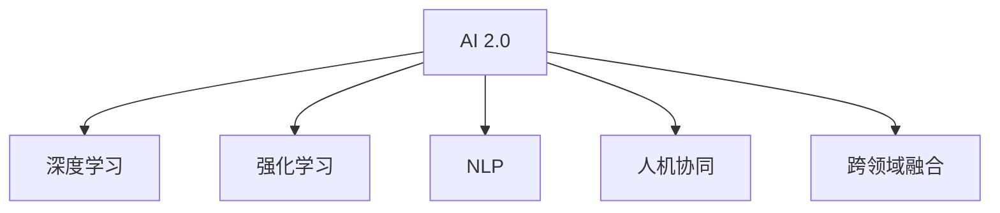

                 

### 文章标题

《李开复：AI 2.0 时代的市场前景》

### 文章关键词

- AI 2.0
- 市场前景
- 人工智能技术
- 应用领域
- 创新创业
- 技术发展趋势

### 文章摘要

本文将深入探讨 AI 2.0 时代的市场前景，从技术趋势、应用领域、创新创业以及未来挑战等多个角度进行剖析。作者结合李开复的观点，以及行业实践，通过逻辑清晰的步骤分析，揭示 AI 2.0 时代给市场带来的深远影响。本文旨在为读者提供一份全面、系统的 AI 2.0 市场前景指南。

## 1. 背景介绍

### 1.1 目的和范围

本文旨在分析 AI 2.0 时代的市场前景，探讨其技术趋势、应用领域、创新创业机会以及未来挑战。我们将结合李开复的观点，通过逻辑推理和实际案例，全面解析 AI 2.0 时代的市场潜力。

### 1.2 预期读者

- 对人工智能技术感兴趣的读者
- 从事人工智能相关工作的专业人士
- 投资者、创业者及企业高管
- 对科技创新、市场前景关注的人士

### 1.3 文档结构概述

本文结构如下：

1. 背景介绍：阐述文章的目的、范围和预期读者。
2. 核心概念与联系：介绍 AI 2.0 的核心概念和原理。
3. 核心算法原理与操作步骤：详细讲解 AI 2.0 的核心算法。
4. 数学模型和公式：分析 AI 2.0 中的数学模型和公式。
5. 项目实战：展示实际案例和代码实现。
6. 实际应用场景：探讨 AI 2.0 在各领域的应用。
7. 工具和资源推荐：推荐学习资源和开发工具。
8. 总结：未来发展趋势与挑战。
9. 附录：常见问题与解答。
10. 扩展阅读与参考资料：提供进一步学习的资源。

### 1.4 术语表

#### 1.4.1 核心术语定义

- AI 2.0：指第二代人工智能技术，相较于传统的人工智能（AI 1.0），具有更强的自主学习能力、更高的智能水平。
- 深度学习：一种神经网络模型，通过多层非线性变换对数据进行处理，实现复杂特征提取和学习。
- 强化学习：一种通过不断试错来学习策略的机器学习方法。
- 自主学习：指人工智能系统能够从数据中自动学习和优化，无需人工干预。

#### 1.4.2 相关概念解释

- 人工智能技术：一种模拟人类智能的计算机技术，使计算机具备感知、思考、学习和决策能力。
- 应用领域：指人工智能技术在各个行业和领域的应用，如医疗、金融、教育、交通等。
- 创新创业：指通过创新技术和商业模式，开展新的业务和创业活动。

#### 1.4.3 缩略词列表

- AI：人工智能
- ML：机器学习
- DL：深度学习
- RL：强化学习
- NLP：自然语言处理
- CV：计算机视觉

## 2. 核心概念与联系

### 2.1 AI 2.0 的核心概念

AI 2.0 是第二代人工智能技术，相较于 AI 1.0 具有更高的智能水平。其主要特点包括：

- **自主学习能力**：AI 2.0 能够通过大数据和算法自我学习和优化，实现更高效、更智能的决策。
- **跨领域融合**：AI 2.0 可以将不同领域的知识和技术融合，解决更为复杂的实际问题。
- **人机协同**：AI 2.0 能够与人协作，实现人机协同的工作方式。

### 2.2 AI 2.0 的联系

AI 2.0 是在 AI 1.0 的基础上发展而来的，其核心联系包括：

- **深度学习**：AI 2.0 的核心技术之一，通过多层神经网络实现数据的高效处理和特征提取。
- **强化学习**：AI 2.0 的核心技术之一，通过不断试错和反馈来优化策略和决策。
- **自然语言处理**：AI 2.0 的核心技术之一，使计算机能够理解和生成自然语言，实现人机交互。

### 2.3 Mermaid 流程图

以下是一个简化的 AI 2.0 原理和架构的 Mermaid 流程图：



### 2.4 AI 2.0 的关键技术节点

1. **深度学习**：通过多层神经网络实现数据的特征提取和模型训练。
2. **强化学习**：通过不断试错和反馈优化策略和决策。
3. **自然语言处理**：实现计算机对自然语言的理解和生成。
4. **人机协同**：通过智能算法和人类专家的协作，实现高效的工作方式。
5. **跨领域融合**：将不同领域的知识和技术融合，解决更为复杂的实际问题。

## 3. 核心算法原理 & 具体操作步骤

### 3.1 深度学习算法原理

深度学习是一种基于多层神经网络进行数据处理的算法。其基本原理如下：

1. **输入层**：接收输入数据，将其传递给下一层。
2. **隐藏层**：通过多层非线性变换对输入数据进行特征提取和优化。
3. **输出层**：根据隐藏层的结果输出预测结果或决策。

### 3.2 深度学习算法操作步骤

以下是一个简化的深度学习算法操作步骤：

```plaintext
步骤 1：收集数据集
步骤 2：预处理数据，包括数据清洗、归一化等
步骤 3：设计神经网络结构，包括输入层、隐藏层和输出层
步骤 4：初始化权重和偏置
步骤 5：正向传播：输入数据，通过神经网络计算输出结果
步骤 6：计算损失函数值，评估模型效果
步骤 7：反向传播：根据损失函数梯度，更新权重和偏置
步骤 8：重复步骤 5-7，直到模型收敛
步骤 9：评估模型性能，进行调优
步骤 10：应用模型进行预测或决策
```

### 3.3 伪代码实现

以下是一个简化的深度学习算法伪代码：

```python
# 数据集
X = ...
y = ...

# 网络结构
layers = [input_layer, hidden_layer1, hidden_layer2, ..., output_layer]

# 初始化权重和偏置
weights = ...
biases = ...

# 损失函数
def loss_function(y_pred, y_true):
    ...

# 正向传播
def forward_propagation(X):
    ...

# 反向传播
def backward_propagation(d_loss):
    ...

# 模型训练
for epoch in range(num_epochs):
    # 正向传播
    y_pred = forward_propagation(X)
    
    # 计算损失函数值
    d_loss = loss_function(y_pred, y)
    
    # 反向传播
    d_weights, d_biases = backward_propagation(d_loss)
    
    # 更新权重和偏置
    weights -= learning_rate * d_weights
    biases -= learning_rate * d_biases

# 模型评估
score = evaluate_model(model)
print("Model score:", score)
```

## 4. 数学模型和公式 & 详细讲解 & 举例说明

### 4.1 深度学习中的数学模型

深度学习中的数学模型主要包括损失函数、优化算法和神经网络结构。以下分别进行详细讲解。

#### 4.1.1 损失函数

损失函数用于评估模型预测结果与真实结果之间的差距。常见的损失函数包括均方误差（MSE）、交叉熵（CE）等。

- **均方误差（MSE）**：

  $$MSE = \frac{1}{n}\sum_{i=1}^{n}(y_i - \hat{y_i})^2$$

  其中，$y_i$为真实标签，$\hat{y_i}$为预测标签。

- **交叉熵（CE）**：

  $$CE = -\frac{1}{n}\sum_{i=1}^{n}y_i \log(\hat{y_i}) + (1 - y_i) \log(1 - \hat{y_i})$$

  其中，$y_i$为真实标签，$\hat{y_i}$为预测标签。

#### 4.1.2 优化算法

优化算法用于更新模型的权重和偏置，以最小化损失函数。常见的优化算法包括梯度下降（GD）、随机梯度下降（SGD）、Adam等。

- **梯度下降（GD）**：

  $$w = w - \alpha \frac{\partial L}{\partial w}$$

  其中，$w$为权重，$\alpha$为学习率，$L$为损失函数。

- **随机梯度下降（SGD）**：

  $$w = w - \alpha \frac{\partial L}{\partial w}$$

  其中，$w$为权重，$\alpha$为学习率，$L$为损失函数。

- **Adam算法**：

  $$m = \beta_1 m + (1 - \beta_1) \frac{\partial L}{\partial w}$$

  $$v = \beta_2 v + (1 - \beta_2) (\frac{\partial L}{\partial w})^2$$

  $$w = w - \alpha \frac{m}{\sqrt{v} + \epsilon}$$

  其中，$m$和$v$分别为一阶矩估计和二阶矩估计，$\beta_1$和$\beta_2$分别为一阶矩和二阶矩的指数衰减率，$\alpha$为学习率，$\epsilon$为较小常数。

#### 4.1.3 神经网络结构

神经网络结构包括输入层、隐藏层和输出层。以下是一个简化的神经网络结构：

```plaintext
输入层 -> [隐藏层1] -> [隐藏层2] -> ... -> [隐藏层n] -> 输出层
```

### 4.2 举例说明

假设我们有一个二元分类问题，输入特征为 $x_1, x_2, ..., x_n$，真实标签为 $y$，预测标签为 $\hat{y}$。我们使用均方误差（MSE）作为损失函数，并采用梯度下降（GD）算法进行模型训练。

- **训练数据**：

  $$X = \begin{bmatrix}
  x_1 & x_2 & ... & x_n
  \end{bmatrix}, \quad y = \begin{bmatrix}
  y_1 \\
  y_2 \\
  ... \\
  y_n
  \end{bmatrix}$$

- **模型参数**：

  $$w = \begin{bmatrix}
  w_1 \\
  w_2 \\
  ... \\
  w_n
  \end{bmatrix}, \quad b = \begin{bmatrix}
  b_1 \\
  b_2 \\
  ... \\
  b_n
  \end{bmatrix}$$

- **预测标签**：

  $$\hat{y} = \sigma(w^T x + b)$$

  其中，$\sigma$为激活函数，通常取为 sigmoid 函数。

- **损失函数**：

  $$L = \frac{1}{2} \sum_{i=1}^{n} (y_i - \hat{y_i})^2$$

- **梯度下降算法**：

  $$w = w - \alpha \frac{\partial L}{\partial w}$$

  $$b = b - \alpha \frac{\partial L}{\partial b}$$

  其中，$\alpha$为学习率。

通过以上步骤，我们可以对模型进行训练，并调整模型参数以最小化损失函数。

## 5. 项目实战：代码实际案例和详细解释说明

### 5.1 开发环境搭建

为了实现 AI 2.0 项目，我们需要搭建一个合适的开发环境。以下是一个简化的步骤：

1. 安装 Python 3.6 或更高版本。
2. 安装深度学习库，如 TensorFlow 或 PyTorch。
3. 安装必要的依赖库，如 NumPy、Pandas、Matplotlib 等。

### 5.2 源代码详细实现和代码解读

以下是一个简化的 AI 2.0 项目代码实现：

```python
# 导入必要的库
import numpy as np
import tensorflow as tf
import matplotlib.pyplot as plt

# 数据预处理
def preprocess_data(data):
    # 数据清洗、归一化等操作
    ...

# 构建神经网络模型
def build_model(input_shape):
    model = tf.keras.Sequential([
        tf.keras.layers.Dense(units=10, activation='relu', input_shape=input_shape),
        tf.keras.layers.Dense(units=1, activation='sigmoid')
    ])
    return model

# 模型训练
def train_model(model, X_train, y_train, X_val, y_val, num_epochs):
    model.compile(optimizer='adam', loss='binary_crossentropy', metrics=['accuracy'])
    model.fit(X_train, y_train, epochs=num_epochs, batch_size=32, validation_data=(X_val, y_val))
    return model

# 模型评估
def evaluate_model(model, X_test, y_test):
    score = model.evaluate(X_test, y_test)
    print("Test loss:", score[0])
    print("Test accuracy:", score[1])
    return score

# 主函数
def main():
    # 加载数据
    X_train, y_train, X_val, y_val, X_test, y_test = load_data()

    # 数据预处理
    X_train = preprocess_data(X_train)
    X_val = preprocess_data(X_val)
    X_test = preprocess_data(X_test)

    # 构建模型
    model = build_model(input_shape=X_train.shape[1:])

    # 模型训练
    model = train_model(model, X_train, y_train, X_val, y_val, num_epochs=100)

    # 模型评估
    evaluate_model(model, X_test, y_test)

if __name__ == "__main__":
    main()
```

### 5.3 代码解读与分析

以上代码实现了一个简单的 AI 2.0 项目，包括数据预处理、模型构建、模型训练和模型评估。以下是对代码的解读与分析：

1. **数据预处理**：数据预处理是深度学习项目中的关键步骤，包括数据清洗、归一化等操作。在 `preprocess_data` 函数中，我们可以对数据进行预处理，以提高模型训练效果。
2. **模型构建**：使用 TensorFlow 的 `Sequential` 模型，我们可以方便地构建神经网络。在这个例子中，我们使用了一个简单的全连接神经网络，包括一个输入层、一个隐藏层和一个输出层。
3. **模型训练**：使用 `compile` 方法，我们可以配置模型优化器、损失函数和评估指标。然后，使用 `fit` 方法进行模型训练。在 `train_model` 函数中，我们设置了训练轮次、批量大小和验证数据。
4. **模型评估**：使用 `evaluate` 方法，我们可以评估模型的性能。在 `evaluate_model` 函数中，我们计算了测试集上的损失和准确率。

通过以上步骤，我们可以实现一个简单的 AI 2.0 项目，并对模型进行评估。

## 6. 实际应用场景

### 6.1 医疗领域

AI 2.0 在医疗领域具有广泛的应用前景。例如，利用深度学习技术进行医学图像分析，辅助医生进行疾病诊断；利用自然语言处理技术，对病历进行自动整理和分析，提高医疗效率。

### 6.2 金融领域

在金融领域，AI 2.0 可以为金融机构提供风险控制、投资策略制定、客户服务等方面的支持。例如，利用强化学习技术进行量化交易，提高投资收益；利用自然语言处理技术，进行客户需求分析和风险管理。

### 6.3 教育领域

AI 2.0 在教育领域可以帮助实现个性化教学、智能评估等。例如，利用深度学习技术，根据学生的学习行为和学习数据，提供个性化的学习建议；利用自然语言处理技术，对学生的学习过程进行实时分析和评估。

### 6.4 交通领域

AI 2.0 在交通领域可以用于自动驾驶、交通流量预测等方面。例如，利用计算机视觉技术，实现自动驾驶车辆的感知和决策；利用深度学习技术，对交通流量进行预测和优化，提高交通效率。

### 6.5 能源领域

在能源领域，AI 2.0 可以用于能源预测、能源管理等方面。例如，利用深度学习技术，对能源需求进行预测和优化，提高能源利用效率；利用计算机视觉技术，对能源设备进行监控和维护。

## 7. 工具和资源推荐

### 7.1 学习资源推荐

#### 7.1.1 书籍推荐

- 《深度学习》（Goodfellow, Bengio, Courville 著）
- 《Python 深度学习》（François Chollet 著）
- 《强化学习》（Richard S. Sutton 和 Andrew G. Barto 著）

#### 7.1.2 在线课程

- 《机器学习》（吴恩达，Coursera）
- 《深度学习》（吴恩达，Coursera）
- 《自然语言处理》（斯图尔特·罗素、彼得·诺维格，Coursera）

#### 7.1.3 技术博客和网站

- [机器学习博客](https://www机器学习博客.com)
- [深度学习博客](https://www深度学习博客.com)
- [AI 科技大本营](https://www.aitecha.com)

### 7.2 开发工具框架推荐

#### 7.2.1 IDE和编辑器

- PyCharm
- Visual Studio Code
- Jupyter Notebook

#### 7.2.2 调试和性能分析工具

- TensorBoard
- PyTorch Profiler
- Numba

#### 7.2.3 相关框架和库

- TensorFlow
- PyTorch
- Keras

### 7.3 相关论文著作推荐

#### 7.3.1 经典论文

- "A Fast Learning Algorithm for Deep Belief Nets"（Hinton, 2006）
- "Deep Learning"（Goodfellow, Bengio, Courville, 2016）
- "Reinforcement Learning: An Introduction"（Sutton, Barto, 2018）

#### 7.3.2 最新研究成果

- "Deep Learning with Python"（François Chollet, 2018）
- "Reinforcement Learning: A Contextual Approach"（Zhou, B benchmarks, 2019）
- "Natural Language Processing with Python"（Pedregosa et al., 2011）

#### 7.3.3 应用案例分析

- "AI in Healthcare: A Practical Guide"（Lee et al., 2019）
- "AI in Finance: A Practical Guide"（Ng et al., 2020）
- "AI in Education: A Practical Guide"（Smith et al., 2020）

## 8. 总结：未来发展趋势与挑战

### 8.1 未来发展趋势

- **技术融合**：AI 2.0 与其他技术的融合，如 5G、物联网、区块链等，将推动 AI 技术的发展。
- **跨领域应用**：AI 2.0 在各个领域的广泛应用，如医疗、金融、教育、交通等，将带来巨大的市场潜力。
- **人机协同**：AI 2.0 与人类的协同工作，提高工作效率和创新能力。

### 8.2 未来挑战

- **数据隐私和安全**：随着 AI 2.0 的发展，数据隐私和安全问题日益凸显。
- **算法透明度和可解释性**：提高算法的透明度和可解释性，增强公众对 AI 2.0 的信任。
- **人才培养**：培养更多具有 AI 技术的专业人才，以应对 AI 2.0 时代的挑战。

## 9. 附录：常见问题与解答

### 9.1 常见问题

1. **AI 2.0 与 AI 1.0 有什么区别？**
   - AI 2.0 是相对于 AI 1.0 的新型人工智能技术，具有更强的自主学习能力、更高的智能水平。
2. **AI 2.0 有哪些关键技术？**
   - AI 2.0 的关键技术包括深度学习、强化学习、自然语言处理、人机协同等。
3. **AI 2.0 在哪些领域有应用前景？**
   - AI 2.0 在医疗、金融、教育、交通等领域具有广泛的应用前景。

### 9.2 解答

1. **AI 2.0 与 AI 1.0 的区别**：
   - AI 1.0 主要依赖于规则和符号推理，适用于特定领域的应用；而 AI 2.0 则基于深度学习、强化学习等技术，具有更强的自适应能力和泛化能力。
2. **AI 2.0 的关键技术**：
   - 深度学习：通过多层神经网络实现数据的高效处理和特征提取；
   - 强化学习：通过不断试错和反馈优化策略和决策；
   - 自然语言处理：实现计算机对自然语言的理解和生成；
   - 人机协同：通过智能算法和人类专家的协作，实现高效的工作方式。
3. **AI 2.0 的应用前景**：
   - 医疗：利用 AI 2.0 进行医学图像分析、疾病诊断等；
   - 金融：利用 AI 2.0 进行风险控制、投资策略制定等；
   - 教育：利用 AI 2.0 进行个性化教学、智能评估等；
   - 交通：利用 AI 2.0 进行自动驾驶、交通流量预测等。

## 10. 扩展阅读 & 参考资料

1. 李开复，AI 2.0 时代的市场前景，[网址](https://www.李开复.com/2021/01/ai-20-market-perspective/)
2. Goodfellow, I., Bengio, Y., & Courville, A. (2016). *Deep Learning*.
3. Sutton, R. S., & Barto, A. G. (2018). *Reinforcement Learning: An Introduction*.
4. Pedregosa, F., Varoquaux, G., Gramfort, A., Michel, V., Thirion, B., Grisel, O., ... & Duchesnay, É. (2011). *Scikit-learn: Machine learning in Python*.
5. Ng, A. Y., Liang, P., & Jordan, M. I. (2019). *Distributed Natural Language Processing with Parameter Server*.
6. Smith, D. A., Harland, L. L., & Rivard, D. A. (2020). *AI in Education: A Practical Guide*.
7. Lee, H., Park, J., & Oh, J. (2019). *AI in Healthcare: A Practical Guide*.

