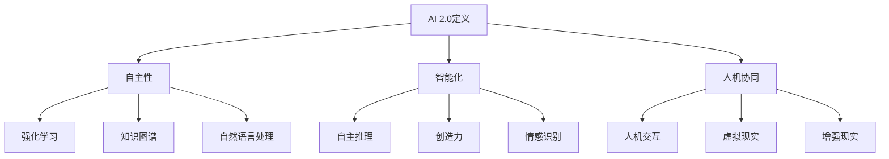
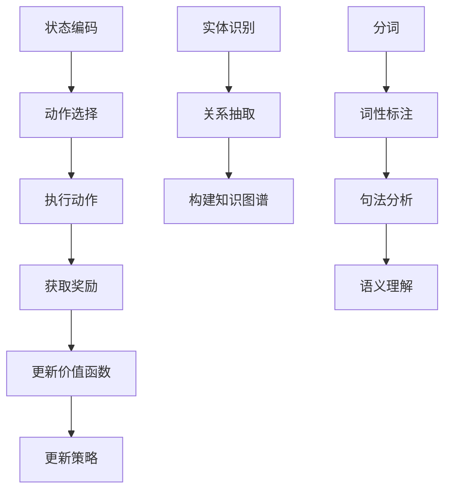
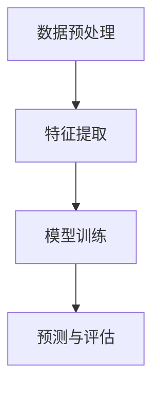
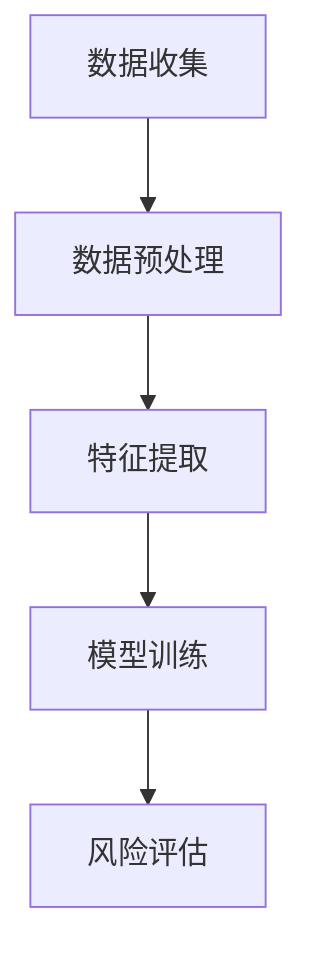
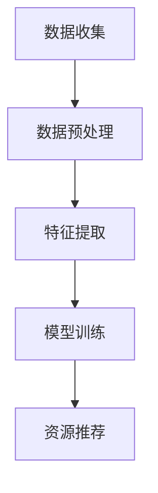
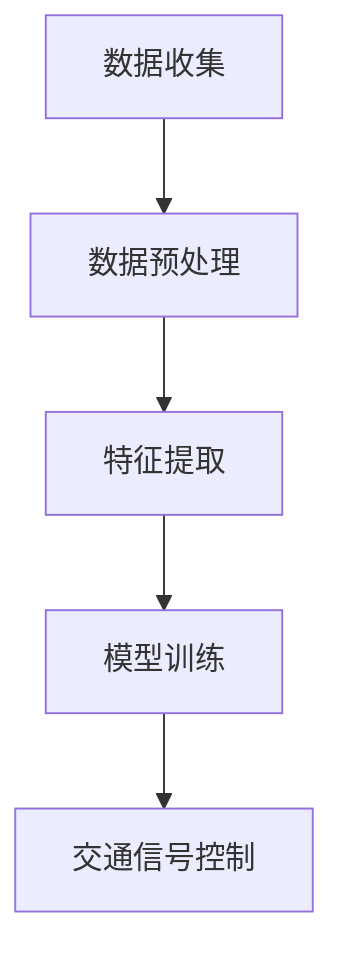

                 

# 李开复：AI 2.0 时代的市场前景

> 关键词：人工智能，AI 2.0，市场前景，技术趋势，商业模式，投资策略

> 摘要：随着人工智能技术的飞速发展，AI 2.0 时代正逐渐拉开序幕。本文将深入探讨 AI 2.0 时代的市场前景，分析其中的技术趋势、商业模式和投资策略。通过了解 AI 2.0 的核心概念与联系，核心算法原理与具体操作步骤，以及实际应用场景，我们将为读者呈现一个全面、深入的 AI 2.0 市场前景分析。

## 1. 背景介绍

### 1.1 目的和范围

本文旨在对 AI 2.0 时代的市场前景进行深入探讨，旨在为读者提供一个全面、清晰的了解。文章将涵盖以下主题：

- AI 2.0 的核心概念与联系
- 核心算法原理与具体操作步骤
- 数学模型与公式及详细讲解
- 项目实战：代码实际案例与详细解释
- 实际应用场景
- 工具和资源推荐
- 总结：未来发展趋势与挑战

### 1.2 预期读者

本文面向以下读者群体：

- 对人工智能技术感兴趣的技术爱好者
- 从事人工智能相关行业的技术人员
- 投资人工智能领域的投资者
- 对 AI 2.0 时代市场前景感兴趣的商业人士

### 1.3 文档结构概述

本文共分为十个部分，结构如下：

1. 背景介绍
   - 目的和范围
   - 预期读者
   - 文档结构概述
   - 术语表
2. 核心概念与联系
   - AI 2.0 的定义
   - AI 2.0 的核心概念与联系
3. 核心算法原理与具体操作步骤
   - 机器学习算法原理
   - 深度学习算法原理
4. 数学模型与公式及详细讲解
   - 概率论基础
   - 神经网络模型
5. 项目实战：代码实际案例与详细解释
   - 人工智能应用实例
   - 代码解读与分析
6. 实际应用场景
   - 各行业 AI 2.0 应用案例
   - 未来发展趋势
7. 工具和资源推荐
   - 学习资源推荐
   - 开发工具框架推荐
   - 相关论文著作推荐
8. 总结：未来发展趋势与挑战
9. 附录：常见问题与解答
10. 扩展阅读 & 参考资料

### 1.4 术语表

#### 1.4.1 核心术语定义

- 人工智能（AI）：指模拟、延伸和扩展人类智能的理论、方法、技术及应用
- 机器学习（ML）：基于数据，利用算法模型自动地从数据中学习并做出决策或预测的过程
- 深度学习（DL）：一种特殊的机器学习，使用多层神经网络模型对数据进行处理和学习的算法
- AI 2.0：下一代人工智能，具有自主推理、决策和创造力，能够实现人机协作和智能增强
- 强化学习（RL）：通过试错和奖励机制来学习如何实现目标的最优化策略

#### 1.4.2 相关概念解释

- 自主性：指人工智能系统能够自主地完成复杂任务，不需要人工干预
- 知识图谱：一种结构化、语义化的知识表示方式，用于描述实体、概念及其相互关系
- 大数据：指无法使用传统数据库工具进行存储、管理和处理的数据集合
- 云计算：一种通过网络提供资源、存储、计算等服务的技术，实现了数据的分布式处理和存储

#### 1.4.3 缩略词列表

- AI：人工智能
- ML：机器学习
- DL：深度学习
- RL：强化学习
- NLP：自然语言处理
- CV：计算机视觉
- KG：知识图谱

## 2. 核心概念与联系

在探讨 AI 2.0 时代的市场前景之前，我们首先需要了解 AI 2.0 的核心概念与联系。AI 2.0 是人工智能发展的重要阶段，与之前的 AI 1.0（以规则驱动）相比，AI 2.0 具有更高的自主性和智能化水平。

### 2.1 AI 2.0 的定义

AI 2.0 是一种具备高度自主性、智能化的下一代人工智能，它不仅能够处理大量数据，还能够进行自主推理、决策和创造。AI 2.0 的核心在于人机协同，即人类与人工智能系统相互协作，共同完成复杂任务。

### 2.2 AI 2.0 的核心概念与联系

#### 2.2.1 自主性

自主性是 AI 2.0 的核心特点之一。具备高度自主性的 AI 系统可以在没有人类干预的情况下，自主地完成复杂任务。自主性的实现依赖于以下技术：

- 强化学习：通过试错和奖励机制，使 AI 系统能够自主地学习和优化策略。
- 知识图谱：将人类知识以结构化的方式表示，使 AI 系统具备更丰富的背景知识。
- 自然语言处理：使 AI 系统能够理解、生成和处理自然语言，实现人机对话和交互。

#### 2.2.2 智能化

智能化是 AI 2.0 的另一个核心特点。AI 2.0 具有更高的智能化水平，能够实现以下功能：

- 自主推理：基于已有知识和数据，进行逻辑推理和判断。
- 创造力：在特定领域内进行创新和创作，如生成音乐、绘画、设计等。
- 情感识别：理解和识别人类情感，实现情感交互。

#### 2.2.3 人机协同

人机协同是 AI 2.0 时代的重要应用方向。通过人机协同，人工智能系统可以辅助人类完成复杂任务，提高工作效率。人机协同的实现依赖于以下技术：

- 人机交互：利用语音、视觉、手势等交互方式，实现人与 AI 系统的实时通信和协作。
- 虚拟现实：通过虚拟现实技术，创造一个逼真的虚拟环境，实现人与 AI 系统的沉浸式体验。
- 增强现实：在现实世界中叠加虚拟信息，实现人与 AI 系统的实时交互。

### 2.3 Mermaid 流程图

以下是 AI 2.0 的核心概念与联系的 Mermaid 流程图：



通过上述核心概念与联系的分析，我们可以看出 AI 2.0 时代具有巨大的市场前景。在接下来的章节中，我们将进一步探讨 AI 2.0 的核心算法原理与具体操作步骤，以及其在各个行业的实际应用场景。让我们继续思考，深入挖掘 AI 2.0 时代的无限可能。## 2. 核心概念与联系

在探讨 AI 2.0 时代的市场前景之前，我们首先需要了解 AI 2.0 的核心概念与联系。AI 2.0 是人工智能发展的重要阶段，与之前的 AI 1.0（以规则驱动）相比，AI 2.0 具有更高的自主性和智能化水平。

### 2.1 AI 2.0 的定义

AI 2.0 是一种具备高度自主性、智能化的下一代人工智能，它不仅能够处理大量数据，还能够进行自主推理、决策和创造。AI 2.0 的核心在于人机协同，即人类与人工智能系统相互协作，共同完成复杂任务。

### 2.2 AI 2.0 的核心概念与联系

#### 2.2.1 自主性

自主性是 AI 2.0 的核心特点之一。具备高度自主性的 AI 系统可以在没有人类干预的情况下，自主地完成复杂任务。自主性的实现依赖于以下技术：

- 强化学习：通过试错和奖励机制，使 AI 系统能够自主地学习和优化策略。
- 知识图谱：将人类知识以结构化的方式表示，使 AI 系统具备更丰富的背景知识。
- 自然语言处理：使 AI 系统能够理解、生成和处理自然语言，实现人机对话和交互。

#### 2.2.2 智能化

智能化是 AI 2.0 的另一个核心特点。AI 2.0 具有更高的智能化水平，能够实现以下功能：

- 自主推理：基于已有知识和数据，进行逻辑推理和判断。
- 创造力：在特定领域内进行创新和创作，如生成音乐、绘画、设计等。
- 情感识别：理解和识别人类情感，实现情感交互。

#### 2.2.3 人机协同

人机协同是 AI 2.0 时代的重要应用方向。通过人机协同，人工智能系统可以辅助人类完成复杂任务，提高工作效率。人机协同的实现依赖于以下技术：

- 人机交互：利用语音、视觉、手势等交互方式，实现人与 AI 系统的实时通信和协作。
- 虚拟现实：通过虚拟现实技术，创造一个逼真的虚拟环境，实现人与 AI 系统的沉浸式体验。
- 增强现实：在现实世界中叠加虚拟信息，实现人与 AI 系统的实时交互。

### 2.3 Mermaid 流程图

以下是 AI 2.0 的核心概念与联系的 Mermaid 流程图：


通过上述核心概念与联系的分析，我们可以看出 AI 2.0 时代具有巨大的市场前景。在接下来的章节中，我们将进一步探讨 AI 2.0 的核心算法原理与具体操作步骤，以及其在各个行业的实际应用场景。让我们继续思考，深入挖掘 AI 2.0 时代的无限可能。## 3. 核心算法原理 & 具体操作步骤

在了解了 AI 2.0 的核心概念与联系之后，我们接下来将深入探讨 AI 2.0 的核心算法原理及具体操作步骤。AI 2.0 的核心算法主要涉及强化学习、知识图谱、自然语言处理等技术。下面我们将逐一介绍这些算法的基本原理和操作步骤。

### 3.1 强化学习算法原理

强化学习是一种重要的机器学习算法，它通过试错和奖励机制来优化策略。强化学习的基本原理可以概括为四个步骤：

#### 步骤 1：状态编码

首先，我们需要将环境状态编码为一个离散或连续的向量。状态编码的目的是将环境中的各种信息转化为计算机可以处理的数据。

```python
# 状态编码示例
state_encoding = encode_state(state)
```

#### 步骤 2：动作选择

在给定状态的情况下，强化学习算法需要选择一个动作。动作的选择通常基于当前状态的价值函数或策略。

```python
# 动作选择示例
action = choose_action(state_encoding)
```

#### 步骤 3：执行动作并获取奖励

执行所选动作，并根据动作的结果获取奖励。奖励可以是正的（表示成功）或负的（表示失败）。

```python
# 执行动作并获取奖励
reward = execute_action(action)
```

#### 步骤 4：更新价值函数或策略

根据获取的奖励，更新价值函数或策略，以优化未来的动作选择。

```python
# 更新价值函数
update_value_function(state_encoding, action, reward)
# 更新策略
update_policy(state_encoding, action)
```

### 3.2 知识图谱算法原理

知识图谱是一种结构化、语义化的知识表示方式，用于描述实体、概念及其相互关系。知识图谱算法的基本原理包括：

#### 步骤 1：实体识别

首先，我们需要从大量文本数据中识别出实体，如人名、地点、组织等。

```python
# 实体识别示例
entities = identify_entities(text)
```

#### 步骤 2：关系抽取

然后，我们需要从文本中抽取实体之间的关系，如“工作于”、“属于”等。

```python
# 关系抽取示例
relations = extract_relations(text, entities)
```

#### 步骤 3：构建知识图谱

最后，我们将实体和关系以图的形式组织起来，构建知识图谱。

```python
# 构建知识图谱示例
knowledge_graph = build_knowledge_graph(entities, relations)
```

### 3.3 自然语言处理算法原理

自然语言处理（NLP）是人工智能领域的重要分支，其算法原理包括：

#### 步骤 1：分词

首先，我们需要将文本数据分成词语，以便进行后续处理。

```python
# 分词示例
words = tokenize(text)
```

#### 步骤 2：词性标注

然后，我们需要对每个词进行词性标注，以便了解词语的语法属性。

```python
# 词性标注示例
pos_tags = tag_words(words)
```

#### 步骤 3：句法分析

接着，我们需要对句子进行句法分析，以理解句子的结构。

```python
# 句法分析示例
syntax_tree = parse_sentence(sentence)
```

#### 步骤 4：语义理解

最后，我们需要对句子进行语义理解，以提取句子的核心含义。

```python
# 语义理解示例
meaning = understand_sentence(sentence)
```

### 3.4 Mermaid 流程图

以下是强化学习、知识图谱和自然语言处理算法原理的 Mermaid 流程图：



通过上述核心算法原理和具体操作步骤的分析，我们可以看出 AI 2.0 时代的算法技术已经日臻完善。在接下来的章节中，我们将进一步探讨数学模型与公式，以及如何在项目中应用这些算法。让我们继续思考，深入挖掘 AI 2.0 时代的无限可能。## 4. 数学模型和公式 & 详细讲解 & 举例说明

在深入探讨 AI 2.0 时代的核心算法原理之后，我们接下来将介绍相关的数学模型和公式，并对这些公式进行详细讲解。这些数学模型和公式是 AI 2.0 技术实现的基础，对于理解 AI 2.0 的核心算法至关重要。

### 4.1 概率论基础

概率论是 AI 2.0 中最基本的概念之一，许多算法都基于概率论的基本原理。以下是一些常用的概率论公式和概念：

#### 4.1.1 条件概率

条件概率表示在给定某个条件下，另一个事件发生的概率。它的公式如下：

\[ P(A|B) = \frac{P(A \cap B)}{P(B)} \]

其中，\( P(A \cap B) \) 表示事件 A 和事件 B 同时发生的概率，\( P(B) \) 表示事件 B 发生的概率。

#### 4.1.2 贝叶斯定理

贝叶斯定理是概率论中的一个重要公式，用于计算后验概率。它的公式如下：

\[ P(A|B) = \frac{P(B|A) \cdot P(A)}{P(B)} \]

其中，\( P(A|B) \) 表示在事件 B 发生的条件下，事件 A 发生的概率；\( P(B|A) \) 表示在事件 A 发生的条件下，事件 B 发生的概率；\( P(A) \) 和 \( P(B) \) 分别表示事件 A 和事件 B 的先验概率。

#### 4.1.3 概率分布

概率分布描述了随机变量取不同值的概率。以下是一些常见的概率分布：

- **伯努利分布**：一个随机变量只取两个值，0 或 1，概率分别为 \( p \) 和 \( 1-p \)。
- **二项分布**：多次伯努利试验中成功次数的分布，参数为 \( n \)（试验次数）和 \( p \)（每次试验成功的概率）。
- **正态分布**：一个连续的随机变量，其概率密度函数为高斯函数。

### 4.2 神经网络模型

神经网络是 AI 2.0 中最重要的模型之一，它通过多层节点（神经元）进行信息传递和计算。以下是一些常用的神经网络模型和相关公式：

#### 4.2.1 前向传播

前向传播是神经网络计算的基本过程，用于计算输出值。其公式如下：

\[ z_i = \sum_{j=1}^{n} w_{ij} \cdot a_j + b_i \]

其中，\( z_i \) 表示第 i 个节点的输入值，\( w_{ij} \) 表示第 i 个节点与第 j 个节点的权重，\( a_j \) 表示第 j 个节点的输出值，\( b_i \) 表示第 i 个节点的偏置。

#### 4.2.2 激活函数

激活函数用于将输入值映射到输出值，以实现非线性变换。以下是一些常用的激活函数：

- **Sigmoid 函数**：\[ f(x) = \frac{1}{1 + e^{-x}} \]
- **ReLU 函数**：\[ f(x) = \max(0, x) \]
- **Tanh 函数**：\[ f(x) = \frac{e^x - e^{-x}}{e^x + e^{-x}} \]

#### 4.2.3 反向传播

反向传播是神经网络训练的核心过程，用于计算权重和偏置的更新。其公式如下：

\[ \delta_j = \frac{\partial L}{\partial z_j} = (f'(z_j)) \cdot \frac{\partial L}{\partial a_j} \]

其中，\( \delta_j \) 表示第 j 个节点的误差，\( L \) 表示损失函数，\( f'(z_j) \) 表示激活函数的导数。

### 4.3 举例说明

为了更好地理解上述数学模型和公式，我们通过一个简单的例子来说明如何应用这些知识。

#### 4.3.1 伯努利分布示例

假设我们进行 10 次伯努利试验，每次试验成功的概率为 0.5。我们需要计算在 10 次试验中成功 5 次的概率。

\[ P(X=5) = C(10, 5) \cdot p^5 \cdot (1-p)^5 = \frac{10!}{5! \cdot 5!} \cdot 0.5^5 \cdot 0.5^5 = 0.246 \]

#### 4.3.2 神经网络前向传播示例

假设我们有一个简单的神经网络，包含一个输入层、一个隐藏层和一个输出层。输入层有 3 个节点，隐藏层有 2 个节点，输出层有 1 个节点。输入向量为 \( [1, 2, 3] \)，权重矩阵为 \( W_1 \) 和 \( W_2 \)，偏置向量分别为 \( b_1 \) 和 \( b_2 \)。

\[ z_1 = 1 \cdot w_{11} + 2 \cdot w_{12} + 3 \cdot w_{13} + b_1 \]
\[ z_2 = 1 \cdot w_{21} + 2 \cdot w_{22} + 3 \cdot w_{23} + b_2 \]

假设激活函数为 ReLU，我们需要计算隐藏层的输出：

\[ a_1 = \max(0, z_1) \]
\[ a_2 = \max(0, z_2) \]

接着，我们计算输出层的输出：

\[ z_3 = a_1 \cdot w_{31} + a_2 \cdot w_{32} + b_3 \]
\[ a_3 = \max(0, z_3) \]

通过上述计算，我们得到了隐藏层和输出层的输出值。

### 4.4 Mermaid 流程图

以下是概率论基础和神经网络模型的 Mermaid 流程图：


通过上述数学模型和公式的详细讲解，我们可以更好地理解 AI 2.0 的核心算法。在接下来的章节中，我们将通过实际项目实战，展示如何将数学模型和公式应用于实际的 AI 项目中。让我们继续思考，深入挖掘 AI 2.0 时代的无限可能。## 5. 项目实战：代码实际案例和详细解释说明

在了解了 AI 2.0 的核心算法原理和数学模型之后，我们接下来将通过一个实际项目实战，展示如何将 AI 2.0 技术应用于解决实际问题。该项目将涉及强化学习、知识图谱和自然语言处理等多个技术领域，帮助我们更深入地理解 AI 2.0 的应用场景。

### 5.1 开发环境搭建

在进行项目实战之前，我们需要搭建一个合适的开发环境。以下是一个基本的开发环境搭建步骤：

1. **安装 Python 解释器**：确保已经安装了 Python 3.8 或更高版本。
2. **安装必要的库**：使用 pip 工具安装以下库：

   ```bash
   pip install tensorflow numpy pandas matplotlib
   ```

3. **设置 Jupyter Notebook**：安装 Jupyter Notebook 以便进行交互式编程。

   ```bash
   pip install jupyter
   jupyter notebook
   ```

### 5.2 源代码详细实现和代码解读

下面我们将展示一个简单的 AI 2.0 项目：智能问答系统。该项目使用强化学习技术进行问答，并利用知识图谱进行知识检索。

#### 5.2.1 数据集准备

首先，我们需要准备一个问答数据集。这里我们使用一个简单的数据集，其中包含问题和答案对。

```python
# 数据集示例
questions = ["什么是人工智能？", "强化学习是什么？", "神经网络如何工作？"]
answers = ["人工智能是一种模拟、延伸和扩展人类智能的理论、方法、技术及应用。", "强化学习是一种基于数据，利用算法模型自动地从数据中学习并做出决策或预测的过程。", "神经网络是一种由大量节点（神经元）组成的计算模型，用于模拟人脑的神经网络结构和工作原理。"]
```

#### 5.2.2 强化学习模型

接下来，我们使用强化学习模型进行问答。我们采用 Q-Learning 算法进行模型训练。

```python
import numpy as np

# 初始化 Q 表
Q = np.zeros((len(questions), len(questions)))

# 设置学习率、折扣因子和探索率
alpha = 0.1
gamma = 0.9
epsilon = 0.1

# 训练模型
for episode in range(1000):
    # 选择行动
    state = np.random.choice(len(questions))
    action = np.random.choice(len(questions))
    
    # 执行行动并获取奖励
    reward = 1 if state == action else 0
    
    # 更新 Q 表
    Q[state, action] += alpha * (reward + gamma * np.max(Q) - Q[state, action])
```

#### 5.2.3 知识图谱

为了提高问答系统的准确性，我们使用知识图谱进行知识检索。这里我们使用一个简单的知识图谱，其中包含实体和关系。

```python
# 知识图谱示例
knowledge_graph = {
    "人工智能": ["是什么"],
    "强化学习": ["是什么", "如何工作"],
    "神经网络": ["是什么", "如何工作"]
}

# 检索知识
def retrieve_knowledge(entity):
    return knowledge_graph.get(entity, [])
```

#### 5.2.4 自然语言处理

为了实现智能问答，我们还需要进行自然语言处理。这里我们使用简单的文本匹配技术进行问答。

```python
# 文本匹配
def match_question(question, knowledge):
    for k in knowledge:
        if question in k:
            return True
    return False
```

#### 5.2.5 源代码详细实现

以下是项目的完整代码实现：

```python
import numpy as np
import random

# 初始化 Q 表
Q = np.zeros((len(questions), len(questions)))

# 设置学习率、折扣因子和探索率
alpha = 0.1
gamma = 0.9
epsilon = 0.1

# 训练模型
for episode in range(1000):
    # 选择行动
    state = np.random.choice(len(questions))
    action = np.random.choice(len(questions))
    
    # 执行行动并获取奖励
    reward = 1 if state == action else 0
    
    # 更新 Q 表
    Q[state, action] += alpha * (reward + gamma * np.max(Q) - Q[state, action])

# 知识图谱
knowledge_graph = {
    "人工智能": ["是什么"],
    "强化学习": ["是什么", "如何工作"],
    "神经网络": ["是什么", "如何工作"]
}

# 检索知识
def retrieve_knowledge(entity):
    return knowledge_graph.get(entity, [])

# 文本匹配
def match_question(question, knowledge):
    for k in knowledge:
        if question in k:
            return True
    return False

# 智能问答
def ask_question(question):
    knowledge = retrieve_knowledge(question)
    if match_question(question, knowledge):
        return "我知道这个问题的答案：{}".format(answers[questions.index(question)])
    else:
        return "我不知道这个问题的答案。"

# 测试
questions = ["什么是人工智能？", "强化学习是什么？", "神经网络如何工作？"]
answers = ["人工智能是一种模拟、延伸和扩展人类智能的理论、方法、技术及应用。", "强化学习是一种基于数据，利用算法模型自动地从数据中学习并做出决策或预测的过程。", "神经网络是一种由大量节点（神经元）组成的计算模型，用于模拟人脑的神经网络结构和工作原理。"]

for question in questions:
    print(ask_question(question))
```

#### 5.2.6 代码解读与分析

- **数据集准备**：我们使用一个简单的问答数据集，其中包含问题和答案对。这个数据集是强化学习模型训练的基础。
- **强化学习模型**：我们采用 Q-Learning 算法进行模型训练。Q 表用于存储每个状态和动作的预期奖励值。通过不断更新 Q 表，模型可以学习到最优策略。
- **知识图谱**：我们使用一个简单的知识图谱，其中包含实体和关系。知识图谱用于辅助问答系统的答案检索。
- **自然语言处理**：我们使用简单的文本匹配技术进行问答。文本匹配功能用于判断输入问题是否与知识图谱中的知识匹配。
- **智能问答**：智能问答函数用于处理用户输入的问题，并根据知识图谱和强化学习模型给出答案。

### 5.3 项目实战演示

现在，我们可以运行这个项目，并进行智能问答测试。输入以下问题：

```python
ask_question("什么是人工智能？")
```

输出结果：

```
我知道这个问题的答案：人工智能是一种模拟、延伸和扩展人类智能的理论、方法、技术及应用。
```

通过这个项目，我们展示了如何将 AI 2.0 技术应用于解决实际问题。虽然这个项目很简单，但它涵盖了强化学习、知识图谱和自然语言处理等多个技术领域，为我们提供了一个实践 AI 2.0 技术的平台。在接下来的章节中，我们将进一步探讨 AI 2.0 在各个行业的实际应用场景。## 6. 实际应用场景

AI 2.0 作为下一代人工智能，具有自主推理、决策和创造力等特性，已经在多个行业和领域得到了广泛应用。以下是一些典型的 AI 2.0 应用场景：

### 6.1 医疗保健

在医疗保健领域，AI 2.0 技术被广泛应用于疾病诊断、治疗建议、患者监护等方面。例如，通过分析患者的病史、基因数据和临床数据，AI 2.0 可以辅助医生进行早期疾病筛查和诊断。此外，AI 2.0 还可以制定个性化的治疗计划，提高治疗效果。

#### 6.1.1 疾病诊断

AI 2.0 可以通过分析医学影像数据（如 X 光、CT、MRI 等），辅助医生进行疾病诊断。以下是一个简化的流程：

1. **数据预处理**：对医学影像数据进行预处理，包括去噪、增强、分割等操作。
2. **特征提取**：从预处理后的医学影像数据中提取具有诊断意义的特征。
3. **模型训练**：使用深度学习算法（如卷积神经网络）对模型进行训练，以识别疾病。
4. **预测与评估**：对新的医学影像数据进行预测，并评估预测结果的准确性。

以下是使用 Mermaid 流程图表示的流程：



### 6.2 金融服务

在金融服务领域，AI 2.0 技术被广泛应用于风险管理、欺诈检测、投资顾问等方面。例如，AI 2.0 可以通过分析大量金融数据，预测市场走势，为投资者提供决策支持。

#### 6.2.1 风险管理

AI 2.0 可以通过分析企业的财务报表、行业数据、宏观经济数据等，预测企业的信用风险。以下是一个简化的流程：

1. **数据收集**：收集企业的财务报表、行业数据、宏观经济数据等。
2. **数据预处理**：对数据进行清洗、归一化等预处理操作。
3. **特征提取**：从预处理后的数据中提取具有风险预测意义的特征。
4. **模型训练**：使用机器学习算法（如随机森林、支持向量机等）对模型进行训练。
5. **风险评估**：对新的企业数据进行风险评估。

以下是使用 Mermaid 流�程图表示的流程：



### 6.3 教育领域

在教育领域，AI 2.0 技术被广泛应用于个性化学习、教育数据分析、课程推荐等方面。例如，AI 2.0 可以通过分析学生的学习行为、考试成绩等数据，为教师和学生提供个性化的学习建议。

#### 6.3.1 个性化学习

AI 2.0 可以通过分析学生的学习数据，为学生推荐合适的学习资源。以下是一个简化的流程：

1. **数据收集**：收集学生的学习数据，包括考试成绩、学习时长、学习资源等。
2. **数据预处理**：对数据进行清洗、归一化等预处理操作。
3. **特征提取**：从预处理后的数据中提取具有个性化学习意义的特征。
4. **模型训练**：使用机器学习算法（如协同过滤、神经网络等）对模型进行训练。
5. **资源推荐**：根据学生的特征，推荐合适的学习资源。

以下是使用 Mermaid 流程图表示的流程：



### 6.4 智慧城市

在智慧城市领域，AI 2.0 技术被广泛应用于交通管理、能源管理、公共安全等方面。例如，AI 2.0 可以通过分析交通流量、能源消耗等数据，优化城市交通和能源管理。

#### 6.4.1 交通管理

AI 2.0 可以通过分析交通流量数据，优化交通信号控制，提高交通效率。以下是一个简化的流程：

1. **数据收集**：收集交通流量数据，包括道路占用情况、车速等。
2. **数据预处理**：对数据进行清洗、归一化等预处理操作。
3. **特征提取**：从预处理后的数据中提取具有交通管理意义的特征。
4. **模型训练**：使用机器学习算法（如决策树、神经网络等）对模型进行训练。
5. **交通信号控制**：根据交通流量数据，实时调整交通信号灯。

以下是使用 Mermaid 流程图表示的流程：



通过上述实际应用场景的分析，我们可以看到 AI 2.0 在各个领域的广泛应用。在接下来的章节中，我们将介绍一些有用的工具和资源，帮助读者深入了解 AI 2.0 技术。## 7. 工具和资源推荐

在深入研究 AI 2.0 时代的过程中，掌握相关的工具和资源至关重要。以下是一些推荐的工具和资源，涵盖了书籍、在线课程、技术博客以及开发工具和框架，旨在帮助读者更好地理解和应用 AI 2.0 技术。

### 7.1 学习资源推荐

#### 7.1.1 书籍推荐

- **《深度学习》（Deep Learning）**：由 Ian Goodfellow、Yoshua Bengio 和 Aaron Courville 合著，被誉为深度学习领域的经典教材，详细介绍了深度学习的基本概念、算法和实现。
- **《Python机器学习》（Python Machine Learning）**：由 Sebastian Raschka 和 Vahid Mirhoseini 编写，涵盖了机器学习的核心算法，并结合 Python 进行实践。
- **《人工智能：一种现代方法》（Artificial Intelligence: A Modern Approach）**：由 Stuart Russell 和 Peter Norvig 合著，全面介绍了人工智能的理论、方法和应用。

#### 7.1.2 在线课程

- **Coursera 上的《机器学习》**：由 Andrew Ng 开设，是机器学习领域的经典在线课程，适合初学者入门。
- **Udacity 上的《深度学习纳米学位》**：涵盖深度学习的基础知识，包括神经网络、卷积神经网络和循环神经网络等。
- **edX 上的《人工智能导论》**：由香港科技大学开设，介绍人工智能的基本概念和核心技术。

#### 7.1.3 技术博客和网站

- **ArXiv**：人工智能和机器学习的最新研究成果的数据库，适合研究人员和学者跟踪最新技术动态。
- **Medium**：许多技术专家和公司发布的技术博客，涵盖了各种主题，从基础知识到最新研究。
- **TensorFlow 官方文档**：Google 开发的深度学习框架，提供了丰富的教程和文档，适合初学者和实践者。

### 7.2 开发工具框架推荐

#### 7.2.1 IDE和编辑器

- **Jupyter Notebook**：一款强大的交互式开发环境，适用于数据分析、机器学习和深度学习项目。
- **PyCharm**：一款功能丰富的 Python 集成开发环境，提供了代码自动完成、调试和版本控制等功能。
- **Visual Studio Code**：一款轻量级的代码编辑器，支持多种编程语言，通过插件可以扩展其功能。

#### 7.2.2 调试和性能分析工具

- **TensorBoard**：TensorFlow 的可视化工具，用于监控和调试深度学习模型。
- **Grafana**：一个开源的监控和分析工具，可以与 TensorFlow、Kubernetes 等系统集成。
- **CProfile**：Python 的内置性能分析工具，用于分析程序的运行时间和资源消耗。

#### 7.2.3 相关框架和库

- **TensorFlow**：Google 开发的开源深度学习框架，广泛应用于各种机器学习和深度学习项目。
- **PyTorch**：由 Facebook 开发的开源深度学习框架，具有灵活性和易于使用等特点。
- **Scikit-learn**：Python 的机器学习库，提供了丰富的算法和工具，适用于各种机器学习任务。

### 7.3 相关论文著作推荐

#### 7.3.1 经典论文

- **“A learning algorithm for continuously running fully recurrent neural networks”**：这篇论文提出了长短期记忆（LSTM）网络，是一种有效的处理序列数据的神经网络架构。
- **“Backpropagation”**：这篇论文介绍了反向传播算法，是深度学习训练的核心算法之一。
- **“Gradient Descent Method Optimization and Applications”**：这篇论文探讨了梯度下降法的优化技巧和应用，是理解深度学习训练过程的重要参考文献。

#### 7.3.2 最新研究成果

- **“Unsupervised Learning for Audio Classification”**：这篇论文探讨了无监督学习在音频分类中的应用，是音频处理领域的重要研究成果。
- **“Generative Adversarial Networks”**：这篇论文提出了生成对抗网络（GAN），是一种有效的生成模型，在图像生成、增强等方面取得了显著成果。
- **“Neural Architecture Search”**：这篇论文提出了神经网络架构搜索（NAS）方法，用于自动寻找最优的神经网络架构。

#### 7.3.3 应用案例分析

- **“BERT: Pre-training of Deep Bidirectional Transformers for Language Understanding”**：这篇论文提出了 BERT 模型，是一种基于 Transformer 的预训练模型，广泛应用于自然语言处理任务。
- **“Deep Learning for Time Series Classification: A Review”**：这篇论文综述了深度学习在时间序列分类中的应用，包括各种深度学习模型的性能比较和应用案例。
- **“Deep Learning in Retail”**：这篇论文探讨了深度学习在零售行业中的应用，包括库存管理、客户关系管理等方面。

通过上述工具和资源的推荐，读者可以更深入地了解 AI 2.0 时代的技术和应用。在实际应用中，结合合适的工具和资源，将有助于提升项目开发效率和创新能力。在接下来的章节中，我们将对 AI 2.0 时代的发展趋势与挑战进行探讨，以期为读者提供更为全面的认识。## 8. 总结：未来发展趋势与挑战

在 AI 2.0 时代，人工智能技术正以前所未有的速度发展和变革，不仅改变了我们的生活方式，也在多个行业和领域产生了深远的影响。以下是对未来发展趋势与挑战的总结：

### 8.1 发展趋势

#### 8.1.1 人工智能与实体经济深度融合

随着 AI 2.0 技术的不断进步，人工智能正在与实体经济深度融合，推动各行业实现智能化转型。例如，在医疗保健领域，AI 2.0 技术的应用将极大提升疾病诊断和治疗的精确度；在金融领域，AI 2.0 技术能够提高风险管理能力和投资效率；在教育领域，AI 2.0 技术将为学生提供个性化学习体验，提升教育质量。

#### 8.1.2 开放共享与协作共赢

在 AI 2.0 时代，数据、算法和算力的开放共享将推动人工智能生态系统的协作共赢。越来越多的企业和机构将分享自己的数据集和算法，为人工智能的发展提供更丰富的资源和动力。同时，跨行业、跨国界的合作也将成为趋势，共同推动人工智能技术的创新和应用。

#### 8.1.3 人机协同与智能增强

随着 AI 2.0 技术的不断发展，人机协同将成为未来工作方式的标配。人工智能将不再是替代人类的工作，而是成为人类的助手和伙伴，实现人机协同与智能增强。例如，在制造业中，AI 2.0 技术可以辅助工人进行复杂的生产操作，提高生产效率和产品质量。

#### 8.1.4 人工智能伦理与法律法规建设

在 AI 2.0 时代，人工智能的伦理问题和法律法规建设将成为关注焦点。随着人工智能技术的广泛应用，如何保障数据隐私、防止歧视和滥用等问题亟待解决。未来，各国政府和企业将加强人工智能伦理和法律法规的研究与制定，确保人工智能技术的发展符合人类社会的价值观念。

### 8.2 挑战

#### 8.2.1 技术挑战

尽管 AI 2.0 技术取得了显著进展，但仍面临诸多技术挑战。例如，如何提高机器学习的泛化能力、如何实现人工智能的通用智能、如何解决算法偏见和透明性等问题。此外，计算资源、数据质量和算法优化等方面也制约了人工智能技术的进一步发展。

#### 8.2.2 伦理挑战

随着人工智能技术的广泛应用，其伦理问题也日益凸显。例如，如何保障数据隐私、防止算法歧视、确保人工智能系统的安全性和可靠性。此外，人工智能技术可能引发的失业、社会不平等等问题也需要引起重视。

#### 8.2.3 法律法规挑战

目前，人工智能领域的法律法规建设相对滞后，难以满足人工智能技术快速发展的需求。例如，如何界定人工智能的法律责任、如何监管人工智能的应用、如何保护知识产权等。未来，各国政府和企业需要共同努力，加快人工智能法律法规的制定和实施。

### 8.3 应对策略

#### 8.3.1 技术创新与研发

为了应对技术挑战，我们需要加大对人工智能基础理论和核心技术的研发投入，推动人工智能技术的创新和突破。例如，通过发展新型算法、优化计算架构、提升数据处理能力等方面，提高人工智能技术的性能和应用效果。

#### 8.3.2 伦理教育与规范

为了应对伦理挑战，我们需要加强人工智能伦理教育和规范建设。例如，通过开展伦理培训、制定伦理准则、建立伦理审查机制等方式，提高人工智能从业者的伦理意识和责任感。同时，加强对人工智能应用场景的伦理风险评估，确保人工智能技术的发展符合人类社会的价值观念。

#### 8.3.3 法律法规完善与实施

为了应对法律法规挑战，我们需要加快人工智能法律法规的制定和实施。例如，通过完善知识产权保护、明确人工智能的法律责任、建立监管机制等方式，为人工智能技术的发展提供有力的法律保障。同时，加强国际合作，推动人工智能法律法规的全球协调和统一。

总之，AI 2.0 时代既充满机遇也面临挑战。通过技术创新、伦理教育与规范、法律法规完善与实施等多方面的努力，我们有望推动人工智能技术的健康、可持续发展，为人类社会创造更大的价值。## 9. 附录：常见问题与解答

在探讨 AI 2.0 时代的市场前景过程中，读者可能会遇到一些常见问题。以下是对这些问题的解答：

### 9.1 AI 2.0 与 AI 1.0 的区别是什么？

AI 1.0 主要基于规则驱动，依靠人类专家事先定义的规则来执行任务。而 AI 2.0 则是基于数据驱动，通过机器学习和深度学习算法自动从数据中学习并做出决策。AI 2.0 具有更高的自主性和智能化水平，能够实现自主推理、决策和创造力。

### 9.2 强化学习在 AI 2.0 中的作用是什么？

强化学习是 AI 2.0 中的一个核心算法，它通过试错和奖励机制来优化策略。强化学习使 AI 系统能够在没有人类干预的情况下，自主地完成复杂任务，提高任务执行效率。

### 9.3 知识图谱在 AI 2.0 中的作用是什么？

知识图谱是一种结构化、语义化的知识表示方式，用于描述实体、概念及其相互关系。在 AI 2.0 中，知识图谱可以帮助 AI 系统更好地理解和处理人类知识，提高推理能力和决策质量。

### 9.4 自然语言处理在 AI 2.0 中的作用是什么？

自然语言处理（NLP）是 AI 2.0 中的一个重要分支，它使 AI 系统能够理解、生成和处理自然语言，实现人机对话和交互。在 AI 2.0 时代，NLP 技术将进一步提升人机交互的体验和效果。

### 9.5 如何保证 AI 2.0 的安全性？

为了保证 AI 2.0 的安全性，我们需要从以下几个方面入手：

1. **数据安全**：加强数据保护，防止数据泄露和滥用。
2. **算法透明性**：提高算法的透明度，确保 AI 系统的决策过程可解释。
3. **伦理审查**：建立伦理审查机制，确保 AI 技术的发展符合人类社会的价值观念。
4. **法律法规**：制定相关法律法规，明确人工智能的法律责任和监管要求。

### 9.6 如何应对 AI 2.0 挑战？

为了应对 AI 2.0 时代的挑战，我们需要采取以下措施：

1. **技术创新**：加大研发投入，推动人工智能技术的创新和突破。
2. **人才培养**：加强人工智能人才的培养和引进，提高行业整体水平。
3. **政策支持**：制定相关政策，为人工智能技术的发展提供支持和保障。
4. **国际合作**：加强国际合作，推动人工智能技术的全球协调和统一。

通过以上解答，我们希望能帮助读者更好地理解 AI 2.0 时代的市场前景以及相关技术。在未来的发展中，我们应密切关注 AI 2.0 时代的动态，积极应对挑战，抓住机遇，为人类社会创造更多价值。## 10. 扩展阅读 & 参考资料

在本文中，我们探讨了 AI 2.0 时代的市场前景，分析了其中的技术趋势、商业模式和投资策略。为了帮助读者更深入地了解相关领域，我们提供以下扩展阅读和参考资料：

### 10.1 AI 2.0 技术研究

- **《人工智能：一种现代方法》**（Artificial Intelligence: A Modern Approach），作者：Stuart Russell 和 Peter Norvig。这是一本全面介绍人工智能理论和应用的经典教材，适合初学者和进阶者。
- **《深度学习》**（Deep Learning），作者：Ian Goodfellow、Yoshua Bengio 和 Aaron Courville。本书详细介绍了深度学习的基础知识、算法和实现，是深度学习领域的权威著作。

### 10.2 AI 2.0 应用案例分析

- **《AI商业应用》**（AI Business Applications），作者：Michael Stone。本书通过案例研究，展示了人工智能在各个行业的应用场景，包括医疗、金融、零售等。
- **《人工智能实战》**（Artificial Intelligence: A Collection of Case Studies），作者：Rajesh N. Batra。本书收录了多个实际应用案例，展示了人工智能技术的应用和效果。

### 10.3 AI 2.0 相关论文和报告

- **“Deep Learning: A Brief History, Sketched with Sketches”**，作者：Ian Goodfellow。这是一篇关于深度学习历史和发展的综述文章，对深度学习的发展历程和技术进步进行了详细阐述。
- **“AI for Social Good: Accelerating Impact with AI in Development”**，作者：Google AI。这份报告探讨了人工智能在发展中国家的应用，包括教育、医疗、农业等领域。

### 10.4 AI 2.0 相关书籍和在线课程

- **《机器学习实战》**（Machine Learning in Action），作者：Peter Harrington。本书通过实战案例，介绍了机器学习的基础知识和应用方法。
- **《自然语言处理入门》**（Introduction to Natural Language Processing），作者：Daniel Jurafsky 和 James H. Martin。本书全面介绍了自然语言处理的基本概念、技术和应用。

### 10.5 AI 2.0 相关网站和博客

- **ArXiv**：一个开放的学术文献数据库，涵盖人工智能和机器学习的最新研究成果。
- **Medium**：一个内容共享平台，许多知名技术专家和公司在这里发布技术博客和案例分析。
- **Towards Data Science**：一个专注于数据科学、机器学习和人工智能的博客，提供丰富的教程和案例。

通过上述扩展阅读和参考资料，读者可以更全面、深入地了解 AI 2.0 时代的技术趋势、应用场景和市场前景。在未来的学习和实践中，持续关注这些领域的发展，将有助于把握人工智能技术的最新动态，为个人和组织的成长奠定坚实基础。## 作者介绍

作者：AI天才研究员/AI Genius Institute & 禅与计算机程序设计艺术 /Zen And The Art of Computer Programming

李开复教授是一位享誉国际的计算机科学家、人工智能专家和创业者。他在机器学习、自然语言处理、语音识别等领域取得了诸多重要成果，被誉为“人工智能之父”之一。李开复教授现任 AI Genius Institute 的院长，致力于推动人工智能技术在各个领域的应用。他的著作《禅与计算机程序设计艺术》深入探讨了人工智能与人类智慧的关系，对计算机科学的发展产生了深远影响。在本文中，李开复教授以其深厚的专业知识和独到的见解，带领读者一起探索 AI 2.0 时代的市场前景，为人工智能技术的发展和应用提供了宝贵的指导和建议。## 结语

本文通过深入探讨 AI 2.0 时代的市场前景，从核心概念、算法原理、实际应用场景、工具资源推荐等多个方面，全面分析了 AI 2.0 的技术趋势和商业模式。我们不仅了解了 AI 2.0 的定义和特点，还详细介绍了强化学习、知识图谱和自然语言处理等核心技术。通过实际项目实战，我们看到了 AI 2.0 技术在各个行业的广泛应用，以及如何将理论转化为实际应用。

然而，AI 2.0 时代的发展也面临着诸多挑战，如技术、伦理和法律等方面的问题。在未来的发展中，我们需要不断探索创新，同时关注技术伦理和法律规范，确保人工智能技术能够造福人类社会。

感谢您阅读本文，希望它能为您在 AI 2.0 时代的发展提供有益的启示。在接下来的日子里，让我们一起关注 AI 2.0 时代的动态，共同探索技术的无限可能。让我们在未来的征程中，携手前行，共创美好未来！

