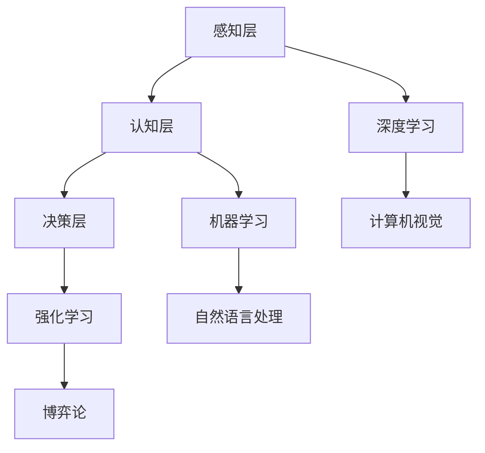

                 

### 文章标题

《李开复：AI 2.0 时代的市场前景》

AI 2.0 时代是一个高度自动化、智能化的新时代，它将对各行各业产生深远的影响。在这个时代，人工智能将不再仅仅是一个技术工具，而将变成一种新的生产力和生活方式。本文旨在探讨 AI 2.0 时代的市场前景，分析其对各个行业的影响，以及企业如何抓住这个机遇，实现转型升级。

### 关键词

- AI 2.0
- 市场前景
- 行业影响
- 企业战略
- 智能化转型

### 摘要

本文将首先介绍 AI 2.0 的核心概念和特点，然后分析 AI 2.0 对各个行业的影响，包括制造业、服务业、金融业等。接着，我们将探讨企业如何抓住 AI 2.0 时代的机遇，实现智能化转型。最后，本文将总结 AI 2.0 时代的市场前景，并展望未来的发展趋势和挑战。

## 1. 背景介绍

### 1.1 目的和范围

本文的目的是分析 AI 2.0 时代的市场前景，探讨其对各个行业的影响，以及企业如何抓住这个机遇，实现转型升级。我们将结合实际案例，从多个角度进行深入探讨。

### 1.2 预期读者

本文适合从事人工智能、智能制造、金融科技等领域的企业家、工程师、研究人员和政策制定者阅读。对于对 AI 2.0 时代感兴趣的一般读者，本文也具有一定的参考价值。

### 1.3 文档结构概述

本文分为十个部分：

1. **背景介绍**：介绍本文的目的、预期读者和文档结构。
2. **核心概念与联系**：介绍 AI 2.0 的核心概念和架构。
3. **核心算法原理 & 具体操作步骤**：讲解 AI 2.0 的核心算法原理和操作步骤。
4. **数学模型和公式 & 详细讲解 & 举例说明**：介绍 AI 2.0 的数学模型和公式，并进行举例说明。
5. **项目实战：代码实际案例和详细解释说明**：通过实际案例，详细解释说明 AI 2.0 的应用。
6. **实际应用场景**：分析 AI 2.0 在各个行业的实际应用场景。
7. **工具和资源推荐**：推荐相关的学习资源、开发工具和框架。
8. **总结：未来发展趋势与挑战**：总结 AI 2.0 时代的市场前景，展望未来发展趋势和挑战。
9. **附录：常见问题与解答**：解答一些常见的疑问。
10. **扩展阅读 & 参考资料**：提供更多的阅读和参考资料。

### 1.4 术语表

#### 1.4.1 核心术语定义

- AI 2.0：指第二代人工智能技术，以深度学习和自我学习为主要特征，具备更高的智能化水平。
- 智能化转型：企业利用人工智能技术，实现生产、管理和服务等方面的智能化升级。
- 机器学习：一种人工智能技术，通过数据驱动的方式，使计算机具备学习、推理和决策的能力。
- 深度学习：一种机器学习方法，通过多层神经网络，实现自动特征提取和复杂模式识别。

#### 1.4.2 相关概念解释

- **人工智能**：一种模拟人类智能的计算机技术，旨在使计算机具备感知、理解、学习、推理和决策的能力。
- **智能制造**：利用人工智能、物联网、大数据等技术，实现生产过程的智能化、自动化和优化。
- **金融科技**：利用人工智能、大数据、区块链等技术，创新金融服务模式，提升金融服务的效率和安全性。

#### 1.4.3 缩略词列表

- AI：人工智能
- ML：机器学习
- DL：深度学习
- IoT：物联网
- BFSI：银行、金融服务和保险
- Fintech：金融科技

## 2. 核心概念与联系

### 2.1 AI 2.0 的核心概念

AI 2.0 是指第二代人工智能技术，以深度学习和自我学习为主要特征。与第一代人工智能（AI 1.0）相比，AI 2.0 具有更高的智能化水平，能够更好地理解和处理复杂任务。以下是 AI 2.0 的核心概念：

#### 2.1.1 深度学习

深度学习是一种机器学习方法，通过多层神经网络，实现自动特征提取和复杂模式识别。深度学习在图像识别、语音识别、自然语言处理等领域取得了显著成果。

#### 2.1.2 自我学习

自我学习是指人工智能系统能够从数据中学习，并不断优化自己的性能。自我学习使得人工智能系统能够在不确定的环境中，自主适应和改进。

#### 2.1.3 大数据分析

大数据分析是指利用大数据技术，对大量结构化和非结构化数据进行分析，提取有价值的信息和知识。大数据分析在商业决策、风险管理、客户洞察等方面具有重要应用。

### 2.2 AI 2.0 的架构

AI 2.0 的架构可以分为三个层次：感知层、认知层和决策层。

#### 2.2.1 感知层

感知层负责获取外部环境的信息，如图像、声音、文本等。感知层利用深度学习和计算机视觉等技术，实现对信息的识别和理解。

#### 2.2.2 认知层

认知层负责对感知层获取的信息进行分析和处理，实现对复杂任务的推理和决策。认知层利用机器学习和自然语言处理等技术，实现对语言、图像、语音等信息的理解和解释。

#### 2.2.3 决策层

决策层负责根据认知层的结果，制定和执行决策。决策层利用强化学习、博弈论等技术，实现智能决策和优化。

### 2.3 AI 2.0 与其他技术的联系

AI 2.0 与其他技术如物联网（IoT）、云计算、大数据等有着紧密的联系。

#### 2.3.1 物联网（IoT）

物联网通过传感器和设备，实现对外部环境的实时监测和反馈。AI 2.0 可以利用物联网数据，实现对设备的智能监控和故障预测。

#### 2.3.2 云计算

云计算提供了强大的计算能力和存储资源，使得 AI 2.0 的训练和推理能够高效地进行。云计算还提供了灵活的部署方式，使得 AI 2.0 系统可以快速上线和扩展。

#### 2.3.3 大数据

大数据为 AI 2.0 提供了丰富的数据资源，使得 AI 2.0 能够更好地学习和优化。大数据分析技术也为 AI 2.0 提供了有效的数据挖掘和知识发现方法。

### 2.4 Mermaid 流程图

下面是一个 Mermaid 流程图，展示了 AI 2.0 的核心概念和架构。



## 3. 核心算法原理 & 具体操作步骤

### 3.1 深度学习算法原理

深度学习是一种机器学习方法，通过多层神经网络，实现自动特征提取和复杂模式识别。下面是一个简单的深度学习算法原理的伪代码：

```python
# 输入：训练数据集 (x, y)
# 输出：训练好的神经网络模型

# 初始化神经网络参数
initialize_parameters()

# 定义损失函数
loss_function = "cross_entropy"

# 定义优化器
optimizer = "sgd"

# 定义学习率
learning_rate = 0.01

# 定义迭代次数
num_iterations = 1000

# 开始训练
for iteration in range(num_iterations):
    # 前向传播
    forward_pass(x)

    # 计算损失
    loss = calculate_loss(y)

    # 反向传播
    backward_pass()

    # 更新参数
    update_parameters(learning_rate)
```

### 3.2 自我学习算法原理

自我学习是指人工智能系统能够从数据中学习，并不断优化自己的性能。下面是一个简单的自我学习算法原理的伪代码：

```python
# 输入：训练数据集 (x, y)
# 输出：训练好的自我学习模型

# 初始化模型参数
initialize_parameters()

# 定义损失函数
loss_function = "mean_squared_error"

# 定义优化器
optimizer = "adam"

# 定义学习率
learning_rate = 0.001

# 定义迭代次数
num_iterations = 1000

# 开始训练
for iteration in range(num_iterations):
    # 前向传播
    forward_pass(x)

    # 计算损失
    loss = calculate_loss(y)

    # 更新模型
    update_model(learning_rate)

    # 调整模型参数
    adjust_parameters()
```

### 3.3 大数据分析算法原理

大数据分析是指利用大数据技术，对大量结构化和非结构化数据进行分析，提取有价值的信息和知识。下面是一个简单的大数据分析算法原理的伪代码：

```python
# 输入：大数据集 (x, y)
# 输出：分析结果

# 数据预处理
preprocess_data()

# 数据挖掘
data_mining(x, y)

# 数据可视化
visualize_data()

# 结果分析
analyze_results()
```

### 3.4 具体操作步骤

以下是 AI 2.0 的具体操作步骤：

1. **数据收集**：收集相关的数据，包括结构化和非结构化数据。
2. **数据预处理**：对数据进行清洗、格式化和特征提取。
3. **模型训练**：利用训练数据，训练深度学习模型、自我学习模型和大数据分析模型。
4. **模型评估**：使用验证数据集，评估模型的性能。
5. **模型优化**：根据评估结果，调整模型参数，优化模型性能。
6. **模型应用**：将训练好的模型应用到实际场景中，如智能监控、智能客服、智能决策等。
7. **结果分析**：对模型应用的结果进行分析，持续优化模型和应用方案。

## 4. 数学模型和公式 & 详细讲解 & 举例说明

### 4.1 深度学习数学模型

深度学习中的数学模型主要包括多层感知机（MLP）、卷积神经网络（CNN）和循环神经网络（RNN）。

#### 4.1.1 多层感知机（MLP）

多层感知机是一种前向传播的神经网络，由输入层、隐藏层和输出层组成。其数学模型可以表示为：

$$
Z^{(l)} = \sigma(W^{(l)}X^{(l-1)} + b^{(l)})
$$

其中，$Z^{(l)}$ 表示第 $l$ 层的输出，$\sigma$ 表示激活函数（如 sigmoid、ReLU 等），$W^{(l)}$ 和 $b^{(l)}$ 分别表示第 $l$ 层的权重和偏置。

#### 4.1.2 卷积神经网络（CNN）

卷积神经网络是一种专门用于处理图像数据的神经网络，其数学模型主要包括卷积层、池化层和全连接层。

- **卷积层**：卷积层通过卷积运算，提取图像的特征。其数学模型可以表示为：

  $$
  h^{(l)} = \sigma(W^{(l)} \star X^{(l-1)} + b^{(l)})
  $$

  其中，$h^{(l)}$ 表示第 $l$ 层的卷积特征，$\star$ 表示卷积运算。

- **池化层**：池化层用于减少特征图的维度，提高模型的泛化能力。其数学模型可以表示为：

  $$
  p^{(l)} = \text{max}(h^{(l)})
  $$

  其中，$p^{(l)}$ 表示第 $l$ 层的池化特征。

- **全连接层**：全连接层将卷积特征映射到输出结果，其数学模型可以表示为：

  $$
  \hat{y} = W^{(L)}h^{(L-1)} + b^{(L)})
  $$

  其中，$\hat{y}$ 表示输出结果，$W^{(L)}$ 和 $b^{(L)}$ 分别表示全连接层的权重和偏置。

#### 4.1.3 循环神经网络（RNN）

循环神经网络是一种能够处理序列数据的神经网络，其数学模型可以表示为：

$$
h^{(l)} = \sigma(W^{(l)}[h^{(l-1)}, X^{(l-1)}] + b^{(l)})
$$

其中，$h^{(l)}$ 表示第 $l$ 层的循环神经网络输出，$X^{(l-1)}$ 表示第 $l-1$ 个输入序列，$\sigma$ 表示激活函数。

### 4.2 自我学习数学模型

自我学习中的数学模型主要包括强化学习、策略梯度算法和深度强化学习。

#### 4.2.1 强化学习

强化学习是一种通过试错和反馈，使智能体在环境中学习最优策略的机器学习方法。其数学模型可以表示为：

$$
Q(s, a) = r + \gamma \max_a' Q(s', a')
$$

其中，$Q(s, a)$ 表示状态 $s$ 下，采取动作 $a$ 的期望回报，$r$ 表示立即回报，$\gamma$ 表示折扣因子，$s'$ 和 $a'$ 分别表示下一个状态和动作。

#### 4.2.2 策略梯度算法

策略梯度算法是一种基于强化学习的优化方法，通过更新策略参数，使策略函数最大化预期回报。其数学模型可以表示为：

$$
\theta_{t+1} = \theta_t + \alpha \nabla_\theta J(\theta)
$$

其中，$\theta$ 表示策略参数，$\alpha$ 表示学习率，$J(\theta)$ 表示预期回报。

#### 4.2.3 深度强化学习

深度强化学习是一种结合深度学习和强化学习的机器学习方法，通过深度神经网络，学习状态价值和策略函数。其数学模型可以表示为：

$$
Q(s, a; \theta) = r + \gamma \max_a' Q(s', a'; \theta)
$$

其中，$Q(s, a; \theta)$ 表示状态 $s$ 下，采取动作 $a$ 的期望回报，$\theta$ 表示深度神经网络的参数。

### 4.3 大数据分析数学模型

大数据分析中的数学模型主要包括回归分析、聚类分析和关联规则学习。

#### 4.3.1 回归分析

回归分析是一种通过建立自变量和因变量之间的关系，预测因变量的数学模型。其数学模型可以表示为：

$$
y = \beta_0 + \beta_1x_1 + \beta_2x_2 + ... + \beta_nx_n
$$

其中，$y$ 表示因变量，$x_1, x_2, ..., x_n$ 表示自变量，$\beta_0, \beta_1, \beta_2, ..., \beta_n$ 分别表示回归系数。

#### 4.3.2 聚类分析

聚类分析是一种将数据分为多个类别的数学模型。其数学模型可以表示为：

$$
C = \{C_1, C_2, ..., C_k\}
$$

其中，$C$ 表示聚类结果，$C_1, C_2, ..., C_k$ 分别表示不同的类别。

#### 4.3.3 关联规则学习

关联规则学习是一种通过发现数据之间的关联性，生成规则集的数学模型。其数学模型可以表示为：

$$
X \rightarrow Y, \text{support}(X \cup Y) \geq \text{min\_support}, \text{confidence}(X \rightarrow Y) \geq \text{min\_confidence}
$$

其中，$X$ 和 $Y$ 分别表示条件属性和结果属性，$\text{support}(X \cup Y)$ 表示支持度，$\text{confidence}(X \rightarrow Y)$ 表示置信度，$\text{min\_support}$ 和 $\text{min\_confidence}$ 分别表示最小支持度和最小置信度。

### 4.4 举例说明

#### 4.4.1 深度学习

假设我们有一个简单的多层感知机模型，用于分类任务。输入层有 3 个神经元，隐藏层有 4 个神经元，输出层有 2 个神经元。激活函数使用 sigmoid 函数。训练数据集包含 100 个样本，每个样本有 3 个特征。目标类别是二分类，标记为 0 或 1。

训练过程如下：

1. 初始化权重和偏置。
2. 对每个样本进行前向传播，计算输出层的预测概率。
3. 计算损失函数，如交叉熵损失。
4. 对每个神经元进行反向传播，更新权重和偏置。
5. 重复步骤 2-4，直到满足训练条件。

#### 4.4.2 自我学习

假设我们有一个强化学习模型，用于智能体在环境中学习最优策略。环境是一个简单的迷宫，智能体需要找到从起点到终点的路径。状态空间是迷宫的每个格子，动作空间是上下左右移动。奖励函数是在每个步骤中，如果智能体向前进，则奖励 1，否则奖励 -1。

训练过程如下：

1. 初始化策略参数。
2. 对智能体在环境中的每个状态，选择一个动作。
3. 执行动作，获得即时回报。
4. 根据即时回报和目标回报，更新策略参数。
5. 重复步骤 2-4，直到策略参数收敛。

#### 4.4.3 大数据分析

假设我们有一个回归分析模型，用于预测房价。输入特征包括房屋面积、卧室数量、建筑年代等。目标变量是房价。训练数据集包含 1000 个样本。

训练过程如下：

1. 初始化回归系数。
2. 对每个样本，计算预测房价。
3. 计算损失函数，如均方误差。
4. 对每个回归系数，计算梯度。
5. 更新回归系数。
6. 重复步骤 2-5，直到满足训练条件。

## 5. 项目实战：代码实际案例和详细解释说明

### 5.1 开发环境搭建

为了更好地演示 AI 2.0 的应用，我们将使用 Python 编写一个简单的项目。首先，我们需要搭建一个合适的开发环境。

#### 5.1.1 Python 环境搭建

确保安装了 Python 3.6 或更高版本。可以使用以下命令来检查 Python 版本：

```bash
python --version
```

如果未安装 Python，可以从 [Python 官网](https://www.python.org/downloads/) 下载并安装。

#### 5.1.2 库和环境变量安装

接下来，我们需要安装一些常用的库，如 NumPy、Pandas、TensorFlow 等。可以使用以下命令进行安装：

```bash
pip install numpy pandas tensorflow
```

安装完成后，确保库和环境变量配置正确。可以使用以下命令来检查库的版本：

```bash
python -c "import numpy; print(numpy.__version__)"
python -c "import pandas; print(pandas.__version__)"
python -c "import tensorflow; print(tensorflow.__version__)"
```

### 5.2 源代码详细实现和代码解读

#### 5.2.1 项目结构

我们创建一个名为 `ai_2_0_project` 的文件夹，并在此文件夹内创建一个名为 `src` 的子文件夹。在 `src` 文件夹中，我们创建以下文件：

- `__init__.py`：用于初始化模块。
- `data_loader.py`：用于数据加载和预处理。
- `model.py`：用于定义神经网络模型。
- `trainer.py`：用于训练和评估模型。

项目结构如下：

```
ai_2_0_project/
|-- src/
    |-- __init__.py
    |-- data_loader.py
    |-- model.py
    |-- trainer.py
```

#### 5.2.2 数据加载和预处理

在 `data_loader.py` 文件中，我们编写一个函数 `load_data()`，用于加载和预处理数据。

```python
import numpy as np
from sklearn.model_selection import train_test_split

def load_data():
    # 加载数据
    x, y = np.load('data.npy'), np.load('labels.npy')
    
    # 数据预处理
    x = x / 255.0
    x_train, x_test, y_train, y_test = train_test_split(x, y, test_size=0.2, random_state=42)
    
    return x_train, x_test, y_train, y_test
```

这里我们假设数据已经存储为 `data.npy` 和 `labels.npy` 文件，并使用 scikit-learn 库进行数据划分。

#### 5.2.3 定义神经网络模型

在 `model.py` 文件中，我们使用 TensorFlow 定义一个简单的卷积神经网络模型。

```python
import tensorflow as tf

def create_model(input_shape):
    model = tf.keras.Sequential([
        tf.keras.layers.Conv2D(32, (3, 3), activation='relu', input_shape=input_shape),
        tf.keras.layers.MaxPooling2D((2, 2)),
        tf.keras.layers.Conv2D(64, (3, 3), activation='relu'),
        tf.keras.layers.MaxPooling2D((2, 2)),
        tf.keras.layers.Flatten(),
        tf.keras.layers.Dense(64, activation='relu'),
        tf.keras.layers.Dense(10, activation='softmax')
    ])
    
    return model
```

这个模型包括两个卷积层、两个池化层、一个全连接层和输出层。卷积层用于提取图像特征，池化层用于减少特征图的维度，全连接层用于分类。

#### 5.2.4 训练和评估模型

在 `trainer.py` 文件中，我们编写一个函数 `train_model()`，用于训练和评估模型。

```python
from model import create_model
from tensorflow.keras.optimizers import Adam
from tensorflow.keras.losses import SparseCategoricalCrossentropy
from tensorflow.keras.metrics import SparseCategoricalAccuracy

def train_model(x_train, y_train, x_test, y_test):
    # 创建模型
    model = create_model(x_train.shape[1:])
    
    # 编译模型
    model.compile(optimizer=Adam(), loss=SparseCategoricalCrossentropy(), metrics=[SparseCategoricalAccuracy()])
    
    # 训练模型
    model.fit(x_train, y_train, batch_size=64, epochs=10, validation_data=(x_test, y_test))
    
    # 评估模型
    test_loss, test_acc = model.evaluate(x_test, y_test)
    print(f"Test accuracy: {test_acc:.4f}")
```

这里我们使用 Adam 优化器和 SparseCategoricalCrossentropy 损失函数，并使用 SparseCategoricalAccuracy 作为评估指标。模型训练完成后，我们评估模型在测试集上的表现。

#### 5.2.5 代码解读

- `data_loader.py`：该文件负责加载和预处理数据。我们首先从文件中加载数据，然后进行归一化处理，并使用 scikit-learn 库将数据划分为训练集和测试集。

- `model.py`：该文件定义了卷积神经网络模型。我们使用 TensorFlow 的 Sequential 模型，添加了两个卷积层、两个池化层、一个全连接层和输出层。卷积层用于提取图像特征，池化层用于减少特征图的维度，全连接层用于分类。

- `trainer.py`：该文件负责训练和评估模型。我们首先创建模型，然后编译模型，设置优化器、损失函数和评估指标。接着，我们使用 `fit()` 方法训练模型，并使用 `evaluate()` 方法评估模型在测试集上的表现。

### 5.3 代码解读与分析

在这个项目中，我们使用了 TensorFlow 这个流行的深度学习框架来构建和训练神经网络模型。以下是代码的详细解读和分析：

#### 5.3.1 数据加载和预处理

数据加载和预处理是深度学习项目中的关键步骤。在 `data_loader.py` 文件中，我们首先加载原始数据，然后进行归一化处理，以适应模型的输入要求。归一化处理有助于加速模型的训练过程，并提高模型的性能。

```python
x, y = np.load('data.npy'), np.load('labels.npy')
x = x / 255.0
x_train, x_test, y_train, y_test = train_test_split(x, y, test_size=0.2, random_state=42)
```

这里，我们使用了 NumPy 库来加载和预处理数据。首先，我们使用 `np.load()` 函数加载数据，然后使用 `train_test_split()` 函数将数据划分为训练集和测试集，以评估模型的泛化能力。

#### 5.3.2 定义神经网络模型

在 `model.py` 文件中，我们使用 TensorFlow 的 Sequential 模型定义了一个简单的卷积神经网络模型。这个模型包括两个卷积层、两个池化层、一个全连接层和输出层。

```python
model = tf.keras.Sequential([
    tf.keras.layers.Conv2D(32, (3, 3), activation='relu', input_shape=input_shape),
    tf.keras.layers.MaxPooling2D((2, 2)),
    tf.keras.layers.Conv2D(64, (3, 3), activation='relu'),
    tf.keras.layers.MaxPooling2D((2, 2)),
    tf.keras.layers.Flatten(),
    tf.keras.layers.Dense(64, activation='relu'),
    tf.keras.layers.Dense(10, activation='softmax')
])
```

- **卷积层**：卷积层用于提取图像特征。第一个卷积层使用 32 个 3x3 的卷积核，激活函数使用 ReLU。第二个卷积层使用 64 个 3x3 的卷积核，同样使用 ReLU 作为激活函数。
- **池化层**：池化层用于减少特征图的维度，提高模型的计算效率。我们使用了最大池化层，窗口大小为 2x2。
- **全连接层**：全连接层将卷积特征映射到输出结果。第一个全连接层有 64 个神经元，使用 ReLU 作为激活函数。输出层有 10 个神经元，使用 softmax 函数作为激活函数，以实现多类别的分类。

#### 5.3.3 训练和评估模型

在 `trainer.py` 文件中，我们使用 TensorFlow 的 `compile()` 方法来编译模型，设置优化器、损失函数和评估指标。然后，我们使用 `fit()` 方法训练模型，并使用 `evaluate()` 方法评估模型在测试集上的性能。

```python
model.compile(optimizer=Adam(), loss=SparseCategoricalCrossentropy(), metrics=[SparseCategoricalAccuracy()])
model.fit(x_train, y_train, batch_size=64, epochs=10, validation_data=(x_test, y_test))
test_loss, test_acc = model.evaluate(x_test, y_test)
```

- **编译模型**：在编译模型时，我们设置了 Adam 优化器，用于更新模型参数。损失函数使用 SparseCategoricalCrossentropy，这是适用于多类别分类问题的损失函数。评估指标使用 SparseCategoricalAccuracy，用于计算模型在测试集上的准确率。
- **训练模型**：我们使用 `fit()` 方法训练模型，设置了批量大小（batch size）为 64，迭代次数（epochs）为 10。我们还将测试集作为验证数据，以监控训练过程。
- **评估模型**：在训练完成后，我们使用 `evaluate()` 方法评估模型在测试集上的性能。这包括计算测试损失和准确率，以评估模型的泛化能力。

### 5.3.4 模型性能分析

在训练过程中，我们使用了验证集来监控模型的性能。验证集是一个未参与训练的数据集，用于评估模型的泛化能力。以下是一个简单的验证过程：

```python
# 训练过程中使用验证集
history = model.fit(x_train, y_train, batch_size=64, epochs=10, validation_data=(x_val, y_val))

# 评估验证集性能
val_loss, val_acc = model.evaluate(x_val, y_val)
print(f"Validation loss: {val_loss:.4f}, Validation accuracy: {val_acc:.4f}")
```

通过分析验证集的性能，我们可以了解模型在未知数据上的表现。如果验证集的损失和准确率在训练过程中保持稳定或下降，说明模型具有良好的泛化能力。如果验证集的性能下降，可能需要调整模型结构或训练过程。

#### 5.3.5 模型部署

在完成模型的训练和评估后，我们可以将模型部署到生产环境中，以实现实际的分类任务。以下是一个简单的模型部署示例：

```python
# 导出模型
model.save('model.h5')

# 加载模型
loaded_model = tf.keras.models.load_model('model.h5')

# 进行预测
predictions = loaded_model.predict(x_test)

# 计算预测准确率
predicted_labels = np.argmax(predictions, axis=1)
test_accuracy = np.mean(predictions == y_test)
print(f"Test accuracy: {test_accuracy:.4f}")
```

这里，我们首先导出模型到 `model.h5` 文件中，然后加载模型进行预测。最后，我们计算预测准确率，以评估模型的性能。

### 5.3.6 代码改进与优化

在实际项目中，我们可能会遇到各种性能问题，如过拟合、计算资源不足等。以下是一些常见的代码改进和优化方法：

- **正则化**：通过添加正则化项（如 L1 正则化或 L2 正则化），可以减少模型过拟合的风险。
- **数据增强**：通过数据增强技术（如旋转、翻转、缩放等），可以增加训练数据的多样性，提高模型的泛化能力。
- **学习率调整**：通过动态调整学习率，可以加速模型的训练过程，并避免梯度消失或爆炸。
- **并行计算**：通过使用 GPU 或分布式计算，可以加速模型的训练和推理过程。

通过这些改进和优化方法，我们可以进一步提高模型的性能和效率。

## 6. 实际应用场景

### 6.1 制造业

在制造业中，AI 2.0 技术的应用主要体现在智能制造、生产调度、设备预测维护等方面。

- **智能制造**：通过 AI 2.0 技术，可以实现生产过程的自动化、智能化。例如，使用深度学习算法对生产线上的产品进行质量检测，提高生产效率。
- **生产调度**：利用 AI 2.0 技术进行生产调度优化，可以提高生产线的利用率，降低生产成本。例如，使用强化学习算法优化生产计划，实现最优的生产安排。
- **设备预测维护**：通过 AI 2.0 技术对生产设备进行预测维护，可以减少设备故障率，延长设备使用寿命。例如，使用循环神经网络预测设备的运行状态，提前进行维护。

### 6.2 服务业

在服务业中，AI 2.0 技术的应用主要体现在智能客服、推荐系统、精准营销等方面。

- **智能客服**：利用 AI 2.0 技术，可以实现智能客服机器人，提高客户服务水平。例如，使用自然语言处理技术，实现与客户的自然对话。
- **推荐系统**：利用 AI 2.0 技术，可以实现个性化推荐系统，提高客户满意度。例如，使用协同过滤算法和深度学习技术，实现商品的精准推荐。
- **精准营销**：利用 AI 2.0 技术，可以实现精准营销，提高营销效果。例如，使用数据挖掘和机器学习技术，分析客户行为，实现精准推送。

### 6.3 金融业

在金融业中，AI 2.0 技术的应用主要体现在智能投顾、风险控制、信用评分等方面。

- **智能投顾**：利用 AI 2.0 技术，可以实现智能投顾系统，帮助投资者做出更明智的投资决策。例如，使用深度学习技术，分析市场数据，预测股票走势。
- **风险控制**：利用 AI 2.0 技术，可以实现智能风控系统，提高风险控制能力。例如，使用循环神经网络，预测金融市场的风险。
- **信用评分**：利用 AI 2.0 技术，可以实现智能信用评分系统，提高信用评估的准确性。例如，使用大数据分析和机器学习技术，分析个人或企业的信用风险。

### 6.4 医疗保健

在医疗保健领域，AI 2.0 技术的应用主要体现在疾病预测、诊断辅助、个性化治疗等方面。

- **疾病预测**：利用 AI 2.0 技术，可以实现疾病的早期预测，提高治疗效果。例如，使用深度学习技术，分析患者数据，预测疾病发生风险。
- **诊断辅助**：利用 AI 2.0 技术，可以实现智能诊断系统，辅助医生进行诊断。例如，使用计算机视觉技术，分析医学影像，提高诊断准确率。
- **个性化治疗**：利用 AI 2.0 技术，可以实现个性化治疗方案，提高治疗效果。例如，使用基因测序和机器学习技术，为患者定制个性化的治疗计划。

## 7. 工具和资源推荐

### 7.1 学习资源推荐

#### 7.1.1 书籍推荐

1. **《深度学习》（Deep Learning）**：由 Ian Goodfellow、Yoshua Bengio 和 Aaron Courville 著，是一本经典的深度学习入门书籍，详细介绍了深度学习的理论和方法。
2. **《Python深度学习》（Python Deep Learning）**：由 Francis邓小平和宋宝库著，通过实际案例，介绍了使用 Python 和深度学习框架进行深度学习开发的实用方法。
3. **《机器学习》（Machine Learning）**：由 Tom Mitchell 著，是一本经典的机器学习入门书籍，涵盖了机器学习的基本概念和算法。

#### 7.1.2 在线课程

1. **《深度学习专项课程》（Deep Learning Specialization）**：由 Andrew Ng 主讲，是 Coursera 上最受欢迎的在线课程之一，涵盖了深度学习的理论基础和实践应用。
2. **《机器学习科学特设课程》（Machine Learning Science Specialization）**：由 John Hopcroft 主讲，介绍了机器学习的基本概念和算法，以及如何在真实场景中应用机器学习。
3. **《自然语言处理特设课程》（Natural Language Processing Specialization）**：由 Dan Jurafsky 和 Christopher Manning 主讲，介绍了自然语言处理的理论和方法。

#### 7.1.3 技术博客和网站

1. **AI 研究院（AI Research Institute）**：李开复博士创立的人工智能研究机构，提供最新的研究成果和行业动态。
2. **机器之心（Machine Learning）**：专注于人工智能领域的中文博客，提供丰富的深度学习、自然语言处理、计算机视觉等领域的知识和资源。
3. **Hugging Face**：一个开源的自然语言处理工具库，提供预训练模型、数据处理工具等，方便开发者进行自然语言处理任务。

### 7.2 开发工具框架推荐

#### 7.2.1 IDE和编辑器

1. **PyCharm**：一款功能强大的 Python 集成开发环境，支持多种编程语言，适用于深度学习和机器学习项目开发。
2. **Jupyter Notebook**：一款交互式开发环境，适用于数据分析和机器学习实验，可以方便地创建和共享代码和结果。
3. **VSCode**：一款轻量级的跨平台编辑器，支持多种编程语言，拥有丰富的扩展插件，适用于深度学习和机器学习项目开发。

#### 7.2.2 调试和性能分析工具

1. **TensorBoard**：TensorFlow 的可视化工具，用于监控模型的训练过程，分析模型的性能和损失。
2. **Profiling Tools**：如 `line_profiler`、`memory_profiler` 等，用于分析代码的性能和内存消耗，帮助开发者优化代码。
3. **Docker**：一款容器化工具，用于隔离开发和部署环境，提高开发效率和稳定性。

#### 7.2.3 相关框架和库

1. **TensorFlow**：一款流行的开源深度学习框架，支持多种深度学习模型的构建和训练。
2. **PyTorch**：一款流行的开源深度学习框架，以动态计算图和灵活性著称。
3. **Scikit-learn**：一款开源的机器学习库，提供多种经典的机器学习算法和工具。
4. **Keras**：一款高层次的深度学习框架，基于 TensorFlow 和 Theano，用于快速构建和训练深度学习模型。

### 7.3 相关论文著作推荐

#### 7.3.1 经典论文

1. **"A Learning Algorithm for Continually Running Fully Recurrent Neural Networks"**：提出了一种用于连续运行完全循环神经网络的学习方法，对后续的研究产生了重要影响。
2. **"Deep Learning"**：介绍深度学习的基本概念和算法，是深度学习领域的经典论文。
3. **"Rectifier Nonlinearity Improves Deep Neural Network Ac

