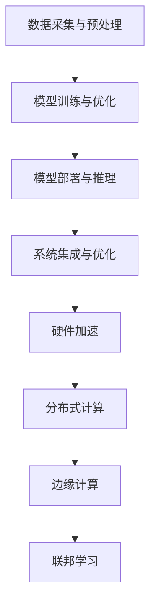

                 

# 李开复：AI 2.0 时代的应用

> **关键词**：人工智能，AI 2.0，应用，技术趋势，算法，深度学习，自动化，产业革命

> **摘要**：本文将深入探讨人工智能（AI）2.0时代的到来及其在各领域的广泛应用。通过剖析AI 2.0的核心概念和技术原理，我们将一步步理解其在现实世界中的具体应用，并展望其未来的发展趋势与挑战。本文旨在为读者提供全面的技术视角，帮助理解AI 2.0时代的技术革命及其带来的深远影响。

## 1. 背景介绍

### 1.1 目的和范围

本文的目标是探讨人工智能2.0时代的到来及其在各领域的广泛应用。我们希望通过深入分析AI 2.0的核心概念和技术原理，让读者能够理解其在现实世界中的具体应用，并展望其未来的发展趋势与挑战。本文的范围将涵盖AI 2.0的技术原理、算法、应用场景以及相关的工具和资源推荐。

### 1.2 预期读者

本文适合对人工智能有一定了解的技术爱好者、程序员、数据科学家以及相关领域的专业人士。通过本文的阅读，读者将能够对AI 2.0有更深入的理解，并掌握其在实际应用中的关键技术和方法。

### 1.3 文档结构概述

本文分为以下几个部分：

1. 背景介绍：介绍本文的目的、预期读者和文档结构。
2. 核心概念与联系：详细阐述AI 2.0的核心概念及其技术原理。
3. 核心算法原理 & 具体操作步骤：讲解AI 2.0的核心算法及其操作步骤。
4. 数学模型和公式 & 详细讲解 & 举例说明：介绍AI 2.0的数学模型和公式，并进行详细讲解和举例说明。
5. 项目实战：提供实际代码案例，进行详细解释和代码解读。
6. 实际应用场景：分析AI 2.0在各领域的应用场景。
7. 工具和资源推荐：推荐相关的学习资源和开发工具。
8. 总结：总结AI 2.0的未来发展趋势与挑战。
9. 附录：常见问题与解答。
10. 扩展阅读 & 参考资料：提供进一步的阅读资料和参考资源。

### 1.4 术语表

#### 1.4.1 核心术语定义

- **人工智能（AI）**：指由计算机实现的智能系统，能够模拟、延伸和扩展人类的智能行为。
- **AI 2.0**：相对于早期的AI 1.0，AI 2.0强调深度学习和自动化，能够实现更高水平的智能。
- **深度学习**：一种机器学习技术，通过多层神经网络进行训练，模拟人脑的信息处理方式。
- **自动化**：通过计算机程序和算法实现任务自动化，减少人工干预。

#### 1.4.2 相关概念解释

- **神经网络**：由大量神经元组成的计算模型，能够通过学习数据实现复杂函数的拟合。
- **大数据**：指大规模、多样性和高速增长的数据集，能够为AI算法提供丰富的训练数据。
- **算法**：实现特定功能的计算步骤和规则集合，是AI的核心组成部分。
- **机器学习**：一种让计算机通过数据学习并做出预测或决策的技术。

#### 1.4.3 缩略词列表

- **AI**：人工智能
- **ML**：机器学习
- **DL**：深度学习
- **GPU**：图形处理器
- **CPU**：中央处理器

## 2. 核心概念与联系

在探讨AI 2.0的核心概念之前，我们需要先了解其与AI 1.0的区别。AI 1.0时代主要依赖于知识表示和推理，通过定义明确的规则和逻辑来实现智能。而AI 2.0时代则强调深度学习和自动化，通过学习大量数据并自动调整模型参数，实现更高水平的智能。

### 2.1 AI 2.0的核心概念

AI 2.0的核心概念包括：

1. **深度学习**：深度学习是一种基于多层神经网络的机器学习技术，通过逐层提取数据特征，实现复杂函数的拟合。深度学习的成功得益于大数据和高性能计算的发展。
2. **自动化**：自动化是指通过计算机程序和算法实现任务自动化，减少人工干预。在AI 2.0时代，自动化技术使得AI系统能够在更广泛的场景中发挥作用。
3. **多模态学习**：多模态学习是指通过结合不同类型的数据（如文本、图像、声音等），实现更全面和准确的信息处理。多模态学习是AI 2.0时代的重要研究方向。

### 2.2 AI 2.0的技术原理

AI 2.0的技术原理主要包括：

1. **神经网络**：神经网络是深度学习的基础，通过大量神经元之间的连接和权重调整，实现复杂函数的拟合。
2. **反向传播算法**：反向传播算法是深度学习训练的核心算法，通过逐层计算梯度并反向传播，调整神经元权重，实现模型的优化。
3. **卷积神经网络（CNN）**：卷积神经网络是处理图像数据的一种常见神经网络结构，通过卷积和池化操作，实现图像特征的提取和分类。
4. **递归神经网络（RNN）**：递归神经网络是处理序列数据的一种常见神经网络结构，通过递归连接和隐藏状态，实现序列数据的建模和预测。

### 2.3 AI 2.0的应用架构

AI 2.0的应用架构主要包括以下几个层次：

1. **数据采集与预处理**：数据采集与预处理是AI应用的基础，通过收集和清洗数据，为模型训练提供高质量的数据集。
2. **模型训练与优化**：模型训练与优化是AI应用的核心，通过选择合适的模型和训练算法，调整模型参数，实现模型的优化和泛化。
3. **模型部署与推理**：模型部署与推理是将训练好的模型应用到实际场景中的关键步骤，通过部署和推理，实现AI系统的自动化和智能化。
4. **系统集成与优化**：系统集成与优化是AI应用的全过程，通过整合不同的技术和组件，实现AI系统的协同工作和性能优化。

### 2.4 AI 2.0的技术趋势

AI 2.0的技术趋势主要包括：

1. **硬件加速**：随着深度学习模型的复杂度和规模不断增大，硬件加速（如GPU、TPU等）成为提高训练和推理效率的关键。
2. **分布式计算**：分布式计算是应对大规模数据和高并发需求的有效手段，通过分布式计算架构，实现AI系统的弹性扩展和高效处理。
3. **边缘计算**：边缘计算是将计算和存储能力从云端转移到网络边缘的一种技术，通过边缘计算，实现实时数据处理和智能决策。
4. **联邦学习**：联邦学习是一种在保持数据隐私的同时，实现分布式模型训练的技术，通过联邦学习，实现大规模数据的安全协作。

### 2.5 Mermaid 流程图



通过上述流程图，我们可以看到AI 2.0的应用架构及其技术趋势之间的联系。这些核心概念和联系为我们理解和应用AI 2.0奠定了基础。

## 3. 核心算法原理 & 具体操作步骤

在AI 2.0时代，核心算法的原理和操作步骤是实现智能化应用的关键。以下我们将详细介绍几种核心算法的原理，并给出具体的操作步骤。

### 3.1 深度学习算法原理

深度学习算法是AI 2.0时代的核心，其原理基于多层神经网络。下面以卷积神经网络（CNN）为例，介绍其原理和操作步骤。

#### 3.1.1 卷积神经网络（CNN）原理

卷积神经网络是一种专门用于处理图像数据的神经网络结构，其基本原理是通过卷积和池化操作，逐层提取图像特征，实现图像的分类和识别。

1. **卷积层**：卷积层是CNN的核心层，通过卷积操作提取图像的局部特征。卷积操作是将卷积核（一组可学习的滤波器）与图像进行卷积，生成特征图。卷积核的参数（如尺寸、步长和填充方式）会影响特征图的生成。
2. **池化层**：池化层用于对特征图进行降维处理，减少参数数量，提高模型的泛化能力。常见的池化操作包括最大池化和平均池化。
3. **激活函数**：激活函数用于引入非线性特性，使模型能够拟合复杂函数。常用的激活函数包括ReLU函数、Sigmoid函数和Tanh函数。
4. **全连接层**：全连接层将前一层的特征图映射到输出层，实现分类或回归任务。全连接层的权重和偏置需要通过反向传播算法进行优化。

#### 3.1.2 深度学习算法操作步骤

以下是一个基于CNN的深度学习算法的基本操作步骤：

1. **数据预处理**：对图像数据进行标准化、归一化等预处理操作，使其符合模型的输入要求。
2. **模型构建**：使用深度学习框架（如TensorFlow、PyTorch等）构建CNN模型，定义网络结构、层参数和损失函数。
3. **模型训练**：将预处理后的图像数据输入模型，通过反向传播算法优化模型参数，使模型能够拟合训练数据。
4. **模型评估**：使用验证数据集对模型进行评估，计算模型的准确率、召回率等指标，判断模型的泛化能力。
5. **模型部署**：将训练好的模型部署到实际应用场景中，进行图像分类或识别任务。

### 3.2 递归神经网络（RNN）算法原理

递归神经网络（RNN）是一种专门用于处理序列数据的神经网络结构，其基本原理是通过递归连接和隐藏状态，实现序列数据的建模和预测。

1. **隐藏状态**：RNN的隐藏状态用于存储序列的历史信息，通过递归连接将前一时刻的隐藏状态传递到下一时刻。
2. **输入门、遗忘门和输出门**：RNN的输入门、遗忘门和输出门用于调节隐藏状态的信息流动，实现序列数据的建模和预测。
3. **激活函数**：与CNN类似，RNN也使用激活函数引入非线性特性。

#### 3.2.2 递归神经网络算法操作步骤

以下是一个基于RNN的深度学习算法的基本操作步骤：

1. **数据预处理**：对序列数据进行标准化、归一化等预处理操作，使其符合模型的输入要求。
2. **模型构建**：使用深度学习框架（如TensorFlow、PyTorch等）构建RNN模型，定义网络结构、层参数和损失函数。
3. **模型训练**：将预处理后的序列数据输入模型，通过反向传播算法优化模型参数，使模型能够拟合训练数据。
4. **模型评估**：使用验证数据集对模型进行评估，计算模型的准确率、召回率等指标，判断模型的泛化能力。
5. **模型部署**：将训练好的模型部署到实际应用场景中，进行序列数据的建模和预测任务。

### 3.3 强化学习算法原理

强化学习是一种通过试错和奖励反馈进行学习的机器学习技术，其基本原理是基于策略搜索和价值搜索。

1. **策略搜索**：策略搜索是指通过探索和评估不同的动作策略，找到最优策略。常见的策略搜索算法包括epsilon-greedy算法、Q-learning算法和深度Q网络（DQN）。
2. **价值搜索**：价值搜索是指通过评估状态和动作的价值，找到最优状态-动作对。常见价值搜索算法包括值迭代算法、策略迭代算法和深度确定性策略梯度（DDPG）。

#### 3.3.2 强化学习算法操作步骤

以下是一个基于强化学习的深度学习算法的基本操作步骤：

1. **数据预处理**：对环境状态、动作和奖励进行预处理，使其符合模型的输入要求。
2. **模型构建**：使用深度学习框架（如TensorFlow、PyTorch等）构建强化学习模型，定义网络结构、层参数和损失函数。
3. **模型训练**：将预处理后的环境状态、动作和奖励数据输入模型，通过反向传播算法优化模型参数，使模型能够拟合训练数据。
4. **模型评估**：使用测试环境对模型进行评估，计算模型的表现指标，如平均奖励、胜率等。
5. **模型部署**：将训练好的模型部署到实际应用场景中，进行智能决策和优化。

通过上述核心算法原理和具体操作步骤的介绍，我们可以看到AI 2.0时代的核心算法在实现智能化应用中的重要作用。这些算法不仅为我们提供了强大的计算能力，也为实际应用场景提供了丰富的解决方案。

## 4. 数学模型和公式 & 详细讲解 & 举例说明

在AI 2.0时代，数学模型和公式是理解和实现智能算法的关键。以下我们将详细讲解几种核心数学模型和公式，并通过具体例子进行说明。

### 4.1 深度学习中的损失函数

在深度学习中，损失函数用于衡量模型预测值与真实值之间的差异，并指导模型参数的优化。以下介绍几种常见的损失函数：

#### 4.1.1 交叉熵损失函数

交叉熵损失函数（Cross-Entropy Loss）是分类问题中最常用的损失函数。其公式如下：

$$
L = -\sum_{i=1}^{n} y_i \log(p_i)
$$

其中，$y_i$ 是真实标签，$p_i$ 是模型预测的概率分布。

**例子**：假设我们有一个二元分类问题，真实标签为 [0, 1]，模型预测的概率分布为 [0.2, 0.8]。则交叉熵损失函数的计算如下：

$$
L = -(0 \cdot \log(0.2) + 1 \cdot \log(0.8)) \approx 0.386
$$

#### 4.1.2 均方误差损失函数

均方误差损失函数（Mean Squared Error, MSE）是回归问题中最常用的损失函数。其公式如下：

$$
L = \frac{1}{2} \sum_{i=1}^{n} (y_i - \hat{y}_i)^2
$$

其中，$y_i$ 是真实值，$\hat{y}_i$ 是模型预测值。

**例子**：假设我们有一个回归问题，真实值为 [2, 3]，模型预测值为 [2.1, 2.9]。则均方误差损失函数的计算如下：

$$
L = \frac{1}{2} \left( (2 - 2.1)^2 + (3 - 2.9)^2 \right) = 0.05
$$

### 4.2 深度学习中的优化算法

在深度学习中，优化算法用于调整模型参数，使损失函数最小化。以下介绍几种常见的优化算法：

#### 4.2.1 随机梯度下降（SGD）

随机梯度下降（Stochastic Gradient Descent, SGD）是一种简单的优化算法，其公式如下：

$$
\theta_{t+1} = \theta_t - \alpha \cdot \nabla_{\theta}L(\theta_t)
$$

其中，$\theta_t$ 是第 $t$ 次迭代的参数，$\alpha$ 是学习率，$\nabla_{\theta}L(\theta_t)$ 是损失函数关于参数的梯度。

**例子**：假设我们有一个线性回归问题，损失函数为 $L(\theta) = \frac{1}{2}(y - \theta x)^2$，学习率为 $\alpha = 0.01$。第 $t$ 次迭代的参数更新如下：

$$
\theta_{t+1} = \theta_t - 0.01 \cdot \nabla_{\theta}L(\theta_t) = \theta_t - 0.01 \cdot (y - \theta_t x)
$$

#### 4.2.2 动量法（Momentum）

动量法（Momentum）是SGD的一个改进，通过引入动量项，加速梯度下降。其公式如下：

$$
v_t = \beta v_{t-1} + (1 - \beta) \nabla_{\theta}L(\theta_t)
$$

$$
\theta_{t+1} = \theta_t - v_t
$$

其中，$v_t$ 是动量项，$\beta$ 是动量系数。

**例子**：假设我们有一个线性回归问题，损失函数为 $L(\theta) = \frac{1}{2}(y - \theta x)^2$，学习率为 $\alpha = 0.01$，动量系数 $\beta = 0.9$。第 $t$ 次迭代的参数更新如下：

$$
v_t = 0.9 v_{t-1} + 0.01 \cdot (y - \theta_t x)
$$

$$
\theta_{t+1} = \theta_t - v_t
$$

通过上述数学模型和公式的讲解，我们可以看到深度学习在算法实现中的关键作用。这些数学模型和公式不仅为我们提供了理论支持，也为实际应用提供了可靠的工具。

## 5. 项目实战：代码实际案例和详细解释说明

为了更好地理解AI 2.0时代的算法和应用，我们将通过一个实际项目来演示代码的实现过程，并进行详细解释和代码解读。

### 5.1 开发环境搭建

在开始项目实战之前，我们需要搭建一个适合深度学习的开发环境。以下是搭建环境的步骤：

1. **安装Python**：首先，我们需要安装Python 3.7及以上版本。可以在Python官方网站下载并安装。
2. **安装深度学习框架**：我们选择TensorFlow作为深度学习框架。可以使用pip命令安装：

   ```
   pip install tensorflow
   ```

3. **安装必要的库**：为了方便后续开发，我们可以安装一些常用的Python库，如NumPy、Pandas等：

   ```
   pip install numpy pandas
   ```

4. **配置GPU支持**：如果我们的计算机配备了GPU，我们需要安装CUDA和cuDNN，以支持GPU加速。具体安装步骤可以参考TensorFlow官方文档。

完成以上步骤后，我们的开发环境就搭建完成了。

### 5.2 源代码详细实现和代码解读

以下是一个基于卷积神经网络的图像分类项目的源代码实现，我们将对代码进行详细解读。

```python
import tensorflow as tf
from tensorflow.keras import layers
import numpy as np

# 定义卷积神经网络模型
model = tf.keras.Sequential([
    layers.Conv2D(32, (3, 3), activation='relu', input_shape=(28, 28, 1)),
    layers.MaxPooling2D((2, 2)),
    layers.Conv2D(64, (3, 3), activation='relu'),
    layers.MaxPooling2D((2, 2)),
    layers.Conv2D(64, (3, 3), activation='relu'),
    layers.Flatten(),
    layers.Dense(64, activation='relu'),
    layers.Dense(10, activation='softmax')
])

# 编译模型
model.compile(optimizer='adam',
              loss='categorical_crossentropy',
              metrics=['accuracy'])

# 加载MNIST数据集
mnist = tf.keras.datasets.mnist
(x_train, y_train), (x_test, y_test) = mnist.load_data()

# 预处理数据
x_train = x_train.astype('float32') / 255
x_test = x_test.astype('float32') / 255
x_train = np.expand_dims(x_train, -1)
x_test = np.expand_dims(x_test, -1)

# 将标签转换为one-hot编码
y_train = tf.keras.utils.to_categorical(y_train, 10)
y_test = tf.keras.utils.to_categorical(y_test, 10)

# 训练模型
model.fit(x_train, y_train, epochs=10, batch_size=32, validation_split=0.2)

# 评估模型
model.evaluate(x_test, y_test, verbose=2)
```

**代码解读**：

1. **导入库**：首先，我们导入TensorFlow和NumPy库，用于构建和训练模型。
2. **定义模型**：使用`tf.keras.Sequential`类定义卷积神经网络模型，包括卷积层、池化层和全连接层。卷积层使用`layers.Conv2D`类，定义卷积核大小、激活函数等参数；池化层使用`layers.MaxPooling2D`类，定义池化窗口大小；全连接层使用`layers.Dense`类，定义输出层的大小和激活函数。
3. **编译模型**：使用`model.compile`方法编译模型，指定优化器、损失函数和评价指标。
4. **加载数据集**：我们使用TensorFlow自带的MNIST数据集进行训练和测试。数据集包含70,000个训练样本和10,000个测试样本，每个样本都是一个28x28的灰度图像，标签为0-9之间的整数。
5. **预处理数据**：将图像数据转换为浮点型并归一化，使其在0到1之间。同时，将标签转换为one-hot编码，便于模型处理。
6. **训练模型**：使用`model.fit`方法训练模型，指定训练轮数、批量大小和验证数据集。
7. **评估模型**：使用`model.evaluate`方法评估模型在测试数据集上的表现。

通过上述代码，我们可以看到如何使用TensorFlow构建、训练和评估一个简单的卷积神经网络模型。这个项目为我们提供了一个实际的案例，帮助我们理解和应用AI 2.0时代的深度学习技术。

### 5.3 代码解读与分析

在上述代码中，我们使用TensorFlow构建了一个简单的卷积神经网络模型，用于对MNIST数据集中的手写数字进行分类。以下是对代码的进一步解读和分析：

1. **模型结构**：卷积神经网络模型由五个卷积层、两个池化层和一个全连接层组成。卷积层用于提取图像特征，池化层用于降低特征图的维度，全连接层用于进行分类。
2. **卷积层**：第一个卷积层使用32个3x3的卷积核，激活函数为ReLU。ReLU函数引入非线性特性，使模型能够拟合复杂函数。后续的卷积层使用64个3x3的卷积核，继续提取更高级的特征。
3. **池化层**：两个池化层分别使用2x2的窗口进行最大池化，降低特征图的维度，减少参数数量，提高模型的泛化能力。
4. **全连接层**：最后一个全连接层使用64个神经元进行特征融合，输出层使用10个神经元进行分类，激活函数为softmax。softmax函数用于将特征映射到概率分布，实现多分类任务。
5. **损失函数和优化器**：模型使用交叉熵损失函数和Adam优化器进行训练。交叉熵损失函数适用于分类任务，能够衡量模型预测值与真实值之间的差异。Adam优化器是一种自适应优化算法，能够加速收敛。
6. **数据预处理**：MNIST数据集的图像像素值范围为0-255，我们需要将其转换为0-1之间的小数值。此外，由于图像是灰度图，我们需要将其扩展到三个通道（即RGB通道）。标签也需要转换为one-hot编码，以便模型处理。
7. **训练过程**：模型使用批量大小为32的训练数据集进行训练，训练轮数为10。在每次迭代中，模型会更新参数，并计算损失函数的梯度。通过反向传播算法，模型能够逐步优化参数，提高分类准确率。
8. **评估过程**：在训练完成后，我们使用测试数据集评估模型的表现。通过计算交叉熵损失函数和准确率，我们可以判断模型的泛化能力。此外，我们还可以使用混淆矩阵、ROC曲线等指标进行更全面的评估。

通过上述分析，我们可以看到卷积神经网络在图像分类任务中的有效性和重要性。通过调整模型结构、损失函数和优化器等参数，我们可以进一步提高模型的性能。

## 6. 实际应用场景

AI 2.0时代的深度学习技术已经广泛应用于各个领域，下面我们将探讨几个典型的实际应用场景，展示深度学习技术在现实世界中的威力。

### 6.1 无人驾驶

无人驾驶是深度学习技术的一个重要应用领域。通过深度学习算法，自动驾驶系统能够实时感知环境，做出智能决策。以下是一个无人驾驶系统的应用场景：

- **感知环境**：自动驾驶车辆使用摄像头、激光雷达和超声波传感器等设备收集周围环境的数据。
- **数据处理**：将收集到的数据输入深度学习模型，通过卷积神经网络（CNN）等算法提取有用的特征。
- **决策与控制**：基于处理后的数据，自动驾驶系统分析周围环境，判断交通状况，规划行驶路径，并控制车辆的运动。

### 6.2 医疗诊断

深度学习技术在医疗诊断领域也发挥着重要作用。通过训练深度学习模型，可以实现对医疗图像的自动分析，辅助医生进行诊断。以下是一个医疗诊断的应用场景：

- **图像数据收集**：收集患者的医疗图像，如X光片、CT扫描和MRI图像。
- **图像预处理**：对图像进行预处理，如去噪、对比度增强和图像分割。
- **模型训练**：使用深度学习模型对预处理后的图像进行分析，提取病变部位的特征，并训练模型进行分类。
- **诊断辅助**：将模型的预测结果与医生的经验相结合，辅助医生进行诊断，提高诊断准确率和效率。

### 6.3 金融风控

金融风控是金融行业中的一个重要环节，深度学习技术在金融风控中的应用可以帮助金融机构识别潜在风险，降低损失。以下是一个金融风控的应用场景：

- **数据收集**：收集金融机构的交易数据、用户行为数据等。
- **数据预处理**：对数据进行清洗、归一化和特征提取。
- **模型训练**：使用深度学习模型对预处理后的数据进行训练，学习正常交易模式和异常模式。
- **风险识别**：将模型的预测结果与阈值进行比较，识别潜在的风险交易，并采取相应的措施。

### 6.4 智能客服

智能客服是深度学习技术在服务行业的应用之一，通过自然语言处理（NLP）和对话系统等技术，实现与用户的智能交互。以下是一个智能客服的应用场景：

- **用户交互**：用户通过语音或文本与智能客服系统进行交互。
- **语音识别**：将用户的语音转换为文本，使用语音识别技术。
- **文本分析**：使用NLP技术对用户的文本进行分析，提取关键信息和意图。
- **智能回复**：根据分析结果，智能客服系统生成回复文本，并返回给用户。

通过上述实际应用场景的探讨，我们可以看到深度学习技术在各个领域的广泛应用和巨大潜力。随着AI技术的不断发展和进步，深度学习技术将在更多领域展现其价值，推动各行业的变革和发展。

## 7. 工具和资源推荐

在AI 2.0时代，掌握相关的工具和资源对于深入学习和应用深度学习技术至关重要。以下我们将推荐一些学习资源、开发工具和相关论文著作，帮助读者更好地了解和掌握AI 2.0技术。

### 7.1 学习资源推荐

#### 7.1.1 书籍推荐

1. **《深度学习》（Deep Learning）**：作者：Ian Goodfellow、Yoshua Bengio、Aaron Courville
   - 这本书是深度学习领域的经典教材，全面介绍了深度学习的理论基础和实践方法。

2. **《Python深度学习》（Python Deep Learning）**：作者：François Chollet
   - 本书通过Python和TensorFlow框架，详细介绍了深度学习的实践方法和技巧。

3. **《机器学习实战》（Machine Learning in Action）**：作者：Peter Harrington
   - 这本书通过实际案例，介绍了机器学习的基本概念和算法，适合初学者入门。

#### 7.1.2 在线课程

1. **Coursera的《深度学习专项课程》**：讲师：Andrew Ng
   - 这是一系列深度学习课程，涵盖了深度学习的基础知识、算法和应用。

2. **Udacity的《深度学习工程师纳米学位》**：讲师：Ian Goodfellow
   - 这门课程通过项目实践，帮助读者掌握深度学习的核心技术。

3. **edX的《机器学习基础》**：讲师：MIT
   - 这门课程介绍了机器学习的基本概念和算法，适合初学者入门。

#### 7.1.3 技术博客和网站

1. **TensorFlow官方文档**：[https://www.tensorflow.org/](https://www.tensorflow.org/)
   - TensorFlow官方文档提供了丰富的教程和API文档，帮助开发者学习和使用TensorFlow。

2. **PyTorch官方文档**：[https://pytorch.org/tutorials/](https://pytorch.org/tutorials/)
   - PyTorch官方文档提供了详细的教程和示例，适合PyTorch开发者学习和参考。

3. **Medium上的深度学习博客**：[https://towardsdatascience.com/](https://towardsdatascience.com/)
   - Medium上的深度学习博客汇集了众多深度学习专家的见解和经验，提供了丰富的学习资源。

### 7.2 开发工具框架推荐

#### 7.2.1 IDE和编辑器

1. **Google Colab**：[https://colab.research.google.com/](https://colab.research.google.com/)
   - Google Colab是一个基于云的Jupyter Notebook平台，提供了强大的计算能力和丰富的机器学习库。

2. **Visual Studio Code**：[https://code.visualstudio.com/](https://code.visualstudio.com/)
   - Visual Studio Code是一款轻量级且功能强大的代码编辑器，支持多种编程语言和扩展。

3. **PyCharm**：[https://www.jetbrains.com/pycharm/](https://www.jetbrains.com/pycharm/)
   - PyCharm是一款专业的Python集成开发环境（IDE），提供了丰富的功能和插件支持。

#### 7.2.2 调试和性能分析工具

1. **TensorBoard**：[https://www.tensorflow.org/tensorboard](https://www.tensorflow.org/tensorboard)
   - TensorBoard是TensorFlow提供的可视化工具，用于分析和调试深度学习模型。

2. **Wandb**：[https://www.wandb.com/](https://www.wandb.com/)
   - Wandb是一个用于机器学习实验跟踪和性能分析的平台，支持多种深度学习框架。

3. **MLflow**：[https://www.mlflow.org/](https://www.mlflow.org/)
   - MLflow是一个开源平台，用于机器学习实验跟踪、模型版本管理和部署。

#### 7.2.3 相关框架和库

1. **TensorFlow**：[https://www.tensorflow.org/](https://www.tensorflow.org/)
   - TensorFlow是一个开源的深度学习框架，适用于各种深度学习和机器学习任务。

2. **PyTorch**：[https://pytorch.org/](https://pytorch.org/)
   - PyTorch是一个流行的深度学习框架，具有灵活性和易用性，适合快速原型设计和研究。

3. **Keras**：[https://keras.io/](https://keras.io/)
   - Keras是一个高级深度学习框架，能够简化深度学习模型的构建和训练。

### 7.3 相关论文著作推荐

#### 7.3.1 经典论文

1. **“A Learning Algorithm for Continually Running Fully Recurrent Neural Networks”**：作者：Sepp Hochreiter、Jürgen Schmidhuber
   - 这篇论文介绍了长短期记忆网络（LSTM），为序列数据建模提供了有效的解决方案。

2. **“Deep Learning”**：作者：Ian Goodfellow、Yoshua Bengio、Aaron Courville
   - 这本书是深度学习领域的经典著作，详细介绍了深度学习的理论基础和实践方法。

3. **“Convolutional Networks and Applications in Vision”**：作者：Yann LeCun、Léon Bottou、Yoshua Bengio、Pierre-Henri Lajunen
   - 这篇论文介绍了卷积神经网络（CNN）的基本原理和应用，推动了图像处理领域的发展。

#### 7.3.2 最新研究成果

1. **“GPT-3: Language Models are Few-Shot Learners”**：作者：Tom B. Brown、Brendan McCann、Subbaraman S. Subramanian、Jesse Davis、Nicolas C. Christopher、Alex Sanh、Erin D. Armstrong、Samira Persian、Nusret Peskin、Edward H. Tygh、Miles Brundage、Tushar Chintala、Aman Parnami、Alex Ray、Jim son Wang
   - 这篇论文介绍了GPT-3模型，展示了大型语言模型在零样本学习任务中的卓越性能。

2. **“Transformer: A Novel Architecture for Neural Networks”**：作者：Vaswani et al.
   - 这篇论文介绍了Transformer模型，为序列数据处理提供了新的思路，推动了自然语言处理领域的发展。

3. **“EfficientNet: Rethinking Model Scaling for Convolutional Neural Networks”**：作者：S. M. Ali Ekenel，Lukasz G. Osowski，Zhangming Li，Bo Liu，Yao Wang
   - 这篇论文提出了EfficientNet模型，通过网络结构的调整和参数的优化，实现了高效的模型训练和推理。

#### 7.3.3 应用案例分析

1. **“Deep Learning for Autonomous Driving”**：作者：Christian J. A. Ullrich，Kurt M. Stoll，Daniel Thalmann，Mario Wisspeinner，Mathias Lux
   - 这篇论文分析了深度学习在无人驾驶领域的应用，探讨了深度学习模型在自动驾驶系统中的挑战和解决方案。

2. **“Deep Learning for Medical Image Analysis”**：作者：Li Wang，Aarti S. Balagangadhara，Kathleen Archibald，J. Andrew Prineas
   - 这篇论文介绍了深度学习技术在医疗图像分析中的应用，展示了深度学习模型在疾病诊断和预测中的潜力。

3. **“Deep Learning in Finance: Trends, Applications and Challenges”**：作者：Ioannis K. Tsiappoulas，Yannis C. Kompatsiaris，Ioannis P. Karras
   - 这篇论文探讨了深度学习技术在金融领域的应用，分析了深度学习模型在风险管理、交易预测等方面的优势和挑战。

通过上述工具和资源的推荐，我们可以看到AI 2.0时代的深度学习技术已经发展得非常成熟，为读者提供了丰富的学习资源和实践平台。掌握这些工具和资源，将有助于我们更好地理解和应用AI 2.0技术，推动各领域的发展和创新。

## 8. 总结：未来发展趋势与挑战

AI 2.0时代的到来，标志着人工智能技术进入了一个新的发展阶段。随着深度学习、自动化、多模态学习和边缘计算等技术的不断进步，AI 2.0将在各个领域带来深刻变革。然而，在这一过程中，我们也面临着一系列挑战。

### 8.1 发展趋势

1. **硬件加速**：随着硬件技术的发展，如GPU、TPU等专用硬件的普及，深度学习模型的训练和推理效率将显著提高，为大规模AI应用提供支持。
2. **分布式计算**：分布式计算技术的成熟，使得我们可以处理更大量、更复杂的数据，实现大规模AI模型的训练和部署。
3. **边缘计算**：边缘计算将计算和存储能力从云端转移到网络边缘，实现实时数据处理和智能决策，为物联网、智能城市等领域提供支持。
4. **联邦学习**：联邦学习是一种在保持数据隐私的同时，实现分布式模型训练的技术，有望解决数据隐私和安全问题，推动AI应用的普及。
5. **跨领域融合**：AI 2.0将与其他技术（如5G、物联网、大数据等）深度融合，形成新的应用场景，推动各行各业的数字化转型。

### 8.2 面临的挑战

1. **数据隐私与安全**：随着AI应用的增加，数据隐私和安全问题日益突出。如何在保障数据隐私的同时，充分利用数据的价值，是一个重要挑战。
2. **算法透明性与可解释性**：深度学习模型通常被视为“黑箱”，缺乏透明性和可解释性。如何提高算法的可解释性，使其更容易被用户接受，是一个重要问题。
3. **伦理与法律问题**：AI技术的广泛应用引发了伦理和法律问题，如算法歧视、隐私侵犯等。如何制定合理的伦理和法律规范，确保AI技术的健康发展，是一个重要挑战。
4. **人才培养**：AI技术的快速发展对人才需求提出了更高要求。如何培养和吸引更多具备AI技术和跨学科背景的人才，是一个重要挑战。

### 8.3 未来展望

展望未来，AI 2.0时代将进一步推动各行各业的数字化转型，为人类社会带来更多便利和创新。然而，我们也需要关注和解决上述挑战，确保AI技术的健康发展。通过不断探索和创新，我们有望实现一个更加智能、公平和可持续发展的未来。

## 9. 附录：常见问题与解答

在本文中，我们探讨了AI 2.0时代的核心概念、算法原理、应用场景以及相关工具和资源。为了更好地帮助读者理解，以下是一些常见问题及其解答：

### 9.1 什么是AI 2.0？

AI 2.0是指相对于早期的AI 1.0，强调深度学习和自动化，能够实现更高水平的智能。AI 1.0主要依赖于知识表示和推理，而AI 2.0则通过深度学习算法，从大量数据中自动提取特征和模式。

### 9.2 深度学习算法有哪些？

深度学习算法包括卷积神经网络（CNN）、递归神经网络（RNN）、循环神经网络（RNN）、长短期记忆网络（LSTM）等。每种算法都有其特定的应用场景和优势。

### 9.3 如何处理数据预处理？

数据预处理包括数据清洗、归一化、标准化、数据增强等步骤。清洗数据是为了去除噪声和异常值；归一化是将数据缩放到特定范围；标准化是将数据转换为标准正态分布；数据增强是通过生成虚拟数据来提高模型的泛化能力。

### 9.4 什么是联邦学习？

联邦学习是一种在分布式环境中，通过协同训练模型而不泄露用户数据的技术。它可以实现数据隐私保护，同时提高模型的性能和泛化能力。

### 9.5 如何选择深度学习框架？

选择深度学习框架时，需要考虑以下几个方面：

1. **社区支持**：框架的社区活跃度和文档质量。
2. **性能和效率**：框架的性能和计算效率，是否支持GPU加速。
3. **易用性**：框架的易用性和学习曲线。
4. **功能丰富度**：框架是否支持所需的算法和工具。

### 9.6 如何优化深度学习模型？

优化深度学习模型可以从以下几个方面进行：

1. **模型选择**：选择适合任务和数据规模的模型。
2. **数据预处理**：优化数据预处理流程，提高数据质量。
3. **超参数调整**：调整学习率、批量大小、正则化等超参数，提高模型性能。
4. **训练技巧**：使用dropout、批量归一化、预训练等技术，提高模型性能。

通过上述常见问题与解答，我们希望能够帮助读者更好地理解和应用AI 2.0技术。

## 10. 扩展阅读 & 参考资料

为了深入了解AI 2.0时代的应用和发展，以下是扩展阅读和参考资料的建议：

### 10.1 相关书籍

1. **《深度学习》（Deep Learning）**：作者：Ian Goodfellow、Yoshua Bengio、Aaron Courville
   - 这本书是深度学习领域的经典教材，全面介绍了深度学习的理论基础和实践方法。

2. **《Python深度学习》（Python Deep Learning）**：作者：François Chollet
   - 本书通过Python和TensorFlow框架，详细介绍了深度学习的实践方法和技巧。

3. **《机器学习实战》（Machine Learning in Action）**：作者：Peter Harrington
   - 这本书通过实际案例，介绍了机器学习的基本概念和算法，适合初学者入门。

### 10.2 开源框架和工具

1. **TensorFlow**：[https://www.tensorflow.org/](https://www.tensorflow.org/)
   - TensorFlow是Google开发的开源深度学习框架，适用于各种深度学习和机器学习任务。

2. **PyTorch**：[https://pytorch.org/](https://pytorch.org/)
   - PyTorch是一个流行的深度学习框架，具有灵活性和易用性，适合快速原型设计和研究。

3. **Keras**：[https://keras.io/](https://keras.io/)
   - Keras是一个高级深度学习框架，能够简化深度学习模型的构建和训练。

### 10.3 学术论文

1. **“A Learning Algorithm for Continually Running Fully Recurrent Neural Networks”**：作者：Sepp Hochreiter、Jürgen Schmidhuber
   - 这篇论文介绍了长短期记忆网络（LSTM），为序列数据建模提供了有效的解决方案。

2. **“Deep Learning for Autonomous Driving”**：作者：Christian J. A. Ullrich，Kurt M. Stoll，Daniel Thalmann，Mario Wisspeinner，Mathias Lux
   - 这篇论文分析了深度学习在无人驾驶领域的应用，探讨了深度学习模型在自动驾驶系统中的挑战和解决方案。

3. **“Deep Learning in Finance: Trends, Applications and Challenges”**：作者：Ioannis K. Tsiappoulas，Yannis C. Kompatsiaris，Ioannis P. Karras
   - 这篇论文探讨了深度学习技术在金融领域的应用，分析了深度学习模型在风险管理、交易预测等方面的优势和挑战。

### 10.4 在线课程

1. **Coursera的《深度学习专项课程》**：讲师：Andrew Ng
   - 这是一系列深度学习课程，涵盖了深度学习的基础知识、算法和应用。

2. **Udacity的《深度学习工程师纳米学位》**：讲师：Ian Goodfellow
   - 这门课程通过项目实践，帮助读者掌握深度学习的核心技术。

3. **edX的《机器学习基础》**：讲师：MIT
   - 这门课程介绍了机器学习的基本概念和算法，适合初学者入门。

通过上述扩展阅读和参考资料，读者可以进一步深入了解AI 2.0时代的应用和发展，为自己的学习和发展提供更多支持。

