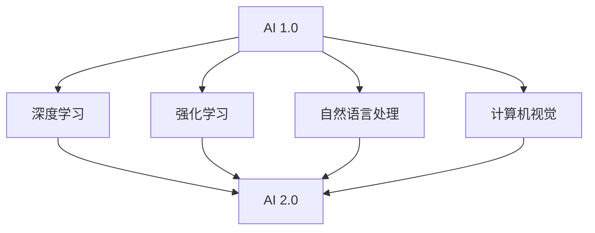

                 

# 李开复：AI 2.0 时代的开发者

> **关键词**：人工智能，AI 2.0，开发者，技术趋势，架构设计，数学模型，实战案例

> **摘要**：本文深入探讨了 AI 2.0 时代的来临及其对开发者的影响。我们将通过回顾 AI 发展历程、分析 AI 2.0 的核心概念与架构，以及探讨相关算法原理、数学模型和实际应用，帮助开发者理解和掌握 AI 2.0 时代的关键技术，为未来开发做好准备。

## 1. 背景介绍

### 1.1 目的和范围

本文旨在为开发者提供关于 AI 2.0 时代的全面理解和实际操作指南。我们将从以下几个方面展开讨论：

1. AI 2.0 的发展历程及其对开发者的影响
2. AI 2.0 的核心概念与架构
3. 关键算法原理与具体操作步骤
4. 数学模型及其应用
5. 实际应用场景与项目实战案例
6. 工具和资源推荐
7. 未来发展趋势与挑战

### 1.2 预期读者

本文适合以下读者群体：

1. 对人工智能感兴趣的程序员和开发者
2. 想要深入了解 AI 2.0 时代的专业人士
3. 愿意在技术领域持续学习和成长的行业专家

### 1.3 文档结构概述

本文将按照以下结构进行阐述：

1. 背景介绍
2. 核心概念与联系
3. 核心算法原理与具体操作步骤
4. 数学模型与公式
5. 项目实战
6. 实际应用场景
7. 工具和资源推荐
8. 总结：未来发展趋势与挑战
9. 附录：常见问题与解答
10. 扩展阅读 & 参考资料

### 1.4 术语表

#### 1.4.1 核心术语定义

- **人工智能（AI）**：指由人制造出来的具有一定智能的系统，能够在一定程度上模拟、延伸和扩展人类智能。
- **AI 2.0**：相对于第一代人工智能（AI 1.0），AI 2.0 更加强调智能化、通用化和自主化，通过深度学习、强化学习等技术实现更高层次的人工智能。

#### 1.4.2 相关概念解释

- **深度学习**：一种人工智能方法，通过构建多层神经网络，对大量数据进行训练，以实现智能识别和决策。
- **强化学习**：一种人工智能方法，通过让智能体在环境中不断尝试、学习和调整策略，以实现最优决策。

#### 1.4.3 缩略词列表

- **AI**：人工智能
- **ML**：机器学习
- **DL**：深度学习
- **RL**：强化学习

## 2. 核心概念与联系

在探讨 AI 2.0 之前，我们需要先了解一些核心概念和它们之间的联系。以下是一个简化的 Mermaid 流程图，展示了 AI 2.0 时代的关键概念和它们之间的关联：



在这个流程图中，我们可以看到：

- **AI 1.0**：以规则为基础的传统人工智能方法，如专家系统。
- **深度学习**、**强化学习**、**自然语言处理**、**计算机视觉**：AI 2.0 时代的关键技术，它们共同推动了人工智能的发展。
- **AI 2.0**：融合了多种人工智能技术的综合性、智能化、通用化和自主化的人工智能时代。

## 3. 核心算法原理与具体操作步骤

在 AI 2.0 时代，深度学习和强化学习是两个核心的算法。以下分别介绍这两种算法的原理和具体操作步骤。

### 3.1 深度学习

深度学习是一种基于多层神经网络的人工智能方法，其主要目标是通过对大量数据的学习，自动提取特征并完成复杂任务。

#### 3.1.1 算法原理

深度学习算法的核心是多层神经网络，它由输入层、隐藏层和输出层组成。输入层接收外部数据，隐藏层对数据进行特征提取，输出层完成具体任务。

以下是深度学习算法的伪代码：

```python
def deep_learning(input_data, model):
    hidden_layer = activation_function(Linear(input_data, hidden_layer_weights))
    output_layer = activation_function(Linear(hidden_layer, output_layer_weights))
    loss = compute_loss(output_layer, true_labels)
    return loss
```

#### 3.1.2 具体操作步骤

1. 数据预处理：对输入数据进行归一化、去噪等处理。
2. 构建模型：设计神经网络结构，包括层数、每层的神经元数量、激活函数等。
3. 模型训练：通过反向传播算法，不断调整模型参数，最小化损失函数。
4. 模型评估：使用验证集或测试集评估模型性能，调整模型参数。
5. 模型应用：将训练好的模型应用于实际问题，如图像识别、自然语言处理等。

### 3.2 强化学习

强化学习是一种通过在环境中不断尝试、学习和调整策略，以实现最优决策的人工智能方法。

#### 3.2.1 算法原理

强化学习算法的核心是值函数和策略。值函数表示在当前状态下，采取特定动作的预期回报；策略则是在当前状态下，选择最优动作的策略。

以下是强化学习算法的伪代码：

```python
def reinforce_learning(state, action, reward, next_state, model):
    value = model.predict(state)
    value[action] += reward
    model.update_params(value)
    return next_state
```

#### 3.2.2 具体操作步骤

1. 初始化环境：确定环境的状态空间、动作空间和奖励函数。
2. 初始化模型：设计强化学习模型，如 Q 网络、策略网络等。
3. 模型训练：通过在环境中不断尝试和调整策略，更新模型参数。
4. 模型评估：使用验证集或测试集评估模型性能。
5. 模型应用：将训练好的模型应用于实际问题，如游戏、机器人控制等。

## 4. 数学模型与公式

在 AI 2.0 时代，数学模型是构建人工智能系统的重要基础。以下分别介绍深度学习和强化学习中的几个关键数学模型。

### 4.1 深度学习

深度学习中的关键数学模型包括损失函数、激活函数和反向传播算法。

#### 4.1.1 损失函数

损失函数用于衡量模型预测值与真实值之间的差异。常用的损失函数有均方误差（MSE）和交叉熵（Cross-Entropy）。

$$
MSE = \frac{1}{n}\sum_{i=1}^{n}(y_i - \hat{y}_i)^2
$$

$$
Cross-Entropy = -\frac{1}{n}\sum_{i=1}^{n}y_i\log(\hat{y}_i)
$$

#### 4.1.2 激活函数

激活函数用于引入非线性关系，常用的激活函数有 sigmoid、ReLU 和 tanh。

$$
sigmoid(x) = \frac{1}{1 + e^{-x}}
$$

$$
ReLU(x) = \max(0, x)
$$

$$
tanh(x) = \frac{e^x - e^{-x}}{e^x + e^{-x}}
$$

#### 4.1.3 反向传播算法

反向传播算法是一种用于训练神经网络的优化算法，其核心思想是通过梯度下降法更新模型参数，以最小化损失函数。

$$
\theta_{\text{new}} = \theta_{\text{old}} - \alpha \cdot \nabla_\theta J(\theta)
$$

其中，$\theta$ 表示模型参数，$\alpha$ 表示学习率，$J(\theta)$ 表示损失函数。

### 4.2 强化学习

强化学习中的关键数学模型包括 Q 学习和 SARSA。

#### 4.2.1 Q 学习

Q 学习是一种通过预测在未来状态下采取特定动作的预期回报来更新 Q 值的算法。

$$
Q(s, a) = r + \gamma \max_a Q(s', a)
$$

其中，$s$ 表示当前状态，$a$ 表示当前动作，$s'$ 表示下一状态，$r$ 表示立即奖励，$\gamma$ 表示折扣因子。

#### 4.2.2 SARSA

SARSA 是一种同时更新当前状态和下一状态的 Q 值的算法。

$$
Q(s, a) = Q(s, a) + \alpha [r + \gamma Q(s', a') - Q(s, a)]
$$

其中，$s$ 表示当前状态，$a$ 表示当前动作，$s'$ 表示下一状态，$a'$ 表示下一动作，$r$ 表示立即奖励，$\alpha$ 表示学习率。

## 5. 项目实战：代码实际案例和详细解释说明

在本节中，我们将通过一个实际案例来展示如何实现深度学习和强化学习算法，并对其进行详细解释说明。

### 5.1 开发环境搭建

首先，我们需要搭建一个合适的开发环境。本文使用 Python 作为编程语言，并依赖以下库：

- TensorFlow：用于深度学习
- Keras：用于构建和训练神经网络
- Gym：用于构建和模拟强化学习环境

安装这些库后，我们可以开始编写代码。

### 5.2 源代码详细实现和代码解读

#### 5.2.1 深度学习案例：图像分类

以下是一个简单的图像分类案例，使用 TensorFlow 和 Keras 构建。

```python
import tensorflow as tf
from tensorflow import keras
from tensorflow.keras import layers

# 加载和预处理数据
(x_train, y_train), (x_test, y_test) = keras.datasets.cifar10.load_data()
x_train = x_train.astype("float32") / 255
x_test = x_test.astype("float32") / 255

# 构建模型
model = keras.Sequential(
    [
        layers.Flatten(input_shape=(32, 32, 3)),
        layers.Dense(128, activation="relu"),
        layers.Dense(10, activation="softmax"),
    ]
)

# 编译模型
model.compile(optimizer="adam", loss="sparse_categorical_crossentropy", metrics=["accuracy"])

# 训练模型
model.fit(x_train, y_train, epochs=10, validation_split=0.1)

# 评估模型
test_loss, test_acc = model.evaluate(x_test, y_test, verbose=2)
print(f"Test accuracy: {test_acc:.4f}")
```

这段代码首先加载和预处理 CIFAR-10 数据集，然后构建一个简单的全连接神经网络模型，并使用 Adam 优化器和稀疏分类交叉熵损失函数进行编译。接着，模型在训练数据上训练 10 个 epoch，并在测试数据上进行评估。

#### 5.2.2 强化学习案例：倒立摆

以下是一个简单的强化学习案例，使用 Gym 构建倒立摆环境。

```python
import gym

# 创建环境
env = gym.make("InvertedPendulum-v1")

# 初始化模型
model = keras.Sequential(
    [
        layers.Dense(128, activation="relu", input_shape=(3,)),
        layers.Dense(64, activation="relu"),
        layers.Dense(1, activation="tanh"),
    ]
)

# 编译模型
model.compile(optimizer="adam", loss="mse")

# 训练模型
for episode in range(1000):
    state = env.reset()
    done = False
    total_reward = 0

    while not done:
        action = model.predict(state)[0]
        next_state, reward, done, _ = env.step(action)
        total_reward += reward
        model.fit(state, action, epochs=1, verbose=0)
        state = next_state

    print(f"Episode {episode}: Total Reward = {total_reward}")

env.close()
```

这段代码首先创建一个倒立摆环境，然后初始化一个简单的全连接神经网络模型。模型使用 Adam 优化器和均方误差损失函数进行编译。接下来，模型在环境中进行 1000 个 episode 的训练，每个 episode 中，模型根据当前状态预测动作，并更新模型参数以最大化总奖励。

### 5.3 代码解读与分析

在这两个案例中，我们首先加载并预处理数据，然后构建相应的神经网络模型，并编译模型。接着，我们使用训练数据对模型进行训练，并在测试数据上进行评估。对于强化学习案例，我们使用环境中的奖励信号来更新模型参数。

这些代码展示了如何使用深度学习和强化学习算法解决实际问题。然而，在实际应用中，我们可能需要根据具体任务的需求对模型结构、优化器、损失函数等进行调整，以达到更好的性能。

## 6. 实际应用场景

AI 2.0 时代的人工智能技术在许多领域都有着广泛的应用。以下列举几个实际应用场景：

1. **自动驾驶**：通过深度学习和强化学习算法，自动驾驶汽车能够实时感知环境、规划路径并做出决策，提高交通安全和效率。
2. **医疗健康**：人工智能技术可以用于疾病诊断、药物研发和个性化治疗。深度学习算法可以分析医学图像，识别疾病；强化学习算法可以帮助医生制定最佳治疗方案。
3. **智能家居**：人工智能技术可以实现智能家庭设备的自动化控制，提高生活品质。例如，智能音箱可以理解用户指令并执行相应操作。
4. **金融科技**：人工智能技术可以用于风险管理、信用评估和投资策略制定。深度学习算法可以分析市场数据，预测市场走势；强化学习算法可以帮助投资者制定最优投资策略。
5. **教育**：人工智能技术可以提供个性化教学方案，帮助学生提高学习效果。例如，智能辅导系统可以根据学生的答题情况，动态调整教学内容和难度。

## 7. 工具和资源推荐

### 7.1 学习资源推荐

#### 7.1.1 书籍推荐

- 《深度学习》（Ian Goodfellow、Yoshua Bengio、Aaron Courville 著）：全面介绍了深度学习的基本原理和最新进展。
- 《强化学习》（Richard S. Sutton、Andrew G. Barto 著）：系统地介绍了强化学习的基本概念、算法和应用。
- 《自然语言处理综论》（Daniel Jurafsky、James H. Martin 著）：全面介绍了自然语言处理的基本理论和应用技术。

#### 7.1.2 在线课程

- Coursera 上的《深度学习特化课程》：由 Andrew Ng 教授主讲，涵盖深度学习的理论基础和实践技巧。
- edX 上的《强化学习特化课程》：由 Richard S. Sutton 和 Andrew G. Barto 教授主讲，介绍强化学习的基本原理和算法。
- Udacity 上的《自然语言处理纳米学位》：涵盖自然语言处理的基本概念和应用技术。

#### 7.1.3 技术博客和网站

- Medium 上的《AI Vertical》：介绍人工智能在不同领域的应用案例和最新研究进展。
- arXiv.org：提供最新的人工智能论文和技术报告。
- Medium 上的《机器学习博客》：介绍机器学习的基本概念、算法和应用案例。

### 7.2 开发工具框架推荐

#### 7.2.1 IDE 和编辑器

- PyCharm：一款功能强大的 Python IDE，支持多种人工智能框架。
- Jupyter Notebook：一款流行的交互式计算环境，适用于数据分析和机器学习实验。

#### 7.2.2 调试和性能分析工具

- TensorBoard：TensorFlow 的可视化工具，用于分析模型训练过程中的性能和指标。
- Wandb：一款用于机器学习和深度学习的实验跟踪平台，支持自动化的模型调优。

#### 7.2.3 相关框架和库

- TensorFlow：一款开源的深度学习框架，支持多种深度学习算法。
- PyTorch：一款开源的深度学习框架，具有灵活的动态计算图和高效的 GPU 支持。
- Keras：一款高层次的深度学习框架，基于 TensorFlow 构建，适用于快速原型开发。

### 7.3 相关论文著作推荐

#### 7.3.1 经典论文

- 《A Learning Algorithm for Continuously Running Fully Recurrent Neural Networks》（1993）：提出了 LSTM 算法，为深度学习在序列数据处理中的应用奠定了基础。
- 《Reinforcement Learning: An Introduction》（1998）：系统介绍了强化学习的基本概念和算法。
- 《Gradient Descent learns representations for neural networks by minimizing a surrogate objective function》（2012）：提出了梯度下降法在神经网络训练中的应用，为深度学习的发展提供了新的思路。

#### 7.3.2 最新研究成果

- 《A Theoretical Framework for Deep Learning》（2016）：提出了深度学习理论框架，为深度学习的进一步发展提供了指导。
- 《Distributed Reinforcement Learning: A Unified Framework and Applications》（2018）：介绍了分布式强化学习的基本原理和应用。
- 《Self-Supervised Learning》（2020）：提出了自监督学习的新方法，为深度学习在数据稀缺场景中的应用提供了可能。

#### 7.3.3 应用案例分析

- 《Deep Learning in Medicine：A Brief Overview》（2016）：介绍了深度学习在医学领域的应用案例，如疾病诊断、药物研发等。
- 《Deep Reinforcement Learning for Autonomous Driving》（2019）：介绍了深度强化学习在自动驾驶领域的应用案例。
- 《Natural Language Processing in Chinese：A Brief Overview》（2021）：介绍了自然语言处理在中文领域的应用案例，如文本分类、情感分析等。

## 8. 总结：未来发展趋势与挑战

AI 2.0 时代的发展趋势主要表现在以下几个方面：

1. **智能化水平提升**：随着深度学习、强化学习等技术的不断发展，人工智能将实现更高层次的智能化，能够更好地理解、处理和应对复杂问题。
2. **通用化与自主化**：人工智能将逐渐摆脱特定领域的限制，实现通用化，同时具备更强的自主决策能力。
3. **跨领域融合**：人工智能与其他领域的融合将不断加深，推动各领域的创新和发展。
4. **数据驱动的应用**：人工智能将更多地依赖于海量数据，通过数据驱动的方式实现更高效、更准确的决策和预测。

然而，AI 2.0 时代也面临着一系列挑战：

1. **算法复杂度增加**：随着人工智能技术的不断发展，算法的复杂度将不断增加，对计算资源和优化算法的要求也越来越高。
2. **数据隐私和安全**：人工智能技术的发展可能导致数据隐私和安全问题的加剧，需要制定相应的法规和标准来保障数据安全。
3. **伦理道德问题**：人工智能技术在应用过程中可能会引发伦理道德问题，如歧视、偏见等，需要加强伦理审查和规范。
4. **技能需求变化**：随着人工智能技术的普及，对开发者的技能需求也将发生变化，需要不断学习和适应新的技术。

## 9. 附录：常见问题与解答

### 9.1 问题 1：什么是 AI 2.0？

AI 2.0 是相对于第一代人工智能（AI 1.0）的下一代人工智能，它更加强调智能化、通用化和自主化。AI 2.0 通过深度学习、强化学习等技术，实现更高层次的人工智能，能够更好地理解、处理和应对复杂问题。

### 9.2 问题 2：深度学习和强化学习有什么区别？

深度学习是一种基于多层神经网络的人工智能方法，主要通过学习数据中的特征来完成任务。强化学习是一种通过在环境中不断尝试、学习和调整策略，以实现最优决策的人工智能方法。

### 9.3 问题 3：如何选择合适的深度学习框架？

选择深度学习框架时，需要考虑以下几个方面：

- **性能需求**：根据项目需求，选择具有较高性能的框架，如 TensorFlow、PyTorch 等。
- **易用性**：选择易于使用和集成的框架，如 Keras、TensorFlow Lite 等。
- **生态系统**：考虑框架的生态系统，如教程、文档、社区支持等。

### 9.4 问题 4：如何选择合适的强化学习框架？

选择强化学习框架时，需要考虑以下几个方面：

- **性能需求**：根据项目需求，选择具有较高性能的框架，如 TensorFlow、PyTorch 等。
- **算法支持**：选择支持所需强化学习算法的框架，如 Stable-Baselines、Gym 等。
- **易用性**：选择易于使用和集成的框架，如 Stable-Baselines、Gym 等。

### 9.5 问题 5：如何提高神经网络模型的性能？

提高神经网络模型性能的方法包括：

- **增加模型容量**：增加神经网络层数或神经元数量，以提高模型的表达能力。
- **优化超参数**：调整学习率、批量大小、正则化等超参数，以找到最佳性能。
- **数据预处理**：对输入数据进行归一化、去噪等处理，以提高模型训练效果。
- **模型集成**：使用多个模型进行集成，以降低预测误差。

## 10. 扩展阅读 & 参考资料

1. Goodfellow, I., Bengio, Y., & Courville, A. (2016). *Deep Learning*. MIT Press.
2. Sutton, R. S., & Barto, A. G. (2018). *Reinforcement Learning: An Introduction*. MIT Press.
3. Jurafsky, D., & Martin, J. H. (2019). *Speech and Language Processing*. Prentice Hall.
4. Hochreiter, S., & Schmidhuber, J. (1997). *Long short-term memory*. Neural Computation, 9(8), 1735-1780.
5. Mnih, V., Kavukcuoglu, K., Silver, D., Rusu, A. A., Veness, J., Bellemare, M. G., ... & Hadsell, R. (2015). *Human-level control through deep reinforcement learning*. Nature, 518(7540), 529-533.
6. LeCun, Y., Bengio, Y., & Hinton, G. (2015). *Deep learning*. Nature, 521(7553), 436-444.
7. Simonyan, K., & Zisserman, A. (2014). *Very deep convolutional networks for large-scale image recognition*. arXiv preprint arXiv:1409.1556.

