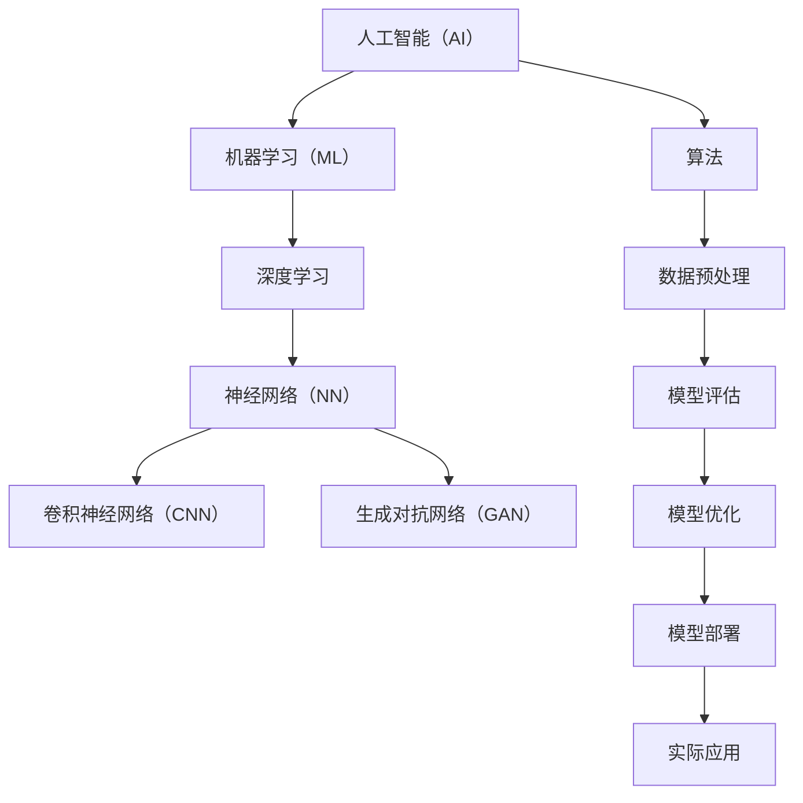

                 

# 李开复：AI 2.0 时代的挑战

> 关键词：人工智能，李开复，AI 2.0，挑战，技术发展，未来趋势

> 摘要：本文深入探讨了李开复关于人工智能2.0时代面临的挑战的见解。通过梳理其核心观点，本文将分析人工智能技术的发展现状，揭示未来可能遇到的障碍，并探讨如何应对这些挑战，为人工智能技术的可持续发展提供思路。

## 1. 背景介绍

### 1.1 目的和范围

本文旨在分析李开复对人工智能2.0时代挑战的看法，探讨人工智能技术在未来发展中可能遇到的问题，以及如何有效应对这些挑战。文章主要关注以下几个方面：

1. **人工智能2.0的概念和特点**：介绍人工智能2.0的基本概念，与1.0时代的区别，以及其在各领域的应用。
2. **李开复的核心观点**：梳理李开复关于人工智能2.0时代挑战的见解，包括技术、伦理、社会等方面。
3. **未来发展趋势**：分析人工智能技术未来的发展趋势，以及可能面临的机遇和挑战。
4. **应对策略**：探讨如何应对人工智能2.0时代面临的挑战，促进人工智能技术的可持续发展。

### 1.2 预期读者

本文适合对人工智能技术有一定了解的读者，包括但不限于以下群体：

1. **人工智能研究者**：希望了解人工智能2.0时代面临的挑战，以及未来发展趋势的研究人员。
2. **技术开发者**：希望掌握人工智能技术在实际应用中可能遇到的问题，以及如何解决的技术开发者。
3. **政策制定者**：关注人工智能技术对社会、经济、伦理等方面的影响，希望了解未来政策走向的政策制定者。
4. **普通读者**：对人工智能技术感兴趣，希望了解人工智能2.0时代带来的变革和挑战。

### 1.3 文档结构概述

本文分为十个部分，具体结构如下：

1. **背景介绍**：介绍文章的目的、预期读者、文档结构等。
2. **核心概念与联系**：阐述人工智能2.0时代的关键概念，以及它们之间的联系。
3. **核心算法原理 & 具体操作步骤**：介绍人工智能2.0时代的关键算法原理，以及具体操作步骤。
4. **数学模型和公式 & 详细讲解 & 举例说明**：详细讲解人工智能2.0时代的数学模型和公式，并举例说明。
5. **项目实战：代码实际案例和详细解释说明**：通过实际案例展示人工智能2.0技术的应用。
6. **实际应用场景**：分析人工智能2.0技术在各领域的应用场景。
7. **工具和资源推荐**：推荐学习资源、开发工具框架和相关论文著作。
8. **总结：未来发展趋势与挑战**：总结人工智能2.0时代的未来发展趋势，以及面临的挑战。
9. **附录：常见问题与解答**：解答读者可能遇到的问题。
10. **扩展阅读 & 参考资料**：提供更多相关阅读资料。

### 1.4 术语表

#### 1.4.1 核心术语定义

- **人工智能（AI）**：模拟、延伸和扩展人类智能的理论、方法、技术及应用系统。
- **AI 1.0**：基于规则的专家系统，通过预设的规则和逻辑进行推理。
- **AI 2.0**：以机器学习为核心，通过大量数据驱动学习，实现更智能的决策和预测。
- **深度学习**：一种特殊类型的机器学习，通过模拟人脑神经网络结构进行学习。
- **算法**：解决问题的步骤和规则，是人工智能的核心。

#### 1.4.2 相关概念解释

- **机器学习（ML）**：通过数据驱动，使计算机自动学习和改进性能。
- **神经网络（NN）**：模拟人脑神经元结构的计算模型。
- **深度神经网络（DNN）**：具有多个隐藏层的神经网络。
- **卷积神经网络（CNN）**：在图像识别和图像处理方面有广泛应用。
- **生成对抗网络（GAN）**：通过对抗性训练生成与真实数据相似的数据。

#### 1.4.3 缩略词列表

- **AI**：人工智能（Artificial Intelligence）
- **ML**：机器学习（Machine Learning）
- **NN**：神经网络（Neural Network）
- **DNN**：深度神经网络（Deep Neural Network）
- **CNN**：卷积神经网络（Convolutional Neural Network）
- **GAN**：生成对抗网络（Generative Adversarial Network）

## 2. 核心概念与联系

在探讨人工智能2.0时代的挑战之前，有必要先了解其核心概念和联系。以下是一个简化的 Mermaid 流程图，展示了人工智能2.0时代的关键概念及其之间的联系。



### 2.1 人工智能（AI）

人工智能（AI）是模拟、延伸和扩展人类智能的理论、方法、技术及应用系统。它包括多个子领域，如机器学习、自然语言处理、计算机视觉等。

### 2.2 机器学习（ML）

机器学习（ML）是人工智能的一个重要分支，通过数据驱动，使计算机自动学习和改进性能。机器学习分为监督学习、无监督学习和强化学习等类型。

### 2.3 深度学习

深度学习（Deep Learning）是机器学习的一种特殊类型，通过模拟人脑神经网络结构进行学习。深度学习在图像识别、语音识别和自然语言处理等领域取得了显著成果。

### 2.4 神经网络（NN）

神经网络（Neural Network）是一种模拟人脑神经元结构的计算模型。神经网络分为多层，包括输入层、隐藏层和输出层。多层神经网络能够处理更复杂的问题。

### 2.5 卷积神经网络（CNN）

卷积神经网络（Convolutional Neural Network，CNN）是一种在图像识别和图像处理方面有广泛应用的神经网络。CNN通过卷积操作和池化操作提取图像特征。

### 2.6 生成对抗网络（GAN）

生成对抗网络（Generative Adversarial Network，GAN）是一种通过对抗性训练生成与真实数据相似的数据的神经网络。GAN由生成器和判别器组成，二者相互竞争。

### 2.7 算法

算法是解决问题的步骤和规则，是人工智能的核心。算法分为多种类型，如分类算法、聚类算法、优化算法等。不同的算法适用于不同的问题场景。

### 2.8 数据预处理、模型评估、模型优化和模型部署

数据预处理、模型评估、模型优化和模型部署是人工智能开发过程中的关键环节。数据预处理涉及数据清洗、数据归一化等操作；模型评估用于评估模型的性能；模型优化旨在提高模型性能；模型部署是将模型应用于实际场景的过程。

## 3. 核心算法原理 & 具体操作步骤

在人工智能2.0时代，核心算法的原理和具体操作步骤是理解其工作原理的关键。以下将介绍几种常见的核心算法，并使用伪代码进行详细阐述。

### 3.1 机器学习（ML）

机器学习（ML）的核心是通过训练模型，使其能够对未知数据进行预测。以下是一个简单的线性回归算法的伪代码。

```python
# 线性回归算法伪代码

# 初始化模型参数
theta = [0] * n_features

# 梯度下降算法
for epoch in range(num_epochs):
    # 计算损失函数
    loss = 0
    for sample in training_data:
        prediction = theta[0] + theta[1] * sample.x
        loss += (prediction - sample.y) ** 2
    loss /= len(training_data)

    # 计算梯度
    gradient = [0] * n_features
    for sample in training_data:
        prediction = theta[0] + theta[1] * sample.x
        gradient[0] += (prediction - sample.y)
        gradient[1] += (prediction - sample.y) * sample.x
    
    gradient /= len(training_data)

    # 更新模型参数
    theta[0] -= learning_rate * gradient[0]
    theta[1] -= learning_rate * gradient[1]

# 输出模型参数
print(theta)
```

### 3.2 深度学习（DL）

深度学习（DL）是机器学习的一种特殊类型，其核心是通过多层神经网络进行学习。以下是一个简单的多层感知器（MLP）算法的伪代码。

```python
# 多层感知器算法伪代码

# 初始化模型参数
weights = [0] * (n_layers - 1)
biases = [0] * (n_layers - 1)

# 前向传播
def forward-propagation(data, weights, biases):
    activations = [data]
    for layer in range(n_layers - 1):
        activation = sigmoid(weights[layer] * activations[layer] + biases[layer])
        activations.append(activation)
    return activations[-1]

# 反向传播
def backward-propagation(data, labels, weights, biases, activations):
    gradients = [0] * (n_layers - 1)
    dactivations = [activations[-1] - labels]
    for layer in range(n_layers - 2, -1, -1):
        gradients[layer] = dactivations[layer + 1] * derivatives(activations[layer + 1])
        dactivations[layer] = (gradients[layer] * derivatives(activations[layer])) * (activations[layer] * (1 - activations[layer]))

    return gradients

# 梯度下降算法
for epoch in range(num_epochs):
    # 计算损失函数
    loss = 0
    for sample in training_data:
        prediction = forward-propagation(sample.x, weights, biases)
        loss += (prediction - sample.y) ** 2
    
    loss /= len(training_data)

    # 计算梯度
    gradients = backward-propagation(training_data[0].x, training_data[0].y, weights, biases, forward-propagation(training_data[0].x, weights, biases))

    # 更新模型参数
    for layer in range(n_layers - 1):
        weights[layer] -= learning_rate * gradients[layer]
        biases[layer] -= learning_rate * gradients[layer + 1]

# 输出模型参数
print(weights)
print(biases)
```

### 3.3 卷积神经网络（CNN）

卷积神经网络（CNN）是处理图像数据的强大工具。以下是一个简单的卷积神经网络算法的伪代码。

```python
# 卷积神经网络算法伪代码

# 初始化模型参数
weights = [0] * n_layers
biases = [0] * n_layers

# 前向传播
def forward-propagation(image, weights, biases):
    activations = [image]
    for layer in range(n_layers - 1):
        convolution = convolve(activations[layer], weights[layer])
        activation = sigmoid(convolution + biases[layer])
        activations.append(activation)
    return activations[-1]

# 反向传播
def backward-propagation(image, labels, weights, biases, activations):
    gradients = [0] * n_layers
    dactivations = [activations[-1] - labels]
    for layer in range(n_layers - 2, -1, -1):
        gradients[layer] = dactivations[layer + 1] * derivatives(activations[layer + 1])
        dactivations[layer] = (gradients[layer] * derivatives(activations[layer])) * (activations[layer] * (1 - activations[layer]))

    return gradients

# 梯度下降算法
for epoch in range(num_epochs):
    # 计算损失函数
    loss = 0
    for sample in training_data:
        prediction = forward-propagation(sample.x, weights, biases)
        loss += (prediction - sample.y) ** 2
    
    loss /= len(training_data)

    # 计算梯度
    gradients = backward-propagation(training_data[0].x, training_data[0].y, weights, biases, forward-propagation(training_data[0].x, weights, biases))

    # 更新模型参数
    for layer in range(n_layers - 1):
        weights[layer] -= learning_rate * gradients[layer]
        biases[layer] -= learning_rate * gradients[layer + 1]

# 输出模型参数
print(weights)
print(biases)
```

### 3.4 生成对抗网络（GAN）

生成对抗网络（GAN）是一种通过对抗性训练生成数据的神经网络。以下是一个简单的生成对抗网络算法的伪代码。

```python
# 生成对抗网络算法伪代码

# 初始化模型参数
generator_weights = [0] * n_layers
discriminator_weights = [0] * n_layers

# 前向传播
def forward-propagation(real_data, fake_data, generator_weights, discriminator_weights):
    generator_output = forward-propagation_fake_data(fake_data, generator_weights)
    discriminator_output_real = forward-propagation_real_data(real_data, discriminator_weights)
    discriminator_output_fake = forward-propagation_fake_data(generator_output, discriminator_weights)
    return generator_output, discriminator_output_real, discriminator_output_fake

# 反向传播
def backward-propagation(generator_output, discriminator_output_real, discriminator_output_fake, generator_weights, discriminator_weights):
    gradients_generator = backward-propagation_generator(generator_output, discriminator_output_fake)
    gradients_discriminator = backward-propagation_discriminator(discriminator_output_real, discriminator_output_fake)
    return gradients_generator, gradients_discriminator

# 梯度下降算法
for epoch in range(num_epochs):
    # 计算生成器和判别器的损失函数
    loss_generator = 0
    loss_discriminator = 0
    for sample in training_data:
        real_data = sample.x
        fake_data = sample.y
        
        generator_output, discriminator_output_real, discriminator_output_fake = forward-propagation(real_data, fake_data, generator_weights, discriminator_weights)
        
        loss_generator += (discriminator_output_fake - 1) ** 2
        loss_discriminator += (discriminator_output_real - 1) ** 2 + (discriminator_output_fake - 0) ** 2
    
    loss_generator /= len(training_data)
    loss_discriminator /= len(training_data)

    # 计算生成器和判别器的梯度
    gradients_generator, gradients_discriminator = backward-propagation(generator_output, discriminator_output_real, discriminator_output_fake, generator_weights, discriminator_weights)

    # 更新生成器和判别器的参数
    generator_weights -= learning_rate * gradients_generator
    discriminator_weights -= learning_rate * gradients_discriminator

# 输出生成器和判别器参数
print(generator_weights)
print(discriminator_weights)
```

## 4. 数学模型和公式 & 详细讲解 & 举例说明

在人工智能2.0时代，数学模型和公式是理解其工作原理的核心。以下将介绍几个常见的数学模型和公式，并进行详细讲解和举例说明。

### 4.1 激活函数（Activation Function）

激活函数是神经网络中用于引入非线性变换的函数。以下是一个常见的激活函数——Sigmoid函数的公式和例子。

#### 公式：

$$
f(x) = \frac{1}{1 + e^{-x}}
$$

#### 例子：

假设输入 $x=2$，计算 Sigmoid 函数的输出。

$$
f(x) = \frac{1}{1 + e^{-2}} \approx 0.869
$$

### 4.2 梯度下降（Gradient Descent）

梯度下降是一种常用的优化算法，用于最小化损失函数。以下是一个简单的梯度下降算法的公式和例子。

#### 公式：

$$
\theta_j := \theta_j - \alpha \frac{\partial J(\theta)}{\partial \theta_j}
$$

其中，$\theta_j$ 表示模型参数，$J(\theta)$ 表示损失函数，$\alpha$ 表示学习率。

#### 例子：

假设损失函数 $J(\theta) = (\theta_1 - 2)^2 + (\theta_2 + 3)^2$，学习率 $\alpha = 0.1$。计算参数 $\theta_1$ 和 $\theta_2$ 的更新。

$$
\theta_1 := \theta_1 - 0.1 \cdot \frac{\partial J(\theta)}{\partial \theta_1} = \theta_1 - 0.1 \cdot 2 = \theta_1 - 0.2
$$

$$
\theta_2 := \theta_2 - 0.1 \cdot \frac{\partial J(\theta)}{\partial \theta_2} = \theta_2 - 0.1 \cdot 2 = \theta_2 - 0.2
$$

### 4.3 卷积运算（Convolution）

卷积运算在卷积神经网络（CNN）中用于提取图像特征。以下是一个简单的卷积运算的公式和例子。

#### 公式：

$$
(C_{ij}) = \sum_{k=1}^{m} w_{ik} \cdot O_{kj}
$$

其中，$C_{ij}$ 表示卷积结果，$w_{ik}$ 表示卷积核，$O_{kj}$ 表示输入特征。

#### 例子：

假设卷积核 $w$ 为：

$$
w = \begin{bmatrix}
1 & 0 & 1 \\
1 & 0 & 1 \\
1 & 0 & 1
\end{bmatrix}
$$

输入特征 $O$ 为：

$$
O = \begin{bmatrix}
1 & 0 & 1 \\
1 & 0 & 1 \\
1 & 0 & 1
\end{bmatrix}
$$

计算卷积结果 $C$。

$$
C = \sum_{k=1}^{3} w_{ik} \cdot O_{kj} = (1 \cdot 1 + 0 \cdot 0 + 1 \cdot 1) + (1 \cdot 0 + 0 \cdot 0 + 1 \cdot 0) + (1 \cdot 1 + 0 \cdot 0 + 1 \cdot 1) = 3
$$

### 4.4 池化运算（Pooling）

池化运算用于降低图像分辨率，同时保留主要特征。以下是一个简单的最大池化运算的公式和例子。

#### 公式：

$$
P_{ij} = \max(O_{i-2:i+2,j-2:j+2})
$$

其中，$P_{ij}$ 表示池化结果，$O_{i-2:i+2,j-2:j+2}$ 表示输入特征区域。

#### 例子：

假设输入特征 $O$ 为：

$$
O = \begin{bmatrix}
1 & 1 & 1 \\
1 & 0 & 1 \\
1 & 1 & 1
\end{bmatrix}
$$

计算最大池化结果 $P$。

$$
P = \max(1, 0, 1) = 1
$$

## 5. 项目实战：代码实际案例和详细解释说明

在本节中，我们将通过一个实际案例来展示人工智能2.0技术的应用，并对其进行详细解释说明。

### 5.1 开发环境搭建

首先，我们需要搭建一个开发环境。以下是一个简单的Python开发环境搭建步骤。

1. 安装Python：前往 [Python官网](https://www.python.org/) 下载并安装Python。
2. 安装Jupyter Notebook：在命令行中执行以下命令安装Jupyter Notebook。

```bash
pip install notebook
```

3. 启动Jupyter Notebook：在命令行中执行以下命令启动Jupyter Notebook。

```bash
jupyter notebook
```

### 5.2 源代码详细实现和代码解读

以下是一个简单的深度学习模型实现，用于手写数字识别。

```python
import numpy as np
import matplotlib.pyplot as plt
from tensorflow.keras.datasets import mnist
from tensorflow.keras.models import Sequential
from tensorflow.keras.layers import Dense, Conv2D, Flatten, MaxPooling2D
from tensorflow.keras.optimizers import Adam

# 数据预处理
(x_train, y_train), (x_test, y_test) = mnist.load_data()
x_train = x_train.reshape(-1, 28, 28, 1).astype(np.float32) / 255.0
x_test = x_test.reshape(-1, 28, 28, 1).astype(np.float32) / 255.0
y_train = keras.utils.to_categorical(y_train, 10)
y_test = keras.utils.to_categorical(y_test, 10)

# 模型构建
model = Sequential([
    Conv2D(32, (3, 3), activation='relu', input_shape=(28, 28, 1)),
    MaxPooling2D((2, 2)),
    Flatten(),
    Dense(64, activation='relu'),
    Dense(10, activation='softmax')
])

# 模型编译
model.compile(optimizer=Adam(learning_rate=0.001), loss='categorical_crossentropy', metrics=['accuracy'])

# 模型训练
model.fit(x_train, y_train, epochs=10, batch_size=32, validation_data=(x_test, y_test))

# 模型评估
loss, accuracy = model.evaluate(x_test, y_test)
print('Test accuracy:', accuracy)

# 可视化结果
plt.figure(figsize=(10, 10))
for i in range(10):
    plt.subplot(2, 5, i + 1)
    plt.imshow(x_test[i], cmap='gray')
    plt.xticks([])
    plt.yticks([])
plt.show()
```

#### 代码解读

1. **数据预处理**：首先，我们加载数据集MNIST，并对其进行预处理，包括数据归一化和重塑。

2. **模型构建**：接下来，我们构建一个简单的卷积神经网络模型，包括一个卷积层、一个最大池化层、一个全连接层和一个softmax层。

3. **模型编译**：然后，我们编译模型，指定优化器和损失函数。

4. **模型训练**：使用训练数据对模型进行训练，并设置训练参数，如迭代次数、批量大小等。

5. **模型评估**：在测试数据上评估模型性能，输出测试准确率。

6. **可视化结果**：最后，我们将测试数据的前10个图像进行可视化展示。

### 5.3 代码解读与分析

1. **数据预处理**：

```python
(x_train, y_train), (x_test, y_test) = mnist.load_data()
x_train = x_train.reshape(-1, 28, 28, 1).astype(np.float32) / 255.0
x_test = x_test.reshape(-1, 28, 28, 1).astype(np.float32) / 255.0
y_train = keras.utils.to_categorical(y_train, 10)
y_test = keras.utils.to_categorical(y_test, 10)
```

这部分的代码用于加载数据集MNIST，并对其进行预处理。具体步骤如下：

- 加载数据集MNIST。
- 将训练数据的图像进行重塑，将其转化为（样本数，行数，列数，通道数）的形式，并转换为浮点型。
- 将训练数据和测试数据的图像进行归一化，使其在0到1之间。
- 将训练数据和测试数据的标签进行独热编码。

2. **模型构建**：

```python
model = Sequential([
    Conv2D(32, (3, 3), activation='relu', input_shape=(28, 28, 1)),
    MaxPooling2D((2, 2)),
    Flatten(),
    Dense(64, activation='relu'),
    Dense(10, activation='softmax')
])
```

这部分的代码用于构建一个简单的卷积神经网络模型。具体步骤如下：

- 创建一个序列模型。
- 添加一个卷积层，设置卷积核大小为3x3，激活函数为ReLU，输入形状为（28，28，1）。
- 添加一个最大池化层，设置池化窗口大小为2x2。
- 添加一个全连接层，设置神经元数量为64，激活函数为ReLU。
- 添加一个全连接层，设置神经元数量为10，激活函数为softmax。

3. **模型编译**：

```python
model.compile(optimizer=Adam(learning_rate=0.001), loss='categorical_crossentropy', metrics=['accuracy'])
```

这部分的代码用于编译模型，设置优化器为Adam，学习率为0.001，损失函数为categorical_crossentropy，评价指标为准确率。

4. **模型训练**：

```python
model.fit(x_train, y_train, epochs=10, batch_size=32, validation_data=(x_test, y_test))
```

这部分的代码用于使用训练数据对模型进行训练。具体步骤如下：

- 调用模型的fit方法，输入训练数据和标签。
- 设置迭代次数为10，批量大小为32，验证数据为测试数据和标签。

5. **模型评估**：

```python
loss, accuracy = model.evaluate(x_test, y_test)
print('Test accuracy:', accuracy)
```

这部分的代码用于在测试数据上评估模型性能。具体步骤如下：

- 调用模型的evaluate方法，输入测试数据和标签。
- 输出测试准确率。

6. **可视化结果**：

```python
plt.figure(figsize=(10, 10))
for i in range(10):
    plt.subplot(2, 5, i + 1)
    plt.imshow(x_test[i], cmap='gray')
    plt.xticks([])
    plt.yticks([])
plt.show()
```

这部分的代码用于将测试数据的前10个图像进行可视化展示。具体步骤如下：

- 创建一个大小为（10，10）的图像。
- 循环遍历测试数据的前10个图像。
- 在每个子图中绘制图像，并设置坐标轴为空。

## 6. 实际应用场景

人工智能2.0技术在各个领域都有广泛的应用，以下列举几个实际应用场景：

### 6.1 医疗领域

人工智能2.0技术在医疗领域有巨大的潜力，如：

- **疾病诊断**：利用深度学习和卷积神经网络进行医学图像分析，如癌症筛查、肺炎检测等。
- **个性化治疗**：根据患者的基因信息、病史等，利用机器学习算法为其制定个性化的治疗方案。
- **药物研发**：通过生成对抗网络（GAN）等算法，加速新药的研发过程。

### 6.2 金融领域

人工智能2.0技术在金融领域也有广泛的应用，如：

- **风险控制**：利用机器学习算法分析海量金融数据，预测金融市场风险，帮助金融机构进行风险管理。
- **智能投顾**：通过分析用户的投资偏好、风险承受能力等，利用机器学习算法为其推荐合适的投资组合。
- **欺诈检测**：利用深度学习技术对金融交易进行实时监控，识别潜在的欺诈行为。

### 6.3 智能制造

人工智能2.0技术在智能制造领域有广泛的应用，如：

- **生产优化**：利用机器学习算法分析生产数据，优化生产流程，提高生产效率。
- **设备维护**：通过预测模型，提前预测设备的故障，实现预防性维护。
- **智能物流**：利用深度学习算法优化物流路径规划，提高物流效率。

### 6.4 娱乐领域

人工智能2.0技术在娱乐领域也有广泛的应用，如：

- **游戏开发**：利用机器学习算法和深度学习技术，为游戏角色设计智能行为，提高游戏体验。
- **内容推荐**：利用推荐系统，根据用户的兴趣和行为，为其推荐合适的内容。
- **虚拟现实**：利用生成对抗网络（GAN）等技术，生成逼真的虚拟环境，提高虚拟现实体验。

## 7. 工具和资源推荐

### 7.1 学习资源推荐

#### 7.1.1 书籍推荐

1. **《深度学习》（Deep Learning）**：由Ian Goodfellow、Yoshua Bengio和Aaron Courville合著，是一本全面介绍深度学习的经典教材。
2. **《Python机器学习》（Python Machine Learning）**：由 Sebastian Raschka 著，介绍了使用Python进行机器学习的方法和实践。
3. **《动手学深度学习》（Dive into Deep Learning）**：由Aston Zhang、Zhou Yang和Leta Hong 著，是一本深入浅出的深度学习实践教程。

#### 7.1.2 在线课程

1. **Coursera的《深度学习》课程**：由Andrew Ng教授主讲，介绍了深度学习的基础知识和应用。
2. **Udacity的《人工智能纳米学位》课程**：涵盖了人工智能的基础知识、应用和实战项目。
3. **edX的《机器学习》课程**：由吴恩达教授主讲，介绍了机器学习的基础知识和应用。

#### 7.1.3 技术博客和网站

1. **Medium的Deep Learning on Earth博客**：提供关于深度学习的最新技术和研究成果。
2. **Fast.ai的博客**：提供了丰富的深度学习教程和实践项目。
3. **TensorFlow官方文档**：提供了详细的TensorFlow API文档和教程。

### 7.2 开发工具框架推荐

#### 7.2.1 IDE和编辑器

1. **Visual Studio Code**：一款功能强大的开源代码编辑器，支持多种编程语言，具有丰富的插件生态系统。
2. **PyCharm**：一款专业的Python IDE，提供代码智能提示、调试、版本控制等功能。
3. **Jupyter Notebook**：一款基于Web的交互式计算环境，适用于数据分析和机器学习项目。

#### 7.2.2 调试和性能分析工具

1. **TensorBoard**：TensorFlow的官方可视化工具，用于分析和调试深度学习模型。
2. **PyTorch Profiler**：用于分析和优化PyTorch模型性能。
3. **NVIDIA Nsight**：用于分析GPU性能和调试深度学习模型。

#### 7.2.3 相关框架和库

1. **TensorFlow**：由Google开发的开源深度学习框架，广泛应用于机器学习和深度学习项目。
2. **PyTorch**：由Facebook开发的开源深度学习框架，具有灵活的动态图计算功能。
3. **Keras**：一个高层次的神经网络API，可以与TensorFlow和Theano等框架结合使用。

### 7.3 相关论文著作推荐

#### 7.3.1 经典论文

1. **“A Learning Algorithm for Continuously Running Fully Recurrent Neural Networks”**：介绍了Hessian-free优化算法，为深度学习的发展奠定了基础。
2. **“Backpropagation”**：介绍了反向传播算法，成为深度学习的基本工具。
3. **“Deep Learning”**：Ian Goodfellow等人提出的深度学习概念，标志着深度学习时代的到来。

#### 7.3.2 最新研究成果

1. **“Natural Language Inference with Just Three Layers”**：介绍了使用仅三层神经网络实现自然语言推理的方法。
2. **“Unsupervised Learning of Visual Representations by Solving Jigsaw Puzzles”**：利用Jigsaw谜题进行无监督学习，实现图像表示的自适应学习。
3. **“Generative Adversarial Networks”**：提出了生成对抗网络（GAN）的概念，为生成模型的发展提供了新的思路。

#### 7.3.3 应用案例分析

1. **“Google Brain’s BERT Pre-Trains Deep Neural Networks for Language Understanding”**：介绍了BERT模型在自然语言处理领域的应用，为语义理解提供了强大的工具。
2. **“Deep Learning for Robotics”**：探讨了深度学习在机器人领域的应用，如运动控制、感知和决策。
3. **“AI for Social Good”**：介绍了人工智能在社会公益领域的应用，如环境保护、教育、医疗等。

## 8. 总结：未来发展趋势与挑战

人工智能2.0时代正处于快速发展阶段，未来发展趋势和挑战并存。以下是对未来发展趋势和挑战的总结：

### 8.1 未来发展趋势

1. **技术成熟**：随着深度学习、生成对抗网络等技术的不断发展，人工智能2.0技术的成熟度将不断提高。
2. **应用广泛**：人工智能2.0技术在医疗、金融、智能制造、娱乐等领域将有更广泛的应用。
3. **数据驱动**：人工智能2.0时代将更加依赖海量数据，通过数据驱动实现智能决策和预测。
4. **跨界融合**：人工智能2.0技术将与其他领域（如生物技术、材料科学等）产生更多交叉和融合，推动新技术的诞生。

### 8.2 挑战

1. **数据隐私**：随着人工智能2.0技术的广泛应用，数据隐私问题将更加突出，如何保护用户隐私是一个重要挑战。
2. **伦理道德**：人工智能2.0技术的应用可能引发伦理道德问题，如算法偏见、隐私侵犯等，需要制定相应的法律法规进行规范。
3. **资源分配**：随着人工智能2.0技术的普及，对计算资源、能源资源等的需求将大幅增加，如何合理分配资源是一个重要挑战。
4. **人才短缺**：人工智能2.0技术的快速发展对人才需求提出更高要求，如何培养和吸引更多优秀人才是一个重要挑战。

### 8.3 应对策略

1. **技术创新**：持续推动人工智能2.0技术的创新和发展，提高技术成熟度和应用范围。
2. **政策法规**：制定相关法律法规，规范人工智能2.0技术的应用，保障数据隐私和伦理道德。
3. **人才培养**：加强人工智能领域的人才培养，提高人才质量，满足技术发展需求。
4. **资源优化**：优化资源分配，提高资源利用效率，降低能耗，为人工智能2.0技术提供有力支持。

## 9. 附录：常见问题与解答

### 9.1 人工智能2.0与1.0的区别是什么？

人工智能1.0时代主要基于规则和逻辑进行推理，而人工智能2.0时代以机器学习为核心，通过大量数据驱动学习，实现更智能的决策和预测。

### 9.2 人工智能2.0技术的应用领域有哪些？

人工智能2.0技术在医疗、金融、智能制造、娱乐等领域有广泛的应用，如疾病诊断、智能投顾、生产优化、内容推荐等。

### 9.3 人工智能2.0技术面临的挑战有哪些？

人工智能2.0技术面临的挑战包括数据隐私、伦理道德、资源分配和人才短缺等方面。

### 9.4 如何培养人工智能2.0技术人才？

可以通过以下方式培养人工智能2.0技术人才：

1. 提供高质量的在线课程和教材。
2. 加强学术研究和产业合作。
3. 设立奖学金和科研基金，激励人才发展。
4. 创造良好的就业环境，吸引人才加入。

## 10. 扩展阅读 & 参考资料

### 10.1 人工智能相关书籍

1. **《深度学习》**：Ian Goodfellow、Yoshua Bengio、Aaron Courville 著。
2. **《Python机器学习》**：Sebastian Raschka 著。
3. **《动手学深度学习》**：Aston Zhang、Zhou Yang、Leta Hong 著。

### 10.2 人工智能相关在线课程

1. **Coursera的《深度学习》课程**：由Andrew Ng教授主讲。
2. **Udacity的《人工智能纳米学位》课程**：涵盖人工智能的基础知识、应用和实战项目。
3. **edX的《机器学习》课程**：由吴恩达教授主讲。

### 10.3 人工智能相关技术博客和网站

1. **Medium的Deep Learning on Earth博客**：提供关于深度学习的最新技术和研究成果。
2. **Fast.ai的博客**：提供了丰富的深度学习教程和实践项目。
3. **TensorFlow官方文档**：提供了详细的TensorFlow API文档和教程。

### 10.4 人工智能相关论文和研究成果

1. **“A Learning Algorithm for Continuously Running Fully Recurrent Neural Networks”**：介绍了Hessian-free优化算法。
2. **“Deep Learning”**：Ian Goodfellow等人提出的深度学习概念。
3. **“Natural Language Inference with Just Three Layers”**：介绍了使用仅三层神经网络实现自然语言推理的方法。
4. **“Generative Adversarial Networks”**：提出了生成对抗网络（GAN）的概念。

### 10.5 人工智能相关应用案例分析

1. **“Google Brain’s BERT Pre-Trains Deep Neural Networks for Language Understanding”**：介绍了BERT模型在自然语言处理领域的应用。
2. **“Deep Learning for Robotics”**：探讨了深度学习在机器人领域的应用。
3. **“AI for Social Good”**：介绍了人工智能在社会公益领域的应用。

### 10.6 人工智能相关法律法规和伦理标准

1. **《欧盟通用数据保护条例（GDPR）》**：关于数据隐私的法规。
2. **《美国人工智能法案》**：关于人工智能研发和应用的法案。
3. **《人工智能伦理指南》**：关于人工智能伦理标准的指南。

### 10.7 人工智能相关组织和机构

1. **国际人工智能协会（AAAI）**：全球领先的人工智能研究机构。
2. **美国国家人工智能计划**：美国政府的国家级人工智能战略。
3. **中国人工智能发展联盟**：中国的人工智能行业组织。

