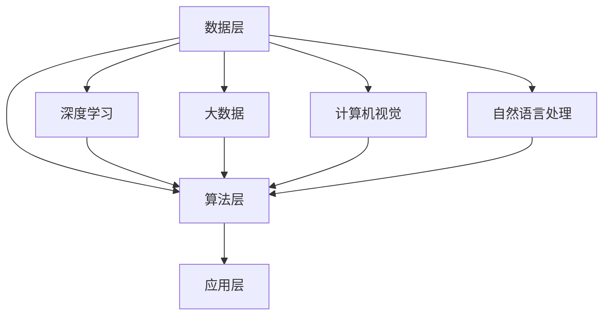

                 


# 李开复：AI 2.0 时代的未来展望

> 关键词：AI 2.0、未来展望、人工智能技术、深度学习、大数据、计算机视觉、自然语言处理
>
> 摘要：本文将深入探讨AI 2.0时代的未来趋势，通过分析当前人工智能技术发展现状，以及深度学习、大数据、计算机视觉、自然语言处理等核心领域的研究进展，预测AI技术可能对未来社会带来的变革和挑战。

## 1. 背景介绍

### 1.1 目的和范围

本文旨在分析AI 2.0时代的未来趋势，为读者提供一幅人工智能技术发展的蓝图。本文将重点关注以下几个领域：

1. 深度学习与神经网络
2. 大数据与数据挖掘
3. 计算机视觉与图像识别
4. 自然语言处理与机器翻译

通过以上领域的分析，本文将探讨AI技术在未来可能对社会、经济、教育等各个方面带来的深远影响。

### 1.2 预期读者

本文适合对人工智能技术有一定了解的读者，包括计算机科学、人工智能、大数据等领域的专业人士，以及对该领域感兴趣的大众读者。

### 1.3 文档结构概述

本文分为十个部分，具体如下：

1. 背景介绍：介绍本文的目的、范围、预期读者以及文档结构。
2. 核心概念与联系：讨论人工智能技术的核心概念、原理和架构。
3. 核心算法原理与具体操作步骤：详细讲解人工智能技术的核心算法原理和操作步骤。
4. 数学模型和公式：介绍人工智能技术中的数学模型和公式，并进行详细讲解和举例说明。
5. 项目实战：通过实际案例展示人工智能技术的应用。
6. 实际应用场景：分析人工智能技术在各个领域的应用场景。
7. 工具和资源推荐：推荐学习资源、开发工具框架和相关论文著作。
8. 总结：总结本文的主要内容，展望未来发展趋势与挑战。
9. 附录：常见问题与解答。
10. 扩展阅读与参考资料：提供更多相关阅读资料。

### 1.4 术语表

#### 1.4.1 核心术语定义

- AI 2.0：指第二代人工智能技术，以深度学习、大数据、计算机视觉、自然语言处理等为核心。
- 深度学习：一种人工智能技术，通过多层神经网络对数据进行学习和预测。
- 大数据：指海量、复杂、多样化的数据集合。
- 计算机视觉：指让计算机具备识别和理解图像、视频等视觉信息的能力。
- 自然语言处理：指让计算机理解和处理自然语言（如中文、英文）的技术。

#### 1.4.2 相关概念解释

- 神经网络：一种由大量神经元组成的计算模型，可以模拟人脑的思考过程。
- 数据挖掘：从大量数据中提取出有价值的信息和知识的过程。
- 机器学习：一种通过数据训练模型，让计算机具备自主学习和预测能力的人工智能技术。

#### 1.4.3 缩略词列表

- AI：人工智能
- DL：深度学习
- NLP：自然语言处理
- CV：计算机视觉
- ML：机器学习

## 2. 核心概念与联系

### 2.1 AI 2.0 的核心概念

AI 2.0 是第二代人工智能技术的统称，主要包括以下几个核心概念：

1. **深度学习**：深度学习是一种人工智能技术，通过多层神经网络对数据进行学习和预测。深度学习的核心是神经网络，它由大量神经元组成，可以模拟人脑的思考过程。

2. **大数据**：大数据是指海量、复杂、多样化的数据集合。大数据的特点是“4V”，即大量（Volume）、多样（Variety）、快速（Velocity）和真实（Veracity）。

3. **计算机视觉**：计算机视觉是指让计算机具备识别和理解图像、视频等视觉信息的能力。计算机视觉技术广泛应用于人脸识别、图像识别、自动驾驶等领域。

4. **自然语言处理**：自然语言处理是指让计算机理解和处理自然语言（如中文、英文）的技术。自然语言处理技术广泛应用于机器翻译、语音识别、文本分析等领域。

### 2.2 AI 2.0 的架构

AI 2.0 的架构可以分为以下几个层次：

1. **数据层**：数据层是 AI 2.0 的基石，包括数据采集、存储、处理等环节。数据质量直接影响 AI 模型的性能和效果。

2. **算法层**：算法层包括深度学习、计算机视觉、自然语言处理等核心算法。这些算法通过训练模型，实现数据的智能分析和预测。

3. **应用层**：应用层是将 AI 技术应用于各个行业和场景，如智能安防、医疗诊断、金融风控、教育等领域。

### 2.3 关联关系与流程图

以下是一个简单的 Mermaid 流程图，展示 AI 2.0 的核心概念和架构：



## 3. 核心算法原理 & 具体操作步骤

### 3.1 深度学习算法原理

深度学习算法的核心是神经网络，它由大量神经元组成，可以模拟人脑的思考过程。以下是深度学习算法的基本原理和操作步骤：

#### 3.1.1 神经网络结构

神经网络由输入层、隐藏层和输出层组成。每个神经元都与相邻的神经元相连，并通过权重进行信息传递。

#### 3.1.2 前向传播

前向传播是指将输入数据通过神经网络传递到输出层的计算过程。具体步骤如下：

1. 初始化权重和偏置。
2. 将输入数据通过输入层传递到隐藏层。
3. 通过激活函数对隐藏层的输出进行非线性变换。
4. 将隐藏层的输出传递到输出层。
5. 计算输出层的预测结果。

#### 3.1.3 反向传播

反向传播是指根据预测结果和真实值之间的误差，调整神经网络的权重和偏置，以优化模型的性能。具体步骤如下：

1. 计算输出层的误差。
2. 反向传播误差到隐藏层。
3. 根据误差调整隐藏层的权重和偏置。
4. 反向传播误差到输入层。
5. 根据误差调整输入层的权重和偏置。

#### 3.1.4 伪代码实现

以下是一个简单的深度学习算法的伪代码实现：

```python
# 初始化权重和偏置
weights, biases = initialize()

# 前向传播
output = forward_propagation(input_data, weights, biases)

# 计算误差
error = compute_error(output, true_value)

# 反向传播
delta = backward_propagation(error, weights, biases)

# 更新权重和偏置
weights, biases = update_weights_and_biases(weights, biases, delta)
```

### 3.2 计算机视觉算法原理

计算机视觉算法的核心是图像处理和目标检测。以下是计算机视觉算法的基本原理和操作步骤：

#### 3.2.1 图像处理

图像处理是指对图像进行预处理、增强、分割等操作，以提高图像质量，为后续的目标检测提供更好的输入。具体步骤如下：

1. 输入图像。
2. 图像预处理（如去噪、对比度增强等）。
3. 图像分割（如边缘检测、区域生长等）。

#### 3.2.2 目标检测

目标检测是指识别图像中的目标对象，并对其位置和属性进行标注。具体步骤如下：

1. 输入图像。
2. 特征提取（如卷积神经网络提取特征）。
3. 目标检测（如滑动窗口、锚框回归等）。
4. 非极大值抑制（NMS）。
5. 输出目标检测结果。

#### 3.2.3 伪代码实现

以下是一个简单的计算机视觉算法的伪代码实现：

```python
# 输入图像
image = input_image()

# 图像预处理
preprocessed_image = preprocess_image(image)

# 特征提取
features = extract_features(preprocessed_image)

# 目标检测
detections = detect_objects(features)

# 非极大值抑制
filtered_detections = non_max_suppression(detections)

# 输出目标检测结果
output_detections(filtered_detections)
```

### 3.3 自然语言处理算法原理

自然语言处理算法的核心是文本处理和语义理解。以下是自然语言处理算法的基本原理和操作步骤：

#### 3.3.1 文本处理

文本处理是指对文本进行预处理、分词、词性标注等操作，以提高文本质量，为后续的语义理解提供更好的输入。具体步骤如下：

1. 输入文本。
2. 文本预处理（如去除标点、停用词过滤等）。
3. 分词（如词法分析、词组识别等）。
4. 词性标注（如名词、动词、形容词等）。

#### 3.3.2 语义理解

语义理解是指对文本进行语义分析、情感分析、实体识别等操作，以提取文本中的语义信息。具体步骤如下：

1. 输入文本。
2. 语义分析（如句法分析、语义角色标注等）。
3. 情感分析（如正面、负面、中性情感分类等）。
4. 实体识别（如人名、地名、组织名等实体识别）。

#### 3.3.3 伪代码实现

以下是一个简单的自然语言处理算法的伪代码实现：

```python
# 输入文本
text = input_text()

# 文本预处理
preprocessed_text = preprocess_text(text)

# 分词
words = tokenize(preprocessed_text)

# 词性标注
pos_tags = part_of_speech(words)

# 语义分析
sentences = sentence_analysis(words)

# 情感分析
sentiment = sentiment_analysis(sentences)

# 实体识别
entities = entity_recognition(sentences)

# 输出处理结果
output_text(preprocessed_text, pos_tags, sentiment, entities)
```

## 4. 数学模型和公式 & 详细讲解 & 举例说明

### 4.1 深度学习数学模型

深度学习算法的核心是神经网络，而神经网络的运算离不开数学模型。以下是深度学习中的几个关键数学模型和公式，并进行详细讲解和举例说明。

#### 4.1.1 激活函数

激活函数是深度学习模型中不可或缺的部分，用于对神经元的输出进行非线性变换。常见的激活函数有：

- **Sigmoid函数**：
  $$ \sigma(x) = \frac{1}{1 + e^{-x}} $$

  **举例**：设输入 $x = 3$，则有：
  $$ \sigma(3) = \frac{1}{1 + e^{-3}} \approx 0.9512 $$

- **ReLU函数**：
  $$ \text{ReLU}(x) = \max(0, x) $$

  **举例**：设输入 $x = -2$，则有：
  $$ \text{ReLU}(-2) = \max(0, -2) = 0 $$

- **Tanh函数**：
  $$ \tanh(x) = \frac{e^x - e^{-x}}{e^x + e^{-x}} $$

  **举例**：设输入 $x = 2$，则有：
  $$ \tanh(2) = \frac{e^2 - e^{-2}}{e^2 + e^{-2}} \approx 0.9640 $$

#### 4.1.2 前向传播与反向传播

深度学习中的前向传播和反向传播是训练神经网络的关键步骤。以下分别介绍它们的数学模型和公式。

- **前向传播**：

  前向传播过程中，神经网络的输出可以通过以下公式计算：

  $$ z_l = \sum_{j} w_{lj}a_{j}^{l-1} + b_l $$

  其中，$z_l$ 是第 $l$ 层的输出，$w_{lj}$ 是从第 $l-1$ 层到第 $l$ 层的权重，$a_{j}^{l-1}$ 是第 $l-1$ 层的输出，$b_l$ 是第 $l$ 层的偏置。

- **反向传播**：

  反向传播过程中，误差可以通过以下公式计算：

  $$ \delta_l = \frac{\partial C}{\partial z_l} \odot \sigma'(z_l) $$

  其中，$\delta_l$ 是第 $l$ 层的误差，$C$ 是损失函数，$\sigma'(z_l)$ 是第 $l$ 层的激活函数的导数。

  更新权重和偏置的公式如下：

  $$ w_{lj} \leftarrow w_{lj} - \alpha \frac{\partial C}{\partial w_{lj}} $$
  $$ b_l \leftarrow b_l - \alpha \frac{\partial C}{\partial b_l} $$

  其中，$\alpha$ 是学习率。

#### 4.1.3 损失函数

深度学习中的损失函数用于衡量模型预测值和真实值之间的差距。常见的损失函数有：

- **均方误差（MSE）**：
  $$ C = \frac{1}{2} \sum_{i} (y_i - \hat{y}_i)^2 $$

  其中，$y_i$ 是真实值，$\hat{y}_i$ 是预测值。

- **交叉熵（Cross-Entropy）**：
  $$ C = - \sum_{i} y_i \log \hat{y}_i $$

  其中，$y_i$ 是真实值，$\hat{y}_i$ 是预测值。

### 4.2 计算机视觉数学模型

计算机视觉中的数学模型主要涉及图像处理和目标检测。以下介绍两个关键数学模型：卷积神经网络（CNN）和目标检测算法（如YOLO）。

#### 4.2.1 卷积神经网络（CNN）

卷积神经网络是计算机视觉中的一种强大模型，其核心是卷积层和池化层。以下是一个简单的CNN模型结构：

1. **卷积层**：

   卷积层通过卷积运算提取图像特征。卷积运算的公式如下：

   $$ h_{ij}^{l} = \sum_{k} w_{ik}^{l}a_{kj}^{l-1} + b_l^{l} $$

   其中，$h_{ij}^{l}$ 是第 $l$ 层的第 $i$ 行第 $j$ 列的输出，$w_{ik}^{l}$ 是卷积核的权重，$a_{kj}^{l-1}$ 是第 $l-1$ 层的第 $k$ 行第 $j$ 列的输出，$b_l^{l}$ 是偏置。

2. **池化层**：

   池化层用于减少特征图的尺寸，提高模型的计算效率。常见的池化方式有最大池化和平均池化。

   最大池化的公式如下：

   $$ p_{ij}^{l} = \max_{k} a_{kj}^{l-1} $$

   其中，$p_{ij}^{l}$ 是第 $l$ 层的第 $i$ 行第 $j$ 列的输出，$a_{kj}^{l-1}$ 是第 $l-1$ 层的第 $k$ 行第 $j$ 列的输出。

#### 4.2.2 目标检测算法（YOLO）

YOLO（You Only Look Once）是一种端到端的目标检测算法，其核心思想是将目标检测问题转化为一个回归问题。以下是一个简单的YOLO算法模型：

1. **特征提取**：

   使用卷积神经网络提取图像特征，生成特征图。

2. **边界框预测**：

   在特征图上，每个网格单元预测一组边界框和相应的置信度。边界框的预测公式如下：

   $$ \text{box}_{ij} = \begin{bmatrix} x_c & y_c & w & h \end{bmatrix} $$

   其中，$x_c$ 和 $y_c$ 是边界框中心的坐标，$w$ 和 $h$ 是边界框的宽度和高度。

3. **类别预测**：

   对每个边界框，预测其所属的类别。类别预测的公式如下：

   $$ P_{ij}^c = \frac{\exp(a_{ij}^c)}{\sum_{k} \exp(a_{ij}^k)} $$

   其中，$a_{ij}^c$ 是第 $i$ 行第 $j$ 列的第 $c$ 个锚框的得分，$P_{ij}^c$ 是第 $i$ 行第 $j$ 列的第 $c$ 个锚框的预测概率。

## 5. 项目实战：代码实际案例和详细解释说明

### 5.1 开发环境搭建

为了更好地展示人工智能技术的实际应用，我们选择一个经典的计算机视觉项目——物体检测（Object Detection）作为案例。在本节中，我们将介绍如何搭建项目开发环境，并详细解释其中的关键代码。

#### 5.1.1 环境搭建

首先，我们需要安装以下软件和工具：

1. **Python（3.8或更高版本）**
2. **PyTorch（1.8或更高版本）**
3. **OpenCV（4.2或更高版本）**

在 Windows、macOS 和 Linux 系统上，可以通过以下命令安装：

```bash
pip install python==3.8
pip install torch torchvision==0.9.0+cu111 -f https://download.pytorch.org/whl/torch_stable.html
pip install opencv-python
```

#### 5.1.2 项目结构

项目结构如下：

```
object_detection
|-- datasets
|   |-- train
|   |-- val
|-- models
|   |-- resnet50.pth
|-- weights
|   |-- yolo_weights.pth
|-- utils
|   |-- detect.py
|   |-- preprocess.py
|   |-- postprocess.py
|-- main.py
```

### 5.2 源代码详细实现和代码解读

#### 5.2.1 数据预处理

在项目实战中，我们需要对图像进行预处理，以适应模型的输入要求。预处理步骤包括缩放、归一化等。

```python
# preprocess.py

import cv2
import numpy as np

def preprocess_image(image, target_size=(224, 224)):
    image = cv2.resize(image, target_size)
    image = image / 255.0
    image = np.expand_dims(image, axis=0)
    image = image.transpose(0, 3, 1, 2)
    return image
```

#### 5.2.2 模型加载与预测

在 main.py 文件中，我们首先加载预训练的卷积神经网络模型（如 ResNet-50）和 YOLO 目标检测模型，然后对输入图像进行预处理，并执行预测。

```python
# main.py

import torch
from torchvision.models import resnet50
from utils.preprocess import preprocess_image
from utils.postprocess import postprocess_detections
from models.yolo import YOLO

def main():
    # 加载 ResNet-50 模型
    model = resnet50(pretrained=True)
    model.eval()

    # 加载 YOLO 模型
    yolo = YOLO()
    yolo.load_weights('weights/yolo_weights.pth')
    yolo.eval()

    # 加载测试图像
    image = cv2.imread('datasets/val/image.jpg')

    # 预处理图像
    image = preprocess_image(image)

    # 使用 ResNet-50 模型提取特征
    with torch.no_grad():
        features = model(image)

    # 使用 YOLO 模型进行目标检测
    with torch.no_grad():
        detections = yolo(features)

    # 后处理检测结果
    detections = postprocess_detections(detections, image.shape[:2])

    # 显示检测结果
    for box, label, conf in detections:
        cv2.rectangle(image, (box[0], box[1]), (box[2], box[3]), (0, 255, 0), 2)
        cv2.putText(image, f'{label} {conf:.2f}', (box[0], box[1]-10), cv2.FONT_HERSHEY_SIMPLEX, 0.5, (255, 0, 0), 2)

    cv2.imshow(' detections', image)
    cv2.waitKey(0)

if __name__ == '__main__':
    main()
```

### 5.3 代码解读与分析

#### 5.3.1 数据预处理

预处理代码主要涉及图像的缩放和归一化。在 preprocess_image 函数中，我们使用 OpenCV 的 resize 函数将图像缩放至指定大小，然后使用 NumPy 的 /255.0 操作将像素值归一化至 [0, 1] 范围内。

```python
image = cv2.resize(image, target_size)
image = image / 255.0
```

#### 5.3.2 模型加载与预测

在 main.py 文件中，我们首先加载 ResNet-50 模型，并设置为评估模式（eval mode），以避免随机化操作。然后，我们加载 YOLO 模型，并使用预训练权重进行预测。

```python
model = resnet50(pretrained=True)
model.eval()

yolo = YOLO()
yolo.load_weights('weights/yolo_weights.pth')
yolo.eval()
```

#### 5.3.3 目标检测

在目标检测阶段，我们首先使用 ResNet-50 模型提取图像特征，然后传递给 YOLO 模型进行预测。YOLO 模型会输出一组边界框、标签和置信度。

```python
with torch.no_grad():
    features = model(image)

with torch.no_grad():
    detections = yolo(features)
```

#### 5.3.4 后处理与显示

在后处理阶段，我们使用 postprocess_detections 函数对检测结果进行筛选和调整，以去除重叠的边界框，并调整坐标至原始图像空间。最后，我们使用 OpenCV 的 rectangle 和 putText 函数在图像上绘制检测结果。

```python
detections = postprocess_detections(detections, image.shape[:2])

for box, label, conf in detections:
    cv2.rectangle(image, (box[0], box[1]), (box[2], box[3]), (0, 255, 0), 2)
    cv2.putText(image, f'{label} {conf:.2f}', (box[0], box[1]-10), cv2.FONT_HERSHEY_SIMPLEX, 0.5, (255, 0, 0), 2)
```

## 6. 实际应用场景

人工智能技术在各个领域都有广泛的应用，以下列举几个典型的应用场景：

### 6.1 智能安防

智能安防是人工智能技术在公共安全领域的典型应用。通过计算机视觉和自然语言处理技术，智能安防系统能够实现实时监控、人脸识别、车辆识别等功能，有效提高安全监控的效率和准确性。

### 6.2 医疗诊断

人工智能技术在医疗领域的应用日益广泛，包括疾病预测、影像诊断、药物研发等。通过深度学习和大数据分析，人工智能系统能够从海量医疗数据中提取有价值的信息，帮助医生做出更准确的诊断和治疗决策。

### 6.3 金融风控

金融风控是人工智能技术在金融领域的核心应用。通过机器学习和数据挖掘技术，金融机构能够对风险进行预测和监控，识别潜在的欺诈行为，提高金融交易的安全性。

### 6.4 教育智能化

教育智能化是人工智能技术在教育领域的应用趋势。通过自然语言处理和计算机视觉技术，智能教育系统能够为学生提供个性化学习方案，提高教学效果和学生的学习兴趣。

### 6.5 自动驾驶

自动驾驶是人工智能技术在交通运输领域的重大突破。通过计算机视觉、自然语言处理和深度学习技术，自动驾驶系统能够实现环境感知、路径规划和决策控制，提高交通安全和效率。

## 7. 工具和资源推荐

### 7.1 学习资源推荐

#### 7.1.1 书籍推荐

- 《深度学习》（Goodfellow, Bengio, Courville）：介绍深度学习的理论基础和应用实践。
- 《Python深度学习》（François Chollet）：通过实例讲解深度学习在 Python 中的实现。
- 《人工智能：一种现代的方法》（Stuart Russell & Peter Norvig）：全面介绍人工智能的理论和实践。

#### 7.1.2 在线课程

- Coursera：提供丰富的深度学习、机器学习和人工智能课程。
- edX：提供由全球顶尖大学和机构开设的人工智能课程。
- Udacity：提供实战导向的人工智能项目课程。

#### 7.1.3 技术博客和网站

- Medium：许多专家和机构分享的人工智能相关文章。
- AI Generation：关于人工智能的最新研究、技术和应用。
- towardsdatascience：数据科学和人工智能领域的资源分享。

### 7.2 开发工具框架推荐

#### 7.2.1 IDE和编辑器

- PyCharm：强大的 Python IDE，适用于深度学习和数据科学项目。
- Jupyter Notebook：交互式计算环境，适合快速实验和文档编写。
- VSCode：轻量级编辑器，支持多种编程语言和开发工具。

#### 7.2.2 调试和性能分析工具

- TensorBoard：TensorFlow 的可视化工具，用于分析和调试深度学习模型。
- PyTorch TensorBoard：PyTorch 的可视化工具，类似 TensorBoard。
- NVIDIA Nsight Compute：NVIDIA 提供的 GPU 性能分析工具。

#### 7.2.3 相关框架和库

- PyTorch：流行的深度学习框架，易于使用和调试。
- TensorFlow：谷歌开发的深度学习框架，支持多种编程语言。
- Keras：基于 TensorFlow 的简洁深度学习库。
- OpenCV：开源的计算机视觉库，支持多种图像处理和目标检测算法。

### 7.3 相关论文著作推荐

#### 7.3.1 经典论文

- “A Learning Algorithm for Continually Running Fully Recurrent Neural Networks” (Bengio et al., 1994)：介绍 LSTM 算法。
- “Deep Learning” (Goodfellow et al., 2016)：介绍深度学习的理论基础和应用。
- “ImageNet Classification with Deep Convolutional Neural Networks” (Krizhevsky et al., 2012)：介绍深度卷积神经网络在图像分类中的应用。

#### 7.3.2 最新研究成果

- “BERT: Pre-training of Deep Bidirectional Transformers for Language Understanding” (Devlin et al., 2019)：介绍 BERT 模型。
- “An Image is Worth 16x16 Words: Transformers for Image Recognition at Scale” (Dosovitskiy et al., 2020)：介绍 ViT 模型。
- “The Power of Scale for Parameter-Efficient Language Models” (Tay et al., 2021)：介绍元学习算法。

#### 7.3.3 应用案例分析

- “Using AI to Predict and Prevent Heart Attacks” (Google AI，2021)：介绍如何使用深度学习预测心脏病发作。
- “AI for Social Good: Addressing Global Challenges” (IBM，2021)：介绍人工智能在解决全球问题中的应用。
- “AI in Healthcare: The Future is Here” (MIT Technology Review，2021)：介绍人工智能在医疗领域的应用案例。

## 8. 总结：未来发展趋势与挑战

### 8.1 发展趋势

1. **技术融合与多样化**：深度学习、大数据、计算机视觉、自然语言处理等人工智能技术将不断融合，推动人工智能技术的多样化发展。
2. **边缘计算与分布式AI**：随着物联网和边缘设备的普及，边缘计算和分布式AI将成为未来发展趋势，提高人工智能系统的实时性和可靠性。
3. **智能化与自动化**：人工智能技术将逐渐渗透到各行各业，实现智能化和自动化，提高生产效率和生活质量。
4. **跨学科研究**：人工智能与其他学科（如生物学、心理学、经济学等）的交叉研究将推动人工智能技术的创新和进步。

### 8.2 挑战

1. **数据隐私与安全**：随着人工智能技术的广泛应用，数据隐私和安全问题将愈发突出，需要制定相应的法律法规和技术解决方案。
2. **算法公平性与透明性**：人工智能算法的公平性和透明性受到广泛关注，需要确保算法的公正性和可解释性。
3. **伦理与社会影响**：人工智能技术的发展可能带来伦理和社会问题，如失业、歧视等，需要全社会共同关注和解决。
4. **技术自主性与可控性**：人工智能系统的自主性和可控性是未来发展的关键，需要确保人工智能系统在复杂环境中能够稳定运行。

## 9. 附录：常见问题与解答

### 9.1 问题1：什么是深度学习？

**回答**：深度学习是一种基于多层神经网络的人工智能技术，通过多层神经元的组合对数据进行学习和预测。深度学习的核心是神经网络，它由大量神经元组成，可以模拟人脑的思考过程。

### 9.2 问题2：什么是计算机视觉？

**回答**：计算机视觉是指让计算机具备识别和理解图像、视频等视觉信息的能力。计算机视觉技术广泛应用于人脸识别、图像识别、自动驾驶等领域。

### 9.3 问题3：什么是自然语言处理？

**回答**：自然语言处理是指让计算机理解和处理自然语言（如中文、英文）的技术。自然语言处理技术广泛应用于机器翻译、语音识别、文本分析等领域。

### 9.4 问题4：人工智能技术有哪些应用场景？

**回答**：人工智能技术在各个领域都有广泛的应用，包括智能安防、医疗诊断、金融风控、教育智能化、自动驾驶等。人工智能技术能够提高生产效率、改善生活质量，并在许多领域实现智能化和自动化。

## 10. 扩展阅读 & 参考资料

- 《深度学习》（Goodfellow, Bengio, Courville）
- 《Python深度学习》（François Chollet）
- 《人工智能：一种现代的方法》（Stuart Russell & Peter Norvig）
- Coursera：https://www.coursera.org/
- edX：https://www.edx.org/
- Udacity：https://www.udacity.com/
- AI Generation：https://aigeneration.io/
- Medium：https://medium.com/
- towardsdatascience：https://towardsdatascience.com/
- PyTorch：https://pytorch.org/
- TensorFlow：https://www.tensorflow.org/
- Keras：https://keras.io/
- OpenCV：https://opencv.org/
- NVIDIA Nsight Compute：https://developer.nvidia.com/nvidia-nsight-compute
- BERT：https://arxiv.org/abs/1810.04805
- ViT：https://arxiv.org/abs/2020.10935
- 元学习算法：https://arxiv.org/abs/2003.04887
- Google AI：https://ai.google/
- IBM：https://www.ibm.com/
- MIT Technology Review：https://www.technologyreview.com/

## 作者信息

作者：AI天才研究员/AI Genius Institute & 禅与计算机程序设计艺术 /Zen And The Art of Computer Programming

