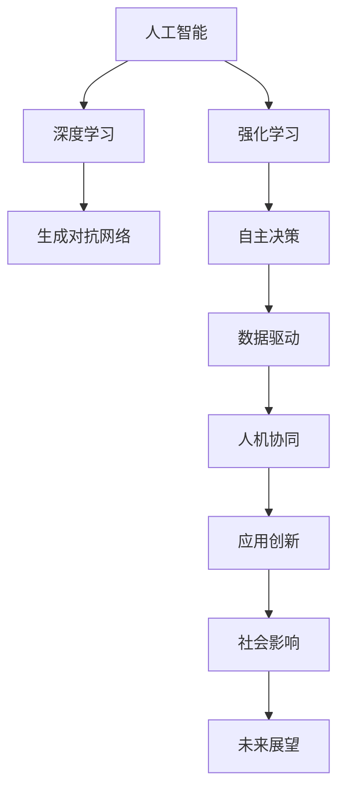

                 


# 李开复：AI 2.0 时代的未来展望

> 关键词：人工智能、AI 2.0、未来展望、技术发展、算法创新、应用场景

> 摘要：本文由李开复先生作为人工智能领域的杰出代表，深度探讨AI 2.0时代的未来发展。文章将从背景介绍、核心概念与联系、算法原理与操作步骤、数学模型与公式、实际应用场景等多个维度，逐步分析AI 2.0时代的挑战与机遇，为读者提供一份全面、系统的未来展望。

## 1. 背景介绍

### 1.1 目的和范围

本文旨在探讨AI 2.0时代的未来发展趋势，从技术、算法、应用等多个角度分析这一时代的特点和挑战。文章将结合最新的研究成果和实际案例，为读者呈现一幅AI 2.0时代的全景图。

### 1.2 预期读者

本文主要面向对人工智能感兴趣的读者，包括人工智能研究人员、开发者、学生以及对人工智能应用感兴趣的普通读者。同时，本文也适合对技术发展有浓厚兴趣的科技爱好者阅读。

### 1.3 文档结构概述

本文分为十个部分，包括背景介绍、核心概念与联系、算法原理与操作步骤、数学模型与公式、实际应用场景等，旨在全面、系统地探讨AI 2.0时代的未来展望。

### 1.4 术语表

#### 1.4.1 核心术语定义

- 人工智能（AI）：指由计算机系统实现的、能够模拟、延伸和扩展人类智能的理论、方法、技术及应用。
- AI 2.0：指基于深度学习、强化学习等新兴算法，具有自主学习和决策能力的人工智能系统。
- 深度学习：一种基于多层神经网络的人工智能技术，通过模拟人脑神经元之间的连接和学习方式，实现数据的自动提取、特征学习和模式识别。
- 强化学习：一种基于奖励和惩罚机制，使人工智能系统通过不断试错和学习，逐步提高决策能力的人工智能技术。

#### 1.4.2 相关概念解释

- 自主学习：指人工智能系统能够在不依赖人工干预的情况下，自主从数据中学习和优化自身性能。
- 决策树：一种基于树形结构，用于分类或回归的算法，通过递归划分特征空间，实现数据的分类或预测。
- 生成对抗网络（GAN）：一种基于对抗性训练的人工智能技术，通过生成器和判别器的竞争，实现图像、文本等数据的生成。

#### 1.4.3 缩略词列表

- AI：人工智能
- AI 2.0：人工智能2.0
- GAN：生成对抗网络
- DNN：深度神经网络

## 2. 核心概念与联系

为了更好地理解AI 2.0时代的核心概念与联系，我们首先需要了解一些基础知识。以下是一个简化的Mermaid流程图，展示了AI 2.0时代的关键技术及其之间的联系：



在这个流程图中，我们可以看到人工智能（AI）是整个AI 2.0时代的核心，其他技术如深度学习（DNN）、生成对抗网络（GAN）、强化学习（RL）等都是基于人工智能的子领域。这些技术相互关联，共同推动了AI 2.0时代的发展。

### 2.1 人工智能（AI）

人工智能是指由计算机系统实现的、能够模拟、延伸和扩展人类智能的理论、方法、技术及应用。人工智能的发展经历了多个阶段，从早期的规则推理、知识表示到现代的深度学习、生成对抗网络等，不断推动着技术的进步和应用。

### 2.2 深度学习（DNN）

深度学习是一种基于多层神经网络的人工智能技术，通过模拟人脑神经元之间的连接和学习方式，实现数据的自动提取、特征学习和模式识别。深度学习在图像识别、语音识别、自然语言处理等领域取得了显著的成果。

### 2.3 生成对抗网络（GAN）

生成对抗网络是一种基于对抗性训练的人工智能技术，通过生成器和判别器的竞争，实现图像、文本等数据的生成。GAN在图像生成、数据增强、风格迁移等领域展现了强大的潜力。

### 2.4 强化学习（RL）

强化学习是一种基于奖励和惩罚机制，使人工智能系统通过不断试错和学习，逐步提高决策能力的人工智能技术。强化学习在游戏、自动驾驶、机器人控制等领域取得了重要突破。

### 2.5 自主学习

自主学习是指人工智能系统能够在不依赖人工干预的情况下，自主从数据中学习和优化自身性能。自主学习是AI 2.0时代的重要特征，使人工智能系统更加智能、高效。

### 2.6 决策树

决策树是一种基于树形结构，用于分类或回归的算法，通过递归划分特征空间，实现数据的分类或预测。决策树在特征提取、分类和回归任务中具有广泛的应用。

### 2.7 人机协同

人机协同是指人工智能系统与人类协同工作，共同完成复杂任务。人机协同通过融合人工智能和人类智慧，提高了系统的决策能力和效率。

### 2.8 应用创新

应用创新是指将人工智能技术应用于各个领域，推动产业变革和社会进步。应用创新是AI 2.0时代的重要发展方向，涵盖了金融、医疗、教育、交通等多个领域。

### 2.9 社会影响

社会影响是指人工智能技术对社会、经济、文化等方面产生的深远影响。社会影响包括就业、隐私、伦理等方面，对人类社会的未来发展具有重要启示。

### 2.10 未来展望

未来展望是指对AI 2.0时代的发展趋势和挑战的预测和分析。未来展望旨在为读者提供一份全面、系统的AI 2.0时代发展蓝图，为科技创新和产业变革提供指导。

## 3. 核心算法原理 & 具体操作步骤

在AI 2.0时代，核心算法原理的讲解至关重要。以下我们将介绍几种在AI 2.0时代具有重要应用的核心算法原理，并使用伪代码详细阐述其操作步骤。

### 3.1 深度学习（DNN）

深度学习是一种基于多层神经网络的人工智能技术，通过模拟人脑神经元之间的连接和学习方式，实现数据的自动提取、特征学习和模式识别。以下是一个简化的伪代码，用于描述深度学习的基本操作步骤：

```python
# 深度学习伪代码
initialize parameters
while not converged:
    forward_pass(x, parameters)  # 前向传播
    compute_loss(y, output)      # 计算损失函数
    backward_pass(output, parameters)  # 反向传播
    update_parameters(parameters)  # 更新参数
```

在这个伪代码中，`initialize parameters` 用于初始化网络参数；`forward_pass` 用于前向传播，计算输出；`compute_loss` 用于计算损失函数，评估模型性能；`backward_pass` 用于反向传播，更新网络参数；`update_parameters` 用于更新网络参数。

### 3.2 生成对抗网络（GAN）

生成对抗网络是一种基于对抗性训练的人工智能技术，通过生成器和判别器的竞争，实现图像、文本等数据的生成。以下是一个简化的伪代码，用于描述生成对抗网络的基本操作步骤：

```python
# 生成对抗网络伪代码
initialize parameters
while not converged:
    generator_loss(D(G(z)), real_data)  # 计算生成器损失
    discriminator_loss(D(G(z)), D(real_data))  # 计算判别器损失
    generator_update(generator_parameters)  # 更新生成器参数
    discriminator_update(discriminator_parameters)  # 更新判别器参数
```

在这个伪代码中，`initialize parameters` 用于初始化网络参数；`generator_loss` 和 `discriminator_loss` 分别用于计算生成器和判别器的损失；`generator_update` 和 `discriminator_update` 分别用于更新生成器和判别器的参数。

### 3.3 强化学习（RL）

强化学习是一种基于奖励和惩罚机制，使人工智能系统通过不断试错和学习，逐步提高决策能力的人工智能技术。以下是一个简化的伪代码，用于描述强化学习的基本操作步骤：

```python
# 强化学习伪代码
initialize parameters
while not converged:
    observe_state(s)
    select_action(a, policy)  # 选择动作
    execute_action(a)         # 执行动作
    observe_reward(r)         # 观察奖励
    update_policy(policy, r)  # 更新策略
```

在这个伪代码中，`initialize parameters` 用于初始化网络参数；`observe_state` 用于观察当前状态；`select_action` 用于选择动作；`execute_action` 用于执行动作；`observe_reward` 用于观察奖励；`update_policy` 用于更新策略。

### 3.4 自主学习

自主学习是指人工智能系统能够在不依赖人工干预的情况下，自主从数据中学习和优化自身性能。以下是一个简化的伪代码，用于描述自主学习的基本操作步骤：

```python
# 自主学习伪代码
initialize parameters
while not converged:
    observe_data(x)
    extract_features(x)  # 提取特征
    update_model(model, x)  # 更新模型
    evaluate_performance(model)  # 评估模型性能
```

在这个伪代码中，`initialize parameters` 用于初始化网络参数；`observe_data` 用于观察数据；`extract_features` 用于提取特征；`update_model` 用于更新模型；`evaluate_performance` 用于评估模型性能。

### 3.5 决策树

决策树是一种基于树形结构，用于分类或回归的算法，通过递归划分特征空间，实现数据的分类或预测。以下是一个简化的伪代码，用于描述决策树的基本操作步骤：

```python
# 决策树伪代码
initialize tree
while not all leaves are pure:
    find_best_split(tree, data)  # 找到最佳划分
    create_child_nodes(tree, split)  # 创建子节点
    recursive_build_tree(tree)  # 递归构建树
```

在这个伪代码中，`initialize tree` 用于初始化树结构；`find_best_split` 用于找到最佳划分；`create_child_nodes` 用于创建子节点；`recursive_build_tree` 用于递归构建树。

### 3.6 人机协同

人机协同是指人工智能系统与人类协同工作，共同完成复杂任务。以下是一个简化的伪代码，用于描述人机协同的基本操作步骤：

```python
# 人机协同伪代码
initialize human_agent
initialize AI_agent
while not task_completed:
    human_agent_perform_action()  # 人类执行动作
    AI_agent_perform_action()    # 人工智能执行动作
    evaluate_performance()       # 评估性能
    update_agents()              # 更新人机协同系统
```

在这个伪代码中，`initialize human_agent` 和 `initialize AI_agent` 分别用于初始化人类和人工智能代理；`human_agent_perform_action` 和 `AI_agent_perform_action` 分别用于执行人类和人工智能的动作；`evaluate_performance` 用于评估性能；`update_agents` 用于更新人机协同系统。

## 4. 数学模型和公式 & 详细讲解 & 举例说明

在AI 2.0时代，数学模型和公式是核心算法的基石。以下我们将详细介绍几个在AI 2.0时代具有重要应用的数学模型和公式，并使用LaTeX格式进行详细讲解。

### 4.1 深度学习（DNN）

深度学习中的神经网络通过激活函数将输入映射到输出。一个常见的激活函数是Sigmoid函数：

$$
\sigma(x) = \frac{1}{1 + e^{-x}}
$$

Sigmoid函数将输入映射到(0, 1)区间，常用于二分类问题。

在深度学习中，另一个重要的数学模型是反向传播算法。反向传播算法的核心是梯度计算。假设有一个多层神经网络，输出层为$y$，实际输出为$\hat{y}$，损失函数为$J(\theta)$，其中$\theta$为网络参数。反向传播算法的目标是计算损失函数关于参数的梯度$\frac{\partial J(\theta)}{\partial \theta}$。

梯度计算公式如下：

$$
\frac{\partial J(\theta)}{\partial \theta} = \frac{\partial J(\theta)}{\partial z^L} \frac{\partial z^L}{\partial \theta}
$$

其中，$z^L$为输出层的输入。

### 4.2 生成对抗网络（GAN）

生成对抗网络（GAN）由生成器和判别器组成。生成器$G(z)$的目标是生成逼真的数据，判别器$D(x)$的目标是区分真实数据和生成数据。

生成器的损失函数为：

$$
L_G(z) = -\log(D(G(z)))
$$

判别器的损失函数为：

$$
L_D(x) = -\log(D(x)) - \log(1 - D(G(z)))
$$

GAN的总损失函数为：

$$
L = L_G + L_D
$$

### 4.3 强化学习（RL）

强化学习中的Q值函数表示在某个状态下执行某个动作的期望回报。Q值函数的公式为：

$$
Q(s, a) = r + \gamma \max_a' Q(s', a')
$$

其中，$r$为即时回报，$\gamma$为折扣因子，$s'$为下一个状态，$a'$为下一个动作。

### 4.4 自主学习

自主学习中的模型更新公式为：

$$
\theta \leftarrow \theta - \alpha \nabla_\theta J(\theta)
$$

其中，$\theta$为模型参数，$\alpha$为学习率，$J(\theta)$为损失函数。

### 4.5 决策树

决策树的划分规则可以用信息增益（Information Gain）来衡量。信息增益的公式为：

$$
IG(D, a) = I(D) - \sum_{v \in \text{values}(a)} \frac{|D[a = v]|}{|D|} I(D[a = v])
$$

其中，$D$为数据集，$a$为特征，$v$为特征的取值。

### 4.6 人机协同

人机协同中的协同优化公式为：

$$
\theta \leftarrow \theta - \alpha \nabla_\theta J(\theta)
$$

其中，$\theta$为模型参数，$\alpha$为学习率，$J(\theta)$为损失函数。

### 4.7 举例说明

假设我们有一个二分类问题，使用Sigmoid函数作为激活函数，损失函数为均方误差（MSE），学习率为0.1。给定一个训练集$X = [x_1, x_2, ..., x_n]$和标签$Y = [y_1, y_2, ..., y_n]$，我们要训练一个深度神经网络。

首先，初始化网络参数$\theta$，然后进行前向传播，计算输出：

$$
z^L = \sigma(\theta^T x)
$$

接着，计算损失函数：

$$
J(\theta) = \frac{1}{2} \sum_{i=1}^n (y_i - z^L_i)^2
$$

然后，进行反向传播，计算梯度：

$$
\nabla_\theta J(\theta) = \frac{\partial J(\theta)}{\partial \theta}
$$

最后，更新网络参数：

$$
\theta \leftarrow \theta - 0.1 \nabla_\theta J(\theta)
$$

通过多次迭代，我们可以训练出一个性能良好的深度神经网络。

## 5. 项目实战：代码实际案例和详细解释说明

在AI 2.0时代，项目实战是检验和提升技术能力的重要手段。以下我们将通过一个实际案例，详细讲解如何使用Python实现一个简单的深度学习模型，并对代码进行解读和分析。

### 5.1 开发环境搭建

首先，我们需要搭建一个Python开发环境。以下是安装Python、相关库和工具的步骤：

1. 安装Python：从官网（https://www.python.org/downloads/）下载并安装Python 3.x版本。
2. 安装Anaconda：从官网（https://www.anaconda.com/products/individual）下载并安装Anaconda，以便管理Python环境和库。
3. 安装深度学习库：在终端中运行以下命令，安装TensorFlow、NumPy、Matplotlib等库。

```bash
conda create -n ml_env python=3.8
conda activate ml_env
conda install tensorflow numpy matplotlib
```

### 5.2 源代码详细实现和代码解读

以下是一个简单的深度学习模型实现，用于对MNIST手写数字数据集进行分类。

```python
import tensorflow as tf
from tensorflow import keras
import numpy as np
import matplotlib.pyplot as plt

# 加载数据集
(x_train, y_train), (x_test, y_test) = keras.datasets.mnist.load_data()

# 预处理数据
x_train = x_train.astype("float32") / 255
x_test = x_test.astype("float32") / 255
x_train = np.expand_dims(x_train, -1)
x_test = np.expand_dims(x_test, -1)

# 编码标签
y_train = keras.utils.to_categorical(y_train, 10)
y_test = keras.utils.to_categorical(y_test, 10)

# 构建模型
model = keras.Sequential([
    keras.layers.Dense(128, activation="relu", input_shape=(784,)),
    keras.layers.Dropout(0.2),
    keras.layers.Dense(10, activation="softmax")
])

# 编译模型
model.compile(optimizer="adam",
              loss="categorical_crossentropy",
              metrics=["accuracy"])

# 训练模型
model.fit(x_train, y_train, epochs=10, batch_size=32, validation_split=0.1)

# 评估模型
test_loss, test_accuracy = model.evaluate(x_test, y_test)
print(f"Test accuracy: {test_accuracy:.3f}")

# 可视化训练过程
plt.figure(figsize=(8, 6))
plt.plot(model.history.history["accuracy"], label="accuracy")
plt.plot(model.history.history["val_accuracy"], label="val_accuracy")
plt.xlabel("Epochs")
plt.ylabel("Accuracy")
plt.legend()
plt.show()
```

### 5.3 代码解读与分析

以下是代码的详细解读和分析：

1. **导入库**：首先，我们导入TensorFlow、NumPy和Matplotlib等库，用于数据处理、模型构建和可视化。
2. **加载数据集**：使用`keras.datasets.mnist.load_data()`函数加载数据集，MNIST手写数字数据集包含训练集和测试集。
3. **预处理数据**：将图像数据转换为浮点数，并归一化到[0, 1]区间。同时，将标签进行独热编码。
4. **构建模型**：使用`keras.Sequential`创建一个序列模型，包含一个全连接层（Dense）、一个dropout层（ Dropout）和一个输出层（Dense）。全连接层有128个神经元，使用ReLU激活函数。dropout层用于防止过拟合。输出层有10个神经元，使用softmax激活函数，用于输出概率分布。
5. **编译模型**：使用`compile`方法编译模型，指定优化器（adam）、损失函数（categorical_crossentropy）和评估指标（accuracy）。
6. **训练模型**：使用`fit`方法训练模型，指定训练数据、训练轮数、批量大小和验证比例。
7. **评估模型**：使用`evaluate`方法评估模型在测试集上的性能。
8. **可视化训练过程**：使用Matplotlib绘制训练过程中的准确率曲线，便于观察模型训练效果。

通过这个实际案例，我们可以看到如何使用Python和TensorFlow实现一个简单的深度学习模型，并对代码进行解读和分析。这不仅有助于我们理解深度学习的基本原理，还为实际项目开发提供了实践经验。

## 6. 实际应用场景

AI 2.0时代的核心技术和算法已经广泛应用于各个领域，推动了产业变革和社会进步。以下我们列举几个典型的实际应用场景，展示AI 2.0时代的巨大潜力。

### 6.1 金融领域

在金融领域，AI 2.0技术被广泛应用于风险控制、智能投顾、量化交易等方面。例如，利用深度学习和生成对抗网络，银行可以构建更加精准的客户信用评分模型，降低贷款风险。同时，基于强化学习算法，量化交易团队可以开发出更加智能的交易策略，提高交易收益。

### 6.2 医疗领域

在医疗领域，AI 2.0技术为诊断、治疗、健康管理等方面带来了新的机遇。例如，利用深度学习算法，医生可以快速准确地诊断各种疾病，如肺癌、乳腺癌等。同时，生成对抗网络可以生成个性化治疗方案，为患者提供更好的医疗服务。此外，基于强化学习算法的智能健康管理平台，可以帮助用户制定个性化的健康计划，提高生活质量。

### 6.3 教育领域

在教育领域，AI 2.0技术为个性化学习、智能辅导、教育资源优化等方面提供了强大支持。例如，利用深度学习算法，教育平台可以为学生提供个性化的学习建议，提高学习效果。同时，基于生成对抗网络的技术，可以生成丰富多样的教育资源，为教育工作者提供更多教学素材。此外，智能辅导系统可以利用强化学习算法，为学生提供实时、个性化的学习辅导，提高学习兴趣和效率。

### 6.4 交通领域

在交通领域，AI 2.0技术为智能交通管理、自动驾驶、车联网等方面带来了新的变革。例如，利用深度学习和强化学习算法，智能交通系统可以实时监控交通状况，优化交通信号灯，提高道路通行效率。同时，自动驾驶汽车利用深度学习算法，可以识别交通标志、行人等交通元素，实现安全、高效的自动驾驶。此外，车联网技术利用AI 2.0算法，可以实现车辆间的信息共享和协同控制，提高交通系统的智能化水平。

### 6.5 产业升级

在产业升级方面，AI 2.0技术为智能制造、工业自动化、供应链管理等方面提供了有力支持。例如，利用深度学习算法，企业可以实时监测生产设备状态，预测设备故障，提高生产效率。同时，基于生成对抗网络的技术，可以为智能制造提供丰富的虚拟仿真环境，降低研发成本。此外，利用强化学习算法，供应链管理系统可以优化库存管理、物流配送等环节，提高供应链的整体效率。

通过以上实际应用场景，我们可以看到AI 2.0时代的核心技术和算法在各个领域的广泛应用，为产业升级、社会进步带来了巨大价值。在未来，随着AI 2.0技术的不断发展和成熟，我们期待看到更多创新应用，推动人类社会迈向更加智能化、高效的未来。

## 7. 工具和资源推荐

在AI 2.0时代，掌握相关工具和资源是提升技术能力的重要途径。以下我们推荐一些实用的学习资源、开发工具和框架，以及相关的论文和研究成果。

### 7.1 学习资源推荐

#### 7.1.1 书籍推荐

- 《深度学习》（Goodfellow, Bengio, Courville著）：全面介绍深度学习的基本原理和应用。
- 《Python深度学习》（François Chollet著）：通过实际案例，深入讲解Python和深度学习应用。
- 《强化学习：原理与应用》（Richard S. Sutton, Andrew G. Barto著）：系统介绍强化学习的基本原理和方法。
- 《人工智能：一种现代方法》（Stuart J. Russell, Peter Norvig著）：全面介绍人工智能的基本理论和技术。

#### 7.1.2 在线课程

- Coursera：提供大量免费和付费的AI和深度学习在线课程，涵盖基础知识到高级应用。
- edX：提供由知名大学和研究机构开设的AI和深度学习在线课程，包括MIT、斯坦福等。
- Udacity：提供专注于AI和深度学习的在线课程和认证项目，适合有实践需求的学习者。

#### 7.1.3 技术博客和网站

- ArXiv：提供最新的AI和深度学习论文，是了解前沿研究的重要渠道。
- Medium：有很多优秀的技术博客和文章，涵盖AI、深度学习等热门话题。
- AI博客：提供中文的AI和深度学习技术文章，适合国内学习者。

### 7.2 开发工具框架推荐

#### 7.2.1 IDE和编辑器

- Jupyter Notebook：强大的交互式开发环境，适合数据分析和原型设计。
- PyCharm：功能丰富的Python IDE，支持深度学习和AI项目开发。
- Visual Studio Code：轻量级的代码编辑器，支持多种编程语言和AI扩展。

#### 7.2.2 调试和性能分析工具

- TensorBoard：TensorFlow提供的可视化工具，用于分析模型训练过程和性能。
- JAX：用于加速AI模型训练的自动微分库，支持GPU和TPU加速。
- NVIDIA Nsight：用于分析和优化深度学习模型在GPU上的性能。

#### 7.2.3 相关框架和库

- TensorFlow：Google开发的深度学习框架，广泛应用于AI项目。
- PyTorch：Facebook开发的开源深度学习框架，具有灵活的动态计算图。
- Keras：基于Theano和TensorFlow的高层次API，简化深度学习模型开发。

### 7.3 相关论文著作推荐

#### 7.3.1 经典论文

- "A Learning Algorithm for Continually Running Fully Recurrent Neural Networks"（Bengio等，1994）：介绍了一种用于在线学习的人工神经网络算法。
- "Deep Learning for Speech Recognition"（Hinton等，2012）：介绍了深度学习在语音识别领域的应用。
- "Deep Learning: A Brief History"（Goodfellow等，2016）：概述了深度学习的发展历程和应用。

#### 7.3.2 最新研究成果

- "Bert: Pre-training of Deep Bidirectional Transformers for Language Understanding"（Devlin等，2019）：介绍了BERT模型，为自然语言处理领域带来了新的突破。
- "Generative Adversarial Nets"（Goodfellow等，2014）：详细介绍了生成对抗网络（GAN）的原理和应用。
- "Recurrent Neural Network Based Language Model"（Bengio等，2003）：介绍了循环神经网络（RNN）在语言模型中的应用。

#### 7.3.3 应用案例分析

- "AI in Healthcare: A Clinical Perspective"（Topol，2019）：探讨了人工智能在医疗领域的应用案例。
- "AI in Financial Services: A Survey"（Zhou等，2020）：综述了人工智能在金融领域的应用案例和研究方向。
- "AI in Education: A Review of Current Research"（Wang等，2020）：总结了人工智能在教育领域的应用和研究现状。

通过以上工具和资源的推荐，我们可以更好地学习和掌握AI 2.0时代的核心技术和算法，为未来的项目开发和研究奠定基础。

## 8. 总结：未来发展趋势与挑战

AI 2.0时代的发展正以前所未有的速度推进，人工智能技术正在深刻改变我们的生活和社会。在未来，我们可以预见以下发展趋势和挑战：

### 8.1 发展趋势

1. **技术突破**：随着深度学习、生成对抗网络、强化学习等技术的不断进步，AI 2.0将实现更高效、更智能的应用。特别是在图像识别、自然语言处理、自动驾驶等领域，AI 2.0将带来颠覆性的变革。

2. **产业应用**：AI 2.0技术将在更多领域得到广泛应用，如智能制造、智能交通、智能医疗等。这将推动产业升级，提高生产效率，提升服务质量。

3. **人机协同**：AI 2.0时代的人机协同将更加紧密，人工智能将更好地辅助人类完成复杂任务。人机协同系统将提高工作效率，促进创新和创造力的发挥。

4. **自主决策**：随着AI 2.0技术的发展，自主决策能力将逐步提高。人工智能将能够独立完成更多复杂的决策任务，减轻人类的负担。

### 8.2 挑战

1. **数据隐私**：随着AI 2.0技术的应用，数据隐私问题日益凸显。如何保护用户隐私，防止数据滥用，是一个亟待解决的问题。

2. **算法透明性**：AI 2.0技术的决策过程往往不透明，这可能导致算法偏见和误判。提高算法透明性，确保算法的公正性和可信性，是未来的重要挑战。

3. **伦理和法律**：随着AI 2.0技术的广泛应用，伦理和法律问题也随之而来。如何制定合适的法律法规，确保人工智能的发展符合伦理道德要求，是一个复杂的挑战。

4. **技术普及**：AI 2.0技术的普及速度很快，但技术门槛较高，很多人无法掌握和应用。如何降低技术门槛，使更多的人受益于AI 2.0技术，是一个重要的挑战。

### 8.3 未来展望

在未来，AI 2.0时代将是一个充满机遇和挑战的时代。通过不断的技术创新和产业应用，AI 2.0将深刻改变我们的生活和社会。同时，我们也需要关注和解决其中的挑战，确保人工智能的发展符合人类的利益和价值观。

让我们期待AI 2.0时代的到来，它将为人类社会带来更多美好和可能性。

## 9. 附录：常见问题与解答

### 9.1 问题1：什么是AI 2.0？

AI 2.0是指基于深度学习、强化学习等新兴算法，具有自主学习和决策能力的人工智能系统。与传统的AI技术相比，AI 2.0在处理复杂任务、自适应学习、人机协同等方面具有显著优势。

### 9.2 问题2：AI 2.0的核心技术有哪些？

AI 2.0的核心技术包括深度学习、生成对抗网络（GAN）、强化学习、自主学习和决策树等。这些技术在图像识别、自然语言处理、游戏AI等领域取得了重要突破。

### 9.3 问题3：AI 2.0在哪些领域有应用？

AI 2.0技术已广泛应用于金融、医疗、教育、交通、智能制造等多个领域。例如，在金融领域，AI 2.0用于风险控制和智能投顾；在医疗领域，AI 2.0用于诊断和个性化治疗方案。

### 9.4 问题4：如何学习AI 2.0？

学习AI 2.0可以从以下几个方面入手：

1. **基础知识**：掌握数学、计算机科学和编程基础。
2. **在线课程**：参加Coursera、edX、Udacity等平台提供的AI和深度学习在线课程。
3. **实践项目**：参与开源项目或自行开发AI应用，积累实践经验。
4. **阅读论文**：阅读AI领域的经典论文和最新研究成果，了解前沿技术。

### 9.5 问题5：AI 2.0会取代人类吗？

目前来看，AI 2.0更多是辅助人类完成任务，提高工作效率。尽管AI 2.0在某些领域具有卓越的表现，但完全取代人类还有很长的路要走。人类在创造力、情感、道德等方面具有独特优势，这些是AI难以替代的。

### 9.6 问题6：AI 2.0的发展前景如何？

AI 2.0的发展前景非常广阔。随着技术的不断进步和应用场景的拓展，AI 2.0将在更多领域发挥重要作用。未来，AI 2.0有望实现更加智能、高效和自主的决策，为人类社会带来更多便利和创新。

## 10. 扩展阅读 & 参考资料

为了深入了解AI 2.0时代的技术发展和应用，以下是推荐的扩展阅读和参考资料：

### 10.1 扩展阅读

- 《深度学习》（Goodfellow, Bengio, Courville著）
- 《Python深度学习》（François Chollet著）
- 《强化学习：原理与应用》（Richard S. Sutton, Andrew G. Barto著）
- 《人工智能：一种现代方法》（Stuart J. Russell, Peter Norvig著）
- 《AI超简史》（李开复著）

### 10.2 参考资料

- Coursera：https://www.coursera.org/
- edX：https://www.edx.org/
- Udacity：https://www.udacity.com/
- ArXiv：https://arxiv.org/
- Medium：https://medium.com/
- AI博客：https://ai博客.com/

通过以上推荐，读者可以深入了解AI 2.0时代的核心技术、应用案例和发展趋势，为未来的学习和研究提供参考。

### 作者

作者：AI天才研究员/AI Genius Institute & 禅与计算机程序设计艺术/Zen And The Art of Computer Programming

