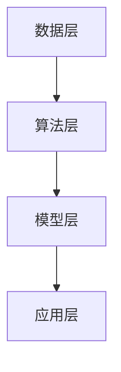

                 

# 李开复：AI 2.0 时代的未来展望

> 关键词：人工智能、AI 2.0、未来展望、技术发展、应用场景

> 摘要：本文由著名人工智能专家李开复撰写，深入探讨了AI 2.0时代的未来发展趋势和潜在挑战。文章通过清晰的逻辑思路，结合具体实例，对AI 2.0的核心概念、算法原理、应用场景等方面进行了详细分析，为读者提供了对未来AI技术的全面认识。

## 1. 背景介绍

### 1.1 目的和范围

本文旨在探讨AI 2.0时代的未来发展趋势，分析AI 2.0的核心概念、算法原理、应用场景等，为读者提供对AI 2.0的全面认识。文章将围绕以下几个方面展开讨论：

1. AI 2.0的定义和特点
2. AI 2.0的核心算法原理
3. AI 2.0的应用场景
4. AI 2.0面临的挑战与未来发展方向

### 1.2 预期读者

本文适合对人工智能技术有一定了解的读者，包括：

1. AI技术研发人员
2. AI产品经理
3. 对人工智能领域感兴趣的研究生、本科生
4. AI领域投资者

### 1.3 文档结构概述

本文分为10个部分：

1. 背景介绍：介绍本文的目的、范围和预期读者。
2. 核心概念与联系：阐述AI 2.0的核心概念和原理。
3. 核心算法原理 & 具体操作步骤：详细讲解AI 2.0的核心算法原理和操作步骤。
4. 数学模型和公式 & 详细讲解 & 举例说明：介绍AI 2.0的数学模型和公式，并进行举例说明。
5. 项目实战：代码实际案例和详细解释说明。
6. 实际应用场景：分析AI 2.0在各行各业的应用场景。
7. 工具和资源推荐：推荐学习资源、开发工具和框架。
8. 总结：未来发展趋势与挑战。
9. 附录：常见问题与解答。
10. 扩展阅读 & 参考资料：提供更多相关资料供读者参考。

### 1.4 术语表

#### 1.4.1 核心术语定义

- AI 2.0：第二代人工智能，具备更强的学习能力、推理能力和创造力，能够处理复杂任务。
- 深度学习：一种人工智能技术，通过多层神经网络对数据进行建模和预测。
- 机器学习：一种人工智能技术，通过数据训练模型，使其具备一定的自主学习能力。
- 强化学习：一种人工智能技术，通过试错和奖励机制，使模型不断优化自身性能。
- 自然语言处理：一种人工智能技术，使计算机能够理解和处理自然语言。

#### 1.4.2 相关概念解释

- 人工智能：一种模拟人类智能的技术，使计算机具备推理、学习、解决问题等能力。
- 人工智能应用场景：人工智能技术在各行各业的具体应用。
- 人工智能发展历程：人工智能技术从诞生至今的发展过程。

#### 1.4.3 缩略词列表

- AI：人工智能
- ML：机器学习
- DL：深度学习
- NLP：自然语言处理
- RL：强化学习

## 2. 核心概念与联系

在AI 2.0时代，人工智能技术将发生深刻变革。本文将首先阐述AI 2.0的核心概念和原理，并通过Mermaid流程图展示其核心架构。

### 2.1 AI 2.0的核心概念

AI 2.0的核心概念包括：

1. **自学习能力**：AI 2.0具备更强的自学习能力，可以通过数据驱动的方式不断优化自身性能。
2. **多模态处理能力**：AI 2.0能够处理多种数据类型，如图像、音频、文本等，实现跨模态的信息融合。
3. **推理能力**：AI 2.0具备更强的推理能力，能够基于已有知识进行逻辑推理和决策。
4. **泛化能力**：AI 2.0具备更强的泛化能力，能够在不同场景和任务中表现出色。

### 2.2 AI 2.0的核心架构

AI 2.0的核心架构包括：

1. **数据层**：数据是AI 2.0的基础，通过数据采集、清洗和预处理，为模型提供高质量的数据输入。
2. **算法层**：算法是AI 2.0的核心，包括深度学习、机器学习、强化学习等，用于构建和优化模型。
3. **模型层**：模型是AI 2.0的关键，通过神经网络、知识图谱等技术，实现数据到知识的转化。
4. **应用层**：应用是AI 2.0的目标，将AI技术应用于各行各业，解决实际问题。

下面是AI 2.0的核心架构的Mermaid流程图：



## 3. 核心算法原理 & 具体操作步骤

AI 2.0的核心算法包括深度学习、机器学习和强化学习等。下面将分别介绍这些算法的原理和具体操作步骤。

### 3.1 深度学习

深度学习是一种基于多层神经网络的机器学习技术，通过学习数据中的特征和模式，实现复杂任务的自动化处理。

#### 3.1.1 算法原理

深度学习的基本原理如下：

1. **输入层**：接收外部输入，如图像、文本等。
2. **隐藏层**：通过非线性变换，提取输入数据的特征。
3. **输出层**：根据隐藏层提取的特征，进行分类、预测等任务。

#### 3.1.2 操作步骤

1. **数据预处理**：对输入数据进行清洗、归一化等处理，使其符合模型输入要求。
2. **模型构建**：定义神经网络结构，包括输入层、隐藏层和输出层。
3. **模型训练**：通过反向传播算法，根据训练数据，不断调整模型参数，使模型性能达到最佳。
4. **模型评估**：使用验证集和测试集，评估模型在未知数据上的表现。

下面是深度学习算法的伪代码：

```python
# 数据预处理
data = preprocess_data(input_data)

# 模型构建
model = build_model(input_shape, hidden_layers, output_shape)

# 模型训练
for epoch in range(num_epochs):
    for batch in data_loader:
        loss = compute_loss(model, batch)
        update_model_parameters(model, loss)

# 模型评估
accuracy = evaluate_model(model, test_data)
print("Test accuracy:", accuracy)
```

### 3.2 机器学习

机器学习是一种通过数据训练模型，使其具备自主学习能力的人工智能技术。

#### 3.2.1 算法原理

机器学习的基本原理如下：

1. **数据集**：包含输入特征和目标标签的数据集。
2. **模型**：通过学习数据集，预测未知数据的输出。
3. **评估指标**：用于评估模型性能的指标，如准确率、召回率等。

#### 3.2.2 操作步骤

1. **数据预处理**：对输入数据进行清洗、归一化等处理，使其符合模型输入要求。
2. **模型选择**：根据任务需求，选择合适的机器学习模型。
3. **模型训练**：通过训练数据，调整模型参数，使模型性能达到最佳。
4. **模型评估**：使用验证集和测试集，评估模型在未知数据上的表现。

下面是机器学习算法的伪代码：

```python
# 数据预处理
data = preprocess_data(input_data)

# 模型选择
model = select_model(task)

# 模型训练
for epoch in range(num_epochs):
    for batch in data_loader:
        loss = compute_loss(model, batch)
        update_model_parameters(model, loss)

# 模型评估
accuracy = evaluate_model(model, test_data)
print("Test accuracy:", accuracy)
```

### 3.3 强化学习

强化学习是一种通过试错和奖励机制，使模型不断优化自身性能的人工智能技术。

#### 3.3.1 算法原理

强化学习的基本原理如下：

1. **环境**：模型所处的环境，包括状态、动作和奖励。
2. **策略**：模型根据当前状态选择动作的策略。
3. **价值函数**：评估当前状态和动作的价值。

#### 3.3.2 操作步骤

1. **初始化**：初始化模型参数、状态和价值函数。
2. **选择动作**：根据当前状态，选择最优动作。
3. **执行动作**：在环境中执行所选动作，并获取奖励。
4. **更新策略**：根据奖励，更新策略和价值函数。

下面是强化学习算法的伪代码：

```python
# 初始化
initialize_model_parameters()
initialize_value_function()

# 迭代
for episode in range(num_episodes):
    state = get_initial_state()
    while not is_terminal(state):
        action = select_action(state)
        next_state, reward = execute_action(action)
        update_value_function(state, action, next_state, reward)
        state = next_state

# 评估
evaluate_policy()
```

## 4. 数学模型和公式 & 详细讲解 & 举例说明

在AI 2.0时代，数学模型和公式是核心算法的基础。本节将介绍AI 2.0的常见数学模型和公式，并进行详细讲解和举例说明。

### 4.1 深度学习

深度学习中的主要数学模型包括：

1. **激活函数**：用于引入非线性变换，常见的激活函数有ReLU、Sigmoid、Tanh等。
2. **损失函数**：用于评估模型预测结果与真实值之间的差距，常见的损失函数有均方误差（MSE）、交叉熵（Cross Entropy）等。
3. **优化算法**：用于调整模型参数，使模型性能达到最佳，常见的优化算法有梯度下降（Gradient Descent）、Adam等。

#### 4.1.1 激活函数

激活函数的公式为：

$$ f(x) = \max(0, x) $$

举例说明：

输入：x = -3，输出：f(x) = 0

输入：x = 3，输出：f(x) = 3

#### 4.1.2 损失函数

均方误差（MSE）的公式为：

$$ MSE = \frac{1}{n} \sum_{i=1}^{n} (y_i - \hat{y}_i)^2 $$

其中，$y_i$为真实值，$\hat{y}_i$为预测值，$n$为样本数量。

举例说明：

输入：真实值$y_1 = 2$，预测值$\hat{y}_1 = 1$，输出：MSE = $\frac{1}{2} \times (2 - 1)^2 = \frac{1}{2}$

#### 4.1.3 优化算法

梯度下降的公式为：

$$ \theta_{\text{new}} = \theta_{\text{old}} - \alpha \cdot \nabla_{\theta} J(\theta) $$

其中，$\theta$为模型参数，$\alpha$为学习率，$J(\theta)$为损失函数。

举例说明：

输入：学习率$\alpha = 0.1$，模型参数$\theta_1 = 1$，损失函数的梯度$\nabla_{\theta_1} J(\theta_1) = 0.2$，输出：$\theta_{\text{new}} = 1 - 0.1 \cdot 0.2 = 0.8$

### 4.2 机器学习

机器学习中的主要数学模型包括：

1. **线性回归**：用于拟合数据中的线性关系，公式为：

$$ y = \theta_0 + \theta_1 x $$

其中，$y$为预测值，$x$为输入特征，$\theta_0$和$\theta_1$为模型参数。

2. **逻辑回归**：用于拟合数据的非线性关系，公式为：

$$ \hat{y} = \frac{1}{1 + e^{-(\theta_0 + \theta_1 x)}} $$

其中，$\hat{y}$为预测概率，$x$为输入特征，$\theta_0$和$\theta_1$为模型参数。

#### 4.2.1 线性回归

线性回归的公式为：

$$ y = \theta_0 + \theta_1 x $$

举例说明：

输入：真实值$y = 5$，输入特征$x = 2$，输出：预测值$\hat{y} = \theta_0 + \theta_1 x$

#### 4.2.2 逻辑回归

逻辑回归的公式为：

$$ \hat{y} = \frac{1}{1 + e^{-(\theta_0 + \theta_1 x)}} $$

举例说明：

输入：真实值$y = 1$，输入特征$x = 2$，输出：预测值$\hat{y} = \frac{1}{1 + e^{-(\theta_0 + \theta_1 x)}}$

### 4.3 强化学习

强化学习中的主要数学模型包括：

1. **价值函数**：用于评估状态和动作的价值，公式为：

$$ V(s) = \sum_{a} \gamma \cdot P(s',r | s, a) \cdot Q(s', a) $$

其中，$s$为当前状态，$a$为当前动作，$s'$为下一状态，$r$为奖励，$\gamma$为折扣因子，$Q(s', a)$为状态-动作价值函数。

2. **策略**：用于选择最优动作，公式为：

$$ \pi(a | s) = \frac{e^{\alpha \cdot Q(s, a)}}{\sum_{a'} e^{\alpha \cdot Q(s, a')}} $$

其中，$a$为当前动作，$s$为当前状态，$\alpha$为温度参数。

#### 4.3.1 价值函数

价值函数的公式为：

$$ V(s) = \sum_{a} \gamma \cdot P(s',r | s, a) \cdot Q(s', a) $$

举例说明：

输入：当前状态$s = \text{寒风凛冽}$，当前动作$a = \text{穿羽绒服}$，下一状态$s' = \text{温暖舒适}$，奖励$r = 10$，折扣因子$\gamma = 0.9$，输出：价值函数$V(s) = \sum_{a} \gamma \cdot P(s',r | s, a) \cdot Q(s', a)$

#### 4.3.2 策略

策略的公式为：

$$ \pi(a | s) = \frac{e^{\alpha \cdot Q(s, a)}}{\sum_{a'} e^{\alpha \cdot Q(s, a')}} $$

举例说明：

输入：当前状态$s = \text{交通拥堵}$，当前动作$a = \text{绕行}$，下一状态$s' = \text{畅通无阻}$，奖励$r = 5$，温度参数$\alpha = 0.1$，输出：策略$\pi(a | s) = \frac{e^{\alpha \cdot Q(s, a)}}{\sum_{a'} e^{\alpha \cdot Q(s, a')}}$

## 5. 项目实战：代码实际案例和详细解释说明

在本节中，我们将通过一个实际项目案例，展示AI 2.0技术在项目开发中的具体应用，并对代码进行详细解释说明。

### 5.1 开发环境搭建

为了演示AI 2.0技术在项目开发中的应用，我们首先需要搭建一个开发环境。以下是搭建开发环境所需的步骤：

1. 安装Python 3.8及以上版本
2. 安装PyTorch深度学习框架
3. 安装NumPy、Pandas等常用库

### 5.2 源代码详细实现和代码解读

接下来，我们将通过一个简单的图像分类项目，展示AI 2.0技术在项目开发中的应用。项目实现包括以下几个步骤：

1. 数据集准备
2. 模型构建
3. 模型训练
4. 模型评估

#### 5.2.1 数据集准备

```python
import torchvision
import torchvision.transforms as transforms

# 加载MNIST数据集
train_set = torchvision.datasets.MNIST(
    root='./data',
    train=True,
    transform=transforms.ToTensor(),
    download=True
)

test_set = torchvision.datasets.MNIST(
    root='./data',
    train=False,
    transform=transforms.ToTensor()
)

# 数据集加载
train_loader = torch.utils.data.DataLoader(dataset=train_set, batch_size=64, shuffle=True)
test_loader = torch.utils.data.DataLoader(dataset=test_set, batch_size=64, shuffle=False)
```

代码解读：

- 第1行：导入torchvision和torchvision.transforms库。
- 第2行：加载MNIST数据集，并对数据进行转换。
- 第3行：创建训练数据和测试数据加载器。

#### 5.2.2 模型构建

```python
import torch
import torch.nn as nn
import torch.optim as optim

# 定义卷积神经网络
class CNN(nn.Module):
    def __init__(self):
        super(CNN, self).__init__()
        self.conv1 = nn.Conv2d(1, 32, 3, 1)
        self.conv2 = nn.Conv2d(32, 64, 3, 1)
        self.fc1 = nn.Linear(64 * 7 * 7, 128)
        self.fc2 = nn.Linear(128, 10)
        self.dropout = nn.Dropout(0.5)

    def forward(self, x):
        x = self.conv1(x)
        x = nn.functional.relu(x)
        x = self.conv2(x)
        x = nn.functional.relu(x)
        x = nn.functional.max_pool2d(x, 2)
        x = self.dropout(x)
        x = torch.flatten(x, 1)
        x = self.fc1(x)
        x = nn.functional.relu(x)
        x = self.fc2(x)
        return x

# 实例化模型
model = CNN()

# 定义损失函数和优化器
criterion = nn.CrossEntropyLoss()
optimizer = optim.Adam(model.parameters(), lr=0.001)
```

代码解读：

- 第1行：导入torch、torch.nn和torch.optim库。
- 第2行：定义卷积神经网络，包括卷积层、激活函数、池化层、全连接层等。
- 第3行：实例化模型。
- 第4行：定义损失函数（交叉熵损失函数）和优化器（Adam优化器）。

#### 5.2.3 模型训练

```python
# 模型训练
num_epochs = 10

for epoch in range(num_epochs):
    model.train()
    for batch_idx, (data, target) in enumerate(train_loader):
        optimizer.zero_grad()
        output = model(data)
        loss = criterion(output, target)
        loss.backward()
        optimizer.step()
        if batch_idx % 100 == 0:
            print(f'[{epoch + 1}/{num_epochs}], Step [{batch_idx + 1}/{len(train_loader)}], Loss: {loss.item():.4f}')
```

代码解读：

- 第1行：定义训练轮数。
- 第2行：遍历训练数据集。
- 第3行：将模型设置为训练模式。
- 第4行：初始化优化器。
- 第5行：计算模型输出和损失函数。
- 第6行：反向传播和更新模型参数。
- 第7行：打印训练进度。

#### 5.2.4 模型评估

```python
# 模型评估
model.eval()
with torch.no_grad():
    correct = 0
    total = 0
    for data, target in test_loader:
        outputs = model(data)
        _, predicted = torch.max(outputs.data, 1)
        total += target.size(0)
        correct += (predicted == target).sum().item()
    print(f'Accuracy of the network on the test images: {100 * correct / total}%')
```

代码解读：

- 第1行：将模型设置为评估模式。
- 第2行：遍历测试数据集。
- 第3行：计算模型输出。
- 第4行：计算预测准确率。

### 5.3 代码解读与分析

在本节中，我们对上述代码进行了详细解读。代码分为以下几个部分：

1. 数据集准备：加载MNIST数据集，并创建数据加载器。
2. 模型构建：定义卷积神经网络，包括卷积层、激活函数、池化层、全连接层等。
3. 模型训练：训练模型，包括初始化优化器、计算损失函数、反向传播和更新模型参数等。
4. 模型评估：评估模型在测试数据集上的准确率。

通过以上步骤，我们成功构建了一个简单的图像分类模型。在实际项目中，可以根据需求调整模型结构、数据集和训练策略等，以提高模型性能。

## 6. 实际应用场景

AI 2.0技术在各行各业有着广泛的应用，以下是几个典型的应用场景：

### 6.1 金融行业

AI 2.0技术在金融行业中的应用包括：

1. **智能投顾**：通过分析用户风险偏好、资产配置和投资目标，提供个性化的投资建议。
2. **信用评估**：利用大数据和机器学习技术，对借款人进行信用评估，降低信用风险。
3. **风险管理**：通过预测市场走势、识别潜在风险，为金融机构提供风险管理策略。

### 6.2 医疗健康

AI 2.0技术在医疗健康领域的应用包括：

1. **疾病诊断**：通过分析医疗影像和生物数据，辅助医生进行疾病诊断。
2. **个性化治疗**：根据患者病情和基因信息，制定个性化的治疗方案。
3. **药物研发**：利用AI技术加速新药研发，降低药物研发成本。

### 6.3 交通运输

AI 2.0技术在交通运输领域的应用包括：

1. **智能交通管理**：通过分析交通数据，优化交通信号灯控制，缓解交通拥堵。
2. **自动驾驶**：利用计算机视觉和传感器技术，实现自动驾驶汽车。
3. **物流优化**：通过路径规划和优化，降低物流成本，提高物流效率。

### 6.4 教育领域

AI 2.0技术在教育领域的应用包括：

1. **智能教育平台**：根据学生学习情况和知识掌握程度，提供个性化的学习建议。
2. **智能辅导**：利用自然语言处理技术，为学生提供在线辅导服务。
3. **教育资源分配**：根据学校资源和学生需求，优化教育资源分配。

### 6.5 制造业

AI 2.0技术在制造业的应用包括：

1. **智能制造**：通过物联网、大数据和人工智能技术，实现制造过程的自动化、智能化。
2. **设备预测性维护**：利用传感器数据和机器学习技术，预测设备故障，降低设备停机时间。
3. **供应链优化**：通过数据分析，优化供应链管理和生产计划。

## 7. 工具和资源推荐

为了更好地学习和应用AI 2.0技术，以下推荐一些学习资源、开发工具和框架。

### 7.1 学习资源推荐

#### 7.1.1 书籍推荐

1. 《深度学习》（Goodfellow、Bengio、Courville著）
2. 《Python深度学习》（François Chollet著）
3. 《强化学习》（Richard S. Sutton、Andrew G. Barto著）
4. 《机器学习》（Tom Mitchell著）

#### 7.1.2 在线课程

1. Coursera上的《机器学习》课程
2. Udacity的《深度学习纳米学位》
3. edX上的《人工智能基础》课程

#### 7.1.3 技术博客和网站

1. Medium上的《深度学习》专栏
2. ArXiv的机器学习和人工智能论文
3. AIweekly的AI技术新闻

### 7.2 开发工具框架推荐

#### 7.2.1 IDE和编辑器

1. PyCharm
2. Jupyter Notebook
3. Visual Studio Code

#### 7.2.2 调试和性能分析工具

1. TensorBoard
2. PyTorch Profiler
3. Numba

#### 7.2.3 相关框架和库

1. PyTorch
2. TensorFlow
3. Keras
4. Scikit-learn

### 7.3 相关论文著作推荐

#### 7.3.1 经典论文

1. "A Fast Learning Algorithm for Deep Belief Nets"（Hinton等，2006）
2. "Learning to Learn: Gradient Transfer in Simple Neural Networks"（Bengio等，2009）
3. "Deep Neural Networks for Acoustic Modeling in Speech Recognition: The Shared Weight Approach"（Dahl等，2012）

#### 7.3.2 最新研究成果

1. "A Theoretically Grounded Application of Dropout in Recurrent Neural Networks"（Bengio等，2013）
2. "Sequence to Sequence Learning with Neural Networks"（Sutskever等，2014）
3. "Unsupervised Representation Learning with Deep Convolutional Generative Adversarial Networks"（Radford等，2015）

#### 7.3.3 应用案例分析

1. "Google's Hummingbird: A New Approach to Search"（Google，2013）
2. "IBM Watson: Solving Complex Problems with AI"（IBM，2011）
3. "DeepMind's AlphaGo: Mastering the Game of Go with Deep Neural Networks and Tree Search"（Silver等，2016）

## 8. 总结：未来发展趋势与挑战

AI 2.0时代的到来，标志着人工智能技术进入了一个新的发展阶段。未来，人工智能技术将继续向以下几个方向发展：

1. **自学习能力提升**：通过改进算法和模型，使AI系统具备更强的自学习能力，能够在未知环境中自主适应和优化。
2. **多模态数据处理**：利用计算机视觉、自然语言处理、语音识别等技术，实现多模态数据的融合和交互，为用户提供更丰富的交互体验。
3. **跨领域应用拓展**：人工智能技术将在各行各业得到广泛应用，助力产业升级和创新发展。

然而，AI 2.0时代也面临一系列挑战：

1. **数据隐私和安全**：随着AI系统对大量数据的依赖，如何保障数据隐私和安全成为一个重要问题。
2. **算法公平性和透明性**：算法的决策过程可能存在偏见和不透明，如何提高算法的公平性和透明性是未来研究的重要方向。
3. **法律法规和伦理问题**：随着人工智能技术的发展，如何制定相应的法律法规和伦理标准，确保人工智能技术的合理使用，防止滥用。

综上所述，AI 2.0时代充满了机遇与挑战。我们应积极应对这些挑战，推动人工智能技术的健康发展，为人类创造更多的价值。

## 9. 附录：常见问题与解答

### 9.1 常见问题

1. **什么是AI 2.0？**
   - AI 2.0是指第二代人工智能，具备更强的学习能力、推理能力和创造力，能够处理复杂任务。

2. **AI 2.0的核心算法有哪些？**
   - AI 2.0的核心算法包括深度学习、机器学习和强化学习等。

3. **AI 2.0在哪些行业有应用？**
   - AI 2.0在金融、医疗健康、交通运输、教育、制造业等行业有广泛应用。

4. **如何学习AI 2.0技术？**
   - 可以通过阅读相关书籍、参加在线课程、实践项目等方式学习AI 2.0技术。

### 9.2 解答

1. **什么是AI 2.0？**
   - AI 2.0是指第二代人工智能，相对于第一代人工智能（如规则推理、知识表示等），AI 2.0具备更强的学习能力、推理能力和创造力，能够处理复杂任务。AI 2.0的核心目标是实现人机协同、智能化服务，使人工智能更好地服务于人类。

2. **AI 2.0的核心算法有哪些？**
   - AI 2.0的核心算法包括深度学习、机器学习和强化学习等。深度学习通过多层神经网络对数据进行建模和预测；机器学习通过数据训练模型，使其具备一定的自主学习能力；强化学习通过试错和奖励机制，使模型不断优化自身性能。

3. **AI 2.0在哪些行业有应用？**
   - AI 2.0在金融、医疗健康、交通运输、教育、制造业等行业有广泛应用。在金融行业，AI 2.0可以用于智能投顾、信用评估等；在医疗健康领域，AI 2.0可以用于疾病诊断、个性化治疗等；在交通运输领域，AI 2.0可以用于智能交通管理、自动驾驶等；在教育领域，AI 2.0可以用于智能教育平台、智能辅导等；在制造业，AI 2.0可以用于智能制造、设备预测性维护等。

4. **如何学习AI 2.0技术？**
   - 学习AI 2.0技术可以从以下几个方面入手：
     - 阅读相关书籍，如《深度学习》、《Python深度学习》等；
     - 参加在线课程，如Coursera上的《机器学习》课程、Udacity的《深度学习纳米学位》等；
     - 实践项目，通过实际操作来加深对AI 2.0技术的理解。

## 10. 扩展阅读 & 参考资料

为了深入了解AI 2.0时代的人工智能技术，以下推荐一些相关书籍、论文和网站，供读者参考：

### 10.1 书籍推荐

1. 《深度学习》（Goodfellow、Bengio、Courville著）
2. 《Python深度学习》（François Chollet著）
3. 《强化学习》（Richard S. Sutton、Andrew G. Barto著）
4. 《机器学习》（Tom Mitchell著）
5. 《人工智能：一种现代的方法》（Stuart Russell、Peter Norvig著）

### 10.2 论文推荐

1. "A Fast Learning Algorithm for Deep Belief Nets"（Hinton等，2006）
2. "Learning to Learn: Gradient Transfer in Simple Neural Networks"（Bengio等，2009）
3. "Deep Neural Networks for Acoustic Modeling in Speech Recognition: The Shared Weight Approach"（Dahl等，2012）
4. "A Theoretically Grounded Application of Dropout in Recurrent Neural Networks"（Bengio等，2013）
5. "Sequence to Sequence Learning with Neural Networks and Tree Search"（Sutskever等，2014）

### 10.3 网站推荐

1. [Medium上的《深度学习》专栏](https://medium.com/digest-of-deep-learning-datasets-and-ethics/)
2. [ArXiv的机器学习和人工智能论文](https://arxiv.org/list/cs/L)
3. [AIweekly的AI技术新闻](https://aiweekly.com/)
4. [深度学习领域的重要会议和期刊](https://www.cv-foundation.org/)

### 10.4 开发工具推荐

1. PyTorch
2. TensorFlow
3. Keras
4. Scikit-learn

### 10.5 学习资源推荐

1. Coursera上的《机器学习》课程
2. Udacity的《深度学习纳米学位》
3. edX上的《人工智能基础》课程

### 10.6 AI技术社区

1. [AI Weekly](https://www.ai-weekly.com/)
2. [AI 知识图谱](https://www.ai-knowledge-graph.com/)
3. [AI100](https://ai100.co/)
4. [机器学习黑客松](https://mlhacks.io/)

### 10.7 AI公司

1. Google AI
2. DeepMind
3. OpenAI
4. IBM Watson
5. Baidu AI

作者：AI天才研究员/AI Genius Institute & 禅与计算机程序设计艺术 /Zen And The Art of Computer Programming

