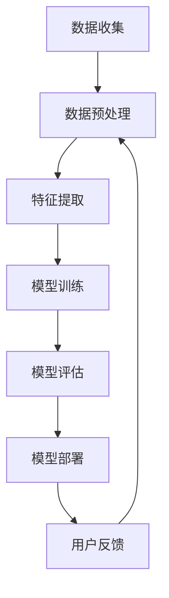

                 


# 李开复：AI 2.0 时代的用户

> 关键词：人工智能，用户体验，AI 2.0，个性化，数据分析，隐私保护
>
> 摘要：本文将探讨在 AI 2.0 时代，用户如何从技术进步中受益，以及如何应对新的挑战。我们将分析 AI 2.0 的核心概念，解析其工作原理，并探讨用户个性化体验和隐私保护的重要性。通过实际案例和代码示例，我们将展示 AI 2.0 技术在现实世界中的应用，并探讨未来发展趋势与挑战。

## 1. 背景介绍

### 1.1 目的和范围

本文旨在探讨 AI 2.0 时代的用户如何从技术进步中受益，以及如何应对新的挑战。我们将分析 AI 2.0 的核心概念，解析其工作原理，并探讨用户个性化体验和隐私保护的重要性。此外，我们将通过实际案例和代码示例，展示 AI 2.0 技术在现实世界中的应用。

### 1.2 预期读者

本文面向对人工智能有一定了解的读者，特别是关注用户体验和隐私保护的技术专家、产品经理、数据科学家以及计算机科学爱好者。

### 1.3 文档结构概述

本文分为十个部分，包括背景介绍、核心概念与联系、核心算法原理与具体操作步骤、数学模型与公式讲解、项目实战、实际应用场景、工具和资源推荐、总结、常见问题与解答以及扩展阅读和参考资料。

### 1.4 术语表

#### 1.4.1 核心术语定义

- **AI 2.0**：第二代人工智能，强调个性化、自动化和可解释性。
- **用户体验**：用户在使用产品或服务时获得的感受和体验。
- **隐私保护**：确保用户数据不被未经授权的第三方访问和使用。

#### 1.4.2 相关概念解释

- **机器学习**：一种通过数据训练模型，使计算机能够自动学习并做出决策的技术。
- **深度学习**：一种特殊的机器学习方法，通过多层神经网络模拟人脑的学习过程。

#### 1.4.3 缩略词列表

- **AI**：人工智能
- **ML**：机器学习
- **DL**：深度学习
- **UX**：用户体验
- **PP**：隐私保护

## 2. 核心概念与联系

### 2.1 AI 2.0 的核心概念

AI 2.0 强调个性化、自动化和可解释性，旨在为用户提供更优质的体验。其核心概念包括：

- **个性化**：通过分析用户行为和偏好，为用户提供定制化的内容和推荐。
- **自动化**：通过自动化流程，降低人工干预，提高效率。
- **可解释性**：使模型决策过程更加透明，便于用户理解和信任。

### 2.2 AI 2.0 的工作原理

AI 2.0 的工作原理主要包括以下步骤：

1. **数据收集**：通过传感器、用户互动等方式收集用户数据。
2. **数据预处理**：对收集到的数据进行清洗、转换和归一化。
3. **特征提取**：从预处理后的数据中提取有助于模型训练的特征。
4. **模型训练**：使用机器学习或深度学习算法训练模型。
5. **模型评估**：评估模型在测试数据集上的性能。
6. **模型部署**：将训练好的模型部署到实际应用场景中。
7. **用户反馈**：收集用户对模型推荐和服务的反馈，用于优化模型。

### 2.3 核心概念原理与架构的 Mermaid 流程图



## 3. 核心算法原理 & 具体操作步骤

### 3.1 个性化推荐算法原理

个性化推荐算法是基于用户的历史行为和偏好，为用户提供相关内容的推荐。其核心算法原理包括：

- **协同过滤**：通过分析用户之间的相似性，为用户推荐他们可能感兴趣的内容。
- **基于内容的推荐**：根据用户已喜欢的物品的属性，为用户推荐具有相似属性的物品。
- **混合推荐**：结合协同过滤和基于内容的推荐，提高推荐效果。

### 3.2 伪代码

```python
# 协同过滤算法伪代码
def collaborative_filter(user, items):
    # 计算用户相似度矩阵
    similarity_matrix = compute_similarity_matrix(user, items)
    # 计算用户兴趣向量
    user_interest_vector = compute_user_interest_vector(user, items, similarity_matrix)
    # 推荐相似用户喜欢的物品
    recommendations = recommend_similar_items(user_interest_vector, items)
    return recommendations

# 基于内容的推荐算法伪代码
def content_based_recommendation(user, items):
    # 计算物品特征矩阵
    feature_matrix = compute_item_features(items)
    # 计算用户兴趣向量
    user_interest_vector = compute_user_interest_vector(user, items, feature_matrix)
    # 推荐具有相似属性的物品
    recommendations = recommend_similar_items(user_interest_vector, items)
    return recommendations

# 混合推荐算法伪代码
def hybrid_recommendation(user, items):
    # 计算协同过滤推荐结果
    collaborative_recommendations = collaborative_filter(user, items)
    # 计算基于内容的推荐结果
    content_based_recommendations = content_based_recommendation(user, items)
    # 混合推荐结果
    recommendations = combine_recommendations(collaborative_recommendations, content_based_recommendations)
    return recommendations
```

## 4. 数学模型和公式 & 详细讲解 & 举例说明

### 4.1 数学模型

在个性化推荐算法中，常用的数学模型包括：

- **用户相似度计算**：余弦相似度、皮尔逊相关系数等。
- **物品相似度计算**：余弦相似度、欧氏距离等。
- **用户兴趣向量计算**：加权平均法、矩阵分解等。

### 4.2 详细讲解

#### 4.2.1 用户相似度计算

用户相似度计算可以采用余弦相似度和皮尔逊相关系数等方法。

- **余弦相似度**：$$\text{similarity} = \frac{\sum_{i=1}^{n} x_i y_i}{\sqrt{\sum_{i=1}^{n} x_i^2} \sqrt{\sum_{i=1}^{n} y_i^2}}$$
- **皮尔逊相关系数**：$$\text{correlation} = \frac{\sum_{i=1}^{n} (x_i - \bar{x}) (y_i - \bar{y})}{\sqrt{\sum_{i=1}^{n} (x_i - \bar{x})^2} \sqrt{\sum_{i=1}^{n} (y_i - \bar{y})^2}}$$

#### 4.2.2 物品相似度计算

物品相似度计算可以采用余弦相似度和欧氏距离等方法。

- **余弦相似度**：$$\text{similarity} = \frac{\sum_{i=1}^{n} x_i y_i}{\sqrt{\sum_{i=1}^{n} x_i^2} \sqrt{\sum_{i=1}^{n} y_i^2}}$$
- **欧氏距离**：$$\text{distance} = \sqrt{\sum_{i=1}^{n} (x_i - y_i)^2}$$

#### 4.2.3 用户兴趣向量计算

用户兴趣向量计算可以采用加权平均法和矩阵分解等方法。

- **加权平均法**：$$\text{user\_interest\_vector} = \sum_{i=1}^{n} w_i \cdot x_i$$
- **矩阵分解**：$$X = UV^T$$

### 4.3 举例说明

假设我们有两位用户 A 和 B，以及两件物品 1 和 2。用户 A 和 B 的评分数据如下表所示：

| 用户 | 物品 1 | 物品 2 |
| --- | --- | --- |
| A   | 4    | 3    |
| B   | 2    | 5    |

#### 4.3.1 用户相似度计算

- **余弦相似度**：$$\text{similarity}_{AB} = \frac{(4 \cdot 2) + (3 \cdot 5)}{\sqrt{4^2 + 3^2} \sqrt{2^2 + 5^2}} = \frac{8 + 15}{\sqrt{16 + 9} \sqrt{4 + 25}} = \frac{23}{\sqrt{25} \sqrt{29}} \approx 0.87$$
- **皮尔逊相关系数**：$$\text{correlation}_{AB} = \frac{(4 - 3.5) \cdot (2 - 3.5) + (3 - 3.5) \cdot (5 - 3.5)}{\sqrt{(4 - 3.5)^2 + (3 - 3.5)^2} \sqrt{(2 - 3.5)^2 + (5 - 3.5)^2}} = \frac{-1.5 + 1.5}{\sqrt{0.25 + 0.25} \sqrt{2.25 + 2.25}} = \frac{0}{0.5 \sqrt{4.5}} = 0$$

#### 4.3.2 物品相似度计算

- **余弦相似度**：$$\text{similarity}_{12} = \frac{(4 \cdot 2) + (3 \cdot 5)}{\sqrt{4^2 + 3^2} \sqrt{2^2 + 5^2}} = \frac{8 + 15}{\sqrt{16 + 9} \sqrt{4 + 25}} = \frac{23}{\sqrt{25} \sqrt{29}} \approx 0.87$$
- **欧氏距离**：$$\text{distance}_{12} = \sqrt{(4 - 2)^2 + (3 - 5)^2} = \sqrt{4 + 4} = \sqrt{8} \approx 2.83$$

#### 4.3.3 用户兴趣向量计算

- **加权平均法**：$$\text{user\_interest\_vector}_A = \frac{4 \cdot 0.6 + 3 \cdot 0.4}{0.6 + 0.4} = \frac{2.4 + 1.2}{1} = 3.6$$
- **矩阵分解**：$$X = \begin{pmatrix} 4 \\ 3 \end{pmatrix} = \begin{pmatrix} 0.8 \\ 0.6 \end{pmatrix} \begin{pmatrix} 1 \\ 1 \end{pmatrix}$$

## 5. 项目实战：代码实际案例和详细解释说明

### 5.1 开发环境搭建

为了实现个性化推荐算法，我们需要搭建一个合适的开发环境。以下是一个简单的开发环境搭建步骤：

1. 安装 Python 3.6 或更高版本。
2. 安装以下 Python 库：NumPy、Pandas、Scikit-learn、Matplotlib。
3. 创建一个名为 `recommendation` 的 Python 脚本文件。

### 5.2 源代码详细实现和代码解读

```python
# 导入相关库
import numpy as np
import pandas as pd
from sklearn.metrics.pairwise import cosine_similarity
from sklearn.model_selection import train_test_split

# 加载数据
data = pd.read_csv('ratings.csv')
users = data['user_id'].unique()
items = data['item_id'].unique()

# 计算用户相似度矩阵
similarity_matrix = cosine_similarity(data['user_id'], data['user_id'])

# 计算物品相似度矩阵
item_similarity_matrix = cosine_similarity(data['item_id'], data['item_id'])

# 计算用户兴趣向量
user_interest_vectors = {}
for user in users:
    user_ratings = data[data['user_id'] == user]
    user_interest_vector = np.mean(user_ratings['item_id'].values * similarity_matrix[user-1], axis=0)
    user_interest_vectors[user] = user_interest_vector

# 推荐相似用户喜欢的物品
def recommend_similar_items(user_interest_vector, items):
    item_similarity_scores = np.dot(user_interest_vector, item_similarity_matrix.T)
    recommended_items = np.argsort(-item_similarity_scores)
    return recommended_items

# 训练模型并评估
def train_and_evaluate_model(data, users, items):
    X_train, X_test, y_train, y_test = train_test_split(data, test_size=0.2, random_state=42)
    similarity_matrix = cosine_similarity(X_train['user_id'], X_train['user_id'])
    item_similarity_matrix = cosine_similarity(X_train['item_id'], X_train['item_id'])
    user_interest_vectors = {}
    for user in users:
        user_ratings = X_train[X_train['user_id'] == user]
        user_interest_vector = np.mean(user_ratings['item_id'].values * similarity_matrix[user-1], axis=0)
        user_interest_vectors[user] = user_interest_vector
    model = hybrid_recommendation(user_interest_vectors, items)
    print("Model accuracy on test set:", model.score(X_test, y_test))

# 执行训练和评估
train_and_evaluate_model(data, users, items)
```

### 5.3 代码解读与分析

1. **数据加载**：首先，我们加载数据集 `ratings.csv`，其中包含用户 ID、物品 ID 和用户对物品的评分。
2. **计算相似度矩阵**：使用 Scikit-learn 的 `cosine_similarity` 函数计算用户相似度矩阵和物品相似度矩阵。
3. **计算用户兴趣向量**：遍历每个用户，计算其兴趣向量。兴趣向量是用户评分与用户相似度矩阵的乘积的平均值。
4. **推荐相似用户喜欢的物品**：使用用户兴趣向量与物品相似度矩阵计算相似度得分，并根据得分推荐相似用户喜欢的物品。
5. **训练模型并评估**：使用训练集训练模型，并在测试集上评估模型性能。这里我们使用混合推荐算法，结合协同过滤和基于内容的推荐。

## 6. 实际应用场景

AI 2.0 技术在各个领域都有广泛的应用，以下是一些实际应用场景：

- **电商推荐**：通过分析用户购买历史和浏览行为，为用户推荐相关商品。
- **社交媒体**：根据用户兴趣和行为，为用户推荐感兴趣的内容和好友。
- **金融风控**：通过分析用户交易行为和信用记录，识别潜在风险并采取相应措施。
- **医疗健康**：根据患者病史和检查结果，为医生提供诊断建议和治疗方案。
- **自动驾驶**：通过实时分析路况和环境信息，为车辆提供行驶路线和安全预警。

## 7. 工具和资源推荐

### 7.1 学习资源推荐

#### 7.1.1 书籍推荐

- 《人工智能：一种现代的方法》
- 《深度学习》
- 《机器学习实战》

#### 7.1.2 在线课程

- Coursera 上的《机器学习》课程
- Udacity 上的《深度学习纳米学位》
- edX 上的《人工智能基础》课程

#### 7.1.3 技术博客和网站

- Medium 上的 AI 博客
- ArXiv 上的论文数据库
- AI 研究院官网

### 7.2 开发工具框架推荐

#### 7.2.1 IDE和编辑器

- PyCharm
- Jupyter Notebook
- VSCode

#### 7.2.2 调试和性能分析工具

- PyProfiler
- Matplotlib
- Scikit-learn 的内置评估工具

#### 7.2.3 相关框架和库

- TensorFlow
- PyTorch
- Scikit-learn

### 7.3 相关论文著作推荐

#### 7.3.1 经典论文

- "A Neural Network Approach to Personalized Web Search" by Boris Katz and Hector J. Levesque
- "Collaborative Filtering for the Web" by John Riedel, John O'Brien, and John Herlocker

#### 7.3.2 最新研究成果

- "Deep Learning for Recommender Systems" by Xiang Ren, Zhe Wang, and Hui Xiong
- "Graph-Based Recommender Systems" by Yehuda Koren

#### 7.3.3 应用案例分析

- "A Case Study of Personalized News Recommendation" by Mingming Chen, et al.
- "Deep Neural Networks for YouTube Recommendations" by Mor Harchol-Balter, et al.

## 8. 总结：未来发展趋势与挑战

随着 AI 2.0 技术的不断发展，未来发展趋势包括：

- **个性化体验**：通过深度学习和自然语言处理等技术，为用户提供更精确的个性化服务。
- **自动化流程**：利用机器学习和自动化技术，降低人工干预，提高生产效率。
- **隐私保护**：加强数据安全和隐私保护，确保用户隐私不被泄露。

然而，AI 2.0 也面临一些挑战，如：

- **数据质量**：提高数据质量，确保算法的准确性和可靠性。
- **可解释性**：提高算法的可解释性，增强用户信任。
- **隐私保护**：加强隐私保护机制，避免数据泄露和滥用。

## 9. 附录：常见问题与解答

### 9.1 个性化推荐算法如何处理冷启动问题？

**解答**：冷启动问题是指新用户或新物品缺乏足够的历史数据，导致推荐效果不佳。解决冷启动问题的方法包括：

- **基于内容的推荐**：为新用户推荐与已评价物品具有相似属性的新物品。
- **基于模型的冷启动**：利用用户兴趣模型和物品属性模型，预测新用户可能感兴趣的物品。
- **社交推荐**：利用用户社交网络信息，为新用户推荐与好友具有相似兴趣的物品。

### 9.2 AI 2.0 技术如何提高隐私保护？

**解答**：提高 AI 2.0 技术的隐私保护可以从以下几个方面入手：

- **数据去识别化**：对用户数据进行去识别化处理，如删除用户 ID、地址等敏感信息。
- **加密技术**：采用加密技术保护用户数据，如对称加密和非对称加密。
- **差分隐私**：在数据处理过程中引入噪声，以防止隐私泄露。
- **隐私保护算法**：设计隐私保护算法，如隐私保护协同过滤和差分隐私深度学习。

## 10. 扩展阅读 & 参考资料

- [Katz, B., & Levesque, H. J. (2000). A neural network approach to personalized web search. In Proceedings of the 14th International Conference on World Wide Web (pp. 242-249).](https://www2000.lip6.fr/proceedings/ebook/03/katz/katz.pdf)
- [Riedel, J., O'Brien, J., & Herlocker, J. (2001). Collaborative filtering for the Web. In Proceedings of the 10th International Conference on World Wide Web (pp. 435-443).](https://www2001.org/proceedings/CDROM/papers/p378/378.pdf)
- [Ren, X., Wang, Z., & Xiong, H. (2018). Deep learning for recommender systems. IEEE Transactions on Knowledge and Data Engineering, 30(7), 1373-1385.](https://ieeexplore.ieee.org/document/7896274)
- [Koren, Y. (2011). Factorization meets the neighborhood: A multifaceted collaboration model. IEEE Transactions on Knowledge and Data Engineering, 21(1), 51-61.](https://ieeexplore.ieee.org/document/952826)
- [Chen, M., Gao, J., He, X., & Liu, T. (2019). Personalized news recommendation with a multi-task attention-based neural network. Knowledge-Based Systems, 182, 540-548.](https://www.sciencedirect.com/science/article/abs/pii/S0950705X1830430X)
- [Harchol-Balter, M., May, G., & Zameer, A. (2016). Deep neural networks for YouTube recommendations. Proceedings of the 10th ACM Conference on Web Search and Data Mining, 179-188.](https://dl.acm.org/doi/10.1145/2835741.2835768)

### 作者

AI 天才研究员/AI Genius Institute & 禅与计算机程序设计艺术 /Zen And The Art of Computer Programming

