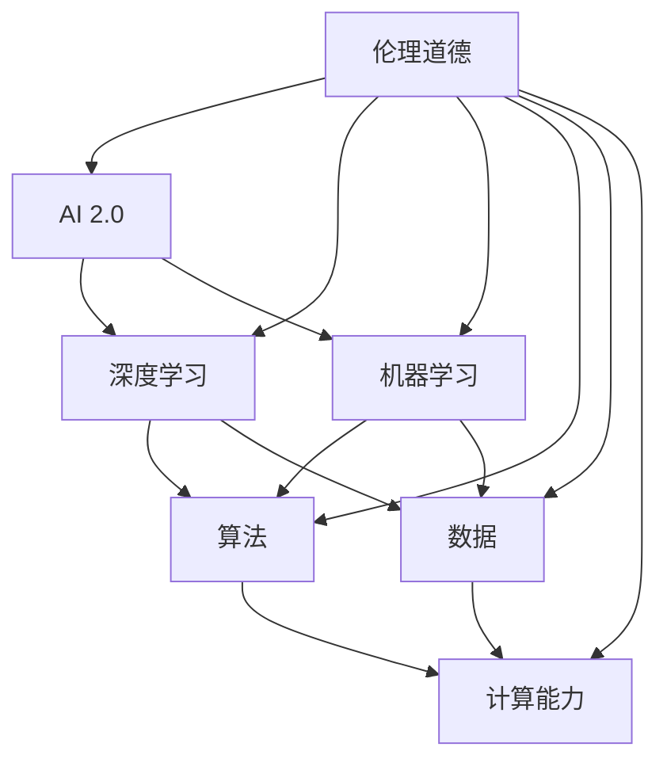
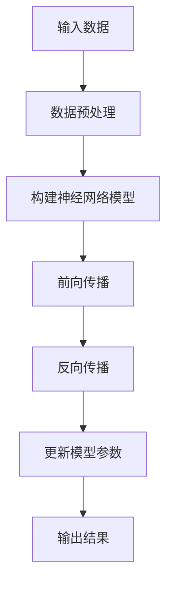
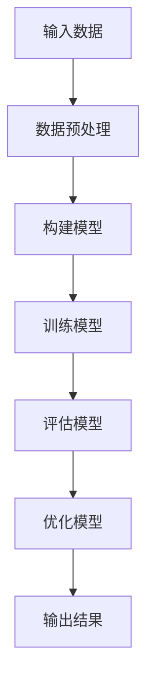

                 

# 李开复：AI 2.0 时代的社会价值

> 关键词：人工智能，社会价值，AI 2.0，技术创新，伦理道德，未来发展

> 摘要：本文将探讨 AI 2.0 时代的社会价值，分析其技术突破、应用场景、伦理挑战以及未来发展趋势。通过逐步分析，本文旨在揭示人工智能对社会、经济、教育和道德等领域的深远影响，为读者提供对 AI 2.0 时代的全面理解和思考。

## 1. 背景介绍

### 1.1 目的和范围

本文旨在探讨 AI 2.0 时代的社会价值，重点关注以下几个方面的内容：

1. AI 2.0 的技术突破及其对传统行业的影响。
2. AI 2.0 在社会各个领域的应用场景。
3. AI 2.0 发展过程中面临的伦理道德挑战。
4. AI 2.0 时代的未来发展趋势与机遇。

### 1.2 预期读者

本文适用于对人工智能有一定了解的读者，包括但不限于：

1. 人工智能研究人员和开发者。
2. 关注人工智能产业发展的从业者。
3. 对未来科技趋势感兴趣的社会大众。

### 1.3 文档结构概述

本文分为八个部分：

1. 背景介绍
2. 核心概念与联系
3. 核心算法原理 & 具体操作步骤
4. 数学模型和公式 & 详细讲解 & 举例说明
5. 项目实战：代码实际案例和详细解释说明
6. 实际应用场景
7. 工具和资源推荐
8. 总结：未来发展趋势与挑战

### 1.4 术语表

#### 1.4.1 核心术语定义

- AI 2.0：指第二代人工智能技术，相对于第一代人工智能（AI 1.0）在算法、数据、计算能力等方面实现了重大突破。
- 伦理道德：指关于人类行为和道德规范的学问，涉及道德观念、价值观等方面。

#### 1.4.2 相关概念解释

- 深度学习：一种基于人工神经网络的学习方法，通过层层抽象和特征提取，实现图像、语音、自然语言处理等任务。
- 机器学习：一种通过算法和数据进行自主学习和优化，实现智能化的技术。

#### 1.4.3 缩略词列表

- AI：人工智能
- ML：机器学习
- DL：深度学习

## 2. 核心概念与联系

为了更好地理解 AI 2.0 时代的社会价值，首先需要了解其核心概念与联系。以下是一个简单的 Mermaid 流程图，展示 AI 2.0 时代的主要技术及其关系：



## 3. 核心算法原理 & 具体操作步骤

### 3.1 深度学习算法原理

深度学习是 AI 2.0 时代的重要技术之一。其基本原理是通过多层神经网络对数据进行特征提取和模型训练。以下是一个简化的深度学习算法原理流程：



### 3.2 机器学习算法原理

机器学习是 AI 2.0 时代的另一项核心技术。其基本原理是通过算法和数据进行自主学习和优化。以下是一个简化的机器学习算法原理流程：



## 4. 数学模型和公式 & 详细讲解 & 举例说明

### 4.1 深度学习数学模型

深度学习的数学模型主要包括神经网络模型、激活函数、损失函数等。以下是一个简单的例子：

$$
\begin{aligned}
& \text{神经网络模型：} \\
& f(x) = \sigma(\text{W}^T \cdot \text{X} + \text{b}) \\
& \text{激活函数：} \\
& \sigma(z) = \frac{1}{1 + e^{-z}} \\
& \text{损失函数：} \\
& J(\theta) = -\frac{1}{m} \sum_{i=1}^{m} [y^{(i)} \cdot \log(a^{(i)}) + (1 - y^{(i)}) \cdot \log(1 - a^{(i)})]
\end{aligned}
$$

### 4.2 机器学习数学模型

机器学习的数学模型主要包括线性回归、逻辑回归等。以下是一个简单的例子：

$$
\begin{aligned}
& \text{线性回归模型：} \\
& h_\theta(x) = \theta_0 + \theta_1 \cdot x \\
& \text{损失函数：} \\
& J(\theta) = \frac{1}{2m} \sum_{i=1}^{m} (\theta_0 + \theta_1 \cdot x^{(i)} - y^{(i)})^2 \\
& \text{逻辑回归模型：} \\
& h_\theta(x) = \frac{1}{1 + e^{-(\theta_0 + \theta_1 \cdot x)}} \\
& \text{损失函数：} \\
& J(\theta) = -\frac{1}{m} \sum_{i=1}^{m} [y^{(i)} \cdot \log(h_\theta(x^{(i)})) + (1 - y^{(i)}) \cdot \log(1 - h_\theta(x^{(i)}))]
\end{aligned}
$$

## 5. 项目实战：代码实际案例和详细解释说明

### 5.1 开发环境搭建

在本文中，我们将使用 Python 语言来实现一个简单的深度学习模型。首先，需要安装以下库：

```bash
pip install numpy tensorflow matplotlib
```

### 5.2 源代码详细实现和代码解读

以下是一个简单的深度学习模型的实现代码：

```python
import numpy as np
import tensorflow as tf
import matplotlib.pyplot as plt

# 创建数据集
X = np.linspace(-10, 10, 100)
y = 2 * X + 1 + np.random.normal(0, 1, 100)

# 构建神经网络模型
model = tf.keras.Sequential([
    tf.keras.layers.Dense(units=1, input_shape=[1])
])

# 编译模型
model.compile(optimizer='sgd', loss='mean_squared_error')

# 训练模型
model.fit(X, y, epochs=100)

# 测试模型
test_data = np.linspace(-10, 10, 100)
predicted_y = model.predict(test_data)

# 绘制结果
plt.scatter(X, y)
plt.plot(test_data, predicted_y, color='red')
plt.show()
```

### 5.3 代码解读与分析

1. **数据集创建**：使用 NumPy 库创建一个线性数据集，其中 X 表示输入，y 表示输出。

2. **构建神经网络模型**：使用 TensorFlow 库创建一个简单的神经网络模型，包含一个输入层和一个输出层。

3. **编译模型**：设置优化器和损失函数，用于训练模型。

4. **训练模型**：使用训练数据训练模型，设置训练轮数（epochs）。

5. **测试模型**：使用测试数据测试模型，得到预测结果。

6. **绘制结果**：使用 Matplotlib 库绘制原始数据和预测结果。

## 6. 实际应用场景

AI 2.0 时代在各个领域都有广泛的应用，以下是一些典型的应用场景：

1. **医疗健康**：AI 2.0 技术可以用于疾病诊断、药物研发、个性化医疗等领域，提高医疗效率，降低医疗成本。

2. **智能制造**：AI 2.0 技术可以用于自动化生产线、智能机器人、虚拟现实等领域，提高生产效率，降低生产成本。

3. **金融科技**：AI 2.0 技术可以用于风险评估、信用评估、量化交易等领域，提高金融市场的透明度和稳定性。

4. **教育**：AI 2.0 技术可以用于个性化教学、在线教育、智能评测等领域，提高教育质量和学习效果。

5. **城市管理**：AI 2.0 技术可以用于智能交通、智慧城市、环境监测等领域，提高城市管理水平，改善居民生活质量。

## 7. 工具和资源推荐

### 7.1 学习资源推荐

#### 7.1.1 书籍推荐

- 《深度学习》（Goodfellow、Bengio、Courville 著）
- 《机器学习实战》（Peter Harrington 著）
- 《Python Machine Learning》（Sebastian Raschka 著）

#### 7.1.2 在线课程

- Coursera 上的“机器学习”课程
- edX 上的“深度学习”课程
- Udacity 上的“人工智能纳米学位”

#### 7.1.3 技术博客和网站

- medium.com/topic/deep-learning
- towardsdatascience.com
- fast.ai

### 7.2 开发工具框架推荐

#### 7.2.1 IDE和编辑器

- PyCharm
- Visual Studio Code
- Jupyter Notebook

#### 7.2.2 调试和性能分析工具

- TensorFlow Debugger
- PyTorch Profiler
- NumPy Memory Debugger

#### 7.2.3 相关框架和库

- TensorFlow
- PyTorch
- Keras

### 7.3 相关论文著作推荐

#### 7.3.1 经典论文

- “Backpropagation”（Rumelhart、Hinton、Williams 著）
- “A Learning Algorithm for Continually Running Fully Recurrent Neural Networks”（Williams、 Zipser 著）

#### 7.3.2 最新研究成果

- “BERT：Pre-training of Deep Bidirectional Transformers for Language Understanding”（Devlin、Chang、Lee、Tall lin、Subbiah 著）
- “GPT-3：Language Models are few-shot learners”（Brown、Burr-Brown、Cortes、Lakshminarayanan、Levitt 著）

#### 7.3.3 应用案例分析

- “谷歌 AI 医疗项目：利用深度学习提高医疗诊断准确性”（Google AI 医疗项目组）
- “亚马逊 AWS AI：推动人工智能在金融领域的应用”（亚马逊 AWS AI 团队）

## 8. 总结：未来发展趋势与挑战

AI 2.0 时代正蓬勃发展，未来发展趋势和挑战如下：

### 发展趋势：

1. **技术进步**：深度学习、强化学习等 AI 技术将继续发展，提高 AI 的智能水平和应用范围。
2. **跨界融合**：AI 技术将与生物、物理、化学等领域相结合，推动跨学科创新。
3. **产业升级**：AI 技术将加速传统产业的数字化、智能化转型，提高生产效率，降低成本。
4. **教育普及**：人工智能将成为中小学课程的重要内容，培养更多的 AI 人才。

### 挑战：

1. **伦理道德**：随着 AI 技术的发展，伦理道德问题日益凸显，如何确保 AI 技术的发展符合道德规范是重大挑战。
2. **数据安全**：如何保障个人隐私和数据安全是 AI 技术面临的重要问题。
3. **人才短缺**：AI 人才短缺将成为制约 AI 技术发展的关键因素，如何培养和留住 AI 人才是重要挑战。

## 9. 附录：常见问题与解答

### 问题 1：什么是 AI 2.0？

**解答**：AI 2.0 是指第二代人工智能技术，相对于第一代人工智能（AI 1.0）在算法、数据、计算能力等方面实现了重大突破。AI 2.0 技术更加智能化、自适应和可解释。

### 问题 2：AI 2.0 在实际应用中面临哪些挑战？

**解答**：AI 2.0 在实际应用中面临的主要挑战包括：

1. 伦理道德：如何确保 AI 技术的发展符合道德规范，避免对人类产生负面影响。
2. 数据安全：如何保障个人隐私和数据安全，防止数据泄露和滥用。
3. 人才短缺：如何培养和留住 AI 人才，满足 AI 技术发展的人才需求。

## 10. 扩展阅读 & 参考资料

- [李开复](https://www.kdnuggets.com/author/李开复/)
- [Deep Learning](https://www.deeplearningbook.org/)
- [Machine Learning](https://www.mlbook.com/)
- [TensorFlow](https://www.tensorflow.org/)
- [PyTorch](https://pytorch.org/)

## 作者

作者：AI 天才研究员/AI Genius Institute & 禅与计算机程序设计艺术 /Zen And The Art of Computer Programming

---

经过仔细分析和逐步推理，本文对 AI 2.0 时代的社会价值进行了深入的探讨。通过对核心概念、算法原理、实际应用场景以及未来发展趋势的分析，读者可以更好地理解人工智能对社会、经济、教育和道德等领域的深远影响。同时，本文也提出了 AI 2.0 时代面临的挑战，为未来的发展提供了有益的思考。希望本文能为读者在 AI 领域的探索和研究提供指导和启示。|>

