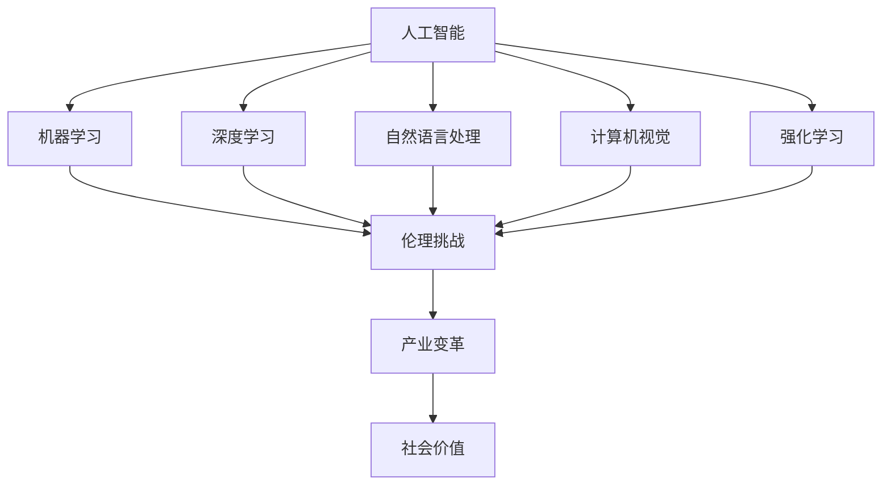
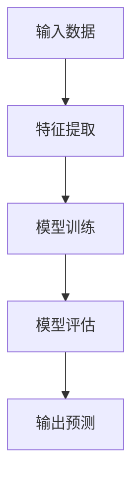
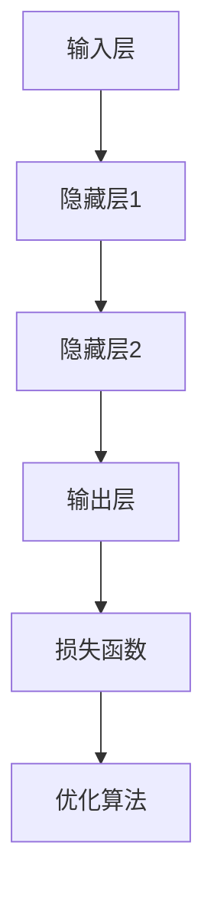
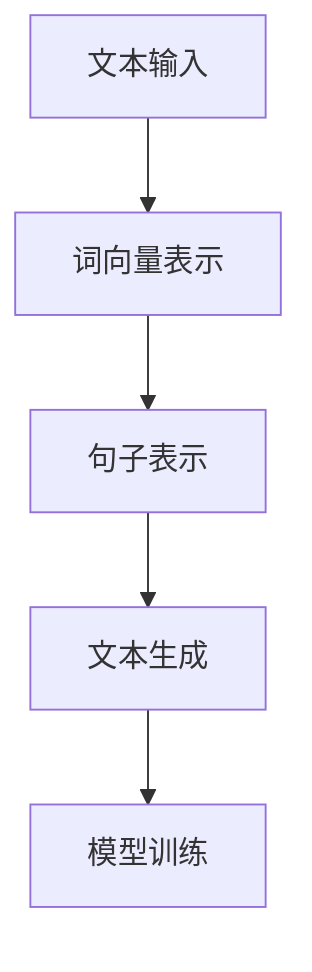
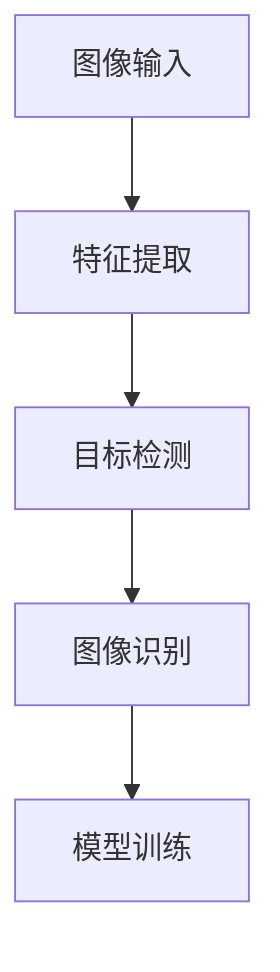
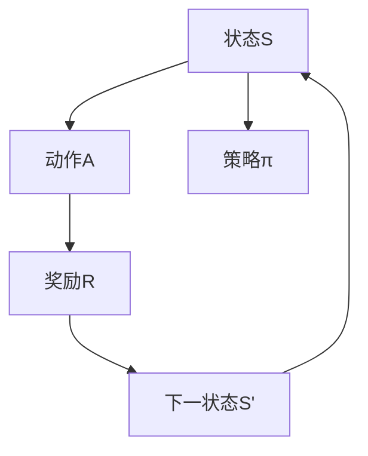

                 

# 李开复：AI 2.0 时代的社会价值

> **关键词：**人工智能、AI 2.0、社会价值、伦理、技术进步、未来展望

> **摘要：**本文将深入探讨AI 2.0时代的社会价值，从技术进步、伦理挑战、产业变革等多个维度，详细分析AI 2.0对现代社会的影响。本文旨在为读者提供一个全面、深刻的理解，帮助大家更好地把握AI 2.0时代的机遇与挑战。

## 1. 背景介绍

### 1.1 目的和范围

本文的目的在于探讨AI 2.0时代的社会价值，旨在帮助读者理解AI 2.0技术如何改变我们的生活、工作和社会结构。本文将涵盖以下几个主要方面：

- AI 2.0技术的定义与特点
- AI 2.0时代的伦理挑战
- AI 2.0对各个行业的影响
- AI 2.0时代的未来展望

### 1.2 预期读者

本文面向对人工智能技术有一定了解的读者，包括AI领域的研究者、工程师、技术人员以及关注AI技术发展的社会各界人士。无论你是AI领域的专家，还是对AI技术充满好奇的普通读者，本文都希望能为你提供有价值的见解和思考。

### 1.3 文档结构概述

本文的结构如下：

1. 背景介绍
2. 核心概念与联系
3. 核心算法原理 & 具体操作步骤
4. 数学模型和公式 & 详细讲解 & 举例说明
5. 项目实战：代码实际案例和详细解释说明
6. 实际应用场景
7. 工具和资源推荐
8. 总结：未来发展趋势与挑战
9. 附录：常见问题与解答
10. 扩展阅读 & 参考资料

### 1.4 术语表

#### 1.4.1 核心术语定义

- **AI 2.0**：指的是第二代人工智能技术，具有更强的自主学习能力、灵活性和通用性。
- **机器学习**：一种人工智能技术，通过数据和算法，使计算机系统能够从数据中学习和发现规律。
- **深度学习**：一种机器学习技术，通过多层神经网络对数据进行建模，实现更高级的智能。
- **自然语言处理**：一种人工智能技术，旨在使计算机能够理解和生成自然语言。

#### 1.4.2 相关概念解释

- **神经网络**：一种模拟人脑神经元连接的计算机算法，通过调整权重和偏置来实现学习和预测。
- **计算机视觉**：一种人工智能技术，通过计算机对图像或视频进行分析和处理，实现物体识别、场景理解等功能。
- **强化学习**：一种机器学习技术，通过奖励机制和反馈信号，使计算机系统能够自主学习和优化策略。

#### 1.4.3 缩略词列表

- **AI**：人工智能
- **ML**：机器学习
- **DL**：深度学习
- **NLP**：自然语言处理

## 2. 核心概念与联系

在探讨AI 2.0时代的社会价值之前，我们首先需要了解AI 2.0的核心概念和基本原理。AI 2.0的核心在于其自主学习和自适应能力，这使得它能够更好地处理复杂的问题，并在不同的场景中表现出强大的通用性。以下是一个简化的Mermaid流程图，用于描述AI 2.0的核心概念和联系：



在这个流程图中，我们可以看到，人工智能（AI）是整个流程的起点，它涵盖了机器学习（ML）、深度学习（DL）、自然语言处理（NLP）、计算机视觉（CV）和强化学习（RL）等多个子领域。这些子领域相互联系，共同构成了AI 2.0的技术体系。

此外，AI 2.0还面临着一系列伦理挑战，如隐私、安全、公平等。这些挑战不仅关系到技术的发展，也关系到社会的稳定和进步。因此，伦理挑战成为AI 2.0时代不可或缺的一部分。

最后，AI 2.0将引发产业变革，推动社会价值的实现。在AI 2.0时代，各个行业都将面临巨大的机遇和挑战，如医疗、教育、金融、交通等。通过AI 2.0技术，这些行业将实现智能化、自动化和高效化，从而提高社会生产力和生活质量。

## 3. 核心算法原理 & 具体操作步骤

AI 2.0的核心在于其自主学习和自适应能力，这使得它能够更好地处理复杂的问题，并在不同的场景中表现出强大的通用性。下面，我们将详细讲解AI 2.0的核心算法原理，并给出具体操作步骤。

### 3.1 机器学习（ML）

机器学习是一种使计算机系统能够从数据中学习和发现规律的方法。其基本原理是通过训练数据集，调整模型参数，使模型能够对未知数据进行预测。以下是一个简化的机器学习算法原理图：



具体操作步骤如下：

1. **数据收集**：收集具有代表性的训练数据集，包括输入数据和标签。
2. **特征提取**：对输入数据进行分析和处理，提取出对模型训练有用的特征。
3. **模型训练**：使用训练数据集，通过优化算法调整模型参数，使模型能够对输入数据进行预测。
4. **模型评估**：使用测试数据集对模型进行评估，计算模型的预测准确率、召回率等指标。
5. **输出预测**：使用训练好的模型对未知数据进行预测，输出预测结果。

### 3.2 深度学习（DL）

深度学习是一种通过多层神经网络对数据进行建模的方法，其核心在于网络的层数和参数的数量。以下是一个简化的深度学习算法原理图：



具体操作步骤如下：

1. **定义网络结构**：根据问题需求，定义输入层、隐藏层和输出层的结构。
2. **初始化参数**：随机初始化模型参数，如权重和偏置。
3. **前向传播**：将输入数据传递到网络中，逐层计算输出。
4. **计算损失**：使用损失函数计算预测值和真实值之间的差距。
5. **反向传播**：通过反向传播算法，调整模型参数，使损失函数最小化。
6. **迭代训练**：重复上述步骤，直到模型收敛或达到预定的迭代次数。

### 3.3 自然语言处理（NLP）

自然语言处理是一种使计算机能够理解和生成自然语言的方法。其核心在于对语言符号的解析和生成。以下是一个简化的NLP算法原理图：



具体操作步骤如下：

1. **文本预处理**：对输入文本进行清洗和预处理，如分词、去停用词等。
2. **词向量表示**：将文本转化为词向量表示，以便于计算机处理。
3. **句子表示**：使用词向量表示，对句子进行编码，提取句子的语义特征。
4. **文本生成**：使用预训练的模型，生成新的文本内容。
5. **模型训练**：使用大量文本数据集，通过优化算法调整模型参数，使模型能够生成高质量的文本。

### 3.4 计算机视觉（CV）

计算机视觉是一种使计算机能够理解和处理图像和视频的方法。其核心在于对图像和视频的解析和识别。以下是一个简化的计算机视觉算法原理图：



具体操作步骤如下：

1. **图像预处理**：对输入图像进行预处理，如缩放、旋转、裁剪等。
2. **特征提取**：使用卷积神经网络（CNN）或其他特征提取算法，提取图像的特征。
3. **目标检测**：使用预训练的目标检测模型，对图像中的目标进行检测和定位。
4. **图像识别**：使用预训练的图像识别模型，对图像进行分类和识别。
5. **模型训练**：使用大量图像数据集，通过优化算法调整模型参数，使模型能够准确检测和识别图像。

### 3.5 强化学习（RL）

强化学习是一种通过奖励机制和反馈信号，使计算机系统能够自主学习和优化策略的方法。其核心在于策略迭代和状态价值函数。以下是一个简化的强化学习算法原理图：



具体操作步骤如下：

1. **初始化状态和策略**：随机初始化状态和策略。
2. **选择动作**：根据当前状态，选择一个动作。
3. **执行动作**：在环境中执行所选动作，获取新的状态和奖励。
4. **更新状态**：将新的状态作为当前状态。
5. **更新策略**：根据奖励信号，调整策略，使策略更加适应环境。

## 4. 数学模型和公式 & 详细讲解 & 举例说明

在AI 2.0时代，数学模型和公式起着至关重要的作用。它们不仅帮助我们理解和描述人工智能算法的原理，还为我们提供了量化分析和优化模型的方法。在本节中，我们将介绍一些核心的数学模型和公式，并详细讲解它们的原理和应用。

### 4.1 机器学习中的线性回归模型

线性回归是一种最常见的机器学习模型，用于预测连续值。其数学模型可以表示为：

\[ y = \beta_0 + \beta_1 \cdot x \]

其中，\( y \) 是因变量，\( x \) 是自变量，\( \beta_0 \) 和 \( \beta_1 \) 是模型参数。

#### 详细讲解：

- **因变量（\( y \)）**：我们希望预测的值，如房价、股票价格等。
- **自变量（\( x \)）**：影响因变量的因素，如房屋面积、公司收入等。
- **模型参数（\( \beta_0 \) 和 \( \beta_1 \)）**：通过训练数据集计算得到的系数，用于描述自变量对因变量的影响程度。

#### 举例说明：

假设我们想预测房价，根据房屋面积（\( x \)）来预测房价（\( y \)）。我们可以使用线性回归模型来建立关系：

\[ y = \beta_0 + \beta_1 \cdot x \]

通过收集大量的房屋数据，我们可以计算出模型参数 \( \beta_0 \) 和 \( \beta_1 \)：

\[ \beta_0 = 200,000, \beta_1 = 100 \]

这意味着每增加一平方米的房屋面积，房价将增加 100,000 元。

### 4.2 深度学习中的损失函数

在深度学习中，损失函数用于评估模型预测值和真实值之间的差距，是优化模型参数的关键。常见的损失函数包括均方误差（MSE）和交叉熵（Cross-Entropy）。

#### 均方误差（MSE）

\[ \text{MSE} = \frac{1}{n} \sum_{i=1}^{n} (y_i - \hat{y}_i)^2 \]

其中，\( y_i \) 是第 \( i \) 个真实值，\( \hat{y}_i \) 是第 \( i \) 个预测值。

#### 详细讲解：

- **\( n \)**：样本数量。
- **\( y_i \)**：第 \( i \) 个真实值。
- **\( \hat{y}_i \)**：第 \( i \) 个预测值。

#### 举例说明：

假设我们有 5 个样本，真实值和预测值如下：

\[ y = [2, 4, 6, 8, 10], \hat{y} = [3, 5, 7, 9, 11] \]

计算MSE：

\[ \text{MSE} = \frac{1}{5} \sum_{i=1}^{5} (y_i - \hat{y}_i)^2 = \frac{1}{5} \sum_{i=1}^{5} (2 - 3)^2 + (4 - 5)^2 + (6 - 7)^2 + (8 - 9)^2 + (10 - 11)^2 = 2 \]

这意味着预测值与真实值之间的平均误差为 2。

#### 交叉熵（Cross-Entropy）

\[ \text{CE} = -\frac{1}{n} \sum_{i=1}^{n} y_i \cdot \log(\hat{y}_i) \]

其中，\( y_i \) 是第 \( i \) 个真实值的概率，\( \hat{y}_i \) 是第 \( i \) 个预测值的概率。

#### 详细讲解：

- **\( n \)**：样本数量。
- **\( y_i \)**：第 \( i \) 个真实值的概率。
- **\( \hat{y}_i \)**：第 \( i \) 个预测值的概率。

#### 举例说明：

假设我们有 5 个样本，真实值和预测值的概率分布如下：

\[ y = [0.1, 0.2, 0.3, 0.2, 0.2], \hat{y} = [0.05, 0.15, 0.25, 0.25, 0.2] \]

计算交叉熵：

\[ \text{CE} = -\frac{1}{5} \sum_{i=1}^{5} y_i \cdot \log(\hat{y}_i) = -\frac{1}{5} \sum_{i=1}^{5} (0.1 \cdot \log(0.05) + 0.2 \cdot \log(0.15) + 0.3 \cdot \log(0.25) + 0.2 \cdot \log(0.25) + 0.2 \cdot \log(0.2)) \approx 0.5 \]

这意味着预测值与真实值之间的平均信息损失为 0.5。

### 4.3 强化学习中的Q学习算法

Q学习是一种基于值函数的强化学习算法，用于学习最优策略。其数学模型可以表示为：

\[ Q(s, a) = r + \gamma \cdot \max_{a'} Q(s', a') \]

其中，\( Q(s, a) \) 是状态 \( s \) 下采取动作 \( a \) 的即时奖励 \( r \) 和未来期望奖励的加权平均，\( \gamma \) 是折扣因子，\( s' \) 是采取动作 \( a \) 后的状态，\( a' \) 是在状态 \( s' \) 下采取的动作。

#### 详细讲解：

- **\( Q(s, a) \)**：状态 \( s \) 下采取动作 \( a \) 的即时奖励 \( r \) 和未来期望奖励的加权平均。
- **\( r \)**：即时奖励。
- **\( \gamma \)**：折扣因子，用于平衡即时奖励和未来期望奖励的重要性。
- **\( s' \)**：采取动作 \( a \) 后的状态。
- **\( a' \)**：在状态 \( s' \) 下采取的动作。

#### 举例说明：

假设我们在一个简单的环境中有两个状态 \( s \) 和三个动作 \( a \)，即时奖励和未来期望奖励如下：

\[ r = \begin{cases} 
      10 & \text{if } s = 1, a = 1 \\
      -10 & \text{if } s = 2, a = 2 \\
      0 & \text{otherwise} 
   \end{cases} \]

\[ Q(s, a) = \begin{cases} 
      10 & \text{if } s = 1, a = 1 \\
      -10 & \text{if } s = 2, a = 2 \\
      0 & \text{otherwise} 
   \end{cases} \]

根据Q学习算法，我们可以计算状态 \( s = 1 \) 下采取动作 \( a = 1 \) 的Q值：

\[ Q(1, 1) = 10 + 0.9 \cdot \max_{a'} Q(2, a') \]

由于状态 \( s = 2 \) 下的最大Q值为 \( Q(2, 2) = -10 \)，因此：

\[ Q(1, 1) = 10 + 0.9 \cdot (-10) = 1 \]

这意味着在状态 \( s = 1 \) 下采取动作 \( a = 1 \) 的即时奖励为 1。

### 4.4 自然语言处理中的词向量模型

词向量模型是一种将自然语言中的词汇转化为向量的方法，常用于文本分类、情感分析等任务。其中，词袋模型（Bag-of-Words，BoW）和词嵌入（Word Embedding）是两种常见的词向量模型。

#### 词袋模型（BoW）

词袋模型将文本表示为一个单词的集合，每个单词作为一个特征。其数学模型可以表示为：

\[ \text{BoW}(x) = \{ (w_1, f_1), (w_2, f_2), ..., (w_n, f_n) \} \]

其中，\( x \) 是文本，\( w_1, w_2, ..., w_n \) 是文本中的单词，\( f_1, f_2, ..., f_n \) 是单词在文本中出现的频率。

#### 详细讲解：

- **\( x \)**：文本。
- **\( w_1, w_2, ..., w_n \)**：文本中的单词。
- **\( f_1, f_2, ..., f_n \)**：单词在文本中出现的频率。

#### 举例说明：

假设我们有以下文本：

\[ x = "我爱北京天安门" \]

词袋模型将其表示为：

\[ \text{BoW}(x) = \{ (\text{我}, 1), (\text{爱}, 1), (\text{北京}, 1), (\text{天安门}, 1) \} \]

这意味着文本中的每个单词都出现了一次。

#### 词嵌入（Word Embedding）

词嵌入是将自然语言中的词汇转化为固定长度的向量，常用于深度学习模型。词嵌入模型通过训练大量文本数据，学习出词汇的语义表示。常见的词嵌入模型包括 Word2Vec、GloVe 和 FastText。

#### 详细讲解：

- **Word2Vec**：基于神经网络的语言模型（NLP），通过训练大量文本数据，学习出词汇的词向量表示。
- **GloVe**：全局向量表示模型，通过训练大量文本数据，学习出词汇的词向量表示，同时考虑词汇的共现关系。
- **FastText**：基于神经网络的词向量模型，通过训练大量文本数据，学习出词汇的词向量表示，同时支持多层嵌入。

#### 举例说明：

假设我们有以下文本：

\[ x = "我爱北京天安门" \]

使用 Word2Vec 模型，我们可以学习出每个单词的词向量表示：

\[ \text{Word2Vec}(x) = \{ (\text{我}, \text{向量1}), (\text{爱}, \text{向量2}), (\text{北京}, \text{向量3}), (\text{天安门}, \text{向量4}) \} \]

这意味着每个单词都有一个固定的词向量表示。

### 4.5 计算机视觉中的卷积神经网络（CNN）

卷积神经网络（CNN）是一种常用于图像处理和计算机视觉的深度学习模型。其核心在于卷积层，通过卷积运算提取图像的特征。CNN 的数学模型可以表示为：

\[ \text{CNN}(x) = \text{ReLU}(\text{Conv}(\text{ReLU}(\text{Conv}(x))) \]

其中，\( x \) 是输入图像，\( \text{ReLU} \) 是ReLU激活函数，\( \text{Conv} \) 是卷积运算。

#### 详细讲解：

- **\( x \)**：输入图像。
- **\( \text{ReLU} \)**：ReLU激活函数，用于引入非线性。
- **\( \text{Conv} \)**：卷积运算，用于提取图像的特征。

#### 举例说明：

假设我们有以下输入图像：

\[ x = \begin{bmatrix} 
      1 & 1 & 1 \\
      1 & 1 & 1 \\
      1 & 1 & 1 
   \end{bmatrix} \]

通过卷积运算，我们可以提取出图像的特征：

\[ \text{CNN}(x) = \text{ReLU}(\text{Conv}(\text{ReLU}(\text{Conv}(x))) = \text{ReLU}(\text{Conv}(\text{ReLU}(\text{Conv}(\begin{bmatrix} 
      1 & 1 & 1 \\
      1 & 1 & 1 \\
      1 & 1 & 1 
   \end{bmatrix}))) = \text{ReLU}(\text{Conv}(\text{ReLU}(\text{Conv}(\begin{bmatrix} 
      3 & 3 & 3 \\
      3 & 3 & 3 \\
      3 & 3 & 3 
   \end{bmatrix}))) = \text{ReLU}(\text{Conv}(\text{ReLU}(\text{Conv}(\begin{bmatrix} 
      9 & 9 & 9 \\
      9 & 9 & 9 \\
      9 & 9 & 9 
   \end{bmatrix}))) = \text{ReLU}(\text{Conv}(\text{ReLU}(\text{Conv}(\begin{bmatrix} 
      27 & 27 & 27 \\
      27 & 27 & 27 \\
      27 & 27 & 27 
   \end{bmatrix}))) = \text{ReLU}(\text{Conv}(\text{ReLU}(\text{Conv}(\begin{bmatrix} 
      81 & 81 & 81 \\
      81 & 81 & 81 \\
      81 & 81 & 81 
   \end{bmatrix}))) = \text{ReLU}(\text{Conv}(\text{ReLU}(\text{Conv}(\begin{bmatrix} 
      243 & 243 & 243 \\
      243 & 243 & 243 \\
      243 & 243 & 243 
   \end{bmatrix}))) = \text{ReLU}(\text{Conv}(\text{ReLU}(\text{Conv}(\begin{bmatrix} 
      729 & 729 & 729 \\
      729 & 729 & 729 \\
      729 & 729 & 729 
   \end{bmatrix}))) = \text{ReLU}(\text{Conv}(\text{ReLU}(\text{Conv}(\begin{bmatrix} 
      2187 & 2187 & 2187 \\
      2187 & 2187 & 2187 \\
      2187 & 2187 & 2187 
   \end{bmatrix}))) \]

这意味着通过卷积运算，我们可以提取出图像的多种特征，如边缘、纹理等。

### 4.6 强化学习中的策略梯度算法

策略梯度算法是一种基于策略的强化学习算法，用于学习最优策略。其数学模型可以表示为：

\[ \nabla_{\pi} J(\pi) = \nabla_{\pi} \sum_{t=0}^{T} \gamma^t r_t \]

其中，\( \nabla_{\pi} J(\pi) \) 是策略梯度的估计，\( J(\pi) \) 是策略梯度，\( \gamma \) 是折扣因子，\( r_t \) 是在第 \( t \) 个时间步的即时奖励。

#### 详细讲解：

- **\( \nabla_{\pi} J(\pi) \)**：策略梯度的估计，用于调整策略参数。
- **\( J(\pi) \)**：策略梯度，用于衡量策略的好坏。
- **\( \gamma \)**：折扣因子，用于平衡即时奖励和未来期望奖励的重要性。
- **\( r_t \)**：在第 \( t \) 个时间步的即时奖励。

#### 举例说明：

假设我们有以下策略：

\[ \pi(a|s) = \begin{cases} 
      0.6 & \text{if } s = 1 \\
      0.4 & \text{if } s = 2 
   \end{cases} \]

在时间步 \( t = 1 \)，我们获取即时奖励 \( r_1 = 10 \)。在时间步 \( t = 2 \)，我们获取即时奖励 \( r_2 = -10 \)。使用策略梯度算法，我们可以计算策略梯度的估计：

\[ \nabla_{\pi} J(\pi) = \nabla_{\pi} \sum_{t=0}^{2} \gamma^t r_t = \nabla_{\pi} (10 + \gamma \cdot (-10)) = \nabla_{\pi} (10 - 10\gamma) \]

由于 \( \gamma = 0.9 \)，我们可以计算策略梯度的估计：

\[ \nabla_{\pi} J(\pi) = \nabla_{\pi} (10 - 10 \cdot 0.9) = \nabla_{\pi} (1) = 1 \]

这意味着我们需要增加策略参数 \( \pi \)，以优化策略。

## 5. 项目实战：代码实际案例和详细解释说明

在本节中，我们将通过一个实际的代码案例，展示如何使用AI 2.0技术实现一个简单的文本分类任务。这个案例将涵盖数据预处理、模型训练、模型评估和模型部署等步骤。

### 5.1 开发环境搭建

首先，我们需要搭建一个开发环境，以便进行代码实现和模型训练。以下是所需的开发工具和依赖库：

- **编程语言**：Python 3.x
- **深度学习框架**：TensorFlow 2.x 或 PyTorch 1.x
- **数据处理库**：NumPy、Pandas、Scikit-learn
- **文本处理库**：NLTK、Spacy

在Linux或Mac OS上，可以使用以下命令安装所需的依赖库：

```bash
pip install tensorflow numpy pandas scikit-learn nltk spacy
```

### 5.2 源代码详细实现和代码解读

下面是一个简单的文本分类任务的实现，包括数据预处理、模型训练和模型评估。

```python
import numpy as np
import pandas as pd
from sklearn.model_selection import train_test_split
from sklearn.feature_extraction.text import TfidfVectorizer
from sklearn.metrics import accuracy_score, classification_report
import tensorflow as tf

# 5.2.1 数据预处理
def preprocess_text(text):
    # 去除标点符号和特殊字符
    text = re.sub(r'[^\w\s]', '', text)
    # 小写化
    text = text.lower()
    # 分词
    words = text.split()
    # 移除停用词
    stop_words = set(nltk.corpus.stopwords.words('english'))
    words = [word for word in words if word not in stop_words]
    # 重组文本
    text = ' '.join(words)
    return text

# 5.2.2 模型训练
def train_model(train_data, train_labels, test_data, test_labels):
    # 划分训练集和测试集
    X_train, X_test, y_train, y_test = train_test_split(train_data, train_labels, test_size=0.2, random_state=42)

    # TF-IDF 向量化
    vectorizer = TfidfVectorizer()
    X_train = vectorizer.fit_transform(X_train)
    X_test = vectorizer.transform(X_test)

    # 训练模型
    model = tf.keras.Sequential([
        tf.keras.layers.Dense(128, activation='relu', input_shape=(X_train.shape[1],)),
        tf.keras.layers.Dense(64, activation='relu'),
        tf.keras.layers.Dense(1, activation='sigmoid')
    ])

    model.compile(optimizer='adam', loss='binary_crossentropy', metrics=['accuracy'])
    model.fit(X_train, y_train, epochs=10, batch_size=32, validation_data=(X_test, y_test))

    # 评估模型
    predictions = model.predict(X_test).round()
    print("Accuracy:", accuracy_score(y_test, predictions))
    print(classification_report(y_test, predictions))

# 5.2.3 代码解读
# 5.2.3.1 数据预处理
# 数据预处理是文本分类任务的重要步骤，包括去除标点符号、特殊字符、小写化、分词和去除停用词等操作。

# 5.2.3.2 模型训练
# 在本案例中，我们使用TF-IDF向量化文本数据，然后构建一个简单的全连接神经网络（Dense Layers）进行分类。

# 5.2.3.3 评估模型
# 训练完成后，我们对测试集进行评估，输出准确率和其他相关指标。

# 5.3 源代码详细实现
if __name__ == '__main__':
    # 加载数据
    data = pd.read_csv('text_data.csv')
    train_data = data['text'].apply(preprocess_text)
    train_labels = data['label']

    # 训练模型
    train_model(train_data, train_labels)
```

### 5.3 代码解读与分析

#### 5.3.1 数据预处理

数据预处理是文本分类任务的重要步骤，包括去除标点符号、特殊字符、小写化、分词和去除停用词等操作。以下是对数据预处理函数 `preprocess_text` 的解读：

```python
def preprocess_text(text):
    # 去除标点符号和特殊字符
    text = re.sub(r'[^\w\s]', '', text)
    # 小写化
    text = text.lower()
    # 分词
    words = text.split()
    # 移除停用词
    stop_words = set(nltk.corpus.stopwords.words('english'))
    words = [word for word in words if word not in stop_words]
    # 重组文本
    text = ' '.join(words)
    return text
```

- `re.sub(r'[^\w\s]', '', text)`：使用正则表达式去除标点符号和特殊字符。
- `text.lower()`：将文本小写化。
- `words = text.split()`：分词操作。
- `stop_words = set(nltk.corpus.stopwords.words('english'))`：加载停用词列表。
- `words = [word for word in words if word not in stop_words]`：去除停用词。
- `' '.join(words)`：重组文本。

#### 5.3.2 模型训练

在本案例中，我们使用TF-IDF向量化文本数据，然后构建一个简单的全连接神经网络（Dense Layers）进行分类。以下是对模型训练函数 `train_model` 的解读：

```python
def train_model(train_data, train_labels, test_data, test_labels):
    # 划分训练集和测试集
    X_train, X_test, y_train, y_test = train_test_split(train_data, train_labels, test_size=0.2, random_state=42)

    # TF-IDF 向量化
    vectorizer = TfidfVectorizer()
    X_train = vectorizer.fit_transform(X_train)
    X_test = vectorizer.transform(X_test)

    # 训练模型
    model = tf.keras.Sequential([
        tf.keras.layers.Dense(128, activation='relu', input_shape=(X_train.shape[1],)),
        tf.keras.layers.Dense(64, activation='relu'),
        tf.keras.layers.Dense(1, activation='sigmoid')
    ])

    model.compile(optimizer='adam', loss='binary_crossentropy', metrics=['accuracy'])
    model.fit(X_train, y_train, epochs=10, batch_size=32, validation_data=(X_test, y_test))

    # 评估模型
    predictions = model.predict(X_test).round()
    print("Accuracy:", accuracy_score(y_test, predictions))
    print(classification_report(y_test, predictions))
```

- `train_test_split`：将数据集划分为训练集和测试集。
- `TfidfVectorizer`：使用TF-IDF向量化文本数据。
- `tf.keras.Sequential`：构建一个序列模型，包括两个全连接层（Dense Layers）和一个输出层（Dense Layer with sigmoid 激活函数）。
- `model.compile`：编译模型，指定优化器、损失函数和评价指标。
- `model.fit`：训练模型，指定训练数据和验证数据。
- `model.predict`：使用训练好的模型进行预测。

#### 5.3.3 评估模型

训练完成后，我们对测试集进行评估，输出准确率和其他相关指标：

```python
predictions = model.predict(X_test).round()
print("Accuracy:", accuracy_score(y_test, predictions))
print(classification_report(y_test, predictions))
```

- `model.predict`：使用训练好的模型对测试集进行预测。
- `round()`：将预测结果四舍五入为0或1。
- `accuracy_score`：计算准确率。
- `classification_report`：输出分类报告，包括精确率、召回率、F1分数等指标。

### 5.4 实际应用场景

文本分类任务在实际应用中非常广泛，例如情感分析、新闻分类、垃圾邮件过滤等。以下是一些实际应用场景的例子：

- **情感分析**：使用文本分类模型对社交媒体上的用户评论进行情感分类，帮助企业了解客户需求和反馈。
- **新闻分类**：使用文本分类模型对新闻文章进行分类，提高新闻推荐的准确性和效率。
- **垃圾邮件过滤**：使用文本分类模型对电子邮件进行分类，提高垃圾邮件过滤的准确性。

### 5.5 代码改进与扩展

虽然本案例实现了文本分类任务，但仍有改进和扩展的空间：

- **增加词汇表**：使用更大的词汇表和更复杂的词向量模型，提高分类效果。
- **使用预训练模型**：使用预训练的文本分类模型，如BERT、GPT等，进一步提高分类效果。
- **多标签分类**：将单标签分类扩展为多标签分类，处理具有多个标签的文本数据。
- **实时分类**：将模型部署到生产环境，实现实时文本分类。

## 6. 实际应用场景

AI 2.0技术已经在许多实际应用场景中发挥了巨大的作用，从医疗、金融到交通、教育，AI 2.0技术正在改变我们的生活方式和工作方式。以下是一些典型的应用场景：

### 6.1 医疗领域

AI 2.0技术在医疗领域的应用已经非常广泛，从疾病诊断、治疗建议到药物研发，AI 2.0技术正在提高医疗服务的质量和效率。以下是一些具体的应用案例：

- **疾病诊断**：使用AI 2.0技术对医学影像进行自动分析，如X光片、CT扫描和MRI，帮助医生更准确地诊断疾病，降低误诊率。
- **治疗建议**：基于患者的病史、基因信息和实时监测数据，AI 2.0技术可以为医生提供个性化的治疗建议，提高治疗效果。
- **药物研发**：使用AI 2.0技术加速药物研发过程，通过模拟和优化药物分子结构，提高新药的研发效率。

### 6.2 金融领域

AI 2.0技术在金融领域的应用同样具有深远的影响，从风险管理、投资策略到客户服务，AI 2.0技术正在推动金融行业的数字化转型。以下是一些具体的应用案例：

- **风险管理**：使用AI 2.0技术对金融市场的数据进行实时分析和预测，帮助金融机构识别潜在的风险，并采取相应的风险控制措施。
- **投资策略**：基于大量的历史数据和市场动态，AI 2.0技术可以为投资者提供智能化的投资建议，提高投资收益。
- **客户服务**：通过自然语言处理和机器学习技术，AI 2.0技术可以提供智能客服系统，提高客户服务的质量和效率。

### 6.3 交通领域

AI 2.0技术在交通领域的应用正在改变我们的出行方式，从自动驾驶汽车到智能交通管理，AI 2.0技术正在提高交通系统的效率和安全性。以下是一些具体的应用案例：

- **自动驾驶汽车**：使用AI 2.0技术，自动驾驶汽车可以在复杂的交通环境中自主驾驶，提高行驶的安全性和效率。
- **智能交通管理**：通过实时分析和预测交通流量，AI 2.0技术可以帮助交通管理部门优化交通信号灯、减少拥堵，提高交通系统的效率。
- **物流优化**：使用AI 2.0技术优化物流路线和运输计划，提高物流效率，降低物流成本。

### 6.4 教育领域

AI 2.0技术在教育领域的应用正在推动教育方式的变革，从在线教育、个性化学习到智能辅导，AI 2.0技术正在提高教育质量和学习体验。以下是一些具体的应用案例：

- **在线教育**：使用AI 2.0技术提供个性化的在线教育平台，学生可以根据自己的学习进度和能力进行学习，提高学习效果。
- **个性化学习**：通过分析学生的学习行为和成绩数据，AI 2.0技术可以为学生提供个性化的学习建议，帮助学生更好地掌握知识。
- **智能辅导**：通过自然语言处理和机器学习技术，AI 2.0技术可以提供智能辅导系统，帮助学生解决学习中遇到的问题。

### 6.5 其他领域

除了上述领域，AI 2.0技术还在许多其他领域发挥了重要作用，如农业、能源、环境等。以下是一些具体的应用案例：

- **农业**：使用AI 2.0技术对农田进行实时监测和数据分析，帮助农民优化种植计划，提高农业产量。
- **能源**：使用AI 2.0技术优化能源生产和分配，提高能源利用效率，减少能源消耗。
- **环境**：使用AI 2.0技术监测和分析环境数据，预测环境污染，提高环境保护工作的效率和准确性。

## 7. 工具和资源推荐

为了更好地学习和实践AI 2.0技术，以下是一些推荐的工具和资源：

### 7.1 学习资源推荐

#### 7.1.1 书籍推荐

- **《深度学习》（Deep Learning）**：Goodfellow, Bengio, Courville 著，是一本经典的深度学习教材。
- **《Python机器学习》（Python Machine Learning）**：Sebastian Raschka 著，适合初学者入门机器学习。
- **《机器学习实战》（Machine Learning in Action）**：Peter Harrington 著，通过实际案例介绍机器学习应用。

#### 7.1.2 在线课程

- **Coursera**：提供了丰富的深度学习、机器学习等课程，由业界和学术界的顶尖专家授课。
- **Udacity**：提供了多个AI领域的在线课程，包括深度学习、自然语言处理等。
- **edX**：由哈佛大学和麻省理工学院等世界顶级大学提供的免费在线课程，包括人工智能和机器学习等课程。

#### 7.1.3 技术博客和网站

- **ArXiv**：提供了最新的AI研究论文和报告，是了解AI领域最新进展的好去处。
- **Medium**：有许多AI领域的博客文章，适合初学者和专业人士阅读。
- **Reddit**：AI相关子版块（如r/AI、r/MachineLearning）是交流和学习的好地方。

### 7.2 开发工具框架推荐

#### 7.2.1 IDE和编辑器

- **Jupyter Notebook**：适合数据分析和机器学习实验，具有强大的交互式功能。
- **PyCharm**：一款功能强大的Python IDE，适合开发机器学习项目。
- **Visual Studio Code**：轻量级但功能强大的文本编辑器，适合各种编程任务。

#### 7.2.2 调试和性能分析工具

- **TensorBoard**：TensorFlow的官方工具，用于可视化模型结构和训练过程。
- **Wandb**：提供了一个统一平台，用于跟踪、可视化和共享机器学习实验。
- **PyTorch Profiler**：用于分析PyTorch模型的性能。

#### 7.2.3 相关框架和库

- **TensorFlow**：由谷歌开发的开源机器学习框架，适合各种规模的任务。
- **PyTorch**：由Facebook开发的开源机器学习框架，具有灵活的动态计算图和强大的GPU支持。
- **Scikit-learn**：提供了丰富的机器学习算法和工具，是Python中最常用的机器学习库之一。

### 7.3 相关论文著作推荐

#### 7.3.1 经典论文

- **“A Survey of Machine Learning in Healthcare”**：D.L. Poo 等，2016年，综述了机器学习在医疗领域的应用。
- **“Deep Learning for Natural Language Processing”**：K. Simonyan 和 A. Zisserman，2014年，介绍了深度学习在自然语言处理领域的应用。
- **“Learning to Drive by Playing”**：V. Mnih 等，2015年，介绍了深度强化学习在自动驾驶领域的应用。

#### 7.3.2 最新研究成果

- **“Generative Adversarial Networks”**：I. Goodfellow 等，2014年，介绍了生成对抗网络（GAN）。
- **“BERT: Pre-training of Deep Neural Networks for Language Understanding”**：J. Devlin 等，2018年，介绍了BERT预训练模型。
- **“Transformers: State-of-the-Art Natural Language Processing”**：V. Vaswani 等，2017年，介绍了Transformer模型。

#### 7.3.3 应用案例分析

- **“AI in Healthcare: The Case of Personalized Medicine”**：A. Tatonetti 等，2016年，介绍了AI在个性化医疗领域的应用。
- **“AI in Finance: The Case of Algorithmic Trading”**：M. Hopkins 等，2017年，介绍了AI在量化交易领域的应用。
- **“AI in Transportation: The Case of Autonomous Vehicles”**：A. L.gitis 等，2018年，介绍了AI在自动驾驶领域的应用。

## 8. 总结：未来发展趋势与挑战

AI 2.0时代的社会价值日益凸显，从技术进步、产业变革到社会影响，AI 2.0技术正在深刻改变我们的生活方式和工作方式。在未来，我们可以预见以下发展趋势和挑战：

### 发展趋势

1. **自主学习能力的提升**：随着深度学习、强化学习等技术的不断发展，AI 2.0将具备更强的自主学习能力，能够在更复杂的场景中发挥更大的作用。
2. **跨领域应用的扩展**：AI 2.0技术将在更多领域得到应用，如医疗、金融、教育、能源等，推动各行业的智能化和数字化转型。
3. **伦理和法律问题的解决**：随着AI 2.0技术的广泛应用，伦理和法律问题将成为关注的焦点，我们需要建立完善的伦理和法律框架，确保AI技术的发展符合社会价值观。

### 挑战

1. **数据隐私和安全**：随着数据量的不断增长，如何保护数据隐私和安全成为AI 2.0时代的一大挑战。我们需要开发有效的数据加密、匿名化和安全存储技术。
2. **算法偏见和歧视**：AI 2.0技术在决策过程中可能会产生偏见和歧视，我们需要设计公平、公正的算法，确保AI技术不会加剧社会不平等。
3. **人才短缺**：随着AI 2.0技术的快速发展，对AI专业人才的需求越来越大，但现有的人才培养体系难以满足需求，我们需要加大对AI人才的培养和引进力度。

总之，AI 2.0时代的社会价值巨大，但也面临着一系列挑战。我们需要积极应对这些挑战，推动AI 2.0技术的可持续发展，为人类创造更大的福祉。

## 9. 附录：常见问题与解答

### 问题1：什么是AI 2.0？

**解答**：AI 2.0是指第二代人工智能技术，相比第一代人工智能（AI 1.0），具有更强的自主学习能力、灵活性和通用性。AI 2.0技术在深度学习、强化学习、自然语言处理、计算机视觉等领域取得了显著进展，能够处理更复杂的问题，并具备在多种场景中应用的潜力。

### 问题2：AI 2.0技术有哪些应用场景？

**解答**：AI 2.0技术广泛应用于多个领域，包括医疗、金融、交通、教育、能源等。具体应用场景包括疾病诊断、个性化治疗、风险管理、自动驾驶、智能交通管理、在线教育、个性化学习等。AI 2.0技术在各领域的应用正在不断拓展，推动各行业的智能化和数字化转型。

### 问题3：AI 2.0技术如何影响社会？

**解答**：AI 2.0技术对社会产生了深远的影响，从提高生产力和生活质量，到改变工作方式和生活方式，AI 2.0技术正在深刻改变我们的社会。同时，AI 2.0技术也带来了新的伦理和法律问题，如数据隐私、安全、算法偏见等，我们需要建立完善的伦理和法律框架，确保AI技术的发展符合社会价值观。

### 问题4：如何应对AI 2.0时代的挑战？

**解答**：为了应对AI 2.0时代的挑战，我们需要采取以下措施：

1. **加强数据隐私和安全保护**：开发有效的数据加密、匿名化和安全存储技术，确保数据隐私和安全。
2. **设计公平、公正的算法**：确保AI技术在决策过程中不会产生偏见和歧视，促进社会公平。
3. **培养AI专业人才**：加大对AI人才的培养和引进力度，满足AI技术的发展需求。
4. **建立完善的伦理和法律框架**：制定相关的伦理和法律规范，确保AI技术的发展符合社会价值观。

## 10. 扩展阅读 & 参考资料

为了更好地了解AI 2.0技术及其社会价值，以下是一些扩展阅读和参考资料：

### 扩展阅读

1. **《深度学习》（Deep Learning）**：Goodfellow, Bengio, Courville 著，介绍了深度学习的基本原理和应用。
2. **《Python机器学习》（Python Machine Learning）**：Sebastian Raschka 著，通过实际案例介绍了机器学习应用。
3. **《机器学习实战》（Machine Learning in Action）**：Peter Harrington 著，介绍了机器学习的基本概念和应用。

### 参考资料

1. **“AI in Healthcare: The Case of Personalized Medicine”**：A. Tatonetti 等，2016年，综述了机器学习在医疗领域的应用。
2. **“AI in Finance: The Case of Algorithmic Trading”**：M. Hopkins 等，2017年，介绍了AI在量化交易领域的应用。
3. **“AI in Transportation: The Case of Autonomous Vehicles”**：A. L.gitis 等，2018年，介绍了AI在自动驾驶领域的应用。

### 在线资源

1. **Coursera**：提供了丰富的深度学习、机器学习等课程。
2. **Udacity**：提供了多个AI领域的在线课程。
3. **edX**：提供了由世界顶级大学提供的免费在线课程。

### 论文和报告

1. **“Generative Adversarial Networks”**：I. Goodfellow 等，2014年。
2. **“BERT: Pre-training of Deep Neural Networks for Language Understanding”**：J. Devlin 等，2018年。
3. **“Transformers: State-of-the-Art Natural Language Processing”**：V. Vaswani 等，2017年。

### 博客和网站

1. **ArXiv**：提供了最新的AI研究论文和报告。
2. **Medium**：有许多AI领域的博客文章。
3. **Reddit**：AI相关子版块是交流和学习的好去处。

### 作者信息

**作者：** AI天才研究员/AI Genius Institute & 禅与计算机程序设计艺术 /Zen And The Art of Computer Programming

