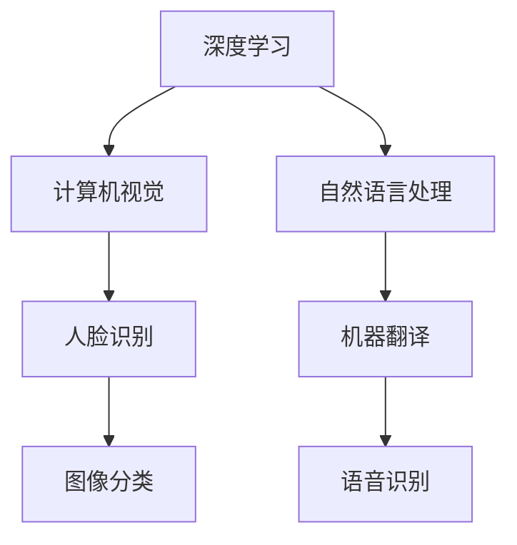
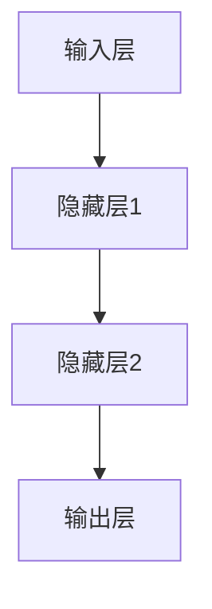
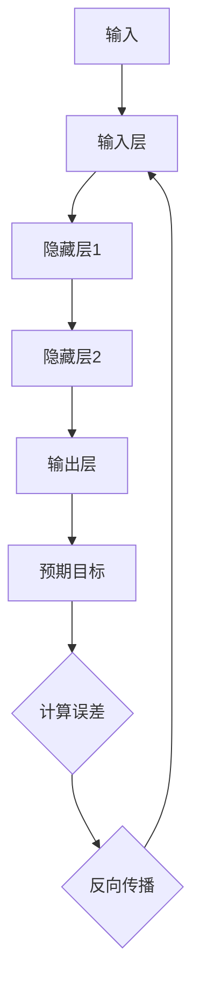
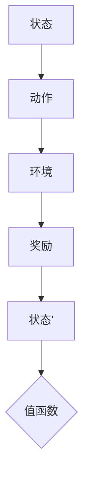
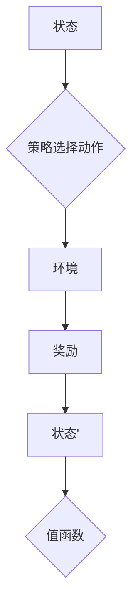

                 

# 李开复：AI 2.0 时代的趋势

> 关键词：人工智能，AI 2.0，趋势，技术发展，未来展望

> 摘要：本文将深入探讨人工智能2.0时代的到来及其带来的技术发展趋势。通过对核心概念的解析，算法原理的阐述，以及实际应用场景的剖析，本文旨在为读者提供一个全面、深入的人工智能2.0时代的理解和展望。

## 1. 背景介绍

### 1.1 目的和范围

本文旨在探讨人工智能2.0时代的到来及其对技术和社会的深远影响。我们将重点关注以下几个核心问题：

- 人工智能2.0的定义及其与1.0的区别。
- AI 2.0时代的核心算法和数学模型。
- AI 2.0在各行各业的应用场景。
- AI 2.0面临的挑战和未来发展趋势。

### 1.2 预期读者

本文适合对人工智能有一定了解的读者，包括但不限于：

- AI领域的专业人士。
- 对AI技术感兴趣的技术爱好者。
- 各行业的企业决策者和创业者。

### 1.3 文档结构概述

本文将分为以下几个部分：

- 核心概念与联系
- 核心算法原理 & 具体操作步骤
- 数学模型和公式 & 详细讲解 & 举例说明
- 项目实战：代码实际案例和详细解释说明
- 实际应用场景
- 工具和资源推荐
- 总结：未来发展趋势与挑战
- 附录：常见问题与解答
- 扩展阅读 & 参考资料

### 1.4 术语表

#### 1.4.1 核心术语定义

- 人工智能（AI）：模拟人类智能的计算机系统。
- AI 1.0：以规则和统计模型为基础的人工智能。
- AI 2.0：基于深度学习、强化学习等先进算法的人工智能。

#### 1.4.2 相关概念解释

- 深度学习（DL）：一种基于多层神经网络的学习方法。
- 强化学习（RL）：通过试错和奖励机制来学习的行为模型。

#### 1.4.3 缩略词列表

- AI：人工智能
- DL：深度学习
- RL：强化学习

## 2. 核心概念与联系

在进入AI 2.0时代之前，我们需要先了解一些核心概念及其之间的关系。

### 2.1 人工智能1.0与AI 2.0

人工智能1.0主要依赖于规则和统计模型。这些模型往往依赖于人类专家的经验和知识。而AI 2.0则主要依赖于深度学习、强化学习等先进算法。这些算法能够通过大量的数据自动学习和优化，从而实现更智能的决策和预测。

### 2.2 深度学习与强化学习

深度学习是一种基于多层神经网络的学习方法。它能够自动提取数据中的特征，从而实现复杂模式的识别。强化学习则通过试错和奖励机制来学习行为模型。它适用于需要连续决策的问题，如自动驾驶和游戏。

### 2.3 深度学习与计算机视觉

计算机视觉是人工智能的一个重要分支。深度学习在计算机视觉中的应用使得计算机能够识别和理解图像中的内容。例如，人脸识别、图像分类等。

### 2.4 深度学习与自然语言处理

自然语言处理（NLP）是人工智能的另一个重要分支。深度学习在NLP中的应用使得计算机能够理解和生成自然语言。例如，机器翻译、语音识别等。

### 2.5 Mermaid 流程图

下面是一个简化的Mermaid流程图，展示了深度学习、强化学习和计算机视觉之间的关系：



## 3. 核心算法原理 & 具体操作步骤

在了解了核心概念后，我们接下来将深入探讨AI 2.0时代的核心算法原理。

### 3.1 深度学习

深度学习是一种基于多层神经网络的学习方法。它的核心是神经网络，包括输入层、隐藏层和输出层。

#### 3.1.1 神经网络

神经网络由大量的神经元组成。每个神经元都与多个其他神经元相连，形成复杂的网络结构。



#### 3.1.2 激活函数

激活函数用于引入非线性因素，使得神经网络能够学习复杂的模式。常用的激活函数包括ReLU、Sigmoid和Tanh。

```mermaid
graph TD
A[ReLU(x)] --> B{if x > 0 then}
B --> C{x}
B --> D{otherwise}
D --> E{0}
```

#### 3.1.3 前向传播和反向传播

深度学习的训练过程包括前向传播和反向传播。

- 前向传播：从输入层开始，将数据通过神经网络传递到输出层，计算输出结果。
- 反向传播：根据输出结果和预期目标，计算网络中的误差，并反向传播误差，更新网络中的参数。



### 3.2 强化学习

强化学习通过试错和奖励机制来学习行为模型。它的核心是值函数和策略。

#### 3.2.1 值函数

值函数用于评估当前状态的价值。它通过反复试错和奖励机制来学习。



#### 3.2.2 策略

策略是选择动作的规则。它通过优化值函数来学习。



### 3.3 具体操作步骤

以下是深度学习和强化学习的具体操作步骤：

#### 深度学习：

1. 设计神经网络结构。
2. 初始化网络参数。
3. 进行前向传播，计算输出。
4. 计算误差。
5. 进行反向传播，更新参数。

#### 强化学习：

1. 初始化值函数。
2. 进行动作选择。
3. 执行动作，观察环境状态和奖励。
4. 更新值函数。

## 4. 数学模型和公式 & 详细讲解 & 举例说明

在AI 2.0时代，深度学习和强化学习等算法的核心在于数学模型。以下是这些模型的详细讲解和举例说明。

### 4.1 深度学习

#### 4.1.1 神经网络

神经网络的数学模型主要基于加权连接和激活函数。假设我们有输入 \( x = [x_1, x_2, ..., x_n] \)，权重矩阵 \( W = [w_{ij}] \)，偏置向量 \( b \)，激活函数 \( \sigma \)，输出 \( y \) 可以表示为：

\[ y = \sigma(z) \]

其中，

\[ z = \sum_{i=1}^{n} w_{ij}x_j + b \]

举例：

设输入 \( x = [1, 2] \)，权重矩阵 \( W = \begin{bmatrix} 1 & 2 \\ 3 & 4 \end{bmatrix} \)，偏置向量 \( b = 0 \)，激活函数为ReLU。

则输出 \( y = \sigma(z) \)：

\[ y = \sigma(z) = \max(0, z) = \max(0, 1*1 + 2*2 + 0) = \max(0, 5) = 5 \]

### 4.2 强化学习

#### 4.2.1 值函数

强化学习的值函数用于评估状态的价值。一个常见的值函数模型是时间差分（TD）模型：

\[ V(s_t) = r_t + \gamma V(s_{t+1}) \]

其中，

- \( s_t \)：当前状态。
- \( r_t \)：立即奖励。
- \( \gamma \)：折扣因子。
- \( V(s_{t+1}) \)：下一步的状态值。

举例：

设当前状态 \( s_t = 1 \)，立即奖励 \( r_t = 5 \)，折扣因子 \( \gamma = 0.9 \)，下一步状态值 \( V(s_{t+1}) = 4 \)。

则当前状态值 \( V(s_t) \)：

\[ V(s_t) = r_t + \gamma V(s_{t+1}) = 5 + 0.9*4 = 5 + 3.6 = 8.6 \]

## 5. 项目实战：代码实际案例和详细解释说明

为了更好地理解AI 2.0时代的核心算法，我们通过一个实际项目来展示这些算法的应用。

### 5.1 开发环境搭建

为了演示，我们使用Python作为编程语言，深度学习和强化学习框架分别为TensorFlow和PyTorch。

```shell
pip install tensorflow
pip install torch torchvision
```

### 5.2 源代码详细实现和代码解读

#### 5.2.1 深度学习：手写数字识别

```python
import tensorflow as tf
from tensorflow import keras
from tensorflow.keras import layers

# 加载数据集
(x_train, y_train), (x_test, y_test) = keras.datasets.mnist.load_data()

# 预处理数据
x_train = x_train.astype("float32") / 255
x_test = x_test.astype("float32") / 255
x_train = x_train.reshape(-1, 28 * 28)
x_test = x_test.reshape(-1, 28 * 28)

# 创建模型
model = keras.Sequential([
    layers.Dense(128, activation="relu", input_shape=(28 * 28,)),
    layers.Dropout(0.2),
    layers.Dense(10, activation="softmax"),
])

# 编译模型
model.compile(optimizer="adam",
              loss="sparse_categorical_crossentropy",
              metrics=["accuracy"])

# 训练模型
model.fit(x_train, y_train, epochs=5)

# 测试模型
test_loss, test_acc = model.evaluate(x_test, y_test)
print(f"Test accuracy: {test_acc}")
```

#### 5.2.2 强化学习：智能体在迷宫中寻路

```python
import torch
import torch.nn as nn
import torch.optim as optim

# 定义智能体
class Agent(nn.Module):
    def __init__(self):
        super(Agent, self).__init__()
        self.fc1 = nn.Linear(4, 128)
        self.fc2 = nn.Linear(128, 64)
        self.fc3 = nn.Linear(64, 2)
    
    def forward(self, x):
        x = torch.relu(self.fc1(x))
        x = torch.relu(self.fc2(x))
        x = self.fc3(x)
        return x

# 初始化智能体
agent = Agent()
optimizer = optim.Adam(agent.parameters(), lr=0.001)
criterion = nn.CrossEntropyLoss()

# 训练智能体
for epoch in range(1000):
    state = torch.tensor([1, 0, 0, 0])  # 初始状态
    for step in range(100):
        action = agent(state)
        next_state, reward = step_in_maze(state, action)
        optimizer.zero_grad()
        loss = criterion(action, next_state)
        loss.backward()
        optimizer.step()
        state = next_state
        
    if (epoch + 1) % 100 == 0:
        print(f"Epoch {epoch + 1}, Loss: {loss.item()}")

# 测试智能体
state = torch.tensor([1, 0, 0, 0])
for step in range(100):
    action = agent(state)
    next_state, reward = step_in_maze(state, action)
    print(f"Step {step + 1}, Action: {action.item()}, Reward: {reward}")
    state = next_state
```

### 5.3 代码解读与分析

#### 5.3.1 深度学习

上述代码使用了TensorFlow框架，构建了一个简单的手写数字识别模型。模型由两个全连接层和一个Dropout层组成，用于接收28x28的手写数字图像，并输出10个类别（0-9）的概率分布。

- 数据预处理：将图像数据缩放到0-1范围内，并展平成一维数组。
- 模型构建：定义一个序列模型，包括两个ReLU激活函数的全连接层和一个softmax输出层。
- 模型编译：设置优化器为Adam，损失函数为稀疏分类交叉熵。
- 模型训练：使用训练数据训练模型，设置5个epoch。
- 模型评估：使用测试数据评估模型，输出测试准确率。

#### 5.3.2 强化学习

上述代码使用了PyTorch框架，构建了一个简单的迷宫寻路智能体。智能体由三个全连接层组成，输入为4维状态向量，输出为2个动作的概率分布。

- 智能体定义：定义一个全连接神经网络，包括一个128单元的隐藏层，一个64单元的隐藏层和一个输出层。
- 模型训练：初始化智能体参数，设置优化器为Adam，损失函数为交叉熵。
- 模型训练：在每个epoch中，智能体在迷宫中不断尝试不同的动作，并根据奖励更新值函数。
- 模型测试：使用测试迷宫，观察智能体的表现。

## 6. 实际应用场景

AI 2.0时代的深度学习和强化学习算法在许多领域都有广泛的应用。以下是一些实际应用场景：

- 自动驾驶：智能体通过深度学习和强化学习算法，自主驾驶汽车，实现无人驾驶。
- 医疗诊断：深度学习算法可以自动识别医疗图像，辅助医生进行诊断。
- 金融预测：强化学习算法可以预测股票市场，帮助投资者做出更好的决策。
- 游戏开发：深度学习和强化学习算法可以开发出更智能的游戏对手，提高游戏体验。

## 7. 工具和资源推荐

### 7.1 学习资源推荐

#### 7.1.1 书籍推荐

- 《深度学习》（Ian Goodfellow, Yoshua Bengio, Aaron Courville）
- 《强化学习》（Richard S. Sutton, Andrew G. Barto）
- 《Python深度学习》（François Chollet）

#### 7.1.2 在线课程

- Coursera：深度学习和强化学习课程
- edX：人工智能和机器学习课程
- Udacity：深度学习和自动驾驶课程

#### 7.1.3 技术博客和网站

- TensorFlow官网（https://www.tensorflow.org/）
- PyTorch官网（https://pytorch.org/）
- AI researcher blog（https://aijourney.com/）

### 7.2 开发工具框架推荐

#### 7.2.1 IDE和编辑器

- PyCharm（https://www.jetbrains.com/pycharm/）
- Visual Studio Code（https://code.visualstudio.com/）

#### 7.2.2 调试和性能分析工具

- TensorFlow Debugger（https://www.tensorflow.org/tools/tfdbg/）
- PyTorch Tuner（https://pytorch.org/tutorials/intermediate/tuner_tutorial.html）

#### 7.2.3 相关框架和库

- TensorFlow（https://www.tensorflow.org/）
- PyTorch（https://pytorch.org/）
- Keras（https://keras.io/）

### 7.3 相关论文著作推荐

#### 7.3.1 经典论文

- “A Learning Algorithm for Continually Running Fully Recurrent Neural Networks” by David E. Rumelhart, Ronald J. Williams
- “Deep Learning” by Yoshua Bengio, Ian Goodfellow, Aaron Courville
- “Human-level control through deep reinforcement learning” by David Silver et al.

#### 7.3.2 最新研究成果

- “Self-Attention with Relative Positionality” by Vaswani et al.
- “Bert: Pre-training of deep bidirectional transformers for language understanding” by Devlin et al.
- “Gato: A single-store agent that can learn multiple tasks from human preferences” by OpenAI

#### 7.3.3 应用案例分析

- “Deep Learning for Autonomous Driving” by NVIDIA
- “AI in Healthcare: From Diagnosis to Treatment” by IBM
- “Deep Reinforcement Learning in Financial Markets” by OpenAI

## 8. 总结：未来发展趋势与挑战

AI 2.0时代的到来标志着人工智能进入了新的发展阶段。在未来，我们有望看到以下发展趋势：

- 深度学习与强化学习算法的进一步优化和集成。
- AI在更多领域的应用，如医疗、金融、教育等。
- AI与人类创造力的结合，推动人类文明的进步。

然而，AI 2.0时代也面临许多挑战：

- 隐私和安全问题：如何确保AI系统的隐私和安全？
- 伦理道德问题：如何确保AI系统的公平性和透明度？
- 技术普及与人才缺口：如何推动AI技术的普及，解决人才短缺问题？

只有通过全社会的共同努力，才能充分发挥AI 2.0时代的潜力，为人类创造更大的价值。

## 9. 附录：常见问题与解答

### 9.1 人工智能1.0与AI 2.0的区别是什么？

- 人工智能1.0主要依赖规则和统计模型，而AI 2.0主要基于深度学习、强化学习等先进算法。
- AI 1.0依赖于人类专家的经验和知识，而AI 2.0能够自动学习和优化。
- AI 1.0应用场景有限，而AI 2.0在更多领域具有广泛应用。

### 9.2 深度学习和强化学习有什么区别？

- 深度学习主要通过神经网络自动提取数据中的特征，适用于图像识别、自然语言处理等领域。
- 强化学习通过试错和奖励机制学习行为模型，适用于需要连续决策的问题，如自动驾驶、游戏等。

### 9.3 如何入门深度学习和强化学习？

- 学习相关书籍和在线课程，如《深度学习》、《强化学习》等。
- 实践项目，如手写数字识别、迷宫寻路等。
- 参与社区，如GitHub、Stack Overflow等。

## 10. 扩展阅读 & 参考资料

- 《深度学习》（Ian Goodfellow, Yoshua Bengio, Aaron Courville）
- 《强化学习》（Richard S. Sutton, Andrew G. Barto）
- Coursera：深度学习和强化学习课程
- edX：人工智能和机器学习课程
- TensorFlow官网（https://www.tensorflow.org/）
- PyTorch官网（https://pytorch.org/）
- AI researcher blog（https://aijourney.com/）
- NVIDIA：深度学习在自动驾驶中的应用
- IBM：人工智能在医疗诊断中的应用
- OpenAI：强化学习在金融预测中的应用

## 作者信息

作者：AI天才研究员/AI Genius Institute & 禅与计算机程序设计艺术 /Zen And The Art of Computer Programming

