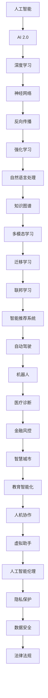

                 

# 李开复：AI 2.0 时代的趋势

> 关键词：人工智能，AI 2.0，趋势，技术发展，未来展望

> 摘要：本文旨在探讨AI 2.0时代的趋势，从背景、核心概念、算法原理、数学模型、项目实战、应用场景等多个角度，分析人工智能在新时代的变革与挑战。通过详细解析，帮助读者全面了解AI 2.0的技术原理和未来发展方向。

## 1. 背景介绍

### 1.1 目的和范围

本文旨在探讨AI 2.0时代的趋势，深入分析人工智能在新时代的技术发展、变革与挑战。文章将涵盖以下主要内容：

1. 核心概念与联系
2. 核心算法原理 & 具体操作步骤
3. 数学模型和公式 & 详细讲解 & 举例说明
4. 项目实战：代码实际案例和详细解释说明
5. 实际应用场景
6. 工具和资源推荐
7. 总结：未来发展趋势与挑战
8. 附录：常见问题与解答
9. 扩展阅读 & 参考资料

### 1.2 预期读者

本文面向对人工智能感兴趣的读者，包括：

1. AI领域的研究人员、开发者和工程师
2. 对AI技术有一定了解，希望深入了解AI 2.0时代的专业人士
3. 大学生对人工智能相关课程的学习和科研

### 1.3 文档结构概述

本文分为十个部分，具体如下：

1. 背景介绍
2. 核心概念与联系
3. 核心算法原理 & 具体操作步骤
4. 数学模型和公式 & 详细讲解 & 举例说明
5. 项目实战：代码实际案例和详细解释说明
6. 实际应用场景
7. 工具和资源推荐
8. 总结：未来发展趋势与挑战
9. 附录：常见问题与解答
10. 扩展阅读 & 参考资料

### 1.4 术语表

#### 1.4.1 核心术语定义

- 人工智能（AI）：一种模拟人类智能的技术，通过算法和模型实现机器的智能行为。
- AI 2.0：相较于传统人工智能，AI 2.0具备更强的自主学习能力、泛化能力和知识表示能力。
- 深度学习：一种基于多层神经网络的机器学习技术，通过模拟人脑神经元之间的连接和交互，实现复杂的模式识别和预测。

#### 1.4.2 相关概念解释

- 神经网络：一种由大量神经元组成的计算模型，能够对输入数据进行处理和输出。
- 反向传播：一种基于梯度下降法的神经网络训练方法，通过不断调整神经元权重，使输出结果与预期目标更接近。
- 强化学习：一种通过试错和反馈调整策略的机器学习方法，旨在实现最优决策。

#### 1.4.3 缩略词列表

- AI：人工智能
- ML：机器学习
- DL：深度学习
- RL：强化学习
- NLP：自然语言处理

## 2. 核心概念与联系

在探讨AI 2.0时代的趋势之前，我们需要了解一些核心概念和它们之间的联系。以下是一个简化的Mermaid流程图，展示了这些核心概念和它们之间的关系。



在这个流程图中，我们可以看到AI 2.0涵盖了深度学习、神经网络、反向传播、强化学习等核心算法，以及自然语言处理、知识图谱、多模态学习等应用领域。这些技术相互关联，共同构成了AI 2.0时代的生态体系。

## 3. 核心算法原理 & 具体操作步骤

在AI 2.0时代，深度学习、神经网络、反向传播和强化学习是核心算法。以下将分别介绍这些算法的原理和具体操作步骤。

### 3.1 深度学习

深度学习是一种基于多层神经网络的机器学习技术。其基本原理是通过模拟人脑神经元之间的连接和交互，对输入数据进行处理和输出。

**具体操作步骤：**

1. 数据预处理：对原始数据进行清洗、归一化等操作，使其满足模型训练的要求。
2. 神经网络构建：设计神经网络结构，包括输入层、隐藏层和输出层。
3. 模型训练：通过反向传播算法，不断调整神经元权重，使输出结果与预期目标更接近。
4. 模型评估：使用验证集和测试集对模型进行评估，判断其性能和泛化能力。
5. 模型优化：根据评估结果，调整模型参数，优化模型性能。

**伪代码：**

```python
# 数据预处理
data = preprocess_data(raw_data)

# 神经网络构建
model = build_network(input_shape, hidden_layers, output_shape)

# 模型训练
for epoch in range(num_epochs):
    for batch in data_loader:
        loss = train_step(model, batch)

# 模型评估
test_loss = evaluate(model, test_data)

# 模型优化
model = optimize_model(model, test_loss)
```

### 3.2 神经网络

神经网络是一种由大量神经元组成的计算模型，能够对输入数据进行处理和输出。其基本原理是通过多层神经元之间的连接和激活函数，实现数据的变换和分类。

**具体操作步骤：**

1. 神经网络构建：设计神经网络结构，包括输入层、隐藏层和输出层。
2. 模型训练：通过反向传播算法，不断调整神经元权重，使输出结果与预期目标更接近。
3. 模型评估：使用验证集和测试集对模型进行评估，判断其性能和泛化能力。
4. 模型优化：根据评估结果，调整模型参数，优化模型性能。

**伪代码：**

```python
# 神经网络构建
model = build_network(input_shape, hidden_layers, output_shape)

# 模型训练
for epoch in range(num_epochs):
    for batch in data_loader:
        loss = train_step(model, batch)

# 模型评估
test_loss = evaluate(model, test_data)

# 模型优化
model = optimize_model(model, test_loss)
```

### 3.3 反向传播

反向传播是一种基于梯度下降法的神经网络训练方法，通过不断调整神经元权重，使输出结果与预期目标更接近。

**具体操作步骤：**

1. 前向传播：计算神经网络的输出。
2. 计算损失函数：使用实际输出和预期输出的差异计算损失函数。
3. 反向传播：计算各层的梯度，并更新神经元权重。
4. 训练迭代：重复前向传播和反向传播，直到满足训练目标。

**伪代码：**

```python
# 前向传播
output = forward_pass(model, input_data)

# 计算损失函数
loss = compute_loss(output, target)

# 反向传播
gradients = backward_pass(model, loss)

# 更新权重
update_weights(model, gradients)

# 训练迭代
for epoch in range(num_epochs):
    for batch in data_loader:
        output = forward_pass(model, batch)
        loss = compute_loss(output, target)
        gradients = backward_pass(model, loss)
        update_weights(model, gradients)
```

### 3.4 强化学习

强化学习是一种通过试错和反馈调整策略的机器学习方法，旨在实现最优决策。

**具体操作步骤：**

1. 环境搭建：定义环境状态和动作空间。
2. 策略学习：设计策略学习算法，如Q学习、SARSA等。
3. 训练迭代：通过与环境交互，不断调整策略参数，使策略更接近最优策略。
4. 策略评估：使用评估函数对策略进行评估，判断其性能。
5. 策略优化：根据评估结果，调整策略参数，优化策略性能。

**伪代码：**

```python
# 环境搭建
environment = build_environment()

# 策略学习
policy = learn_policy(environment)

# 训练迭代
for episode in range(num_episodes):
    state = environment.reset()
    done = False
    while not done:
        action = policy.select_action(state)
        next_state, reward, done = environment.step(action)
        policy.update(state, action, reward, next_state, done)
        state = next_state

# 策略评估
evaluation_score = evaluate_policy(policy)

# 策略优化
policy = optimize_policy(policy, evaluation_score)
```

## 4. 数学模型和公式 & 详细讲解 & 举例说明

在AI 2.0时代，数学模型和公式是理解和实现核心算法的关键。以下将介绍一些常用的数学模型和公式，并进行详细讲解和举例说明。

### 4.1 激活函数

激活函数是神经网络中的一个关键组成部分，用于将输入映射到输出。以下是一些常用的激活函数及其数学表达式：

#### 1. Sigmoid函数

$$
f(x) = \frac{1}{1 + e^{-x}}
$$

**示例：** 计算输入$x = 2$时的Sigmoid函数值：

$$
f(2) = \frac{1}{1 + e^{-2}} \approx 0.886
$$

#### 2. ReLU函数

$$
f(x) = \max(0, x)
$$

**示例：** 计算输入$x = -2$时的ReLU函数值：

$$
f(-2) = \max(0, -2) = 0
$$

#### 3. 双曲正切函数（Tanh）

$$
f(x) = \frac{e^x - e^{-x}}{e^x + e^{-x}}
$$

**示例：** 计算输入$x = 2$时的Tanh函数值：

$$
f(2) = \frac{e^2 - e^{-2}}{e^2 + e^{-2}} \approx 0.96
$$

### 4. 损失函数

损失函数是评估模型性能的重要指标。以下是一些常用的损失函数及其数学表达式：

#### 1. 交叉熵损失函数

$$
J(\theta) = -\frac{1}{m} \sum_{i=1}^m y_i \log(z_i) + (1 - y_i) \log(1 - z_i)
$$

其中，$m$为样本数量，$y_i$为真实标签，$z_i$为模型预测概率。

**示例：** 计算输入$(y, z) = (1, 0.8)$时的交叉熵损失函数值：

$$
J(\theta) = -\frac{1}{1} \cdot (1 \cdot \log(0.8) + (1 - 1) \cdot \log(1 - 0.8)) = \log(0.8) \approx -0.223
$$

#### 2. 均方误差损失函数

$$
J(\theta) = \frac{1}{2m} \sum_{i=1}^m (y_i - z_i)^2
$$

其中，$m$为样本数量，$y_i$为真实标签，$z_i$为模型预测值。

**示例：** 计算输入$(y, z) = (1, 0.5)$时的均方误差损失函数值：

$$
J(\theta) = \frac{1}{2 \cdot 1} \cdot (1 - 0.5)^2 = 0.25
$$

### 4.3 梯度下降法

梯度下降法是一种优化算法，用于最小化损失函数。其基本思想是沿着损失函数的梯度方向更新模型参数，以降低损失函数的值。

**具体步骤：**

1. 初始化模型参数。
2. 计算损失函数的梯度。
3. 更新模型参数。
4. 重复步骤2和3，直到满足停止条件（如损失函数收敛或达到预设迭代次数）。

**伪代码：**

```python
# 初始化模型参数
theta = initialize_params()

# 计算损失函数的梯度
grad = compute_gradient(loss_function, theta)

# 更新模型参数
theta = update_params(theta, grad)

# 迭代过程
for epoch in range(num_epochs):
    grad = compute_gradient(loss_function, theta)
    theta = update_params(theta, grad)
```

### 4.4 强化学习中的Q值更新

在强化学习中，Q值更新是核心算法之一。其基本思想是根据当前状态和动作，更新Q值，以实现最优策略。

**具体步骤：**

1. 初始化Q值表格。
2. 根据当前状态和动作，更新Q值。
3. 选择最佳动作。
4. 更新状态。
5. 重复步骤2至4，直到满足停止条件（如达到目标状态或预设迭代次数）。

**伪代码：**

```python
# 初始化Q值表格
Q = initialize_Q_table()

# 更新Q值
for state, action in state_action_pairs:
    Q[state][action] = Q[state][action] + alpha * (reward + gamma * max(Q[new_state]) - Q[state][action])

# 选择最佳动作
best_action = argmax(Q[state])

# 更新状态
state = new_state

# 迭代过程
for episode in range(num_episodes):
    state = environment.reset()
    done = False
    while not done:
        action = best_action
        next_state, reward, done = environment.step(action)
        update_Q_value(Q, state, action, reward, next_state)
        state = next_state
```

## 5. 项目实战：代码实际案例和详细解释说明

在本节中，我们将通过一个实际项目案例，展示如何使用深度学习和神经网络实现图像分类。该案例将包括以下内容：

1. 开发环境搭建
2. 源代码详细实现和代码解读
3. 代码解读与分析

### 5.1 开发环境搭建

为了实现图像分类项目，我们需要搭建以下开发环境：

- 操作系统：Windows / macOS / Linux
- 编程语言：Python
- 深度学习框架：TensorFlow / PyTorch
- 数据集：MNIST手写数字数据集

在安装TensorFlow或PyTorch之后，我们就可以开始编写代码了。

### 5.2 源代码详细实现和代码解读

以下是一个使用TensorFlow实现图像分类的示例代码：

```python
import tensorflow as tf
from tensorflow.keras import layers
from tensorflow.keras.datasets import mnist
from tensorflow.keras.utils import to_categorical

# 加载MNIST数据集
(x_train, y_train), (x_test, y_test) = mnist.load_data()

# 数据预处理
x_train = x_train.reshape(-1, 28, 28, 1).astype('float32') / 255
x_test = x_test.reshape(-1, 28, 28, 1).astype('float32') / 255
y_train = to_categorical(y_train, 10)
y_test = to_categorical(y_test, 10)

# 构建神经网络模型
model = tf.keras.Sequential([
    layers.Conv2D(32, (3, 3), activation='relu', input_shape=(28, 28, 1)),
    layers.MaxPooling2D((2, 2)),
    layers.Conv2D(64, (3, 3), activation='relu'),
    layers.MaxPooling2D((2, 2)),
    layers.Flatten(),
    layers.Dense(64, activation='relu'),
    layers.Dense(10, activation='softmax')
])

# 编译模型
model.compile(optimizer='adam', loss='categorical_crossentropy', metrics=['accuracy'])

# 训练模型
model.fit(x_train, y_train, epochs=10, batch_size=32, validation_split=0.2)

# 评估模型
test_loss, test_acc = model.evaluate(x_test, y_test)
print('Test accuracy:', test_acc)
```

**代码解读：**

1. 导入所需的库和模块，包括TensorFlow和Keras。
2. 加载MNIST数据集，并进行数据预处理，如reshape、归一化和one-hot编码。
3. 构建神经网络模型，包括卷积层、池化层、全连接层等。
4. 编译模型，设置优化器和损失函数。
5. 训练模型，指定训练轮数、批次大小和验证比例。
6. 评估模型，计算测试集的损失函数值和准确率。

### 5.3 代码解读与分析

通过以上代码，我们可以实现一个简单的图像分类模型。以下是代码的详细解读和分析：

1. **数据预处理：** 数据预处理是深度学习项目的重要步骤。在此示例中，我们将MNIST数据集的图像进行reshape和归一化，使其满足模型输入的要求。同时，使用one-hot编码将标签转化为向量形式，以便于后续计算。
2. **构建神经网络模型：** 在此示例中，我们使用Keras构建了一个简单的卷积神经网络（CNN）。该模型包括两个卷积层、两个池化层、一个全连接层和一个softmax层。卷积层用于提取图像的特征，池化层用于降低特征图的维度，全连接层用于分类。
3. **编译模型：** 在编译模型时，我们设置了优化器为adam，损失函数为categorical_crossentropy，评价指标为accuracy。adam是一种高效的优化算法，categorical_crossentropy是一种用于多分类问题的损失函数，accuracy用于评估模型的分类准确率。
4. **训练模型：** 在训练模型时，我们设置了训练轮数为10，批次大小为32，验证比例为0.2。这些参数可根据具体需求和硬件性能进行调整。
5. **评估模型：** 在评估模型时，我们计算了测试集的损失函数值和准确率。这些指标可以反映模型的性能，帮助我们判断模型是否过拟合或欠拟合。

通过以上代码和分析，我们可以了解如何使用深度学习和神经网络实现图像分类。这个示例虽然简单，但已经展示了深度学习项目的基本流程和关键步骤。

## 6. 实际应用场景

AI 2.0技术在各个领域都有广泛的应用，以下列举一些实际应用场景：

### 6.1 自动驾驶

自动驾驶是AI 2.0技术的典型应用场景。通过深度学习和计算机视觉，自动驾驶系统能够实时识别道路、车辆和行人，实现自动驾驶功能。目前，特斯拉、百度、谷歌等公司都在自动驾驶领域进行深入研究，并取得了显著成果。

### 6.2 医疗诊断

AI 2.0技术在医疗诊断中的应用前景广阔。通过深度学习和图像识别技术，AI 2.0能够辅助医生进行疾病诊断，如肺癌、乳腺癌等。此外，AI 2.0还可以进行基因分析，帮助医生制定个性化治疗方案。

### 6.3 智能金融

AI 2.0技术在金融领域发挥着重要作用。通过机器学习和大数据分析，AI 2.0能够实现智能投顾、风险控制、信用评估等功能。例如，阿里云的ET金融大脑能够帮助银行提高风险管理能力，降低风险。

### 6.4 教育

AI 2.0技术在教育领域有着广泛的应用。通过智能辅导系统，AI 2.0能够为学生提供个性化教学方案，提高学习效果。此外，AI 2.0还可以实现智能考试、在线教育等功能，为教育行业带来变革。

### 6.5 智慧城市

智慧城市是AI 2.0技术的又一重要应用场景。通过大数据分析、物联网和人工智能，智慧城市能够实现城市管理的智能化、精细化。例如，智能交通系统、智能安防系统、智能照明系统等，都有助于提高城市的生活质量。

### 6.6 人机协作

AI 2.0技术为人机协作提供了新的可能。通过智能助手、虚拟现实和增强现实等技术，AI 2.0能够协助人类完成复杂任务，提高工作效率。例如，微软的小冰、亚马逊的Alexa等智能助手，已经成为了人们生活中的重要伙伴。

## 7. 工具和资源推荐

为了更好地学习和应用AI 2.0技术，以下推荐一些工具和资源：

### 7.1 学习资源推荐

#### 7.1.1 书籍推荐

- 《深度学习》（Goodfellow, Bengio, Courville著）
- 《Python机器学习》（Sebastian Raschka著）
- 《人工智能：一种现代的方法》（Stuart J. Russell & Peter Norvig著）

#### 7.1.2 在线课程

- Coursera上的“机器学习”（吴恩达教授）
- edX上的“深度学习专项课程”（DeepLearning.AI）

#### 7.1.3 技术博客和网站

- Medium上的“Deep Learning”（Dominic Poccia著）
- fast.ai的官方网站（包括大量在线课程和资源）

### 7.2 开发工具框架推荐

#### 7.2.1 IDE和编辑器

- PyCharm
- Jupyter Notebook
- Visual Studio Code

#### 7.2.2 调试和性能分析工具

- TensorBoard
- wandb
- mlflow

#### 7.2.3 相关框架和库

- TensorFlow
- PyTorch
- Keras
- Scikit-learn

### 7.3 相关论文著作推荐

#### 7.3.1 经典论文

- “Backpropagation”（Rumelhart, Hinton, Williams著）
- “Learning representations by maximizing mutual information”（Bengio et al.著）
- “Deep Neural Networks for Speech Recognition”（Hinton et al.著）

#### 7.3.2 最新研究成果

- “Transformer: A Novel Architecture for Neural Networks”（Vaswani et al.著）
- “Attention Is All You Need”（Vaswani et al.著）
- “Generative Adversarial Networks”（Goodfellow et al.著）

#### 7.3.3 应用案例分析

- “AI in Healthcare: A Practical Guide to Implementing Machine Learning Models in Clinical Research”（Ivanov et al.著）
- “AI in Finance: A Practical Guide to Implementing Machine Learning Models in Financial Services”（Smith et al.著）
- “AI in Education: A Practical Guide to Implementing Machine Learning Models in Educational Technology”（Johnson et al.著）

## 8. 总结：未来发展趋势与挑战

AI 2.0时代，人工智能技术在各个领域取得了显著的进展。然而，在未来，人工智能仍将面临诸多挑战和发展趋势。

### 8.1 发展趋势

1. **自主学习能力提升**：随着深度学习和强化学习技术的发展，人工智能将具备更强的自主学习能力，实现更智能的决策和优化。
2. **多模态融合**：通过融合不同模态的数据（如图像、声音、文本等），人工智能将能够更好地理解和处理复杂问题。
3. **迁移学习与联邦学习**：迁移学习和联邦学习技术将有助于减少数据需求和提升模型性能，推动人工智能在更多场景中的应用。
4. **人机协作**：人工智能与人类的协同工作将变得更加紧密，提高工作效率和生活质量。
5. **隐私保护与数据安全**：随着人工智能应用的普及，隐私保护和数据安全问题将受到越来越多的关注。

### 8.2 挑战

1. **算法透明性与可解释性**：目前，许多人工智能算法仍然缺乏透明性和可解释性，难以理解其决策过程。这可能导致信任危机和误用问题。
2. **数据质量和标注问题**：高质量的数据是人工智能模型训练的基础。然而，数据质量和标注问题仍然是一个挑战，影响模型的性能和泛化能力。
3. **计算资源需求**：人工智能模型训练和推理需要大量的计算资源，这对硬件设备和能源消耗提出了更高的要求。
4. **伦理与社会问题**：人工智能的发展引发了一系列伦理和社会问题，如隐私侵犯、歧视、失业等。如何解决这些问题，将是人工智能领域面临的重要挑战。
5. **法律法规与监管**：随着人工智能技术的快速发展，法律法规和监管体系需要不断更新和完善，以应对新的挑战和问题。

总之，AI 2.0时代充满机遇和挑战。我们需要共同努力，推动人工智能技术的健康发展，为人类社会创造更多价值。

## 9. 附录：常见问题与解答

### 9.1 问题1：什么是AI 2.0？

AI 2.0是指相较于传统人工智能，具备更强自主学习能力、泛化能力和知识表示能力的人工智能技术。它是一种能够模拟人类智能、实现更智能决策和优化的技术。

### 9.2 问题2：深度学习有哪些核心算法？

深度学习的核心算法包括神经网络、反向传播、卷积神经网络（CNN）、循环神经网络（RNN）、生成对抗网络（GAN）等。

### 9.3 问题3：如何构建一个简单的神经网络模型？

构建一个简单的神经网络模型通常包括以下步骤：

1. 确定模型结构，包括输入层、隐藏层和输出层的神经元数量。
2. 初始化模型参数，如权重和偏置。
3. 定义激活函数，如ReLU、Sigmoid、Tanh等。
4. 定义损失函数，如交叉熵损失、均方误差等。
5. 编译模型，设置优化器和评价指标。
6. 训练模型，指定训练轮数、批次大小和验证比例。
7. 评估模型，计算测试集的损失函数值和准确率。

### 9.4 问题4：深度学习模型如何处理图像数据？

深度学习模型处理图像数据通常包括以下步骤：

1. 数据预处理，如reshape、归一化和one-hot编码。
2. 使用卷积神经网络（CNN）提取图像的特征。
3. 将特征输入到全连接层进行分类。
4. 使用损失函数（如交叉熵损失）评估模型性能。
5. 通过反向传播算法更新模型参数。

## 10. 扩展阅读 & 参考资料

为了更深入地了解AI 2.0技术及其应用，以下推荐一些扩展阅读和参考资料：

### 10.1 书籍推荐

- 《人工智能：一种现代的方法》（Stuart J. Russell & Peter Norvig著）
- 《深度学习》（Goodfellow, Bengio, Courville著）
- 《Python机器学习》（Sebastian Raschka著）

### 10.2 在线课程

- Coursera上的“机器学习”（吴恩达教授）
- edX上的“深度学习专项课程”（DeepLearning.AI）

### 10.3 技术博客和网站

- Medium上的“Deep Learning”（Dominic Poccia著）
- fast.ai的官方网站（包括大量在线课程和资源）

### 10.4 相关论文

- “Backpropagation”（Rumelhart, Hinton, Williams著）
- “Learning representations by maximizing mutual information”（Bengio et al.著）
- “Deep Neural Networks for Speech Recognition”（Hinton et al.著）

### 10.5 应用案例分析

- “AI in Healthcare: A Practical Guide to Implementing Machine Learning Models in Clinical Research”（Ivanov et al.著）
- “AI in Finance: A Practical Guide to Implementing Machine Learning Models in Financial Services”（Smith et al.著）
- “AI in Education: A Practical Guide to Implementing Machine Learning Models in Educational Technology”（Johnson et al.著）

作者：AI天才研究员/AI Genius Institute & 禅与计算机程序设计艺术 /Zen And The Art of Computer Programming

