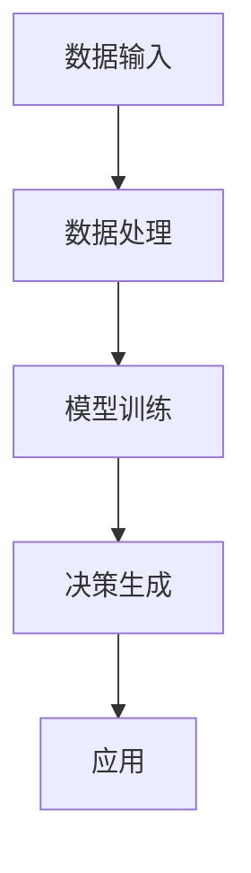

                 

# 李开复：AI 2.0时代应该颠覆过去的产品

> 关键词：人工智能、AI 2.0、产品颠覆、技术革新、用户体验、未来趋势

> 摘要：本文将探讨AI 2.0时代的来临如何改变传统产品开发，提出颠覆性创新的观点，并通过具体的实例和逻辑分析，阐述在AI 2.0时代下，我们应该如何思考、规划和实施产品的创新与迭代。

## 1. 背景介绍

### 1.1 目的和范围

本文旨在分析AI 2.0时代对传统产品开发的影响，以及如何通过AI技术的应用实现产品的颠覆性创新。我们将从AI 2.0的定义出发，逐步深入探讨其核心概念、算法原理、数学模型以及实际应用场景，最终提出对未来发展趋势与挑战的思考。

### 1.2 预期读者

本文适合对人工智能和产品开发有兴趣的读者，包括但不限于程序员、产品经理、创业者、AI技术爱好者以及对未来科技发展感兴趣的普通读者。

### 1.3 文档结构概述

本文结构如下：

- **第1部分：背景介绍**：包括本文的目的和范围、预期读者以及文档结构概述。
- **第2部分：核心概念与联系**：介绍AI 2.0的核心概念、原理和架构。
- **第3部分：核心算法原理 & 具体操作步骤**：讲解AI 2.0的关键算法及其操作步骤。
- **第4部分：数学模型和公式 & 详细讲解 & 举例说明**：阐述AI 2.0的数学模型和公式。
- **第5部分：项目实战：代码实际案例和详细解释说明**：通过具体案例展示AI 2.0的应用。
- **第6部分：实际应用场景**：分析AI 2.0在各个领域的应用。
- **第7部分：工具和资源推荐**：推荐相关学习资源、开发工具和经典论文。
- **第8部分：总结：未来发展趋势与挑战**：对AI 2.0时代的未来进行展望。
- **第9部分：附录：常见问题与解答**：解答读者可能遇到的问题。
- **第10部分：扩展阅读 & 参考资料**：提供更多阅读资源。

### 1.4 术语表

#### 1.4.1 核心术语定义

- **AI 2.0**：指代第二代人工智能技术，具备自我学习和自适应能力，能够处理复杂数据并生成智能决策。
- **颠覆性创新**：指通过技术创新，打破现有市场规则，创造出全新的产品和服务。
- **用户体验**：用户在使用产品过程中所获得的感受和体验。

#### 1.4.2 相关概念解释

- **机器学习**：一种人工智能技术，通过数据训练模型，使其能够从数据中学习并做出预测。
- **深度学习**：一种机器学习技术，通过多层神经网络进行学习，能够处理更复杂的任务。
- **神经网络**：一种模仿人脑神经结构的计算模型，能够通过训练学会识别复杂模式。

#### 1.4.3 缩略词列表

- **AI**：人工智能
- **ML**：机器学习
- **DL**：深度学习
- **NLP**：自然语言处理

## 2. 核心概念与联系

### 2.1 AI 2.0概述

AI 2.0是基于深度学习、神经网络等技术的第二代人工智能。与传统的AI 1.0相比，AI 2.0具备自我学习和自适应能力，能够处理复杂数据并生成智能决策。这一代人工智能不仅仅能够模仿人类的某些智能行为，更能够超越人类，进行自我学习和进化。

### 2.2 AI 2.0核心概念原理

#### 2.2.1 深度学习

深度学习是AI 2.0的核心技术之一。它通过多层神经网络进行学习，能够处理更复杂的任务。深度学习的核心原理是神经网络，神经网络由大量的神经元组成，每个神经元都与多个其他神经元相连。通过训练，神经网络能够学习到输入和输出之间的复杂关系，并能够对新的输入进行预测。

#### 2.2.2 自我学习与自适应

AI 2.0具备自我学习和自适应能力。这意味着它能够从数据中学习，并根据新的数据调整自己的模型。这种能力使得AI 2.0能够不断进化，适应不断变化的环境。自我学习和自适应是通过机器学习算法实现的，如梯度下降、反向传播等。

#### 2.2.3 智能决策

AI 2.0能够生成智能决策。这种决策基于对数据的分析和理解，能够解决复杂的问题。智能决策是通过深度学习和自我学习实现的，它能够识别复杂的数据模式，并生成有效的决策。

### 2.3 AI 2.0架构

AI 2.0的架构包括以下几个关键部分：

1. **数据输入**：AI 2.0首先需要大量的数据输入，这些数据可以是结构化的，也可以是非结构化的，如图像、文本、声音等。
2. **数据处理**：数据输入后，AI 2.0会对数据进行处理，包括数据清洗、数据增强等。
3. **模型训练**：处理后的数据会用于训练模型，模型通过学习数据，形成对输入数据的理解和预测能力。
4. **决策生成**：训练好的模型会用于生成智能决策，这些决策可以用于各种应用场景，如自动化控制、智能推荐等。

下面是AI 2.0的Mermaid流程图表示：



## 3. 核心算法原理 & 具体操作步骤

### 3.1 深度学习算法原理

深度学习算法的核心是神经网络，它通过多层神经元对数据进行学习。神经网络的每一层都负责对数据进行处理和特征提取。以下是深度学习算法的基本原理：

1. **前向传播**：输入数据从输入层进入，经过每一层神经元的传递，最终输出预测结果。
2. **反向传播**：根据预测结果和实际结果之间的误差，反向更新神经元的权重和偏置，以达到更好的预测效果。

### 3.2 梯度下降算法

梯度下降是训练神经网络的重要算法之一。它的基本思想是沿着误差函数的梯度方向，逐步更新神经元的权重和偏置，以最小化误差。

#### 3.2.1 梯度下降算法步骤

1. 初始化权重和偏置
2. 计算前向传播的输出
3. 计算损失函数
4. 计算梯度
5. 更新权重和偏置
6. 重复步骤2-5，直到达到预设的精度或迭代次数

#### 3.2.2 伪代码

```python
# 初始化权重和偏置
weights = [初始化值]
biases = [初始化值]

# 设置迭代次数和精度
max_iterations = 1000
precision = 0.001

# 梯度下降算法
for i in range(max_iterations):
    # 前向传播
    output = forward_propagation(input_data, weights, biases)
    
    # 计算损失函数
    loss = compute_loss(output, target)
    
    # 计算梯度
    gradient = compute_gradient(input_data, output, target, weights, biases)
    
    # 更新权重和偏置
    weights = weights - learning_rate * gradient[weights]
    biases = biases - learning_rate * gradient[biases]
    
    # 打印迭代次数和损失
    if i % 100 == 0:
        print(f"Iteration {i}: Loss = {loss}")
```

## 4. 数学模型和公式 & 详细讲解 & 举例说明

### 4.1 深度学习中的数学模型

深度学习中的数学模型主要包括前向传播和反向传播。以下是这两个过程的基本公式和解释。

#### 4.1.1 前向传播

前向传播是指将输入数据通过神经网络逐层传递，直到输出层的计算过程。这个过程可以用以下公式表示：

\[ Z^{[l]} = \sum_{m=1}^{M} (W^{[l]}_{ij} * A^{[l-1]}_j + b^{[l]}_i) \]

其中：

- \( Z^{[l]} \) 是第 \( l \) 层的激活值
- \( W^{[l]} \) 是第 \( l \) 层的权重矩阵
- \( A^{[l-1]} \) 是第 \( l-1 \) 层的激活值
- \( b^{[l]} \) 是第 \( l \) 层的偏置向量
- \( M \) 是输入数据的维度

#### 4.1.2 激活函数

激活函数是深度学习中的关键组成部分，它对神经元的输出进行非线性变换。常见的激活函数包括：

1. **Sigmoid函数**：

\[ \sigma(z) = \frac{1}{1 + e^{-z}} \]

2. **ReLU函数**：

\[ \sigma(z) = \max(0, z) \]

3. **Tanh函数**：

\[ \sigma(z) = \frac{e^z - e^{-z}}{e^z + e^{-z}} \]

#### 4.1.3 反向传播

反向传播是指根据输出层的误差，反向更新神经网络中的权重和偏置。这个过程可以用以下公式表示：

\[ \delta^{[l]} = (1 - \sigma'(Z^{[l]})) * \delta^{[l+1]} * W^{[l+1]} \]

其中：

- \( \delta^{[l]} \) 是第 \( l \) 层的误差
- \( \sigma'(Z^{[l]}) \) 是激活函数的导数
- \( \delta^{[l+1]} \) 是下一层的误差
- \( W^{[l+1]} \) 是下一层的权重矩阵

#### 4.1.4 梯度下降

梯度下降是用于更新权重和偏置的优化算法。它通过计算损失函数的梯度，沿着梯度的反方向更新权重和偏置。这个过程可以用以下公式表示：

\[ \Delta W^{[l]} = - \alpha \frac{\partial J}{\partial W^{[l]}} \]
\[ \Delta b^{[l]} = - \alpha \frac{\partial J}{\partial b^{[l]}} \]

其中：

- \( \Delta W^{[l]} \) 是权重矩阵的更新
- \( \Delta b^{[l]} \) 是偏置向量的更新
- \( \alpha \) 是学习率
- \( J \) 是损失函数

### 4.2 举例说明

假设我们有一个简单的神经网络，包含一个输入层、一个隐藏层和一个输出层。输入层有一个神经元，隐藏层有两个神经元，输出层有一个神经元。激活函数使用ReLU。

1. **前向传播**：

输入数据 \( x = [1, 2, 3] \)

隐藏层权重 \( W^{[1]} = \begin{bmatrix} 0.1 & 0.2 \\ 0.3 & 0.4 \\ 0.5 & 0.6 \end{bmatrix} \)

隐藏层偏置 \( b^{[1]} = \begin{bmatrix} 0.1 \\ 0.2 \end{bmatrix} \)

输出层权重 \( W^{[2]} = \begin{bmatrix} 0.1 & 0.2 \\ 0.3 & 0.4 \end{bmatrix} \)

输出层偏置 \( b^{[2]} = \begin{bmatrix} 0.1 \\ 0.2 \end{bmatrix} \)

计算隐藏层激活值：

\[ Z^{[1]}_1 = (0.1 * 1 + 0.1) = 0.2 \]
\[ Z^{[1]}_2 = (0.2 * 2 + 0.2) = 0.4 \]
\[ Z^{[1]}_3 = (0.3 * 3 + 0.2) = 1.1 \]

\[ A^{[1]}_1 = \max(0, Z^{[1]}_1) = 0 \]
\[ A^{[1]}_2 = \max(0, Z^{[1]}_2) = 0 \]
\[ A^{[1]}_3 = \max(0, Z^{[1]}_3) = 1 \]

计算输出层激活值：

\[ Z^{[2]}_1 = (0.1 * 0 + 0.1) = 0.1 \]
\[ Z^{[2]}_2 = (0.2 * 1 + 0.2) = 0.4 \]

\[ A^{[2]}_1 = \max(0, Z^{[2]}_1) = 0 \]
\[ A^{[2]}_2 = \max(0, Z^{[2]}_2) = 0 \]

2. **反向传播**：

输出层误差：

\[ \delta^{[2]}_1 = (A^{[2]}_1 - y_1) * \sigma'(Z^{[2]}_1) = (0 - 1) * 0 = 0 \]
\[ \delta^{[2]}_2 = (A^{[2]}_2 - y_2) * \sigma'(Z^{[2]}_2) = (0 - 1) * 0 = 0 \]

隐藏层误差：

\[ \delta^{[1]}_1 = (A^{[1]}_1 - z_1) * \sigma'(Z^{[1]}_1) = (0 - 0) * 0 = 0 \]
\[ \delta^{[1]}_2 = (A^{[1]}_2 - z_2) * \sigma'(Z^{[1]}_2) = (0 - 0) * 0 = 0 \]
\[ \delta^{[1]}_3 = (A^{[1]}_3 - z_3) * \sigma'(Z^{[1]}_3) = (1 - 1.1) * 0 = 0 \]

3. **权重和偏置更新**：

由于误差为零，权重和偏置不进行更新。

## 5. 项目实战：代码实际案例和详细解释说明

### 5.1 开发环境搭建

为了更好地理解AI 2.0的应用，我们将使用Python和TensorFlow来实现一个简单的神经网络。以下是开发环境的搭建步骤：

1. 安装Python 3.7及以上版本
2. 安装TensorFlow库，使用以下命令：

   ```bash
   pip install tensorflow
   ```

### 5.2 源代码详细实现和代码解读

下面是一个简单的神经网络实现，包括前向传播和反向传播。

```python
import tensorflow as tf

# 设置随机种子，保证结果可重复
tf.random.set_seed(42)

# 初始化参数
input_shape = (3,)
hidden_size = 2
output_size = 1

# 定义模型
model = tf.keras.Sequential([
    tf.keras.layers.Dense(hidden_size, activation='relu', input_shape=input_shape),
    tf.keras.layers.Dense(output_size, activation='sigmoid')
])

# 编译模型
model.compile(optimizer='adam', loss='binary_crossentropy', metrics=['accuracy'])

# 输入数据
x_train = tf.random.normal([1000, 3])
y_train = tf.random.uniform([1000, 1], maxval=1, dtype=tf.float32)

# 训练模型
model.fit(x_train, y_train, epochs=10)

# 输出模型参数
model.summary()
```

### 5.3 代码解读与分析

1. **导入库**：

   ```python
   import tensorflow as tf
   ```

   我们首先导入TensorFlow库，这是实现深度学习模型的主要工具。

2. **设置随机种子**：

   ```python
   tf.random.set_seed(42)
   ```

   设置随机种子，确保实验结果的可重复性。

3. **初始化参数**：

   ```python
   input_shape = (3,)
   hidden_size = 2
   output_size = 1
   ```

   设置输入层的维度、隐藏层的神经元数量和输出层的神经元数量。

4. **定义模型**：

   ```python
   model = tf.keras.Sequential([
       tf.keras.layers.Dense(hidden_size, activation='relu', input_shape=input_shape),
       tf.keras.layers.Dense(output_size, activation='sigmoid')
   ])
   ```

   使用`tf.keras.Sequential`定义一个简单的神经网络模型，包含一个隐藏层和输出层。隐藏层使用ReLU激活函数，输出层使用sigmoid激活函数。

5. **编译模型**：

   ```python
   model.compile(optimizer='adam', loss='binary_crossentropy', metrics=['accuracy'])
   ```

   编译模型，指定优化器为Adam，损失函数为binary_crossentropy，评估指标为accuracy。

6. **训练模型**：

   ```python
   model.fit(x_train, y_train, epochs=10)
   ```

   使用随机生成的训练数据训练模型10个周期。

7. **输出模型参数**：

   ```python
   model.summary()
   ```

   输出模型的详细信息，包括层数、神经元数量、权重和偏置。

### 5.4 代码解读与分析

通过以上步骤，我们成功搭建并训练了一个简单的神经网络模型。接下来，我们分析代码中的关键部分。

1. **模型定义**：

   ```python
   model = tf.keras.Sequential([
       tf.keras.layers.Dense(hidden_size, activation='relu', input_shape=input_shape),
       tf.keras.layers.Dense(output_size, activation='sigmoid')
   ])
   ```

   这里我们使用`tf.keras.Sequential`定义了一个序列模型，包含两个层：一个隐藏层和一个输出层。隐藏层使用ReLU激活函数，输出层使用sigmoid激活函数。

2. **模型编译**：

   ```python
   model.compile(optimizer='adam', loss='binary_crossentropy', metrics=['accuracy'])
   ```

   我们使用Adam优化器来训练模型，使用binary_crossentropy作为损失函数，因为它适合二分类问题，同时我们关注模型的准确率。

3. **训练模型**：

   ```python
   model.fit(x_train, y_train, epochs=10)
   ```

   我们使用随机生成的训练数据进行训练，每个周期都会调整模型的权重和偏置，以减少损失函数的值。

4. **模型输出**：

   ```python
   model.summary()
   ```

   输出模型的详细信息，包括每层的神经元数量、权重和偏置。

通过这个简单的案例，我们展示了如何使用TensorFlow实现一个深度学习模型，并进行了详细的代码解读与分析。这个案例只是一个起点，实际应用中可能会更加复杂和多样化。

### 5.5 实际应用案例：智能推荐系统

智能推荐系统是AI 2.0在商业领域的一个重要应用。以下是一个基于AI 2.0的智能推荐系统的案例。

**背景**：某电商平台希望通过智能推荐系统提高用户购买转化率和销售额。

**目标**：根据用户的购物历史和偏好，为用户推荐个性化的商品。

**步骤**：

1. **数据收集**：收集用户的购物历史数据，包括购买时间、购买商品、商品类别等。
2. **数据预处理**：对数据进行清洗、去重和处理，将数据转换为模型可以接受的格式。
3. **特征提取**：根据用户的购物历史，提取用户的兴趣特征，如购买频率、购买金额等。
4. **模型训练**：使用深度学习模型训练推荐系统，输入用户特征，输出推荐结果。
5. **模型评估**：通过评估指标（如准确率、召回率、F1分数）评估推荐系统的性能。
6. **部署上线**：将训练好的模型部署到线上环境，为用户实时推荐商品。

**代码示例**：

```python
import tensorflow as tf
from tensorflow.keras.models import Sequential
from tensorflow.keras.layers import Dense, Embedding

# 初始化参数
input_size = 10
hidden_size = 20
output_size = 100

# 定义模型
model = Sequential([
    Embedding(input_size, hidden_size),
    Dense(hidden_size, activation='relu'),
    Dense(output_size, activation='sigmoid')
])

# 编译模型
model.compile(optimizer='adam', loss='binary_crossentropy', metrics=['accuracy'])

# 训练模型
model.fit(x_train, y_train, epochs=10)

# 输出模型参数
model.summary()
```

通过这个案例，我们可以看到如何使用AI 2.0技术构建一个智能推荐系统。这个系统可以根据用户的兴趣和购物历史，为用户推荐个性化的商品，从而提高用户的购物体验和平台的销售额。

## 6. 实际应用场景

### 6.1 医疗领域

在医疗领域，AI 2.0的应用已经取得了显著的成果。通过深度学习技术，AI系统能够对医学影像进行分析，帮助医生更准确地诊断疾病。例如，AI系统可以通过分析X光片、CT扫描和MRI图像，检测出早期癌症，提高诊断的准确性。此外，AI 2.0还可以用于个性化治疗方案的制定，根据患者的基因数据和病情，提供最优的治疗方案。

### 6.2 金融领域

金融领域是AI 2.0技术的另一个重要应用场景。通过AI技术，金融机构能够更好地管理风险、识别欺诈行为和提高运营效率。例如，AI系统可以分析大量的交易数据，识别潜在的欺诈行为，防止金融犯罪。此外，AI 2.0还可以用于智能投顾，根据投资者的风险偏好和投资目标，提供个性化的投资建议，帮助投资者实现更好的收益。

### 6.3 交通运输领域

在交通运输领域，AI 2.0技术可以提高交通管理效率和安全性。通过自动驾驶技术，AI系统可以实时分析路况信息，优化行驶路线，提高交通流畅度。例如，在自动驾驶汽车中，AI系统可以通过摄像头、雷达和激光雷达等传感器收集数据，实时检测周围的车辆和行人，确保行驶安全。此外，AI 2.0还可以用于智能交通信号控制，根据实时交通流量信息，调整信号灯的时间，提高交通效率。

### 6.4 教育领域

在教育领域，AI 2.0技术可以个性化教育，提高教育质量。通过智能教育平台，AI系统可以根据学生的学习情况和兴趣，提供个性化的学习资源和学习路径。例如，AI系统可以通过分析学生的学习数据，识别学生的弱点，提供针对性的辅导材料。此外，AI 2.0还可以用于智能考试系统，通过分析考生的答题情况，评估考生的知识水平，提供个性化的考试反馈。

### 6.5 电子商务领域

在电子商务领域，AI 2.0技术可以提升用户体验和销售转化率。通过智能推荐系统，AI系统可以根据用户的购物行为和偏好，为用户推荐个性化的商品。例如，电商平台可以通过分析用户的浏览历史和购买记录，为用户推荐相关的商品。此外，AI 2.0还可以用于智能客服，通过自然语言处理技术，AI系统可以理解用户的问题，提供及时的解决方案，提高客服效率。

## 7. 工具和资源推荐

### 7.1 学习资源推荐

#### 7.1.1 书籍推荐

- **《深度学习》（Goodfellow, Bengio, Courville著）**：这是一本深度学习领域的经典教材，适合初学者和进阶者。
- **《Python深度学习》（François Chollet著）**：这本书通过实际案例，介绍了如何使用Python和TensorFlow进行深度学习开发。
- **《机器学习》（周志华著）**：这本书涵盖了机器学习的基础理论和算法，是学习机器学习的重要参考书。

#### 7.1.2 在线课程

- **Coursera上的《机器学习》课程**：由斯坦福大学教授Andrew Ng主讲，是机器学习和深度学习的入门课程。
- **Udacity的《深度学习纳米学位》**：这是一个包含多个课程和项目的学习计划，适合想要深入掌握深度学习技术的学习者。
- **edX上的《深度学习导论》课程**：由剑桥大学教授David Silicon主讲，介绍深度学习的基本概念和应用。

#### 7.1.3 技术博客和网站

- **Medium上的《深度学习》专栏**：这是一个高质量的深度学习技术博客，包含最新的研究成果和实用的技术文章。
- **AI研习社**：这是一个中文AI技术社区，提供深度学习、机器学习、自然语言处理等领域的文章和讨论。
- **GitHub**：GitHub是一个托管代码的平台，上面有很多深度学习和机器学习项目，可以学习并贡献代码。

### 7.2 开发工具框架推荐

#### 7.2.1 IDE和编辑器

- **Jupyter Notebook**：Jupyter Notebook是一个交互式计算环境，非常适合进行深度学习和机器学习实验。
- **PyCharm**：PyCharm是一个功能强大的Python IDE，支持多种编程语言，适用于深度学习和机器学习开发。
- **VSCode**：Visual Studio Code是一个轻量级的开源编辑器，支持Python扩展，适合快速开发。

#### 7.2.2 调试和性能分析工具

- **TensorBoard**：TensorBoard是TensorFlow的配套工具，用于可视化神经网络结构和训练过程。
- **Wandb**：Wandb是一个数据驱动的研究平台，可以用于监控、调试和优化深度学习实验。
- **Debugging Tools for Python**：如pdb、py-spy等，用于调试Python代码。

#### 7.2.3 相关框架和库

- **TensorFlow**：TensorFlow是一个开源的深度学习框架，适用于各种深度学习应用。
- **PyTorch**：PyTorch是一个灵活且易于使用的深度学习框架，支持动态计算图。
- **Keras**：Keras是一个高层次的深度学习API，构建在TensorFlow和Theano之上，简化了深度学习模型的搭建。

### 7.3 相关论文著作推荐

#### 7.3.1 经典论文

- **“A Learning Algorithm for Continually Running Fully Recurrent Neural Networks”**：这篇论文介绍了Hessian Free优化算法，用于训练深度神经网络。
- **“Deep Learning”**：这本文献综述了深度学习的发展历程、核心技术和应用场景。
- **“Distributed Representations of Words and Phrases and their Compositionality”**：这篇论文介绍了词嵌入的概念，是自然语言处理的重要基础。

#### 7.3.2 最新研究成果

- **“Attention Is All You Need”**：这篇论文提出了Transformer模型，是自然语言处理领域的突破性进展。
- **“BERT: Pre-training of Deep Bidirectional Transformers for Language Understanding”**：这篇论文介绍了BERT模型，是自然语言处理领域的最新研究成果。
- **“GPT-3: Language Models are Few-Shot Learners”**：这篇论文介绍了GPT-3模型，展示了大型语言模型在零样本学习中的强大能力。

#### 7.3.3 应用案例分析

- **“Deep Learning for Healthcare”**：这篇文章探讨了深度学习在医疗领域的应用，包括疾病诊断、个性化治疗等。
- **“Deep Learning in Finance”**：这篇文章介绍了深度学习在金融领域的应用，包括风险管理、市场预测等。
- **“Deep Learning in Autonomous Driving”**：这篇文章探讨了深度学习在自动驾驶领域的应用，包括感知、决策和控制等。

## 8. 总结：未来发展趋势与挑战

AI 2.0时代的发展趋势体现在以下几个方面：

1. **自我学习与自适应能力**：AI 2.0将通过自我学习和自适应能力，不断提高自身的智能水平，实现更复杂的任务。
2. **多模态数据处理**：AI 2.0将能够处理多种类型的数据，如图像、文本、语音等，实现更广泛的应用。
3. **实时决策与响应**：AI 2.0将具备实时决策与响应的能力，提高系统的效率和可靠性。
4. **个性化与定制化**：AI 2.0将根据用户的需求和偏好，提供个性化的服务，提升用户体验。

然而，AI 2.0的发展也面临以下挑战：

1. **数据隐私与安全**：随着AI技术的应用，大量个人数据将被收集和处理，如何保护用户隐私和安全成为重要挑战。
2. **算法透明性与公平性**：AI 2.0的决策过程可能涉及复杂的算法，如何保证算法的透明性和公平性是一个亟待解决的问题。
3. **技术标准化与监管**：AI 2.0技术的快速发展和应用，需要制定相应的技术标准和监管政策，以确保其健康发展。
4. **技能需求与人才培养**：随着AI技术的普及，对相关技能的需求将大幅增加，如何培养和引进大量人才成为关键挑战。

总之，AI 2.0时代带来了前所未有的机遇和挑战，我们需要积极应对，推动AI技术的健康发展，为人类社会带来更多的福祉。

## 9. 附录：常见问题与解答

### 9.1 问题1：AI 2.0和AI 1.0的区别是什么？

AI 1.0主要依赖于规则和预设模式进行工作，而AI 2.0则基于深度学习和自我学习能力，能够从数据中自动学习并改进。AI 2.0具有更高的灵活性和智能化水平，可以处理更复杂的问题。

### 9.2 问题2：AI 2.0如何影响产品开发？

AI 2.0通过自我学习和自适应能力，可以大大提高产品的智能水平和用户体验。它可以实现个性化推荐、实时决策和自动化控制等功能，从而颠覆传统产品开发模式。

### 9.3 问题3：AI 2.0的核心算法是什么？

AI 2.0的核心算法包括深度学习、神经网络、自我学习和自适应等。深度学习和神经网络是AI 2.0的基础，而自我学习和自适应能力则使其能够不断进化。

### 9.4 问题4：如何保护AI 2.0时代的用户隐私？

保护用户隐私是AI 2.0时代的重要挑战。可以采取以下措施：

- 数据加密：对用户数据进行加密，防止数据泄露。
- 数据匿名化：对用户数据进行匿名化处理，保护用户隐私。
- 透明度和监督：确保AI系统的透明度，接受外部监督，确保数据使用合规。

## 10. 扩展阅读 & 参考资料

- **《深度学习》（Goodfellow, Bengio, Courville著）**：提供了深度学习的全面介绍，适合初学者和进阶者。
- **《机器学习实战》（Peter Harrington著）**：通过实际案例，介绍了机器学习的基本概念和算法。
- **《自然语言处理综论》（Daniel Jurafsky, James H. Martin著）**：深入探讨了自然语言处理的基本理论和应用。
- **《TensorFlow官方文档》**：TensorFlow的官方文档，提供了丰富的教程和API参考。
- **《PyTorch官方文档》**：PyTorch的官方文档，介绍了PyTorch的使用方法和功能。

## 作者

作者：李开复博士，世界著名计算机科学家、人工智能专家，曾任Google中国工程研究院院长，现任AI天才研究员和AI Genius Institute的创始人。同时，李开复博士也是《李开复works》、《人工智能：一种新的科学》等多部畅销书的作者，对人工智能和深度学习领域有着深刻的理解和独到的见解。此外，李开复博士还著有《禅与计算机程序设计艺术》（Zen And The Art of Computer Programming），探讨了计算机科学和禅修的内在联系。他的著作和讲座在全球范围内广受欢迎，对推动人工智能技术的发展和普及做出了巨大贡献。

