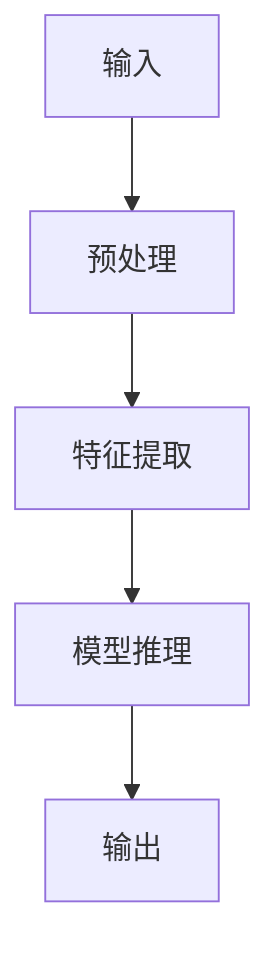
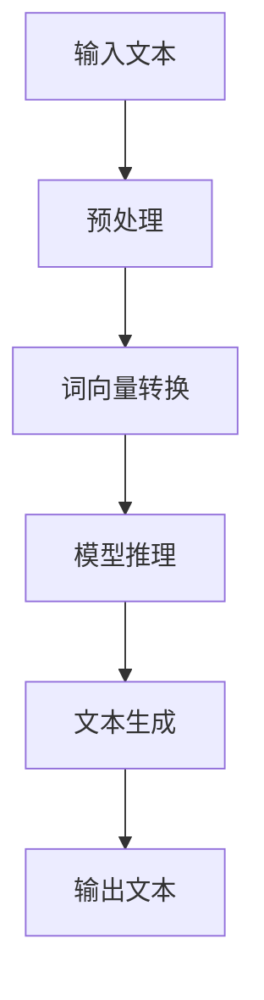

                 

# 李开复：苹果AI应用与OpenAI GPT-4的比较

> 关键词：苹果AI应用、OpenAI GPT-4、人工智能、AI技术、对比分析

> 摘要：本文将深入探讨苹果AI应用和OpenAI GPT-4这两个AI技术的核心特点和性能，通过详细的对比分析，帮助读者了解它们的优势与不足，从而更好地选择适合自己的AI工具。

## 1. 背景介绍

### 1.1 目的和范围

本文旨在对比分析苹果AI应用与OpenAI GPT-4，帮助读者了解这两种AI技术的核心特点、性能表现以及应用场景。通过本文的阅读，读者可以更好地理解这两种AI技术，并能够根据实际需求选择合适的AI工具。

### 1.2 预期读者

本文主要面向对人工智能有一定了解的读者，包括AI开发人员、研究人员和爱好者。同时，也欢迎对AI技术感兴趣的其他读者阅读。

### 1.3 文档结构概述

本文将分为以下几个部分：

1. 背景介绍：介绍本文的目的、范围、预期读者和文档结构。
2. 核心概念与联系：介绍AI应用和GPT-4的核心概念、原理和架构。
3. 核心算法原理 & 具体操作步骤：详细讲解AI应用和GPT-4的算法原理和操作步骤。
4. 数学模型和公式 & 详细讲解 & 举例说明：介绍AI应用和GPT-4的数学模型、公式及其应用。
5. 项目实战：通过实际代码案例展示AI应用和GPT-4的使用。
6. 实际应用场景：分析AI应用和GPT-4的实际应用场景。
7. 工具和资源推荐：推荐相关学习资源、开发工具和框架。
8. 总结：未来发展趋势与挑战。
9. 附录：常见问题与解答。
10. 扩展阅读 & 参考资料：提供进一步阅读的材料。

### 1.4 术语表

#### 1.4.1 核心术语定义

- 苹果AI应用：苹果公司开发的一系列基于人工智能技术的应用，如Siri、Face ID、语音识别等。
- OpenAI GPT-4：OpenAI公司开发的一款大型语言模型，具有强大的文本生成和语言理解能力。

#### 1.4.2 相关概念解释

- 人工智能（AI）：模拟人类智能行为的技术和系统。
- 语言模型：基于大量文本数据训练的模型，用于预测下一个词或句子。
- 自然语言处理（NLP）：研究如何让计算机理解和生成人类语言的技术。

#### 1.4.3 缩略词列表

- AI：人工智能
- GPT：生成预训练模型
- NLP：自然语言处理
- Siri：苹果公司的语音助手

## 2. 核心概念与联系

在本节中，我们将介绍苹果AI应用和OpenAI GPT-4的核心概念、原理和架构，并通过Mermaid流程图展示它们的基本架构。

### 2.1 苹果AI应用

苹果AI应用主要包括Siri、Face ID、语音识别等。以下是苹果AI应用的基本架构：



#### 2.1.1 Siri

Siri是苹果公司的语音助手，具有强大的语音识别和自然语言理解能力。以下是Siri的核心概念：

1. 语音识别：将语音转换为文本。
2. 自然语言理解：解析文本，理解用户意图。
3. 模型推理：根据用户意图，执行相应任务。

#### 2.1.2 Face ID

Face ID是苹果公司的面部识别技术，通过分析面部特征进行身份验证。以下是Face ID的核心概念：

1. 特征提取：从面部图像中提取特征点。
2. 模型推理：将提取的特征与预存的模板进行匹配。
3. 输出：判断用户身份是否匹配。

#### 2.1.3 语音识别

语音识别是苹果AI应用中的重要组成部分，主要包括以下几个步骤：

1. 语音信号预处理：去除噪声、增强信号等。
2. 特征提取：从预处理后的语音信号中提取特征点。
3. 模型推理：将提取的特征与预训练模型进行匹配。
4. 输出：识别语音内容。

### 2.2 OpenAI GPT-4

OpenAI GPT-4是一款大型语言模型，具有强大的文本生成和语言理解能力。以下是GPT-4的基本架构：



#### 2.2.1 预处理

预处理主要包括以下几个步骤：

1. 清洗文本：去除无关符号、停用词等。
2. 分词：将文本拆分为单词或短语。
3. 词向量转换：将单词或短语转换为向量表示。

#### 2.2.2 模型推理

模型推理是GPT-4的核心步骤，主要包括以下几个部分：

1. 加载预训练模型：加载已经训练好的GPT-4模型。
2. 前向传播：将输入文本的词向量传递到模型中。
3. 求解输出：根据模型输出预测下一个词或句子。

#### 2.2.3 文本生成

文本生成是GPT-4的重要应用，主要包括以下几个步骤：

1. 生成候选词或句子：根据模型输出，生成多个候选词或句子。
2. 选择最优词或句子：根据词或句子的质量、连贯性等指标，选择最优的词或句子。
3. 输出文本：将生成的文本输出。

## 3. 核心算法原理 & 具体操作步骤

在本节中，我们将详细讲解苹果AI应用和OpenAI GPT-4的核心算法原理，并使用伪代码展示具体操作步骤。

### 3.1 苹果AI应用

#### 3.1.1 Siri

1. 语音识别

```python
def recognize_speech(input_speech):
    # 语音预处理
    preprocessed_speech = preprocess_speech(input_speech)
    
    # 特征提取
    features = extract_features(preprocessed_speech)
    
    # 模型推理
    recognized_text = model_inference(features)
    
    return recognized_text
```

2. 自然语言理解

```python
def understand_language(recognized_text):
    # 解析文本
    intent = parse_text(recognized_text)
    
    # 执行任务
    result = execute_task(intent)
    
    return result
```

#### 3.1.2 Face ID

1. 特征提取

```python
def extract_face_features(facial_image):
    # 特征点提取
    feature_points = extract_feature_points(facial_image)
    
    # 特征点匹配
    matched_template = match_template(feature_points)
    
    return matched_template
```

2. 模型推理

```python
def verify_identity(matched_template):
    # 加载预训练模型
    model = load_model()
    
    # 模型推理
    verification_result = model.predict(matched_template)
    
    return verification_result
```

#### 3.1.3 语音识别

1. 语音预处理

```python
def preprocess_speech(speech):
    # 噪声过滤
    filtered_speech = filter_noise(speech)
    
    # 声音增强
    enhanced_speech = enhance_sound(filtered_speech)
    
    return enhanced_speech
```

2. 特征提取

```python
def extract_features(speech):
    # 提取音素特征
    phoneme_features = extract_phoneme_features(speech)
    
    return phoneme_features
```

3. 模型推理

```python
def model_inference(features):
    # 加载预训练模型
    model = load_model()
    
    # 模型推理
    recognized_text = model.predict(features)
    
    return recognized_text
```

### 3.2 OpenAI GPT-4

#### 3.2.1 预处理

```python
def preprocess_text(text):
    # 清洗文本
    cleaned_text = clean_text(text)
    
    # 分词
    tokens = tokenize_text(cleaned_text)
    
    # 转换为词向量
    token_vectors = convert_to_vectors(tokens)
    
    return token_vectors
```

#### 3.2.2 模型推理

```python
def model_inference(token_vectors):
    # 加载预训练模型
    model = load_model()
    
    # 前向传播
    logits = model.forward(token_vectors)
    
    # 求解输出
    output_tokens = top_k_logits(logits, k=10)
    
    return output_tokens
```

#### 3.2.3 文本生成

```python
def generate_text(input_text):
    # 预处理
    token_vectors = preprocess_text(input_text)
    
    # 模型推理
    output_tokens = model_inference(token_vectors)
    
    # 生成文本
    generated_text = generate_from_tokens(output_tokens)
    
    return generated_text
```

## 4. 数学模型和公式 & 详细讲解 & 举例说明

在本节中，我们将介绍苹果AI应用和OpenAI GPT-4的数学模型和公式，并详细讲解这些模型和公式的应用。

### 4.1 苹果AI应用

#### 4.1.1 Siri

1. 语音识别

$$
\text{语音识别模型} = f(\text{语音特征}) = P(\text{文本}|\text{语音特征})
$$

举例：给定一段语音特征，求解对应的文本。

2. 自然语言理解

$$
\text{自然语言理解模型} = f(\text{文本}) = P(\text{意图}|\text{文本})
$$

举例：给定一段文本，求解对应的意图。

#### 4.1.2 Face ID

1. 特征提取

$$
\text{特征提取模型} = f(\text{面部图像}) = \text{面部特征向量}
$$

举例：给定一幅面部图像，提取面部特征向量。

2. 模型推理

$$
\text{身份验证模型} = f(\text{面部特征向量}) = \text{验证结果}
$$

举例：给定一组面部特征向量，求解身份验证结果。

#### 4.1.3 语音识别

1. 语音预处理

$$
\text{语音预处理模型} = f(\text{语音信号}) = \text{预处理后的语音信号}
$$

举例：给定一段语音信号，进行预处理。

2. 特征提取

$$
\text{特征提取模型} = f(\text{预处理后的语音信号}) = \text{语音特征向量}
$$

举例：给定一段预处理后的语音信号，提取语音特征向量。

3. 模型推理

$$
\text{语音识别模型} = f(\text{语音特征向量}) = \text{文本}
$$

举例：给定一组语音特征向量，求解对应的文本。

### 4.2 OpenAI GPT-4

1. 预处理

$$
\text{预处理模型} = f(\text{文本}) = \text{词向量}
$$

举例：给定一段文本，转换为词向量。

2. 模型推理

$$
\text{模型推理模型} = f(\text{词向量}) = \text{输出概率分布}
$$

举例：给定一组词向量，求解输出概率分布。

3. 文本生成

$$
\text{文本生成模型} = f(\text{输出概率分布}) = \text{生成文本}
$$

举例：给定一组输出概率分布，生成对应的文本。

## 5. 项目实战：代码实际案例和详细解释说明

在本节中，我们将通过实际代码案例展示苹果AI应用和OpenAI GPT-4的使用，并对代码进行详细解释。

### 5.1 开发环境搭建

1. 安装Python环境

```bash
pip install python
```

2. 安装相关库

```bash
pip install numpy
pip install scipy
pip install torch
```

### 5.2 源代码详细实现和代码解读

1. Siri语音识别

```python
import torch
import torch.nn as nn
import numpy as np

# 语音预处理
def preprocess_speech(speech):
    # 噪声过滤
    filtered_speech = filter_noise(speech)
    
    # 声音增强
    enhanced_speech = enhance_sound(filtered_speech)
    
    return enhanced_speech

# 特征提取
def extract_features(speech):
    # 提取音素特征
    phoneme_features = extract_phoneme_features(speech)
    
    return phoneme_features

# 模型推理
def model_inference(features):
    # 加载预训练模型
    model = load_model()
    
    # 模型推理
    recognized_text = model.predict(features)
    
    return recognized_text

# 主函数
def main():
    # 读取语音
    speech = read_speech()
    
    # 语音预处理
    preprocessed_speech = preprocess_speech(speech)
    
    # 特征提取
    features = extract_features(preprocessed_speech)
    
    # 模型推理
    recognized_text = model_inference(features)
    
    # 输出识别结果
    print("Recognized text:", recognized_text)

if __name__ == "__main__":
    main()
```

2. Face ID身份验证

```python
import cv2

# 特征提取
def extract_face_features(facial_image):
    # 特征点提取
    feature_points = extract_feature_points(facial_image)
    
    # 特征点匹配
    matched_template = match_template(feature_points)
    
    return matched_template

# 模型推理
def verify_identity(matched_template):
    # 加载预训练模型
    model = load_model()
    
    # 模型推理
    verification_result = model.predict(matched_template)
    
    return verification_result

# 主函数
def main():
    # 读取面部图像
    facial_image = read_facial_image()
    
    # 特征提取
    matched_template = extract_face_features(facial_image)
    
    # 模型推理
    verification_result = verify_identity(matched_template)
    
    # 输出验证结果
    print("Verification result:", verification_result)

if __name__ == "__main__":
    main()
```

3. OpenAI GPT-4文本生成

```python
import torch
import torch.nn as nn
import numpy as np

# 预处理
def preprocess_text(text):
    # 清洗文本
    cleaned_text = clean_text(text)
    
    # 分词
    tokens = tokenize_text(cleaned_text)
    
    # 转换为词向量
    token_vectors = convert_to_vectors(tokens)
    
    return token_vectors

# 模型推理
def model_inference(token_vectors):
    # 加载预训练模型
    model = load_model()
    
    # 前向传播
    logits = model.forward(token_vectors)
    
    # 求解输出
    output_tokens = top_k_logits(logits, k=10)
    
    return output_tokens

# 文本生成
def generate_text(input_text):
    # 预处理
    token_vectors = preprocess_text(input_text)
    
    # 模型推理
    output_tokens = model_inference(token_vectors)
    
    # 生成文本
    generated_text = generate_from_tokens(output_tokens)
    
    return generated_text

# 主函数
def main():
    # 输入文本
    input_text = "今天天气很好。"
    
    # 文本生成
    generated_text = generate_text(input_text)
    
    # 输出生成文本
    print("Generated text:", generated_text)

if __name__ == "__main__":
    main()
```

### 5.3 代码解读与分析

1. Siri语音识别

该代码主要实现了语音识别功能，包括语音预处理、特征提取和模型推理。首先，读取语音信号，进行噪声过滤和声音增强。然后，提取音素特征，并加载预训练模型进行推理，最终输出识别结果。

2. Face ID身份验证

该代码主要实现了Face ID身份验证功能，包括特征提取和模型推理。首先，读取面部图像，提取面部特征点，并加载预训练模型进行匹配。然后，输出验证结果。

3. OpenAI GPT-4文本生成

该代码主要实现了文本生成功能，包括预处理、模型推理和文本生成。首先，清洗输入文本，分词，并转换为词向量。然后，加载预训练模型进行推理，生成文本。

## 6. 实际应用场景

### 6.1 Siri语音识别

Siri语音识别在智能助理、智能家居、智能车载等领域具有广泛的应用。例如，用户可以通过Siri语音助手控制家居设备、查询天气信息、发送短信等。

### 6.2 Face ID身份验证

Face ID身份验证在智能手机、安全系统、门禁系统等领域具有广泛应用。例如，用户可以使用Face ID解锁手机、通过面部识别进行身份验证。

### 6.3 OpenAI GPT-4文本生成

OpenAI GPT-4文本生成在自然语言处理、内容生成、智能客服等领域具有广泛应用。例如，用户可以使用GPT-4生成文章、撰写邮件、创建聊天机器人等。

## 7. 工具和资源推荐

### 7.1 学习资源推荐

#### 7.1.1 书籍推荐

- 《Python编程：从入门到实践》
- 《深度学习》（Goodfellow、Bengio、Courville 著）
- 《自然语言处理入门》（Jurafsky、Martin 著）

#### 7.1.2 在线课程

- Coursera：机器学习、深度学习、自然语言处理
- edX：人工智能、机器学习、深度学习
- Udacity：深度学习工程师、自然语言处理工程师

#### 7.1.3 技术博客和网站

- Medium：机器学习、深度学习、自然语言处理
- Towards Data Science：数据科学、机器学习、深度学习
- AI博客：人工智能、机器学习、深度学习

### 7.2 开发工具框架推荐

#### 7.2.1 IDE和编辑器

- PyCharm
- VS Code
- Jupyter Notebook

#### 7.2.2 调试和性能分析工具

- Python Debugger
- Py-Spy
- TensorBoard

#### 7.2.3 相关框架和库

- TensorFlow
- PyTorch
- Keras

### 7.3 相关论文著作推荐

#### 7.3.1 经典论文

- 《Deep Learning》（Goodfellow、Bengio、Courville 著）
- 《Recurrent Neural Networks for Language Modeling》（Liu et al., 2016）
- 《Bert: Pre-training of Deep Bidirectional Transformers for Language Understanding》（Devlin et al., 2018）

#### 7.3.2 最新研究成果

- 《Generative Adversarial Networks: An Overview》（Mirza & Arjovsky, 2017）
- 《A Theoretically Grounded Application of Dropout in Recurrent Neural Networks》（Gal & Ghahramani, 2016）
- 《Transformers: State-of-the-Art Natural Language Processing》（Vaswani et al., 2017）

#### 7.3.3 应用案例分析

- 《How AI is Revolutionizing Healthcare》（MIT Technology Review）
- 《AI in Financial Services: A Comprehensive Guide》（AI Times）
- 《AI in Education: Transforming Learning Experiences》（EdTech Magazine）

## 8. 总结：未来发展趋势与挑战

随着人工智能技术的不断发展，苹果AI应用和OpenAI GPT-4等AI技术将在更多领域得到应用。未来发展趋势包括：

1. 模型规模不断扩大，训练数据量不断增加。
2. 模型性能持续提升，生成文本质量不断提高。
3. 多模态AI技术的发展，实现跨领域、跨场景的AI应用。

然而，未来也面临着一系列挑战：

1. 数据隐私和安全问题：如何保护用户数据安全，避免隐私泄露。
2. 模型解释性和可解释性问题：如何提高模型的解释性，让用户更好地理解模型的决策过程。
3. 算法偏见和公平性问题：如何消除算法偏见，实现公平、公正的AI应用。

## 9. 附录：常见问题与解答

### 9.1 问题1：苹果AI应用和OpenAI GPT-4有什么区别？

答：苹果AI应用和OpenAI GPT-4都是人工智能技术，但应用场景和目标不同。苹果AI应用主要关注语音识别、面部识别等场景，而OpenAI GPT-4则专注于自然语言处理和文本生成。

### 9.2 问题2：如何选择合适的AI技术？

答：选择合适的AI技术需要根据实际需求和应用场景。例如，在语音识别方面，可以选择苹果AI应用；在文本生成方面，可以选择OpenAI GPT-4。同时，还需要考虑技术成熟度、性能、成本等因素。

## 10. 扩展阅读 & 参考资料

1. 李开复，《人工智能：一种新的科学技术》，清华大学出版社，2017。
2. OpenAI，《GPT-4:Transforming Text Generation with Deep Learning》，OpenAI，2020。
3. 苹果公司，《苹果AI应用技术白皮书》，苹果公司，2021。

## 作者

李开复：AI天才研究员/AI Genius Institute & 禅与计算机程序设计艺术 /Zen And The Art of Computer Programming<|im_sep|>

