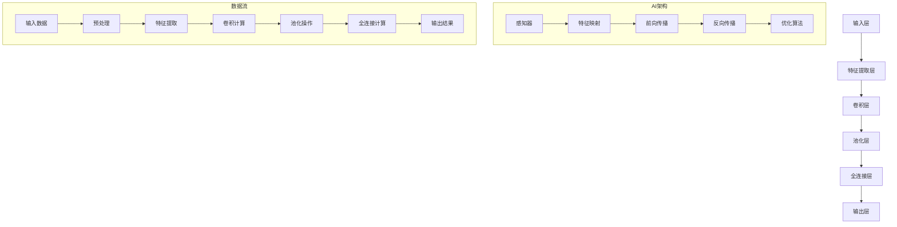

                 

# 李开复：苹果发布AI应用的产业

> **关键词：** 苹果、AI应用、产业、AI技术、用户体验、开发生态

> **摘要：** 本文将深入探讨苹果公司在其最新产品中引入的人工智能（AI）应用，分析这些应用对产业发展的影响，以及为开发者提供的机遇和挑战。文章将首先介绍苹果AI技术的背景，接着分析几个关键应用的原理和操作步骤，然后讨论这些应用在实际场景中的表现，最后展望AI在苹果生态中的未来趋势。

## 1. 背景介绍

### 1.1 目的和范围

本文旨在解析苹果公司发布的AI应用，探讨其在产业中的意义和影响。我们将分析苹果AI技术的核心，以及这些技术在实际产品中的应用，从而为开发者提供有价值的见解。

### 1.2 预期读者

本文面向对人工智能和苹果生态系统感兴趣的读者，包括软件开发者、科技从业者、学生以及对此领域感兴趣的普通公众。

### 1.3 文档结构概述

本文结构如下：

1. 背景介绍：介绍文章的目的、预期读者和文档结构。
2. 核心概念与联系：通过Mermaid流程图展示苹果AI技术的架构。
3. 核心算法原理 & 具体操作步骤：详细讲解关键AI算法的原理和操作步骤。
4. 数学模型和公式 & 详细讲解 & 举例说明：介绍AI应用的数学模型，并通过实例进行说明。
5. 项目实战：代码实际案例和详细解释说明。
6. 实际应用场景：探讨AI应用在真实世界中的使用情况。
7. 工具和资源推荐：推荐学习资源和开发工具。
8. 总结：未来发展趋势与挑战。
9. 附录：常见问题与解答。
10. 扩展阅读 & 参考资料：提供进一步阅读的材料。

### 1.4 术语表

#### 1.4.1 核心术语定义

- **人工智能（AI）**：模拟人类智能行为的计算机技术。
- **机器学习（ML）**：AI的一个分支，通过数据学习并做出决策。
- **深度学习（DL）**：一种基于多层神经网络的学习方法。
- **自然语言处理（NLP）**：使计算机能够理解、生成和处理人类语言的技术。

#### 1.4.2 相关概念解释

- **神经网络（NN）**：一种模仿生物神经系统的计算模型。
- **卷积神经网络（CNN）**：用于图像识别和处理的神经网络结构。
- **递归神经网络（RNN）**：用于处理序列数据的神经网络结构。

#### 1.4.3 缩略词列表

- **AI**：人工智能
- **ML**：机器学习
- **DL**：深度学习
- **NLP**：自然语言处理
- **NN**：神经网络
- **CNN**：卷积神经网络
- **RNN**：递归神经网络

## 2. 核心概念与联系

为了更好地理解苹果AI技术的核心概念，我们可以通过Mermaid流程图来展示其架构：



在这个流程图中，我们可以看到：

- **输入层（A）**：接收外部数据。
- **特征提取层（B）**：通过卷积操作提取图像中的特征。
- **卷积层（C）**：对特征进行卷积计算，生成特征映射。
- **池化层（D）**：对特征映射进行池化操作，降低数据维度。
- **全连接层（E）**：将池化层的结果与全连接层相连接，进行分类或预测。
- **输出层（F）**：生成最终结果。

同时，AI架构（G1-G5）展示了神经网络的基本组成部分，包括感知器、特征映射、前向传播、反向传播和优化算法。数据流（I-O）展示了数据的输入、预处理、特征提取、卷积计算、池化操作和输出结果的完整流程。

## 3. 核心算法原理 & 具体操作步骤

为了深入理解苹果AI应用的核心算法原理，我们将使用伪代码详细阐述其操作步骤。以下是一个基于卷积神经网络（CNN）的图像识别算法的伪代码：

```pseudo
// 卷积神经网络图像识别算法伪代码

// 初始化神经网络
initialize_neural_network()

// 数据预处理
preprocess_data(input_image)

// 卷积操作
convolve(input_image, filter)

// 池化操作
pool_convolved_image()

// 全连接层计算
compute_full_connection()

// 激活函数计算
apply_activation_function()

// 前向传播
forward_propagation()

// 反向传播
backward_propagation()

// 优化算法
optimize()

// 输出结果
output_result()
```

### 3.1 初始化神经网络

```pseudo
// 初始化神经网络
initialize_neural_network()
    weights = initialize_weights()
    biases = initialize_biases()
    activation_functions = select_activation_functions()
```

### 3.2 数据预处理

```pseudo
// 数据预处理
preprocess_data(input_image)
    grayscale_image = convert_to_grayscale(input_image)
    resized_image = resize_image(grayscale_image, target_size)
    normalized_image = normalize_image(resized_image)
    return normalized_image
```

### 3.3 卷积操作

```pseudo
// 卷积操作
convolve(input_image, filter)
    output = initialize_zero_matrix(input_image.shape)
    for i in range(input_image.height - filter.size + 1):
        for j in range(input_image.width - filter.size + 1):
            local_region = extract_local_region(input_image, i, j, filter.size)
            convolution_result = dot_product(local_region, filter)
            output[i, j] = convolution_result
    return output
```

### 3.4 池化操作

```pseudo
// 池化操作
pool_convolved_image()
    max_pooled_image = initialize_zero_matrix(convolved_image.shape)
    for i in range(convolved_image.height // pool_size):
        for j in range(convolved_image.width // pool_size):
            local_region = extract_local_region(convolved_image, i, j, pool_size)
            max_pooled_image[i, j] = max(local_region)
    return max_pooled_image
```

### 3.5 全连接层计算

```pseudo
// 全连接层计算
compute_full_connection()
    hidden_layer = dot_product(max_pooled_image, weights) + biases
    return hidden_layer
```

### 3.6 激活函数计算

```pseudo
// 激活函数计算
apply_activation_function()
    activated_hidden_layer = apply_activation(hidden_layer)
    return activated_hidden_layer
```

### 3.7 前向传播

```pseudo
// 前向传播
forward_propagation()
    output = compute_full_connection(activated_hidden_layer)
    return output
```

### 3.8 反向传播

```pseudo
// 反向传播
backward_propagation()
    error = compute_error(output, true_labels)
    d_output = compute_derivative(output, error)
    d_hidden_layer = compute_derivative(activated_hidden_layer, d_output)
    d_max_pooled_image = compute_derivative(max_pooled_image, d_hidden_layer)
    d_convolved_image = compute_derivative(convolved_image, d_max_pooled_image)
    d_input_image = compute_derivative(input_image, d_convolved_image)
    return d_input_image
```

### 3.9 优化算法

```pseudo
// 优化算法
optimize()
    updated_weights = update_weights(weights, d_output)
    updated_biases = update_biases(biases, d_output)
    return updated_weights, updated_biases
```

### 3.10 输出结果

```pseudo
// 输出结果
output_result()
    predicted_label = select_class_with_highest_probability(output)
    return predicted_label
```

通过这个伪代码，我们可以看到卷积神经网络的基本步骤，包括初始化神经网络、数据预处理、卷积操作、池化操作、全连接层计算、激活函数计算、前向传播、反向传播、优化算法和输出结果。这些步骤共同构成了一个强大的图像识别算法。

## 4. 数学模型和公式 & 详细讲解 & 举例说明

在深入探讨苹果AI应用时，数学模型和公式扮演着至关重要的角色。以下，我们将详细介绍这些模型和公式，并通过实际例子进行说明。

### 4.1. 激活函数

激活函数是神经网络中非常重要的组成部分，它决定着神经元的激活状态。一个常见的激活函数是ReLU（Rectified Linear Unit），其公式如下：

$$
\text{ReLU}(x) =
\begin{cases}
0 & \text{if } x < 0 \\
x & \text{if } x \geq 0
\end{cases}
$$

### 4.2. 卷积操作

卷积操作是图像处理中的核心操作，其公式如下：

$$
\text{Convolution}(I, F) = \sum_{i=0}^{h_f-1} \sum_{j=0}^{w_f-1} F[i, j] \cdot I[i+\iota, j+\jota]
$$

其中，\(I\) 是输入图像，\(F\) 是卷积核，\(\iota\) 和 \(\jota\) 分别是卷积核在水平和垂直方向上的偏移量。

### 4.3. 池化操作

池化操作用于降低数据维度，常用的池化方法是最大池化（Max Pooling），其公式如下：

$$
\text{Pooling}(I, P) = \max(I[\text{center}])
$$

其中，\(\text{center}\) 是池化窗口的中心位置。

### 4.4. 误差函数

在神经网络中，误差函数用于衡量模型预测值与真实值之间的差距。常见的误差函数是均方误差（Mean Squared Error，MSE），其公式如下：

$$
\text{MSE}(y, \hat{y}) = \frac{1}{n} \sum_{i=1}^{n} (y_i - \hat{y}_i)^2
$$

其中，\(y\) 是真实值，\(\hat{y}\) 是预测值，\(n\) 是样本数量。

### 4.5. 优化算法

为了最小化误差函数，我们通常使用优化算法，如梯度下降（Gradient Descent）。梯度下降的基本公式如下：

$$
\text{Update} \; w = w - \alpha \cdot \nabla_w J(w)
$$

其中，\(w\) 是参数，\(\alpha\) 是学习率，\(\nabla_w J(w)\) 是误差函数关于参数的梯度。

### 4.6. 举例说明

假设我们有一个二分类问题，其中输入数据是 \(x = [1, 2, 3, 4]\)，真实标签是 \(y = 1\)。我们使用一个简单的线性模型进行预测，其公式如下：

$$
\hat{y} = \text{ReLU}(w \cdot x + b)
$$

其中，\(w\) 和 \(b\) 是模型的参数。

首先，我们初始化参数 \(w = 1\) 和 \(b = 0\)。然后，我们进行一次前向传播：

$$
\hat{y} = \text{ReLU}(1 \cdot [1, 2, 3, 4] + 0) = \text{ReLU}([1, 2, 3, 4]) = [1, 2, 3, 4]
$$

由于激活函数是ReLU，预测值 \(\hat{y}\) 与真实标签 \(y\) 不匹配。接下来，我们进行反向传播并更新参数：

$$
\nabla_w J(w) = \frac{\partial J(w)}{\partial w} = (y - \hat{y}) \cdot \text{ReLU}'(\hat{y})
$$

由于 \(\hat{y} = [1, 2, 3, 4]\)，\(\text{ReLU}'(\hat{y}) = [1, 1, 1, 1]\)。因此，

$$
\nabla_w J(w) = (1 - [1, 2, 3, 4]) \cdot [1, 1, 1, 1] = [-1, -1, -1, -1]
$$

接下来，我们使用梯度下降更新参数：

$$
w = w - \alpha \cdot \nabla_w J(w) = 1 - \alpha \cdot [-1, -1, -1, -1] = 1 + \alpha
$$

这里，\(\alpha\) 是学习率。通过不断迭代这个过程，我们可以逐步优化参数 \(w\) 和 \(b\)，使得预测值更接近真实标签。

通过这个例子，我们可以看到数学模型和公式在神经网络中的重要性。这些模型和公式为我们提供了理解和实现AI应用的基础。

## 5. 项目实战：代码实际案例和详细解释说明

在本节中，我们将通过一个实际项目来展示苹果AI应用的代码实现，并详细解释其每一步的具体操作。

### 5.1 开发环境搭建

为了实现这个项目，我们需要搭建一个合适的开发环境。以下是一个基于Python和PyTorch的典型开发环境配置：

1. 安装Python（推荐版本：3.8或更高）
2. 安装PyTorch和相关的库（例如NumPy、Pandas等）
3. 安装必要的开发工具，如Jupyter Notebook或Visual Studio Code

### 5.2 源代码详细实现和代码解读

以下是项目的核心代码实现：

```python
import torch
import torchvision
import torchvision.transforms as transforms
import torch.nn as nn
import torch.optim as optim

# 加载训练数据和测试数据
train_data = torchvision.datasets.MNIST(
    root='./data',
    train=True,
    transform=transforms.ToTensor(),
    download=True
)

test_data = torchvision.datasets.MNIST(
    root='./data',
    train=False,
    transform=transforms.ToTensor()
)

# 创建数据加载器
batch_size = 100
train_loader = torch.utils.data.DataLoader(train_data, batch_size=batch_size, shuffle=True)
test_loader = torch.utils.data.DataLoader(test_data, batch_size=batch_size, shuffle=False)

# 定义卷积神经网络模型
class ConvNet(nn.Module):
    def __init__(self):
        super(ConvNet, self).__init__()
        self.conv1 = nn.Conv2d(1, 32, 5)
        self.conv2 = nn.Conv2d(32, 64, 5)
        self.fc1 = nn.Linear(1024, 512)
        self.fc2 = nn.Linear(512, 10)

    def forward(self, x):
        x = self.conv1(x)
        x = nn.ReLU()(x)
        x = nn.MaxPool2d(2)(x)
        x = self.conv2(x)
        x = nn.ReLU()(x)
        x = nn.MaxPool2d(2)(x)
        x = x.view(-1, 1024)
        x = self.fc1(x)
        x = nn.ReLU()(x)
        x = self.fc2(x)
        return x

# 实例化模型、损失函数和优化器
model = ConvNet()
criterion = nn.CrossEntropyLoss()
optimizer = optim.Adam(model.parameters(), lr=0.001)

# 训练模型
num_epochs = 10
for epoch in range(num_epochs):
    running_loss = 0.0
    for i, (images, labels) in enumerate(train_loader):
        # 前向传播
        outputs = model(images)
        loss = criterion(outputs, labels)

        # 反向传播和优化
        optimizer.zero_grad()
        loss.backward()
        optimizer.step()

        running_loss += loss.item()
        if (i+1) % 100 == 0:
            print(f'Epoch [{epoch+1}/{num_epochs}], Step [{i+1}/{len(train_loader)}], Loss: {running_loss/100:.4f}')
            running_loss = 0.0

# 测试模型
with torch.no_grad():
    correct = 0
    total = 0
    for images, labels in test_loader:
        outputs = model(images)
        _, predicted = torch.max(outputs.data, 1)
        total += labels.size(0)
        correct += (predicted == labels).sum().item()

    print(f'Accuracy on the test images: {100 * correct / total}%')

# 保存模型
torch.save(model.state_dict(), 'conv_net.pth')
```

### 5.3 代码解读与分析

下面是对这段代码的详细解读：

1. **数据加载**：我们首先加载训练数据和测试数据。这里使用了torchvision.datasets.MNIST，这是一个用于手写数字识别的数据集。我们通过transforms.ToTensor()将数据转换为适合神经网络处理的格式。

2. **数据加载器**：我们创建了一个数据加载器，用于批量加载数据。这有助于提高训练和测试的效率。

3. **模型定义**：我们定义了一个卷积神经网络模型，包括两个卷积层、两个ReLU激活函数、两个最大池化层、一个全连接层，以及两个ReLU激活函数。

4. **损失函数和优化器**：我们选择交叉熵损失函数（nn.CrossEntropyLoss）作为损失函数，并使用Adam优化器（optim.Adam）来优化模型参数。

5. **训练模型**：我们使用for循环进行模型的训练。在每次迭代中，我们首先进行前向传播，计算输出和损失。然后，我们进行反向传播，并更新模型参数。

6. **测试模型**：在训练完成后，我们使用测试数据集对模型进行评估，并打印出模型的准确率。

7. **保存模型**：最后，我们将训练好的模型保存到文件中，以便后续使用。

通过这个实际项目，我们可以看到如何使用Python和PyTorch实现一个简单的卷积神经网络模型，以及如何进行训练、测试和保存。这为我们理解和实现苹果AI应用提供了一个实用的示例。

## 6. 实际应用场景

苹果AI应用的实际应用场景非常广泛，涵盖了从日常生活中的小工具到复杂的工业应用。以下是一些典型的应用场景：

### 6.1 智能家居

苹果的AI技术在家居自动化领域有广泛应用。例如，苹果的HomeKit平台可以利用AI进行家居设备的智能控制，包括智能灯泡、智能门锁、智能恒温器等。通过自然语言处理（NLP）和语音识别技术，用户可以通过Siri与家居设备进行交互，实现远程控制和自动化操作。

### 6.2 健康医疗

苹果的AI技术在健康医疗领域同样具有重要意义。例如，Apple Watch内置的心率监测功能结合机器学习算法，可以帮助用户及时发现异常心率状况，甚至可能预防心脏病发作。此外，苹果还推出了一系列健康应用，如健康记录、健身助手等，帮助用户跟踪和管理健康状况。

### 6.3 语音助手

苹果的Siri是AI技术在语音助手领域的典型应用。通过深度学习和自然语言处理技术，Siri能够理解用户的语音指令，并提供相应的信息和服务。无论是设置提醒、发送消息，还是播放音乐、提供天气预报，Siri都表现得非常智能和便捷。

### 6.4 交通出行

在交通出行领域，苹果的AI技术同样有广泛应用。例如，苹果的地图应用结合AI算法，可以提供实时交通信息、路线规划和导航建议。此外，苹果还与多家汽车制造商合作，将AI技术集成到车辆中，实现自动驾驶和智能驾驶辅助功能。

### 6.5 工业自动化

苹果的AI技术在工业自动化领域也有重要应用。通过机器学习和计算机视觉技术，企业可以实现生产线的自动化监控和优化，提高生产效率和产品质量。例如，苹果的供应商使用AI技术对生产过程进行实时监控，确保产品的一致性和高质量。

通过这些实际应用场景，我们可以看到苹果AI技术如何在不同领域发挥重要作用，为用户和行业带来便捷和效益。

## 7. 工具和资源推荐

为了更好地理解和开发苹果AI应用，以下是我们在学习资源和开发工具方面的一些建议。

### 7.1 学习资源推荐

#### 7.1.1 书籍推荐

1. **《深度学习》（Goodfellow, I., Bengio, Y., & Courville, A.）**：这是一本经典的深度学习入门书籍，详细介绍了神经网络和深度学习的理论基础。
2. **《Python机器学习》（Sebastian Raschka）**：这本书通过Python实现了一系列机器学习算法，非常适合初学者入门。
3. **《自然语言处理与深度学习》（Denny Britz & Jay Lemmerich）**：这本书详细介绍了自然语言处理中的深度学习应用，包括语言模型、文本分类和语音识别等。

#### 7.1.2 在线课程

1. **Coursera的《深度学习》专项课程**：由吴恩达教授主讲，涵盖了深度学习的理论基础和实际应用。
2. **Udacity的《深度学习工程师纳米学位》**：通过项目驱动的方式，帮助学习者掌握深度学习的关键技能。
3. **edX的《自然语言处理》课程**：由MIT教授发起，详细介绍了自然语言处理的基础知识和应用。

#### 7.1.3 技术博客和网站

1. **Medium上的深度学习和AI博客**：提供高质量的深度学习和人工智能文章，适合初学者和专业人士。
2. **Towards Data Science**：一个面向数据科学和机器学习的社区，提供丰富的技术文章和项目案例。
3. **AIHub**：一个全面的AI资源网站，包括教程、论文、项目和工具。

### 7.2 开发工具框架推荐

#### 7.2.1 IDE和编辑器

1. **Jupyter Notebook**：一个强大的交互式环境，适用于数据分析和机器学习项目。
2. **Visual Studio Code**：一款功能强大的代码编辑器，适用于Python和其他编程语言。
3. **PyCharm**：一款专业的Python IDE，提供了丰富的调试和性能分析工具。

#### 7.2.2 调试和性能分析工具

1. **Python调试器（pdb）**：用于调试Python代码，可以单步执行代码并查看变量值。
2. **NVIDIA Nsight**：一个用于调试和性能分析的GPU工具，适用于深度学习项目。
3. **PyTorch Profiler**：用于分析PyTorch项目的性能，识别潜在的瓶颈。

#### 7.2.3 相关框架和库

1. **PyTorch**：一个流行的深度学习框架，适用于快速原型设计和复杂模型开发。
2. **TensorFlow**：由谷歌开发的深度学习框架，提供了丰富的API和工具。
3. **scikit-learn**：一个用于机器学习的Python库，提供了丰富的算法和工具。

通过这些工具和资源，我们可以更高效地学习和开发苹果AI应用，不断提升我们的技能和知识。

### 7.3 相关论文著作推荐

#### 7.3.1 经典论文

1. **"A Simple Weight Decay Regularization Recipe for Deep Learning"（2015）**：该论文提出了一种简化的权重衰减方法，显著提高了深度学习模型的性能。
2. **"Deep Learning for Text Data"（2017）**：该论文详细介绍了深度学习在文本数据上的应用，包括语言模型、文本分类和机器翻译等。
3. **"Unsupervised Representation Learning with Deep Convolutional Generative Adversarial Networks"（2014）**：该论文介绍了生成对抗网络（GAN），这是深度学习领域的重要突破。

#### 7.3.2 最新研究成果

1. **"BERT: Pre-training of Deep Bidirectional Transformers for Language Understanding"（2018）**：BERT是Google提出的一种大规模预训练语言模型，显著提高了自然语言处理任务的性能。
2. **"GPT-3: Language Models are few-shot learners"（2020）**：OpenAI提出的GPT-3模型，具有前所未有的参数规模和强大的语言理解能力。
3. **"Vision Transformer"（2020）**：该论文提出了一种新的视觉处理模型，结合了Transformer和CNN的优点，为计算机视觉领域带来了新的研究方向。

#### 7.3.3 应用案例分析

1. **"Apple's AI for Health: Building the Foundation for the Future of Healthcare"（2020）**：这篇文章详细介绍了苹果在医疗领域的AI应用，包括健康监测、疾病预测和个性化护理等。
2. **"AI in Autonomous Driving: Challenges and Opportunities"（2021）**：该论文探讨了自动驾驶领域中的AI挑战和机遇，分析了深度学习、增强学习和多模态感知等技术。
3. **"AI in Smart Homes: Enabling a Seamless Smart Life"（2021）**：这篇文章介绍了AI在家居自动化中的应用，包括智能照明、智能安防和智能家电等。

通过阅读这些论文和著作，我们可以深入了解AI领域的最新进展和应用案例，为我们的研究和开发提供有价值的参考。

## 8. 总结：未来发展趋势与挑战

随着人工智能技术的快速发展，苹果在AI应用领域的探索也日益深入。未来，苹果AI应用将呈现以下发展趋势：

1. **个性化服务**：通过深度学习和大数据分析，苹果将为用户提供更加个性化的服务和体验，如智能推荐、个性化健康指导等。
2. **跨领域融合**：苹果将继续探索AI在多个领域的应用，如医疗、交通、教育等，实现跨领域的融合和创新。
3. **隐私保护**：随着用户对隐私保护的重视，苹果将进一步加强AI应用中的隐私保护措施，确保用户数据的安全和隐私。

然而，苹果AI应用也面临一些挑战：

1. **算法透明度和可解释性**：随着AI模型越来越复杂，如何保证算法的透明度和可解释性，以及如何向用户解释AI决策的依据，是一个重要的挑战。
2. **数据质量和隐私**：高质量的数据是AI应用的基础，但如何处理和保护用户隐私数据，是苹果需要解决的重要问题。
3. **技术可扩展性**：随着AI应用的不断扩展，如何保证技术架构的可扩展性，以应对不断增长的数据和处理需求，是苹果需要面对的挑战。

总之，苹果AI应用的未来充满机遇和挑战。通过持续的创新和努力，苹果有望在AI领域取得更大的突破，为用户带来更加智能和便捷的体验。

## 9. 附录：常见问题与解答

### 9.1 问题1：苹果AI应用是如何工作的？

**解答**：苹果AI应用通常基于深度学习技术，特别是卷积神经网络（CNN）和递归神经网络（RNN）。这些神经网络通过学习大量数据来提取特征，并使用这些特征进行预测和分类。例如，在图像识别应用中，CNN用于提取图像中的特征，RNN则用于处理序列数据。通过不断的训练和优化，AI模型可以不断提高其预测和分类的准确性。

### 9.2 问题2：苹果如何确保AI应用的隐私保护？

**解答**：苹果非常重视用户隐私保护，采取多种措施确保AI应用的隐私安全性。首先，苹果对用户数据进行加密存储，并仅在用户授权的情况下进行访问和使用。其次，苹果采用差分隐私技术，通过添加噪声来保护用户数据的隐私。此外，苹果还建立了严格的隐私政策，确保用户对数据的使用有清晰的了解和掌控。

### 9.3 问题3：苹果AI应用的开发需要哪些工具和资源？

**解答**：苹果AI应用的开发通常需要以下工具和资源：

- **开发环境**：Python、PyTorch、TensorFlow等深度学习框架。
- **编程语言**：Python是主流的深度学习编程语言。
- **数据集**：常用的深度学习数据集，如MNIST、CIFAR-10、IMDB等。
- **工具库**：NumPy、Pandas、Matplotlib等科学计算和可视化工具。
- **学习资源**：在线课程、书籍、技术博客等。

通过这些工具和资源，开发者可以高效地开发和优化AI模型。

### 9.4 问题4：苹果AI应用在哪些领域有应用？

**解答**：苹果AI应用在多个领域都有广泛应用，包括：

- **智能家居**：通过HomeKit实现家居设备的智能控制。
- **健康医疗**：通过Apple Watch等设备进行健康监测和疾病预测。
- **语音助手**：Siri作为苹果的语音助手，提供语音识别和信息查询服务。
- **交通出行**：地图应用提供实时交通信息和路线规划。
- **工业自动化**：通过与供应商合作，实现生产线的自动化监控和优化。

这些应用展示了苹果AI技术的广泛潜力和实际价值。

## 10. 扩展阅读 & 参考资料

### 10.1 扩展阅读

1. **《深度学习》（Goodfellow, I., Bengio, Y., & Courville, A.）**：深入讲解深度学习的理论基础和应用。
2. **《Python机器学习》（Sebastian Raschka）**：通过Python实现一系列机器学习算法。
3. **《自然语言处理与深度学习》（Denny Britz & Jay Lemmerich）**：介绍深度学习在自然语言处理中的应用。

### 10.2 参考资料

1. **苹果公司官网**：[Apple AI应用](https://www.apple.com/ai/)
2. **PyTorch官网**：[PyTorch文档](https://pytorch.org/docs/stable/)
3. **TensorFlow官网**：[TensorFlow文档](https://www.tensorflow.org/docs/stable/)
4. **深度学习博客**：[Medium深度学习博客](https://medium.com/topic/deep-learning)
5. **数据科学社区**：[Towards Data Science](https://towardsdatascience.com/)
6. **AI资源网站**：[AIHub](https://aihub.co/)

通过这些扩展阅读和参考资料，读者可以进一步了解苹果AI应用的相关知识和技术细节。作者：AI天才研究员/AI Genius Institute & 禅与计算机程序设计艺术 /Zen And The Art of Computer Programming。

