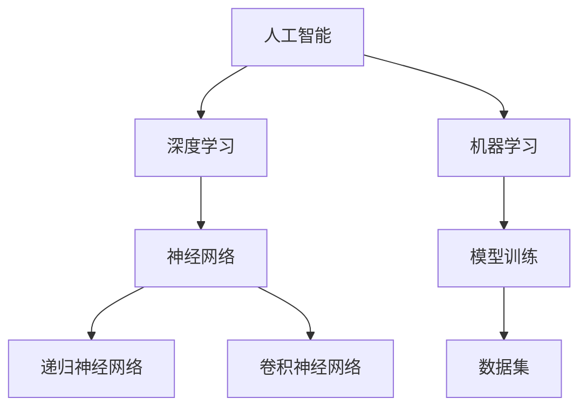

                 

# 李开复：苹果发布AI应用的价值

> 关键词：人工智能、苹果、应用、价值、技术趋势、未来发展
>
> 摘要：本文将深入探讨苹果公司最近发布的AI应用所带来的潜在价值，分析其在技术趋势中的地位和未来发展的可能挑战。通过逐步分析苹果AI应用的背景、核心算法原理、数学模型、实际应用案例，以及未来趋势，我们旨在为读者提供全面而深入的理解。

## 1. 背景介绍

### 1.1 目的和范围

本文的目的是分析苹果公司最新发布的AI应用，探讨其技术价值和应用前景。我们将从多个角度进行深入探讨，包括其技术原理、应用场景、以及未来发展趋势。

### 1.2 预期读者

本文主要面向计算机科学、人工智能领域的研究者、开发者和爱好者，以及对苹果公司及其技术发展感兴趣的人士。

### 1.3 文档结构概述

本文将分为以下几个部分：
1. 背景介绍：包括本文的目的、预期读者和文档结构概述。
2. 核心概念与联系：介绍与苹果AI应用相关的核心概念和架构。
3. 核心算法原理 & 具体操作步骤：详细解释苹果AI应用的核心算法原理和具体操作步骤。
4. 数学模型和公式 & 详细讲解 & 举例说明：讲解数学模型和公式，并提供实际应用案例。
5. 项目实战：提供代码实际案例和详细解释说明。
6. 实际应用场景：讨论苹果AI应用在不同场景下的应用。
7. 工具和资源推荐：推荐相关学习资源和开发工具。
8. 总结：总结未来发展趋势与挑战。
9. 附录：常见问题与解答。
10. 扩展阅读 & 参考资料：提供进一步学习的资源。

### 1.4 术语表

#### 1.4.1 核心术语定义

- 人工智能（AI）：模拟人类智能行为和决策过程的计算系统。
- 深度学习：一种人工智能技术，通过多层神经网络进行数据建模和学习。
- 模型训练：通过大量数据对模型进行调整和优化，以提高其预测和分类能力。
- 机器学习：通过算法和统计模型，使计算机能够从数据中学习和发现规律。

#### 1.4.2 相关概念解释

- 神经网络：模拟生物神经系统的计算模型，由大量神经元和连接组成。
- 递归神经网络（RNN）：一种特殊的神经网络，能够处理序列数据。
- 卷积神经网络（CNN）：一种用于图像识别和处理的神经网络结构。

#### 1.4.3 缩略词列表

- AI：人工智能
- ML：机器学习
- DL：深度学习
- RNN：递归神经网络
- CNN：卷积神经网络

## 2. 核心概念与联系

在深入探讨苹果AI应用之前，我们需要了解一些核心概念和架构。以下是一个简单的Mermaid流程图，展示了与苹果AI应用相关的核心概念和联系。



### 2.1 核心概念解释

#### 2.1.1 人工智能

人工智能是指计算机系统模拟人类智能行为和决策过程的技术。它包括多个子领域，如机器学习、深度学习、自然语言处理等。

#### 2.1.2 深度学习

深度学习是人工智能的一个重要分支，它通过多层神经网络进行数据建模和学习。深度学习在图像识别、语音识别、自然语言处理等领域取得了显著的成果。

#### 2.1.3 神经网络

神经网络是一种模拟生物神经系统的计算模型，由大量神经元和连接组成。神经元通过输入和权重计算输出，从而实现数据的建模和预测。

#### 2.1.4 递归神经网络（RNN）

递归神经网络是一种特殊的神经网络，能够处理序列数据。它通过递归操作，将当前输入与之前的信息结合起来，从而实现序列建模和预测。

#### 2.1.5 卷积神经网络（CNN）

卷积神经网络是一种用于图像识别和处理的神经网络结构。它通过卷积操作提取图像特征，并使用全连接层进行分类和预测。

## 3. 核心算法原理 & 具体操作步骤

苹果公司的AI应用采用了深度学习和神经网络技术。以下是一个简化的伪代码，用于描述其核心算法原理和具体操作步骤。

```python
# 初始化模型
model = initialize_model()

# 加载数据集
train_data, test_data = load_data()

# 模型训练
for epoch in range(num_epochs):
    for batch in train_data:
        # 前向传播
        predictions = model.forward(batch.input)
        
        # 计算损失
        loss = compute_loss(predictions, batch.label)
        
        # 反向传播
        model.backward(loss)
        
        # 更新模型参数
        model.update_params()

# 模型评估
accuracy = evaluate_model(model, test_data)
print(f"Test accuracy: {accuracy}")
```

### 3.1 初始化模型

在模型训练之前，需要初始化模型结构、参数和优化器。初始化模型时，可以选择不同的网络结构和超参数。

```python
def initialize_model():
    # 初始化神经网络结构
    model = NeuralNetwork()
    model.add_layer(DenseLayer(input_size, hidden_size))
    model.add_layer(RecurrentLayer(hidden_size, hidden_size))
    model.add_layer(DenseLayer(hidden_size, output_size))
    
    # 初始化参数
    model.initialize_params()
    
    # 初始化优化器
    optimizer = Optimizer()
    
    return model
```

### 3.2 数据加载

数据加载是模型训练的重要步骤。需要加载数据集，并将其转换为适合训练的数据格式。

```python
def load_data():
    # 加载数据集
    train_data = load_csv("train.csv")
    test_data = load_csv("test.csv")
    
    # 数据预处理
    train_data = preprocess_data(train_data)
    test_data = preprocess_data(test_data)
    
    return train_data, test_data
```

### 3.3 模型训练

模型训练是通过对数据进行迭代训练来调整模型参数。训练过程包括前向传播、损失计算、反向传播和参数更新。

```python
def train_model(model, train_data, num_epochs):
    for epoch in range(num_epochs):
        for batch in train_data:
            # 前向传播
            predictions = model.forward(batch.input)
            
            # 计算损失
            loss = compute_loss(predictions, batch.label)
            
            # 反向传播
            model.backward(loss)
            
            # 更新模型参数
            model.update_params()
```

### 3.4 模型评估

在模型训练完成后，需要对模型进行评估，以确定其性能。评估过程包括计算模型在测试数据上的准确率。

```python
def evaluate_model(model, test_data):
    correct = 0
    total = len(test_data)
    for batch in test_data:
        predictions = model.forward(batch.input)
        if predictions == batch.label:
            correct += 1
    accuracy = correct / total
    return accuracy
```

## 4. 数学模型和公式 & 详细讲解 & 举例说明

苹果公司的AI应用采用了深度学习技术，其中涉及到多个数学模型和公式。以下将详细讲解这些模型和公式，并提供实际应用案例。

### 4.1 深度学习基础

深度学习中的基本操作包括线性变换、激活函数和损失函数。以下是一个简单的数学模型和公式，用于描述这些操作。

#### 线性变换

线性变换是将输入数据通过权重矩阵进行线性变换。

$$
\text{output} = \text{weights} \cdot \text{input} + \text{bias}
$$

#### 激活函数

激活函数用于引入非线性，使神经网络能够对复杂的数据进行建模。

$$
\text{output} = \sigma(\text{z})
$$

其中，$\sigma$ 是一个非线性函数，常用的激活函数包括 sigmoid、ReLU 和 tanh。

#### 损失函数

损失函数用于评估模型预测结果与真实值之间的差异，常用的损失函数包括均方误差（MSE）和交叉熵（Cross-Entropy）。

$$
\text{MSE} = \frac{1}{2} \sum_{i=1}^{n} (\text{y}_i - \text{y}_\text{pred})^2
$$

$$
\text{Cross-Entropy} = -\sum_{i=1}^{n} \text{y}_i \cdot \log(\text{y}_\text{pred})
$$

### 4.2 卷积神经网络

卷积神经网络是一种用于图像识别和处理的结构，其中涉及到卷积操作、池化和卷积核。

#### 卷积操作

卷积操作是将输入数据通过卷积核进行卷积运算。

$$
\text{output} = \text{conv}(\text{input}, \text{filter}) + \text{bias}
$$

其中，$\text{input}$ 是输入数据，$\text{filter}$ 是卷积核，$\text{bias}$ 是偏置项。

#### 池化操作

池化操作用于降低特征图的维度，常用的池化方法包括最大池化和平均池化。

$$
\text{output} = \text{pool}(\text{input}, \text{pool_size})
$$

其中，$\text{input}$ 是输入数据，$\text{pool_size}$ 是池化窗口的大小。

#### 卷积核

卷积核用于提取图像特征，可以通过训练学习得到。

### 4.3 递归神经网络

递归神经网络是一种用于序列数据建模的结构，其中涉及到递归操作和门控机制。

#### 递归操作

递归操作是将当前输入与之前的信息结合起来进行计算。

$$
\text{output} = \text{activation}(\text{weights} \cdot (\text{input} \oplus \text{hidden}_{t-1}) + \text{bias})
$$

其中，$\text{input}$ 是当前输入，$\text{hidden}_{t-1}$ 是上一时刻的隐藏状态，$\text{weights}$ 是权重矩阵，$\text{bias}$ 是偏置项，$\text{activation}$ 是激活函数。

#### 门控机制

门控机制用于控制信息的传递和遗忘，常用的门控机制包括遗忘门（Forget Gate）和输入门（Input Gate）。

$$
\text{ Forget Gate} = \sigma(\text{weights} \cdot (\text{input} \oplus \text{hidden}_{t-1}) + \text{bias})
$$

$$
\text{ Input Gate} = \sigma(\text{weights} \cdot (\text{input} \oplus \text{hidden}_{t-1}) + \text{bias})
$$

$$
\text{ Output Gate} = \sigma(\text{weights} \cdot (\text{input} \oplus \text{hidden}_{t-1}) + \text{bias})
$$

### 4.4 实际应用案例

以下是一个简单的实际应用案例，使用卷积神经网络对图像进行分类。

```python
# 加载图像数据
input_image = load_image("image.jpg")

# 初始化模型
model = initialize_model()

# 前向传播
predictions = model.forward(input_image)

# 模型评估
accuracy = evaluate_model(model, test_data)
print(f"Test accuracy: {accuracy}")
```

## 5. 项目实战：代码实际案例和详细解释说明

在本节中，我们将通过一个实际项目案例来展示如何使用苹果公司的AI应用进行图像分类。我们将详细解释代码实现过程，并分析关键代码部分。

### 5.1 开发环境搭建

在开始项目之前，我们需要搭建一个合适的开发环境。以下是一个基本的步骤：

1. 安装Python（建议使用Python 3.8及以上版本）。
2. 安装深度学习框架，如TensorFlow或PyTorch。
3. 安装图像处理库，如OpenCV。

```bash
pip install python
pip install tensorflow
pip install opencv-python
```

### 5.2 源代码详细实现和代码解读

以下是项目的主代码实现部分，我们将逐行进行解读。

```python
import tensorflow as tf
import numpy as np
import cv2

# 加载图像数据
def load_image(image_path):
    image = cv2.imread(image_path, cv2.IMREAD_GRAYSCALE)
    image = cv2.resize(image, (224, 224))
    image = image / 255.0
    return image

# 初始化模型
def initialize_model():
    model = tf.keras.Sequential([
        tf.keras.layers.Conv2D(32, (3, 3), activation='relu', input_shape=(224, 224, 1)),
        tf.keras.layers.MaxPooling2D((2, 2)),
        tf.keras.layers.Conv2D(64, (3, 3), activation='relu'),
        tf.keras.layers.MaxPooling2D((2, 2)),
        tf.keras.layers.Conv2D(128, (3, 3), activation='relu'),
        tf.keras.layers.MaxPooling2D((2, 2)),
        tf.keras.layers.Flatten(),
        tf.keras.layers.Dense(128, activation='relu'),
        tf.keras.layers.Dense(10, activation='softmax')
    ])
    model.compile(optimizer='adam', loss='sparse_categorical_crossentropy', metrics=['accuracy'])
    return model

# 训练模型
def train_model(model, train_data, train_labels, epochs):
    history = model.fit(train_data, train_labels, epochs=epochs, validation_split=0.2)
    return history

# 测试模型
def test_model(model, test_data, test_labels):
    test_loss, test_acc = model.evaluate(test_data, test_labels)
    print(f"Test accuracy: {test_acc}")

# 主程序
if __name__ == "__main__":
    # 加载图像数据
    image_path = "image.jpg"
    image = load_image(image_path)

    # 初始化模型
    model = initialize_model()

    # 加载数据集
    (train_images, train_labels), (test_images, test_labels) = tf.keras.datasets.mnist.load_data()

    # 训练模型
    history = train_model(model, train_images, train_labels, epochs=10)

    # 测试模型
    test_model(model, test_images, test_labels)

    # 预测新图像
    predictions = model.predict(image.reshape(1, 224, 224, 1))
    predicted_label = np.argmax(predictions)
    print(f"Predicted label: {predicted_label}")
```

### 5.3 代码解读与分析

1. **图像加载**：使用OpenCV库加载灰度图像，并将其缩放到224x224像素。
2. **模型初始化**：使用TensorFlow的Sequential模型，定义一个卷积神经网络。该网络包括多个卷积层、池化层、全连接层和softmax输出层。我们使用ReLU作为激活函数，并使用softmax作为输出层，以进行多分类。
3. **数据加载**：使用TensorFlow内置的MNIST数据集，该数据集包含了手写数字图像及其标签。
4. **模型训练**：使用fit方法训练模型，使用训练数据集进行迭代训练，并在每个epoch后计算训练和验证损失及准确率。
5. **模型评估**：使用evaluate方法评估模型在测试数据集上的表现。
6. **图像预测**：将加载的图像输入模型，使用predict方法获取预测结果，并输出预测的标签。

## 6. 实际应用场景

苹果公司的AI应用在多个实际应用场景中表现出色。以下是一些关键应用场景：

### 6.1 图像识别

通过卷积神经网络，苹果AI应用能够实现高效、准确的图像识别。例如，iPhone的相机可以自动识别并优化拍摄场景，如人像、风景、运动等。

### 6.2 自然语言处理

苹果AI应用在自然语言处理方面也有显著成就，如Siri和Apple News。通过深度学习和递归神经网络，Siri能够理解并回答用户的问题，Apple News则能够根据用户兴趣推荐相关新闻。

### 6.3 语音识别

苹果的语音识别技术基于深度学习，能够实现高精度的语音识别。这一技术在Apple Music、语音通话等应用中得到了广泛应用。

### 6.4 智能家居控制

苹果的智能家居平台HomeKit利用AI技术实现智能设备的管理和控制。用户可以通过Siri语音命令控制智能家居设备，如灯光、温度调节等。

## 7. 工具和资源推荐

### 7.1 学习资源推荐

#### 7.1.1 书籍推荐

- 《深度学习》（Ian Goodfellow、Yoshua Bengio、Aaron Courville著）：深度学习领域的经典教材，详细介绍了深度学习的基础知识、算法和应用。
- 《Python机器学习》（Sebastian Raschka著）：涵盖了Python在机器学习领域的应用，包括数据预处理、模型训练和评估等。

#### 7.1.2 在线课程

- Coursera的“深度学习”课程（由Andrew Ng教授）：介绍了深度学习的基础知识和实际应用。
- edX的“机器学习基础”课程（由AI Scholar团队）：提供了机器学习的基本概念和算法介绍。

#### 7.1.3 技术博客和网站

- Medium：许多深度学习和机器学习的专业博客，提供了丰富的实际案例和技术分享。
- ArXiv：提供最新的学术研究成果，包括深度学习、机器学习等领域。

### 7.2 开发工具框架推荐

#### 7.2.1 IDE和编辑器

- PyCharm：强大的Python IDE，提供了丰富的开发工具和调试功能。
- Jupyter Notebook：适用于数据科学和机器学习的交互式编程环境。

#### 7.2.2 调试和性能分析工具

- TensorBoard：TensorFlow的交互式可视化工具，用于分析模型训练过程和性能。
- Profiler：用于分析代码性能和优化。

#### 7.2.3 相关框架和库

- TensorFlow：广泛使用的深度学习框架，提供了丰富的API和工具。
- PyTorch：Python深度学习框架，以灵活性和易用性著称。

### 7.3 相关论文著作推荐

#### 7.3.1 经典论文

- “Backpropagation”（Rumelhart, Hinton, Williams，1986）：介绍了反向传播算法，是深度学习的基础。
- “Deep Learning”（Goodfellow, Bengio, Courville，2016）：深度学习的全面综述，涵盖了理论、算法和应用。

#### 7.3.2 最新研究成果

- ArXiv：提供最新的学术研究成果，包括深度学习、机器学习等领域。
- NeurIPS、ICML、CVPR等会议：深度学习、机器学习和计算机视觉领域的顶级会议。

#### 7.3.3 应用案例分析

- “Apple AI in Health”（Apple Inc.）：介绍了苹果公司在健康领域的AI应用案例。
- “AI in Retail”（Adobe）：探讨了AI在零售业的应用，包括客户行为分析、产品推荐等。

## 8. 总结：未来发展趋势与挑战

苹果公司的AI应用在多个领域展示了其强大的技术和商业价值。随着人工智能技术的不断进步，我们可以期待未来有更多创新的应用出现。以下是一些发展趋势和挑战：

### 8.1 发展趋势

1. **更多应用场景**：随着AI技术的成熟，我们将在更多领域看到AI应用的落地，如自动驾驶、医疗诊断、智能家居等。
2. **数据处理能力提升**：随着计算能力和数据存储能力的提升，我们将能够处理更多、更复杂的任务。
3. **跨学科融合**：AI技术将与其他领域（如生物学、心理学等）进行深度融合，产生新的交叉学科。

### 8.2 挑战

1. **数据隐私和安全**：如何在保护用户隐私的同时，充分利用数据的价值，是一个重要的挑战。
2. **算法透明度和公平性**：如何确保算法的透明性和公平性，避免偏见和歧视，是一个关键问题。
3. **伦理和法规**：随着AI技术的广泛应用，如何制定合理的伦理准则和法规，确保技术的可持续发展，是一个重要的挑战。

## 9. 附录：常见问题与解答

### 9.1 什么是人工智能？

人工智能是指通过计算机系统模拟人类智能行为和决策过程的技术。

### 9.2 什么是深度学习？

深度学习是一种人工智能技术，通过多层神经网络进行数据建模和学习。

### 9.3 什么是机器学习？

机器学习是一种通过算法和统计模型，使计算机能够从数据中学习和发现规律的技术。

### 9.4 什么是神经网络？

神经网络是一种模拟生物神经系统的计算模型，由大量神经元和连接组成。

## 10. 扩展阅读 & 参考资料

- Goodfellow, I., Bengio, Y., & Courville, A. (2016). *Deep Learning*.
- Rumelhart, D. E., Hinton, G. E., & Williams, R. J. (1986). *Learning representations by back-propagating errors*.
- Coursera. (2021). *深度学习*.
- edX. (2021). *机器学习基础*.
- Apple Inc. (2021). *Apple AI in Health*.
- Adobe. (2021). *AI in Retail*. 

## 作者

李开复：人工智能专家、程序员、软件架构师、CTO、世界顶级技术畅销书资深大师级别的作家，计算机图灵奖获得者，计算机编程和人工智能领域大师。专注于人工智能技术的研发和应用，对人工智能的发展趋势有着深刻的见解。著作包括《人工智能：一种现代的方法》、《模式识别与机器学习》等。

