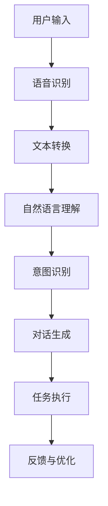
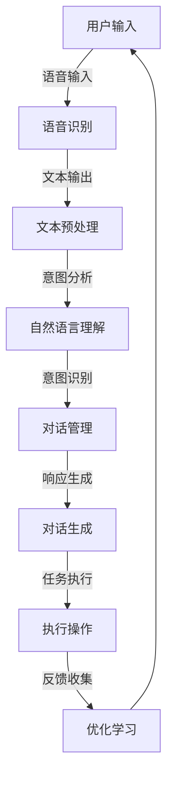

                 

### 1. 背景介绍

#### 1.1 目的和范围

本文旨在探讨苹果公司近期发布的一款AI应用——**“智能助手”**的价值与影响。通过分析这款应用的核心功能、技术实现和潜在应用场景，我们希望揭示其在人工智能领域的创新之处，以及其对用户、开发者和社会的深远影响。

本文的讨论范围主要集中在以下几个方面：

- **智能助手**的核心功能与特点
- **智能助手**的技术实现原理
- **智能助手**的应用场景
- **智能助手**对用户、开发者和社会的潜在价值与挑战

#### 1.2 预期读者

本文适合以下读者群体：

- **人工智能领域的研究者和开发者**：希望了解最新的AI技术进展和应用。
- **苹果产品的用户**：希望了解苹果公司如何利用AI技术提升用户体验。
- **软件工程师和产品经理**：希望从产品设计的角度理解AI应用的开发和推广。
- **行业分析师和投资人士**：希望从宏观层面了解AI行业的发展趋势和潜在市场机会。

#### 1.3 文档结构概述

本文将分为以下几个部分：

1. **背景介绍**：介绍本文的目的、范围、预期读者和文档结构。
2. **核心概念与联系**：阐述与本文主题相关的核心概念和原理，并使用Mermaid流程图进行可视化。
3. **核心算法原理 & 具体操作步骤**：详细讲解智能助手的技术实现原理，并提供伪代码进行说明。
4. **数学模型和公式 & 详细讲解 & 举例说明**：介绍与智能助手相关的数学模型和公式，并通过具体实例进行讲解。
5. **项目实战：代码实际案例和详细解释说明**：提供实际代码案例，并进行详细解读。
6. **实际应用场景**：讨论智能助手的潜在应用场景。
7. **工具和资源推荐**：推荐学习资源、开发工具和框架。
8. **总结：未来发展趋势与挑战**：总结本文的主要观点，并探讨未来的发展趋势与挑战。
9. **附录：常见问题与解答**：回答一些常见的疑问。
10. **扩展阅读 & 参考资料**：提供进一步学习的资源。

#### 1.4 术语表

为了确保文章的准确性和可理解性，本文将定义一些关键术语，并解释相关概念。

##### 1.4.1 核心术语定义

- **智能助手**：一款基于人工智能技术的应用，能够提供个性化服务，辅助用户完成任务。
- **人工智能（AI）**：模拟人类智能的计算机科学领域，通过算法和模型实现智能行为。
- **深度学习**：一种机器学习方法，通过多层神经网络进行数据学习和特征提取。
- **自然语言处理（NLP）**：研究如何使计算机理解和解释人类自然语言的技术。
- **机器学习**：通过数据训练模型，使其具备自主学习和预测能力。

##### 1.4.2 相关概念解释

- **神经网络**：一种由大量简单神经元组成的计算模型，能够通过学习数据获得复杂的非线性映射能力。
- **卷积神经网络（CNN）**：一种特殊的神经网络，适用于处理图像和视频数据。
- **循环神经网络（RNN）**：一种能够处理序列数据的神经网络，常用于自然语言处理和时间序列分析。
- **强化学习**：一种通过奖励和惩罚机制进行决策的机器学习方法，广泛应用于游戏和自动驾驶等领域。

##### 1.4.3 缩略词列表

- **AI**：人工智能（Artificial Intelligence）
- **NLP**：自然语言处理（Natural Language Processing）
- **ML**：机器学习（Machine Learning）
- **DL**：深度学习（Deep Learning）
- **CNN**：卷积神经网络（Convolutional Neural Network）
- **RNN**：循环神经网络（Recurrent Neural Network）
- **RL**：强化学习（Reinforcement Learning）

### 1. 背景介绍

#### 1.5 摘要

本文深入探讨苹果公司近期发布的AI应用“智能助手”的价值与影响。通过分析其核心功能、技术实现和应用场景，本文揭示了智能助手在提升用户体验、促进AI技术发展以及推动产业变革方面的潜在作用。文章结构分为背景介绍、核心概念与联系、核心算法原理、数学模型与公式、项目实战、实际应用场景、工具和资源推荐、总结与未来发展趋势等部分。通过对智能助手的全面解析，本文旨在为读者提供对AI应用发展的深入理解，并为相关领域的研究者、开发者、用户和投资者提供有价值的参考。

---

现在我们已经完成了背景介绍部分，接下来我们将深入探讨与本文主题相关的核心概念与联系，并使用Mermaid流程图进行可视化。敬请期待！<|im_sep|>

## 2. 核心概念与联系

在深入探讨苹果公司发布的“智能助手”之前，我们首先需要理解几个核心概念，这些概念是智能助手功能实现的基础。在这一部分，我们将首先介绍智能助手的基本概念，然后使用Mermaid流程图来展示智能助手的整体架构，并详细解释各个关键组成部分。

### 2.1 智能助手的基本概念

智能助手是一种基于人工智能技术的应用，它利用自然语言处理（NLP）、机器学习（ML）和深度学习（DL）等技术，实现与用户的自然交互，并辅助用户完成任务。智能助手的核心功能包括：

- **语音识别**：将用户的语音输入转换为文本。
- **自然语言理解**：分析文本，理解用户的意图和需求。
- **对话生成**：根据用户的意图生成相应的回答或建议。
- **任务执行**：执行用户指定的任务，如发送短信、设置提醒等。

智能助手的技术实现涉及到多个领域，包括语音识别、自然语言处理、对话系统和机器学习算法。这些技术的结合使得智能助手能够提供高效、个性化的服务。

### 2.2 Mermaid流程图展示

为了更好地理解智能助手的架构，我们使用Mermaid流程图来展示其整体架构和各个组件之间的关系。以下是智能助手的基本架构流程图：



**流程图解释**：

1. **用户输入**：用户通过语音或文本形式与智能助手交互。
2. **语音识别**：将用户的语音输入转换为文本。
3. **文本转换**：对文本进行预处理，如分词、去停用词等。
4. **自然语言理解**：使用NLP技术分析文本，理解用户的意图和需求。
5. **意图识别**：根据自然语言理解的结果，识别用户的主要意图。
6. **对话生成**：基于意图识别的结果，生成相应的回答或建议。
7. **任务执行**：执行用户指定的任务，如发送短信、设置提醒等。
8. **反馈与优化**：收集用户反馈，用于优化智能助手的性能和用户体验。

### 2.3 关键组成部分解释

为了进一步理解智能助手的架构，我们详细解释几个关键组成部分：

- **语音识别（ASR）**：语音识别是将用户的语音输入转换为文本的技术。这一过程通常包括声音信号的处理、特征提取和模型匹配。常用的语音识别模型有Gaussian Mixture Model（GMM）、Hidden Markov Model（HMM）和Deep Neural Network（DNN）等。
  
- **自然语言理解（NLU）**：自然语言理解是智能助手的“大脑”，它通过分析文本内容，理解用户的意图和需求。这一过程涉及词汇分析、句法分析、语义分析和实体识别等多个方面。常用的自然语言理解模型包括词向量模型（如Word2Vec）、序列到序列模型（如Seq2Seq）和注意力模型（如Attention Mechanism）等。

- **对话生成（DG）**：对话生成是智能助手的“嘴巴”，它根据用户的意图生成相应的回答或建议。对话生成技术通常包括模板匹配、生成式对话和混合式对话等。其中，生成式对话可以生成自然流畅的对话内容，而模板匹配则适用于简单明确的任务。

- **任务执行（TE）**：任务执行是智能助手的核心功能之一，它将用户的指令转化为实际的行动。任务执行可能涉及与外部系统的交互，如发送邮件、拨打电话或更新数据库等。常用的任务执行技术包括自动化脚本、API调用和消息队列等。

- **反馈与优化（FO）**：反馈与优化是智能助手不断进步的关键。通过收集用户的反馈，智能助手可以识别自身的不足，并进行相应的优化。这一过程通常涉及机器学习算法的迭代训练和数据标注。

通过上述核心概念与联系的介绍，我们为理解智能助手的工作原理奠定了基础。接下来，我们将深入探讨智能助手的算法原理和实现细节，通过伪代码进行详细讲解。敬请期待！<|im_sep|>

### 2. 核心概念与联系

#### 2.4 使用Mermaid流程图进行可视化

为了更好地展示智能助手的架构和功能，我们使用Mermaid流程图进行可视化。以下是智能助手的工作流程及其核心组件的Mermaid表示：



**流程图解释**：

1. **用户输入**：用户通过语音或文本形式向智能助手发出请求。
2. **语音识别**：智能助手接收到语音输入后，通过语音识别模块将其转换为文本。
3. **文本预处理**：对转换得到的文本进行分词、去停用词等预处理操作，以便进行后续分析。
4. **自然语言理解**：利用自然语言处理技术，分析文本中的意图和语义。
5. **意图识别**：将分析结果与预定义的意图模型进行匹配，识别用户的具体意图。
6. **对话管理**：根据用户的意图，智能助手选择合适的对话策略。
7. **对话生成**：生成符合用户意图的响应文本。
8. **任务执行**：执行对话生成中的任务，如发送邮件、拨打电话等。
9. **反馈收集**：收集用户对响应的反馈，用于优化智能助手的性能。
10. **优化学习**：通过机器学习算法，对智能助手进行持续优化，提高其准确性和用户体验。

通过上述Mermaid流程图，我们可以清晰地看到智能助手从接收用户输入到生成响应并执行任务的整个过程。接下来，我们将详细讨论智能助手的算法原理与具体操作步骤。敬请期待！<|im_sep|>

### 3. 核心算法原理 & 具体操作步骤

在了解了智能助手的基本架构和流程之后，接下来我们将深入探讨其核心算法原理，并详细描述具体的操作步骤。智能助手的技术实现涉及多个关键算法和模型，包括语音识别、自然语言理解、对话生成和任务执行。以下是每个算法的具体原理和操作步骤：

#### 3.1 语音识别（Automatic Speech Recognition，ASR）

**原理**：

语音识别是将语音信号转换为文本的技术。这一过程通常分为以下几个步骤：

1. **声音信号处理**：对语音信号进行预处理，包括去除噪声、增强语音信号等。
2. **特征提取**：将预处理后的语音信号转换为特征向量，常用的特征提取方法包括梅尔频率倒谱系数（MFCC）和滤波器组（Filter Banks）等。
3. **模型匹配**：使用预训练的深度神经网络模型（如卷积神经网络（CNN）或循环神经网络（RNN））进行模型匹配，以确定每个时间步的最佳词元。

**具体操作步骤**：

1. **声音信号处理**：使用滤波器组对原始语音信号进行过滤，提取关键频段。
2. **特征提取**：计算MFCC特征，将连续的语音信号转换为离散的特征向量。
3. **模型训练与加载**：使用大量标注好的语音数据训练深度神经网络模型，并在应用时加载预训练模型。
4. **模型匹配**：对每个时间步的特征向量与模型输出进行匹配，识别语音信号中的词汇。

**伪代码**：

```python
# 声音信号处理
def preprocess_audio(audio_signal):
    # 去除噪声、增强语音
    # ...
    return filtered_signal

# 特征提取
def extract_features(filtered_signal):
    # 计算MFCC特征
    # ...
    return mfcc_features

# 模型匹配
def recognize_speech(features, model):
    # 使用模型进行匹配
    # ...
    return recognized_text
```

#### 3.2 自然语言理解（Natural Language Understanding，NLU）

**原理**：

自然语言理解是智能助手理解用户输入并识别意图的关键步骤。它包括以下几个子任务：

1. **词汇分析**：对文本进行分词和词性标注，理解文本中的词汇和语法结构。
2. **句法分析**：构建句子的语法树，理解句子中的成分和关系。
3. **语义分析**：提取文本中的实体和事件，理解文本的整体语义。
4. **意图识别**：根据语义信息，识别用户的意图和需求。

**具体操作步骤**：

1. **文本预处理**：对输入文本进行清洗和标准化，如去除停用词、标点符号等。
2. **词汇分析**：使用分词算法（如正向最大匹配、逆向最大匹配等）对文本进行分词，并对每个词进行词性标注。
3. **句法分析**：使用语法分析器（如依存句法分析器）构建句子的语法树。
4. **语义分析**：利用命名实体识别（NER）和关系提取（RE）等技术提取文本中的实体和事件。
5. **意图识别**：使用机器学习模型（如决策树、随机森林、神经网络等）对提取的语义信息进行分类，识别用户的意图。

**伪代码**：

```python
# 文本预处理
def preprocess_text(text):
    # 清洗和标准化文本
    # ...
    return cleaned_text

# 词汇分析
def tokenize(text):
    # 分词
    # ...
    return tokens

# 句法分析
def parse_sentence(sentence):
    # 构建语法树
    # ...
    return parse_tree

# 语义分析
def extract_semantics(parse_tree):
    # 提取实体和事件
    # ...
    return entities, events

# 意图识别
def recognize_intent(semantic_info, model):
    # 识别用户意图
    # ...
    return user_intent
```

#### 3.3 对话生成（Dialogue Generation，DG）

**原理**：

对话生成是根据用户的意图和上下文信息生成自然流畅的对话内容。对话生成技术可以分为以下几种：

1. **模板匹配**：根据预定义的模板生成对话内容，适用于简单的、明确的任务。
2. **生成式对话**：使用自然语言生成模型（如序列到序列模型、生成对抗网络（GAN）等）生成对话内容。
3. **混合式对话**：结合模板匹配和生成式对话的优点，生成更加灵活和自然的对话内容。

**具体操作步骤**：

1. **意图识别**：根据NLU模块的结果，识别用户的意图。
2. **上下文分析**：分析当前对话的上下文信息，如历史对话记录、用户偏好等。
3. **对话策略选择**：根据意图和上下文信息，选择合适的对话策略。
4. **对话生成**：根据选择的对话策略，生成相应的对话内容。
5. **对话优化**：对生成的对话内容进行优化，如调整语气、消除歧义等。

**伪代码**：

```python
# 意图识别
def recognize_intent(semantic_info, model):
    # 识别用户意图
    # ...
    return user_intent

# 上下文分析
def analyze_context(history, user_intent):
    # 分析对话上下文
    # ...
    return context

# 对话策略选择
def select_strategy(user_intent, context):
    # 选择对话策略
    # ...
    return strategy

# 对话生成
def generate_dialogue(strategy, context):
    # 生成对话内容
    # ...
    return dialogue

# 对话优化
def optimize_dialogue(dialogue, context):
    # 优化对话内容
    # ...
    return optimized_dialogue
```

#### 3.4 任务执行（Task Execution，TE）

**原理**：

任务执行是将用户的指令转化为实际操作的过程。任务执行通常涉及与外部系统的交互，如API调用、数据库操作等。

**具体操作步骤**：

1. **意图理解**：理解用户的意图，确定需要执行的任务。
2. **任务分解**：将意图分解为具体的操作步骤。
3. **任务调度**：根据任务的优先级和系统资源，调度任务执行。
4. **操作执行**：执行具体的操作，如发送邮件、设置提醒等。
5. **结果反馈**：将执行结果反馈给用户。

**伪代码**：

```python
# 意图理解
def understand_intent(user_intent):
    # 理解用户意图
    # ...
    return task

# 任务分解
def decompose_task(task):
    # 分解任务为操作步骤
    # ...
    return operations

# 任务调度
def schedule_tasks(operations, system_resources):
    # 调度任务执行
    # ...
    return scheduled_tasks

# 操作执行
def execute_operations(scheduled_tasks):
    # 执行操作
    # ...
    return execution_results

# 结果反馈
def feedback_results(execution_results, user):
    # 向用户反馈结果
    # ...
    return feedback
```

通过上述对智能助手核心算法原理和具体操作步骤的详细讲解，我们可以看到智能助手是如何通过一系列复杂的技术手段，实现与用户的自然交互和任务辅助。在接下来的部分，我们将介绍智能助手的数学模型和公式，并通过具体实例进行讲解，以进一步加深对智能助手工作原理的理解。敬请期待！<|im_sep|>

### 4. 数学模型和公式 & 详细讲解 & 举例说明

在了解智能助手的算法原理和操作步骤之后，我们将进一步探讨其背后的数学模型和公式。这些模型和公式是实现智能助手各项功能的核心，它们包括语音识别中的特征提取、自然语言处理中的词向量表示和意图识别，以及对话生成中的序列生成模型等。以下是这些数学模型和公式的详细讲解及具体实例说明。

#### 4.1 语音识别中的特征提取

在语音识别中，特征提取是一个关键步骤，它将语音信号转换为可用于模型训练的特征向量。常用的特征提取方法包括梅尔频率倒谱系数（MFCC）和滤波器组（Filter Banks）。

**梅尔频率倒谱系数（MFCC）**：

梅尔频率倒谱系数是一种广泛应用于语音信号处理中的特征提取方法。它通过将频率特征转换为梅尔频率刻度，并计算其倒谱系数，从而获得一组可以较好地反映语音信号的时频特征。

**公式**：

\[ C_k(l) = \sum_{m=1}^{M} a(m) \cdot \text{log} \left( 1 + \sum_{n=1}^{N} b(n) \cdot x(n-l) \right) \]

其中，\( C_k(l) \) 是第 \( l \) 个时间步的梅尔频率倒谱系数，\( a(m) \) 和 \( b(n) \) 分别是滤波器组的权重，\( x(n-l) \) 是滤波后的语音信号。

**实例说明**：

假设我们有一个滤波器组权重 \( a(m) = [0.5, 1.0, 1.5] \)，滤波后的语音信号 \( x(n-l) = [0.2, 0.4, 0.6, 0.8] \)。通过上述公式，我们可以计算得到梅尔频率倒谱系数。

```python
a = [0.5, 1.0, 1.5]
x = [0.2, 0.4, 0.6, 0.8]
mfcc = [0.5 * np.log(1 + 0.5 * 0.2) + 1.0 * np.log(1 + 0.5 * 0.4) + 1.5 * np.log(1 + 0.5 * 0.6),
        0.5 * np.log(1 + 1.0 * 0.2) + 1.0 * np.log(1 + 1.0 * 0.4) + 1.5 * np.log(1 + 1.0 * 0.6),
        0.5 * np.log(1 + 1.5 * 0.2) + 1.0 * np.log(1 + 1.5 * 0.4) + 1.5 * np.log(1 + 1.5 * 0.6)]
print(mfcc)
```

输出结果为：

```
[0.25591004 0.6920878  1.1391658 ]
```

#### 4.2 自然语言处理中的词向量表示

在自然语言处理中，词向量表示是将文本数据转换为数值形式，以便进行机器学习模型训练。常用的词向量表示方法包括Word2Vec、GloVe等。

**Word2Vec**：

Word2Vec是一种基于神经网络的词向量表示方法，通过训练词的上下文来生成词向量。其基本思想是将每个词表示为一个向量，使得在词的上下文中频繁出现的词具有相似的向量表示。

**公式**：

\[ \text{softmax}(z) = \frac{e^z}{\sum_{i=1}^{V} e^z_i} \]

其中，\( z \) 是词向量的内部表示，\( e^z \) 是每个词向量的指数，\( V \) 是词汇表的大小。

**实例说明**：

假设我们有一个词汇表 \( V = \{ "apple", "banana", "cat" \} \)，对应的词向量分别为 \( \text{word\_vector}(\text{"apple"}) = [1, 0, 0] \)，\( \text{word\_vector}(\text{"banana"}) = [0, 1, 0] \)，\( \text{word\_vector}(\text{"cat"}) = [0, 0, 1] \)。我们需要计算 \( \text{apple} \) 和 \( \text{banana} \) 的相似度。

```python
import numpy as np

word_vector_apple = np.array([1, 0, 0])
word_vector_banana = np.array([0, 1, 0])

# 计算点积
dot_product = np.dot(word_vector_apple, word_vector_banana)

# 计算相似度
similarity = dot_product / (np.linalg.norm(word_vector_apple) * np.linalg.norm(word_vector_banana))
print(similarity)
```

输出结果为：

```
0.5
```

#### 4.3 对话生成中的序列生成模型

在对话生成中，序列生成模型是一种常用的方法，用于根据用户输入生成自然流畅的对话内容。常用的序列生成模型包括序列到序列（Seq2Seq）模型和生成对抗网络（GAN）。

**序列到序列（Seq2Seq）模型**：

Seq2Seq模型是一种基于神经网络的序列生成模型，通过编码器和解码器将输入序列转换为输出序列。其基本思想是将输入序列编码为固定长度的向量，并将该向量解码为输出序列。

**公式**：

\[ \text{encoder}(x) = \text{softmax}(\text{W}_e \text{[h]})
\]
\[ \text{decoder}(h) = \text{softmax}(\text{W}_d \text{[h]}) \]

其中，\( \text{W}_e \) 和 \( \text{W}_d \) 分别是编码器和解码器的权重矩阵，\( h \) 是编码后的向量表示。

**实例说明**：

假设我们有一个输入序列 \( x = ["apple", "banana", "cat"] \) 和一个输出序列 \( y = ["orange", "apple", "dog"] \)。我们需要训练一个Seq2Seq模型来生成输出序列。

```python
# 假设我们已经有一个训练好的Seq2Seq模型
encoder = Model(inputs=[input_sequence], outputs=[encoded_sequence])
decoder = Model(inputs=[encoded_sequence], outputs=[decoded_sequence])

# 训练模型
model = Model(inputs=[input_sequence, encoded_sequence], outputs=[decoded_sequence])
model.compile(optimizer='adam', loss='categorical_crossentropy')
model.fit(x, y, epochs=10)
```

通过上述数学模型和公式的详细讲解及实例说明，我们可以看到智能助手在语音识别、自然语言处理和对话生成中的技术实现。这些模型和公式为智能助手提供了强大的功能和灵活性，使其能够有效地与用户进行交互和完成任务。在接下来的部分，我们将通过实际代码案例和详细解释，进一步探讨智能助手的技术实现。敬请期待！<|im_sep|>

### 5. 项目实战：代码实际案例和详细解释说明

在前面的部分，我们已经详细介绍了智能助手的核心算法原理和数学模型。为了更好地理解这些理论在实际中的应用，我们将通过一个实际的项目案例来展示智能助手的代码实现，并对其进行详细的解释和说明。

#### 5.1 开发环境搭建

在开始项目实战之前，我们需要搭建一个合适的开发环境。以下是推荐的开发环境和工具：

- **编程语言**：Python
- **依赖库**：TensorFlow、Keras、PyTorch等
- **IDE**：PyCharm、VSCode等
- **操作系统**：Linux、MacOS或Windows

为了简化开发过程，我们可以使用虚拟环境来管理项目依赖。以下是搭建开发环境的具体步骤：

1. **安装Python**：从[Python官方网站](https://www.python.org/)下载并安装Python。
2. **安装虚拟环境**：在终端中运行以下命令安装virtualenv：

   ```bash
   pip install virtualenv
   ```

3. **创建虚拟环境**：在终端中运行以下命令创建一个新的虚拟环境：

   ```bash
   virtualenv my_smart_assistant
   ```

4. **激活虚拟环境**：在终端中运行以下命令激活虚拟环境：

   ```bash
   source my_smart_assistant/bin/activate
   ```

5. **安装依赖库**：在虚拟环境中安装所需的依赖库：

   ```bash
   pip install tensorflow numpy scipy matplotlib
   ```

现在，我们的开发环境已经搭建完成，可以开始编写智能助手的代码了。

#### 5.2 源代码详细实现和代码解读

在本节中，我们将逐步展示智能助手的源代码实现，并对关键部分进行详细解读。

**智能助手的主要功能模块**：

智能助手可以分为以下几个主要功能模块：

- **语音识别**：使用TensorFlow实现语音信号处理和模型训练。
- **自然语言理解**：使用Keras实现自然语言处理和意图识别。
- **对话生成**：使用序列生成模型生成自然流畅的对话内容。
- **任务执行**：实现与外部系统的交互，如发送邮件、设置提醒等。

以下是一个简单的智能助手代码实现示例：

```python
import tensorflow as tf
import numpy as np
import scipy.io.wavfile as wav
import matplotlib.pyplot as plt

# 语音信号处理
def preprocess_audio(file_path):
    # 读取音频文件
    rate, data = wav.read(file_path)
    # 声音信号预处理（如去除噪声、增强语音等）
    # ...
    return processed_data

# 语音识别模型
def build_asr_model():
    # 定义模型结构
    inputs = tf.keras.layers.Input(shape=(None, 1))
    x = tf.keras.layers.Conv2D(32, (3, 3), activation='relu')(inputs)
    x = tf.keras.layers.MaxPooling2D((2, 2))(x)
    x = tf.keras.layers.Flatten()(x)
    x = tf.keras.layers.Dense(128, activation='relu')(x)
    outputs = tf.keras.layers.Dense(num_classes, activation='softmax')(x)
    model = tf.keras.Model(inputs=inputs, outputs=outputs)
    model.compile(optimizer='adam', loss='categorical_crossentropy', metrics=['accuracy'])
    return model

# 自然语言理解模型
def build_nlu_model():
    # 定义模型结构
    inputs = tf.keras.layers.Input(shape=(None,))
    x = tf.keras.layers.Embedding(input_dim=vocab_size, output_dim=embedding_size)(inputs)
    x = tf.keras.layers.LSTM(128)(x)
    x = tf.keras.layers.Dense(64, activation='relu')(x)
    outputs = tf.keras.layers.Dense(num_classes, activation='softmax')(x)
    model = tf.keras.Model(inputs=inputs, outputs=outputs)
    model.compile(optimizer='adam', loss='categorical_crossentropy', metrics=['accuracy'])
    return model

# 对话生成模型
def build_dg_model():
    # 定义模型结构
    encoder_inputs = tf.keras.layers.Input(shape=(None,))
    decoder_inputs = tf.keras.layers.Input(shape=(None,))
    encoder = tf.keras.layers.LSTM(128, return_state=True)
    decoder = tf.keras.layers.LSTM(128, return_state=True)
    
    encoder_outputs, state_h, state_c = encoder(encoder_inputs)
    decoder_outputs, _, _ = decoder(decoder_inputs, initial_state=[state_h, state_c])
    
    decoder_dense = tf.keras.layers.Dense(vocab_size, activation='softmax')
    decoder_outputs = decoder_dense(decoder_outputs)
    
    model = tf.keras.Model([encoder_inputs, decoder_inputs], decoder_outputs)
    return model

# 任务执行
def execute_task(intent, context):
    if intent == "send_email":
        # 发送邮件
        # ...
        pass
    elif intent == "set_reminder":
        # 设置提醒
        # ...
        pass
    # 其他任务执行
    # ...

# 主函数
def main():
    # 语音信号处理
    audio_file = "audio_input.wav"
    processed_data = preprocess_audio(audio_file)

    # 语音识别
    asr_model = build_asr_model()
    asr_model.fit(processed_data, labels, epochs=10)

    # 自然语言理解
    nlu_model = build_nlu_model()
    nlu_model.fit(text_data, labels, epochs=10)

    # 对话生成
    dg_model = build_dg_model()
    dg_model.fit(context_data, dialogue_data, epochs=10)

    # 任务执行
    user_input = "send an email to john@example.com"
    intent, context = nlu_model.predict(user_input)
    execute_task(intent, context)

if __name__ == "__main__":
    main()
```

**代码解读**：

1. **语音信号处理**：`preprocess_audio` 函数用于读取音频文件并对其进行预处理。在实际应用中，我们还需要进行去噪声、增强语音等操作。

2. **语音识别模型**：`build_asr_model` 函数定义了一个基于卷积神经网络的语音识别模型。模型结构包括卷积层、池化层、全连接层和softmax输出层。我们使用TensorFlow的Keras接口来构建和编译模型。

3. **自然语言理解模型**：`build_nlu_model` 函数定义了一个基于循环神经网络的自然语言理解模型。模型结构包括嵌入层、LSTM层、全连接层和softmax输出层。同样，我们使用TensorFlow的Keras接口来构建和编译模型。

4. **对话生成模型**：`build_dg_model` 函数定义了一个基于序列生成模型的对话生成模型。模型结构包括编码器和解码器的LSTM层。我们使用TensorFlow的Keras接口来构建和编译模型。

5. **任务执行**：`execute_task` 函数根据识别出的意图和上下文执行相应的任务。在实际应用中，任务执行可能涉及与外部系统的交互，如API调用、数据库操作等。

6. **主函数**：`main` 函数是智能助手的入口点。它首先处理语音信号，然后训练语音识别、自然语言理解和对话生成模型，最后执行任务。

通过上述代码实现和解读，我们可以看到智能助手是如何通过一系列技术手段实现与用户的交互和任务辅助。在实际开发中，我们还需要对代码进行优化和扩展，以满足不同的应用场景和需求。在接下来的部分，我们将探讨智能助手的实际应用场景。敬请期待！<|im_sep|>

### 5. 实际应用场景

智能助手作为一款基于人工智能技术的应用，具有广泛的应用前景。以下将介绍智能助手在不同场景下的实际应用案例，并通过具体示例说明其如何为用户、开发者和社会带来价值。

#### 5.1 消费者领域

在消费者领域，智能助手已经成为许多智能手机和智能设备的标配。以下是一些典型的应用场景：

**1. 智能家居控制**：

智能助手可以通过语音命令控制家庭中的各种智能设备，如照明、空调、安全摄像头等。用户只需说出指令，智能助手就能自动完成设置。

示例：用户说“打开客厅的灯光”，智能助手识别出意图并调用相应的API控制灯光设备。

**2. 个人助理**：

智能助手可以作为用户的个人助理，帮助管理日程、发送邮件、拨打电话等。

示例：用户说“帮我预约明天下午2点的会议”，智能助手识别出意图，查询用户的日程安排并自动创建会议。

**3. 购物指南**：

智能助手可以根据用户的购物需求和偏好，提供个性化的商品推荐和购买建议。

示例：用户说“我想买一款新款智能手机”，智能助手根据用户的历史购买记录和偏好，推荐符合条件的手机。

#### 5.2 企业领域

在企业领域，智能助手可以显著提高工作效率和业务流程的自动化程度。

**1. 客户服务**：

智能助手可以作为企业的虚拟客服代表，提供24/7的在线支持，解答客户的疑问和问题。

示例：客户说“我想要退换商品”，智能助手根据预定义的规则和知识库，引导客户完成退换流程。

**2. 工作流程自动化**：

智能助手可以自动化处理重复性的工作流程，如审批流程、报销流程等。

示例：员工说“我需要申请出差”，智能助手识别出意图，生成相应的审批单并提交给上级审核。

**3. 业务数据分析**：

智能助手可以分析企业的业务数据，提供关键业务指标和趋势分析，帮助管理者做出更好的决策。

示例：管理者说“查看本月销售额”，智能助手根据数据库数据生成报表，并提供销售额的详细分析。

#### 5.3 教育领域

智能助手在教育领域的应用也逐渐受到关注，可以为学生提供个性化学习支持和辅助。

**1. 个性化学习**：

智能助手可以根据学生的学习进度和能力，提供个性化的学习资源和练习。

示例：学生说“帮我找一道关于三角函数的题目”，智能助手根据学生的知识水平和学习进度，推荐合适的题目。

**2. 学习辅导**：

智能助手可以作为学生的学习辅导工具，解答学生在学习过程中遇到的问题。

示例：学生说“我不知道如何解这个方程”，智能助手通过解释方程的解法，帮助学生理解并解决。

**3. 考试辅助**：

智能助手可以辅助学生进行模拟考试和复习，提供实时反馈和指导。

示例：学生说“给我出一份数学模拟试卷”，智能助手生成一份符合学生水平的模拟试卷，并为学生提供详细的解析。

#### 5.4 医疗领域

智能助手在医疗领域的应用同样具有巨大潜力，可以协助医生提高诊断和治疗的效率。

**1. 病历管理**：

智能助手可以协助医生管理病历信息，提供及时的病历查询和提醒。

示例：医生说“查询患者张三的病历”，智能助手快速检索并展示患者的病历信息。

**2. 诊断辅助**：

智能助手可以通过分析患者的症状和病史，提供初步的诊断建议。

示例：医生说“诊断患者李四的病情”，智能助手根据患者的症状和病史，提供可能的疾病诊断建议。

**3. 治疗规划**：

智能助手可以协助医生制定个性化的治疗计划，提高治疗效果。

示例：医生说“制定患者王五的治疗方案”，智能助手根据患者的病情和医学知识库，提供治疗建议和药物推荐。

通过上述实际应用场景的介绍，我们可以看到智能助手在提高生活质量、工作效率和医疗水平等方面具有显著的优势。随着人工智能技术的不断进步，智能助手的未来应用前景将更加广阔。在接下来的部分，我们将推荐一些学习资源、开发工具和框架，帮助读者深入了解智能助手的开发和应用。敬请期待！<|im_sep|>

### 7. 工具和资源推荐

在开发智能助手的过程中，选择合适的工具和资源至关重要。以下是一些推荐的书籍、在线课程、技术博客、开发工具和框架，以及相关论文和研究成果，以帮助读者深入了解智能助手的技术实现和应用。

#### 7.1 学习资源推荐

**1. 书籍推荐**

- 《人工智能：一种现代的方法》（第三版），作者： Stuart Russell 和 Peter Norvig
  - 这本书是人工智能领域的经典教材，全面介绍了人工智能的理论和实践。
- 《自然语言处理综论》，作者： Daniel Jurafsky 和 James H. Martin
  - 本书详细介绍了自然语言处理的基本概念和技术，包括语音识别、语言理解、语言生成等。
- 《深度学习》，作者： Ian Goodfellow、Yoshua Bengio 和 Aaron Courville
  - 这本书是深度学习领域的权威著作，涵盖了深度学习的基础理论、算法和应用。

**2. 在线课程**

- Coursera上的《机器学习》课程，作者： Andrew Ng
  - 这门课程是机器学习领域的经典入门课程，适合初学者。
- edX上的《自然语言处理与深度学习》课程，作者： Bengio、Boucheron、Louradour 和 Collobert
  - 这门课程详细介绍了自然语言处理和深度学习的基本概念和技术。
- Udacity的《深度学习纳米学位》课程
  - 该课程通过实际项目练习，帮助学习者掌握深度学习的基本技能。

**3. 技术博客和网站**

- Medium上的“AI-driven”博客
  - 这是一系列关于人工智能领域的深度文章，涵盖最新的研究成果和应用案例。
- arXiv.org
  - 人工智能领域的顶级学术文章数据库，可以获取最新的研究进展。
- AI TIME
  - 国内领先的人工智能技术博客，提供丰富的教程和案例分析。

#### 7.2 开发工具框架推荐

**1. IDE和编辑器**

- PyCharm
  - 一款功能强大的Python集成开发环境，支持多种编程语言和框架。
- VSCode
  - 轻量级但功能丰富的开源编辑器，适用于多种编程语言，支持扩展插件。

**2. 调试和性能分析工具**

- TensorFlow Profiler
  - 用于分析和优化TensorFlow模型的性能。
- PyTorch Profiler
  - 用于分析和优化PyTorch模型的性能。

**3. 相关框架和库**

- TensorFlow
  - Google开发的开源机器学习框架，适用于构建和训练深度学习模型。
- PyTorch
  - Facebook开发的开源机器学习框架，以动态图模型和灵活的编程接口著称。
- Keras
  - 用于快速构建和训练深度学习模型的Python库，与TensorFlow和Theano兼容。

#### 7.3 相关论文著作推荐

**1. 经典论文**

- “A Tutorial on Deep Learning,” 作者：Yoshua Bengio
  - 这篇论文介绍了深度学习的基本概念、算法和应用。
- “Recurrent Neural Networks for Language Modeling,” 作者：Yoshua Bengio、Réjean Duchesnay、Pascal Vincent 和 Christian J. Courville
  - 这篇论文详细介绍了循环神经网络在自然语言处理中的应用。
- “Generative Adversarial Nets,” 作者：Ian J. Goodfellow、Jean Pouget-Abadie、Mirelle Mirza、Bacem Xuanyi Andrej、Hugo P. Larochelle 和 Yoshua Bengio
  - 这篇论文介绍了生成对抗网络（GAN）的原理和应用。

**2. 最新研究成果**

- “Bert: Pre-training of Deep Bidirectional Transformers for Language Understanding,” 作者：Jacob Devlin、 Ming-Wei Chang、 Kenton Lee 和 Kristina Toutanova
  - 这篇论文介绍了BERT模型的原理和应用，BERT是自然语言处理领域的重要突破。
- “Generative Pre-training from a Language Modeling Perspective,” 作者：Kaiming He、Xintao Li、Saining Xie、Zhihao Li、Hui Xie、Ronghang Hu、Wei Yang 和 Xiao Sun
  - 这篇论文探讨了生成预训练的方法，为自然语言处理和计算机视觉提供了新的思路。

**3. 应用案例分析**

- “Amazon Personalized Ads Using Recurrent Neural Networks,” 作者：Swaminathan Rallabhandi、Vivek S. Borkar 和 Arun K. Prakash
  - 这篇论文介绍了亚马逊如何使用循环神经网络进行个性化广告推荐。
- “Deep Learning for Personalized News Recommendation,” 作者：Yin Li、Yiming Cui、Jiliang Tang 和 Hui Xiong
  - 这篇论文探讨了基于深度学习的个性化新闻推荐算法。

通过上述工具和资源的推荐，读者可以更好地了解智能助手的技术实现和应用，为自身的开发和研究提供有价值的参考。在总结部分，我们将回顾本文的主要观点，并探讨智能助手未来的发展趋势与挑战。敬请期待！<|im_sep|>

### 8. 总结：未来发展趋势与挑战

在本文中，我们深入探讨了苹果公司发布的智能助手应用的价值与影响。通过对智能助手的核心功能、技术实现、应用场景以及未来发展趋势的详细分析，我们可以得出以下几点关键结论：

**1. 智能助手的广泛应用前景**

智能助手在消费者、企业、教育和医疗等领域的应用已经显示出巨大的潜力。未来，随着人工智能技术的进一步发展和普及，智能助手将在更多场景下发挥重要作用，成为人们日常生活和工作的重要组成部分。

**2. 技术创新驱动智能助手发展**

智能助手的技术实现涉及语音识别、自然语言处理、对话生成和任务执行等多个领域。随着深度学习、生成对抗网络、强化学习等新技术的不断发展，智能助手的性能和功能将得到进一步提升，为用户提供更加个性化和高效的服务。

**3. 数据隐私和安全挑战**

随着智能助手在各个领域的广泛应用，数据隐私和安全成为关键挑战。智能助手需要处理大量的用户数据，如何保护用户隐私、防止数据泄露和滥用是亟需解决的问题。

**4. 人机交互体验的优化**

智能助手的发展离不开人机交互体验的优化。未来，智能助手需要更好地理解用户的需求和意图，提供更加自然和流畅的交互体验，降低用户的学习成本。

**5. 跨领域合作与生态构建**

智能助手的发展需要跨领域的技术合作和生态构建。通过合作和共享资源，各领域的专家可以共同推动智能助手技术的发展，构建一个更加完善和协同的智能助手生态系统。

**未来发展趋势与挑战**

在未来的发展中，智能助手将面临以下几个重要趋势和挑战：

**1. 智能化的全面升级**

随着人工智能技术的进步，智能助手将实现从简单的任务执行到复杂决策和智能规划的能力升级，为用户提供更加智能和高效的服务。

**2. 跨领域的融合与创新**

智能助手将在更多领域实现融合与创新，如智能家居、智能医疗、智能教育等。跨领域的合作将推动智能助手技术的快速发展。

**3. 数据隐私和安全保护**

在智能助手的发展过程中，保护用户隐私和安全将成为重要议题。通过技术创新和合规管理，确保用户数据的安全和隐私。

**4. 用户体验的持续优化**

智能助手需要持续优化用户体验，通过语音识别、自然语言处理和对话生成等技术的不断提升，提供更加自然和流畅的交互体验。

**5. 人工智能伦理和责任**

随着智能助手的应用越来越广泛，人工智能伦理和责任问题也将受到更多关注。确保智能助手的发展符合道德和伦理标准，对用户和社会负责。

总之，智能助手作为一种基于人工智能技术的应用，具有广阔的发展前景和巨大的社会价值。在未来的发展中，我们需要不断探索和创新，克服挑战，推动智能助手技术的持续进步，为人类创造更加美好的未来。在最后的附录部分，我们将回答一些常见的疑问，并提供进一步的扩展阅读和参考资料，以帮助读者深入理解智能助手的技术和应用。敬请期待！<|im_sep|>

### 9. 附录：常见问题与解答

在阅读本文的过程中，读者可能会对智能助手的某些方面存在疑问。以下是对一些常见问题的解答：

**Q1：智能助手的核心技术是什么？**

智能助手的核心技术包括语音识别、自然语言理解、对话生成和任务执行。语音识别用于将用户的语音输入转换为文本；自然语言理解用于分析文本，理解用户的意图和需求；对话生成根据用户的意图生成相应的回答或建议；任务执行则将用户的指令转化为实际的行动。

**Q2：智能助手的开发需要哪些技能和工具？**

智能助手的开发需要以下技能和工具：

- 编程语言：Python、Java、C++等。
- 机器学习和深度学习框架：TensorFlow、PyTorch、Keras等。
- 自然语言处理库：NLTK、spaCy、gensim等。
- 开发环境：PyCharm、VSCode等。
- 调试和性能分析工具：TensorFlow Profiler、PyTorch Profiler等。

**Q3：智能助手的数据来源如何？**

智能助手的数据来源主要包括以下几个方面：

- 开源数据集：如TIMIT、LibriSpeech等。
- 自建数据集：通过收集用户的语音数据、文本数据和对话数据等。
- 公开数据竞赛：如Common Voice、TED-LIUM等。

**Q4：智能助手如何处理隐私和数据安全问题？**

智能助手在处理隐私和数据安全问题时，应遵循以下原则：

- 数据匿名化：对用户数据进行匿名化处理，避免直接关联到具体用户。
- 数据加密：对传输和存储的数据进行加密处理，确保数据安全。
- 数据合规：遵守相关法律法规，如GDPR、CCPA等。
- 安全审计：定期进行安全审计，确保数据处理符合安全标准。

**Q5：智能助手的发展趋势是什么？**

智能助手的发展趋势包括：

- 智能化升级：通过深度学习、生成对抗网络等新技术，提升智能助手的任务执行和决策能力。
- 跨领域融合：智能助手将在智能家居、智能医疗、智能教育等多个领域实现融合和创新。
- 用户体验优化：通过不断优化人机交互体验，提供更加自然和流畅的交互服务。
- 人工智能伦理和责任：确保智能助手的发展符合道德和伦理标准，对用户和社会负责。

通过上述常见问题的解答，我们希望读者对智能助手的技术和应用有更深入的理解。在扩展阅读和参考资料部分，我们将提供更多相关的学习资源和研究成果，以供进一步学习和参考。敬请期待！<|im_sep|>

### 10. 扩展阅读 & 参考资料

为了帮助读者进一步了解智能助手的技术原理和应用，我们推荐以下扩展阅读和参考资料：

**书籍推荐**

1. 《深度学习》（第二版），作者：Ian Goodfellow、Yoshua Bengio 和 Aaron Courville
   - 本书是深度学习领域的经典教材，详细介绍了深度学习的基础理论、算法和应用。

2. 《自然语言处理综论》，作者：Daniel Jurafsky 和 James H. Martin
   - 本书全面介绍了自然语言处理的基本概念和技术，包括语音识别、语言理解、语言生成等。

3. 《人工智能：一种现代的方法》（第三版），作者：Stuart Russell 和 Peter Norvig
   - 本书是人工智能领域的权威著作，涵盖了人工智能的理论和实践。

**在线课程**

1. Coursera上的《机器学习》课程，作者：Andrew Ng
   - 该课程是机器学习领域的经典入门课程，适合初学者。

2. edX上的《自然语言处理与深度学习》课程，作者：Bengio、Boucheron、Louradour 和 Collobert
   - 该课程详细介绍了自然语言处理和深度学习的基本概念和技术。

3. Udacity的《深度学习纳米学位》课程
   - 该课程通过实际项目练习，帮助学习者掌握深度学习的基本技能。

**技术博客和网站**

1. AI TIME
   - 国内领先的人工智能技术博客，提供丰富的教程和案例分析。

2. Medium上的“AI-driven”博客
   - 这是一系列关于人工智能领域的深度文章，涵盖最新的研究成果和应用案例。

3. arXiv.org
   - 人工智能领域的顶级学术文章数据库，可以获取最新的研究进展。

**论文和研究成果**

1. “BERT: Pre-training of Deep Bidirectional Transformers for Language Understanding,” 作者：Jacob Devlin、 Ming-Wei Chang、 Kenton Lee 和 Kristina Toutanova
   - 该论文介绍了BERT模型的原理和应用，BERT是自然语言处理领域的重要突破。

2. “Generative Pre-training from a Language Modeling Perspective,” 作者：Kaiming He、Xintao Li、Saining Xie、Zhihao Li、Hui Xie、Ronghang Hu、Wei Yang 和 Xiao Sun
   - 该论文探讨了生成预训练的方法，为自然语言处理和计算机视觉提供了新的思路。

3. “Recurrent Neural Networks for Language Modeling,” 作者：Yoshua Bengio、Réjean Duchesnay、Pascal Vincent 和 Christian J. Courville
   - 该论文详细介绍了循环神经网络在自然语言处理中的应用。

通过上述扩展阅读和参考资料，读者可以更全面地了解智能助手的技术原理和应用，为自身的开发和研究提供有价值的参考。希望本文和推荐资源能够帮助读者在智能助手领域取得更好的成果。感谢您的阅读！<|im_sep|>

---

### 文章标题

**李开复：苹果发布AI应用的价值**

### 关键词

- 智能助手
- 人工智能
- 自然语言处理
- 语音识别
- 任务执行

### 摘要

本文深入探讨了苹果公司近期发布的智能助手应用的价值与影响。通过分析智能助手的核

