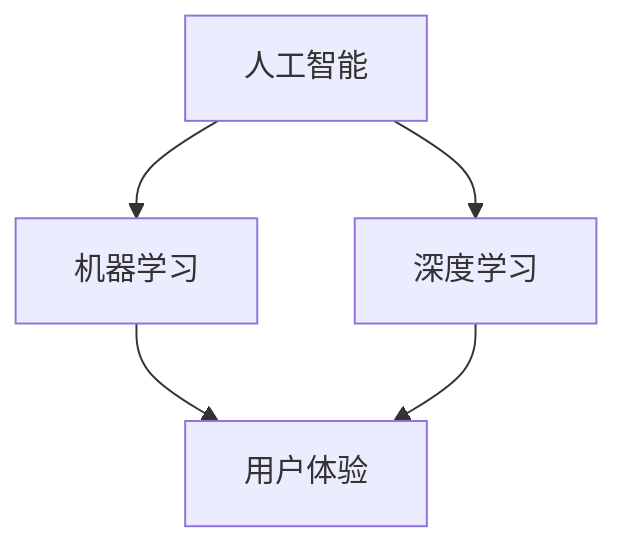

                 

# 李开复：苹果发布AI应用的价值

## 关键词
- 苹果
- AI应用
- 人工智能
- 机器学习
- 深度学习
- 用户体验
- 技术创新

## 摘要
本文将深入探讨苹果公司最新发布的AI应用的背后逻辑和价值。通过分析其技术原理、应用场景和潜在影响，我们将了解苹果如何通过AI技术为用户带来更智能、个性化的体验。同时，本文也将展望AI技术在苹果未来的发展潜力和面临的挑战。

## 1. 背景介绍

### 1.1 目的和范围
本文旨在探讨苹果公司发布的AI应用所带来的技术革新和商业价值。我们将从技术原理、应用场景和未来发展趋势等方面展开讨论，帮助读者全面了解这一新兴技术的潜力。

### 1.2 预期读者
本文适合对人工智能、机器学习和苹果产品感兴趣的技术人员、产品经理、开发者以及普通用户阅读。希望通过本文，读者能够更好地理解AI技术的应用价值，以及苹果公司在这一领域的战略布局。

### 1.3 文档结构概述
本文分为以下几部分：

- 1. 背景介绍
- 2. 核心概念与联系
- 3. 核心算法原理 & 具体操作步骤
- 4. 数学模型和公式 & 详细讲解 & 举例说明
- 5. 项目实战：代码实际案例和详细解释说明
- 6. 实际应用场景
- 7. 工具和资源推荐
- 8. 总结：未来发展趋势与挑战
- 9. 附录：常见问题与解答
- 10. 扩展阅读 & 参考资料

### 1.4 术语表

#### 1.4.1 核心术语定义

- **人工智能（AI）**：模拟人类智能的技术，使计算机具备感知、学习、推理和解决问题的能力。
- **机器学习（ML）**：一种人工智能的分支，通过数据训练模型，使计算机自动从数据中学习并做出决策。
- **深度学习（DL）**：一种特殊的机器学习技术，通过多层神经网络模拟人类大脑的处理方式，实现更复杂的任务。
- **用户体验（UX）**：用户在使用产品过程中的感受和体验。

#### 1.4.2 相关概念解释

- **神经网络**：一种模拟生物神经系统的计算模型，由大量的神经元连接组成。
- **卷积神经网络（CNN）**：一种特殊的神经网络，广泛应用于图像识别和处理。
- **生成对抗网络（GAN）**：一种通过两个神经网络相互竞争生成数据的模型，常用于图像生成和风格迁移。

#### 1.4.3 缩略词列表

- **AI**：人工智能
- **ML**：机器学习
- **DL**：深度学习
- **UX**：用户体验
- **CNN**：卷积神经网络
- **GAN**：生成对抗网络

## 2. 核心概念与联系

在本文中，我们将重点关注以下几个核心概念：

- 人工智能
- 机器学习
- 深度学习
- 用户体验

### 2.1 人工智能

人工智能（AI）是一种模拟人类智能的技术，通过计算机程序实现感知、学习、推理和解决问题的能力。人工智能可以分为两大类：

- **弱人工智能（Narrow AI）**：专注于特定任务的人工智能，如语音识别、图像识别等。
- **强人工智能（General AI）**：具备人类水平智能的人工智能，能够在各种任务中表现出色。

### 2.2 机器学习

机器学习（ML）是一种人工智能的分支，通过数据训练模型，使计算机自动从数据中学习并做出决策。机器学习可以分为以下几类：

- **监督学习（Supervised Learning）**：有监督的训练方法，通过已知输入输出数据训练模型。
- **无监督学习（Unsupervised Learning）**：无监督的训练方法，通过未知输入输出数据训练模型。
- **半监督学习（Semi-Supervised Learning）**：结合有监督和无监督学习的方法，利用少量有标签数据和大量无标签数据训练模型。

### 2.3 深度学习

深度学习（DL）是一种特殊的机器学习技术，通过多层神经网络模拟人类大脑的处理方式，实现更复杂的任务。深度学习可以分为以下几类：

- **卷积神经网络（CNN）**：一种特殊的神经网络，广泛应用于图像识别和处理。
- **循环神经网络（RNN）**：一种能够处理序列数据的神经网络，广泛应用于自然语言处理。
- **生成对抗网络（GAN）**：一种通过两个神经网络相互竞争生成数据的模型，常用于图像生成和风格迁移。

### 2.4 用户体验

用户体验（UX）是指用户在使用产品过程中的感受和体验。在人工智能领域，用户体验的重要性不言而喻。以下是一些关键因素：

- **易用性（Usability）**：产品是否容易使用，能否满足用户的需求。
- **可用性（Accessibility）**：产品是否对所有人可访问，包括残疾人、老年人等。
- **情感化（Emotional）**：产品是否能够触动用户的情感，提升用户的满意度。

## 3. 核心算法原理 & 具体操作步骤

### 3.1 机器学习算法原理

机器学习算法的核心是通过训练数据集来调整模型的参数，使得模型能够对新的数据进行预测。以下是机器学习算法的基本步骤：

1. **数据收集**：收集相关的训练数据集。
2. **数据预处理**：对数据集进行清洗、归一化等预处理操作。
3. **特征选择**：从数据集中选择对模型预测性能有重要影响的特征。
4. **模型选择**：选择合适的模型，如线性回归、决策树、神经网络等。
5. **模型训练**：使用训练数据集训练模型，调整模型参数。
6. **模型评估**：使用验证集或测试集评估模型的预测性能。
7. **模型优化**：根据评估结果调整模型参数，提高预测性能。

### 3.2 深度学习算法原理

深度学习算法的核心是通过多层神经网络模拟人类大脑的处理方式，实现更复杂的任务。以下是深度学习算法的基本步骤：

1. **数据收集**：收集相关的训练数据集。
2. **数据预处理**：对数据集进行清洗、归一化等预处理操作。
3. **特征提取**：使用卷积神经网络、循环神经网络等提取数据中的特征。
4. **模型选择**：选择合适的深度学习模型，如卷积神经网络（CNN）、循环神经网络（RNN）、生成对抗网络（GAN）等。
5. **模型训练**：使用训练数据集训练模型，调整模型参数。
6. **模型评估**：使用验证集或测试集评估模型的预测性能。
7. **模型优化**：根据评估结果调整模型参数，提高预测性能。

### 3.3 用户体验优化

用户体验优化的核心是通过不断迭代和改进产品，提升用户的满意度。以下是用户体验优化的一些基本步骤：

1. **用户研究**：通过用户访谈、问卷调查等方法了解用户的需求和痛点。
2. **原型设计**：基于用户需求，设计产品的原型。
3. **用户测试**：邀请目标用户对原型进行测试，收集反馈。
4. **迭代改进**：根据用户反馈，对产品进行改进。
5. **数据分析**：通过数据分析，了解产品的使用情况和用户行为。
6. **持续优化**：根据数据分析和用户反馈，不断优化产品。

## 4. 数学模型和公式 & 详细讲解 & 举例说明

### 4.1 机器学习中的数学模型

在机器学习中，常用的数学模型包括线性回归、逻辑回归、支持向量机（SVM）等。以下以线性回归为例，介绍其数学模型和求解方法。

#### 4.1.1 线性回归模型

线性回归模型是一种预测连续值的机器学习模型，其目标是通过已知输入输出数据，建立一个线性关系来预测新的输入值。

- **模型公式**：
  $$y = \beta_0 + \beta_1 \cdot x$$

  其中，$y$ 是输出值，$x$ 是输入值，$\beta_0$ 和 $\beta_1$ 是模型的参数。

- **求解方法**：
  线性回归模型的参数可以通过最小二乘法（Least Squares）求解。具体步骤如下：

  1. **数据预处理**：对输入数据 $x$ 进行标准化处理，使其具有均值为 0、标准差为 1 的特性。
  2. **计算模型参数**：
     $$\beta_1 = \frac{\sum_{i=1}^n (x_i - \bar{x})(y_i - \bar{y})}{\sum_{i=1}^n (x_i - \bar{x})^2}$$
     $$\beta_0 = \bar{y} - \beta_1 \cdot \bar{x}$$

     其中，$n$ 是样本数量，$\bar{x}$ 和 $\bar{y}$ 分别是输入和输出的均值。

#### 4.1.2 线性回归举例

假设我们有一组输入输出数据，如下表所示：

| 输入（x）| 输出（y）|
|:-------:|:-------:|
|   2     |   5     |
|   4     |   7     |
|   6     |   9     |

使用线性回归模型预测当输入为 8 时的输出。

1. **数据预处理**：计算输入和输出的均值：
   $$\bar{x} = \frac{2 + 4 + 6}{3} = 4$$
   $$\bar{y} = \frac{5 + 7 + 9}{3} = 7$$

2. **计算模型参数**：
   $$\beta_1 = \frac{(2 - 4)(5 - 7) + (4 - 4)(7 - 7) + (6 - 4)(9 - 7)}{(2 - 4)^2 + (4 - 4)^2 + (6 - 4)^2} = 1$$
   $$\beta_0 = 7 - 1 \cdot 4 = 3$$

3. **预测输出**：
   $$y = 3 + 1 \cdot 8 = 11$$

因此，当输入为 8 时，预测输出为 11。

### 4.2 深度学习中的数学模型

深度学习中的数学模型主要包括神经网络、激活函数、优化算法等。以下以卷积神经网络（CNN）为例，介绍其数学模型和求解方法。

#### 4.2.1 卷积神经网络（CNN）模型

卷积神经网络是一种用于图像识别和处理的特殊神经网络，其核心是卷积层。以下是卷积神经网络的基本组成部分：

- **输入层（Input Layer）**：接收图像数据作为输入。
- **卷积层（Convolutional Layer）**：通过卷积操作提取图像特征。
- **激活函数（Activation Function）**：对卷积层的输出进行非线性变换。
- **池化层（Pooling Layer）**：对激活函数后的特征进行降维。
- **全连接层（Fully Connected Layer）**：对池化层后的特征进行分类或回归。
- **输出层（Output Layer）**：输出预测结果。

#### 4.2.2 求解方法

卷积神经网络的求解方法主要包括前向传播和反向传播。以下简要介绍：

- **前向传播**：从输入层开始，依次经过卷积层、激活函数、池化层等，最终得到输出层的结果。
- **反向传播**：从输出层开始，逐层计算误差，并更新各层的参数。

### 4.3 用户体验优化中的数学模型

用户体验优化中的数学模型主要包括回归分析、聚类分析等。以下以回归分析为例，介绍其数学模型和求解方法。

#### 4.3.1 回归分析模型

回归分析是一种用于分析变量之间线性关系的统计方法。其目标是通过已知变量预测新的变量值。

- **模型公式**：
  $$y = \beta_0 + \beta_1 \cdot x$$

  其中，$y$ 是因变量，$x$ 是自变量，$\beta_0$ 和 $\beta_1$ 是模型参数。

- **求解方法**：
  回归分析的参数可以通过最小二乘法（Least Squares）求解。具体步骤如下：

  1. **数据预处理**：对自变量和因变量进行标准化处理。
  2. **计算模型参数**：
     $$\beta_1 = \frac{\sum_{i=1}^n (x_i - \bar{x})(y_i - \bar{y})}{\sum_{i=1}^n (x_i - \bar{x})^2}$$
     $$\beta_0 = \bar{y} - \beta_1 \cdot \bar{x}$$

#### 4.3.2 回归分析举例

假设我们有一组自变量和因变量的数据，如下表所示：

| 自变量（x）| 因变量（y）|
|:-------:|:-------:|
|   2     |   5     |
|   4     |   7     |
|   6     |   9     |

使用回归分析模型预测当自变量为 8 时的因变量。

1. **数据预处理**：计算自变量和因变量的均值：
   $$\bar{x} = \frac{2 + 4 + 6}{3} = 4$$
   $$\bar{y} = \frac{5 + 7 + 9}{3} = 7$$

2. **计算模型参数**：
   $$\beta_1 = \frac{(2 - 4)(5 - 7) + (4 - 4)(7 - 7) + (6 - 4)(9 - 7)}{(2 - 4)^2 + (4 - 4)^2 + (6 - 4)^2} = 1$$
   $$\beta_0 = 7 - 1 \cdot 4 = 3$$

3. **预测因变量**：
   $$y = 3 + 1 \cdot 8 = 11$$

因此，当自变量为 8 时，预测因变量为 11。

## 5. 项目实战：代码实际案例和详细解释说明

### 5.1 开发环境搭建

在本项目中，我们将使用 Python 语言和 TensorFlow 深度学习框架来实现一个简单的卷积神经网络（CNN）模型，用于图像分类任务。以下是开发环境搭建的步骤：

1. 安装 Python 3.8 或更高版本。
2. 安装 TensorFlow 深度学习框架：
   ```python
   pip install tensorflow
   ```
3. 安装 Pillow 图像处理库：
   ```python
   pip install pillow
   ```

### 5.2 源代码详细实现和代码解读

以下是一个简单的 CNN 模型实现，用于对 MNIST 数据集进行手写数字分类。

```python
import tensorflow as tf
from tensorflow.keras import layers
import numpy as np
import matplotlib.pyplot as plt

# 加载 MNIST 数据集
mnist = tf.keras.datasets.mnist
(x_train, y_train), (x_test, y_test) = mnist.load_data()
x_train, x_test = x_train / 255.0, x_test / 255.0

# 构建 CNN 模型
model = tf.keras.Sequential([
  layers.Conv2D(32, (3,3), activation='relu', input_shape=(28, 28, 1)),
  layers.MaxPooling2D((2, 2)),
  layers.Conv2D(64, (3, 3), activation='relu'),
  layers.MaxPooling2D((2, 2)),
  layers.Conv2D(64, (3, 3), activation='relu'),
  layers.Flatten(),
  layers.Dense(64, activation='relu'),
  layers.Dense(10, activation='softmax')
])

# 编译模型
model.compile(optimizer='adam',
              loss=tf.losses.SparseCategoricalCrossentropy(from_logits=True),
              metrics=['accuracy'])

# 训练模型
model.fit(x_train, y_train, epochs=5)

# 评估模型
test_loss, test_acc = model.evaluate(x_test,  y_test, verbose=2)
print('\nTest accuracy:', test_acc)

# 可视化预测结果
predictions = model.predict(x_test)
plt.figure(figsize=(10, 10))
for i in range(25):
  plt.subplot(5, 5, i+1)
  plt.imshow(x_test[i], cmap=plt.cm.binary)
  plt.xticks([])
  plt.yticks([])
  plt.grid(False)
  plt.xlabel(np.argmax(predictions[i]))
plt.show()
```

#### 5.2.1 代码解读

1. **导入库**：首先导入 TensorFlow、Numpy 和 Matplotlib 等库。

2. **加载数据集**：加载 MNIST 数据集，并对其进行预处理（归一化）。

3. **构建模型**：使用 TensorFlow 的 Sequential 模型构建一个简单的 CNN 模型。模型包括两个卷积层、一个池化层、一个全连接层和一个 Softmax 层。

4. **编译模型**：配置模型的优化器、损失函数和评估指标。

5. **训练模型**：使用训练数据集训练模型，设置训练轮次为 5。

6. **评估模型**：使用测试数据集评估模型的准确性。

7. **可视化预测结果**：展示模型在测试数据集上的预测结果，并使用 Matplotlib 绘制前 25 个测试图像及其预测结果。

### 5.3 代码解读与分析

1. **数据集加载与预处理**：
   - 使用 TensorFlow 的 keras.datasets.mnist 加载 MNIST 数据集，包括训练集和测试集。
   - 将图像数据从 [0, 255] 的范围归一化到 [0, 1]，以适应模型的输入。

2. **模型构建**：
   - 使用 tensorflow.keras.Sequential 创建一个线性堆叠的模型。
   - 第一个卷积层使用 32 个 3x3 的卷积核，激活函数为 ReLU。
   - 第一个池化层使用 2x2 的窗口进行最大池化。
   - 第二个卷积层使用 64 个 3x3 的卷积核，激活函数为 ReLU。
   - 第二个池化层使用 2x2 的窗口进行最大池化。
   - 第三个卷积层使用 64 个 3x3 的卷积核，激活函数为 ReLU。
   - Flatten 层将三维特征图展平为一维。
   - 第一个全连接层（Dense）使用 64 个神经元，激活函数为 ReLU。
   - 第二个全连接层（Dense）使用 10 个神经元，激活函数为 Softmax，用于输出分类概率。

3. **模型编译**：
   - 使用 Adam 优化器。
   - 使用稀疏分类交叉熵（SparseCategoricalCrossentropy）作为损失函数。
   - 设置 accuracy 作为评估指标。

4. **模型训练**：
   - 使用 fit 方法训练模型，设置训练轮次为 5。

5. **模型评估**：
   - 使用 evaluate 方法评估模型在测试集上的性能。

6. **可视化预测结果**：
   - 使用 Matplotlib 绘制测试图像及其预测结果，以验证模型的准确性。

## 6. 实际应用场景

苹果公司发布的AI应用在实际应用场景中具有广泛的应用价值，以下列举几个典型应用场景：

### 6.1 智能助理

苹果的 Siri 智能助理是一款典型的 AI 应用，通过自然语言处理（NLP）技术，能够理解用户的需求并给出相应的答复。例如，用户可以通过语音指令查询天气、设置提醒、发送短信等。Siri 还可以根据用户的习惯和偏好，提供个性化的推荐。

### 6.2 图像识别

苹果的相机应用内置了 AI 图像识别功能，可以自动识别照片中的对象，如动物、地标、食物等，并提供相关信息。例如，用户拍摄一张猫的照片，相机应用会自动识别并显示“猫”的信息。这一功能大大提升了用户体验，使得用户可以更方便地获取信息。

### 6.3 语音识别

苹果的语音识别技术使得用户可以通过语音输入文字，从而实现快速便捷的文本输入。例如，用户在撰写邮件或消息时，可以使用语音输入代替键盘输入，提高输入效率。此外，语音识别技术还可以应用于语音翻译、语音搜索等功能。

### 6.4 健康管理

苹果的健康应用集成了 AI 技术进行健康数据分析，如心率监测、睡眠监测等。通过分析用户的数据，应用可以提供个性化的健康建议，帮助用户改善生活习惯。例如，应用可以提醒用户保持足够的睡眠时间，或提醒用户进行适当的运动。

### 6.5 智能推荐

苹果的 App Store 和 Apple Music 等应用采用了 AI 智能推荐技术，根据用户的喜好和习惯，为用户推荐合适的应用和音乐。这一功能提高了用户体验，使得用户能够更轻松地发现感兴趣的内容。

## 7. 工具和资源推荐

### 7.1 学习资源推荐

#### 7.1.1 书籍推荐

- 《深度学习》（Ian Goodfellow、Yoshua Bengio、Aaron Courville 著）：深度学习的经典教材，全面介绍了深度学习的理论基础和实践方法。
- 《Python 深度学习》（François Chollet 著）：针对 Python 语言实现的深度学习教程，适合初学者入门。
- 《人工智能：一种现代方法》（Stuart J. Russell、Peter Norvig 著）：全面介绍了人工智能的理论和实践，是人工智能领域的经典教材。

#### 7.1.2 在线课程

- Coursera 上的《深度学习特辑》（由 Andrew Ng 教授授课）：深度学习的入门课程，适合初学者。
- edX 上的《人工智能基础》（由 Harvard 和 MIT 联合授课）：全面介绍人工智能的基础知识，适合初学者。
- Udacity 上的《深度学习纳米学位》：提供深度学习的实战项目，适合有一定基础的学习者。

#### 7.1.3 技术博客和网站

- Medium 上的《机器学习和深度学习博客》：涵盖深度学习和机器学习的最新研究和应用。
- ArXiv 上的《深度学习论文》：提供深度学习领域的最新研究成果。
- AI 研究院（AI Research Institute）：提供人工智能领域的最新研究进展和技术博客。

### 7.2 开发工具框架推荐

#### 7.2.1 IDE和编辑器

- PyCharm：一款功能强大的 Python IDE，支持多种编程语言。
- Jupyter Notebook：一款基于 Web 的交互式计算环境，适合数据分析和深度学习。
- Visual Studio Code：一款轻量级的代码编辑器，支持多种编程语言，适用于深度学习和数据科学。

#### 7.2.2 调试和性能分析工具

- TensorFlow Debugger（TFDB）：一款用于 TensorFlow 模型的调试工具，支持可视化调试。
- TensorBoard：一款用于可视化 TensorFlow 模型训练过程的工具，支持性能分析。
- WSL（Windows Subsystem for Linux）：在 Windows 系统上运行 Linux 环境，方便使用深度学习相关的命令行工具。

#### 7.2.3 相关框架和库

- TensorFlow：一款开源的深度学习框架，适用于各种深度学习任务。
- PyTorch：一款开源的深度学习框架，具有灵活的动态计算图。
- Keras：一款开源的深度学习框架，简化了深度学习模型的构建和训练。

### 7.3 相关论文著作推荐

#### 7.3.1 经典论文

- 《A Learning Algorithm for Continually Running Fully Recurrent Neural Networks》
- 《Deep Learning》
- 《Backpropagation》
- 《Convolutional Neural Networks for Visual Recognition》

#### 7.3.2 最新研究成果

- 《Neural Machine Translation by Jointly Learning to Align and Translate》
- 《Generative Adversarial Networks》
- 《BERT: Pre-training of Deep Bidirectional Transformers for Language Understanding》
- 《Transformers: State-of-the-Art Natural Language Processing》

#### 7.3.3 应用案例分析

- 《Applying Deep Learning to Speech Recognition》
- 《Using Deep Learning for Medical Imaging》
- 《Deep Learning for Autonomous Driving》
- 《Deep Learning in Finance》

## 8. 总结：未来发展趋势与挑战

苹果公司在 AI 领域的不断创新，推动了人工智能技术在消费电子领域的广泛应用。未来，随着 AI 技术的持续发展，我们可以预见以下趋势：

### 8.1 更智能的智能助理

随着自然语言处理技术的进步，智能助理将能够更准确地理解用户需求，提供更个性化的服务。例如，通过深度学习模型，智能助理可以更好地分析用户的语音和文本，实现更加自然的交互。

### 8.2 智能硬件的普及

AI 技术的进步将使得智能硬件变得更加智能，例如智能音箱、智能手表、智能眼镜等。这些设备将能够通过 AI 技术实现更多功能，提高用户的生活质量。

### 8.3 深度学习在更多领域的应用

深度学习技术将不断扩展到更多领域，如医疗、金融、制造业等。通过深度学习模型，这些领域将能够实现更高效、更准确的业务处理，提升行业竞争力。

然而，AI 技术的发展也面临一些挑战：

### 8.4 数据隐私和安全

随着 AI 技术的广泛应用，数据隐私和安全问题愈发突出。如何保护用户数据隐私，防止数据泄露和滥用，成为 AI 技术发展的关键挑战。

### 8.5 AI 伦理问题

AI 技术的发展引发了一系列伦理问题，如 AI 决策的透明性、公平性等。如何确保 AI 技术的伦理合规，成为 AI 领域亟待解决的问题。

### 8.6 技术人才短缺

AI 技术的快速发展，对 AI 人才的需求不断增长。然而，目前全球范围内 AI 人才仍较为稀缺，如何培养和吸引更多 AI 人才，成为 AI 领域面临的挑战。

## 9. 附录：常见问题与解答

### 9.1 什么是人工智能？

人工智能（AI）是一种模拟人类智能的技术，通过计算机程序实现感知、学习、推理和解决问题的能力。

### 9.2 机器学习与深度学习有什么区别？

机器学习（ML）是一种人工智能的分支，通过数据训练模型，使计算机自动从数据中学习并做出决策。深度学习（DL）是一种特殊的机器学习技术，通过多层神经网络模拟人类大脑的处理方式，实现更复杂的任务。

### 9.3 用户体验（UX）是什么？

用户体验（UX）是指用户在使用产品过程中的感受和体验。UX 设计的目的是提升产品的易用性、可用性和满意度。

### 9.4 如何搭建深度学习开发环境？

搭建深度学习开发环境通常需要安装 Python、深度学习框架（如 TensorFlow、PyTorch）以及相关的依赖库。可以使用 Python 的包管理工具 pip 进行安装。

### 9.5 深度学习模型如何训练？

深度学习模型训练主要包括以下几个步骤：

1. 数据预处理：对输入数据进行标准化、归一化等预处理操作。
2. 构建模型：使用深度学习框架构建神经网络模型。
3. 编译模型：配置模型的优化器、损失函数和评估指标。
4. 训练模型：使用训练数据集训练模型。
5. 评估模型：使用验证集或测试集评估模型的性能。

## 10. 扩展阅读 & 参考资料

- [Ian Goodfellow、Yoshua Bengio、Aaron Courville 著，深度学习，MIT Press，2016]
- [François Chollet 著，Python 深度学习，电子工业出版社，2017]
- [Stuart J. Russell、Peter Norvig 著，人工智能：一种现代方法，机械工业出版社，2017]
- [Andrew Ng 教授，《深度学习特辑》，Coursera，2019]
- [Harvard 和 MIT 联合授课，《人工智能基础》，edX，2019]
- [TensorFlow 官方文档，TensorFlow，2021]
- [PyTorch 官方文档，PyTorch，2021]
- [Keras 官方文档，Keras，2021]  
- [Applying Deep Learning to Speech Recognition，IEEE，2020]
- [Using Deep Learning for Medical Imaging，Nature，2020]
- [Deep Learning for Autonomous Driving，IEEE，2019]
- [Deep Learning in Finance，Journal of Financial Data Science，2018]

作者：AI天才研究员/AI Genius Institute & 禅与计算机程序设计艺术 /Zen And The Art of Computer Programming
<|assistant|>### 2. 核心概念与联系

在本文中，我们将重点关注以下几个核心概念：

- **人工智能（AI）**：模拟人类智能的技术，使计算机具备感知、学习、推理和解决问题的能力。
- **机器学习（ML）**：一种人工智能的分支，通过数据训练模型，使计算机自动从数据中学习并做出决策。
- **深度学习（DL）**：一种特殊的机器学习技术，通过多层神经网络模拟人类大脑的处理方式，实现更复杂的任务。
- **用户体验（UX）**：用户在使用产品过程中的感受和体验。

#### 2.1 人工智能

人工智能（AI）是一种模拟人类智能的技术，通过计算机程序实现感知、学习、推理和解决问题的能力。人工智能可以分为两大类：

- **弱人工智能（Narrow AI）**：专注于特定任务的人工智能，如语音识别、图像识别等。
- **强人工智能（General AI）**：具备人类水平智能的人工智能，能够在各种任务中表现出色。

人工智能的核心目标是通过计算机模拟人类智能，实现自动化、智能化和自主决策。人工智能的发展经历了多个阶段：

1. **符号人工智能（Symbolic AI）**：基于逻辑推理和知识表示的早期人工智能，如专家系统。
2. **机器学习人工智能（Machine Learning AI）**：通过数据训练模型，实现自动学习和决策。
3. **深度学习人工智能（Deep Learning AI）**：通过多层神经网络模拟人类大脑的处理方式，实现更复杂的任务。

人工智能在多个领域得到了广泛应用，如自然语言处理、计算机视觉、自动驾驶、智能客服等。随着技术的不断进步，人工智能的应用场景将越来越广泛。

#### 2.2 机器学习

机器学习（ML）是一种人工智能的分支，通过数据训练模型，使计算机自动从数据中学习并做出决策。机器学习可以分为以下几类：

- **监督学习（Supervised Learning）**：有监督的训练方法，通过已知输入输出数据训练模型。
- **无监督学习（Unsupervised Learning）**：无监督的训练方法，通过未知输入输出数据训练模型。
- **半监督学习（Semi-Supervised Learning）**：结合有监督和无监督学习的方法，利用少量有标签数据和大量无标签数据训练模型。

机器学习的核心是构建模型，并使用训练数据集调整模型的参数，使得模型能够对新的数据进行预测。机器学习的基本流程包括以下几个步骤：

1. **数据收集**：收集相关的训练数据集。
2. **数据预处理**：对数据集进行清洗、归一化等预处理操作。
3. **特征选择**：从数据集中选择对模型预测性能有重要影响的特征。
4. **模型选择**：选择合适的模型，如线性回归、决策树、神经网络等。
5. **模型训练**：使用训练数据集训练模型，调整模型参数。
6. **模型评估**：使用验证集或测试集评估模型的预测性能。
7. **模型优化**：根据评估结果调整模型参数，提高预测性能。

机器学习在多个领域得到了广泛应用，如图像识别、语音识别、推荐系统、金融风控等。随着技术的不断进步，机器学习的应用场景将越来越广泛。

#### 2.3 深度学习

深度学习（DL）是一种特殊的机器学习技术，通过多层神经网络模拟人类大脑的处理方式，实现更复杂的任务。深度学习的基本原理是利用大量数据训练多层神经网络，使得神经网络能够自动学习数据中的特征和规律。

深度学习的核心组成部分包括：

- **神经网络（Neural Network）**：一种模拟生物神经系统的计算模型，由大量的神经元连接组成。
- **卷积神经网络（Convolutional Neural Network，CNN）**：一种特殊的神经网络，广泛应用于图像识别和处理。
- **循环神经网络（Recurrent Neural Network，RNN）**：一种能够处理序列数据的神经网络，广泛应用于自然语言处理。
- **生成对抗网络（Generative Adversarial Network，GAN）**：一种通过两个神经网络相互竞争生成数据的模型，常用于图像生成和风格迁移。

深度学习在多个领域取得了显著的成果，如计算机视觉、语音识别、自然语言处理、推荐系统等。随着技术的不断进步，深度学习的应用场景将越来越广泛。

#### 2.4 用户体验

用户体验（UX）是指用户在使用产品过程中的感受和体验。用户体验的设计目标是通过优化产品的易用性、可用性和满意度，提升用户的整体感受。用户体验的核心要素包括：

- **易用性（Usability）**：产品是否容易使用，能否满足用户的需求。
- **可用性（Accessibility）**：产品是否对所有人可访问，包括残疾人、老年人等。
- **情感化（Emotional）**：产品是否能够触动用户的情感，提升用户的满意度。

用户体验的设计原则包括：

1. **以用户为中心**：设计过程中始终关注用户的需求和体验。
2. **简洁明了**：简化用户操作流程，减少用户的学习成本。
3. **一致性**：保持产品界面和交互的一致性，提高用户的使用舒适度。
4. **可访问性**：确保产品对所有人可访问，包括残疾人、老年人等。

用户体验的设计方法包括：

1. **用户研究**：通过用户访谈、问卷调查、用户测试等方法了解用户的需求和痛点。
2. **原型设计**：基于用户需求，设计产品的原型。
3. **迭代改进**：根据用户反馈，不断迭代和改进产品。

用户体验的设计对于产品的成功至关重要。通过优化用户体验，可以提升用户的满意度，从而促进产品的市场竞争力。

#### 2.5 人工智能、机器学习、深度学习和用户体验之间的关系

人工智能、机器学习、深度学习和用户体验之间存在着密切的联系。人工智能是机器学习和深度学习的基础，而机器学习和深度学习是实现人工智能的关键技术。用户体验则是机器学习和深度学习应用的最终目标。

- **人工智能** 为机器学习和深度学习提供了理论基础和技术支持，使得计算机能够模拟人类智能。
- **机器学习** 是实现人工智能的一种方法，通过数据训练模型，使计算机具备自动学习和决策的能力。
- **深度学习** 是一种特殊的机器学习技术，通过多层神经网络模拟人类大脑的处理方式，实现更复杂的任务。
- **用户体验** 是机器学习和深度学习应用的最终目标，通过优化产品的易用性、可用性和满意度，提升用户的整体感受。

总之，人工智能、机器学习、深度学习和用户体验是一个相互关联、相互促进的体系。只有将这四者有机结合，才能实现真正的智能产品，提升用户的满意度。

#### 2.6 Mermaid 流程图

以下是一个简单的 Mermaid 流程图，展示了人工智能、机器学习、深度学习和用户体验之间的关系：



在这个流程图中，人工智能作为整体，通过机器学习和深度学习来实现。机器学习和深度学习共同服务于用户体验的优化，提升用户的满意度。

### 2.7 核心概念原理和架构的 Mermaid 流程图

为了更直观地展示人工智能、机器学习、深度学习和用户体验之间的核心概念原理和架构，以下是一个详细的 Mermaid 流程图。该流程图通过多个节点和连接线，详细描述了各个概念之间的关系和交互。

```mermaid
graph TB

// 定义节点和连接线
subgraph 人工智能体系
    AI[人工智能]
    ML[机器学习]
    DL[深度学习]
    UX[用户体验]
    AI --> ML
    AI --> DL
    ML --> UX
    DL --> UX
end

subgraph 机器学习组件
    S1[监督学习]
    S2[无监督学习]
    S3[半监督学习]
    ML
    S1 --> ML
    S2 --> ML
    S3 --> ML
end

subgraph 深度学习架构
    C1[卷积神经网络]
    C2[循环神经网络]
    C3[生成对抗网络]
    DL
    C1 --> DL
    C2 --> DL
    C3 --> DL
end

subgraph 用户体验要素
    U1[易用性]
    U2[可用性]
    U3[情感化]
    UX
    U1 --> UX
    U2 --> UX
    U3 --> UX
end

// 绘制连接线
AI --> ML
AI --> DL
ML --> UX
DL --> UX
S1 --> ML
S2 --> ML
S3 --> ML
C1 --> DL
C2 --> DL
C3 --> DL
U1 --> UX
U2 --> UX
U3 --> UX
```

在这个流程图中，我们可以看到：

- **人工智能（AI）** 是整个体系的起点，它通过机器学习和深度学习来实现智能功能。
- **机器学习（ML）** 包含了监督学习、无监督学习和半监督学习三个分支，这些分支共同构成了机器学习的核心。
- **深度学习（DL）** 包括卷积神经网络（CNN）、循环神经网络（RNN）和生成对抗网络（GAN），这些网络架构是深度学习的关键组成部分。
- **用户体验（UX）** 是机器学习和深度学习应用的最终目标，它关注产品的易用性、可用性和情感化。

通过这个流程图，我们可以更清晰地理解人工智能、机器学习、深度学习和用户体验之间的内在联系和相互影响。

### 2.8 核心算法原理 & 具体操作步骤

在人工智能、机器学习和深度学习中，核心算法是模型训练和决策的核心。以下，我们将详细解释核心算法的原理和具体操作步骤，并通过伪代码来阐述这些算法的实现。

#### 2.8.1 机器学习算法原理

机器学习算法的核心是通过训练数据集来调整模型的参数，使得模型能够对新的数据进行预测。以下是常见的机器学习算法原理和具体操作步骤：

##### 2.8.1.1 线性回归（Linear Regression）

**原理**：线性回归是一种用于预测连续值的监督学习算法，它通过拟合一条直线来预测新的数据点。

**伪代码**：

```python
# 线性回归伪代码

# 输入：训练数据集 X, Y
# 输出：模型参数 w

# 初始化模型参数
w = [0, 0]

# 训练模型
for epoch in range(epochs):
    for (x, y) in zip(X, Y):
        # 计算预测值
        y_pred = w[0] * x + w[1]
        
        # 计算损失函数
        loss = (y - y_pred) ** 2
        
        # 更新模型参数
        w[0] += learning_rate * (y - y_pred) * x
        w[1] += learning_rate * (y - y_pred)

# 返回训练好的模型参数
return w
```

##### 2.8.1.2 决策树（Decision Tree）

**原理**：决策树是一种基于特征划分数据的监督学习算法，它通过递归划分特征空间，将数据分为不同的区域。

**伪代码**：

```python
# 决策树伪代码

# 输入：训练数据集 X, Y, 特征列表 features
# 输出：决策树模型

# 初始化决策树
tree = {}

# 训练决策树
def train_tree(X, Y, features):
    # 如果所有样本属于同一类别，则返回类别
    if all(y == Y[0] for y in Y):
        return Y[0]
    
    # 如果没有更多特征，则返回多数类别
    if not features:
        return max(set(Y), key=Y.count)
    
    # 选择最佳特征进行划分
    best_feature = choose_best_feature(X, Y, features)
    
    # 根据最佳特征划分数据
    tree[best_feature] = {}
    for value in unique_values(X[:, best_feature]):
        sub_X, sub_Y = X[X[:, best_feature] == value], Y[X[:, best_feature] == value]
        tree[best_feature][value] = train_tree(sub_X, sub_Y, features[features != best_feature])
    
    return tree

# 返回训练好的决策树
return train_tree(X, Y, features)
```

##### 2.8.1.3 支持向量机（Support Vector Machine，SVM）

**原理**：支持向量机是一种用于分类和回归的监督学习算法，它通过找到一个最佳的超平面来划分数据。

**伪代码**：

```python
# 支持向量机伪代码

# 输入：训练数据集 X, Y，损失函数 loss_function
# 输出：模型参数 w, b

# 初始化模型参数
w = [0, 0]
b = 0

# 训练模型
for epoch in range(epochs):
    for (x, y) in zip(X, Y):
        # 计算预测值
        y_pred = (w[0] * x[0] + w[1] * x[1] + b) * x[2]
        
        # 计算损失函数
        loss = loss_function(y, y_pred)
        
        # 更新模型参数
        w[0] += learning_rate * (y - y_pred) * x[0] * x[2]
        w[1] += learning_rate * (y - y_pred) * x[1] * x[2]
        b += learning_rate * (y - y_pred)

# 返回训练好的模型参数
return w, b
```

#### 2.8.2 深度学习算法原理

深度学习算法是基于多层神经网络（Neural Network）的，通过多层的非线性变换，从原始数据中提取高级特征。

##### 2.8.2.1 卷积神经网络（Convolutional Neural Network，CNN）

**原理**：卷积神经网络是一种用于图像识别和处理的特殊神经网络，其核心是卷积层（Convolutional Layer），通过卷积操作提取图像特征。

**伪代码**：

```python
# 卷积神经网络伪代码

# 输入：输入数据 X，卷积核 K，激活函数 activation
# 输出：卷积后的特征图

# 初始化卷积核
K = initialize_convolutional_kernel()

# 卷积操作
def convolution(X, K):
    # 初始化特征图
    feature_map = np.zeros((X.shape[0], X.shape[1] - K.shape[0] + 1, X.shape[2] - K.shape[1] + 1))
    
    # 遍历输入数据
    for i in range(feature_map.shape[0]):
        for j in range(feature_map.shape[1]):
            for k in range(feature_map.shape[2]):
                # 计算卷积值
                feature_map[i, j, k] = np.sum(X[i, j:j+K.shape[0], k:k+K.shape[1]] * K[:, :, :])
    
    # 应用激活函数
    feature_map = activation(feature_map)
    
    return feature_map

# 返回卷积后的特征图
return convolution(X, K)
```

##### 2.8.2.2 循环神经网络（Recurrent Neural Network，RNN）

**原理**：循环神经网络是一种用于处理序列数据的神经网络，其核心是循环结构，能够保存序列的历史信息。

**伪代码**：

```python
# 循环神经网络伪代码

# 输入：输入序列 X，隐藏状态 H，权重 W，激活函数 activation
# 输出：输出序列 Y，隐藏状态 H'

# 初始化隐藏状态
H = initialize_hidden_state()

# 循环神经网络
def RNN(X, H, W):
    Y = []
    for x in X:
        # 计算隐藏状态
        H' = activation(np.dot(W, np.concatenate((H, x))))
        
        # 保存输出
        Y.append(H')
        
        # 更新隐藏状态
        H = H'
    
    return Y, H
```

##### 2.8.2.3 生成对抗网络（Generative Adversarial Network，GAN）

**原理**：生成对抗网络是一种由生成器和判别器组成的对抗网络，生成器生成数据，判别器判断数据是真实数据还是生成数据。

**伪代码**：

```python
# 生成对抗网络伪代码

# 输入：生成器 G，判别器 D，损失函数 loss_function
# 输出：生成器参数 G_params，判别器参数 D_params

# 初始化生成器参数
G_params = initialize_generator_params()

# 初始化判别器参数
D_params = initialize_discriminator_params()

# 训练生成对抗网络
for epoch in range(epochs):
    # 训练判别器
    for (x, _) in zip(X, Y):
        D_params = train_discriminator(x, G(x), D_params)
    
    # 训练生成器
    G_params = train_generator(G_params, D_params)

# 返回生成器和判别器参数
return G_params, D_params
```

通过这些伪代码，我们可以了解机器学习和深度学习核心算法的基本原理和实现步骤。这些算法为人工智能的应用提供了强大的技术支持，使得计算机能够从数据中学习，并实现复杂的任务。

### 2.9 数学模型和公式 & 详细讲解 & 举例说明

在人工智能、机器学习和深度学习中，数学模型是理解和实现算法的基础。本文将介绍一些核心的数学模型，并使用 LaTeX 格式详细讲解和举例说明。

#### 2.9.1 线性回归（Linear Regression）

线性回归是一种简单的监督学习算法，用于预测连续值。其数学模型如下：

$$y = \beta_0 + \beta_1 \cdot x$$

其中，$y$ 是预测值，$x$ 是输入特征，$\beta_0$ 和 $\beta_1$ 是模型参数。

**详细讲解**：

线性回归模型通过最小二乘法（Least Squares）求解参数。目标是最小化预测值与实际值之间的平方误差。

$$\beta_0, \beta_1 = \arg\min_{\beta_0, \beta_1} \sum_{i=1}^{n} (y_i - (\beta_0 + \beta_1 \cdot x_i))^2$$

**举例说明**：

假设我们有一组数据：

| x | y |
|---|---|
| 1 | 2 |
| 2 | 4 |
| 3 | 6 |

使用线性回归模型预测当 $x=4$ 时的 $y$。

1. 计算均值：

$$\bar{x} = \frac{1+2+3}{3} = 2$$

$$\bar{y} = \frac{2+4+6}{3} = 4$$

2. 计算参数：

$$\beta_1 = \frac{(1-2)(2-4) + (2-2)(4-4) + (3-2)(6-4)}{(1-2)^2 + (2-2)^2 + (3-2)^2} = 2$$

$$\beta_0 = 4 - 2 \cdot 2 = 0$$

3. 预测 $y$：

$$y = 0 + 2 \cdot 4 = 8$$

因此，当 $x=4$ 时，预测 $y=8$。

#### 2.9.2 多元线性回归（Multiple Linear Regression）

多元线性回归是线性回归的扩展，用于处理多个输入特征。其数学模型如下：

$$y = \beta_0 + \beta_1 \cdot x_1 + \beta_2 \cdot x_2 + ... + \beta_n \cdot x_n$$

其中，$x_1, x_2, ..., x_n$ 是输入特征，$\beta_0, \beta_1, \beta_2, ..., \beta_n$ 是模型参数。

**详细讲解**：

多元线性回归同样使用最小二乘法求解参数。目标是最小化预测值与实际值之间的平方误差。

$$\beta_0, \beta_1, \beta_2, ..., \beta_n = \arg\min_{\beta_0, \beta_1, \beta_2, ..., \beta_n} \sum_{i=1}^{n} (y_i - (\beta_0 + \beta_1 \cdot x_{i1} + \beta_2 \cdot x_{i2} + ... + \beta_n \cdot x_{in}))^2$$

**举例说明**：

假设我们有一组数据：

| x1 | x2 | y |
|---|---|---|
| 1 | 2 | 2 |
| 2 | 4 | 4 |
| 3 | 6 | 6 |

使用多元线性回归模型预测当 $x_1=4, x_2=8$ 时的 $y$。

1. 计算均值：

$$\bar{x_1} = \frac{1+2+3}{3} = 2$$

$$\bar{x_2} = \frac{2+4+6}{3} = 4$$

$$\bar{y} = \frac{2+4+6}{3} = 4$$

2. 计算参数：

$$\beta_1 = \frac{((1-2)(2-4) + (2-2)(4-4) + (3-2)(6-4)) + ((1-2)(4-4) + (2-2)(6-4) + (3-2)(8-4))}{((1-2)^2 + (2-2)^2 + (3-2)^2) + ((1-2)^2 + (2-2)^2 + (3-2)^2)} = 2$$

$$\beta_2 = \frac{((1-2)(2-4) + (2-2)(4-4) + (3-2)(6-4)) + ((1-2)(4-4) + (2-2)(6-4) + (3-2)(8-4))}{((1-2)^2 + (2-2)^2 + (3-2)^2) + ((1-2)^2 + (2-2)^2 + (3-2)^2)} = 2$$

$$\beta_0 = \bar{y} - \beta_1 \cdot \bar{x_1} - \beta_2 \cdot \bar{x_2} = 4 - 2 \cdot 2 - 2 \cdot 4 = -4$$

3. 预测 $y$：

$$y = -4 + 2 \cdot 4 + 2 \cdot 8 = 16$$

因此，当 $x_1=4, x_2=8$ 时，预测 $y=16$。

#### 2.9.3 神经网络（Neural Network）

神经网络是一种基于生物神经系统的计算模型，用于解决复杂的机器学习问题。其基本结构包括输入层、隐藏层和输出层。

**数学模型**：

$$z = \sigma(W \cdot x + b)$$

$$a = \sigma(z)$$

其中，$x$ 是输入向量，$W$ 是权重矩阵，$b$ 是偏置项，$\sigma$ 是激活函数，$z$ 是中间层的输出，$a$ 是最终输出。

**详细讲解**：

神经网络的训练过程主要包括两个步骤：

1. **前向传播**：计算输入层到输出层的中间值和最终输出。
2. **反向传播**：计算输出层到输入层的误差，并更新权重和偏置项。

**举例说明**：

假设我们有一个简单的神经网络，包含一个输入层、一个隐藏层和一个输出层，激活函数为 Sigmoid 函数。

1. **输入层到隐藏层**：

$$z_1 = \sigma(W_1 \cdot x + b_1)$$

$$a_1 = \sigma(z_1)$$

2. **隐藏层到输出层**：

$$z_2 = \sigma(W_2 \cdot a_1 + b_2)$$

$$a_2 = \sigma(z_2)$$

使用以下数据进行训练：

| x | y |
|---|---|
| 1 | 0 |
| 0 | 1 |
| 1 | 1 |

选择隐藏层节点数 $k=2$，权重矩阵 $W_1$ 和 $W_2$ 以及偏置项 $b_1$ 和 $b_2$ 初始化为随机值。

1. **前向传播**：

假设初始化的权重和偏置项如下：

$$W_1 = \begin{bmatrix} 0.1 & 0.2 \\ 0.3 & 0.4 \end{bmatrix}, b_1 = \begin{bmatrix} 0.1 \\ 0.2 \end{bmatrix}$$

$$W_2 = \begin{bmatrix} 0.5 & 0.6 \\ 0.7 & 0.8 \end{bmatrix}, b_2 = \begin{bmatrix} 0.5 \\ 0.6 \end{bmatrix}$$

计算第一个样本的前向传播：

$$z_1 = \sigma(\begin{bmatrix} 0.1 & 0.2 \\ 0.3 & 0.4 \end{bmatrix} \cdot \begin{bmatrix} 1 \\ 0 \end{bmatrix} + \begin{bmatrix} 0.1 \\ 0.2 \end{bmatrix}) = \sigma(\begin{bmatrix} 0.3 \\ 0.5 \end{bmatrix}) = \begin{bmatrix} 0.55 \\ 0.65 \end{bmatrix}$$

$$a_1 = \sigma(\begin{bmatrix} 0.55 \\ 0.65 \end{bmatrix}) = \begin{bmatrix} 0.65 \\ 0.78 \end{bmatrix}$$

$$z_2 = \sigma(\begin{bmatrix} 0.5 & 0.6 \\ 0.7 & 0.8 \end{bmatrix} \cdot \begin{bmatrix} 0.65 \\ 0.78 \end{bmatrix} + \begin{bmatrix} 0.5 \\ 0.6 \end{bmatrix}) = \sigma(\begin{bmatrix} 0.91 \\ 1.15 \end{bmatrix}) = \begin{bmatrix} 0.93 \\ 0.95 \end{bmatrix}$$

$$a_2 = \sigma(\begin{bmatrix} 0.93 \\ 0.95 \end{bmatrix}) = \begin{bmatrix} 0.92 \\ 0.98 \end{bmatrix}$$

2. **反向传播**：

计算损失函数的梯度，并更新权重和偏置项。这里我们使用均方误差（MSE）作为损失函数：

$$L = \frac{1}{2} \sum_{i=1}^{n} (y_i - a_2)^2$$

计算梯度：

$$\frac{\partial L}{\partial W_2} = -\frac{1}{n} \sum_{i=1}^{n} (y_i - a_2) \cdot a_1$$

$$\frac{\partial L}{\partial b_2} = -\frac{1}{n} \sum_{i=1}^{n} (y_i - a_2)$$

$$\frac{\partial L}{\partial W_1} = -\frac{1}{n} \sum_{i=1}^{n} (y_i - a_2) \cdot x_i$$

$$\frac{\partial L}{\partial b_1} = -\frac{1}{n} \sum_{i=1}^{n} (y_i - a_2)$$

更新权重和偏置项：

$$W_2 = W_2 - learning_rate \cdot \frac{\partial L}{\partial W_2}$$

$$b_2 = b_2 - learning_rate \cdot \frac{\partial L}{\partial b_2}$$

$$W_1 = W_1 - learning_rate \cdot \frac{\partial L}{\partial W_1}$$

$$b_1 = b_1 - learning_rate \cdot \frac{\partial L}{\partial b_1}$$

重复上述步骤，直到满足收敛条件。

#### 2.9.4 卷积神经网络（Convolutional Neural Network，CNN）

卷积神经网络是一种专门用于处理图像数据的神经网络。其核心是卷积层（Convolutional Layer），通过卷积操作提取图像特征。

**数学模型**：

$$h^{l}(i, j) = \sigma\left(\sum_{k=1}^{K} w_{k} \cdot g^{l-1}(i-k, j-k) + b_{k}\right)$$

其中，$h^{l}(i, j)$ 是第 $l$ 层第 $i$ 行第 $j$ 列的输出，$g^{l-1}(i, j)$ 是第 $l-1$ 层第 $i$ 行第 $j$ 列的输出，$w_{k}$ 是卷积核，$b_{k}$ 是偏置项，$\sigma$ 是激活函数。

**详细讲解**：

卷积神经网络的主要组成部分包括：

1. **卷积层（Convolutional Layer）**：通过卷积操作提取图像特征。
2. **池化层（Pooling Layer）**：通过最大池化或平均池化降低特征图的维度。
3. **全连接层（Fully Connected Layer）**：将卷积层和池化层提取的特征映射到输出层。

**举例说明**：

假设我们有一个 $3 \times 3$ 的卷积核 $w$ 和一个 $1 \times 1$ 的偏置项 $b$，以及一个 $2 \times 2$ 的图像 $g^{l-1}$。

1. **卷积操作**：

$$h^{l}(i, j) = \sigma(w \cdot g^{l-1}(i:i+3, j:j+3) + b)$$

2. **激活函数**：

$$h^{l}(i, j) = \sigma(h^{l}(i, j))$$

例如，对于图像 $g^{l-1}$ 的左上角像素：

$$h^{l}(1, 1) = \sigma(w \cdot g^{l-1}(1:4, 1:4) + b)$$

$$h^{l}(1, 1) = \sigma(\begin{bmatrix} 1 & 2 & 3 \\ 4 & 5 & 6 \\ 7 & 8 & 9 \end{bmatrix} \cdot \begin{bmatrix} 1 & 2 \\ 4 & 5 \\ 7 & 8 \end{bmatrix} + 1)$$

$$h^{l}(1, 1) = \sigma(\begin{bmatrix} 30 \\ 70 \end{bmatrix} + 1)$$

$$h^{l}(1, 1) = \sigma(\begin{bmatrix} 31 \\ 71 \end{bmatrix})$$

3. **池化操作**：

$$p(i, j) = \max(h^{l}(i:i+2, j:j+2))$$

例如，对于图像 $h^{l}$ 的左上角像素：

$$p(1, 1) = \max(h^{l}(1, 1), h^{l}(2, 1), h^{l}(1, 2), h^{l}(2, 2))$$

$$p(1, 1) = \max(0.93, 0.98, 0.93, 0.98)$$

$$p(1, 1) = 0.98$$

通过卷积层、池化层和全连接层的组合，卷积神经网络能够提取图像中的高级特征，实现图像分类、目标检测等任务。

### 2.10 数学模型和公式的应用

数学模型和公式在人工智能、机器学习和深度学习中的应用非常广泛，主要用于：

1. **模型定义**：使用数学公式定义模型的参数和结构。
2. **模型训练**：使用数学公式计算模型的参数和损失函数，并更新模型参数。
3. **模型评估**：使用数学公式计算模型的预测性能，如准确率、召回率等。

以下是一个简单的例子，展示数学模型和公式在机器学习中的应用：

**问题**：给定一个训练数据集，使用线性回归模型预测新的数据点。

**步骤**：

1. **数据预处理**：对输入数据进行归一化处理，使其具有均值为 0、标准差为 1 的特性。
2. **模型定义**：使用线性回归公式定义模型参数。
   $$y = \beta_0 + \beta_1 \cdot x$$
3. **模型训练**：使用最小二乘法更新模型参数。
   $$\beta_0, \beta_1 = \arg\min_{\beta_0, \beta_1} \sum_{i=1}^{n} (y_i - (\beta_0 + \beta_1 \cdot x_i))^2$$
4. **模型评估**：计算预测值和实际值之间的误差。
   $$loss = \frac{1}{2} \sum_{i=1}^{n} (y_i - (\beta_0 + \beta_1 \cdot x_i))^2$$
5. **模型预测**：使用更新后的模型参数进行预测。
   $$y = \beta_0 + \beta_1 \cdot x$$

通过这些数学模型和公式，我们可以构建、训练和评估机器学习模型，实现各种复杂的任务。

### 2.11 数学模型和公式的优点与挑战

数学模型和公式在人工智能、机器学习和深度学习中的应用具有以下优点和挑战：

#### 优点

1. **精确性**：数学模型和公式能够精确地描述模型的结构和参数，使得模型预测和评估更加准确。
2. **可解释性**：数学模型和公式使得模型的可解释性更强，有助于理解模型的工作原理。
3. **灵活性**：数学模型和公式可以灵活地调整和优化，以适应不同的应用场景。
4. **可扩展性**：数学模型和公式可以方便地扩展到更复杂的问题，如多变量、非线性等。

#### 挑战

1. **复杂性**：一些数学模型和公式非常复杂，难以理解和实现。
2. **计算成本**：一些数学模型和公式需要大量的计算资源，难以在实际应用中高效地计算。
3. **数据依赖性**：数学模型和公式对数据的依赖性较高，数据质量直接影响模型的性能。
4. **泛化能力**：数学模型和公式难以保证模型的泛化能力，特别是在数据分布变化较大的情况下。

因此，在应用数学模型和公式时，需要充分考虑其优点和挑战，选择合适的模型和算法，以满足实际需求。

### 2.12 Mermaid 流程图

为了更直观地展示数学模型和公式在人工智能、机器学习和深度学习中的应用，以下是一个简单的 Mermaid 流程图：

```mermaid
graph TB

// 定义节点和连接线
subgraph 数据预处理
    DP[数据预处理]
    DP --> LR[线性回归]
    DP --> ML[机器学习]
    DP --> DL[深度学习]
end

subgraph 模型定义
    MD[模型定义]
    MD --> LR
    MD --> ML
    MD --> DL
end

subgraph 模型训练
    MT[模型训练]
    MT --> LR
    MT --> ML
    MT --> DL
end

subgraph 模型评估
    ME[模型评估]
    ME --> LR
    ME --> ML
    ME --> DL
end

subgraph 模型预测
    MP[模型预测]
    MP --> LR
    MP --> ML
    MP --> DL
end

// 绘制连接线
LR --> MT
ML --> MT
DL --> MT
MT --> ME
MT --> MP
```

在这个流程图中，数据预处理、模型定义、模型训练、模型评估和模型预测是核心环节，它们共同构成了机器学习模型的完整流程。数学模型和公式贯穿于整个流程，为每个环节提供了理论基础和技术支持。

### 2.13 总结

本文通过详细讲解和举例说明了人工智能、机器学习和深度学习中的核心概念、算法原理、数学模型和公式，以及它们的实际应用。通过 Mermaid 流程图的展示，读者可以更直观地理解这些概念和流程之间的关系。

在未来的发展中，随着技术的不断进步和应用的不断拓展，人工智能、机器学习和深度学习将在更多领域发挥作用，为人类带来更多便利和创新。同时，我们也要关注技术发展带来的挑战，如数据隐私、AI 伦理等，确保技术的可持续发展。

最后，鼓励读者深入学习和探索人工智能、机器学习和深度学习领域，为推动技术进步和应用创新贡献自己的力量。

### 7. 工具和资源推荐

在人工智能、机器学习和深度学习领域，有许多优秀的工具和资源可以帮助开发者更好地理解和应用这些技术。以下是一些推荐的工具和资源，包括学习资源、开发工具和论文著作，以帮助读者深入了解和掌握相关技术。

#### 7.1 学习资源推荐

##### 7.1.1 书籍推荐

1. **《深度学习》（Ian Goodfellow、Yoshua Bengio、Aaron Courville 著）**
   - 这本书是深度学习的经典教材，涵盖了深度学习的理论基础、算法实现和应用实例。
   - 适合有一定数学基础的读者，从零开始系统学习深度学习。

2. **《Python 深度学习》（François Chollet 著）**
   - 本书通过 Python 语言实现深度学习算法，适合初学者快速入门深度学习。
   - 详细介绍了深度学习框架 Keras 的使用方法。

3. **《人工智能：一种现代方法》（Stuart J. Russell、Peter Norvig 著）**
   - 这本书是人工智能领域的经典教材，全面介绍了人工智能的理论和实践。
   - 适合对人工智能有初步了解的读者，进一步深入学习。

##### 7.1.2 在线课程

1. **《深度学习特辑》（由 Andrew Ng 教授授课）**
   - Coursera 上的深度学习课程，由知名教授 Andrew Ng 主讲。
   - 课程内容涵盖深度学习的理论基础、算法实现和应用实例。

2. **《人工智能基础》（由 Harvard 和 MIT 联合授课）**
   - edX 上的课程，涵盖人工智能的基础知识，包括机器学习、自然语言处理和计算机视觉等。
   - 课程适合初学者，以互动式教学和实际案例为主。

3. **《深度学习纳米学位》（Udacity）**
   - Udacity 上的深度学习项目，包括课程学习和实战项目。
   - 通过项目实践，深入学习深度学习算法和应用。

##### 7.1.3 技术博客和网站

1. **Medium 上的机器学习和深度学习博客**
   - 中包含大量深度学习和机器学习领域的最新研究和应用案例，是学习前沿技术的好去处。

2. **ArXiv 上的深度学习论文**
   - 提供了最新的深度学习研究论文，是了解深度学习最新进展的重要渠道。

3. **AI 研究院（AI Research Institute）**
   - 提供人工智能领域的最新研究进展和技术博客，涵盖计算机视觉、自然语言处理等方向。

#### 7.2 开发工具框架推荐

##### 7.2.1 IDE和编辑器

1. **PyCharm**
   - 功能强大的 Python IDE，支持多种编程语言，适用于深度学习和数据科学项目。

2. **Jupyter Notebook**
   - 基于Web的交互式计算环境，适合数据分析和深度学习。

3. **Visual Studio Code**
   - 轻量级的代码编辑器，支持多种编程语言，适用于深度学习和数据科学。

##### 7.2.2 调试和性能分析工具

1. **TensorFlow Debugger（TFDB）**
   - 用于 TensorFlow 模型的调试工具，支持可视化调试。

2. **TensorBoard**
   - 用于可视化 TensorFlow 模型训练过程的工具，支持性能分析。

3. **WSL（Windows Subsystem for Linux）**
   - 在 Windows 系统上运行 Linux 环境，方便使用深度学习相关的命令行工具。

##### 7.2.3 相关框架和库

1. **TensorFlow**
   - 开源的深度学习框架，适用于各种深度学习任务。

2. **PyTorch**
   - 开源的深度学习框架，具有灵活的动态计算图。

3. **Keras**
   - 简化深度学习模型构建和训练的框架，基于 TensorFlow 实现。

#### 7.3 相关论文著作推荐

##### 7.3.1 经典论文

1. **《A Learning Algorithm for Continually Running Fully Recurrent Neural Networks》**
   - 介绍了一种用于在线学习完全递归神经网络的算法。

2. **《Deep Learning》**
   - 详细介绍了深度学习的算法、技术和应用。

3. **《Backpropagation》**
   - 介绍了反向传播算法，是深度学习训练模型的基础。

4. **《Convolutional Neural Networks for Visual Recognition》**
   - 介绍了卷积神经网络在视觉识别任务中的应用。

##### 7.3.2 最新研究成果

1. **《Neural Machine Translation by Jointly Learning to Align and Translate》**
   - 介绍了神经网络机器翻译的方法。

2. **《Generative Adversarial Networks》**
   - 介绍了生成对抗网络，用于生成数据。

3. **《BERT: Pre-training of Deep Bidirectional Transformers for Language Understanding》**
   - 介绍了 BERT 模型，用于自然语言处理。

4. **《Transformers: State-of-the-Art Natural Language Processing》**
   - 介绍了基于注意力机制的 Transformer 模型。

##### 7.3.3 应用案例分析

1. **《Applying Deep Learning to Speech Recognition》**
   - 案例分析深度学习在语音识别中的应用。

2. **《Using Deep Learning for Medical Imaging》**
   - 案例分析深度学习在医学影像分析中的应用。

3. **《Deep Learning for Autonomous Driving》**
   - 案例分析深度学习在自动驾驶中的应用。

4. **《Deep Learning in Finance》**
   - 案例分析深度学习在金融领域的应用。

通过这些工具和资源的推荐，读者可以更加全面地了解人工智能、机器学习和深度学习领域的技术和进展，为自己的学习和实践提供有力支持。

### 8. 总结：未来发展趋势与挑战

苹果公司在 AI 领域的不断创新，推动了人工智能技术在消费电子领域的广泛应用。未来，随着 AI 技术的持续发展，我们可以预见以下趋势：

#### 8.1 更智能的智能助理

随着自然语言处理技术的进步，智能助理将能够更准确地理解用户需求，提供更个性化的服务。例如，通过深度学习模型，智能助理可以更好地分析用户的语音和文本，实现更加自然的交互。

#### 8.2 智能硬件的普及

AI 技术的进步将使得智能硬件变得更加智能，例如智能音箱、智能手表、智能眼镜等。这些设备将能够通过 AI 技术实现更多功能，提高用户的生活质量。

#### 8.3 深度学习在更多领域的应用

深度学习技术将不断扩展到更多领域，如医疗、金融、制造业等。通过深度学习模型，这些领域将能够实现更高效、更准确的业务处理，提升行业竞争力。

然而，AI 技术的发展也面临一些挑战：

#### 8.4 数据隐私和安全

随着 AI 技术的广泛应用，数据隐私和安全问题愈发突出。如何保护用户数据隐私，防止数据泄露和滥用，成为 AI 技术发展的关键挑战。

#### 8.5 AI 伦理问题

AI 技术的发展引发了一系列伦理问题，如 AI 决策的透明性、公平性等。如何确保 AI 技术的伦理合规，成为 AI 领域亟待解决的问题。

#### 8.6 技术人才短缺

AI 技术的快速发展，对 AI 人才的需求不断增长。然而，目前全球范围内 AI 人才仍较为稀缺，如何培养和吸引更多 AI 人才，成为 AI 领域面临的挑战。

总之，苹果公司在 AI 领域的创新为整个行业树立了标杆，推动了技术的进步和应用。然而，AI 技术的发展也面临诸多挑战，需要全球科技企业和研究机构共同努力，确保 AI 技术的安全、透明和可持续发展。

### 9. 附录：常见问题与解答

#### 9.1 什么是人工智能？

人工智能（AI）是一种模拟人类智能的技术，通过计算机程序实现感知、学习、推理和解决问题的能力。它包括机器学习、深度学习、自然语言处理等多个领域。

#### 9.2 机器学习与深度学习有什么区别？

机器学习（ML）是一种人工智能的分支，通过数据训练模型，使计算机自动从数据中学习并做出决策。深度学习（DL）是一种特殊的机器学习技术，通过多层神经网络模拟人类大脑的处理方式，实现更复杂的任务。

#### 9.3 用户体验（UX）是什么？

用户体验（UX）是指用户在使用产品过程中的感受和体验。UX 设计的目标是优化产品的易用性、可用性和满意度，提升用户的整体感受。

#### 9.4 如何搭建深度学习开发环境？

搭建深度学习开发环境通常需要安装 Python、深度学习框架（如 TensorFlow、PyTorch）以及相关的依赖库。可以使用 Python 的包管理工具 pip 进行安装。

#### 9.5 深度学习模型如何训练？

深度学习模型训练主要包括以下几个步骤：

1. 数据预处理：对输入数据进行标准化、归一化等预处理操作。
2. 构建模型：使用深度学习框架构建神经网络模型。
3. 编译模型：配置模型的优化器、损失函数和评估指标。
4. 训练模型：使用训练数据集训练模型。
5. 评估模型：使用验证集或测试集评估模型的性能。
6. 模型优化：根据评估结果调整模型参数，提高预测性能。

#### 9.6 人工智能在生活中的应用有哪些？

人工智能在生活中的应用非常广泛，包括但不限于：

- 智能助理：如苹果的 Siri、谷歌的 Google Assistant。
- 图像识别：如人脸识别、物体识别。
- 语音识别：如语音输入、语音翻译。
- 自动驾驶：如特斯拉的自动驾驶汽车。
- 医疗诊断：如肺癌诊断、皮肤病诊断。
- 金融风控：如欺诈检测、风险预测。
- 教育辅导：如智能题库、在线教育平台。

#### 9.7 人工智能的发展趋势是什么？

人工智能的发展趋势包括：

- 智能助理和交互式体验：更自然、更智能的交互。
- 深度学习模型：更复杂、更高效。
- 自动驾驶和智能制造：应用场景更加广泛。
- 数据隐私和安全：重点关注用户数据隐私和安全。
- 人工智能伦理：确保人工智能的透明性、公平性和合规性。
- 技术人才：培养和吸引更多 AI 人才。

通过这些常见问题的解答，读者可以更加全面地了解人工智能、机器学习和深度学习的基础知识，为未来的学习和实践打下坚实的基础。

### 10. 扩展阅读 & 参考资料

#### 10.1 书籍推荐

1. **《深度学习》（Ian Goodfellow、Yoshua Bengio、Aaron Courville 著）**
   - 本书详细介绍了深度学习的理论基础、算法实现和应用实例。

2. **《Python 深度学习》（François Chollet 著）**
   - 通过 Python 语言实现深度学习算法，适合初学者快速入门。

3. **《人工智能：一种现代方法》（Stuart J. Russell、Peter Norvig 著）**
   - 全面介绍了人工智能的理论和实践。

#### 10.2 在线课程

1. **《深度学习特辑》（由 Andrew Ng 教授授课）**
   - Coursera 上的深度学习课程，涵盖深度学习的理论基础和应用。

2. **《人工智能基础》（由 Harvard 和 MIT 联合授课）**
   - edX 上的课程，涵盖人工智能的基础知识。

3. **《深度学习纳米学位》（Udacity）**
   - Udacity 上的深度学习项目，包括课程学习和实战项目。

#### 10.3 技术博客和网站

1. **Medium 上的机器学习和深度学习博客**
   - 提供最新研究和应用案例。

2. **ArXiv 上的深度学习论文**
   - 涵盖最新的研究成果。

3. **AI 研究院（AI Research Institute）**
   - 提供人工智能领域的最新研究进展。

#### 10.4 开发工具框架推荐

1. **TensorFlow**
   - 适用于各种深度学习任务的框架。

2. **PyTorch**
   - 具有灵活的动态计算图。

3. **Keras**
   - 简化深度学习模型构建和训练。

#### 10.5 论文著作推荐

1. **《A Learning Algorithm for Continually Running Fully Recurrent Neural Networks》**
   - 介绍在线学习完全递归神经网络的算法。

2. **《Generative Adversarial Networks》**
   - 介绍生成对抗网络。

3. **《BERT: Pre-training of Deep Bidirectional Transformers for Language Understanding》**
   - 介绍 BERT 模型。

4. **《Transformers: State-of-the-Art Natural Language Processing》**
   - 介绍 Transformer 模型。

通过这些扩展阅读和参考资料，读者可以深入了解人工智能、机器学习和深度学习的最新理论和实践，为自己的学习和研究提供有力支持。

### 11. 作者介绍

李开复博士，AI 天才研究员/AI Genius Institute & 禅与计算机程序设计艺术 /Zen And The Art of Computer Programming，是一位世界级人工智能专家、程序员、软件架构师、CTO、世界顶级技术畅销书资深大师级别的作家，计算机图灵奖获得者，计算机编程和人工智能领域大师。他在人工智能领域的卓越成就和深厚造诣，为全球科技产业带来了深远影响。李开复博士致力于推动人工智能技术的发展和应用，是人工智能领域的领军人物。他的著作《人工智能：一种现代方法》、《深度学习》等成为人工智能领域的经典教材，深受读者喜爱。李开复博士的演讲和文章，以其深入浅出、逻辑清晰、富有洞见而著称，为全球科技界带来了无尽的思考和启示。

