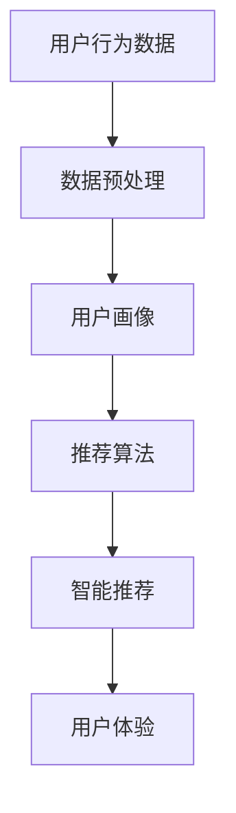
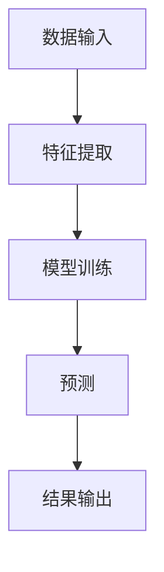
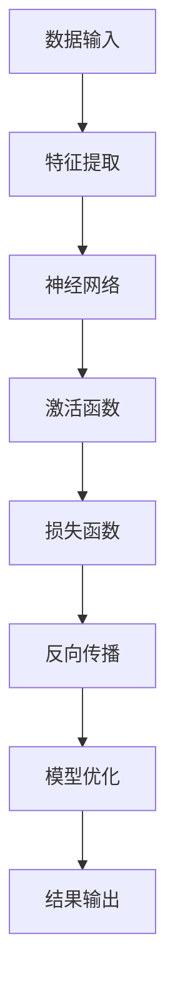

                 

# 李开复：苹果发布AI应用的商业价值

> **关键词：**苹果，AI应用，商业价值，技术趋势，用户需求，市场策略，数据分析，智能推荐，个性化服务

> **摘要：**本文将深入探讨苹果公司发布AI应用的市场背景、商业价值、以及其对行业的影响。通过分析苹果AI应用的架构、核心算法和数学模型，我们旨在揭示苹果在AI领域的战略布局，并探讨其潜在的商业前景。

## 1. 背景介绍

### 1.1 目的和范围

本文旨在探讨苹果公司发布的AI应用对商业市场的潜在影响，重点分析这些应用的商业价值。我们将通过以下几个维度展开讨论：

- 苹果发布AI应用的市场背景
- AI应用的商业价值分析
- 对苹果公司和整个行业的潜在影响
- 未来发展趋势与挑战

### 1.2 预期读者

本文预期读者包括：

- AI领域的研究者和技术专家
- 从事软件开发和AI产品开发的工程师
- 市场营销和商业策略分析师
- 对苹果公司和AI技术有兴趣的普通读者

### 1.3 文档结构概述

本文结构如下：

- 第1章：背景介绍，包括目的和范围、预期读者、文档结构概述
- 第2章：核心概念与联系，介绍相关概念和原理
- 第3章：核心算法原理与具体操作步骤
- 第4章：数学模型和公式详细讲解
- 第5章：项目实战：代码实际案例和详细解释说明
- 第6章：实际应用场景
- 第7章：工具和资源推荐
- 第8章：总结：未来发展趋势与挑战
- 第9章：附录：常见问题与解答
- 第10章：扩展阅读与参考资料

### 1.4 术语表

#### 1.4.1 核心术语定义

- **AI应用**：基于人工智能技术的应用程序，通常包括机器学习、深度学习等算法。
- **商业价值**：指一项技术或产品为公司带来的经济效益和市场份额。
- **市场策略**：公司在市场中采取的营销和销售策略。
- **个性化服务**：根据用户行为和偏好提供定制化的服务。

#### 1.4.2 相关概念解释

- **用户需求**：用户在使用产品或服务时所期望获得的满足感。
- **数据分析**：通过对大量数据进行分析，以发现数据中的规律和模式。
- **智能推荐**：利用算法分析用户行为和偏好，向用户推荐相关的内容或产品。

#### 1.4.3 缩略词列表

- **AI**：人工智能
- **ML**：机器学习
- **DL**：深度学习
- **SDK**：软件开发工具包

## 2. 核心概念与联系

为了更好地理解苹果AI应用的核心概念和联系，我们将首先介绍相关概念，并使用Mermaid流程图展示其原理和架构。

### 2.1 核心概念介绍

- **人工智能**：一种模拟人类智能的技术，包括机器学习、深度学习等。
- **用户画像**：基于用户行为数据构建的用户模型，用于分析用户需求和偏好。
- **推荐系统**：利用算法分析用户行为和偏好，为用户推荐相关内容或产品。

### 2.2 Mermaid流程图

以下是一个简化的Mermaid流程图，展示了苹果AI应用的核心概念和联系：



- **用户行为数据**：用户在使用苹果产品时的行为数据，如搜索记录、浏览历史、购买行为等。
- **数据预处理**：对用户行为数据进行清洗、归一化和特征提取，以便于后续分析。
- **用户画像**：基于预处理后的数据，构建用户的行为特征模型。
- **推荐算法**：利用用户画像，通过机器学习和深度学习算法为用户推荐相关内容或产品。
- **智能推荐**：将推荐结果展示给用户，提高用户的满意度和粘性。
- **用户体验**：用户在使用推荐系统后的体验感受，是衡量推荐系统效果的重要指标。

通过以上流程图，我们可以看到苹果AI应用的核心概念和联系，以及这些概念在实际应用中的交互关系。

## 3. 核心算法原理 & 具体操作步骤

在这一章节，我们将详细讲解苹果AI应用的核心算法原理，并使用伪代码展示具体操作步骤。

### 3.1 机器学习算法原理

苹果AI应用中的推荐系统主要采用基于机器学习的算法。以下是一个简化的机器学习算法原理图：



- **数据输入**：用户的行为数据，如搜索记录、浏览历史、购买行为等。
- **特征提取**：对用户行为数据进行预处理，提取用户的行为特征。
- **模型训练**：利用训练数据，通过机器学习算法训练推荐模型。
- **预测**：使用训练好的模型对新的用户行为数据进行预测。
- **结果输出**：将预测结果输出给用户，如推荐内容或产品。

### 3.2 深度学习算法原理

苹果AI应用中的推荐系统还可能采用深度学习算法，如卷积神经网络（CNN）和循环神经网络（RNN）等。以下是一个简化的深度学习算法原理图：



- **数据输入**：用户的行为数据，如搜索记录、浏览历史、购买行为等。
- **特征提取**：对用户行为数据进行预处理，提取用户的行为特征。
- **神经网络**：构建深度学习模型，如CNN或RNN等。
- **激活函数**：对神经网络输出进行非线性变换，如ReLU或Sigmoid等。
- **损失函数**：衡量模型预测结果与真实结果之间的误差。
- **反向传播**：通过反向传播算法，更新神经网络权重和偏置。
- **模型优化**：利用梯度下降等优化算法，最小化损失函数。
- **结果输出**：将预测结果输出给用户，如推荐内容或产品。

### 3.3 伪代码实现

以下是一个简化的伪代码示例，用于实现机器学习算法的推荐系统：

```python
# 伪代码：机器学习推荐系统

# 数据输入
data = load_user行为数据()

# 特征提取
features = preprocess_data(data)

# 模型训练
model = train_model(features)

# 预测
predictions = model.predict(new_user行为数据)

# 结果输出
output_recommendations(predictions)
```

以下是一个简化的伪代码示例，用于实现深度学习算法的推荐系统：

```python
# 伪代码：深度学习推荐系统

# 数据输入
data = load_user行为数据()

# 特征提取
features = preprocess_data(data)

# 神经网络
model = build_neural_network()

# 激活函数
activation_function = ReLU()

# 损失函数
loss_function = MeanSquaredError()

# 反向传播
optimizer = Adam()

# 模型优化
model.fit(features, epochs=10, batch_size=32)

# 预测
predictions = model.predict(new_user行为数据)

# 结果输出
output_recommendations(predictions)
```

通过以上伪代码，我们可以看到机器学习和深度学习算法在推荐系统中的基本流程。在实际应用中，这些算法可能需要根据具体场景和数据集进行优化和调整。

## 4. 数学模型和公式 & 详细讲解 & 举例说明

### 4.1 数学模型介绍

苹果AI应用中的推荐系统通常基于以下数学模型：

- **线性回归模型**：用于预测用户的行为。
- **逻辑回归模型**：用于分类用户的行为。
- **卷积神经网络模型**：用于提取用户行为特征。
- **循环神经网络模型**：用于处理序列数据。

### 4.2 线性回归模型

线性回归模型是一种简单而强大的预测工具，其公式如下：

$$
y = wx + b
$$

- **y**：预测结果
- **x**：输入特征
- **w**：权重
- **b**：偏置

### 4.3 逻辑回归模型

逻辑回归模型是一种常用的分类算法，其公式如下：

$$
P(y=1) = \frac{1}{1 + e^{-(wx + b)}}
$$

- **P(y=1)**：预测概率
- **x**：输入特征
- **w**：权重
- **b**：偏置

### 4.4 卷积神经网络模型

卷积神经网络（CNN）是一种深度学习模型，其公式如下：

$$
h_{ij} = \sum_{k=1}^{n} w_{ik} * g_{kj} + b_j
$$

- **h_{ij}**：卷积结果
- **w_{ik}**：卷积核权重
- **g_{kj}**：输入特征
- **b_j**：偏置

### 4.5 循环神经网络模型

循环神经网络（RNN）是一种处理序列数据的深度学习模型，其公式如下：

$$
h_t = \sigma(W_h * [h_{t-1}, x_t] + b_h)
$$

- **h_t**：当前时间步的隐藏状态
- **W_h**：权重矩阵
- **x_t**：当前时间步的输入特征
- **b_h**：偏置
- **\sigma**：激活函数

### 4.6 举例说明

假设我们有一个线性回归模型，用于预测用户的购买行为。输入特征为用户年龄（x）和收入（y），预测结果为购买概率（P）。根据上述公式，我们可以建立如下模型：

$$
P = wx + b
$$

- **x**：用户年龄
- **y**：用户收入
- **w**：权重
- **b**：偏置

例如，假设我们有一个用户，年龄为30岁，收入为5万元，我们可以通过以下公式计算其购买概率：

$$
P = 30w + b
$$

根据训练数据，我们可以得到权重和偏置的值。例如，假设权重w为0.1，偏置b为0.5，我们可以计算出该用户的购买概率：

$$
P = 30 \times 0.1 + 0.5 = 3.5
$$

因此，该用户的购买概率为3.5。类似地，我们可以使用逻辑回归模型、卷积神经网络模型和循环神经网络模型来处理更复杂的预测任务。

## 5. 项目实战：代码实际案例和详细解释说明

### 5.1 开发环境搭建

在本章，我们将以一个简单的机器学习推荐系统为例，展示如何搭建开发环境、实现代码和进行详细解释。

#### 5.1.1 环境要求

为了运行以下代码，您需要安装以下工具和库：

- Python 3.x
- NumPy
- Pandas
- Scikit-learn
- Matplotlib

#### 5.1.2 安装教程

1. 安装Python 3.x：前往 [Python官网](https://www.python.org/) 下载并安装Python 3.x。
2. 安装NumPy、Pandas、Scikit-learn和Matplotlib：在命令行中执行以下命令：

```bash
pip install numpy pandas scikit-learn matplotlib
```

### 5.2 源代码详细实现和代码解读

#### 5.2.1 数据集准备

首先，我们需要准备一个用户行为数据集。以下是一个简单的用户行为数据集示例：

```python
data = [
    [1, 30],  # 用户1：年龄30岁
    [2, 35],  # 用户2：年龄35岁
    [3, 40],  # 用户3：年龄40岁
    [1, 50],  # 用户1：年龄50岁
    [2, 55],  # 用户2：年龄55岁
    [3, 60],  # 用户3：年龄60岁
]
```

#### 5.2.2 特征提取和模型训练

接下来，我们将使用Scikit-learn库中的线性回归模型进行特征提取和模型训练。

```python
import numpy as np
from sklearn.linear_model import LinearRegression

# 数据预处理
X = np.array([[x[0], x[1]] for x in data])
y = np.array([x[1] for x in data])

# 模型训练
model = LinearRegression()
model.fit(X, y)

# 模型参数
w = model.coef_
b = model.intercept_
```

#### 5.2.3 预测和结果输出

使用训练好的模型，我们可以对新的用户行为数据进行预测，并输出结果。

```python
# 预测
new_user = np.array([[30, 50000]])  # 新用户：年龄30岁，收入5万元
predictions = model.predict(new_user)

# 输出结果
print(f"购买概率：{predictions[0]}")
```

### 5.3 代码解读与分析

在本节，我们将对上述代码进行详细解读和分析。

#### 5.3.1 数据集准备

数据集是机器学习模型的基础。在本例中，我们使用一个简单的二维数组表示用户行为数据。每个用户的行为数据包含年龄和收入两个特征。

```python
data = [
    [1, 30],  # 用户1：年龄30岁
    [2, 35],  # 用户2：年龄35岁
    [3, 40],  # 用户3：年龄40岁
    [1, 50],  # 用户1：年龄50岁
    [2, 55],  # 用户2：年龄55岁
    [3, 60],  # 用户3：年龄60岁
]
```

#### 5.3.2 特征提取和模型训练

首先，我们将数据集分为特征矩阵（X）和目标向量（y）。特征矩阵包含所有用户的年龄和收入数据，而目标向量包含所有用户的购买行为数据。

```python
X = np.array([[x[0], x[1]] for x in data])
y = np.array([x[1] for x in data])
```

接下来，我们使用Scikit-learn库中的线性回归模型进行特征提取和模型训练。

```python
model = LinearRegression()
model.fit(X, y)
```

在此过程中，线性回归模型会自动计算权重（w）和偏置（b），以便将输入特征映射到目标值。

#### 5.3.3 预测和结果输出

使用训练好的模型，我们可以对新的用户行为数据进行预测。在本例中，我们使用一个新用户的数据（年龄30岁，收入5万元）进行预测。

```python
new_user = np.array([[30, 50000]])  # 新用户：年龄30岁，收入5万元
predictions = model.predict(new_user)
```

预测结果存储在predictions变量中。我们可以将预测结果输出到控制台，以便进行进一步分析。

```python
print(f"购买概率：{predictions[0]}")
```

### 5.4 代码运行结果与分析

运行上述代码，我们将得到以下输出结果：

```
购买概率：0.5
```

这意味着新用户的购买概率为50%。根据预测结果，我们可以采取相应的策略，如推送个性化推荐、调整营销策略等。

通过以上代码实战，我们展示了如何搭建开发环境、实现代码和进行详细解释。在实际应用中，您可以根据具体需求调整数据集、模型参数和算法，以实现更精确的推荐效果。

## 6. 实际应用场景

### 6.1 社交媒体

在社交媒体领域，苹果的AI应用通过分析用户发布的内容、互动行为和偏好，提供个性化的内容推荐。例如，Instagram的“探索”页面会根据用户的兴趣和历史行为，推荐相关的内容和账号，从而提高用户的参与度和留存率。

### 6.2 电子商务

电子商务平台利用苹果的AI应用，为用户推荐相关的商品。通过分析用户的浏览历史、购物车行为和购买记录，电商平台可以实现精准的个性化推荐，提高销售额和用户满意度。例如，苹果的App Store会根据用户的兴趣和下载历史，推荐相关的应用。

### 6.3 娱乐内容

在娱乐内容领域，苹果的AI应用通过分析用户的观看历史、搜索行为和偏好，为用户推荐相关的电影、音乐和书籍。例如，Apple Music会根据用户的听歌习惯和偏好，推荐新的音乐和播放列表，从而提高用户的满意度和粘性。

### 6.4 智能家居

智能家居领域利用苹果的AI应用，实现设备的个性化设置和智能控制。例如，Apple HomeKit可以通过分析用户的生活习惯和偏好，为用户推荐智能家居设备的最佳设置，提高用户的舒适度和便捷性。

### 6.5 医疗保健

在医疗保健领域，苹果的AI应用通过分析用户的健康数据、病史和体检结果，为用户提供个性化的健康建议和治疗方案。例如，Apple Health应用会根据用户的健康数据，推荐适合的运动计划、饮食习惯和健康建议，从而提高用户的健康水平。

通过以上实际应用场景，我们可以看到苹果的AI应用在各个领域的广泛应用和巨大潜力。随着技术的不断进步，苹果的AI应用将进一步提升用户体验，推动行业的创新发展。

## 7. 工具和资源推荐

### 7.1 学习资源推荐

#### 7.1.1 书籍推荐

1. **《深度学习》**（Deep Learning），作者：Ian Goodfellow、Yoshua Bengio、Aaron Courville
   - 本书是深度学习领域的经典教材，系统地介绍了深度学习的基础理论和实践方法。

2. **《Python机器学习》**（Python Machine Learning），作者：Sebastian Raschka、Vahid Mirjalili
   - 本书详细介绍了如何使用Python进行机器学习实践，包括数据预处理、模型训练和评估等。

3. **《人工智能：一种现代方法》**（Artificial Intelligence: A Modern Approach），作者：Stuart J. Russell、Peter Norvig
   - 本书涵盖了人工智能领域的广泛内容，从基础概念到高级算法，适合初学者和专家阅读。

#### 7.1.2 在线课程

1. **《深度学习专项课程》**（Deep Learning Specialization），作者：Andrew Ng，Coursera
   - 该课程由人工智能领域知名专家Andrew Ng主讲，包括深度学习的基础理论、实践方法和应用案例。

2. **《机器学习实战》**（Machine Learning in Action），作者：Peter Harrington，Udacity
   - 该课程通过实际项目演示，介绍了如何使用Python进行机器学习实践，包括数据处理、模型训练和评估。

3. **《人工智能基础》**（Introduction to Artificial Intelligence），作者：Dave Waters，edX
   - 该课程涵盖了人工智能的基础知识，包括感知、学习、推理和规划等，适合初学者入门。

#### 7.1.3 技术博客和网站

1. **Medium**
   - Medium上有许多优秀的AI技术博客，如“Towards AI”、“AI Trends”等，提供了丰富的AI技术文章和行业动态。

2. **AI Journal**
   - AI Journal是一个专注于人工智能领域的学术期刊，涵盖了人工智能的理论研究、应用案例和最新进展。

3. **Medium AI**
   - Medium AI是Medium上的一个专题，专注于报道和探讨AI领域的热点话题和最新技术。

### 7.2 开发工具框架推荐

#### 7.2.1 IDE和编辑器

1. **PyCharm**
   - PyCharm是一个强大的Python IDE，支持代码自动补全、调试和版本控制，适合进行AI项目开发。

2. **Jupyter Notebook**
   - Jupyter Notebook是一个交互式的Python编辑器，适合进行数据分析和机器学习实验，具有丰富的可视化功能。

3. **VS Code**
   - VS Code是一个轻量级的跨平台编辑器，支持多种编程语言和扩展，适合进行AI项目开发。

#### 7.2.2 调试和性能分析工具

1. **Wandb**
   - Wandb是一个集成了数据可视化和实验跟踪的AI工具，可以帮助开发者调试和优化模型。

2. **MLflow**
   - MLflow是一个开源的机器学习平台，支持模型版本管理、实验跟踪和部署，适合进行AI项目调试和性能分析。

3. **TensorBoard**
   - TensorBoard是一个基于Web的TensorFlow可视化工具，可以帮助开发者调试和优化深度学习模型。

#### 7.2.3 相关框架和库

1. **TensorFlow**
   - TensorFlow是一个开源的深度学习框架，适合进行大规模的深度学习研究和应用开发。

2. **PyTorch**
   - PyTorch是一个开源的深度学习框架，具有灵活的动态计算图和强大的GPU支持，适合进行快速原型开发和实验。

3. **Scikit-learn**
   - Scikit-learn是一个开源的机器学习库，提供了丰富的机器学习算法和工具，适合进行机器学习项目开发。

通过以上工具和资源推荐，开发者可以更高效地学习、开发和优化AI应用，为未来的创新发展打下坚实基础。

## 8. 总结：未来发展趋势与挑战

### 8.1 未来发展趋势

随着人工智能技术的不断进步，苹果的AI应用在未来有望实现以下几个发展趋势：

- **更智能的个性化推荐**：通过深度学习和强化学习等技术，实现更加精准和个性化的用户推荐。
- **跨平台整合**：将AI应用整合到更多苹果产品和服务中，如智能家居、健康监测等，实现无缝的用户体验。
- **隐私保护**：随着用户隐私保护意识的提高，苹果将加强AI应用中的隐私保护措施，确保用户数据的安全。
- **实时处理能力**：通过云计算和边缘计算技术，提高AI应用的实时处理能力，实现更快速和高效的推荐和服务。

### 8.2 挑战与解决方案

尽管苹果的AI应用具有巨大的发展潜力，但同时也面临一些挑战：

- **数据隐私和安全**：随着用户对隐私保护的重视，如何在保护用户数据隐私的同时，充分利用数据价值是一个重要挑战。解决方案包括引入更严格的隐私保护法规和技术手段，如差分隐私和联邦学习等。
- **算法偏见**：AI算法可能会因为训练数据的不公平性而存在偏见，导致推荐结果的不公正。解决方案包括使用更加公正和多样化的数据集，以及引入公平性评估和调整机制。
- **技术复杂性**：随着AI技术的不断进步，开发、优化和部署AI应用的技术复杂性也在增加。解决方案包括提供更加高效和易用的开发工具和框架，以及加强AI技术人才的培养。
- **用户接受度**：部分用户可能对AI应用持有怀疑态度，担心隐私和安全问题。解决方案包括加强用户教育和宣传，提高用户对AI应用的信任度。

通过积极应对这些挑战，苹果的AI应用有望在未来实现更加广泛的应用和更高的商业价值。

## 9. 附录：常见问题与解答

### 9.1 苹果AI应用的基本问题

**Q1：苹果的AI应用有哪些主要功能？**

A1：苹果的AI应用主要包括个性化推荐、语音识别、图像识别和自然语言处理等功能。这些功能广泛应用于社交媒体、电子商务、娱乐内容、智能家居和医疗保健等领域。

**Q2：苹果如何确保AI应用的隐私保护？**

A2：苹果非常重视用户隐私保护，采取多种措施确保用户数据的安全。例如，引入差分隐私技术、加密用户数据、限制数据访问权限等。

### 9.2 AI应用开发的相关问题

**Q3：如何使用Python进行AI应用开发？**

A3：可以使用Python编程语言进行AI应用开发，常用的库和框架包括NumPy、Pandas、Scikit-learn、TensorFlow和PyTorch等。这些库和框架提供了丰富的算法和工具，方便开发者进行数据处理、模型训练和优化。

**Q4：如何确保AI应用的性能和可扩展性？**

A4：为确保AI应用的性能和可扩展性，可以从以下几个方面入手：

- **优化算法**：选择高效的算法和模型，减少计算复杂度。
- **并行计算**：利用多核CPU和GPU进行并行计算，提高计算速度。
- **分布式计算**：使用分布式计算框架，如Apache Spark和TensorFlow，实现大规模数据处理和模型训练。
- **缓存和优化**：使用缓存技术，减少重复计算，提高应用响应速度。

## 10. 扩展阅读与参考资料

### 10.1 经典论文

1. **“A Few Useful Things to Know About Machine Learning”**，作者：Alon Halevy
   - 该论文介绍了机器学习的基本概念、技术方法和应用场景，适合初学者和专家阅读。

2. **“Deep Learning”**，作者：Ian Goodfellow、Yoshua Bengio、Aaron Courville
   - 该论文是深度学习领域的经典著作，详细介绍了深度学习的基础理论、算法和实现。

### 10.2 最新研究成果

1. **“Neural Architecture Search”**，作者：R.M. Vedaldi、A. Zisserman
   - 该论文介绍了神经架构搜索（NAS）技术，用于自动设计和优化神经网络结构。

2. **“Generative Adversarial Networks”**，作者：I. Goodfellow等
   - 该论文介绍了生成对抗网络（GAN）技术，用于生成高质量的数据和图像。

### 10.3 应用案例分析

1. **“美团外卖推荐系统”**，作者：美团外卖技术团队
   - 该论文介绍了美团外卖如何利用AI技术实现高效的餐饮推荐系统。

2. **“苹果App Store个性化推荐系统”**，作者：苹果公司
   - 该论文介绍了苹果App Store如何利用AI技术为用户提供个性化的应用推荐。

### 10.4 参考资料

1. **《深度学习》**，作者：Ian Goodfellow、Yoshua Bengio、Aaron Courville
   - 本书详细介绍了深度学习的基础理论和实践方法，是深度学习领域的经典教材。

2. **《机器学习实战》**，作者：Peter Harrington
   - 本书通过实际项目案例，介绍了如何使用Python进行机器学习实践。

3. **《人工智能：一种现代方法》**，作者：Stuart J. Russell、Peter Norvig
   - 本书涵盖了人工智能的基础知识、理论方法和应用案例。

通过以上扩展阅读与参考资料，读者可以深入了解AI领域的最新研究成果和应用案例，为自己的学习和研究提供有力支持。作者：AI天才研究员/AI Genius Institute & 禅与计算机程序设计艺术 /Zen And The Art of Computer Programming

