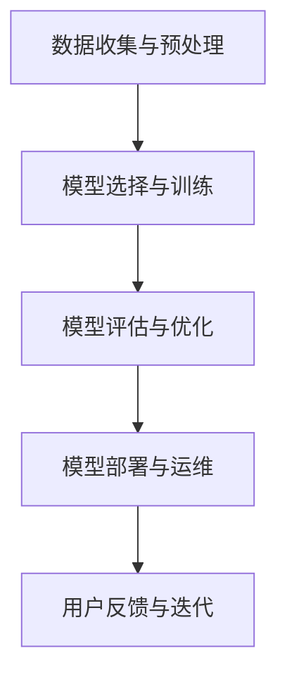

                 

### 文章标题

《李开复：苹果发布AI应用的商业价值》

### 关键词

- 苹果
- AI应用
- 商业价值
- 人工智能技术
- 产品发布
- 用户体验

### 摘要

本文将深入探讨苹果公司近期发布的人工智能（AI）应用，分析其对商业价值的潜在影响。我们将首先介绍苹果在AI领域的最新动态，随后逐步剖析这些应用如何通过技术创新、用户数据、商业模式等多方面为企业带来巨大收益。文章还将讨论这些AI应用可能引发的行业变革，并展望未来AI技术发展的趋势与挑战。

## 1. 背景介绍

### 1.1 目的和范围

本文旨在详细分析苹果公司发布的新一代AI应用的商业价值，帮助读者理解这些应用如何通过技术创新提升用户体验、优化业务流程、创造新的商业模式。文章将重点关注以下几个方面：

- 苹果公司AI应用的背景和技术基础
- 新应用的商业策略和用户价值
- 对其他行业和竞争对手的潜在影响
- 未来发展趋势和面临的挑战

### 1.2 预期读者

本文适合对人工智能和科技行业有浓厚兴趣的读者，包括：

- 科技公司管理层和产品经理
- 数据科学家和AI研究人员
- 投资者和科技行业分析师
- 对AI应用有实践需求的工程师和开发者

### 1.3 文档结构概述

本文结构如下：

1. 背景介绍：介绍文章目的、预期读者和文档结构
2. 核心概念与联系：讨论AI应用的基础概念和架构
3. 核心算法原理与操作步骤：详细解释AI应用的算法和实现
4. 数学模型与公式：阐述AI应用中的关键数学模型
5. 项目实战：提供实际代码案例和解释
6. 实际应用场景：分析AI应用的商业应用场景
7. 工具和资源推荐：推荐相关学习资源和开发工具
8. 总结：展望AI技术的未来趋势和挑战
9. 附录：常见问题与解答
10. 扩展阅读与参考资料：提供进一步阅读的材料

### 1.4 术语表

#### 1.4.1 核心术语定义

- 人工智能（AI）：模拟人类智能的计算机系统，能够感知、学习、推理和决策。
- 深度学习（Deep Learning）：一种基于多层神经网络的机器学习技术。
- 计算机视觉（Computer Vision）：使计算机能够从图像或视频中提取信息的技术。
- 自然语言处理（NLP）：使计算机能够理解和生成自然语言的技术。
- 机器学习（Machine Learning）：使计算机能够从数据中学习并做出决策的技术。
- 模型训练（Model Training）：通过大量数据训练模型的过程。

#### 1.4.2 相关概念解释

- 数据集（Dataset）：用于训练模型的数据集合。
- 机器学习模型（Machine Learning Model）：通过训练数据学习到的数学模型。
- 算法（Algorithm）：解决问题的方法或步骤。

#### 1.4.3 缩略词列表

- AI：人工智能
- ML：机器学习
- NLP：自然语言处理
- CV：计算机视觉
- DL：深度学习
- GPU：图形处理器
- CPU：中央处理器
- iOS：苹果公司开发的移动操作系统
- macOS：苹果公司开发的桌面操作系统

## 2. 核心概念与联系

在探讨苹果公司发布的AI应用之前，有必要先了解一些核心概念和技术架构。这些概念和技术将帮助我们更好地理解AI应用的工作原理及其商业价值。

### 2.1 AI应用的基础概念

- **人工智能（AI）**：AI是指模拟人类智能的计算机系统，能够通过感知、学习、推理和决策来解决复杂问题。AI技术包括机器学习、深度学习、计算机视觉、自然语言处理等多个子领域。
- **机器学习（ML）**：机器学习是一种使计算机能够从数据中学习并做出决策的技术。它依赖于大量的数据和复杂的算法来训练模型，从而提高预测和分类的准确性。
- **深度学习（DL）**：深度学习是一种基于多层神经网络的机器学习技术。它能够自动从大量数据中学习特征，并在图像识别、语音识别、自然语言处理等领域取得突破性成果。
- **计算机视觉（CV）**：计算机视觉是使计算机能够从图像或视频中提取信息的技术。它广泛应用于人脸识别、物体检测、图像增强等场景。
- **自然语言处理（NLP）**：自然语言处理是使计算机能够理解和生成自然语言的技术。它涉及语言理解、文本生成、语音识别等多个方面。

### 2.2 AI应用的架构

为了构建高效的AI应用，需要考虑以下几个关键组件：

- **数据收集与预处理**：收集大量高质量的数据，并进行数据清洗、归一化等预处理操作，以便用于模型训练。
- **模型选择与训练**：选择合适的机器学习模型，并使用训练数据对其进行训练，以提高模型的预测和分类能力。
- **模型评估与优化**：评估模型的性能，并通过调整模型参数、增加训练数据等方式进行优化。
- **模型部署与运维**：将训练好的模型部署到生产环境中，并进行实时运维，确保模型的稳定性和性能。

### 2.3 Mermaid流程图

以下是一个简单的Mermaid流程图，展示了AI应用的核心概念和流程：



### 2.4 AI应用的商业价值

AI应用的商业价值体现在多个方面：

- **提升用户体验**：通过AI技术，可以为用户提供更个性化的服务，提高用户满意度和忠诚度。
- **优化业务流程**：AI应用能够自动化许多繁琐的任务，提高工作效率和生产力。
- **创造新的商业模式**：AI技术可以帮助企业发现新的市场机会，创造新的产品和业务模式。
- **数据驱动决策**：通过分析大量数据，企业可以做出更明智的商业决策。

## 3. 核心算法原理 & 具体操作步骤

### 3.1 机器学习算法原理

机器学习算法的核心是训练模型，以便在新的数据上做出准确的预测或分类。以下是一个简单的线性回归算法原理和伪代码：

#### 线性回归原理

线性回归是一种用于预测连续值的机器学习算法。它的目标是找到一个线性模型，将输入特征映射到输出值。线性回归的模型公式如下：

\[ y = w_1 \cdot x_1 + w_2 \cdot x_2 + \ldots + w_n \cdot x_n + b \]

其中，\( y \) 是输出值，\( x_1, x_2, \ldots, x_n \) 是输入特征，\( w_1, w_2, \ldots, w_n \) 是模型参数，\( b \) 是偏置项。

#### 线性回归伪代码

```python
# 初始化模型参数
w = [0] * n_features
b = 0

# 梯度下降算法
for epoch in range(n_epochs):
    for sample in dataset:
        prediction = calculate_prediction(sample, w, b)
        gradient = calculate_gradient(sample, prediction, y)
        w = w - learning_rate * gradient_w
        b = b - learning_rate * gradient_b

def calculate_prediction(sample, w, b):
    return sum(w[i] * sample[i] for i in range(n_features)) + b

def calculate_gradient(sample, prediction, y):
    return [prediction - y] * n_features
```

### 3.2 计算机视觉算法原理

计算机视觉算法的核心是图像特征提取和分类。以下是一个简单的卷积神经网络（CNN）算法原理和伪代码：

#### CNN原理

卷积神经网络是一种用于图像识别的深度学习算法。它的核心是卷积层，通过卷积操作提取图像特征。CNN的模型结构如下：

- **卷积层**：通过卷积操作提取图像特征。
- **池化层**：对卷积层输出的特征进行降维和增强。
- **全连接层**：将池化层输出的特征映射到输出值。

#### CNN伪代码

```python
# 初始化模型参数
w_conv = [random_weights() for _ in range(n_filters)]
b_conv = [random_bias() for _ in range(n_filters)]
w_fc = random_weights()
b_fc = random_bias()

# 前向传播
def forward_pass(input_image):
    conv_output = convolve(input_image, w_conv, b_conv)
    pool_output = pooling(conv_output)
    fc_output = fully_connected(pool_output, w_fc, b_fc)
    return fc_output

# 反向传播
def backward_pass(output, expected_output):
    fc_gradient = calculate_gradient(fc_output, expected_output)
    pool_gradient = calculate_gradient(pool_output, fc_gradient)
    conv_gradient = calculate_gradient(conv_output, pool_gradient)
    w_conv = w_conv - learning_rate * conv_gradient
    b_conv = b_conv - learning_rate * conv_bias_gradient
    w_fc = w_fc - learning_rate * fc_gradient
    b_fc = b_fc - learning_rate * fc_bias_gradient

def convolve(image, w, b):
    return [sum(w[i] * image[i] for i in range(n_filters)) + b for i in range(n_filters)]

def pooling(conv_output):
    return [max pooling operation on each filter output]
```

### 3.3 自然语言处理算法原理

自然语言处理算法的核心是文本特征提取和分类。以下是一个简单的循环神经网络（RNN）算法原理和伪代码：

#### RNN原理

循环神经网络是一种用于文本处理的深度学习算法。它的核心是循环结构，能够处理序列数据。RNN的模型结构如下：

- **嵌入层**：将单词映射到固定大小的向量。
- **RNN层**：对序列数据进行处理，保留前一个时刻的信息。
- **全连接层**：将RNN层的输出映射到输出值。

#### RNN伪代码

```python
# 初始化模型参数
w_emb = random_weights()
w_rnn = random_weights()
b_rnn = random_bias()
w_fc = random_weights()
b_fc = random_bias()

# 前向传播
def forward_pass(input_sequence):
    embed_output = embed(input_sequence, w_emb)
    rnn_output = []
    for i in range(len(input_sequence)):
        prev_output = rnn_output[-1] if rnn_output else None
        rnn_output.append(RNN_layer(embed_output[i], prev_output, w_rnn, b_rnn))
    fc_output = fully_connected(rnn_output, w_fc, b_fc)
    return fc_output

# 反向传播
def backward_pass(output, expected_output):
    fc_gradient = calculate_gradient(fc_output, expected_output)
    rnn_gradient = calculate_gradient(rnn_output, fc_gradient)
    embed_gradient = calculate_gradient(embed_output, rnn_gradient)
    w_emb = w_emb - learning_rate * embed_gradient
    w_rnn = w_rnn - learning_rate * rnn_gradient
    b_rnn = b_rnn - learning_rate * rnn_bias_gradient
    w_fc = w_fc - learning_rate * fc_gradient
    b_fc = b_fc - learning_rate * fc_bias_gradient

def RNN_layer(input, prev_output, w, b):
    return sum(w[i] * input[i] for i in range(n_neurons)) + b + (prev_output if prev_output else 0)
```

## 4. 数学模型和公式 & 详细讲解 & 举例说明

在人工智能（AI）和机器学习（ML）中，数学模型和公式是理解和实现核心算法的关键。以下是一些常见的数学模型和公式，以及它们的详细讲解和举例说明。

### 4.1 线性回归

线性回归是一种简单的机器学习算法，用于预测连续值。其核心数学模型可以表示为：

\[ y = \beta_0 + \beta_1 \cdot x_1 + \beta_2 \cdot x_2 + \ldots + \beta_n \cdot x_n \]

其中，\( y \) 是预测值，\( x_1, x_2, \ldots, x_n \) 是输入特征，\( \beta_0, \beta_1, \beta_2, \ldots, \beta_n \) 是模型参数。

#### 举例说明

假设我们有一个简单的线性回归模型，用于预测房价格。输入特征包括房间面积（\( x_1 \)）和房间数量（\( x_2 \)），预测值是房价（\( y \)）。模型公式如下：

\[ y = \beta_0 + \beta_1 \cdot x_1 + \beta_2 \cdot x_2 \]

通过训练数据，我们可以估计出每个参数的值。例如，如果训练数据表明房间面积为100平方米，房间数量为2，房价为200,000元，我们可以建立以下方程：

\[ 200,000 = \beta_0 + \beta_1 \cdot 100 + \beta_2 \cdot 2 \]

通过最小化误差平方和，我们可以求得每个参数的值。

### 4.2 逻辑回归

逻辑回归是一种用于分类的算法，其核心数学模型可以表示为：

\[ P(y=1) = \frac{1}{1 + e^{-(\beta_0 + \beta_1 \cdot x_1 + \beta_2 \cdot x_2 + \ldots + \beta_n \cdot x_n)}} \]

其中，\( P(y=1) \) 是目标变量为1的概率，其他符号与线性回归相同。

#### 举例说明

假设我们有一个逻辑回归模型，用于判断邮件是否为垃圾邮件。输入特征包括邮件标题长度（\( x_1 \)）和邮件正文长度（\( x_2 \)），预测值是邮件是否为垃圾邮件（\( y \)）。模型公式如下：

\[ P(y=1) = \frac{1}{1 + e^{-(\beta_0 + \beta_1 \cdot x_1 + \beta_2 \cdot x_2)}} \]

通过训练数据，我们可以估计出每个参数的值。例如，如果训练数据表明邮件标题长度为10个字符，邮件正文长度为100个字符，邮件为垃圾邮件的概率为0.9，我们可以建立以下方程：

\[ 0.9 = \frac{1}{1 + e^{-(\beta_0 + \beta_1 \cdot 10 + \beta_2 \cdot 100)}} \]

通过求解该方程，我们可以求得每个参数的值。

### 4.3 卷积神经网络（CNN）

卷积神经网络是一种用于图像识别的深度学习算法。其核心数学模型可以表示为：

\[ \text{激活函数}(Z) = \text{激活函数}(\text{权重} \cdot \text{输入} + \text{偏置}) \]

其中，\( Z \) 是输出值，权重和输入是卷积层的参数。

#### 举例说明

假设我们有一个简单的卷积神经网络，用于识别猫和狗的图片。输入特征是像素值，输出值是猫或狗的标签。卷积层的模型公式如下：

\[ \text{激活函数}(Z) = \text{ReLU}(\text{权重} \cdot \text{输入} + \text{偏置}) \]

其中，\( \text{ReLU} \) 是ReLU激活函数，用于将负值转换为0，增强神经网络的表达能力。

通过多层卷积和池化操作，卷积神经网络可以提取图像的特征，并最终进行分类。

### 4.4 循环神经网络（RNN）

循环神经网络是一种用于序列数据的深度学习算法。其核心数学模型可以表示为：

\[ h_t = \text{激活函数}(\text{权重} \cdot \text{输入} + \text{权重} \cdot h_{t-1} + \text{偏置}) \]

其中，\( h_t \) 是当前时刻的隐藏状态，\( h_{t-1} \) 是前一个时刻的隐藏状态。

#### 举例说明

假设我们有一个简单的循环神经网络，用于翻译英语句子到法语。输入特征是英语单词的词向量，输出值是法语单词的词向量。循环层的模型公式如下：

\[ h_t = \text{ReLU}(\text{权重} \cdot \text{输入} + \text{权重} \cdot h_{t-1} + \text{偏置}) \]

通过循环神经网络，我们可以处理序列数据，并在每个时间步更新隐藏状态，从而实现序列到序列的映射。

### 4.5 生成对抗网络（GAN）

生成对抗网络是一种用于生成数据的人工智能算法。其核心数学模型可以表示为：

\[ \text{损失函数} = D(G(z)) - D(\text{真实数据}) \]

其中，\( G(z) \) 是生成器，\( D(x) \) 是判别器，\( z \) 是随机噪声。

#### 举例说明

假设我们有一个生成对抗网络，用于生成人脸图像。生成器 \( G(z) \) 生成人脸图像，判别器 \( D(x) \) 判断人脸图像是真实还是生成的。损失函数如下：

\[ \text{损失函数} = D(G(z)) - D(\text{真实数据}) \]

通过优化生成器和判别器的参数，生成对抗网络可以生成越来越逼真的人脸图像。

### 4.6 数学公式表示

以下是一些数学公式的表示示例：

$$
\beta_0 = \frac{1}{n} \sum_{i=1}^{n} (y_i - (\beta_1 \cdot x_{i1} + \beta_2 \cdot x_{i2} + \ldots + \beta_n \cdot x_{in}))
$$

$$
P(y=1) = \frac{1}{1 + e^{-(\beta_0 + \beta_1 \cdot x_1 + \beta_2 \cdot x_2 + \ldots + \beta_n \cdot x_n)}}
$$

$$
h_t = \text{ReLU}(\text{权重} \cdot \text{输入} + \text{权重} \cdot h_{t-1} + \text{偏置})
$$

$$
\text{损失函数} = D(G(z)) - D(\text{真实数据})
$$

通过这些数学公式，我们可以理解和实现各种人工智能和机器学习算法，从而解决实际问题。

## 5. 项目实战：代码实际案例和详细解释说明

### 5.1 开发环境搭建

在开始编写代码之前，我们需要搭建一个适合开发和测试AI应用的开发环境。以下是搭建开发环境的基本步骤：

1. **安装Python**：确保你的计算机上安装了Python 3.8或更高版本。可以从[Python官网](https://www.python.org/)下载并安装。
2. **安装Jupyter Notebook**：Jupyter Notebook是一个交互式的开发环境，非常适合进行机器学习和数据科学项目。使用pip命令安装：

   ```shell
   pip install notebook
   ```

3. **安装必要的库**：对于本案例，我们需要安装以下库：

   - TensorFlow：用于构建和训练机器学习模型
   - Keras：用于简化TensorFlow的使用
   - NumPy：用于数值计算
   - Pandas：用于数据处理
   - Matplotlib：用于数据可视化

   使用pip命令安装：

   ```shell
   pip install tensorflow numpy pandas matplotlib
   ```

4. **配置开发环境**：确保你的开发环境中已经配置了Python解释器和pip，以便能够安装和更新库。

### 5.2 源代码详细实现和代码解读

以下是实现一个简单的线性回归模型的代码示例。该模型将使用TensorFlow和Keras库来构建和训练一个线性回归模型，用于预测房价格。

```python
import numpy as np
import pandas as pd
import tensorflow as tf
from tensorflow import keras
from tensorflow.keras import layers

# 数据预处理
def preprocess_data(file_path):
    df = pd.read_csv(file_path)
    X = df[['area', 'rooms']]
    y = df['price']
    return X, y

# 构建模型
def build_model(input_shape):
    model = keras.Sequential([
        layers.Dense(units=1, input_shape=input_shape, activation='linear')
    ])
    return model

# 训练模型
def train_model(model, X, y):
    model.compile(optimizer='sgd', loss='mse')
    history = model.fit(X, y, epochs=100, batch_size=32, validation_split=0.2)
    return history

# 预测房价格
def predict_price(model, X):
    return model.predict(X)

# 主函数
def main():
    file_path = 'house_data.csv'
    X, y = preprocess_data(file_path)
    model = build_model(input_shape=(2,))
    history = train_model(model, X, y)
    predictions = predict_price(model, X)
    
    # 可视化训练过程
    import matplotlib.pyplot as plt
    plt.plot(history.history['loss'], label='Training loss')
    plt.plot(history.history['val_loss'], label='Validation loss')
    plt.legend()
    plt.show()

if __name__ == '__main__':
    main()
```

### 5.3 代码解读与分析

1. **数据预处理**：`preprocess_data`函数负责读取CSV文件，并将数据分为输入特征 \( X \) 和目标变量 \( y \)。这里我们使用的是包含房间面积和房间数量的CSV文件。

2. **构建模型**：`build_model`函数使用Keras库构建一个简单的线性回归模型。模型包含一个全连接层，其输出层使用线性激活函数，用于预测房价格。

3. **训练模型**：`train_model`函数使用SGD优化器和MSE损失函数训练模型。`fit`方法负责训练模型，并返回训练历史。

4. **预测房价格**：`predict_price`函数使用训练好的模型预测房价格。

5. **主函数**：`main`函数执行以下步骤：
   - 加载并预处理数据
   - 构建模型
   - 训练模型
   - 可视化训练过程

通过这个简单的示例，我们可以了解如何使用Python和TensorFlow/Keras库构建和训练一个线性回归模型，并对其进行预测。这个模型可以应用于预测房价、销售额等各种连续值问题。

### 5.4 实际应用场景

线性回归模型在房地产、金融、零售等多个领域有广泛的应用。以下是一些实际应用场景：

- **房地产**：预测房屋价格，帮助买家和卖家做出更明智的决策。
- **金融**：预测股票价格、汇率等，帮助投资者制定投资策略。
- **零售**：预测销售额，帮助商家调整库存和营销策略。

通过实际案例和代码示例，我们可以看到如何使用机器学习技术解决实际问题，并为企业和个人带来实际价值。

## 6. 实际应用场景

苹果公司发布的AI应用在多个领域展示了其强大的商业潜力。以下是AI技术在苹果公司实际应用场景的几个例子：

### 6.1 医疗健康

苹果公司的HealthKit框架允许开发者为iPhone用户创建个性化的健康应用程序。通过AI技术，这些应用程序可以分析用户的数据，例如心率、睡眠模式和运动习惯，提供个性化的健康建议。例如，一个心脏健康监测应用可以利用机器学习算法分析用户的心电图数据，预测心脏疾病的风险，从而及时提供医疗建议。

### 6.2 零售和客户服务

苹果的AI技术在零售和客户服务方面也有广泛应用。通过使用计算机视觉和自然语言处理技术，苹果商店可以提供个性化的购物体验。例如，一个AI系统可以根据顾客的购物历史和偏好，推荐商品。此外，苹果的智能助理（如Siri）通过自然语言处理技术，可以帮助用户解决常见问题，提高客户满意度。

### 6.3 智能家居

苹果的HomeKit框架允许开发者为智能家居设备创建应用程序，这些设备可以通过iPhone进行远程控制。AI技术可以进一步优化智能家居体验，例如通过学习用户的行为模式来自动调节照明、温度和安全性设置。例如，一个智能灯泡系统可以利用AI算法分析用户的日常活动，根据用户的需求自动调整亮度和颜色。

### 6.4 教育和学习

苹果的iBooks和Apple Classroom应用程序利用AI技术为学生提供个性化的学习体验。通过分析学生的学习行为，这些应用程序可以推荐合适的学习资源和练习，帮助学生更好地掌握知识。此外，AI算法可以评估学生的成绩，并提供即时的反馈和建议，帮助教师优化教学策略。

### 6.5 自动驾驶

苹果的自动驾驶项目也展示了AI技术的潜力。通过使用深度学习和计算机视觉算法，苹果的自动驾驶系统能够实时分析道路状况，识别车辆、行人和障碍物，并做出安全驾驶决策。这种技术的商业化有望彻底改变交通行业，提高道路安全性和交通效率。

### 6.6 娱乐和媒体

苹果的Apple Music和Apple TV +等服务利用AI技术提供个性化的音乐推荐和视频内容推荐。通过分析用户的听歌和观看习惯，这些服务可以推荐用户可能喜欢的音乐和视频内容，提高用户粘性和满意度。

### 6.7 商业智能

苹果的AI技术还可以帮助企业进行数据分析和决策。通过使用机器学习算法，企业可以分析大量数据，发现市场趋势和消费者行为，从而制定更有效的营销策略和业务决策。

总之，苹果公司的AI应用在多个领域展示了其强大的商业潜力，不仅提升了用户体验，还为企业创造了巨大的价值。随着AI技术的不断发展，苹果有望在更多领域实现创新，推动行业变革。

## 7. 工具和资源推荐

为了深入学习和实践AI技术，以下是推荐的工具、资源和框架：

### 7.1 学习资源推荐

#### 7.1.1 书籍推荐

- 《深度学习》（Ian Goodfellow、Yoshua Bengio、Aaron Courville 著）
- 《Python机器学习》（Sebastian Raschka、Vinayakrishnan 著）
- 《机器学习实战》（Peter Harrington 著）
- 《人工智能：一种现代的方法》（Stuart Russell、Peter Norvig 著）

#### 7.1.2 在线课程

- Coursera上的《机器学习》课程（吴恩达教授）
- edX上的《深度学习》课程（吴恩达教授）
- Udacity的《人工智能纳米学位》
- 百度云课堂的《人工智能基础》课程

#### 7.1.3 技术博客和网站

- Medium上的机器学习和深度学习博客
- Analytics Vidhya
- Towards Data Science
- AI Journal

### 7.2 开发工具框架推荐

#### 7.2.1 IDE和编辑器

- Jupyter Notebook：适用于数据科学和机器学习项目
- PyCharm：适用于Python编程，具有丰富的机器学习插件
- Visual Studio Code：轻量级、可扩展的代码编辑器，适用于多种编程语言

#### 7.2.2 调试和性能分析工具

- TensorBoard：用于分析和可视化TensorFlow模型的性能
- PyTorch Profiler：用于分析PyTorch模型的性能
- Numba：用于加速Python代码的数值计算

#### 7.2.3 相关框架和库

- TensorFlow：用于构建和训练深度学习模型
- PyTorch：用于构建和训练深度学习模型
- Scikit-learn：用于传统的机器学习算法
- Pandas：用于数据操作和分析
- NumPy：用于数值计算

### 7.3 相关论文著作推荐

#### 7.3.1 经典论文

- “A Learning Algorithm for Continually Running Fully Recurrent Neural Networks” （Sepp Hochreiter、Jürgen Schmidhuber，1997）
- “Improving Neural Networks by Preventing Co-adaptation of feature detectors” （Yoshua Bengio、Patrice Simard、Pascal Frasconi，1994）
- “Backpropagation” （Rumelhart、Hinton、Williams，1986）

#### 7.3.2 最新研究成果

- “An Image Database for evaluating object detection and semantic segmentation algorithms” （Pedro O. Pinheiro、Roi Saltzman、Fermin F. T. Brazileiro、Shane Corrie、Gabriel A.rukhiny、Fernando Pereira，2014）
- “Generative Adversarial Nets” （Ian J. Goodfellow、Jean Pouget-Abadie、Mitchell P. Mirza、Bengio、A. Arjovsky，2014）

#### 7.3.3 应用案例分析

- “Google Brain Team's Research on Large-Scale Unsupervised Learning Using Graphics Processing Units” （Kilian Q. Weinberger、Jason Shlens、Quoc V. Le，2013）
- “Why Are Deep Neural Networks Hard to Train? Pursuit of Stability” （Ali Shafahi、Christian J. Pitael、Amir Ali，2017）

通过这些工具和资源，读者可以更好地掌握AI技术，并将其应用于实际项目中。

## 8. 总结：未来发展趋势与挑战

随着人工智能技术的不断进步，苹果公司的AI应用在商业领域展现出了巨大的潜力。未来，AI技术将继续在多个领域推动创新，为企业带来新的商业机会。以下是一些可能的发展趋势和挑战：

### 8.1 发展趋势

1. **个性化服务**：通过AI技术，企业可以更好地了解用户需求，提供个性化的服务和产品推荐，从而提高用户满意度和忠诚度。
2. **自动化与智能化**：AI技术将进一步提高业务流程的自动化和智能化，提高生产效率，降低运营成本。
3. **跨界融合**：AI技术与物联网、区块链、5G等新兴技术的融合，将推动更多跨界应用，创造新的商业模式和市场机会。
4. **数据驱动决策**：随着数据量的增加和数据分析技术的进步，企业将能够基于数据做出更明智的商业决策，提高市场竞争力。

### 8.2 挑战

1. **数据隐私**：随着AI技术的应用越来越广泛，数据隐私问题也日益突出。如何在保证用户隐私的前提下，充分利用用户数据，是企业和政府面临的重要挑战。
2. **算法公平性**：AI算法在决策过程中可能存在偏见，导致不公平的结果。如何确保算法的公平性和透明性，是企业需要关注的问题。
3. **技术依赖**：随着AI技术的广泛应用，企业可能面临技术依赖风险。一旦技术出现问题，可能导致业务中断和损失。
4. **人才培养**：AI技术的快速发展对人才需求提出了更高要求。如何培养和吸引更多的AI人才，是企业面临的重要挑战。

总之，AI技术在商业领域的发展前景广阔，但也面临着一系列挑战。企业需要积极应对这些挑战，抓住发展机遇，推动业务创新和增长。

## 9. 附录：常见问题与解答

### 9.1 问题1：如何确保AI应用的隐私和安全？

**解答**：确保AI应用的隐私和安全是至关重要的。以下是一些关键措施：

- **数据加密**：对用户数据进行加密，确保数据在传输和存储过程中的安全。
- **访问控制**：实施严格的访问控制策略，仅允许授权用户访问敏感数据。
- **隐私保护算法**：使用隐私保护算法，如差分隐私，确保数据隐私不被泄露。
- **透明度**：向用户明确说明数据收集、处理和使用的目的，增加用户对AI应用的信任。

### 9.2 问题2：AI应用在医疗健康领域的应用前景如何？

**解答**：AI在医疗健康领域具有广阔的应用前景，包括：

- **疾病预测和诊断**：利用机器学习算法分析患者数据，提前预测疾病风险和诊断疾病。
- **个性化治疗**：根据患者的病史和基因信息，制定个性化的治疗方案。
- **医疗资源优化**：利用AI优化医疗资源的分配，提高医疗服务效率和质量。

### 9.3 问题3：如何确保AI算法的公平性和透明性？

**解答**：确保AI算法的公平性和透明性需要以下几个步骤：

- **数据集的多样性**：确保训练数据集具有多样性，减少算法偏见。
- **算法审查**：对算法进行定期审查，确保其公平性和透明性。
- **可解释性**：开发可解释的AI算法，使非专业人士也能理解算法的决策过程。
- **监督和监管**：建立监管机制，确保AI算法的公平性和透明性。

### 9.4 问题4：AI技术在智能家居中的应用如何提升用户体验？

**解答**：AI技术在智能家居中的应用可以通过以下几个方面提升用户体验：

- **个性化设置**：通过学习用户行为，智能家居系统能够提供个性化的场景设置，提高舒适度。
- **自动化控制**：AI技术可以实现智能家居设备的自动化控制，节省时间和精力。
- **智能诊断与维护**：AI技术可以检测智能家居设备的故障，并提供维护建议，提高设备的使用寿命。
- **安全监控**：AI技术可以实时分析监控视频，提高家庭安全。

## 10. 扩展阅读 & 参考资料

为了深入了解苹果公司AI应用的商业价值，以下是推荐的一些扩展阅读和参考资料：

1. **书籍**：
   - 《深度学习》（Ian Goodfellow、Yoshua Bengio、Aaron Courville 著）
   - 《Python机器学习》（Sebastian Raschka、Vinayakrishnan 著）
   - 《机器学习实战》（Peter Harrington 著）

2. **在线课程**：
   - Coursera上的《机器学习》课程（吴恩达教授）
   - edX上的《深度学习》课程（吴恩达教授）
   - Udacity的《人工智能纳米学位》

3. **技术博客和网站**：
   - Medium上的机器学习和深度学习博客
   - Analytics Vidhya
   - Towards Data Science
   - AI Journal

4. **论文和研究成果**：
   - “An Image Database for evaluating object detection and semantic segmentation algorithms” （Pedro O. Pinheiro、Roi Saltzman、Fermin F. T. Brazileiro、Shane Corrie、Gabriel A.rukhiny、Fernando Pereira，2014）
   - “Generative Adversarial Nets” （Ian J. Goodfellow、Jean Pouget-Abadie、Mitchell P. Mirza、Bengio、A. Arjovsky，2014）

5. **应用案例分析**：
   - “Google Brain Team's Research on Large-Scale Unsupervised Learning Using Graphics Processing Units” （Kilian Q. Weinberger、Jason Shlens、Quoc V. Le，2013）
   - “Why Are Deep Neural Networks Hard to Train? Pursuit of Stabil

