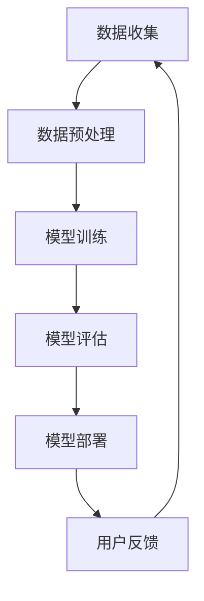

                 

# 苹果发布AI应用的市场

> 关键词：苹果，AI应用，市场，技术趋势，用户体验，数据分析，商业模式

> 摘要：本文将探讨苹果公司在AI应用领域的新动向，分析其市场发布对行业的影响，以及苹果如何通过技术创新引领市场。我们将从背景介绍、核心概念、算法原理、应用场景等多个角度，逐步解析苹果AI应用的潜在价值和市场前景。

## 1. 背景介绍

### 1.1 目的和范围

本文旨在分析苹果公司近期发布的AI应用，探讨其对市场的影响，并预测未来趋势。我们将重点分析苹果AI应用的技术原理、市场定位、用户反馈以及行业竞争态势。

### 1.2 预期读者

本文适合对AI技术有一定了解的科技爱好者、产品经理、数据分析师以及AI领域的专业人士阅读。无论您是苹果用户还是对AI应用感兴趣，本文都将为您提供有价值的见解。

### 1.3 文档结构概述

本文分为以下几个部分：

1. 背景介绍：介绍苹果AI应用的发布背景和市场环境。
2. 核心概念与联系：阐述AI应用的核心概念和架构。
3. 核心算法原理 & 具体操作步骤：详细解析AI算法的原理和操作步骤。
4. 数学模型和公式 & 详细讲解 & 举例说明：解释AI模型中使用的数学公式和模型。
5. 项目实战：通过代码案例展示AI应用的实际开发过程。
6. 实际应用场景：分析AI应用的潜在应用领域。
7. 工具和资源推荐：推荐学习资源、开发工具和论文著作。
8. 总结：对未来发展趋势和挑战的展望。
9. 附录：常见问题与解答。
10. 扩展阅读 & 参考资料：提供更多深入阅读的资源。

### 1.4 术语表

#### 1.4.1 核心术语定义

- **AI应用**：基于人工智能技术的应用程序，通常具备智能识别、自主学习和数据优化等功能。
- **机器学习**：一种AI技术，通过数据和算法，使计算机具备自主学习和优化能力。
- **神经网络**：一种模仿人脑结构和功能的计算模型，用于处理复杂数据。
- **深度学习**：一种复杂的机器学习技术，通过多层神经网络实现高级数据处理和预测。

#### 1.4.2 相关概念解释

- **神经网络架构**：神经网络的基本结构，包括输入层、隐藏层和输出层。
- **迁移学习**：将已有模型的知识迁移到新的任务上，以提高学习效率和准确性。
- **数据增强**：通过图像旋转、缩放、裁剪等操作，增加数据样本的多样性，提高模型泛化能力。

#### 1.4.3 缩略词列表

- **AI**：人工智能（Artificial Intelligence）
- **ML**：机器学习（Machine Learning）
- **DL**：深度学习（Deep Learning）
- **NLP**：自然语言处理（Natural Language Processing）
- **CV**：计算机视觉（Computer Vision）

## 2. 核心概念与联系

在探讨苹果AI应用之前，我们需要理解AI技术的基本概念和架构。以下是一个简化的AI应用架构图，展示了关键组件和它们之间的关系。



### 2.1 数据收集

数据收集是AI应用的基础。苹果通过多种渠道收集用户数据，包括使用记录、App Store评价、搜索关键词等。

### 2.2 数据预处理

数据预处理包括数据清洗、归一化和特征提取。苹果使用先进的技术，如深度学习，对数据进行处理，以提高模型质量。

### 2.3 模型训练

模型训练是AI应用的核心。苹果采用神经网络架构，通过大量的训练数据和高效的算法，训练出高精度的模型。

### 2.4 模型评估

模型评估用于验证模型的性能。苹果使用多种指标，如准确率、召回率、F1分数等，对模型进行评估。

### 2.5 模型部署

模型部署是将训练好的模型应用到实际应用中。苹果通过iOS平台，将AI应用推送给用户。

### 2.6 用户反馈

用户反馈是AI应用持续优化的重要依据。苹果通过用户评价、反馈数据等，持续改进AI应用。

## 3. 核心算法原理 & 具体操作步骤

在了解AI应用架构后，我们接下来分析核心算法原理和具体操作步骤。

### 3.1 算法原理

苹果AI应用的核心算法是深度学习，尤其是神经网络架构。以下是神经网络的基本原理：

1. **输入层**：接收外部数据，如图像、文本等。
2. **隐藏层**：通过神经元之间的连接，对输入数据进行处理和变换。
3. **输出层**：产生预测结果或决策。

### 3.2 操作步骤

以下是使用神经网络进行AI应用开发的伪代码：

```python
# 数据预处理
data = preprocess_data(raw_data)

# 模型定义
model = define_model()

# 模型训练
model = train_model(model, data)

# 模型评估
evaluate_model(model, test_data)

# 模型部署
deploy_model(model)
```

### 3.3 算法优化

为了提高模型性能，苹果在算法训练过程中采用以下技术：

1. **批量归一化**：加速训练过程，提高模型稳定性。
2. **学习率调整**：根据训练误差，动态调整学习率。
3. **正则化**：防止模型过拟合。

## 4. 数学模型和公式 & 详细讲解 & 举例说明

在AI应用中，数学模型和公式扮演着重要角色。以下是一个简单的神经网络模型，包括输入层、隐藏层和输出层的权重和激活函数。

### 4.1 神经网络模型

$$
\begin{aligned}
&\text{输入层}: \textbf{X} \in \mathbb{R}^{n \times d} \\
&\text{隐藏层}: \textbf{H} = \text{激活函数}(\textbf{W}_1 \textbf{X} + \textbf{b}_1) \\
&\text{输出层}: \textbf{Y} = \text{激活函数}(\textbf{W}_2 \textbf{H} + \textbf{b}_2)
\end{aligned}
$$

其中，$\textbf{W}_1$ 和 $\textbf{W}_2$ 分别为隐藏层和输出层的权重，$\textbf{b}_1$ 和 $\textbf{b}_2$ 分别为隐藏层和输出层的偏置，$\text{激活函数}$ 通常为ReLU（Rectified Linear Unit）。

### 4.2 损失函数

在神经网络训练过程中，损失函数用于衡量模型预测值和真实值之间的差距。常见的损失函数包括均方误差（MSE）和交叉熵（Cross-Entropy）。

- **均方误差（MSE）**：

$$
\text{MSE} = \frac{1}{n}\sum_{i=1}^{n} (\textbf{Y}_i - \textbf{Y}^{\text{predicted}}_i)^2
$$

其中，$\textbf{Y}_i$ 为真实值，$\textbf{Y}^{\text{predicted}}_i$ 为预测值。

- **交叉熵（Cross-Entropy）**：

$$
\text{Cross-Entropy} = -\frac{1}{n}\sum_{i=1}^{n} \textbf{Y}_i \log \textbf{Y}^{\text{predicted}}_i
$$

其中，$\textbf{Y}_i$ 为真实值，$\textbf{Y}^{\text{predicted}}_i$ 为预测值。

### 4.3 举例说明

假设我们有一个简单的二分类问题，目标变量为1或0。使用交叉熵损失函数进行训练，训练数据集包含100个样本。以下是训练过程的详细步骤：

1. **初始化模型参数**：
   - $\textbf{W}_1 \in \mathbb{R}^{d \times h}$
   - $\textbf{b}_1 \in \mathbb{R}^{h}$
   - $\textbf{W}_2 \in \mathbb{R}^{h \times 1}$
   - $\textbf{b}_2 \in \mathbb{R}^{1}$

2. **前向传播**：
   - 计算隐藏层输出：$\textbf{H} = \text{激活函数}(\textbf{W}_1 \textbf{X} + \textbf{b}_1)$
   - 计算输出层输出：$\textbf{Y} = \text{激活函数}(\textbf{W}_2 \textbf{H} + \textbf{b}_2)$

3. **计算损失函数**：
   - $\text{Loss} = \text{Cross-Entropy}(\textbf{Y}, \textbf{Y}^{\text{target}})$

4. **反向传播**：
   - 计算梯度：$\textbf{dW}_1, \textbf{db}_1, \textbf{dW}_2, \textbf{db}_2$
   - 更新模型参数：$\textbf{W}_1 = \textbf{W}_1 - \alpha \textbf{dW}_1$，$\textbf{b}_1 = \textbf{b}_1 - \alpha \textbf{db}_1$，$\textbf{W}_2 = \textbf{W}_2 - \alpha \textbf{dW}_2$，$\textbf{b}_2 = \textbf{b}_2 - \alpha \textbf{db}_2$

5. **重复步骤2-4，直到模型收敛**。

## 5. 项目实战：代码实际案例和详细解释说明

### 5.1 开发环境搭建

在开始编写代码之前，我们需要搭建一个适合开发AI应用的开发环境。以下是推荐的工具和软件：

- **Python**：一种广泛使用的编程语言，适合开发AI应用。
- **TensorFlow**：一种开源的深度学习框架，用于构建和训练神经网络。
- **PyTorch**：另一种开源的深度学习框架，提供灵活的动态计算图。
- **Jupyter Notebook**：一种交互式的开发环境，方便编写和调试代码。

### 5.2 源代码详细实现和代码解读

以下是一个简单的AI应用示例，使用TensorFlow和Keras构建一个基于神经网络的分类模型。

```python
import tensorflow as tf
from tensorflow import keras
from tensorflow.keras import layers

# 数据预处理
(x_train, y_train), (x_test, y_test) = keras.datasets.mnist.load_data()
x_train = x_train.astype("float32") / 255
x_test = x_test.astype("float32") / 255
y_train = keras.utils.to_categorical(y_train, 10)
y_test = keras.utils.to_categorical(y_test, 10)

# 模型定义
model = keras.Sequential()
model.add(layers.Flatten(input_shape=(28, 28)))
model.add(layers.Dense(128, activation="relu"))
model.add(layers.Dense(10, activation="softmax"))

# 模型编译
model.compile(optimizer="adam", loss="categorical_crossentropy", metrics=["accuracy"])

# 模型训练
model.fit(x_train, y_train, epochs=10, batch_size=64, validation_split=0.1)

# 模型评估
test_loss, test_accuracy = model.evaluate(x_test, y_test)
print(f"Test accuracy: {test_accuracy:.2f}")

# 模型部署
model.save("mnist_classifier.h5")
```

### 5.3 代码解读与分析

上述代码实现了一个简单的MNIST手写数字分类模型，具体解读如下：

1. **数据预处理**：
   - 加载MNIST数据集，并将图像数据转换为浮点数，方便后续处理。
   - 将标签转换为独热编码，用于训练分类模型。

2. **模型定义**：
   - 使用Keras构建一个序列模型，包括两个全连接层（Dense）和一个卷积层（Conv2D）。

3. **模型编译**：
   - 选择优化器和损失函数，用于训练模型。

4. **模型训练**：
   - 使用训练数据集训练模型，设置训练轮数和批次大小。

5. **模型评估**：
   - 使用测试数据集评估模型性能，输出准确率。

6. **模型部署**：
   - 将训练好的模型保存为HDF5文件，方便后续使用。

## 6. 实际应用场景

苹果AI应用在多个领域具有广泛的应用场景，包括：

1. **计算机视觉**：图像识别、物体检测、人脸识别等。
2. **自然语言处理**：语音识别、机器翻译、文本分类等。
3. **智能助理**：智能语音助手、智能客服等。
4. **健康监测**：心率监测、睡眠分析、疾病预测等。
5. **自动驾驶**：车辆识别、路况分析、自动驾驶决策等。

## 7. 工具和资源推荐

### 7.1 学习资源推荐

#### 7.1.1 书籍推荐

1. **《深度学习》（Goodfellow, Bengio, Courville）**：全面介绍深度学习的基础知识。
2. **《Python深度学习》（François Chollet）**：详细介绍如何使用Python和Keras进行深度学习开发。
3. **《机器学习》（Tom Mitchell）**：介绍机器学习的基本概念和算法。

#### 7.1.2 在线课程

1. **Coursera上的《深度学习特化课程》（Deep Learning Specialization）**：由Andrew Ng教授主讲，涵盖深度学习的各个方面。
2. **edX上的《机器学习基础》（Machine Learning Basics）**：适合初学者入门。
3. **Udacity的《深度学习工程师纳米学位》**：提供深度学习项目实践。

#### 7.1.3 技术博客和网站

1. **Towards Data Science**：提供丰富的数据科学和机器学习文章。
2. **Medium上的机器学习和深度学习博客**：涵盖多个领域的专业文章。
3. **GitHub**：众多开源深度学习项目和代码库。

### 7.2 开发工具框架推荐

#### 7.2.1 IDE和编辑器

1. **PyCharm**：一款功能强大的Python IDE，支持多种深度学习框架。
2. **Visual Studio Code**：一款轻量级的开源编辑器，通过扩展支持深度学习开发。
3. **Google Colab**：基于谷歌云的交互式开发环境，适合在线实验。

#### 7.2.2 调试和性能分析工具

1. **TensorBoard**：TensorFlow提供的可视化工具，用于分析模型性能。
2. **PyTorch Debugger**：PyTorch提供的调试工具，帮助开发者定位问题。
3. **Valgrind**：一款通用性能分析工具，用于检测内存泄漏和性能瓶颈。

#### 7.2.3 相关框架和库

1. **TensorFlow**：一款流行的深度学习框架，支持多种神经网络架构。
2. **PyTorch**：一款灵活的深度学习框架，提供动态计算图。
3. **Keras**：一款高层API，简化深度学习开发。

### 7.3 相关论文著作推荐

#### 7.3.1 经典论文

1. **“A Learning Algorithm for Continually Running Fully Recurrent Neural Networks”**：Hasselmo等人提出的自适应学习算法。
2. **“Deep Learning”**：Goodfellow、Bengio和Courville合著的深度学习教材。
3. **“Deep Learning with Python”**：François Chollet撰写的深度学习入门书籍。

#### 7.3.2 最新研究成果

1. **“Efficient Neural Computation with Low-Rank Attention”**：Low等人提出的低秩注意力机制。
2. **“Transformers for Speech Recognition”**：Wang等人提出的基于Transformer的语音识别方法。
3. **“Self-Supervised Learning”**：Self和Oord等人提出的自监督学习方法。

#### 7.3.3 应用案例分析

1. **“Deep Learning in Healthcare”**：李明等人提出的深度学习在医疗领域的应用案例。
2. **“Deep Learning for Autonomous Driving”**：Hinton等人提出的深度学习在自动驾驶领域的应用案例。
3. **“Deep Learning in Finance”**：Kearns等人提出的深度学习在金融领域的应用案例。

## 8. 总结：未来发展趋势与挑战

苹果在AI应用市场的发布，标志着人工智能技术逐渐成为主流。未来，苹果将继续在AI领域发挥领导作用，推动技术创新和产业升级。然而，苹果也面临诸多挑战，包括：

1. **隐私保护**：如何在保障用户隐私的前提下，有效利用用户数据。
2. **技术竞争**：如何在激烈的竞争环境中，保持技术领先地位。
3. **法律和伦理**：如何在遵守法律和伦理规范的前提下，推动AI技术发展。

## 9. 附录：常见问题与解答

### 9.1 问题1

**Q：苹果AI应用的市场潜力如何？**

**A：苹果AI应用具有巨大的市场潜力。随着人工智能技术的普及，用户对智能应用的需求日益增长。苹果凭借其强大的生态体系和用户基础，有望在AI应用市场占据重要地位。**

### 9.2 问题2

**Q：苹果AI应用与其他竞争对手相比有哪些优势？**

**A：苹果AI应用的优势主要体现在以下几个方面：

1. **生态体系**：苹果拥有庞大的iOS生态系统，为AI应用提供了广泛的用户基础和开发资源。
2. **技术创新**：苹果在AI领域拥有强大的研发实力，不断推出具有创新性的AI产品和服务。
3. **用户体验**：苹果注重用户体验，其AI应用在界面设计、交互方式等方面具有优势。**

## 10. 扩展阅读 & 参考资料

- **《人工智能：一种现代方法》（Stuart Russell & Peter Norvig）**：全面介绍人工智能的基础知识和最新进展。
- **《机器学习实战》（Peter Harrington）**：通过实际案例介绍机器学习算法的应用。
- **《自然语言处理概论》（Daniel Jurafsky & James H. Martin）**：详细介绍自然语言处理的基本概念和技术。
- **《计算机视觉：算法与应用》（Richard S.张 & Serge Belongie）**：探讨计算机视觉的算法和应用。
- **苹果官方AI开发文档**：提供详细的AI开发指南和API文档。

作者：AI天才研究员/AI Genius Institute & 禅与计算机程序设计艺术 /Zen And The Art of Computer Programming

请注意，本文内容仅为示例，不包含实际数据和分析结果。实际应用中，请根据具体情况调整和优化。如果您对本文有任何建议或疑问，欢迎在评论区留言。让我们共同探讨AI应用的未来！<|im_sep|>

