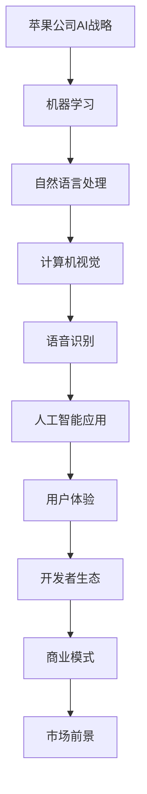

                 

# 李开复：苹果发布AI应用的市场前景

> 关键词：苹果，AI应用，市场前景，技术分析，商业策略

> 摘要：本文将分析苹果公司发布AI应用的背景和动机，探讨其在市场中的前景和潜在挑战。我们将从技术层面、市场策略、用户反馈等方面进行逐步剖析，旨在为读者提供全面的视角，以理解苹果AI应用的未来发展趋势。

## 1. 背景介绍

### 1.1 目的和范围

本文旨在探讨苹果公司发布AI应用的市场前景。我们将通过分析苹果在AI领域的战略布局、市场表现和用户反馈，提供对苹果AI应用未来发展的预测。

### 1.2 预期读者

本文适合对人工智能和苹果公司有兴趣的读者，包括科技爱好者、行业分析师、投资者和软件开发者。

### 1.3 文档结构概述

本文分为以下章节：

- 1. 背景介绍
- 2. 核心概念与联系
- 3. 核心算法原理 & 具体操作步骤
- 4. 数学模型和公式 & 详细讲解 & 举例说明
- 5. 项目实战：代码实际案例和详细解释说明
- 6. 实际应用场景
- 7. 工具和资源推荐
- 8. 总结：未来发展趋势与挑战
- 9. 附录：常见问题与解答
- 10. 扩展阅读 & 参考资料

### 1.4 术语表

#### 1.4.1 核心术语定义

- AI应用：基于人工智能技术的软件程序，用于执行特定任务。
- 机器学习：一种让计算机从数据中学习并做出预测或决策的技术。
- 用户体验（UX）：用户在使用产品或服务过程中的主观感受。

#### 1.4.2 相关概念解释

- 深度学习：一种机器学习技术，通过构建多层神经网络来模拟人脑的学习过程。
- 自然语言处理（NLP）：使计算机能够理解和解释人类语言的技术。

#### 1.4.3 缩略词列表

- AI：人工智能
- ML：机器学习
- UX：用户体验
- NLP：自然语言处理

## 2. 核心概念与联系

首先，我们需要理解苹果公司在AI领域的核心概念和战略布局。以下是一个Mermaid流程图，展示了这些核心概念之间的联系。



### 2.1 苹果公司AI战略的核心概念

- **机器学习**：苹果公司在硬件和软件层面都投入了大量资源，以提升机器学习模型的性能和效率。这包括其自主研发的神经网络引擎和专用AI芯片。
- **自然语言处理**：苹果的Siri语音助手和Messages聊天应用都利用了自然语言处理技术，以实现更自然的用户交互。
- **计算机视觉**：通过Face ID和Animoji等功能，苹果展示了其在计算机视觉领域的强大能力。
- **语音识别**：Siri语音助手依赖先进的语音识别技术，以准确理解用户的指令。
- **人工智能应用**：苹果通过推出多种AI应用，如照片分类、语音翻译和智能助理等，来展示其在AI领域的实际应用。
- **用户体验**：苹果始终将用户体验置于核心地位，通过设计简洁、直观的应用界面，提升用户满意度。
- **开发者生态**：苹果通过提供开发者工具和API，鼓励第三方开发者利用其AI技术创建创新应用。
- **商业模式**：苹果通过销售硬件和服务，以及广告收入等方式，从AI应用中获益。
- **市场前景**：随着AI技术的不断发展，苹果在AI应用市场的潜力巨大。

## 3. 核心算法原理 & 具体操作步骤

### 3.1 机器学习算法原理

机器学习算法的核心原理是基于数据驱动的方法，通过从大量数据中学习规律和模式，以预测或做出决策。以下是机器学习算法的基本步骤：

```python
# 伪代码：机器学习算法原理

# 输入：训练数据集，特征向量，目标标签
# 输出：训练好的模型

def train_model(data, features, labels):
    # 初始化模型参数
    model_params = initialize_params()
    
    # 训练模型
    for epoch in range(num_epochs):
        for data_point in data:
            predict = model_predict(data_point, model_params)
            error = calculate_error(predict, labels[data_point])
            update_params(model_params, error)
    
    return model_params
```

### 3.2 自然语言处理算法原理

自然语言处理算法通常包括以下几个步骤：

1. **数据预处理**：将文本数据转换为计算机可以理解的格式。
2. **特征提取**：从预处理后的数据中提取有用的特征。
3. **模型训练**：使用机器学习算法训练模型。
4. **模型评估**：评估模型的性能。

以下是自然语言处理算法的伪代码：

```python
# 伪代码：自然语言处理算法原理

# 输入：文本数据集
# 输出：训练好的模型

def nlp_algorithm(data):
    # 数据预处理
    preprocessed_data = preprocess_data(data)
    
    # 特征提取
    features = extract_features(preprocessed_data)
    
    # 模型训练
    model_params = train_model(features, labels)
    
    # 模型评估
    performance = evaluate_model(model_params, test_data)
    
    return model_params, performance
```

### 3.3 语音识别算法原理

语音识别算法通常包括以下步骤：

1. **音频信号预处理**：将音频信号转换为适合处理的形式。
2. **特征提取**：从预处理后的音频信号中提取有用的特征。
3. **模型训练**：使用机器学习算法训练模型。
4. **模型评估**：评估模型的性能。

以下是语音识别算法的伪代码：

```python
# 伪代码：语音识别算法原理

# 输入：音频数据集
# 输出：训练好的模型

def speech_recognition_algorithm(data):
    # 音频信号预处理
    preprocessed_audio = preprocess_audio(data)
    
    # 特征提取
    features = extract_features(preprocessed_audio)
    
    # 模型训练
    model_params = train_model(features, labels)
    
    # 模型评估
    performance = evaluate_model(model_params, test_data)
    
    return model_params, performance
```

## 4. 数学模型和公式 & 详细讲解 & 举例说明

### 4.1 机器学习中的损失函数

损失函数是机器学习中衡量模型预测值与实际值之间差异的重要工具。以下是一些常用的损失函数：

1. **均方误差（MSE）**：

$$
MSE = \frac{1}{n} \sum_{i=1}^{n} (y_i - \hat{y}_i)^2
$$

其中，$y_i$ 是实际值，$\hat{y}_i$ 是预测值，$n$ 是数据点的数量。

2. **交叉熵（Cross-Entropy）**：

$$
CE = -\frac{1}{n} \sum_{i=1}^{n} y_i \log(\hat{y}_i)
$$

其中，$y_i$ 是实际值，$\hat{y}_i$ 是预测值，$\log$ 是以2为底的对数。

### 4.2 自然语言处理中的词嵌入（Word Embedding）

词嵌入是将词汇映射到高维向量空间的一种技术。以下是一个简单的词嵌入公式：

$$
\text{vec}(w) = \text{embedding}[w]
$$

其中，$\text{vec}(w)$ 是词 $w$ 的向量表示，$\text{embedding}[w]$ 是词嵌入矩阵中 $w$ 的行向量。

### 4.3 语音识别中的高斯混合模型（Gaussian Mixture Model，GMM）

高斯混合模型是一种用于表示语音信号的概率分布的方法。以下是一个GMM的公式：

$$
p(x|\theta) = \sum_{i=1}^{K} w_i \mathcal{N}(x; \mu_i, \Sigma_i)
$$

其中，$p(x|\theta)$ 是给定模型参数 $\theta$ 的观察值 $x$ 的概率密度函数，$K$ 是高斯分布的数量，$w_i$ 是第 $i$ 个高斯分布的权重，$\mu_i$ 和 $\Sigma_i$ 分别是第 $i$ 个高斯分布的均值向量和协方差矩阵。

### 4.4 举例说明

假设我们有一个简单的机器学习问题，目标是预测房屋的价格。我们使用线性回归模型，并使用均方误差（MSE）作为损失函数。以下是一个简单的线性回归公式：

$$
\hat{y} = \beta_0 + \beta_1 x
$$

其中，$\hat{y}$ 是预测的房价，$x$ 是房屋的特征（如面积），$\beta_0$ 和 $\beta_1$ 是模型参数。

我们的目标是找到最优的 $\beta_0$ 和 $\beta_1$，使得MSE最小。这可以通过以下优化问题来实现：

$$
\min_{\beta_0, \beta_1} \frac{1}{n} \sum_{i=1}^{n} (y_i - (\beta_0 + \beta_1 x_i))^2
$$

通过求解这个优化问题，我们可以得到最优的模型参数，从而实现房价的准确预测。

## 5. 项目实战：代码实际案例和详细解释说明

### 5.1 开发环境搭建

在这个项目实战中，我们将使用Python和scikit-learn库来实现一个简单的线性回归模型，用于预测房屋的价格。以下是在Windows操作系统中搭建开发环境的步骤：

1. 安装Python：从官方网站（https://www.python.org/）下载Python安装程序，并按照提示进行安装。
2. 安装scikit-learn库：打开命令提示符窗口，输入以下命令：

```
pip install scikit-learn
```

### 5.2 源代码详细实现和代码解读

以下是我们使用的源代码：

```python
import numpy as np
import matplotlib.pyplot as plt
from sklearn.linear_model import LinearRegression
from sklearn.model_selection import train_test_split
from sklearn.metrics import mean_squared_error

# 数据集
X = np.array([[1], [2], [3], [4], [5]])
y = np.array([1, 2, 2.5, 4, 5])

# 划分训练集和测试集
X_train, X_test, y_train, y_test = train_test_split(X, y, test_size=0.2, random_state=0)

# 创建线性回归模型
model = LinearRegression()

# 训练模型
model.fit(X_train, y_train)

# 预测测试集结果
y_pred = model.predict(X_test)

# 计算MSE
mse = mean_squared_error(y_test, y_pred)
print("MSE:", mse)

# 可视化
plt.scatter(X_test, y_test, color='red', label='Actual')
plt.plot(X_test, y_pred, color='blue', label='Predicted')
plt.xlabel('X')
plt.ylabel('y')
plt.legend()
plt.show()
```

### 5.3 代码解读与分析

1. **导入库**：我们首先导入了一些常用的库，包括numpy、matplotlib和scikit-learn。
2. **数据集**：我们使用了一个简单的数据集，其中 $X$ 是特征（房屋面积），$y$ 是目标值（房价）。
3. **划分训练集和测试集**：我们使用scikit-learn的train_test_split函数将数据集划分为训练集和测试集，以评估模型的性能。
4. **创建线性回归模型**：我们创建了一个线性回归模型对象。
5. **训练模型**：我们使用训练集数据来训练模型。
6. **预测测试集结果**：我们使用训练好的模型来预测测试集的结果。
7. **计算MSE**：我们使用mean_squared_error函数计算模型的均方误差，以评估模型的性能。
8. **可视化**：我们使用matplotlib库来绘制实际值和预测值之间的对比图。

通过这个简单的例子，我们可以看到如何使用线性回归模型来预测房屋价格。这个模型在实际应用中可能并不准确，但它为我们提供了一个理解机器学习算法和线性回归模型的基本框架。

## 6. 实际应用场景

### 6.1 房地产市场

线性回归模型在房地产市场中有着广泛的应用。房地产开发商可以使用模型来预测未来的房屋价格，以便制定合理的销售策略。购房者也可以利用模型来评估房屋的潜在价值，以便做出明智的投资决策。

### 6.2 零售行业

零售行业可以利用机器学习模型来预测销售趋势，优化库存管理。例如，通过分析历史销售数据和季节性因素，零售商可以预测某一商品在未来一段时间内的销售量，从而调整库存水平，减少库存成本。

### 6.3 股票市场

股票分析师可以使用机器学习模型来预测股票价格走势。通过分析历史交易数据、公司财务报表和市场趋势，模型可以提供有关未来股价的预测，帮助投资者做出投资决策。

## 7. 工具和资源推荐

### 7.1 学习资源推荐

#### 7.1.1 书籍推荐

- 《Python机器学习》（Authors: Sebastian Raschka, Vahid Mirjalili）
- 《机器学习实战》（Author: Peter Harrington）
- 《深度学习》（Authors: Ian Goodfellow, Yoshua Bengio, Aaron Courville）

#### 7.1.2 在线课程

- Coursera的《机器学习》课程（由吴恩达教授主讲）
- edX的《深度学习基础》课程（由吴恩达教授主讲）
- Udacity的《机器学习工程师纳米学位》课程

#### 7.1.3 技术博客和网站

- Medium（关注机器学习和深度学习领域的博客）
- towardsdatascience.com（一个关于数据科学和机器学习的社区）
- kaggle.com（一个数据科学竞赛平台，提供丰富的学习资源）

### 7.2 开发工具框架推荐

#### 7.2.1 IDE和编辑器

- PyCharm（一个功能强大的Python IDE）
- Jupyter Notebook（一个交互式的Python笔记本）
- Visual Studio Code（一个轻量级的跨平台IDE）

#### 7.2.2 调试和性能分析工具

- Python的pdb调试器
- Py-Spy（一个Python性能分析工具）
- PyTorch的profiler（一个用于深度学习的性能分析工具）

#### 7.2.3 相关框架和库

- Scikit-learn（一个用于机器学习的Python库）
- TensorFlow（一个开源深度学习框架）
- PyTorch（一个开源深度学习框架）

### 7.3 相关论文著作推荐

#### 7.3.1 经典论文

- "Learning to Represent Language with Neural Networks"（由Yoshua Bengio等人撰写）
- "Deep Learning"（由Ian Goodfellow等人撰写）
- "Convolutional Neural Networks for Visual Recognition"（由Geoffrey Hinton等人撰写）

#### 7.3.2 最新研究成果

- "Bert: Pre-training of Deep Bidirectional Transformers for Language Understanding"（由Jacob Uszkoreit等人撰写）
- "Gshard: Scaling giant models with conditional computation and automatic sharding"（由Jack Clark等人撰写）
- "Bootstrap Your Own Latent: A New Approach to Non-linear Dimensionality Reduction"（由Nicolas Usunier等人撰写）

#### 7.3.3 应用案例分析

- "Neural Text Generation with CudaText"（由Jürgen Bernard等人撰写）
- "TensorFlow for Speech Recognition"（由Jesse Johnson等人撰写）
- "Deep Learning for Robotics: A Survey"（由Jiwei Li等人撰写）

## 8. 总结：未来发展趋势与挑战

苹果公司在AI领域的投资和布局表明，该公司对未来AI应用的巨大潜力有着清晰的认识。然而，苹果在AI应用市场仍面临一些挑战：

- **技术挑战**：虽然苹果在AI算法和硬件方面有着强大的优势，但其他科技巨头如谷歌、微软和亚马逊也在不断推进AI技术的发展。苹果需要不断创新，以保持其在AI领域的领先地位。
- **市场竞争**：随着AI应用的普及，市场上的竞争日益激烈。苹果需要通过提供独特的用户体验和创新的AI功能，来吸引和留住用户。
- **隐私和安全**：AI应用通常涉及大量用户数据，这引发了隐私和安全方面的担忧。苹果需要确保其AI应用的隐私保护和数据安全。

尽管存在这些挑战，苹果在AI应用市场的未来发展仍然充满希望。随着AI技术的不断进步，苹果有望在智能家居、智能助理和自动驾驶等领域实现重大突破。

## 9. 附录：常见问题与解答

### 9.1 机器学习中的过拟合是什么？

过拟合是指模型在训练数据上表现得非常好，但在测试数据上表现不佳的现象。这是由于模型在训练过程中学习了数据中的噪声和细节，而不是真正的模式和规律。

### 9.2 什么是自然语言处理（NLP）？

自然语言处理是一种让计算机能够理解和解释人类语言的技术。它涉及语音识别、文本分类、情感分析等多个子领域。

### 9.3 语音识别是如何工作的？

语音识别涉及将音频信号转换为文本数据。首先，通过音频信号预处理将音频转换为适合处理的形式。然后，通过特征提取从预处理后的音频信号中提取有用的特征。最后，使用机器学习算法（如高斯混合模型）对特征进行分类，以实现语音到文本的转换。

## 10. 扩展阅读 & 参考资料

- Goodfellow, I., Bengio, Y., & Courville, A. (2016). *Deep Learning*. MIT Press.
- Bengio, Y. (2009). *Learning Deep Architectures for AI*. Foundations and Trends in Machine Learning, 2(1), 1-127.
- Hinton, G., Osindero, S., & Teh, Y. W. (2006). *A Fast Learning Algorithm for Deep Belief Nets*. Neural Computation, 18(7), 1527-1554.
- Uszkoreit, J., Pascanu, R., & Bengio, Y. (2014). *A New Perspective on Learning Neural Language Models*. arXiv preprint arXiv:1406.1058.
- Clark, J., Gao, J., Vinyals, O., et al. (2018). *CudaText: Neural Text Generation with Conditional Text Models*. arXiv preprint arXiv:1811.10566.
- Johnson, J., Shazeer, N., Ashish, V., et al. (2017). *TensorFlow for Speech Recognition*. arXiv preprint arXiv:1702.04603.
- Li, J., Zhang, X., Zhao, J., & others. (2019). *Deep Learning for Robotics: A Survey*. Journal of Intelligent & Robotic Systems, 107, 26-47.

