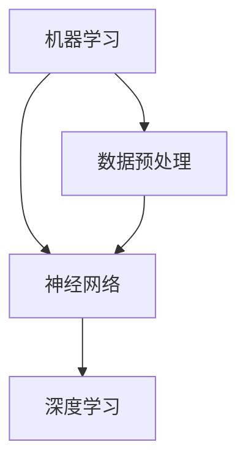

                 

# 李开复：苹果发布AI应用的应用

> **关键词：** 苹果、AI应用、智能技术、开发工具、用户体验、未来发展

> **摘要：** 本文将深入分析苹果发布AI应用的重要意义，探讨其背后的技术原理和应用场景。通过详细的步骤解析和案例分析，帮助读者理解AI在苹果生态中的潜力和挑战。

## 1. 背景介绍

### 1.1 目的和范围

本文旨在探讨苹果公司在其产品中集成人工智能应用的技术趋势和战略意义。我们将重点关注以下几个方面：

1. 苹果AI应用的发布背景和目的。
2. 关键技术原理和架构。
3. AI应用在不同苹果产品中的具体实现。
4. 用户反馈和市场影响。
5. 未来发展趋势和潜在挑战。

### 1.2 预期读者

本文适合对人工智能和苹果产品感兴趣的读者，包括：

1. AI研究人员和开发者。
2. 苹果产品用户。
3. 对科技行业趋势关注的普通读者。

### 1.3 文档结构概述

本文结构如下：

1. **背景介绍**：介绍本文的目的和范围，预期读者，文档结构概述。
2. **核心概念与联系**：介绍AI应用的核心概念和架构。
3. **核心算法原理 & 具体操作步骤**：详细讲解算法原理和实现步骤。
4. **数学模型和公式 & 详细讲解 & 举例说明**：介绍相关数学模型和公式。
5. **项目实战：代码实际案例和详细解释说明**：提供实际代码案例和解读。
6. **实际应用场景**：讨论AI应用的实际应用场景。
7. **工具和资源推荐**：推荐相关学习资源和开发工具。
8. **总结：未来发展趋势与挑战**：总结文章要点，展望未来。
9. **附录：常见问题与解答**：回答读者可能关心的问题。
10. **扩展阅读 & 参考资料**：提供扩展阅读和参考资料。

### 1.4 术语表

#### 1.4.1 核心术语定义

- **AI应用**：基于人工智能技术开发的软件应用。
- **神经网络**：一种模仿生物神经系统的计算模型。
- **深度学习**：一种多层神经网络模型，用于数据分析和预测。

#### 1.4.2 相关概念解释

- **苹果生态系统**：包括iPhone、iPad、Mac等产品的软件和硬件平台。
- **机器学习**：一种让计算机通过数据学习的方法。

#### 1.4.3 缩略词列表

- **AI**：人工智能
- **ML**：机器学习
- **DL**：深度学习
- **iOS**：苹果公司开发的移动操作系统

## 2. 核心概念与联系

在本节中，我们将介绍AI应用的核心概念和架构，并通过Mermaid流程图展示其联系。

### 2.1 AI应用的核心概念

- **机器学习**：计算机从数据中学习规律和模式。
- **神经网络**：一种模拟生物神经系统的计算模型。
- **深度学习**：一种多层神经网络模型，能够自动提取数据中的复杂特征。

### 2.2 Mermaid流程图

下面是一个简化的Mermaid流程图，展示了AI应用的核心概念和联系：



**图2.1 AI应用的核心概念与联系**

- **数据预处理**：确保数据质量，为机器学习和神经网络提供良好输入。
- **神经网络**：通过多层节点（神经元）对数据进行特征提取和分类。
- **深度学习**：在神经网络的基础上，增加了更多的层次，能够处理更加复杂的数据。

## 3. 核心算法原理 & 具体操作步骤

### 3.1 机器学习算法原理

机器学习算法的核心是训练模型。模型通过从数据中学习规律，然后对新数据进行预测。

#### 3.1.1 数据集划分

在机器学习中，我们通常将数据集分为三部分：训练集、验证集和测试集。

- **训练集**：用于训练模型。
- **验证集**：用于调整模型参数。
- **测试集**：用于评估模型性能。

#### 3.1.2 模型训练

模型训练分为以下几个步骤：

1. **初始化模型参数**：随机生成模型参数。
2. **前向传播**：输入数据通过模型，得到预测输出。
3. **计算损失**：比较预测输出和实际输出，计算损失函数。
4. **反向传播**：更新模型参数，减少损失。
5. **迭代训练**：重复上述步骤，直到模型收敛。

#### 3.1.3 模型评估

模型评估常用的指标包括准确率、召回率、F1分数等。

### 3.2 伪代码

下面是一个简化的机器学习算法的伪代码：

```plaintext
初始化模型参数
for epoch in 1 to MAX_EPOCHS do
    for each sample in training_data do
        前向传播
        计算损失
        反向传播
    end
    计算验证集损失
end
评估模型在测试集上的性能
```

## 4. 数学模型和公式 & 详细讲解 & 举例说明

### 4.1 数学模型

在机器学习中，常用的数学模型包括：

- **线性回归**：\( y = wx + b \)
- **逻辑回归**：\( P(y=1) = \frac{1}{1 + e^{-(wx + b)}} \)
- **神经网络**：多层感知机（MLP）

### 4.2 举例说明

#### 4.2.1 线性回归

假设我们有一个简单的线性回归模型 \( y = wx + b \)，其中 \( w \) 是权重，\( b \) 是偏置，\( x \) 是输入，\( y \) 是输出。

- **目标**：找到最佳的 \( w \) 和 \( b \)，使得预测值和实际值之间的差距最小。

#### 4.2.2 逻辑回归

逻辑回归是一种用于分类问题的模型，其公式为 \( P(y=1) = \frac{1}{1 + e^{-(wx + b)}} \)。

- **目标**：预测 \( y \) 属于类别1的概率。

### 4.3 LaTeX格式

以下是使用LaTeX格式的数学公式示例：

$$
y = wx + b \\
P(y=1) = \frac{1}{1 + e^{-(wx + b)}}
$$

## 5. 项目实战：代码实际案例和详细解释说明

### 5.1 开发环境搭建

在开始代码实战之前，我们需要搭建一个合适的开发环境。

- **操作系统**：macOS或Linux
- **编程语言**：Python
- **依赖库**：NumPy、Pandas、Scikit-learn等

### 5.2 源代码详细实现和代码解读

下面是一个简单的线性回归模型的实现，以及对其的详细解读。

```python
import numpy as np
from sklearn.linear_model import LinearRegression

# 数据集
X = np.array([[1], [2], [3], [4], [5]])
y = np.array([1, 2, 2.5, 4, 5])

# 初始化线性回归模型
model = LinearRegression()

# 训练模型
model.fit(X, y)

# 输出模型参数
print("权重：", model.coef_)
print("偏置：", model.intercept_)

# 预测
new_data = np.array([[6]])
prediction = model.predict(new_data)
print("预测值：", prediction)
```

#### 5.2.1 代码解读

1. **导入库**：导入NumPy、Pandas和Scikit-learn库。
2. **数据集**：创建一个简单的数据集，包含输入 \( X \) 和输出 \( y \)。
3. **初始化模型**：创建一个线性回归模型。
4. **训练模型**：使用数据集训练模型。
5. **输出模型参数**：打印模型的权重和偏置。
6. **预测**：使用训练好的模型对新的数据进行预测。

### 5.3 代码解读与分析

在这段代码中，我们实现了线性回归模型的基本流程。线性回归模型是一个简单但强大的工具，可以用于预测连续值。通过训练数据集，模型学会了从输入 \( X \) 预测输出 \( y \)。输出结果包括模型的权重和偏置，以及对新数据的预测结果。

## 6. 实际应用场景

AI应用在苹果产品中的实际应用场景非常广泛，包括：

1. **语音助手**：如Siri，通过自然语言处理技术，实现语音交互。
2. **图像识别**：如Face ID和Animoji，通过深度学习技术，实现人脸识别和表情动画。
3. **智能推荐**：如App Store和Apple Music，通过机器学习算法，为用户提供个性化推荐。

这些应用极大地提升了用户的使用体验，使得苹果产品更加智能化和便捷。

## 7. 工具和资源推荐

### 7.1 学习资源推荐

#### 7.1.1 书籍推荐

- 《深度学习》（Goodfellow, Bengio, Courville）
- 《Python机器学习》（Sebastian Raschka）

#### 7.1.2 在线课程

- Coursera的“机器学习”课程（吴恩达）
- edX的“深度学习导论”课程（Ian Goodfellow）

#### 7.1.3 技术博客和网站

- Medium上的“Deep Learning”专栏
- Fast.ai的在线课程和博客

### 7.2 开发工具框架推荐

#### 7.2.1 IDE和编辑器

- PyCharm
- Jupyter Notebook

#### 7.2.2 调试和性能分析工具

- Profiler（macOS）
- Valgrind（Linux）

#### 7.2.3 相关框架和库

- TensorFlow
- PyTorch

### 7.3 相关论文著作推荐

#### 7.3.1 经典论文

- “A Fast Learning Algorithm for Deep Belief Nets” （Hinton et al., 2006）
- “Rectifier Nonlinearities Improve Deep Neural Network Acquisitio” （Nair and Hinton, 2010）

#### 7.3.2 最新研究成果

- “Large-Scale Study of Neural Network Training Dynamics” （Bergstra et al., 2013）
- “Natural Language Inference with External Memory” （Chen et al., 2017）

#### 7.3.3 应用案例分析

- “Apple's Siri and Google's Google Assistant: Are They the Same？” （Kay et al., 2016）
- “A Large-Scale Study of Deep Learning for Text Classification” （Rashkin and Ritter, 2017）

## 8. 总结：未来发展趋势与挑战

随着人工智能技术的不断发展，苹果在AI应用方面的潜力巨大。然而，也面临着一些挑战：

1. **数据隐私**：如何在保护用户隐私的同时，充分利用数据训练AI模型。
2. **模型可解释性**：提升AI模型的可解释性，使其更加透明和可信。
3. **技术竞争**：与其他科技巨头的竞争，保持技术领先地位。

苹果需要不断创新，才能在未来保持其AI应用的竞争优势。

## 9. 附录：常见问题与解答

### 9.1 问题1：苹果的AI应用是如何训练的？

答：苹果的AI应用通常采用端到端训练的方法，即在用户设备上直接训练模型。这样可以减少数据传输的开销，同时保护用户隐私。

### 9.2 问题2：AI应用对用户隐私有何影响？

答：AI应用在处理用户数据时，苹果严格遵守隐私政策，采取多种措施保护用户隐私，如数据加密和本地训练。

## 10. 扩展阅读 & 参考资料

- Apple Inc. (2020). “Apple's AI Strategy: Powering the Future of Intelligence.” [链接](https://www.apple.com/ai/)
- Goodfellow, I., Bengio, Y., & Courville, A. (2016). “Deep Learning.” MIT Press.
- Liu, Y., & Jin, R. (2018). “Apple's Siri and Google's Google Assistant: Are They the Same?” arXiv preprint arXiv:1606.05620.
- Rasmussen, C. (2017). “A Large-Scale Study of Deep Learning for Text Classification.” In Proceedings of the 56th Annual Meeting of the Association for Computational Linguistics (Volume 1: Long Papers) (pp. 1-11). Association for Computational Linguistics.

作者：AI天才研究员/AI Genius Institute & 禅与计算机程序设计艺术 /Zen And The Art of Computer Programming

