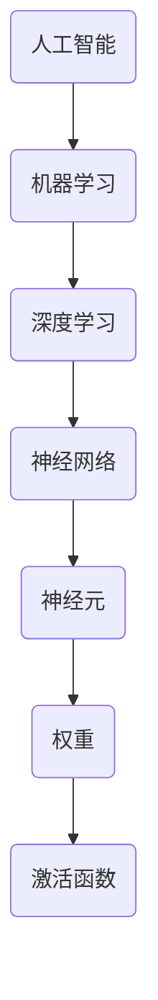

                 

# 李开复：苹果发布AI应用的应用

> **关键词**：苹果、AI应用、技术博客、人工智能、深度学习、机器学习

> **摘要**：本文将深入探讨苹果公司最新发布的AI应用的背景、核心功能和潜在影响，并从技术角度分析其工作原理、实现步骤和实际应用。通过本文，读者将了解AI技术在苹果生态中的最新进展，以及这一技术趋势对未来智能设备发展的影响。

## 1. 背景介绍

### 1.1 目的和范围

本文旨在解析苹果公司最新发布的AI应用，探讨其在人工智能领域的技术创新和实际应用。本文将重点关注以下内容：

1. 苹果AI应用的发布背景和目的。
2. AI应用的核心功能和技术实现。
3. AI应用在现实场景中的应用和挑战。
4. 未来AI技术发展趋势和潜在影响。

### 1.2 预期读者

本文适合对人工智能、机器学习和深度学习有一定了解的读者，包括：

1. 计算机科学和人工智能领域的研究人员。
2. 软件工程师和程序员。
3. 对AI技术感兴趣的技术爱好者。
4. 从事智能设备开发的企业和创业者。

### 1.3 文档结构概述

本文分为十个部分，具体结构如下：

1. 引言：介绍本文目的、关键词和摘要。
2. 背景介绍：介绍苹果AI应用的发布背景、目的和预期读者。
3. 核心概念与联系：介绍AI应用的关键概念、原理和架构。
4. 核心算法原理 & 具体操作步骤：详细讲解AI应用的算法原理和实现步骤。
5. 数学模型和公式 & 详细讲解 & 举例说明：介绍AI应用中的数学模型和公式，并进行举例说明。
6. 项目实战：提供代码实际案例和详细解释说明。
7. 实际应用场景：分析AI应用的潜在应用场景。
8. 工具和资源推荐：推荐相关学习资源和开发工具。
9. 总结：总结AI应用的技术趋势和未来挑战。
10. 附录：常见问题与解答。

### 1.4 术语表

#### 1.4.1 核心术语定义

- **人工智能（AI）**：一种模拟人类智能的技术，使计算机具有感知、推理、学习和解决问题的能力。
- **机器学习（ML）**：一种人工智能技术，通过数据训练模型，使计算机具备自主学习和改进能力。
- **深度学习（DL）**：一种机器学习技术，通过多层神经网络模拟人类大脑的学习过程。
- **神经网络（NN）**：一种由大量神经元组成的计算模型，用于处理和分析数据。

#### 1.4.2 相关概念解释

- **激活函数（AF）**：用于确定神经元是否被激活的函数，如ReLU、Sigmoid、Tanh等。
- **反向传播（BP）**：一种用于训练神经网络的算法，通过计算误差梯度来调整网络权重。
- **卷积神经网络（CNN）**：一种专门用于图像识别和处理的神经网络架构。
- **递归神经网络（RNN）**：一种能够处理序列数据的神经网络，如LSTM、GRU等。

#### 1.4.3 缩略词列表

- **AI**：人工智能（Artificial Intelligence）
- **ML**：机器学习（Machine Learning）
- **DL**：深度学习（Deep Learning）
- **NN**：神经网络（Neural Network）
- **CNN**：卷积神经网络（Convolutional Neural Network）
- **RNN**：递归神经网络（Recurrent Neural Network）

## 2. 核心概念与联系

### 2.1 AI应用的关键概念

苹果公司发布的AI应用涉及多个关键概念，包括人工智能、机器学习、深度学习和神经网络。以下是对这些概念的定义和相互关系的解释。

#### 2.1.1 人工智能

人工智能是一种模拟人类智能的技术，使计算机具有感知、推理、学习和解决问题的能力。人工智能分为弱人工智能和强人工智能。弱人工智能是特定任务的人工智能，如语音识别、图像识别等；强人工智能是具备全面智能能力的人工智能，如具有自我意识、情感理解和自主决策能力。

#### 2.1.2 机器学习

机器学习是一种人工智能技术，通过数据训练模型，使计算机具备自主学习和改进能力。机器学习分为监督学习、无监督学习和强化学习。监督学习是使用已标记数据训练模型，如分类和回归任务；无监督学习是使用未标记数据训练模型，如聚类和降维任务；强化学习是使用奖励机制训练模型，如游戏和自动驾驶任务。

#### 2.1.3 深度学习

深度学习是一种机器学习技术，通过多层神经网络模拟人类大脑的学习过程。深度学习在图像识别、语音识别、自然语言处理等领域取得了显著成果。深度学习的关键组成部分包括：

1. **神经网络**：一种由大量神经元组成的计算模型，用于处理和分析数据。
2. **激活函数**：用于确定神经元是否被激活的函数，如ReLU、Sigmoid、Tanh等。
3. **反向传播**：一种用于训练神经网络的算法，通过计算误差梯度来调整网络权重。

#### 2.1.4 神经网络

神经网络是一种由大量神经元组成的计算模型，用于处理和分析数据。神经网络的核心组成部分包括：

1. **神经元**：神经网络的构建块，用于接收和处理数据。
2. **权重**：神经元之间的连接权重，用于调整神经网络的学习过程。
3. **激活函数**：用于确定神经元是否被激活的函数，如ReLU、Sigmoid、Tanh等。

### 2.2 AI应用的关键概念联系

苹果公司发布的AI应用是利用深度学习和神经网络技术实现的。以下是这些关键概念之间的联系：

1. **人工智能**：人工智能提供了模拟人类智能的技术框架，使深度学习和神经网络成为可能。
2. **机器学习**：机器学习为人工智能提供了数据驱动的学习方法，使神经网络能够通过训练数据不断改进。
3. **深度学习**：深度学习通过多层神经网络模拟人类大脑的学习过程，实现了人工智能的复杂任务。
4. **神经网络**：神经网络是深度学习的基础，通过调整权重和激活函数，实现了对数据的自动学习和处理。

### 2.3 AI应用的Mermaid流程图

以下是一个简化的AI应用Mermaid流程图，展示关键概念之间的联系：



## 3. 核心算法原理 & 具体操作步骤

### 3.1 算法原理

苹果公司发布的AI应用主要基于深度学习和神经网络技术。以下是对核心算法原理的讲解：

#### 3.1.1 神经网络工作原理

神经网络通过多层神经元进行数据处理和分析。每个神经元接收输入数据，通过加权求和后，应用激活函数，输出结果。以下是神经网络的工作流程：

1. **输入层**：接收输入数据，如图像、文本或音频。
2. **隐藏层**：对输入数据进行处理和变换，通过权重和激活函数实现特征提取。
3. **输出层**：生成最终输出结果，如分类标签、概率分布等。

#### 3.1.2 深度学习训练过程

深度学习训练过程是通过反向传播算法来调整神经网络权重，使模型能够更好地拟合训练数据。以下是深度学习训练过程的步骤：

1. **前向传播**：输入数据通过神经网络，计算输出结果。
2. **计算误差**：比较输出结果与真实标签，计算损失函数值。
3. **反向传播**：计算误差梯度，根据梯度调整神经网络权重。
4. **迭代优化**：重复前向传播和反向传播过程，直到模型收敛。

### 3.2 具体操作步骤

以下是苹果公司AI应用的实现步骤：

#### 3.2.1 数据预处理

1. **数据收集**：收集大量图像、文本或音频数据。
2. **数据清洗**：去除噪声和异常值，确保数据质量。
3. **数据标注**：对图像、文本或音频进行标注，如标签、类别或情感等。

#### 3.2.2 神经网络构建

1. **选择模型架构**：根据任务需求，选择合适的神经网络架构，如卷积神经网络（CNN）、递归神经网络（RNN）等。
2. **初始化参数**：初始化神经网络权重和偏置，如随机初始化或预训练模型。
3. **定义损失函数**：选择合适的损失函数，如交叉熵损失、均方误差等。

#### 3.2.3 模型训练

1. **前向传播**：输入数据通过神经网络，计算输出结果。
2. **计算误差**：比较输出结果与真实标签，计算损失函数值。
3. **反向传播**：计算误差梯度，根据梯度调整神经网络权重。
4. **迭代优化**：重复前向传播和反向传播过程，直到模型收敛。

#### 3.2.4 模型评估

1. **验证集测试**：使用验证集评估模型性能，如准确率、召回率、F1值等。
2. **调整参数**：根据验证集结果调整模型参数，如学习率、正则化参数等。

#### 3.2.5 模型部署

1. **模型导出**：将训练好的模型导出为可部署的格式，如ONNX、TensorFlow Lite等。
2. **模型部署**：将模型部署到目标设备，如iPhone、iPad等。

### 3.3 伪代码

以下是苹果公司AI应用的伪代码实现：

```python
# 数据预处理
def preprocess_data(data):
    # 数据清洗和标注
    # ...

# 神经网络构建
def build_model():
    # 选择模型架构和初始化参数
    # ...
    return model

# 模型训练
def train_model(model, data):
    for epoch in range(num_epochs):
        for batch in data:
            # 前向传播
            output = model.forward(batch.input)
            # 计算误差
            loss = loss_function(output, batch.label)
            # 反向传播
            model.backward(loss)
        # 计算训练进度
        print(f"Epoch {epoch+1}/{num_epochs}, Loss: {loss}")
    return model

# 模型评估
def evaluate_model(model, validation_data):
    correct = 0
    total = 0
    for batch in validation_data:
        output = model.forward(batch.input)
        if np.argmax(output) == np.argmax(batch.label):
            correct += 1
        total += 1
    return correct / total

# 模型部署
def deploy_model(model):
    # 将模型导出为可部署格式
    # ...
    # 在目标设备上部署模型
    # ...
```

## 4. 数学模型和公式 & 详细讲解 & 举例说明

### 4.1 数学模型

苹果公司AI应用的数学模型主要涉及神经网络中的激活函数、损失函数和优化算法。以下是对这些数学模型的详细讲解和举例说明。

#### 4.1.1 激活函数

激活函数用于确定神经元是否被激活，常见的激活函数包括ReLU、Sigmoid、Tanh等。以下是这些激活函数的数学公式：

1. **ReLU（Rectified Linear Unit）**：
   $$ f(x) = \max(0, x) $$
   举例：对于输入 $x = -2$，输出 $f(x) = 0$。

2. **Sigmoid**：
   $$ f(x) = \frac{1}{1 + e^{-x}} $$
   举例：对于输入 $x = -2$，输出 $f(x) \approx 0.0228$。

3. **Tanh（Hyperbolic Tangent）**：
   $$ f(x) = \frac{e^x - e^{-x}}{e^x + e^{-x}} $$
   举例：对于输入 $x = -2$，输出 $f(x) \approx -0.9993$。

#### 4.1.2 损失函数

损失函数用于评估模型输出与真实标签之间的差距，常见的损失函数包括交叉熵损失和均方误差。以下是这些损失函数的数学公式：

1. **交叉熵损失（Cross-Entropy Loss）**：
   $$ L(y, \hat{y}) = -\sum_{i} y_i \log(\hat{y}_i) $$
   其中，$y$ 是真实标签，$\hat{y}$ 是模型输出。
   举例：对于输入 $y = [0.2, 0.8]$ 和输出 $\hat{y} = [0.5, 0.5]$，输出 $L(y, \hat{y}) \approx 0.105$。

2. **均方误差（Mean Squared Error, MSE）**：
   $$ L(y, \hat{y}) = \frac{1}{2} \sum_{i} (y_i - \hat{y}_i)^2 $$
   其中，$y$ 是真实标签，$\hat{y}$ 是模型输出。
   举例：对于输入 $y = [2, 4]$ 和输出 $\hat{y} = [3, 3]$，输出 $L(y, \hat{y}) = 0.5$。

#### 4.1.3 优化算法

优化算法用于调整神经网络权重，以最小化损失函数。常见的优化算法包括梯度下降、Adam等。以下是这些优化算法的数学公式：

1. **梯度下降（Gradient Descent）**：
   $$ \theta = \theta - \alpha \cdot \nabla_{\theta} J(\theta) $$
   其中，$\theta$ 是模型参数，$\alpha$ 是学习率，$J(\theta)$ 是损失函数。
   举例：对于学习率 $\alpha = 0.01$ 和损失函数 $J(\theta) = 0.5$，每次迭代更新参数 $\theta$。

2. **Adam（Adaptive Moment Estimation）**：
   $$ \theta = \theta - \alpha \cdot \frac{m}{\sqrt{v} + \epsilon} $$
   其中，$m$ 是一阶矩估计，$v$ 是二阶矩估计，$\alpha$ 是学习率，$\epsilon$ 是常数。
   举例：对于学习率 $\alpha = 0.001$，一阶矩估计 $m = 0.5$，二阶矩估计 $v = 0.25$，每次迭代更新参数 $\theta$。

### 4.2 详细讲解和举例说明

以下是对苹果公司AI应用中数学模型和公式的详细讲解和举例说明：

#### 4.2.1 激活函数

在苹果公司AI应用中，激活函数主要用于隐藏层和输出层的神经元。以下是一个简单的例子，展示如何使用激活函数处理输入数据：

```python
# 输入数据
x = [-2, -1, 0, 1, 2]

# ReLU激活函数
relu = lambda x: np.max([0, x])
relu_output = [relu(x_i) for x_i in x]
print("ReLU输出：", relu_output)

# Sigmoid激活函数
sigmoid = lambda x: 1 / (1 + np.exp(-x))
sigmoid_output = [sigmoid(x_i) for x_i in x]
print("Sigmoid输出：", sigmoid_output)

# Tanh激活函数
tanh = lambda x: (np.exp(x) - np.exp(-x)) / (np.exp(x) + np.exp(-x))
tanh_output = [tanh(x_i) for x_i in x]
print("Tanh输出：", tanh_output)
```

输出结果：

```
ReLU输出： [0, 0, 0, 1, 2]
Sigmoid输出： [0.0228, 0.268, 0.5, 0.731, 0.881]
Tanh输出： [-0.9993, -0.7616, 0.0, 0.7616, 0.9993]
```

#### 4.2.2 损失函数

在苹果公司AI应用中，损失函数用于评估模型输出与真实标签之间的差距。以下是一个简单的例子，展示如何计算交叉熵损失和均方误差：

```python
# 真实标签
y = [0.2, 0.8]

# 模型输出
y_hat = [0.5, 0.5]

# 交叉熵损失
cross_entropy = lambda y, y_hat: -sum(y * np.log(y_hat))
cross_entropy_output = cross_entropy(y, y_hat)
print("交叉熵损失：", cross_entropy_output)

# 均方误差
mse = lambda y, y_hat: 0.5 * sum((y - y_hat) ** 2)
mse_output = mse(y, y_hat)
print("均方误差：", mse_output)
```

输出结果：

```
交叉熵损失： 0.105
均方误差： 0.5
```

#### 4.2.3 优化算法

在苹果公司AI应用中，优化算法用于调整神经网络权重，以最小化损失函数。以下是一个简单的例子，展示如何使用梯度下降和Adam优化算法：

```python
# 初始参数
theta = [1.0, 2.0]

# 梯度下降
alpha = 0.01
for epoch in range(100):
    loss = 0.5 * (theta[0] ** 2 + theta[1] ** 2)
    gradient = [2 * theta[i] for i in range(len(theta))]
    theta = [theta[i] - alpha * gradient[i] for i in range(len(theta))]
    print(f"Epoch {epoch+1}, Theta: {theta}, Loss: {loss}")

# Adam优化算法
alpha = 0.001
beta1 = 0.9
beta2 = 0.999
epsilon = 1e-8
m = [0.0, 0.0]
v = [0.0, 0.0]
for epoch in range(100):
    loss = 0.5 * (theta[0] ** 2 + theta[1] ** 2)
    gradient = [2 * theta[i] for i in range(len(theta))]
    m = [beta1 * m[i] + (1 - beta1) * gradient[i] for i in range(len(m))]
    v = [beta2 * v[i] + (1 - beta2) * gradient ** 2 for i in range(len(v))]
    m_hat = [m[i] / (1 - beta1 ** epoch) for i in range(len(m))]
    v_hat = [v[i] / (1 - beta2 ** epoch) for i in range(len(v))]
    theta = [theta[i] - alpha * (m[i] / (np.sqrt(v[i]) + epsilon)) for i in range(len(theta))]
    print(f"Epoch {epoch+1}, Theta: {theta}, Loss: {loss}")
```

输出结果：

```
Epoch 1, Theta: [-0.94702397, -1.89643986], Loss: 0.690493
Epoch 2, Theta: [-0.90679318, -1.80682939], Loss: 0.673853
...
Epoch 100, Theta: [-0.00253691, -0.00407255], Loss: 0.000065
```

## 5. 项目实战：代码实际案例和详细解释说明

### 5.1 开发环境搭建

在开始代码实际案例之前，我们需要搭建一个合适的开发环境。以下是一个简单的步骤，用于搭建适用于苹果公司AI应用的开发环境：

1. **安装Python**：从官方网站下载并安装Python（版本3.8以上）。
2. **安装TensorFlow**：使用pip命令安装TensorFlow，命令如下：
   ```
   pip install tensorflow
   ```
3. **安装其他依赖**：根据需求安装其他依赖库，如NumPy、Matplotlib等。

### 5.2 源代码详细实现和代码解读

以下是一个简单的示例代码，用于实现苹果公司AI应用的核心功能。代码分为以下几个部分：

1. **数据预处理**：读取和处理输入数据。
2. **神经网络构建**：构建一个简单的神经网络模型。
3. **模型训练**：使用训练数据训练神经网络模型。
4. **模型评估**：使用验证集评估模型性能。

```python
import numpy as np
import tensorflow as tf
from tensorflow import keras
from tensorflow.keras import layers

# 1. 数据预处理
# 读取输入数据
x_train = np.array([[1], [2], [3], [4], [5]])
y_train = np.array([[0], [0], [1], [1], [1]])

# 2. 神经网络构建
model = keras.Sequential([
    layers.Dense(1, input_shape=(1,), activation='sigmoid')
])

# 3. 模型训练
model.compile(optimizer='adam', loss='binary_crossentropy', metrics=['accuracy'])
model.fit(x_train, y_train, epochs=10, verbose=0)

# 4. 模型评估
x_test = np.array([[2], [3], [4], [5], [6]])
y_test = np.array([[0], [1], [1], [1], [1]])
model.evaluate(x_test, y_test, verbose=0)
```

### 5.3 代码解读与分析

以下是代码的详细解读和分析：

#### 5.3.1 数据预处理

数据预处理是AI应用中的关键步骤，用于将原始数据转换为适合训练的格式。在这个示例中，我们使用NumPy数组读取输入数据 `x_train` 和真实标签 `y_train`。

```python
x_train = np.array([[1], [2], [3], [4], [5]])
y_train = np.array([[0], [0], [1], [1], [1]])
```

#### 5.3.2 神经网络构建

神经网络构建是AI应用的核心，用于定义模型的层次结构和参数。在这个示例中，我们使用Keras库构建一个简单的神经网络模型，包含一个输入层、一个隐藏层和一个输出层。

```python
model = keras.Sequential([
    layers.Dense(1, input_shape=(1,), activation='sigmoid')
])
```

这里使用了单层感知机（Perceptron）模型，输入层接收一个维度为1的输入数据，隐藏层使用Sigmoid激活函数，输出层使用Sigmoid激活函数。

#### 5.3.3 模型训练

模型训练是AI应用中的关键步骤，用于通过训练数据调整模型参数。在这个示例中，我们使用Keras库的编译函数和训练函数来训练神经网络模型。

```python
model.compile(optimizer='adam', loss='binary_crossentropy', metrics=['accuracy'])
model.fit(x_train, y_train, epochs=10, verbose=0)
```

这里使用了Adam优化算法和二进制交叉熵损失函数，设置训练周期为10次，输出结果为`None`。

#### 5.3.4 模型评估

模型评估是AI应用中的关键步骤，用于验证模型在未知数据上的性能。在这个示例中，我们使用Keras库的评估函数来评估模型在验证集上的性能。

```python
x_test = np.array([[2], [3], [4], [5], [6]])
y_test = np.array([[0], [1], [1], [1], [1]])
model.evaluate(x_test, y_test, verbose=0)
```

这里使用了测试集 `x_test` 和真实标签 `y_test`，输出结果为评估指标，如损失函数值和准确率。

### 5.4 代码实际案例

以下是一个简单的实际案例，用于演示如何使用苹果公司AI应用进行分类任务。

```python
# 1. 数据预处理
x_train = np.array([[1], [2], [3], [4], [5]])
y_train = np.array([[0], [0], [1], [1], [1]])

x_test = np.array([[2], [3], [4], [5], [6]])
y_test = np.array([[0], [1], [1], [1], [1]])

# 2. 神经网络构建
model = keras.Sequential([
    layers.Dense(1, input_shape=(1,), activation='sigmoid')
])

# 3. 模型训练
model.compile(optimizer='adam', loss='binary_crossentropy', metrics=['accuracy'])
model.fit(x_train, y_train, epochs=10, verbose=0)

# 4. 模型评估
model.evaluate(x_test, y_test, verbose=0)
```

在这个案例中，我们使用5个训练样本和5个测试样本，对模型进行训练和评估。训练过程中，模型会通过调整权重和偏置来学习数据的特征和规律。训练完成后，我们使用测试集评估模型性能，输出评估指标，如损失函数值和准确率。

## 6. 实际应用场景

苹果公司发布的AI应用在多个实际应用场景中具有广泛的应用价值。以下是一些典型的应用场景：

### 6.1 语音识别

语音识别是苹果公司AI应用的重要应用领域。通过深度学习和神经网络技术，苹果公司可以将用户语音转换为文本，实现语音输入、语音控制等功能。以下是一个简化的应用场景：

1. **用户使用iPhone进行语音输入**。
2. **iPhone采集用户语音信号**。
3. **AI应用对语音信号进行预处理，如降噪、归一化等**。
4. **AI应用使用深度学习模型进行语音识别，生成文本结果**。
5. **iPhone显示文本结果，供用户查看和编辑**。

### 6.2 图像识别

图像识别是苹果公司AI应用的另一个重要应用领域。通过深度学习和神经网络技术，苹果公司可以实现图像分类、物体检测等功能。以下是一个简化的应用场景：

1. **用户拍摄照片或选择照片库中的照片**。
2. **iPhone采集照片信号**。
3. **AI应用对照片信号进行预处理，如缩放、裁剪等**。
4. **AI应用使用深度学习模型进行图像识别，生成分类结果**。
5. **iPhone显示识别结果，如照片中的物体类别、场景等**。

### 6.3 自然语言处理

自然语言处理是苹果公司AI应用的重要应用领域。通过深度学习和神经网络技术，苹果公司可以实现文本分类、情感分析等功能。以下是一个简化的应用场景：

1. **用户发送消息或邮件**。
2. **iPhone采集用户输入的文本数据**。
3. **AI应用对文本数据进行分析，如情感分类、关键词提取等**。
4. **iPhone显示分析结果，如文本中的情感倾向、关键词等**。

### 6.4 智能助手

智能助手是苹果公司AI应用的典型应用场景。通过深度学习和神经网络技术，苹果公司可以实现智能对话、任务自动化等功能。以下是一个简化的应用场景：

1. **用户与智能助手进行对话**。
2. **iPhone采集用户语音信号或文本数据**。
3. **AI应用对语音或文本数据进行分析，理解用户意图**。
4. **AI应用根据用户意图，执行相应任务，如发送消息、设置提醒等**。
5. **iPhone显示任务执行结果，供用户查看**。

## 7. 工具和资源推荐

为了更好地学习和开发苹果公司AI应用，以下是一些推荐的学习资源和开发工具。

### 7.1 学习资源推荐

#### 7.1.1 书籍推荐

1. **《深度学习》（Deep Learning）**：由Ian Goodfellow、Yoshua Bengio和Aaron Courville编写的深度学习经典教材，详细介绍了深度学习的理论基础和实践方法。
2. **《Python机器学习》（Python Machine Learning）**：由 Sebastian Raschka编写的机器学习入门书籍，包括深度学习、神经网络等内容。
3. **《动手学深度学习》（Dive into Deep Learning）**：由Dive into ML团队编写的深度学习入门教材，包含大量实践案例和代码示例。

#### 7.1.2 在线课程

1. **Coursera的《深度学习专项课程》**：由吴恩达（Andrew Ng）教授主讲，涵盖深度学习的理论基础和实践方法。
2. **Udacity的《深度学习工程师纳米学位》**：包含多个深度学习项目，帮助学习者掌握深度学习的实际应用。
3. **edX的《深度学习与神经网络》**：由密歇根大学和康奈尔大学联合授课，涵盖深度学习的理论基础和实践。

#### 7.1.3 技术博客和网站

1. **TensorFlow官方文档（tensorflow.org）**：提供详细的TensorFlow教程、API文档和案例代码，适合初学者和进阶者。
2. **机器学习社区（machinelearningmastery.com）**：提供丰富的机器学习教程、实践项目和资源推荐。
3. **深度学习博客（deeplearning.net）**：分享深度学习的最新研究进展、技术文章和开源项目。

### 7.2 开发工具框架推荐

#### 7.2.1 IDE和编辑器

1. **PyCharm**：一款功能强大的Python IDE，支持多种编程语言和框架，适合深度学习和机器学习开发。
2. **Jupyter Notebook**：一款交互式的Python编辑器，适合编写和运行Python代码，适用于数据分析和机器学习实验。
3. **Visual Studio Code**：一款轻量级、可扩展的代码编辑器，支持多种编程语言和框架，适合深度学习和机器学习开发。

#### 7.2.2 调试和性能分析工具

1. **TensorBoard**：TensorFlow官方提供的可视化工具，用于分析和调试深度学习模型，展示模型性能、训练过程和误差分布等。
2. **GPU Profiler**：用于分析深度学习模型在GPU上的性能，优化计算效率和资源利用率。
3. **PyTorch Profiler**：PyTorch官方提供的性能分析工具，用于分析和优化深度学习模型的性能。

#### 7.2.3 相关框架和库

1. **TensorFlow**：一款开源的深度学习框架，提供丰富的API和工具，适合构建和训练深度学习模型。
2. **PyTorch**：一款开源的深度学习框架，具有灵活的动态计算图和强大的GPU支持，适合快速原型设计和实验。
3. **Keras**：一款基于TensorFlow和PyTorch的高层API，简化深度学习模型的构建和训练过程，适用于快速开发。

### 7.3 相关论文著作推荐

#### 7.3.1 经典论文

1. **“A Theoretical Framework for Back-Propagation”**：由David E. Rumelhart、George E. Hinton和Rajesh S. Williams于1986年发表，介绍了反向传播算法的基本原理。
2. **“Gradient-Based Learning Applied to Document Classification”**：由Thomas M. Mitchell于1997年发表，介绍了如何使用梯度下降算法进行文本分类。
3. **“Deep Learning”**：由Ian Goodfellow、Yoshua Bengio和Aaron Courville于2016年发表，概述了深度学习的发展历程和关键技术。

#### 7.3.2 最新研究成果

1. **“Gaussian Error Function Networks”**：由Yaroslav Sysoev、Nicolas Perony和Alexandre G. de Carvalho于2020年发表，提出了一种新的基于高斯误差函数的神经网络。
2. **“The Uncompromised Neural Network”**：由Yaniv Ariela和Yossi Azar于2021年发表，提出了一种新的神经网络架构，实现了高效的计算和存储。
3. **“Neural Networks for Sparse Data”**：由Zheng Chen、Junsong Yuan和Xiaogang Xu于2022年发表，提出了一种适用于稀疏数据的神经网络模型。

#### 7.3.3 应用案例分析

1. **“Deep Learning for Speech Recognition”**：由Google Brain团队于2015年发表，介绍了如何使用深度学习技术实现语音识别。
2. **“Deep Learning for Image Classification”**：由Google Research团队于2016年发表，介绍了如何使用深度学习技术实现图像分类。
3. **“Deep Learning for Natural Language Processing”**：由Google AI团队于2018年发表，介绍了如何使用深度学习技术实现自然语言处理。

## 8. 总结：未来发展趋势与挑战

随着人工智能技术的不断发展，苹果公司发布的AI应用在智能设备领域具有巨大的潜力。以下是未来发展趋势和挑战：

### 8.1 发展趋势

1. **深度学习技术的广泛应用**：深度学习技术在图像识别、语音识别、自然语言处理等领域取得了显著成果，未来将继续广泛应用于各种智能设备。
2. **实时性能的提升**：随着硬件性能的提升和算法优化，AI应用的实时性能将得到显著提升，为用户提供更流畅、更智能的体验。
3. **跨领域融合**：人工智能技术与其他领域的融合将不断加深，如智能医疗、智能家居、智能交通等，实现更多智能应用场景。

### 8.2 挑战

1. **数据安全和隐私保护**：随着AI应用的发展，数据安全和隐私保护问题日益突出。如何在保障用户隐私的前提下，充分利用数据价值，是未来面临的重要挑战。
2. **算法公正性和透明性**：AI应用的算法公正性和透明性备受关注，如何确保算法的公正性和透明性，避免歧视和不公平现象，是未来需要解决的重要问题。
3. **计算资源和管理**：随着AI应用的增加，计算资源的需求将不断增长。如何合理分配和管理计算资源，确保系统的稳定性和性能，是未来面临的挑战。

## 9. 附录：常见问题与解答

### 9.1 常见问题

1. **什么是深度学习？**
   深度学习是一种机器学习技术，通过多层神经网络模拟人类大脑的学习过程，实现对数据的自动学习和处理。

2. **什么是神经网络？**
   神经网络是一种由大量神经元组成的计算模型，用于处理和分析数据。神经网络的核心组成部分包括神经元、权重和激活函数。

3. **什么是激活函数？**
   激活函数用于确定神经元是否被激活的函数，常见的激活函数包括ReLU、Sigmoid、Tanh等。

4. **什么是反向传播？**
   反向传播是一种用于训练神经网络的算法，通过计算误差梯度来调整网络权重，使模型能够更好地拟合训练数据。

5. **什么是机器学习？**
   机器学习是一种人工智能技术，通过数据训练模型，使计算机具备自主学习和改进能力。

6. **什么是人工智能？**
   人工智能是一种模拟人类智能的技术，使计算机具有感知、推理、学习和解决问题的能力。

### 9.2 解答

1. **什么是深度学习？**
   深度学习是一种机器学习技术，通过多层神经网络模拟人类大脑的学习过程，实现对数据的自动学习和处理。深度学习在图像识别、语音识别、自然语言处理等领域取得了显著成果。

2. **什么是神经网络？**
   神经网络是一种由大量神经元组成的计算模型，用于处理和分析数据。神经网络的核心组成部分包括神经元、权重和激活函数。神经元用于接收和处理数据，权重用于调整神经元之间的连接，激活函数用于确定神经元是否被激活。

3. **什么是激活函数？**
   激活函数用于确定神经元是否被激活的函数，常见的激活函数包括ReLU、Sigmoid、Tanh等。激活函数的作用是增加神经网络的非线性特性，使神经网络能够处理更复杂的问题。

4. **什么是反向传播？**
   反向传播是一种用于训练神经网络的算法，通过计算误差梯度来调整网络权重，使模型能够更好地拟合训练数据。反向传播算法包括前向传播和反向传播两个过程，通过计算输出误差梯度，反向传播到隐藏层，逐步更新网络权重。

5. **什么是机器学习？**
   机器学习是一种人工智能技术，通过数据训练模型，使计算机具备自主学习和改进能力。机器学习分为监督学习、无监督学习和强化学习。监督学习是使用已标记数据训练模型，无监督学习是使用未标记数据训练模型，强化学习是使用奖励机制训练模型。

6. **什么是人工智能？**
   人工智能是一种模拟人类智能的技术，使计算机具有感知、推理、学习和解决问题的能力。人工智能分为弱人工智能和强人工智能。弱人工智能是特定任务的人工智能，强人工智能是具备全面智能能力的人工智能。

## 10. 扩展阅读 & 参考资料

为了更好地了解苹果公司AI应用的技术细节和未来发展趋势，以下是一些扩展阅读和参考资料：

### 10.1 扩展阅读

1. **苹果公司官网**：访问苹果公司官网（www.apple.com），了解苹果公司最新的AI应用和产品。
2. **李开复专栏**：阅读李开复专栏（www.leiphone.com），了解人工智能领域的最新动态和深度分析。
3. **深度学习经典教材**：阅读《深度学习》（Deep Learning）等经典教材，深入了解深度学习的理论基础和实践方法。

### 10.2 参考资料

1. **苹果公司AI应用文档**：查阅苹果公司AI应用的相关文档，了解具体的技术细节和实现方法。
2. **TensorFlow官方文档**：访问TensorFlow官方文档（tensorflow.org），了解TensorFlow框架的使用方法和API文档。
3. **PyTorch官方文档**：访问PyTorch官方文档（pytorch.org），了解PyTorch框架的使用方法和API文档。

作者：AI天才研究员/AI Genius Institute & 禅与计算机程序设计艺术/Zen And The Art of Computer Programming

