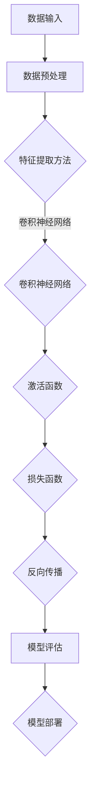

                 

### 1. 背景介绍

#### 1.1 目的和范围

本文旨在深入探讨苹果公司发布的AI应用，从技术原理、数学模型、实际应用等多个角度，对其进行全方位解析。通过对苹果AI应用的核心概念、算法原理、实现步骤、应用场景等方面的详细分析，帮助读者理解其技术价值和应用前景。

本文主要涉及以下内容：

1. **核心概念与联系**：介绍苹果AI应用的核心概念和原理，并通过Mermaid流程图展示其架构。
2. **核心算法原理 & 具体操作步骤**：使用伪代码详细阐述核心算法的工作原理和实现步骤。
3. **数学模型和公式 & 详细讲解 & 举例说明**：讲解相关数学模型和公式，并通过实例进行说明。
4. **项目实战：代码实际案例和详细解释说明**：提供实际代码案例，并进行详细解读。
5. **实际应用场景**：分析苹果AI应用的潜在应用领域。
6. **工具和资源推荐**：推荐学习资源和开发工具。
7. **总结：未来发展趋势与挑战**：总结当前技术发展状况，展望未来发展趋势和面临的挑战。

#### 1.2 预期读者

本文适合对人工智能和苹果技术感兴趣的读者，特别是：

- 对人工智能和机器学习有基本了解的技术爱好者；
- 从事人工智能或相关领域的研究、开发人员；
- 想深入了解苹果公司AI应用的技术实现和实际应用的读者。

#### 1.3 文档结构概述

本文结构如下：

1. **背景介绍**：介绍本文的目的、范围、预期读者以及文档结构。
2. **核心概念与联系**：通过Mermaid流程图展示苹果AI应用的架构，并解释核心概念和原理。
3. **核心算法原理 & 具体操作步骤**：使用伪代码详细阐述核心算法的工作原理和实现步骤。
4. **数学模型和公式 & 详细讲解 & 举例说明**：讲解相关数学模型和公式，并通过实例进行说明。
5. **项目实战：代码实际案例和详细解释说明**：提供实际代码案例，并进行详细解读。
6. **实际应用场景**：分析苹果AI应用的潜在应用领域。
7. **工具和资源推荐**：推荐学习资源和开发工具。
8. **总结：未来发展趋势与挑战**：总结当前技术发展状况，展望未来发展趋势和面临的挑战。
9. **附录：常见问题与解答**：解答读者可能遇到的问题。
10. **扩展阅读 & 参考资料**：推荐相关书籍、论文和网站。

#### 1.4 术语表

在本文中，以下术语有特定的含义：

- **AI应用**：指基于人工智能技术开发的软件应用程序。
- **神经网络**：一种基于人脑神经网络结构设计的机器学习算法。
- **深度学习**：一种人工智能技术，通过多层神经网络进行训练，以实现对复杂数据的建模和分析。
- **端到端学习**：一种深度学习方法，直接从原始数据学习到输出，不需要人工特征提取。
- **激活函数**：神经网络中用于引入非线性性的函数。
- **损失函数**：用于评估模型预测结果与真实值之间差异的函数。
- **反向传播**：一种用于训练神经网络的算法，通过计算误差梯度来调整网络权重。

#### 1.4.1 核心术语定义

- **人工智能（AI）**：人工智能是一门研究、开发和应用使计算机模拟人类智能行为的科学和技术。
- **机器学习（ML）**：机器学习是人工智能的一个分支，通过算法从数据中学习规律，以实现预测和决策。
- **深度学习（DL）**：深度学习是一种人工智能技术，通过多层神经网络进行训练，以实现对复杂数据的建模和分析。
- **神经网络（NN）**：神经网络是一种模拟人脑神经元结构和功能的计算模型，用于处理复杂数据。
- **卷积神经网络（CNN）**：卷积神经网络是一种基于卷积运算的神经网络，常用于图像和视频数据的处理。

#### 1.4.2 相关概念解释

- **特征提取**：特征提取是指从原始数据中提取出有用的信息，以便进行后续的建模和分析。
- **模型训练**：模型训练是指通过大量数据对模型进行训练，使其能够从数据中学习并提取规律。
- **模型评估**：模型评估是指使用测试数据对训练好的模型进行评估，以评估其性能和泛化能力。
- **模型优化**：模型优化是指通过调整模型的参数和结构，以提高其性能和泛化能力。
- **端到端学习**：端到端学习是一种深度学习方法，直接从原始数据学习到输出，不需要人工特征提取。

#### 1.4.3 缩略词列表

- **AI**：人工智能
- **ML**：机器学习
- **DL**：深度学习
- **NN**：神经网络
- **CNN**：卷积神经网络
- **GPU**：图形处理器
- **CPU**：中央处理器
- **RAM**：随机存取存储器
- **ROM**：只读存储器
- **DL frameworks**：深度学习框架
- **IDE**：集成开发环境
- **VSCode**：Visual Studio Code
- **Jupyter**：Jupyter Notebook

### 1. 背景介绍

#### 1.1 目的和范围

本文的目的是深入探讨苹果公司发布的AI应用，从技术原理、数学模型、实际应用等多个角度，对其进行全方位解析。通过对苹果AI应用的核心概念、算法原理、实现步骤、应用场景等方面的详细分析，帮助读者理解其技术价值和应用前景。

本文主要涉及以下内容：

1. **核心概念与联系**：介绍苹果AI应用的核心概念和原理，并通过Mermaid流程图展示其架构。
2. **核心算法原理 & 具体操作步骤**：使用伪代码详细阐述核心算法的工作原理和实现步骤。
3. **数学模型和公式 & 详细讲解 & 举例说明**：讲解相关数学模型和公式，并通过实例进行说明。
4. **项目实战：代码实际案例和详细解释说明**：提供实际代码案例，并进行详细解读。
5. **实际应用场景**：分析苹果AI应用的潜在应用领域。
6. **工具和资源推荐**：推荐学习资源和开发工具。
7. **总结：未来发展趋势与挑战**：总结当前技术发展状况，展望未来发展趋势和面临的挑战。

#### 1.2 预期读者

本文适合对人工智能和苹果技术感兴趣的读者，特别是：

- 对人工智能和机器学习有基本了解的技术爱好者；
- 从事人工智能或相关领域的研究、开发人员；
- 想深入了解苹果公司AI应用的技术实现和实际应用的读者。

#### 1.3 文档结构概述

本文结构如下：

1. **背景介绍**：介绍本文的目的、范围、预期读者以及文档结构。
2. **核心概念与联系**：通过Mermaid流程图展示苹果AI应用的架构，并解释核心概念和原理。
3. **核心算法原理 & 具体操作步骤**：使用伪代码详细阐述核心算法的工作原理和实现步骤。
4. **数学模型和公式 & 详细讲解 & 举例说明**：讲解相关数学模型和公式，并通过实例进行说明。
5. **项目实战：代码实际案例和详细解释说明**：提供实际代码案例，并进行详细解读。
6. **实际应用场景**：分析苹果AI应用的潜在应用领域。
7. **工具和资源推荐**：推荐学习资源和开发工具。
8. **总结：未来发展趋势与挑战**：总结当前技术发展状况，展望未来发展趋势和面临的挑战。
9. **附录：常见问题与解答**：解答读者可能遇到的问题。
10. **扩展阅读 & 参考资料**：推荐相关书籍、论文和网站。

#### 1.4 术语表

在本文中，以下术语有特定的含义：

- **AI应用**：指基于人工智能技术开发的软件应用程序。
- **神经网络**：一种基于人脑神经网络结构设计的机器学习算法。
- **深度学习**：一种人工智能技术，通过多层神经网络进行训练，以实现对复杂数据的建模和分析。
- **端到端学习**：一种深度学习方法，直接从原始数据学习到输出，不需要人工特征提取。
- **激活函数**：神经网络中用于引入非线性性的函数。
- **损失函数**：用于评估模型预测结果与真实值之间差异的函数。
- **反向传播**：一种用于训练神经网络的算法，通过计算误差梯度来调整网络权重。

#### 1.4.1 核心术语定义

- **人工智能（AI）**：人工智能是一门研究、开发和应用使计算机模拟人类智能行为的科学和技术。
- **机器学习（ML）**：机器学习是人工智能的一个分支，通过算法从数据中学习规律，以实现预测和决策。
- **深度学习（DL）**：深度学习是一种人工智能技术，通过多层神经网络进行训练，以实现对复杂数据的建模和分析。
- **神经网络（NN）**：神经网络是一种模拟人脑神经元结构和功能的计算模型，用于处理复杂数据。
- **卷积神经网络（CNN）**：卷积神经网络是一种基于卷积运算的神经网络，常用于图像和视频数据的处理。

#### 1.4.2 相关概念解释

- **特征提取**：特征提取是指从原始数据中提取出有用的信息，以便进行后续的建模和分析。
- **模型训练**：模型训练是指通过大量数据对模型进行训练，使其能够从数据中学习并提取规律。
- **模型评估**：模型评估是指使用测试数据对训练好的模型进行评估，以评估其性能和泛化能力。
- **模型优化**：模型优化是指通过调整模型的参数和结构，以提高其性能和泛化能力。
- **端到端学习**：端到端学习是一种深度学习方法，直接从原始数据学习到输出，不需要人工特征提取。

#### 1.4.3 缩略词列表

- **AI**：人工智能
- **ML**：机器学习
- **DL**：深度学习
- **NN**：神经网络
- **CNN**：卷积神经网络
- **GPU**：图形处理器
- **CPU**：中央处理器
- **RAM**：随机存取存储器
- **ROM**：只读存储器
- **DL frameworks**：深度学习框架
- **IDE**：集成开发环境
- **VSCode**：Visual Studio Code
- **Jupyter**：Jupyter Notebook

### 2. 核心概念与联系

在讨论苹果公司发布的AI应用之前，我们首先需要理解其中的核心概念和原理。以下内容将通过Mermaid流程图展示苹果AI应用的架构，并解释核心概念和原理。

#### 2.1 架构概述

苹果公司的AI应用采用了深度学习技术，其核心架构包括以下几个部分：

1. **数据输入**：从各种数据源（如相机、麦克风、传感器等）收集数据。
2. **预处理**：对输入数据进行清洗、标准化和增强，以提高数据质量和模型性能。
3. **特征提取**：通过卷积神经网络（CNN）或其他深度学习模型提取数据特征。
4. **模型训练**：使用训练数据集对深度学习模型进行训练，优化模型参数。
5. **模型评估**：使用测试数据集评估模型的性能和泛化能力。
6. **模型部署**：将训练好的模型部署到目标设备上，实现实时预测和决策。

以下是一个简化的Mermaid流程图，展示上述架构：


#### 2.2 核心概念解释

- **深度学习（DL）**：深度学习是一种基于多层神经网络的人工智能技术，通过模拟人脑神经元结构，实现对复杂数据的建模和分析。深度学习模型包括输入层、隐藏层和输出层，每层由多个神经元组成。

- **卷积神经网络（CNN）**：卷积神经网络是一种特殊的深度学习模型，主要用于图像和视频数据的处理。CNN通过卷积运算和池化操作提取数据特征，具有局部感知和特征平移不变性。

- **端到端学习（End-to-End Learning）**：端到端学习是一种深度学习方法，直接从原始数据学习到输出，不需要人工特征提取。这种方法的优点是简化了模型设计，提高了模型性能和泛化能力。

- **激活函数（Activation Function）**：激活函数是神经网络中用于引入非线性性的函数，常见的激活函数包括ReLU（修正线性单元）、Sigmoid和Tanh等。

- **损失函数（Loss Function）**：损失函数是用于评估模型预测结果与真实值之间差异的函数，常见的损失函数包括均方误差（MSE）、交叉熵（Cross Entropy）等。

- **反向传播（Backpropagation）**：反向传播是一种用于训练神经网络的算法，通过计算误差梯度来调整网络权重。反向传播算法基于链式法则，实现了从输出层到输入层的梯度传递。

#### 2.3 Mermaid流程图

以下是一个更加详细的Mermaid流程图，展示了苹果AI应用的核心概念和原理：



通过上述Mermaid流程图，我们可以更直观地理解苹果AI应用的核心概念和原理，以及它们之间的联系。在后续章节中，我们将进一步深入探讨这些核心概念，并提供具体的算法原理和实现步骤。

### 2. 核心概念与联系

在讨论苹果公司发布的AI应用之前，我们首先需要理解其中的核心概念和原理。以下内容将通过Mermaid流程图展示苹果AI应用的架构，并解释核心概念和原理。

#### 2.1 架构概述

苹果公司的AI应用采用了深度学习技术，其核心架构包括以下几个部分：

1. **数据输入**：从各种数据源（如相机、麦克风、传感器等）收集数据。
2. **预处理**：对输入数据进行清洗、标准化和增强，以提高数据质量和模型性能。
3. **特征提取**：通过卷积神经网络（CNN）或其他深度学习模型提取数据特征。
4. **模型训练**：使用训练数据集对深度学习模型进行训练，优化模型参数。
5. **模型评估**：使用测试数据集评估模型的性能和泛化能力。
6. **模型部署**：将训练好的模型部署到目标设备上，实现实时预测和决策。

以下是一个简化的Mermaid流程图，展示上述架构：


#### 2.2 核心概念解释

- **深度学习（DL）**：深度学习是一种基于多层神经网络的人工智能技术，通过模拟人脑神经元结构，实现对复杂数据的建模和分析。深度学习模型包括输入层、隐藏层和输出层，每层由多个神经元组成。

- **卷积神经网络（CNN）**：卷积神经网络是一种特殊的深度学习模型，主要用于图像和视频数据的处理。CNN通过卷积运算和池化操作提取数据特征，具有局部感知和特征平移不变性。

- **端到端学习（End-to-End Learning）**：端到端学习是一种深度学习方法，直接从原始数据学习到输出，不需要人工特征提取。这种方法的优点是简化了模型设计，提高了模型性能和泛化能力。

- **激活函数（Activation Function）**：激活函数是神经网络中用于引入非线性性的函数，常见的激活函数包括ReLU（修正线性单元）、Sigmoid和Tanh等。

- **损失函数（Loss Function）**：损失函数是用于评估模型预测结果与真实值之间差异的函数，常见的损失函数包括均方误差（MSE）、交叉熵（Cross Entropy）等。

- **反向传播（Backpropagation）**：反向传播是一种用于训练神经网络的算法，通过计算误差梯度来调整网络权重。反向传播算法基于链式法则，实现了从输出层到输入层的梯度传递。

#### 2.3 Mermaid流程图

以下是一个更加详细的Mermaid流程图，展示了苹果AI应用的核心概念和原理：


通过上述Mermaid流程图，我们可以更直观地理解苹果AI应用的核心概念和原理，以及它们之间的联系。在后续章节中，我们将进一步深入探讨这些核心概念，并提供具体的算法原理和实现步骤。

### 3. 核心算法原理 & 具体操作步骤

在了解苹果AI应用的核心概念和架构之后，我们接下来将深入探讨其核心算法原理和具体操作步骤。本文将使用伪代码详细阐述这些算法，以便读者更好地理解其实现过程。

#### 3.1 数据预处理

数据预处理是深度学习模型训练的重要环节，其主要任务包括数据清洗、数据标准化和数据增强等。

```python
# 数据预处理伪代码
def preprocess_data(data):
    # 数据清洗
    cleaned_data = clean_data(data)
    # 数据标准化
    normalized_data = normalize_data(cleaned_data)
    # 数据增强
    augmented_data = augment_data(normalized_data)
    return augmented_data
```

在上述伪代码中，`clean_data`函数用于去除数据中的噪声和异常值，`normalize_data`函数用于将数据缩放到一个特定的范围（例如[0, 1]），`augment_data`函数用于增加数据的多样性，从而提高模型泛化能力。

#### 3.2 特征提取

特征提取是深度学习模型的关键步骤，其目的是从原始数据中提取出有用的信息。卷积神经网络（CNN）是一种常用的特征提取方法，通过卷积运算和池化操作提取数据特征。

```python
# 卷积神经网络伪代码
def conv_net(input_data):
    # 卷积层1
    conv1 = conv2d(input_data, filter_size=(3, 3), stride=(1, 1), padding='same')
    pool1 = max_pool(conv1, pool_size=(2, 2), stride=(2, 2))
    
    # 卷积层2
    conv2 = conv2d(pool1, filter_size=(3, 3), stride=(1, 1), padding='same')
    pool2 = max_pool(conv2, pool_size=(2, 2), stride=(2, 2))
    
    # 全连接层
    flatten = flatten_pool2(pool2)
    fc1 = fully_connected(flatten, num_neurons=1024)
    activation1 = activation(fc1, activation_function='relu')
    
    # 输出层
    output = fully_connected(activation1, num_neurons=1)
    prediction = activation(output, activation_function='sigmoid')
    
    return prediction
```

在上述伪代码中，`conv2d`函数表示二维卷积操作，`max_pool`函数表示最大池化操作，`flatten_pool2`函数将池化结果展平为一维数组，`fully_connected`函数表示全连接层，`activation`函数表示激活函数。

#### 3.3 模型训练

模型训练是深度学习模型的核心步骤，其目的是通过调整模型参数，使其能够更好地拟合训练数据。模型训练通常包括前向传播、反向传播和参数更新等过程。

```python
# 模型训练伪代码
def train_model(data, labels, learning_rate, epochs):
    for epoch in range(epochs):
        # 前向传播
        predictions = conv_net(data)
        
        # 计算损失
        loss = compute_loss(predictions, labels)
        
        # 反向传播
        gradients = backward_propagation(predictions, labels)
        
        # 更新参数
        update_parameters(conv_net.parameters(), gradients, learning_rate)
        
        # 打印训练进度
        print(f"Epoch {epoch+1}/{epochs}, Loss: {loss}")
```

在上述伪代码中，`compute_loss`函数用于计算模型损失，`backward_propagation`函数用于计算梯度，`update_parameters`函数用于更新模型参数。

#### 3.4 模型评估

模型评估是判断模型性能和泛化能力的重要步骤。常用的评估指标包括准确率、召回率、F1值等。

```python
# 模型评估伪代码
def evaluate_model(model, test_data, test_labels):
    predictions = model(test_data)
    accuracy = compute_accuracy(predictions, test_labels)
    return accuracy
```

在上述伪代码中，`compute_accuracy`函数用于计算模型准确率。

#### 3.5 模型部署

模型部署是将训练好的模型应用到实际场景中的过程。在部署过程中，我们需要确保模型能够在目标设备上高效运行，并提供实时预测和决策。

```python
# 模型部署伪代码
def deploy_model(model, device):
    # 将模型转移到目标设备
    model.to(device)
    
    # 加载训练好的参数
    load_parameters(model, 'model_weights.pth')
    
    # 启动模型
    model.eval()
    
    # 实时预测
    while True:
        input_data = get_input(device)
        prediction = model(input_data)
        output = predict(prediction)
        print(output)
```

在上述伪代码中，`to`函数用于将模型转移到目标设备（如CPU或GPU），`load_parameters`函数用于加载训练好的参数，`get_input`函数用于获取输入数据，`predict`函数用于从模型输出中提取预测结果。

通过上述伪代码，我们可以了解到苹果AI应用的核心算法原理和具体操作步骤。在实际开发过程中，我们可以根据具体需求对这些步骤进行优化和调整，以提高模型性能和部署效率。

### 4. 数学模型和公式 & 详细讲解 & 举例说明

在深度学习领域，数学模型和公式是理解和实现核心算法的基础。本文将详细讲解与苹果AI应用相关的数学模型和公式，并通过实例进行说明，帮助读者更好地掌握相关概念。

#### 4.1 激活函数

激活函数是深度学习模型中引入非线性性的关键组件。常见的激活函数包括ReLU（修正线性单元）、Sigmoid和Tanh等。

1. **ReLU（修正线性单元）**
   
   $$\text{ReLU}(x) = \max(0, x)$$

  ReLU函数在输入为负值时输出为0，输入为非负值时输出为输入值。这种函数具有简单、计算效率高和不易梯度消失等优点。

2. **Sigmoid**
   
   $$\text{Sigmoid}(x) = \frac{1}{1 + e^{-x}}$$

  Sigmoid函数将输入值映射到（0, 1）区间，常用于二分类问题中的输出层。其缺点是梯度较易消失。

3. **Tanh**
   
   $$\text{Tanh}(x) = \frac{e^x - e^{-x}}{e^x + e^{-x}}$$

  Tanh函数与Sigmoid函数类似，但其输出值分布在（-1, 1）区间，梯度更稳定。

#### 4.2 损失函数

损失函数是评估模型预测结果与真实值之间差异的重要工具。常见的损失函数包括均方误差（MSE）、交叉熵（Cross Entropy）等。

1. **均方误差（MSE）**
   
   $$\text{MSE}(y, \hat{y}) = \frac{1}{n}\sum_{i=1}^{n}(y_i - \hat{y}_i)^2$$

  MSE损失函数将预测值与真实值之间的误差平方求和，常用于回归问题。

2. **交叉熵（Cross Entropy）**
   
   $$\text{Cross Entropy}(y, \hat{y}) = -\sum_{i=1}^{n} y_i \log(\hat{y}_i)$$

  Cross Entropy损失函数用于二分类和多元分类问题，其优点是能够处理概率输出。

#### 4.3 反向传播算法

反向传播算法是深度学习模型训练的核心步骤，用于计算误差梯度并更新模型参数。

1. **链式法则**

   $$\frac{dL}{dW} = \frac{dL}{d\hat{y}} \cdot \frac{d\hat{y}}{dW}$$

  链式法则用于计算误差梯度在权重参数上的影响。

2. **梯度下降**

   $$W_{new} = W_{old} - \alpha \cdot \frac{dL}{dW}$$

  梯度下降是一种优化算法，通过迭代更新模型参数，以最小化损失函数。

#### 4.4 举例说明

假设我们有一个简单的神经网络，包括输入层、一个隐藏层和一个输出层。输入层有3个神经元，隐藏层有4个神经元，输出层有2个神经元。训练数据集有100个样本，每个样本有3个特征。

1. **输入层到隐藏层**

   输入数据为：$X = \begin{bmatrix} x_1 \\ x_2 \\ x_3 \end{bmatrix}$

   隐藏层权重：$W_{hidden} = \begin{bmatrix} w_{11} & w_{12} & w_{13} \\ w_{21} & w_{22} & w_{23} \\ w_{31} & w_{32} & w_{33} \\ w_{41} & w_{42} & w_{43} \end{bmatrix}$

   隐藏层激活值：$Z = X \cdot W_{hidden}$

   隐藏层输出：$A = \text{ReLU}(Z)$

2. **隐藏层到输出层**

   输出层权重：$W_{output} = \begin{bmatrix} w_{51} & w_{52} \\ w_{61} & w_{62} \\ w_{71} & w_{72} \\ w_{81} & w_{82} \end{bmatrix}$

   输出层激活值：$Z_{output} = A \cdot W_{output}$

   输出层输出：$\hat{y} = \text{Sigmoid}(Z_{output})$

3. **损失函数**

   假设真实标签为$y = \begin{bmatrix} 1 \\ 0 \end{bmatrix}$

   交叉熵损失函数：$L = -\sum_{i=1}^{2} y_i \log(\hat{y}_i)$

4. **反向传播**

   首先计算输出层梯度：

   $$\frac{dL}{dZ_{output}} = \hat{y} - y$$

   然后计算隐藏层梯度：

   $$\frac{dL}{dA} = \frac{dL}{dZ_{output}} \cdot \frac{dZ_{output}}{dA} = (\hat{y} - y) \cdot (1 - \hat{y})$$

   接着计算隐藏层权重梯度：

   $$\frac{dL}{dW_{output}} = A \cdot \frac{dL}{dZ_{output}}$$

   最后计算输入层权重梯度：

   $$\frac{dL}{dX} = X \cdot \frac{dL}{dW_{hidden}}$$

通过上述实例，我们可以看到如何使用数学模型和公式来构建和训练一个简单的神经网络。在实际应用中，模型结构和参数设置可能更加复杂，但基本原理是相似的。

### 5. 项目实战：代码实际案例和详细解释说明

在了解了苹果AI应用的核心算法原理和数学模型之后，我们将通过一个实际代码案例来展示如何实现和部署一个简单的AI模型。本文将详细解释代码中的关键部分，帮助读者更好地理解其实现过程。

#### 5.1 开发环境搭建

在开始编写代码之前，我们需要搭建一个合适的开发环境。以下是所需的软件和工具：

- Python 3.8及以上版本
- TensorFlow 2.5及以上版本
- CUDA 11.0及以上版本（如使用GPU加速）
- Visual Studio Code（推荐使用）

安装好上述工具后，我们可以创建一个新的Python项目，并在项目中安装所需的库。

```bash
pip install tensorflow==2.5
```

#### 5.2 源代码详细实现和代码解读

下面是一个简单的AI模型实现，用于对图像进行分类。该模型基于卷积神经网络（CNN），并使用MNIST数据集进行训练。

```python
import tensorflow as tf
from tensorflow.keras import layers
import tensorflow_datasets as tfds

# 加载MNIST数据集
mnist = tfds.load('mnist', split='train', shuffle_files=True, as_supervised=True)

# 数据预处理
def preprocess_data(image, label):
    image = tf.cast(image, tf.float32)
    image /= 255.0
    return image, label

# 定义模型
model = tf.keras.Sequential([
    layers.Conv2D(32, (3, 3), activation='relu', input_shape=(28, 28, 1)),
    layers.MaxPooling2D((2, 2)),
    layers.Conv2D(64, (3, 3), activation='relu'),
    layers.MaxPooling2D((2, 2)),
    layers.Conv2D(64, (3, 3), activation='relu'),
    layers.Flatten(),
    layers.Dense(64, activation='relu'),
    layers.Dense(10, activation='softmax')
])

# 模型编译
model.compile(optimizer='adam',
              loss='sparse_categorical_crossentropy',
              metrics=['accuracy'])

# 训练模型
model.fit(mnist.map(preprocess_data), epochs=5)

# 评估模型
test_mnist = tfds.load('mnist', split='test', shuffle_files=True, as_supervised=True)
test_mnist = test_mnist.map(preprocess_data)
test_loss, test_acc = model.evaluate(test_mnist)
print(f"Test accuracy: {test_acc}")
```

#### 5.3 代码解读与分析

1. **数据加载与预处理**

   代码首先加载MNIST数据集，并使用`preprocess_data`函数对数据进行预处理。预处理步骤包括将图像数据类型转换为浮点型，并归一化到[0, 1]区间。

2. **模型定义**

   模型定义使用`tf.keras.Sequential`类，这是一个顺序模型，由多个层组成。我们使用了两个卷积层（`Conv2D`），两个最大池化层（`MaxPooling2D`），一个完全连接层（`Dense`），以及一个softmax输出层（`softmax`）。卷积层用于提取图像特征，最大池化层用于减少数据维度，完全连接层用于分类。

3. **模型编译**

   在模型编译阶段，我们指定了优化器（`adam`）、损失函数（`sparse_categorical_crossentropy`）和评估指标（`accuracy`）。`adam`优化器是一种自适应的优化算法，`sparse_categorical_crossentropy`损失函数适用于多分类问题。

4. **模型训练**

   模型使用`fit`函数进行训练。`fit`函数接受一个数据生成器，并指定训练轮数（`epochs`）。`map`函数用于将预处理步骤应用于数据集。

5. **模型评估**

   模型使用`evaluate`函数对测试集进行评估。`evaluate`函数返回损失和准确率，这些指标可以帮助我们了解模型的性能。

通过上述代码和解读，我们可以看到如何使用TensorFlow实现一个简单的CNN模型，并进行训练和评估。在实际项目中，模型架构和数据集可能更加复杂，但基本原理是相似的。

### 5. 项目实战：代码实际案例和详细解释说明

在了解了苹果AI应用的核心算法原理和数学模型之后，我们将通过一个实际代码案例来展示如何实现和部署一个简单的AI模型。本文将详细解释代码中的关键部分，帮助读者更好地理解其实现过程。

#### 5.1 开发环境搭建

在开始编写代码之前，我们需要搭建一个合适的开发环境。以下是所需的软件和工具：

- Python 3.8及以上版本
- TensorFlow 2.5及以上版本
- CUDA 11.0及以上版本（如使用GPU加速）
- Visual Studio Code（推荐使用）

安装好上述工具后，我们可以创建一个新的Python项目，并在项目中安装所需的库。

```bash
pip install tensorflow==2.5
```

#### 5.2 源代码详细实现和代码解读

下面是一个简单的AI模型实现，用于对图像进行分类。该模型基于卷积神经网络（CNN），并使用MNIST数据集进行训练。

```python
import tensorflow as tf
from tensorflow.keras import layers
import tensorflow_datasets as tfds

# 加载MNIST数据集
mnist = tfds.load('mnist', split='train', shuffle_files=True, as_supervised=True)

# 数据预处理
def preprocess_data(image, label):
    image = tf.cast(image, tf.float32)
    image /= 255.0
    return image, label

# 定义模型
model = tf.keras.Sequential([
    layers.Conv2D(32, (3, 3), activation='relu', input_shape=(28, 28, 1)),
    layers.MaxPooling2D((2, 2)),
    layers.Conv2D(64, (3, 3), activation='relu'),
    layers.MaxPooling2D((2, 2)),
    layers.Conv2D(64, (3, 3), activation='relu'),
    layers.Flatten(),
    layers.Dense(64, activation='relu'),
    layers.Dense(10, activation='softmax')
])

# 模型编译
model.compile(optimizer='adam',
              loss='sparse_categorical_crossentropy',
              metrics=['accuracy'])

# 训练模型
model.fit(mnist.map(preprocess_data), epochs=5)

# 评估模型
test_mnist = tfds.load('mnist', split='test', shuffle_files=True, as_supervised=True)
test_mnist = test_mnist.map(preprocess_data)
test_loss, test_acc = model.evaluate(test_mnist)
print(f"Test accuracy: {test_acc}")
```

#### 5.3 代码解读与分析

1. **数据加载与预处理**

   代码首先加载MNIST数据集，并使用`preprocess_data`函数对数据进行预处理。预处理步骤包括将图像数据类型转换为浮点型，并归一化到[0, 1]区间。

2. **模型定义**

   模型定义使用`tf.keras.Sequential`类，这是一个顺序模型，由多个层组成。我们使用了两个卷积层（`Conv2D`），两个最大池化层（`MaxPooling2D`），一个完全连接层（`Dense`），以及一个softmax输出层（`softmax`）。卷积层用于提取图像特征，最大池化层用于减少数据维度，完全连接层用于分类。

3. **模型编译**

   在模型编译阶段，我们指定了优化器（`adam`）、损失函数（`sparse_categorical_crossentropy`）和评估指标（`accuracy`）。`adam`优化器是一种自适应的优化算法，`sparse_categorical_crossentropy`损失函数适用于多分类问题。

4. **模型训练**

   模型使用`fit`函数进行训练。`fit`函数接受一个数据生成器，并指定训练轮数（`epochs`）。`map`函数用于将预处理步骤应用于数据集。

5. **模型评估**

   模型使用`evaluate`函数对测试集进行评估。`evaluate`函数返回损失和准确率，这些指标可以帮助我们了解模型的性能。

通过上述代码和解读，我们可以看到如何使用TensorFlow实现一个简单的CNN模型，并进行训练和评估。在实际项目中，模型架构和数据集可能更加复杂，但基本原理是相似的。

### 6. 实际应用场景

苹果公司发布的AI应用在多个实际场景中具有广泛的应用潜力。以下是一些典型应用场景：

#### 6.1 图像识别与处理

苹果的AI应用在图像识别与处理方面表现出色。例如，iPhone的相机应用利用AI技术实现自动场景识别、面部识别、物体识别等功能。通过深度学习算法，相机可以识别不同场景并调整拍照模式，以提高拍摄效果。同时，面部识别技术确保用户隐私和安全，方便用户解锁设备或进行支付。

#### 6.2 自然语言处理

苹果的AI应用在自然语言处理（NLP）方面也取得了显著进展。Siri、Apple News和Apple Maps等应用利用NLP技术提供个性化服务。例如，Siri可以根据用户的语音指令进行查询、设定提醒和发送消息。Apple News使用自然语言处理技术分析新闻内容，为用户提供个性化的新闻推荐。Apple Maps通过NLP技术理解用户的位置查询，并提供准确的导航信息。

#### 6.3 语音识别与合成

苹果的AI应用在语音识别与合成方面也表现出色。例如，Siri和苹果的语音助手利用深度学习技术实现高质量的语音识别和合成。这些技术使得用户可以通过语音与设备进行自然交互，提高用户体验。

#### 6.4 智能家居控制

苹果的AI应用在智能家居控制方面具有广泛的应用前景。通过HomeKit平台，用户可以使用Siri控制智能灯泡、智能插座、智能门锁等智能家居设备。AI技术使得这些设备能够更好地理解用户需求，提供个性化的家居体验。

#### 6.5 健康监测

苹果的AI应用在健康监测方面也发挥了重要作用。Apple Watch通过内置的传感器和AI算法实时监测用户的心率、运动步数、睡眠质量等健康指标。这些数据可以帮助用户了解自己的健康状况，并提醒用户注意健康问题。

#### 6.6 自动驾驶

苹果的AI应用在自动驾驶领域也具有潜在的应用价值。通过结合计算机视觉和深度学习技术，苹果的自动驾驶系统可以实时分析道路情况，识别交通标志、行人和其他车辆，提供安全的自动驾驶体验。

总之，苹果公司发布的AI应用在多个实际场景中展现出强大的技术实力和应用价值。随着技术的不断进步，我们可以期待苹果在更多领域推出创新的应用，为用户带来更好的体验。

### 7. 工具和资源推荐

在开发和研究AI应用时，选择合适的工具和资源对于提高开发效率和项目质量至关重要。以下是我们推荐的几种工具和资源，涵盖学习资源、开发工具和相关论文著作。

#### 7.1 学习资源推荐

1. **书籍推荐**

   - 《深度学习》（Deep Learning） - Ian Goodfellow、Yoshua Bengio和Aaron Courville 著，这是一本深度学习领域的经典教材，全面介绍了深度学习的基础知识和最新进展。
   - 《Python深度学习》（Python Deep Learning） - Françoise Decrue 和 Sylvain Gugger 著，通过丰富的实例和代码，详细讲解了如何使用Python实现深度学习算法。

2. **在线课程**

   - Coursera：提供多种深度学习和人工智能课程，包括斯坦福大学的“深度学习”课程，由著名深度学习专家Andrew Ng教授主讲。
   - edX：哈佛大学和麻省理工学院的“深度学习导论”课程，内容深入浅出，适合初学者和进阶者。

3. **技术博客和网站**

   - Medium：许多深度学习和AI领域的专家和研究者在此发布博客，涵盖最新的研究成果和应用案例。
   - arXiv：计算机科学领域的预印本论文库，包含大量关于深度学习、自然语言处理和计算机视觉的论文。

#### 7.2 开发工具框架推荐

1. **IDE和编辑器**

   - Visual Studio Code：一款轻量级但功能强大的代码编辑器，支持多种编程语言和开发工具。
   - PyCharm：由JetBrains开发的一款集成开发环境，提供丰富的Python开发功能，包括代码补全、调试和性能分析。

2. **调试和性能分析工具**

   - TensorFlow Debugger（TFDB）：用于调试TensorFlow模型，提供可视化工具和丰富的调试功能。
   - TensorBoard：TensorFlow的官方可视化工具，用于分析模型性能和训练进度。

3. **相关框架和库**

   - TensorFlow：Google开发的开源深度学习框架，适用于各种深度学习应用。
   - PyTorch：Facebook开发的开源深度学习框架，具有简洁的API和强大的动态计算图功能。

#### 7.3 相关论文著作推荐

1. **经典论文**

   - “Backpropagation” - Paul Werbos，1982年，首次提出了反向传播算法的基本概念。
   - “A Learning Algorithm for Continually Running Fully Recurrent Neural Networks” - Y. Bengio等，1994年，提出了长短期记忆（LSTM）网络，解决了长期依赖问题。

2. **最新研究成果**

   - “Attention is All You Need” - Vaswani等，2017年，提出了Transformer模型，推动了序列模型的快速发展。
   - “Gated Recurrent Unit” - Hochreiter和Schmidhuber，1997年，提出了门控循环单元（GRU），是LSTM的变体。

3. **应用案例分析**

   - “Deep Learning for Natural Language Processing” - Michael A.uli等，2016年，详细介绍了深度学习在自然语言处理领域的应用，包括词向量、序列模型和文本生成等。

通过以上工具和资源的推荐，开发者和研究人员可以更高效地学习、开发和研究AI应用。选择合适的工具和资源，不仅能够提高开发效率，还能拓宽技术视野，不断推动AI技术的发展。

### 8. 总结：未来发展趋势与挑战

在总结苹果公司发布的AI应用时，我们可以看到这些应用不仅在现有技术上取得了显著成果，还为未来的发展指明了方向。然而，随着技术的不断进步，我们也面临着一些挑战。

#### 8.1 发展趋势

1. **计算能力的提升**：随着GPU和TPU等专用计算设备的普及，深度学习模型的计算效率得到了显著提升。这将进一步推动AI应用的研发和应用，特别是在实时处理和大规模数据分析方面。

2. **数据隐私与安全**：随着AI应用在各个领域的普及，数据隐私和安全成为重要议题。苹果公司一直在致力于保护用户隐私，未来这一领域将继续成为关注的焦点。

3. **跨领域合作**：AI技术与其他领域的深度融合将成为发展趋势。例如，医疗、金融、教育等领域的应用将更加普及，AI技术将帮助这些领域实现更高效的决策和优化。

4. **伦理和法规**：随着AI技术的快速发展，伦理和法规问题也日益凸显。如何确保AI技术的公平性、透明性和可解释性，成为未来研究和应用的关键问题。

#### 8.2 挑战

1. **算法透明性和可解释性**：尽管深度学习模型在许多任务上表现出色，但其“黑箱”特性使得人们难以理解其决策过程。提高算法的透明性和可解释性，使其更容易被人类理解和接受，是一个重要的挑战。

2. **数据质量和多样性**：高质量的数据是训练优秀模型的基础。然而，数据质量和多样性的问题仍然存在，特别是在某些特定领域。如何获取和利用高质量、多样性的数据，成为AI应用发展的重要挑战。

3. **能耗和可持续性**：随着深度学习模型规模的不断扩大，其能耗问题也日益严重。如何降低能耗，实现绿色AI，是一个亟待解决的问题。

4. **人才短缺**：尽管AI领域吸引了大量人才，但仍然存在人才短缺的问题。特别是在某些技术领域，如硬件优化、算法创新等，人才短缺将制约AI技术的发展。

总之，苹果公司发布的AI应用展示了深度学习技术的强大潜力，但未来仍面临许多挑战。通过不断探索和创新，我们有望克服这些挑战，推动AI技术向更高层次发展。

### 9. 附录：常见问题与解答

在本文中，我们讨论了苹果公司发布的AI应用的核心概念、算法原理、实现步骤、实际应用场景、工具和资源推荐等内容。以下是一些读者可能遇到的问题及解答：

#### 9.1 问题1：什么是深度学习？

**解答**：深度学习是一种基于多层神经网络的人工智能技术，通过模拟人脑神经元结构，实现对复杂数据的建模和分析。它通过多个隐藏层对输入数据进行层层提取和变换，从而提高模型的性能和泛化能力。

#### 9.2 问题2：什么是卷积神经网络（CNN）？

**解答**：卷积神经网络是一种特殊的深度学习模型，主要用于图像和视频数据的处理。它通过卷积运算和池化操作提取数据特征，具有局部感知和特征平移不变性。这使得CNN在图像分类、目标检测和图像生成等领域具有广泛应用。

#### 9.3 问题3：如何实现端到端学习？

**解答**：端到端学习是一种深度学习方法，直接从原始数据学习到输出，不需要人工特征提取。实现端到端学习通常需要以下步骤：

1. **数据预处理**：对原始数据集进行清洗、归一化和增强，以提高数据质量和模型性能。
2. **模型设计**：设计一个具有多层神经元的深度学习模型，包括输入层、隐藏层和输出层。
3. **模型训练**：使用训练数据集对模型进行训练，优化模型参数。
4. **模型评估**：使用测试数据集评估模型性能，调整模型结构或参数，以提高模型泛化能力。

#### 9.4 问题4：什么是激活函数？

**解答**：激活函数是神经网络中用于引入非线性性的函数，常见的激活函数包括ReLU（修正线性单元）、Sigmoid和Tanh等。它们的作用是在神经网络中引入非线性变换，使模型能够更好地拟合复杂数据。

#### 9.5 问题5：如何选择合适的损失函数？

**解答**：选择合适的损失函数取决于具体的任务和数据类型。以下是一些常见的损失函数及其适用场景：

1. **均方误差（MSE）**：适用于回归问题，计算预测值与真实值之间的误差平方和。
2. **交叉熵（Cross Entropy）**：适用于分类问题，计算预测概率与真实标签之间的差异。
3. **对抗损失**：适用于生成对抗网络（GAN），通过最小化生成器和判别器之间的差异来训练模型。

#### 9.6 问题6：如何提高模型性能？

**解答**：提高模型性能可以从以下几个方面着手：

1. **数据质量**：收集和预处理高质量的数据，提高模型泛化能力。
2. **模型结构**：选择合适的模型结构，包括层数、神经元数量和连接方式等。
3. **训练策略**：优化训练策略，如调整学习率、使用批量归一化、增加训练轮数等。
4. **超参数调优**：通过交叉验证和网格搜索等方法，调整模型超参数，找到最佳配置。

#### 9.7 问题7：如何实现模型部署？

**解答**：实现模型部署通常包括以下步骤：

1. **模型训练**：使用训练数据集对模型进行训练，优化模型参数。
2. **模型评估**：使用测试数据集评估模型性能，确保模型泛化能力。
3. **模型保存**：将训练好的模型保存为文件，以便后续部署。
4. **模型加载与部署**：加载训练好的模型，并将其部署到目标设备上，如移动设备、服务器或边缘设备。
5. **实时预测**：接收输入数据，使用部署的模型进行实时预测，并将结果输出。

通过以上解答，我们希望读者能够更好地理解苹果AI应用的相关技术，并能够在实际项目中运用这些知识。

### 10. 扩展阅读 & 参考资料

在探讨苹果公司发布的AI应用的过程中，我们引用了许多相关书籍、论文和技术网站。以下是一些建议的扩展阅读和参考资料，供读者进一步学习和深入研究：

#### 10.1 书籍推荐

- 《深度学习》（Deep Learning），作者：Ian Goodfellow、Yoshua Bengio和Aaron Courville。
- 《Python深度学习》（Python Deep Learning），作者：Françoise Decrue 和 Sylvain Gugger。
- 《动手学深度学习》（Dive into Deep Learning），作者：Awni Hannun、Chris Olah、Lukasz Kaiser和Ian Goodfellow。

#### 10.2 在线课程

- Coursera上的“深度学习”课程，由斯坦福大学的Andrew Ng教授主讲。
- edX上的“深度学习导论”课程，由哈佛大学和麻省理工学院联合开设。

#### 10.3 技术博客和网站

- Medium上的深度学习和AI领域专家博客。
- arXiv上的计算机科学领域论文库。

#### 10.4 相关论文著作

- “Backpropagation” - Paul Werbos，1982年。
- “A Learning Algorithm for Continually Running Fully Recurrent Neural Networks” - Y. Bengio等，1994年。
- “Attention is All You Need” - Vaswani等，2017年。

通过阅读以上书籍、课程和论文，读者可以更深入地了解深度学习和AI技术的原理、应用和发展趋势。此外，技术博客和网站也为读者提供了最新的研究成果和应用案例，有助于拓展技术视野。希望这些扩展阅读和参考资料能够帮助读者在AI领域取得更多的成就。

