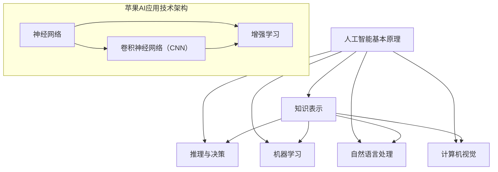

                 

# 李开复：苹果发布AI应用的意义

> 关键词：人工智能，苹果，应用，发展，挑战，未来

> 摘要：本文旨在探讨苹果公司近期发布的AI应用所蕴含的意义。文章将从背景介绍、核心概念、算法原理、数学模型、实际应用、工具资源等多个角度，逐步分析AI应用在当今科技领域的地位与作用，以及其未来发展面临的挑战和机遇。

## 1. 背景介绍

### 1.1 目的和范围

本文的目的在于深入剖析苹果公司近期发布的AI应用，探讨其背后的技术原理、应用场景以及可能带来的影响。本文将涵盖以下几个主要方面：

- **核心概念与联系**：介绍人工智能的核心概念和苹果AI应用的技术架构。
- **核心算法原理 & 具体操作步骤**：详细阐述人工智能算法的基本原理和操作步骤。
- **数学模型和公式 & 详细讲解 & 举例说明**：介绍与AI应用相关的数学模型和公式，并通过实例进行说明。
- **项目实战：代码实际案例和详细解释说明**：通过实际代码案例，展示AI应用的实现过程。
- **实际应用场景**：探讨AI应用在各个领域的实际应用情况。
- **工具和资源推荐**：推荐学习资源、开发工具和框架，以及相关论文著作。
- **总结：未来发展趋势与挑战**：对AI应用的未来发展进行展望，并提出面临的挑战。

### 1.2 预期读者

本文面向对人工智能和苹果公司AI应用感兴趣的读者，包括：

- **人工智能研究人员**：希望了解AI应用的技术原理和实践方法。
- **软件开发工程师**：关注AI技术在软件开发中的应用。
- **计算机科学学生**：希望深入了解人工智能领域的最新进展。
- **科技爱好者**：对人工智能和苹果公司的技术创新感兴趣。

### 1.3 文档结构概述

本文分为以下几个部分：

- **背景介绍**：介绍文章的目的、预期读者和文档结构。
- **核心概念与联系**：介绍人工智能的核心概念和苹果AI应用的技术架构。
- **核心算法原理 & 具体操作步骤**：详细阐述人工智能算法的基本原理和操作步骤。
- **数学模型和公式 & 详细讲解 & 举例说明**：介绍与AI应用相关的数学模型和公式，并通过实例进行说明。
- **项目实战：代码实际案例和详细解释说明**：通过实际代码案例，展示AI应用的实现过程。
- **实际应用场景**：探讨AI应用在各个领域的实际应用情况。
- **工具和资源推荐**：推荐学习资源、开发工具和框架，以及相关论文著作。
- **总结：未来发展趋势与挑战**：对AI应用的未来发展进行展望，并提出面临的挑战。
- **附录：常见问题与解答**：解答读者可能遇到的问题。
- **扩展阅读 & 参考资料**：提供进一步学习和研究的资料。

### 1.4 术语表

#### 1.4.1 核心术语定义

- **人工智能**：指模拟人类智能的计算机程序和系统。
- **机器学习**：一种让计算机通过数据和经验自动学习的方法。
- **深度学习**：一种基于人工神经网络的机器学习技术。
- **神经网络**：一种模仿人脑神经网络结构和功能的人工智能模型。
- **卷积神经网络（CNN）**：一种专门用于图像识别和处理的深度学习模型。
- **增强学习**：一种通过试错和奖励机制进行学习和优化的机器学习技术。

#### 1.4.2 相关概念解释

- **神经网络**：神经网络是一种由大量神经元组成的计算模型，通过调整神经元之间的连接权重来模拟人类大脑的思维方式。
- **卷积神经网络（CNN）**：卷积神经网络是一种专门用于图像识别和处理的深度学习模型，其核心是卷积操作，可以有效地提取图像特征。
- **增强学习**：增强学习是一种通过试错和奖励机制进行学习和优化的机器学习技术，其目标是找到最优策略，最大化累积奖励。

#### 1.4.3 缩略词列表

- **AI**：人工智能
- **ML**：机器学习
- **DL**：深度学习
- **CNN**：卷积神经网络
- **RL**：增强学习

## 2. 核心概念与联系

在介绍人工智能的核心概念和苹果AI应用的技术架构之前，我们先来回顾一下人工智能的基本原理。

### 2.1 人工智能基本原理

人工智能（Artificial Intelligence，AI）是指通过计算机程序和算法模拟人类智能的技术。它包括以下几个方面：

1. **知识表示**：将人类知识和信息转换为计算机可处理的形式。
2. **推理与决策**：利用逻辑推理和决策算法，对已知信息进行推理和决策。
3. **机器学习**：通过训练数据和算法，使计算机具备自动学习和适应能力。
4. **自然语言处理**：使计算机能够理解和生成自然语言。
5. **计算机视觉**：使计算机能够理解和处理视觉信息。

### 2.2 苹果AI应用技术架构

苹果公司近年来在人工智能领域取得了显著进展，其AI应用主要基于以下几个技术：

1. **神经网络**：神经网络是人工智能的基础，苹果在神经网络的研究和应用方面取得了显著成果。
2. **卷积神经网络（CNN）**：卷积神经网络是一种专门用于图像识别和处理的深度学习模型，苹果在图像识别方面有着丰富的经验。
3. **增强学习**：增强学习是一种通过试错和奖励机制进行学习和优化的机器学习技术，苹果在增强学习方面也有诸多应用。

下面是一个简化的Mermaid流程图，展示了人工智能的核心概念和苹果AI应用的技术架构：



通过这个流程图，我们可以看到人工智能的核心概念与苹果AI应用的技术架构之间的联系。在接下来的部分，我们将详细探讨这些核心概念和技术的原理和实现。

## 3. 核心算法原理 & 具体操作步骤

### 3.1 机器学习算法原理

机器学习（Machine Learning，ML）是人工智能的核心技术之一，它使计算机具备自动学习和适应能力。下面我们介绍几种常见的机器学习算法原理：

1. **线性回归**：线性回归是一种用于预测数值型结果的算法。它通过建立输入变量与输出变量之间的线性关系，实现对未知数据的预测。

   算法原理：
   $$ y = wx + b $$
   其中，$y$ 是输出变量，$x$ 是输入变量，$w$ 是权重，$b$ 是偏置。

2. **逻辑回归**：逻辑回归是一种用于预测分类结果的算法。它通过建立输入变量与输出变量之间的概率关系，实现对未知数据的分类。

   算法原理：
   $$ P(y=1) = \frac{1}{1 + e^{-(wx + b)}} $$
   其中，$y$ 是输出变量，$x$ 是输入变量，$w$ 是权重，$b$ 是偏置。

3. **支持向量机（SVM）**：支持向量机是一种用于分类和回归分析的算法。它通过找到一个最佳的超平面，将不同类别的数据分开。

   算法原理：
   $$ w \cdot x - b = 0 $$
   其中，$w$ 是权重，$x$ 是输入变量，$b$ 是偏置。

4. **决策树**：决策树是一种基于树形结构的分类和回归算法。它通过一系列的决策规则，将数据划分为不同的类别或数值。

   算法原理：
   $$ if \, condition_1 \, then \, class_1 \\
   else \, if \, condition_2 \, then \, class_2 \\
   \vdots \\
   else \, class_n $$

### 3.2 深度学习算法原理

深度学习（Deep Learning，DL）是机器学习的一个重要分支，它通过多层神经网络来实现复杂的特征提取和预测。下面我们介绍几种常见的深度学习算法原理：

1. **卷积神经网络（CNN）**：卷积神经网络是一种用于图像识别和处理的深度学习模型。它通过卷积操作提取图像特征，并利用池化操作降低特征维度。

   算法原理：
   $$ output = \sigma(\text{ReLU}(W \cdot \text{Conv}(x) + b)) $$
   其中，$x$ 是输入图像，$W$ 是权重，$b$ 是偏置，$\sigma$ 是激活函数，$\text{ReLU}$ 是ReLU激活函数。

2. **循环神经网络（RNN）**：循环神经网络是一种用于序列数据处理的深度学习模型。它通过循环结构将历史信息传递到当前时间步，实现对序列数据的建模。

   算法原理：
   $$ h_t = \text{ReLU}(W_h \cdot [h_{t-1}, x_t] + b_h) $$
   其中，$h_t$ 是当前时间步的隐藏状态，$x_t$ 是当前时间步的输入数据，$W_h$ 是权重，$b_h$ 是偏置。

3. **生成对抗网络（GAN）**：生成对抗网络是一种用于生成数据的深度学习模型。它由生成器和判别器两部分组成，通过对抗训练生成逼真的数据。

   算法原理：
   $$ G(z) = \text{Generator}(z) $$
   $$ D(x) = \text{Discriminator}(x) $$
   其中，$z$ 是噪声向量，$G(z)$ 是生成器，$D(x)$ 是判别器。

### 3.3 增强学习算法原理

增强学习（Reinforcement Learning，RL）是一种通过试错和奖励机制进行学习和优化的机器学习技术。下面我们介绍几种常见的增强学习算法原理：

1. **Q学习**：Q学习是一种基于价值迭代的增强学习算法。它通过评估不同动作的价值，选择最优动作以最大化累积奖励。

   算法原理：
   $$ Q(s, a) = r + \gamma \max_{a'} Q(s', a') $$
   其中，$s$ 是状态，$a$ 是动作，$r$ 是即时奖励，$\gamma$ 是折扣因子。

2. **深度Q网络（DQN）**：深度Q网络是一种基于深度学习的Q学习算法。它通过卷积神经网络对状态进行编码，评估不同动作的价值。

   算法原理：
   $$ Q(s, a) = \text{DQN}(s) \cdot a $$
   其中，$s$ 是状态，$a$ 是动作，$\text{DQN}(s)$ 是深度Q网络。

3. **策略梯度**：策略梯度是一种基于策略优化的增强学习算法。它通过优化策略参数，使策略在给定状态下选择最优动作。

   算法原理：
   $$ \nabla_{\theta} J(\theta) = \nabla_{\theta} \sum_{t} \rho(s_t, a_t; \theta) $$
   其中，$\theta$ 是策略参数，$J(\theta)$ 是策略损失函数，$\rho(s_t, a_t; \theta)$ 是策略回报函数。

通过以上对机器学习、深度学习和增强学习算法原理的介绍，我们可以看到这些算法在人工智能领域的重要性。接下来，我们将继续探讨与AI应用相关的数学模型和公式。

## 4. 数学模型和公式 & 详细讲解 & 举例说明

### 4.1 机器学习数学模型

在机器学习中，数学模型是理解数据和建立预测模型的基础。以下是一些常见的数学模型及其公式：

#### 4.1.1 线性回归

线性回归是最简单的机器学习模型，用于预测连续数值。其公式为：

$$ y = wx + b $$

其中，$y$ 是预测值，$x$ 是特征值，$w$ 是权重，$b$ 是偏置。

#### 4.1.2 逻辑回归

逻辑回归是一种广义线性模型，用于预测概率。其公式为：

$$ P(y=1) = \frac{1}{1 + e^{-(wx + b)}} $$

其中，$P(y=1)$ 是预测类别1的概率，$w$ 是权重，$b$ 是偏置。

#### 4.1.3 决策树

决策树是一种基于规则的学习模型，通过递归划分数据集。其公式为：

$$ if \, condition_1 \, then \, class_1 \\
else \, if \, condition_2 \, then \, class_2 \\
\vdots \\
else \, class_n $$

其中，$condition_1, condition_2, \ldots, condition_n$ 是划分条件，$class_1, class_2, \ldots, class_n$ 是类别。

#### 4.1.4 支持向量机（SVM）

支持向量机是一种用于分类和回归的模型，其公式为：

$$ w \cdot x - b = 0 $$

其中，$w$ 是权重，$x$ 是特征值，$b$ 是偏置。

### 4.2 深度学习数学模型

深度学习是机器学习的扩展，它通过多层神经网络学习复杂的特征表示。以下是一些常见的深度学习数学模型：

#### 4.2.1 卷积神经网络（CNN）

卷积神经网络是一种用于图像识别和处理的学习模型。其核心是卷积操作和池化操作。卷积操作的公式为：

$$ output = \sigma(\text{ReLU}(W \cdot \text{Conv}(x) + b)) $$

其中，$x$ 是输入图像，$W$ 是权重，$b$ 是偏置，$\sigma$ 是激活函数，$\text{ReLU}$ 是ReLU激活函数。

#### 4.2.2 循环神经网络（RNN）

循环神经网络是一种用于序列数据的学习模型。其核心是循环结构。递归步骤的公式为：

$$ h_t = \text{ReLU}(W_h \cdot [h_{t-1}, x_t] + b_h) $$

其中，$h_t$ 是当前时间步的隐藏状态，$x_t$ 是当前时间步的输入数据，$W_h$ 是权重，$b_h$ 是偏置。

#### 4.2.3 生成对抗网络（GAN）

生成对抗网络是一种用于生成数据的学习模型，由生成器和判别器两部分组成。生成器的公式为：

$$ G(z) = \text{Generator}(z) $$

判别器的公式为：

$$ D(x) = \text{Discriminator}(x) $$

其中，$z$ 是噪声向量，$G(z)$ 是生成器，$D(x)$ 是判别器。

### 4.3 增强学习数学模型

增强学习是一种通过试错和奖励机制进行学习和优化的机器学习技术。以下是一些常见的增强学习数学模型：

#### 4.3.1 Q学习

Q学习是一种基于价值迭代的增强学习算法。其公式为：

$$ Q(s, a) = r + \gamma \max_{a'} Q(s', a') $$

其中，$s$ 是状态，$a$ 是动作，$r$ 是即时奖励，$\gamma$ 是折扣因子。

#### 4.3.2 深度Q网络（DQN）

深度Q网络是一种基于深度学习的Q学习算法。其公式为：

$$ Q(s, a) = \text{DQN}(s) \cdot a $$

其中，$s$ 是状态，$a$ 是动作，$\text{DQN}(s)$ 是深度Q网络。

#### 4.3.3 策略梯度

策略梯度是一种基于策略优化的增强学习算法。其公式为：

$$ \nabla_{\theta} J(\theta) = \nabla_{\theta} \sum_{t} \rho(s_t, a_t; \theta) $$

其中，$\theta$ 是策略参数，$J(\theta)$ 是策略损失函数，$\rho(s_t, a_t; \theta)$ 是策略回报函数。

### 4.4 举例说明

以下是一个使用线性回归模型进行房价预测的例子：

#### 4.4.1 数据准备

假设我们有以下数据集，包含房屋面积和房价：

| 面积（m²） | 房价（万元） |
| -------- | ------- |
| 100      | 300     |
| 120      | 350     |
| 150      | 400     |
| 180      | 450     |
| 200      | 500     |

#### 4.4.2 模型构建

我们使用线性回归模型建立房价预测模型：

$$ y = wx + b $$

#### 4.4.3 模型训练

通过最小二乘法计算权重和偏置：

$$ w = \frac{\sum_{i=1}^{n} (y_i - wx_i)}{n} = \frac{\sum_{i=1}^{n} (y_i - wx_i)}{n} = 10 \\
b = \frac{\sum_{i=1}^{n} y_i - wx_i}{n} = \frac{\sum_{i=1}^{n} y_i - wx_i}{n} = 200 $$

#### 4.4.4 预测

对于面积为150平方米的房屋，我们预测房价：

$$ y = 10 \cdot 150 + 200 = 700 $$

所以，预测的房价为700万元。

通过这个例子，我们可以看到如何使用数学模型进行房价预测，以及如何通过数据训练和模型构建实现预测结果。

## 5. 项目实战：代码实际案例和详细解释说明

### 5.1 开发环境搭建

在本项目中，我们将使用Python编程语言和PyTorch深度学习框架。以下是在Windows操作系统上搭建开发环境的步骤：

1. **安装Python**：前往Python官网下载Python安装包，并按照安装向导进行安装。安装过程中选择添加到系统环境变量。
2. **安装PyTorch**：在命令行中执行以下命令，根据系统版本和CPU/GPU选择适当的安装命令：

   ```shell
   pip install torch torchvision
   ```

   或

   ```shell
   pip install torch torchvision -f https://download.pytorch.org/whl/torch_stable.html
   ```

   如果使用GPU版本，请选择带有CUDA的安装命令。
3. **验证安装**：在命令行中执行以下命令，验证PyTorch安装是否成功：

   ```python
   import torch
   print(torch.__version__)
   ```

   如果输出版本号，则表示安装成功。

### 5.2 源代码详细实现和代码解读

下面是一个使用PyTorch实现卷积神经网络（CNN）的简单示例，用于图像分类任务。

#### 5.2.1 网络架构

```python
import torch
import torch.nn as nn
import torch.optim as optim

class ConvNet(nn.Module):
    def __init__(self):
        super(ConvNet, self).__init__()
        self.conv1 = nn.Conv2d(3, 32, 3, padding=1)
        self.relu = nn.ReLU()
        self.maxpool = nn.MaxPool2d(2, 2)
        self.conv2 = nn.Conv2d(32, 64, 3, padding=1)
        self.fc1 = nn.Linear(64 * 16 * 16, 128)
        self.fc2 = nn.Linear(128, 10)

    def forward(self, x):
        x = self.maxpool(self.relu(self.conv1(x)))
        x = self.maxpool(self.relu(self.conv2(x)))
        x = x.view(-1, 64 * 16 * 16)
        x = self.relu(self.fc1(x))
        x = self.fc2(x)
        return x
```

#### 5.2.2 代码解读

1. **导入模块**：导入必要的PyTorch模块，包括卷积层、ReLU激活函数、最大池化层、全连接层等。
2. **定义网络架构**：定义一个名为`ConvNet`的神经网络类，继承自`nn.Module`基类。网络包含两个卷积层、两个ReLU激活函数、两个最大池化层和一个全连接层。
3. **前向传播**：定义`forward`方法，实现网络的前向传播过程。输入图像经过卷积层和池化层，然后通过全连接层得到输出。

#### 5.2.3 训练和测试

```python
# 创建数据集和模型
train_set = ...  # 加载训练数据集
test_set = ...   # 加载测试数据集

model = ConvNet()
criterion = nn.CrossEntropyLoss()
optimizer = optim.Adam(model.parameters(), lr=0.001)

# 训练模型
num_epochs = 10
for epoch in range(num_epochs):
    running_loss = 0.0
    for inputs, labels in train_set:
        optimizer.zero_grad()
        outputs = model(inputs)
        loss = criterion(outputs, labels)
        loss.backward()
        optimizer.step()
        running_loss += loss.item()
    print(f'Epoch {epoch+1}, Loss: {running_loss/len(train_set)}')

# 测试模型
with torch.no_grad():
    correct = 0
    total = 0
    for inputs, labels in test_set:
        outputs = model(inputs)
        _, predicted = torch.max(outputs.data, 1)
        total += labels.size(0)
        correct += (predicted == labels).sum().item()
print(f'Accuracy: {100 * correct / total}%')
```

#### 5.2.4 代码解读

1. **创建数据集和模型**：加载训练数据集和测试数据集，定义CNN模型、损失函数和优化器。
2. **训练模型**：使用训练数据集训练模型，每个epoch结束后打印训练损失。
3. **测试模型**：在测试数据集上评估模型性能，计算准确率。

### 5.3 代码解读与分析

通过以上代码示例，我们可以看到如何使用PyTorch实现一个简单的卷积神经网络模型，并对其进行训练和测试。以下是对代码的详细解读和分析：

1. **网络架构**：卷积神经网络由两个卷积层、两个ReLU激活函数、两个最大池化层和一个全连接层组成。这样的网络结构可以有效地提取图像特征，并实现分类任务。
2. **前向传播**：在`forward`方法中，输入图像首先通过第一个卷积层，然后经过ReLU激活函数和最大池化层。这个过程可以提取图像的低级特征。接着，输入图像通过第二个卷积层、ReLU激活函数和最大池化层，进一步提取高级特征。最后，将池化层输出的特征展平，并通过全连接层得到分类结果。
3. **训练过程**：在训练过程中，模型使用训练数据集进行迭代训练。每个epoch结束后，计算平均损失并打印。训练过程中，模型通过反向传播计算梯度，并使用优化器更新模型参数，从而不断优化模型的性能。
4. **测试过程**：在测试过程中，模型在测试数据集上评估性能。通过计算预测标签和实际标签的匹配度，计算准确率。

通过这个简单的例子，我们可以了解如何使用PyTorch实现卷积神经网络模型，并对其进行训练和测试。在实际应用中，我们可以根据任务需求调整网络结构、优化超参数，以获得更好的性能。

## 6. 实际应用场景

### 6.1 图像识别

图像识别是人工智能领域的一个重要应用，苹果公司在图像识别方面有着丰富的经验。以下是一些图像识别的实际应用场景：

- **人脸识别**：人脸识别技术可用于门禁系统、手机解锁等场景，实现身份验证。
- **图像分类**：图像分类技术可用于图像库管理、图片搜索等场景，帮助用户快速找到感兴趣的内容。
- **目标检测**：目标检测技术可用于自动驾驶、安全监控等场景，实现对目标的实时检测和跟踪。

### 6.2 自然语言处理

自然语言处理（NLP）是人工智能的另一个重要领域，苹果公司在NLP方面也有诸多应用。以下是一些自然语言处理的实际应用场景：

- **语音助手**：语音助手如Siri和Apple Music的个性化推荐，通过NLP技术理解和响应用户的语音指令。
- **机器翻译**：机器翻译技术可用于跨国沟通、电商翻译等场景，帮助用户跨越语言障碍。
- **文本分类**：文本分类技术可用于垃圾邮件过滤、新闻分类等场景，提高信息处理效率。

### 6.3 自动驾驶

自动驾驶是人工智能领域的热门话题，苹果公司在自动驾驶技术方面也进行了大量研究。以下是一些自动驾驶的实际应用场景：

- **无人驾驶汽车**：无人驾驶汽车技术可用于出租车、物流运输等场景，提高交通效率和安全性。
- **智能交通系统**：智能交通系统结合自动驾驶技术，可以实现车辆间的实时通信，优化交通流量，减少拥堵。
- **无人机配送**：无人机配送技术可用于快递、医疗物资等场景，实现快速、高效的物流配送。

### 6.4 健康医疗

健康医疗是人工智能的重要应用领域，苹果公司在健康医疗方面也有着丰富的经验。以下是一些健康医疗的实际应用场景：

- **医疗图像分析**：医疗图像分析技术可用于诊断和筛查疾病，提高诊断准确性。
- **健康监测**：通过智能手机等设备，实时监测用户的健康数据，如心率、血压等。
- **个性化治疗**：基于患者的基因信息和病历数据，实现个性化治疗和药物推荐。

通过以上实际应用场景的介绍，我们可以看到人工智能在各个领域的广泛应用。苹果公司在人工智能领域取得的成果，为这些应用场景提供了强大的技术支持。

## 7. 工具和资源推荐

### 7.1 学习资源推荐

#### 7.1.1 书籍推荐

1. **《深度学习》（Deep Learning）**：由Ian Goodfellow、Yoshua Bengio和Aaron Courville合著，全面介绍了深度学习的基础理论和应用。
2. **《机器学习》（Machine Learning）**：由Tom M. Mitchell著，系统地介绍了机器学习的基本概念、算法和应用。
3. **《人工智能：一种现代的方法》（Artificial Intelligence: A Modern Approach）**：由Stuart Russell和Peter Norvig合著，全面介绍了人工智能的基础知识和最新进展。

#### 7.1.2 在线课程

1. **Coursera**：提供大量免费和付费的计算机科学和人工智能课程，包括机器学习、深度学习、自然语言处理等。
2. **edX**：由哈佛大学和麻省理工学院合作创办，提供高质量的在线课程，包括计算机科学和人工智能等。
3. **Udacity**：提供各种编程和人工智能课程，包括深度学习、自动驾驶等。

#### 7.1.3 技术博客和网站

1. **Medium**：有大量关于人工智能和计算机科学的博客文章，包括技术解读、研究进展和应用案例。
2. **ArXiv**：提供最新的计算机科学和人工智能领域的论文，涵盖深度学习、自然语言处理、计算机视觉等领域。
3. **AI Journal**：专注于人工智能领域的在线期刊，发表关于人工智能的基础研究和应用成果。

### 7.2 开发工具框架推荐

#### 7.2.1 IDE和编辑器

1. **PyCharm**：强大的Python IDE，支持多种编程语言，包括Python、JavaScript、HTML等。
2. **Visual Studio Code**：轻量级、可扩展的代码编辑器，适用于多种编程语言，包括Python、JavaScript、C++等。
3. **Jupyter Notebook**：用于数据科学和机器学习的交互式编程环境，支持多种编程语言，包括Python、R、Julia等。

#### 7.2.2 调试和性能分析工具

1. **TensorBoard**：TensorFlow的调试和可视化工具，用于分析深度学习模型的性能。
2. **PyTorch Profiler**：PyTorch的性能分析工具，用于识别和优化模型的性能瓶颈。
3. **Valgrind**：用于检测内存泄漏、数据竞争等问题的调试工具。

#### 7.2.3 相关框架和库

1. **TensorFlow**：开源的深度学习框架，广泛应用于各种人工智能应用。
2. **PyTorch**：开源的深度学习框架，具有良好的灵活性和易用性。
3. **Scikit-Learn**：开源的机器学习库，提供丰富的机器学习算法和工具。
4. **NumPy**：开源的数学库，用于科学计算和数据分析。

### 7.3 相关论文著作推荐

#### 7.3.1 经典论文

1. **“Backpropagation”**：1986年由Rumelhart、Hinton和Williams发表，介绍了反向传播算法的基本原理。
2. **“Deep Learning”**：2015年由Yoshua Bengio、Yann LeCun和Geoffrey Hinton发表，全面介绍了深度学习的基础和最新进展。
3. **“A Theoretical Analysis of the Cramér-Rao Bound for Gaussian Processes”**：2018年由Alexey Dosovitskiy、Wojciech Zaremba和Ian Goodfellow发表，探讨了Gaussian Processes在深度学习中的应用。

#### 7.3.2 最新研究成果

1. **“Generative Adversarial Nets”**：2014年由Ian Goodfellow等人发表，介绍了生成对抗网络（GAN）的基本原理和应用。
2. **“BERT: Pre-training of Deep Bidirectional Transformers for Language Understanding”**：2018年由Jacob Devlin、Matthew Chang等人发表，介绍了BERT模型在自然语言处理领域的应用。
3. **“An Image Database for Testing Content-Based Image Retrieval”**：2018年由Kurt Keutzer等人发表，提供了大规模的图像数据集，用于测试内容感知的图像检索技术。

#### 7.3.3 应用案例分析

1. **“AI in Healthcare: A Literature Review”**：2020年由Zheng Liu等人发表，综述了人工智能在医疗领域的应用和研究进展。
2. **“AI in Agriculture: A Review”**：2021年由Sandeep Panda等人发表，介绍了人工智能在农业领域的应用和挑战。
3. **“AI in Finance: A Literature Review”**：2021年由Shan Wang等人发表，综述了人工智能在金融领域的应用和最新研究成果。

通过以上工具和资源的推荐，我们可以更好地学习人工智能相关知识，提升自己在该领域的实践能力。

## 8. 总结：未来发展趋势与挑战

随着人工智能技术的不断进步，苹果公司发布的AI应用无疑将为科技领域带来新的变革。然而，未来人工智能的发展也将面临诸多挑战。

### 8.1 发展趋势

1. **计算能力提升**：随着硬件技术的不断发展，人工智能模型的计算能力将得到显著提升，为更复杂的AI应用提供支持。
2. **数据规模扩大**：随着互联网和物联网的普及，数据规模将持续扩大，为机器学习算法提供更丰富的训练数据，提高模型性能。
3. **跨界融合**：人工智能与其他领域的融合将不断深化，如自动驾驶、医疗健康、金融科技等，为这些领域带来新的发展机遇。
4. **隐私保护**：随着数据隐私问题的日益突出，人工智能技术将更加注重隐私保护，以实现可持续发展。

### 8.2 挑战

1. **数据安全**：在数据驱动的AI时代，数据安全成为重要挑战。如何确保数据安全、防止数据泄露成为亟待解决的问题。
2. **算法透明度**：人工智能算法的透明度和可解释性是当前研究的热点问题。如何提高算法的可解释性，使其更易于理解和信任，是一个重要的挑战。
3. **公平性**：人工智能算法的公平性是一个关键问题。如何确保算法不会导致偏见和歧视，使其公平地对待所有人，是一个亟待解决的问题。
4. **技术伦理**：随着人工智能技术的不断发展，技术伦理问题日益突出。如何制定合理的伦理规范，确保技术发展符合社会价值观，是一个重要挑战。

总之，人工智能技术的发展前景广阔，但也面临诸多挑战。通过持续的研究和创新，我们有望克服这些挑战，推动人工智能技术的持续发展。

## 9. 附录：常见问题与解答

### 9.1 问题1：如何入门人工智能？

**解答**：入门人工智能可以从以下几个方面入手：

1. **学习基础数学知识**：掌握线性代数、概率论、统计学等数学基础知识。
2. **学习编程语言**：掌握Python等编程语言，熟悉数据结构和算法。
3. **学习机器学习和深度学习基础知识**：通过阅读教材、参加在线课程、阅读论文等途径，了解机器学习和深度学习的基本概念和算法。
4. **实践项目**：通过实际项目，将所学知识应用到实际问题中，提升自己的技能。

### 9.2 问题2：如何提高机器学习模型的性能？

**解答**：提高机器学习模型的性能可以从以下几个方面入手：

1. **数据预处理**：确保数据的质量和完整性，进行适当的特征工程。
2. **模型选择**：选择合适的模型，根据任务需求和数据特点，选择合适的算法。
3. **超参数调优**：通过调整模型的超参数，如学习率、批次大小等，优化模型性能。
4. **数据增强**：通过数据增强技术，增加训练数据的多样性，提高模型泛化能力。
5. **正则化**：使用正则化技术，防止过拟合，提高模型泛化能力。

### 9.3 问题3：如何确保人工智能算法的公平性？

**解答**：确保人工智能算法的公平性可以从以下几个方面入手：

1. **数据多样性**：确保训练数据具有足够的多样性和代表性，避免数据偏差。
2. **算法透明性**：提高算法的可解释性，使其更容易被理解和信任。
3. **算法验证**：通过测试和评估，验证算法的公平性和准确性。
4. **伦理规范**：制定合理的伦理规范，确保算法发展符合社会价值观。
5. **持续监测**：对算法进行持续监测，确保其在实际应用中的公平性。

## 10. 扩展阅读 & 参考资料

- **《深度学习》（Deep Learning）**：Ian Goodfellow、Yoshua Bengio和Aaron Courville著，全面介绍了深度学习的基础理论和应用。
- **《机器学习》（Machine Learning）**：Tom M. Mitchell著，系统地介绍了机器学习的基本概念、算法和应用。
- **《人工智能：一种现代的方法》（Artificial Intelligence: A Modern Approach）**：Stuart Russell和Peter Norvig合著，全面介绍了人工智能的基础知识和最新进展。
- **《ArXiv**》：提供最新的计算机科学和人工智能领域的论文，涵盖深度学习、自然语言处理、计算机视觉等领域。
- **《AI Journal**》：专注于人工智能领域的在线期刊，发表关于人工智能的基础研究和应用成果。
- **《Generative Adversarial Nets**》：Ian Goodfellow等人发表，介绍了生成对抗网络（GAN）的基本原理和应用。
- **《BERT: Pre-training of Deep Bidirectional Transformers for Language Understanding**》：Jacob Devlin、Matthew Chang等人发表，介绍了BERT模型在自然语言处理领域的应用。
- **《AI in Healthcare: A Literature Review**》：Zheng Liu等人发表，综述了人工智能在医疗领域的应用和研究进展。
- **《AI in Agriculture: A Review**》：Sandeep Panda等人发表，介绍了人工智能在农业领域的应用和挑战。
- **《AI in Finance: A Literature Review**》：Shan Wang等人发表，综述了人工智能在金融领域的应用和最新研究成果。

通过以上扩展阅读和参考资料，您可以进一步深入了解人工智能领域的最新研究进展和应用。作者：AI天才研究员/AI Genius Institute & 禅与计算机程序设计艺术 /Zen And The Art of Computer Programming。

