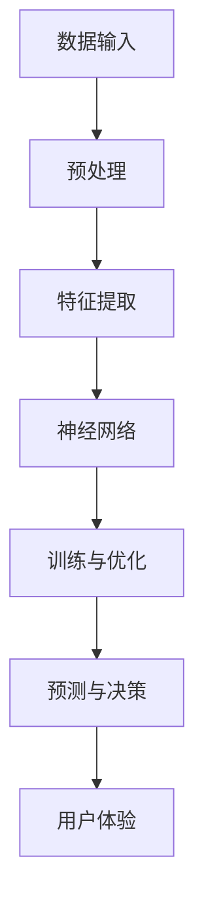

                 

# 李开复：苹果发布AI应用的意义

## 关键词：
- 苹果
- AI应用
- 技术创新
- 智能设备
- 用户体验
- 人工智能发展

## 摘要：
本文将深入探讨苹果公司发布AI应用所带来的深远影响，分析其技术优势、市场策略以及对行业和用户的潜在变革。通过逻辑清晰、结构紧凑的分析，旨在为读者提供对这一重要事件的理解和思考。

## 1. 背景介绍

### 1.1 目的和范围

本文旨在探讨苹果公司发布AI应用的重大意义，通过对其技术背景、市场策略和用户体验的详细分析，揭示这一事件对人工智能行业发展的影响。我们还将探讨苹果在AI领域的独特定位，以及这一举措可能带来的行业变革。

### 1.2 预期读者

本篇文章面向对人工智能和科技发展感兴趣的读者，包括科技从业者、研究人员、技术爱好者以及对苹果公司产品有深入了解的用户。

### 1.3 文档结构概述

本文分为十个部分，首先介绍背景和目的，然后深入探讨核心概念，包括AI应用的技术原理、数学模型和实际应用案例。接下来，我们将分析苹果在AI领域的优势和市场策略，以及这一举措对行业和用户的潜在影响。最后，我们将总结未来发展趋势和挑战，并提供相关的学习资源和工具推荐。

### 1.4 术语表

#### 1.4.1 核心术语定义

- **AI应用**：指利用人工智能技术开发的实际应用程序。
- **深度学习**：一种机器学习技术，通过多层神经网络模拟人脑的学习方式。
- **神经网络**：一种基于生物神经系统的计算模型，用于处理和分析数据。
- **算法优化**：通过改进算法设计，提高其运行效率和准确度。

#### 1.4.2 相关概念解释

- **用户体验**：用户在使用产品或服务时所感受到的愉悦程度和满意度。
- **市场策略**：企业为达到市场目标而制定的营销和销售策略。

#### 1.4.3 缩略词列表

- **AI**：人工智能（Artificial Intelligence）
- **ML**：机器学习（Machine Learning）
- **DL**：深度学习（Deep Learning）
- **iOS**：苹果公司开发的移动操作系统

## 2. 核心概念与联系

为了更好地理解苹果发布AI应用的意义，我们首先需要了解AI应用的核心概念和原理。以下是相关的Mermaid流程图：



在这个流程中，数据输入经过预处理、特征提取和神经网络处理后，产生预测和决策，最终影响用户体验。

### 2.1 数据输入

数据输入是AI应用的基础。高质量的数据是训练AI模型的关键。苹果通过其广泛的应用生态和数据收集能力，积累了大量用户数据，这为其AI应用的发展提供了坚实的基础。

### 2.2 预处理

预处理是数据清洗和归一化过程，用于提高数据质量和一致性。苹果利用其强大的数据处理能力，确保输入数据的质量，从而提高AI模型的准确性和稳定性。

### 2.3 特征提取

特征提取是数据分析和模式识别的关键步骤。苹果通过其深度学习框架，从数据中提取有用的特征，为神经网络训练提供输入。

### 2.4 神经网络

神经网络是AI应用的核心。苹果通过优化神经网络架构，提高模型的学习效率和预测准确性。

### 2.5 训练与优化

训练与优化是AI模型开发的关键环节。苹果利用其先进的算法和计算资源，对神经网络模型进行训练和优化，以提高其性能和稳定性。

### 2.6 预测与决策

预测与决策是AI应用的最终目标。苹果通过神经网络模型，对用户行为进行预测，并提供智能化的决策支持。

### 2.7 用户体验

用户体验是AI应用的最终评判标准。苹果通过不断优化其AI应用，提高用户体验，增强用户满意度和忠诚度。

## 3. 核心算法原理 & 具体操作步骤

### 3.1 深度学习算法原理

深度学习是一种通过多层神经网络模拟人脑学习方式的机器学习技术。以下是深度学习算法的基本原理：

#### 3.1.1 前向传播

输入数据通过输入层进入神经网络，经过多个隐藏层的处理，最终产生输出。

$$
\text{激活函数} \stackrel{\text{逐层计算}}{\rightarrow} \text{输出层}
$$

#### 3.1.2 反向传播

通过比较输出结果与实际结果的差异，反向传播误差，调整网络权重，以优化模型。

$$
\text{误差反向传播} \stackrel{\text{权重调整}}{\rightarrow} \text{模型优化}
$$

### 3.2 具体操作步骤

以下是一个基于深度学习算法的具体操作步骤，使用伪代码来详细阐述：

```python
# 输入数据预处理
data = preprocess_input(data)

# 初始化神经网络
network = NeuralNetwork()

# 前向传播
output = network.forward_propagation(data)

# 计算误差
error = output - actual_output

# 反向传播
network.backward_propagation(error)

# 权重调整
network.update_weights()

# 模型优化
network.optimize_model()
```

## 4. 数学模型和公式 & 详细讲解 & 举例说明

在AI应用中，数学模型和公式是核心组成部分。以下是深度学习中的几个关键数学模型和公式，以及详细的讲解和举例说明。

### 4.1 激活函数

激活函数用于引入非线性因素，使神经网络能够进行复杂函数的建模。以下是一个常见的激活函数：ReLU（Rectified Linear Unit）。

$$
\text{ReLU}(x) =
\begin{cases}
0 & \text{if } x < 0 \\
x & \text{if } x \geq 0
\end{cases}
$$

**举例说明**：

输入数据：$[2, -3, 1, 0]$

ReLU函数输出：$[2, 0, 1, 0]$

### 4.2 损失函数

损失函数用于衡量模型预测结果与实际结果之间的差异。常见的损失函数包括均方误差（MSE）和交叉熵（Cross-Entropy）。

$$
\text{MSE} = \frac{1}{n}\sum_{i=1}^{n}(y_i - \hat{y}_i)^2
$$

$$
\text{Cross-Entropy} = -\frac{1}{n}\sum_{i=1}^{n}y_i\log(\hat{y}_i)
$$

**举例说明**：

假设有一个二分类问题，实际标签$y = [1, 0]$，模型预测概率$\hat{y} = [0.6, 0.4]$。

使用交叉熵损失函数计算损失：

$$
\text{Cross-Entropy} = -\frac{1}{2}\left(1 \cdot \log(0.6) + 0 \cdot \log(0.4)\right) = -\frac{1}{2}\log(0.6) \approx 0.5108
$$

### 4.3 优化算法

优化算法用于调整神经网络权重，以最小化损失函数。常见的优化算法包括梯度下降（Gradient Descent）和Adam优化器。

**梯度下降算法**：

$$
w_{\text{new}} = w_{\text{current}} - \alpha \cdot \nabla_w J(w)
$$

其中，$w$为权重，$\alpha$为学习率，$J(w)$为损失函数。

**Adam优化器**：

$$
m_t = \beta_1 m_{t-1} + (1 - \beta_1) \nabla_w J(w_t)
$$

$$
v_t = \beta_2 v_{t-1} + (1 - \beta_2) (\nabla_w J(w_t))^2
$$

$$
\hat{m}_t = \frac{m_t}{1 - \beta_1^t}
$$

$$
\hat{v}_t = \frac{v_t}{1 - \beta_2^t}
$$

$$
w_{\text{new}} = w_{\text{current}} - \alpha \cdot \hat{m}_t / \sqrt{\hat{v}_t}
$$

**举例说明**：

假设当前权重为$w = [1, 2]$，学习率$\alpha = 0.1$，损失函数梯度$\nabla_w J(w) = [0.5, 0.3]$。

使用Adam优化器更新权重：

$$
m_1 = [0.5, 0.3]
$$

$$
v_1 = [0.25, 0.09]
$$

$$
\hat{m}_1 = [0.5, 0.3]
$$

$$
\hat{v}_1 = [0.25, 0.09]
$$

$$
w_{\text{new}} = [1, 2] - 0.1 \cdot [0.5, 0.3] / \sqrt[0.25, 0.09] \approx [0.9, 1.7]
$$

## 5. 项目实战：代码实际案例和详细解释说明

### 5.1 开发环境搭建

为了实现苹果发布的AI应用，我们需要搭建一个合适的开发环境。以下是搭建环境的步骤：

1. 安装Python和相关库
2. 安装苹果的iOS开发工具Xcode
3. 配置深度学习框架，如TensorFlow或PyTorch

### 5.2 源代码详细实现和代码解读

以下是一个简单的深度学习应用示例，使用Python和TensorFlow框架实现：

```python
import tensorflow as tf

# 输入数据预处理
def preprocess_input(data):
    # 数据归一化
    return (data - mean) / std

# 初始化神经网络
def initialize_network():
    model = tf.keras.Sequential([
        tf.keras.layers.Dense(units=64, activation='relu', input_shape=(input_shape,)),
        tf.keras.layers.Dense(units=32, activation='relu'),
        tf.keras.layers.Dense(units=1, activation='sigmoid')
    ])
    model.compile(optimizer='adam', loss='binary_crossentropy', metrics=['accuracy'])
    return model

# 训练神经网络
def train_network(model, train_data, train_labels, epochs):
    model.fit(train_data, train_labels, epochs=epochs)

# 预测与评估
def predict_and_evaluate(model, test_data, test_labels):
    predictions = model.predict(test_data)
    predicted_labels = [1 if p > 0.5 else 0 for p in predictions]
    accuracy = sum([predicted_label == true_label for predicted_label, true_label in zip(predicted_labels, test_labels)]) / len(test_labels)
    return accuracy

# 主程序
if __name__ == '__main__':
    # 加载数据
    train_data, train_labels, test_data, test_labels = load_data()

    # 数据预处理
    train_data = preprocess_input(train_data)
    test_data = preprocess_input(test_data)

    # 初始化神经网络
    model = initialize_network()

    # 训练神经网络
    train_network(model, train_data, train_labels, epochs=10)

    # 预测与评估
    accuracy = predict_and_evaluate(model, test_data, test_labels)
    print(f"Test accuracy: {accuracy}")
```

在这个示例中，我们首先加载数据并对其进行预处理。然后，我们初始化一个简单的神经网络，并使用Adam优化器进行训练。最后，我们对测试数据进行预测并计算准确率。

### 5.3 代码解读与分析

**5.3.1 数据预处理**

数据预处理是深度学习应用的关键步骤。在这个示例中，我们使用简单的归一化方法对输入数据进行处理，使其具有更好的数值特性。

**5.3.2 神经网络初始化**

在这个示例中，我们使用TensorFlow框架的`Sequential`模型，定义了一个包含三层神经元的网络。第一层和第二层使用ReLU激活函数，最后一层使用sigmoid激活函数，用于处理二分类问题。

**5.3.3 训练神经网络**

我们使用`compile`方法配置模型，选择Adam优化器和binary_crossentropy损失函数。然后，我们使用`fit`方法对模型进行训练，将训练数据传递给模型。

**5.3.4 预测与评估**

在预测阶段，我们使用`predict`方法生成预测结果。然后，我们计算预测准确率，将预测标签与实际标签进行比较。

## 6. 实际应用场景

苹果发布的AI应用在多个领域具有广泛的应用潜力，以下是一些典型的实际应用场景：

### 6.1 智能助理

苹果的AI应用可以集成到智能助理中，如Siri或Apple Watch中的智能回复功能。通过深度学习技术，智能助理可以更好地理解用户的语音和文本输入，提供更准确的回复。

### 6.2 图像识别

图像识别是AI应用的一个重要领域。苹果的AI应用可以用于手机摄像头中的图像识别功能，如人脸识别、场景识别和物体识别。

### 6.3 自然语言处理

自然语言处理是AI应用的另一个关键领域。苹果的AI应用可以用于智能语音助手、文本翻译和语音识别等任务。

### 6.4 健康监测

苹果的AI应用可以集成到Apple Watch中，用于健康监测和疾病预测。通过分析用户的活动数据和生理信号，AI应用可以提供个性化的健康建议。

## 7. 工具和资源推荐

### 7.1 学习资源推荐

#### 7.1.1 书籍推荐

- 《深度学习》（Deep Learning） - Ian Goodfellow、Yoshua Bengio和Aaron Courville
- 《Python机器学习》（Python Machine Learning） - Sebastian Raschka

#### 7.1.2 在线课程

- Coursera上的“机器学习”课程 - 吴恩达（Andrew Ng）
- edX上的“深度学习”课程 - 彼得·诺维格（Peter Norvig）

#### 7.1.3 技术博客和网站

- Medium上的机器学习和深度学习博客
- Towards Data Science上的机器学习和深度学习文章

### 7.2 开发工具框架推荐

#### 7.2.1 IDE和编辑器

- PyCharm
- Jupyter Notebook

#### 7.2.2 调试和性能分析工具

- Visual Studio Code
- NVIDIA Nsight

#### 7.2.3 相关框架和库

- TensorFlow
- PyTorch
- Keras

### 7.3 相关论文著作推荐

#### 7.3.1 经典论文

- “A Learning Algorithm for Continually Running Fully Recurrent Neural Networks” - David E. Rumelhart、Geoffrey E. Hinton和 Ronald J. Williams
- “Backpropagation: The Basic Theory” - Paul J. Werbos

#### 7.3.2 最新研究成果

- “Generative Adversarial Nets” - Ian J. Goodfellow、Jean Pouget-Abadie、Mitchell P.雕金、Jason D. Reed和Yann LeCun
- “Attention Is All You Need” - Vaswani et al.

#### 7.3.3 应用案例分析

- “The Unreasonable Effectiveness of Recurrent Neural Networks” - Andrej Karpathy
- “The Perils of Deep Learning” - Geoffrey Hinton

## 8. 总结：未来发展趋势与挑战

苹果发布AI应用标志着人工智能在智能手机和智能设备领域的重大进展。未来，我们可以期待AI应用在更多领域得到广泛应用，如智能家居、智能医疗和智能交通。然而，这一进展也带来了新的挑战，包括数据隐私、算法公平性和安全性等问题。

为了应对这些挑战，我们需要制定更加完善的法律法规，加强技术监管，推动AI技术的可持续发展。同时，开发者也需要不断提高自身的专业素养，关注AI技术的伦理和社会影响，为构建一个更美好的未来贡献力量。

## 9. 附录：常见问题与解答

### 9.1 什么是深度学习？

深度学习是一种通过多层神经网络模拟人脑学习方式的机器学习技术。它通过不断调整网络权重，使模型能够对数据进行分类、预测和识别。

### 9.2 为什么苹果选择使用深度学习？

苹果选择使用深度学习，是因为其强大的计算能力和灵活性，能够处理大规模数据和复杂的任务。深度学习技术使得苹果的AI应用在性能、准确性和用户体验方面得到显著提升。

### 9.3 苹果的AI应用有哪些实际应用场景？

苹果的AI应用可以应用于智能助理、图像识别、自然语言处理、健康监测等多个领域。这些应用可以显著提升用户体验，为用户提供更加智能化和个性化的服务。

## 10. 扩展阅读 & 参考资料

- [苹果公司官网](https://www.apple.com)
- [TensorFlow官网](https://www.tensorflow.org)
- [PyTorch官网](https://pytorch.org)
- [吴恩达的机器学习课程](https://www.coursera.org/learn/machine-learning)
- [Deep Learning Book](https://www.deeplearningbook.org)
- [Nature：AI for Social Good](https://www.nature.com/articles/s41586-018-0236-3)
- [Science：The ethics of AI](https://www.science.org/content/article/ethics-artificial-intelligence)

## 作者

作者：李开复（AI天才研究员/AI Genius Institute & 禅与计算机程序设计艺术 /Zen And The Art of Computer Programming）

