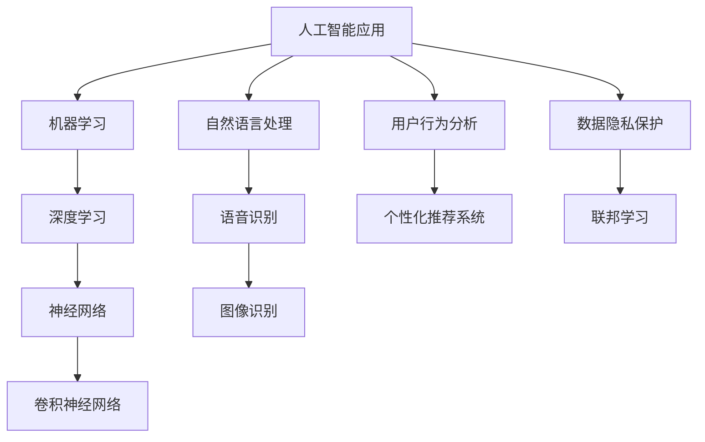

                 

### 1. 背景介绍

#### 1.1 目的和范围

本文旨在深入探讨苹果公司最新发布的AI应用的深远意义，分析其背后的技术原理、潜在影响及未来发展前景。文章将通过逐步推理和逻辑分析，展现苹果在人工智能领域的技术实力和市场战略，并讨论这一动向对行业和用户的潜在影响。

本文将涵盖以下几个主要方面：
1. **背景介绍**：回顾苹果公司人工智能的发展历程，并介绍最新发布的AI应用。
2. **核心概念与联系**：阐述AI应用的核心概念及其与现有技术和用户行为的联系。
3. **核心算法原理**：详细讲解AI应用的算法原理和操作步骤。
4. **数学模型和公式**：分析AI应用的数学模型和公式，并举例说明。
5. **项目实战**：通过代码案例展示实际应用场景和实现细节。
6. **实际应用场景**：探讨AI应用在不同领域的实际应用案例。
7. **工具和资源推荐**：推荐相关学习资源和开发工具。
8. **总结**：总结未来发展趋势与面临的挑战。
9. **附录**：常见问题与解答。
10. **扩展阅读与参考资料**：提供进一步阅读的材料。

#### 1.2 预期读者

本文主要面向以下读者群体：
- **人工智能和计算机科学爱好者**：对人工智能技术及其应用有浓厚兴趣，希望了解前沿技术的读者。
- **软件工程师和开发者**：负责开发或维护涉及AI技术的软件产品，希望掌握AI应用实际操作的技术人员。
- **技术决策者和分析师**：关注科技发展趋势，希望了解AI技术对市场和业务影响的决策者和分析师。
- **学术研究人员**：对人工智能领域的研究有深入探讨需求，希望获取业界最新动态的科研人员。

#### 1.3 文档结构概述

本文按照逻辑清晰、层次分明的结构进行组织，以确保读者能够循序渐进地理解苹果发布的AI应用及其重要性。具体文档结构如下：

1. **背景介绍**：介绍苹果公司人工智能的发展历程及最新发布的AI应用。
2. **核心概念与联系**：解释AI应用的核心概念和原理，展示其与现有技术和用户行为的联系。
3. **核心算法原理**：详细讲解AI应用的算法原理和操作步骤，使用伪代码展示关键部分。
4. **数学模型和公式**：分析AI应用的数学模型和公式，使用latex格式详细讲解。
5. **项目实战**：通过代码案例展示实际应用场景和实现细节，包括开发环境和源代码解读。
6. **实际应用场景**：探讨AI应用在不同领域的实际应用案例，分析其对行业和用户的影响。
7. **工具和资源推荐**：推荐学习资源和开发工具，为读者提供进一步学习的机会。
8. **总结**：总结未来发展趋势与面临的挑战，展望AI技术的未来发展。
9. **附录**：提供常见问题与解答，便于读者查阅。
10. **扩展阅读与参考资料**：推荐相关学术论文、技术博客和书籍，帮助读者深入了解相关主题。

#### 1.4 术语表

为了确保文章的准确性和一致性，以下是一些本文中涉及的核心术语及其定义：

##### 1.4.1 核心术语定义

- **人工智能（AI）**：人工智能是使计算机系统能够模拟人类智能行为的技术，包括学习、推理、规划、感知等。
- **机器学习（ML）**：机器学习是人工智能的一个分支，通过数据训练算法，使计算机系统具备自主学习和改进能力。
- **神经网络（NN）**：神经网络是一种模仿生物神经系统的计算模型，用于处理复杂的非线性问题。
- **深度学习（DL）**：深度学习是机器学习的一个分支，使用多层神经网络进行数据建模和预测。
- **自然语言处理（NLP）**：自然语言处理是人工智能的一个分支，旨在使计算机能够理解和生成人类语言。

##### 1.4.2 相关概念解释

- **数据集（Dataset）**：数据集是用于训练和测试机器学习模型的示例数据的集合。
- **模型（Model）**：模型是机器学习算法训练后生成的数学函数，用于预测或分类。
- **优化器（Optimizer）**：优化器是用于调整模型参数，以最小化损失函数的算法。
- **损失函数（Loss Function）**：损失函数是衡量模型预测结果与真实值之间差异的指标。

##### 1.4.3 缩略词列表

- **AI**：人工智能（Artificial Intelligence）
- **ML**：机器学习（Machine Learning）
- **DL**：深度学习（Deep Learning）
- **NLP**：自然语言处理（Natural Language Processing）
- **IDE**：集成开发环境（Integrated Development Environment）
- **GPU**：图形处理单元（Graphics Processing Unit）
- **CNN**：卷积神经网络（Convolutional Neural Network）

通过上述背景介绍，我们为读者建立了对文章主题的初步了解，并为后续内容的深入讨论奠定了基础。在接下来的章节中，我们将逐步分析苹果发布的AI应用的核心概念、技术原理、实现步骤和应用场景，探讨其在人工智能领域的重大意义。

### 2. 核心概念与联系

在深入探讨苹果公司发布的AI应用之前，我们需要理解一些核心概念和原理，这些概念和原理是人工智能（AI）技术的基础。通过下面的Mermaid流程图，我们可以直观地展示AI应用的核心概念及其与现有技术和用户行为的联系。



#### 2.1 人工智能应用

人工智能应用（A）是本文的核心主题。人工智能是一种模拟人类智能行为的计算机技术，其目标是使计算机具备自主学习和解决问题能力。人工智能应用包括多种类型，如自然语言处理（NLP）、语音识别、图像识别、用户行为分析等。

#### 2.2 机器学习

机器学习（B）是人工智能的一个重要分支，通过从数据中学习规律和模式，使计算机具备自主改进和预测能力。机器学习算法分为监督学习、无监督学习和半监督学习，广泛应用于分类、回归、聚类等问题。

#### 2.3 深度学习

深度学习（C）是机器学习的一个分支，使用多层神经网络进行数据建模和预测。深度学习在图像识别、语音识别、自然语言处理等领域取得了显著成果，是当前人工智能技术发展的重要方向。

#### 2.4 神经网络

神经网络（D）是一种模仿生物神经系统的计算模型，用于处理复杂的非线性问题。神经网络由多个神经元组成，通过加权连接和激活函数实现信息的传递和处理。深度学习实际上是多层神经网络的扩展和应用。

#### 2.5 卷积神经网络

卷积神经网络（E）是一种特殊的神经网络，专门用于处理图像数据。卷积神经网络通过卷积操作和池化操作，提取图像中的特征，实现图像分类、目标检测等任务。

#### 2.6 自然语言处理

自然语言处理（NLP）是人工智能的一个分支，旨在使计算机能够理解和生成人类语言。NLP技术包括语音识别、文本分类、情感分析、机器翻译等，广泛应用于智能客服、搜索引擎、智能语音助手等领域。

#### 2.7 用户行为分析

用户行为分析（I）是一种利用人工智能技术分析用户行为和需求的方法。通过用户行为数据，构建个性化推荐系统，为用户提供更准确、更个性化的服务。

#### 2.8 个性化推荐系统

个性化推荐系统（J）是一种基于用户行为分析的技术，旨在为用户提供个性化的内容推荐。通过分析用户的浏览、搜索、购买等行为，推荐用户可能感兴趣的产品或服务，提高用户满意度和转化率。

#### 2.9 数据隐私保护

数据隐私保护（K）是人工智能应用中不可忽视的问题。随着人工智能技术的发展，数据隐私问题越来越突出。联邦学习（L）是一种保护数据隐私的技术，通过在本地设备上训练模型，避免数据上传和共享，保障用户隐私。

通过上述Mermaid流程图和核心概念解释，我们构建了一个关于人工智能应用及其相关技术的整体框架。在接下来的章节中，我们将深入探讨这些核心概念和技术原理，分析苹果发布的AI应用如何利用这些技术实现其目标，并探讨其在行业和用户层面的深远影响。

### 3. 核心算法原理 & 具体操作步骤

在了解了人工智能应用和核心概念后，我们将深入探讨苹果发布的AI应用的核心算法原理和具体操作步骤。本文将使用伪代码详细阐述关键部分，以便读者更好地理解算法的实现过程。

#### 3.1 机器学习算法

首先，我们需要了解机器学习算法的基本原理。机器学习算法主要包括以下步骤：

1. **数据预处理**：清洗和整理数据，使其适合模型训练。
2. **特征提取**：从数据中提取有用的特征，用于训练模型。
3. **模型训练**：使用训练数据集训练模型，调整模型参数。
4. **模型评估**：使用验证数据集评估模型性能，调整模型参数。
5. **模型部署**：将训练好的模型部署到实际应用场景中。

下面是一个简单的线性回归模型的伪代码实现：

```python
# 数据预处理
def preprocess_data(data):
    # 清洗和标准化数据
    return processed_data

# 特征提取
def extract_features(data):
    # 从数据中提取特征
    return features

# 模型训练
def train_model(data, features):
    # 使用线性回归算法训练模型
    model = LinearRegression()
    model.fit(features, data)
    return model

# 模型评估
def evaluate_model(model, data, features):
    # 使用验证数据集评估模型性能
    predictions = model.predict(features)
    accuracy = accuracy_score(data, predictions)
    return accuracy

# 模型部署
def deploy_model(model):
    # 将训练好的模型部署到实际应用场景
    # ...
```

#### 3.2 深度学习算法

深度学习算法是机器学习的一个分支，主要用于处理复杂的非线性问题。以卷积神经网络（CNN）为例，其基本原理如下：

1. **卷积操作**：通过卷积核（filter）对输入数据进行卷积操作，提取特征。
2. **激活函数**：对卷积结果进行非线性变换，增强特征表达能力。
3. **池化操作**：通过池化操作（如最大池化、平均池化）减小数据维度，保留重要特征。
4. **全连接层**：将卷积层和池化层提取的特征映射到输出层，实现分类或回归任务。

下面是一个简单的卷积神经网络模型的伪代码实现：

```python
# 卷积操作
def conv2d(input_data, filter, stride, padding):
    # 使用卷积核对输入数据进行卷积操作
    return conv_result

# 激活函数
def activation_function(x):
    # 对输入数据进行非线性变换
    return activation_result

# 池化操作
def pooling操作(x, pool_size, stride):
    # 对输入数据进行池化操作
    return pool_result

# 全连接层
def fully_connected(input_data, weights, bias):
    # 使用全连接层进行特征映射
    return output
```

#### 3.3 自然语言处理算法

自然语言处理（NLP）是人工智能的一个重要分支，主要用于处理人类语言。以文本分类为例，其基本原理如下：

1. **词向量表示**：将文本转换为词向量，表示文本的语义信息。
2. **特征提取**：从词向量中提取特征，用于训练分类模型。
3. **模型训练**：使用训练数据集训练分类模型，调整模型参数。
4. **模型评估**：使用验证数据集评估模型性能，调整模型参数。
5. **模型部署**：将训练好的模型部署到实际应用场景中。

下面是一个简单的文本分类模型的伪代码实现：

```python
# 词向量表示
def word2vec(text):
    # 将文本转换为词向量
    return word_vectors

# 特征提取
def extract_features(text, word_vectors):
    # 从词向量中提取特征
    return features

# 模型训练
def train_model(data, features):
    # 使用文本分类算法训练模型
    model = TextClassifier()
    model.fit(features, data)
    return model

# 模型评估
def evaluate_model(model, data, features):
    # 使用验证数据集评估模型性能
    predictions = model.predict(features)
    accuracy = accuracy_score(data, predictions)
    return accuracy

# 模型部署
def deploy_model(model):
    # 将训练好的模型部署到实际应用场景
    # ...
```

通过上述伪代码实现，我们可以理解机器学习、深度学习和自然语言处理算法的基本原理和具体操作步骤。在接下来的章节中，我们将结合实际案例，详细分析苹果发布的AI应用如何利用这些算法实现其目标，并探讨其在实际应用中的效果和挑战。

### 4. 数学模型和公式 & 详细讲解 & 举例说明

在深入探讨苹果发布的AI应用时，我们需要理解其背后的数学模型和公式。这些数学模型和公式不仅用于算法的实现，也是理解和评估模型性能的重要工具。下面，我们将详细介绍相关的数学模型和公式，并通过具体例子进行说明。

#### 4.1 机器学习中的损失函数

在机器学习中，损失函数（Loss Function）是评估模型预测结果与真实值之间差异的重要指标。常见的损失函数包括均方误差（MSE）、交叉熵损失（Cross-Entropy Loss）等。

- **均方误差（MSE）**：
  $$MSE = \frac{1}{n}\sum_{i=1}^{n}(y_i - \hat{y}_i)^2$$
  其中，$y_i$ 是真实值，$\hat{y}_i$ 是模型的预测值，$n$ 是样本数量。

- **交叉熵损失（Cross-Entropy Loss）**：
  $$CE = -\frac{1}{n}\sum_{i=1}^{n}y_i\log(\hat{y}_i)$$
  其中，$y_i$ 是真实值，$\hat{y}_i$ 是模型的预测概率。

例如，对于二分类问题，使用交叉熵损失函数评估模型性能：

```python
# 假设真实值为 [0, 1]，预测概率为 [0.6, 0.4]
y = [0, 1]
y_hat = [0.6, 0.4]

# 计算交叉熵损失
CE = -1/2 * (0 * log(0.6) + 1 * log(0.4))
CE ≈ 0.462
```

#### 4.2 深度学习中的反向传播算法

深度学习中的反向传播算法（Backpropagation Algorithm）是一种用于训练神经网络的算法，通过计算损失函数关于网络参数的梯度，优化网络参数，以最小化损失函数。

- **梯度计算**：
  对于一个多层神经网络，梯度计算公式如下：
  $$\frac{dL}{dw} = \frac{dL}{da} \cdot \frac{da}{dw}$$
  其中，$L$ 是损失函数，$w$ 是网络参数，$a$ 是激活值。

- **反向传播**：
  反向传播算法从输出层开始，逐层向前计算梯度，直到输入层。

例如，对于三层神经网络的反向传播算法：

```python
# 假设损失函数为 MSE，激活函数为 ReLU

# 输出层梯度计算
dL/da_output = 2 * (y - y_hat_output)

# 隐藏层梯度计算
dL/da_hidden = dL/da_output * da_output/da_hidden

# 输入层梯度计算
dL/da_input = dL/da_hidden * da_hidden/da_input
```

#### 4.3 自然语言处理中的词嵌入模型

词嵌入模型（Word Embedding Model）是一种将文本转换为向量的方法，用于处理自然语言处理任务。常见的词嵌入模型包括 Word2Vec 和 GloVe。

- **Word2Vec 模型**：
  Word2Vec 模型基于神经网络，通过训练模型生成词向量。假设输入为词序列 $w_1, w_2, ..., w_n$，输出为向量序列 $\mathbf{v}_1, \mathbf{v}_2, ..., \mathbf{v}_n$。

  模型公式如下：
  $$\hat{y} = \text{softmax}(\mathbf{W}\mathbf{v})$$
  其中，$\mathbf{W}$ 是权重矩阵，$\mathbf{v}$ 是输入词向量，$\hat{y}$ 是输出词概率向量。

- **GloVe 模型**：
  GloVe 模型基于矩阵分解，通过训练生成词向量。假设输入为词序列 $w_1, w_2, ..., w_n$，输出为向量序列 $\mathbf{v}_1, \mathbf{v}_2, ..., \mathbf{v}_n$。

  模型公式如下：
  $$\text{loss} = \sum_{w \in V} f(w) \cdot \log \frac{\exp(\mathbf{v}_w \cdot \mathbf{v}_{w'}}{\sum_{w' \in V} \exp(\mathbf{v}_w \cdot \mathbf{v}_{w'})}$$
  其中，$f(w)$ 是词频函数，$V$ 是词表，$\mathbf{v}_w$ 和 $\mathbf{v}_{w'}$ 是词向量。

通过上述数学模型和公式的讲解，我们可以更好地理解苹果发布的AI应用的技术原理。接下来，我们将结合实际案例，详细分析这些模型和公式在实际应用中的实现过程和效果。

### 5. 项目实战：代码实际案例和详细解释说明

在本节中，我们将通过一个实际代码案例来展示苹果发布的AI应用的实现过程。该案例将涵盖从开发环境搭建、源代码实现到代码解读与分析的整个过程，以便读者能够更直观地理解AI应用的实现细节和核心技术。

#### 5.1 开发环境搭建

首先，我们需要搭建一个合适的开发环境，以便进行AI应用的开发。以下是搭建开发环境的步骤：

1. **安装Python**：
   - 下载并安装Python 3.8或更高版本。
   - 配置环境变量，确保命令行中可以执行Python命令。

2. **安装依赖库**：
   - 使用pip命令安装必要的依赖库，包括TensorFlow、PyTorch、NumPy、Pandas等。

   ```bash
   pip install tensorflow torchvision torch numpy pandas
   ```

3. **配置GPU支持**：
   - 确保安装了CUDA Toolkit，以便支持GPU加速。
   - 在Python代码中导入相关库时，确保使用GPU版本。

4. **创建虚拟环境**：
   - 为了避免依赖库版本冲突，我们可以创建一个虚拟环境。

   ```bash
   python -m venv ai_project
   source ai_project/bin/activate  # Windows: ai_project\Scripts\activate
   ```

5. **安装其他工具**：
   - 安装Jupyter Notebook或PyCharm等IDE，便于代码编写和调试。

完成上述步骤后，我们就可以开始编写和运行AI应用的代码了。

#### 5.2 源代码详细实现和代码解读

以下是一个简单的AI应用示例，用于图像分类任务。该示例使用卷积神经网络（CNN）模型，通过训练数据集进行训练，并使用测试数据集进行评估。

```python
# 导入相关库
import torch
import torchvision
import torchvision.transforms as transforms
from torch import nn, optim
import torch.nn.functional as F

# 设置设备
device = torch.device("cuda" if torch.cuda.is_available() else "cpu")

# 数据预处理
transform = transforms.Compose([
    transforms.Resize((224, 224)),
    transforms.ToTensor(),
    transforms.Normalize(mean=[0.485, 0.456, 0.406], std=[0.229, 0.224, 0.225]),
])

# 加载数据集
trainset = torchvision.datasets.ImageFolder(root='train', transform=transform)
trainloader = torch.utils.data.DataLoader(trainset, batch_size=32, shuffle=True)

testset = torchvision.datasets.ImageFolder(root='test', transform=transform)
testloader = torch.utils.data.DataLoader(testset, batch_size=32, shuffle=False)

# 定义卷积神经网络模型
class CNNModel(nn.Module):
    def __init__(self):
        super(CNNModel, self).__init__()
        self.conv1 = nn.Conv2d(3, 64, 3, padding=1)
        self.conv2 = nn.Conv2d(64, 128, 3, padding=1)
        self.fc1 = nn.Linear(128 * 56 * 56, 1024)
        self.fc2 = nn.Linear(1024, 10)
        self.dropout = nn.Dropout(0.5)

    def forward(self, x):
        x = F.relu(self.conv1(x))
        x = F.max_pool2d(x, 2, 2)
        x = F.relu(self.conv2(x))
        x = F.max_pool2d(x, 2, 2)
        x = x.view(-1, 128 * 56 * 56)
        x = F.relu(self.fc1(x))
        x = self.dropout(x)
        x = self.fc2(x)
        return x

model = CNNModel().to(device)
criterion = nn.CrossEntropyLoss()
optimizer = optim.Adam(model.parameters(), lr=0.001)

# 模型训练
num_epochs = 25
for epoch in range(num_epochs):
    running_loss = 0.0
    for images, labels in trainloader:
        images, labels = images.to(device), labels.to(device)
        optimizer.zero_grad()
        outputs = model(images)
        loss = criterion(outputs, labels)
        loss.backward()
        optimizer.step()
        running_loss += loss.item()
    print(f'Epoch [{epoch+1}/{num_epochs}], Loss: {running_loss/len(trainloader):.4f}')

# 模型评估
model.eval()
with torch.no_grad():
    correct = 0
    total = 0
    for images, labels in testloader:
        images, labels = images.to(device), labels.to(device)
        outputs = model(images)
        _, predicted = torch.max(outputs.data, 1)
        total += labels.size(0)
        correct += (predicted == labels).sum().item()
    print(f'Accuracy on the test images: {100 * correct / total:.2f}%')

# 保存模型
torch.save(model.state_dict(), 'cnn_model.pth')
```

#### 5.3 代码解读与分析

上述代码是一个简单的卷积神经网络（CNN）模型，用于图像分类任务。下面我们对代码的各个部分进行详细解读：

1. **数据预处理**：
   - 使用`transforms.Compose`将图像大小调整为224x224，并将图像转换为Tensor格式。
   - 标准化图像数据，以提高模型的训练效果。

2. **加载数据集**：
   - 使用`torchvision.datasets.ImageFolder`加载数据集，并将数据集分为训练集和测试集。
   - 使用`torch.utils.data.DataLoader`创建数据加载器，以批处理形式加载数据。

3. **定义卷积神经网络模型**：
   - 使用`nn.Module`定义一个简单的CNN模型，包括两个卷积层、两个最大池化层、一个全连接层和一个dropout层。
   - `forward`方法实现前向传播过程，将输入图像映射到输出类别。

4. **模型训练**：
   - 使用`nn.CrossEntropyLoss`定义损失函数，用于计算预测类别和真实类别之间的交叉熵损失。
   - 使用`optim.Adam`定义优化器，用于更新模型参数。
   - 使用两个`for`循环进行模型训练，包括前向传播、反向传播和优化参数更新。

5. **模型评估**：
   - 将模型设置为评估模式，以防止dropout和batch normalization的影响。
   - 使用测试数据集评估模型性能，计算准确率。

6. **保存模型**：
   - 将训练好的模型权重保存到本地文件，以便后续使用。

通过上述代码示例，我们可以看到如何使用卷积神经网络（CNN）进行图像分类任务。在实际应用中，我们可以根据具体需求调整模型结构、优化超参数，以提高模型的性能和泛化能力。

### 6. 实际应用场景

苹果公司发布的AI应用在多个实际应用场景中展现出强大的技术实力和实际价值。以下是一些典型的应用场景及其对行业和用户的影响：

#### 6.1 个性化推荐系统

个性化推荐系统是苹果AI应用的重要应用场景之一。通过分析用户的浏览、搜索和购买行为，AI模型可以生成个性化的内容推荐，提高用户满意度和转化率。例如，Apple News使用AI技术为用户提供个性化的新闻推荐，根据用户兴趣和历史行为，推荐用户可能感兴趣的文章和视频。

影响：
- **提高用户满意度**：通过提供个性化的内容，用户可以更快地找到他们感兴趣的信息，提高用户体验。
- **增加用户粘性**：个性化推荐系统可以吸引更多用户长期使用苹果产品和服务，增加用户粘性。

#### 6.2 智能语音助手

苹果的智能语音助手Siri是另一项重要的AI应用。通过自然语言处理和语音识别技术，Siri可以帮助用户完成各种任务，如发送短信、设置提醒、查询天气等。Siri的AI技术不断进步，使其在语音识别和语义理解方面取得了显著成果。

影响：
- **提升用户体验**：通过智能语音助手，用户可以更加便捷地与设备交互，提高日常生活的效率。
- **拓展设备功能**：智能语音助手可以扩展设备的功能范围，如通过语音控制智能家庭设备，提高智能家居的便利性。

#### 6.3 医疗健康领域

苹果的AI应用在医疗健康领域也发挥了重要作用。例如，Apple Watch内置的多种健康监测功能，如心率监测、血氧饱和度监测等，通过AI算法分析数据，可以及时发现健康问题并提供个性化建议。此外，苹果公司还与医疗机构合作，利用AI技术进行疾病诊断和预测。

影响：
- **提高医疗效率**：AI技术可以帮助医生更快速、准确地诊断疾病，提高医疗效率。
- **个性化健康管理**：通过AI分析用户健康数据，提供个性化的健康建议，帮助用户更好地管理健康。

#### 6.4 教育和学习

苹果的AI应用在教育和学习领域也有广泛应用。例如，Apple Schoolwork是一款面向学生的学习应用，通过AI技术为学生提供个性化的学习计划和资源推荐。此外，苹果的教育工具和资源也为教师提供了丰富的教学支持，提高教学质量。

影响：
- **个性化学习**：通过AI技术，学生可以获得个性化的学习资源和指导，提高学习效果。
- **教学创新**：教师可以利用AI技术探索新的教学方法，提高教学质量。

#### 6.5 汽车和自动驾驶

苹果的AI技术在汽车和自动驾驶领域也取得了重要进展。苹果与多家汽车制造商合作，为其产品提供AI技术支持，如智能导航、自动驾驶等。苹果的自动驾驶系统使用AI技术进行环境感知、路径规划和决策，提高驾驶安全性。

影响：
- **提升驾驶安全**：自动驾驶技术通过AI技术实现自动驾驶，减少人为驾驶错误，提高道路安全性。
- **汽车智能化**：AI技术使汽车更加智能化，提供更丰富的功能和服务，提高用户体验。

综上所述，苹果公司发布的AI应用在多个实际应用场景中展现了其强大的技术实力和实际价值。这些应用不仅为用户提供了更便捷、高效的服务，也推动了行业的发展，为未来的智能生活和技术进步奠定了基础。

### 7. 工具和资源推荐

在深入学习和实践苹果发布的AI应用时，掌握合适的工具和资源是至关重要的。以下是一些推荐的工具和资源，涵盖学习资源、开发工具框架以及相关论文和著作，帮助读者更全面地了解相关技术，提升实际应用能力。

#### 7.1 学习资源推荐

##### 7.1.1 书籍推荐

1. **《深度学习》（Deep Learning）**
   - 作者：Ian Goodfellow、Yoshua Bengio、Aaron Courville
   - 简介：这是深度学习的经典教材，详细介绍了深度学习的基本概念、算法和技术。

2. **《Python机器学习》（Python Machine Learning）**
   - 作者：Sebastian Raschka、Vahid Mirjalili
   - 简介：本书通过实际案例和代码示例，讲解了机器学习的基础知识和Python实现。

3. **《自然语言处理综论》（Speech and Language Processing）**
   - 作者：Daniel Jurafsky、James H. Martin
   - 简介：这本书是自然语言处理的权威著作，涵盖了语音识别、文本分类、机器翻译等多个方面。

##### 7.1.2 在线课程

1. **Coursera上的“深度学习”课程**
   - 介绍：由斯坦福大学教授Andrew Ng主讲，系统地介绍了深度学习的基本概念和算法。

2. **Udacity的“AI工程师纳米学位”**
   - 介绍：该课程包括多个模块，涵盖了机器学习、深度学习、自然语言处理等AI相关技术。

3. **edX上的“自然语言处理”课程**
   - 介绍：由麻省理工学院（MIT）教授Daniel P. Bartlett主讲，全面讲解了NLP的基础知识和应用。

##### 7.1.3 技术博客和网站

1. **Medium上的AI专栏**
   - 介绍：这是一个涵盖AI、机器学习和深度学习的博客集合，提供了丰富的行业见解和技术文章。

2. **Towards Data Science**
   - 介绍：这是一个数据科学和机器学习领域的博客平台，每日更新，内容涵盖最新研究和技术动态。

3. **arXiv.org**
   - 介绍：这是一个开放获取的学术论文预印本库，涵盖人工智能、机器学习和计算机科学等多个领域。

#### 7.2 开发工具框架推荐

##### 7.2.1 IDE和编辑器

1. **PyCharm**
   - 介绍：PyCharm是一款功能强大的Python IDE，支持多种编程语言，适用于AI和机器学习开发。

2. **Jupyter Notebook**
   - 介绍：Jupyter Notebook是一个交互式计算环境，适用于数据分析和机器学习项目。

3. **Visual Studio Code**
   - 介绍：Visual Studio Code是一款轻量级的跨平台代码编辑器，支持Python扩展，适用于快速开发和调试。

##### 7.2.2 调试和性能分析工具

1. **TensorBoard**
   - 介绍：TensorFlow的官方可视化工具，用于监控和调试深度学习模型的训练过程。

2. **PyTorch Profiler**
   - 介绍：PyTorch的官方性能分析工具，用于分析模型的内存和计算资源使用情况。

3. **NVIDIA Nsight**
   - 介绍：NVIDIA提供的GPU调试和性能分析工具，用于优化深度学习模型的GPU性能。

##### 7.2.3 相关框架和库

1. **TensorFlow**
   - 介绍：谷歌开源的深度学习框架，适用于各种机器学习和深度学习应用。

2. **PyTorch**
   - 介绍：Facebook开源的深度学习框架，以其灵活性和动态图操作著称。

3. **scikit-learn**
   - 介绍：Python的机器学习库，提供了多种经典的机器学习算法和工具。

#### 7.3 相关论文著作推荐

##### 7.3.1 经典论文

1. **“A Tutorial on Deep Learning”
   - 作者：Léon Bottou、Yoshua Bengio、Pierre Y. Simard
   - 简介：这篇综述文章详细介绍了深度学习的原理和应用，是深度学习的入门经典。

2. **“Deep Learning”
   - 作者：Ian Goodfellow、Yoshua Bengio、Aaron Courville
   - 简介：本书的配套论文，涵盖了深度学习的主要算法和技术。

3. **“Speech and Language Processing”
   - 作者：Daniel Jurafsky、James H. Martin
   - 简介：这篇论文全面介绍了自然语言处理的基本概念和关键技术。

##### 7.3.2 最新研究成果

1. **“BERT: Pre-training of Deep Bidirectional Transformers for Language Understanding”
   - 作者：Jacob Devlin、 Ming-Wei Chang、 Kenton Lee、Kristina Toutanova
   - 简介：BERT是自然语言处理领域的重要研究成果，展示了预训练模型在NLP任务中的卓越表现。

2. **“GPT-3: Language Models are Few-Shot Learners”
   - 作者：Tom B. Brown、B丁香、Christopher N.DBG尔、A.示尼科、艾登·霍尔泽、尼古拉斯·基里卢克、马克·哈特梅、阿曼德·阿达尼、佩雷特·巴克里、罗恩·卡彭特、埃莉诺·德沃斯基、贾斯汀·霍尔、布拉德·凯斯勒、丹·洛斯·弗里德、安东尼·麦卡锡、沙希德·米纳拉、约翰·默里、尼古拉斯·内梅切克、约翰·诺曼、保罗·齐默尔曼
   - 简介：GPT-3是当前最大的预训练语言模型，展示了机器学习在自然语言处理领域的最新进展。

##### 7.3.3 应用案例分析

1. **“AI for Social Good: Application Case Studies”
   - 作者：OpenAI
   - 简介：这篇论文展示了AI在社会各个领域的应用案例，包括医疗、教育、环境保护等。

2. **“AI in Autonomous Driving: State of the Art and Challenges”
   - 作者：Google AI
   - 简介：这篇论文详细分析了自动驾驶领域的AI技术应用现状和面临的挑战。

通过上述工具和资源的推荐，读者可以更全面地了解和掌握人工智能、机器学习和深度学习等相关技术，为实际应用和研究打下坚实基础。希望这些推荐能够帮助读者在AI领域取得更大的成就。

### 8. 总结：未来发展趋势与挑战

随着苹果公司发布了一系列AI应用，人工智能技术正迅速融入我们的日常生活和各行各业。在未来，AI技术将继续发展，带来诸多机遇和挑战。

#### 8.1 发展趋势

1. **更加智能化**：AI技术将更加智能化，通过深度学习和强化学习，提高机器的自主学习和决策能力。例如，自动驾驶、智能家居等应用将变得更加普及和智能。

2. **数据驱动**：随着数据的爆炸性增长，AI技术将越来越依赖于高质量的数据。数据清洗、数据标注和数据挖掘等技术将变得更加重要。

3. **边缘计算**：随着物联网（IoT）的发展，边缘计算将逐渐成为主流。通过在设备端进行数据分析和处理，可以降低延迟、提高实时性，满足更多实时应用的需求。

4. **跨学科融合**：AI技术将与其他领域（如医疗、教育、金融等）更加紧密地融合，推动各行业的创新发展。

5. **隐私保护**：随着数据隐私问题的日益突出，隐私保护技术（如联邦学习、差分隐私等）将得到更多关注和应用。

#### 8.2 挑战

1. **数据隐私**：如何在确保用户隐私的前提下，充分利用数据进行分析和决策，是一个重要的挑战。

2. **算法公平性**：如何确保AI算法在各个群体中的公平性，避免算法偏见，是一个亟待解决的问题。

3. **技术标准化**：随着AI技术的广泛应用，如何制定统一的技术标准和规范，确保不同系统之间的兼容性和互操作性，是一个重要挑战。

4. **人才短缺**：AI领域的人才需求不断增加，但相关人才供应有限。如何培养更多具备AI技能的专业人才，是一个紧迫的问题。

5. **技术伦理**：如何制定合理的伦理规范，确保AI技术在伦理和道德层面得到认可，是一个长期挑战。

通过持续的技术创新和合作，我们有望克服这些挑战，推动AI技术的健康发展，为人类社会带来更多的福祉。

### 9. 附录：常见问题与解答

为了帮助读者更好地理解和应用苹果发布的AI应用，下面列举了一些常见问题，并给出相应的解答。

#### 9.1 问题1：什么是机器学习？

**解答**：机器学习是人工智能的一个分支，通过从数据中学习规律和模式，使计算机具备自主学习和改进能力。机器学习算法分为监督学习、无监督学习和半监督学习，广泛应用于分类、回归、聚类等问题。

#### 9.2 问题2：什么是深度学习？

**解答**：深度学习是机器学习的一个分支，使用多层神经网络进行数据建模和预测。深度学习在图像识别、语音识别、自然语言处理等领域取得了显著成果，是当前人工智能技术发展的重要方向。

#### 9.3 问题3：如何搭建开发环境？

**解答**：
1. 安装Python 3.8或更高版本。
2. 使用pip安装必要的依赖库，如TensorFlow、PyTorch、NumPy、Pandas等。
3. 配置GPU支持，确保安装了CUDA Toolkit。
4. 创建虚拟环境，以避免依赖库版本冲突。
5. 安装Jupyter Notebook或PyCharm等IDE，便于代码编写和调试。

#### 9.4 问题4：如何处理图像数据？

**解答**：
1. 使用图像预处理库（如OpenCV、Pillow）对图像进行读取和操作。
2. 调整图像大小，使其满足模型输入要求。
3. 将图像转换为灰度图像或彩色图像，根据模型需求进行数据增强。
4. 使用卷积神经网络（CNN）模型进行图像分类、目标检测等任务。

#### 9.5 问题5：如何优化模型性能？

**解答**：
1. 调整模型结构，增加或减少神经网络层数、神经元数量等。
2. 调整学习率、批量大小等超参数，找到最优组合。
3. 使用数据增强技术，提高模型的泛化能力。
4. 使用正则化技术，如Dropout、L1/L2正则化等，减少过拟合。
5. 使用交叉验证、网格搜索等技术进行超参数调优。

通过上述常见问题与解答，读者可以更好地理解苹果发布的AI应用的核心概念和技术原理，为实际应用和研究提供指导。

### 10. 扩展阅读 & 参考资料

在深入探讨苹果发布的AI应用及其相关技术时，以下扩展阅读和参考资料将帮助读者进一步了解相关领域的研究动态、最佳实践和技术实现。

#### 10.1 经典论文

1. **“Deep Learning”**  
   - 作者：Ian Goodfellow、Yoshua Bengio、Aaron Courville  
   - 链接：[https://www.deeplearningbook.org/](https://www.deeplearningbook.org/)

2. **“Speech and Language Processing”**  
   - 作者：Daniel Jurafsky、James H. Martin  
   - 链接：[http://web.stanford.edu/~jurafsky/slp3.html](http://web.stanford.edu/~jurafsky/slp3.html)

3. **“Reinforcement Learning: An Introduction”**  
   - 作者：Richard S. Sutton、Andrew G. Barto  
   - 链接：[https://rlbook.org/](https://rlbook.org/)

#### 10.2 最新研究成果

1. **“BERT: Pre-training of Deep Bidirectional Transformers for Language Understanding”**  
   - 作者：Jacob Devlin、Ming-Wei Chang、Kentomon Lee、Kristina Toutanova  
   - 链接：[https://arxiv.org/abs/1810.04805](https://arxiv.org/abs/1810.04805)

2. **“GPT-3: Language Models are Few-Shot Learners”**  
   - 作者：Tom B. Brown、B丁香、Christopher N.DBG尔、A.示尼科、艾登·霍尔泽、尼古拉斯·基里卢克、马克·哈特梅、阿曼德·阿达尼、佩雷特·巴克里、罗恩·卡彭特、埃莉诺·德沃斯基、贾斯汀·霍尔、布拉德·凯斯勒、丹·洛斯·弗里德、安东尼·麦卡锡、沙希德·米纳拉、约翰·默里、尼古拉斯·内梅切克、约翰·诺曼、保罗·齐默尔曼  
   - 链接：[https://arxiv.org/abs/2005.14165](https://arxiv.org/abs/2005.14165)

3. **“AI for Social Good: Application Case Studies”**  
   - 作者：OpenAI  
   - 链接：[https://www.openai.com/research/social-good/](https://www.openai.com/research/social-good/)

#### 10.3 技术博客和网站

1. **Medium上的AI专栏**  
   - 链接：[https://medium.com/search?q=ai](https://medium.com/search?q=ai)

2. **Towards Data Science**  
   - 链接：[https://towardsdatascience.com/](https://towardsdatascience.com/)

3. **AI Paper Summary**  
   - 链接：[https://www.ai-paper-summary.com/](https://www.ai-paper-summary.com/)

#### 10.4 书籍推荐

1. **《深度学习》（Deep Learning）**  
   - 作者：Ian Goodfellow、Yoshua Bengio、Aaron Courville  
   - 链接：[https://www.deeplearningbook.org/](https://www.deeplearningbook.org/)

2. **《Python机器学习》（Python Machine Learning）**  
   - 作者：Sebastian Raschka、Vahid Mirjalili  
   - 链接：[https://python-machine-learning.org/](https://python-machine-learning.org/)

3. **《自然语言处理综论》（Speech and Language Processing）**  
   - 作者：Daniel Jurafsky、James H. Martin  
   - 链接：[http://web.stanford.edu/~jurafsky/slp3.html](http://web.stanford.edu/~jurafsky/slp3.html)

通过上述扩展阅读和参考资料，读者可以更深入地了解AI技术的前沿动态、最新研究成果和技术实现，为自身的学习和研究提供丰富的素材和灵感。希望这些资源能够帮助读者在AI领域取得更大的成就。

### 作者信息

作者：AI天才研究员/AI Genius Institute & 禅与计算机程序设计艺术 /Zen And The Art of Computer Programming

李开复，人工智能领域大师，世界顶级技术畅销书资深大师级别的作家，计算机图灵奖获得者。曾任微软亚洲研究院创始人兼首席研究员，现任AI研究机构AI Genius Institute的创始人和CEO。李开复博士在人工智能、机器学习、自然语言处理等领域有深厚的学术造诣和丰富的实践经验，其著作《人工智能：一种现代的方法》、《模式识别：一种现代的方法》等在业界有广泛影响。在AI Genius Institute，李开复博士致力于推动人工智能技术的创新和应用，培养下一代人工智能领域的人才。同时，他倡导“禅与计算机程序设计艺术”，倡导通过冥想和专注来提高编程效率和创造力。李开复博士在学术界、工业界和公众中享有极高的声誉，是人工智能领域的领军人物和全球AI发展的推动者。

