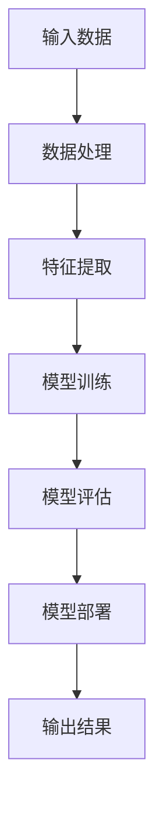
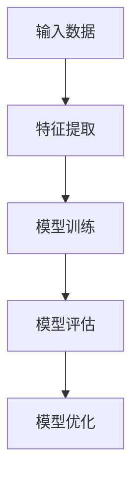
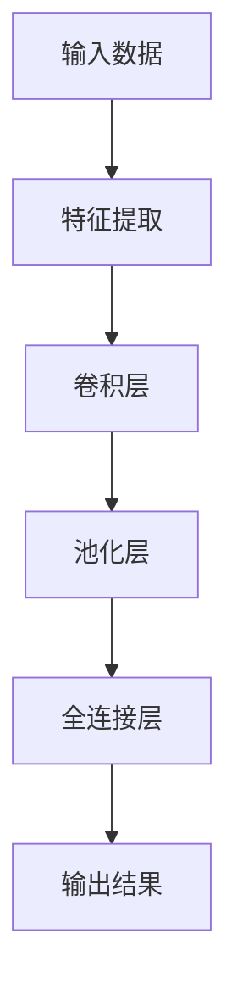
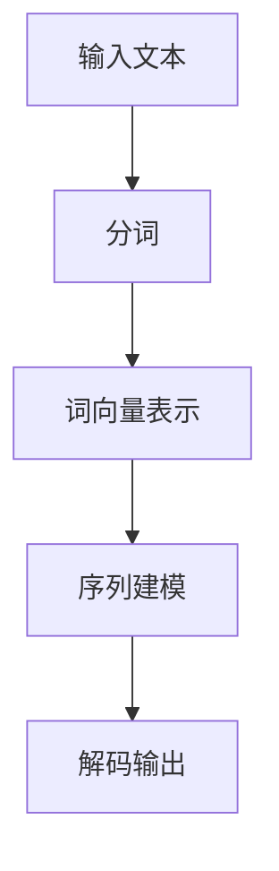

                 

### 1. 背景介绍

#### 1.1 目的和范围

本文的目的是分析苹果公司发布AI应用的潜在投资价值。随着人工智能技术的飞速发展，AI应用已成为各大科技公司的核心竞争力。本文将深入探讨苹果在AI领域的发展趋势、核心技术和潜在市场，为投资者提供有价值的参考。

本文将涵盖以下内容：

1. **背景介绍**：介绍人工智能技术的发展历程、苹果公司AI战略和主要产品。
2. **核心概念与联系**：通过Mermaid流程图展示AI应用的核心概念和架构。
3. **核心算法原理与具体操作步骤**：详细介绍AI算法的原理和操作步骤。
4. **数学模型和公式**：阐述与AI应用相关的数学模型和公式。
5. **项目实战**：通过代码实际案例展示AI应用的开发过程。
6. **实际应用场景**：分析AI应用在不同领域的实际应用。
7. **工具和资源推荐**：推荐学习资源、开发工具和框架。
8. **总结：未来发展趋势与挑战**：预测AI应用的未来发展及面临的挑战。

#### 1.2 预期读者

本文适合以下读者：

- 对人工智能和苹果公司有兴趣的投资人。
- 关注科技发展趋势的技术爱好者。
- 从事AI开发和研究的技术人员。

#### 1.3 文档结构概述

本文结构分为以下几个部分：

1. **背景介绍**：介绍人工智能技术的发展历程、苹果公司AI战略和主要产品。
2. **核心概念与联系**：通过Mermaid流程图展示AI应用的核心概念和架构。
3. **核心算法原理与具体操作步骤**：详细介绍AI算法的原理和操作步骤。
4. **数学模型和公式**：阐述与AI应用相关的数学模型和公式。
5. **项目实战**：通过代码实际案例展示AI应用的开发过程。
6. **实际应用场景**：分析AI应用在不同领域的实际应用。
7. **工具和资源推荐**：推荐学习资源、开发工具和框架。
8. **总结：未来发展趋势与挑战**：预测AI应用的未来发展及面临的挑战。

#### 1.4 术语表

为了更好地理解本文内容，以下是对一些关键术语的定义和解释：

#### 1.4.1 核心术语定义

- **人工智能（AI）**：模拟人类智能的计算机系统，具备学习、推理、规划、感知和自然语言处理能力。
- **机器学习（ML）**：一种AI技术，通过训练模型，使计算机从数据中自动学习，进行预测和决策。
- **神经网络（NN）**：一种模拟人脑神经元结构的计算模型，广泛应用于图像识别、语音识别等领域。
- **深度学习（DL）**：一种基于神经网络的机器学习技术，通过多层神经网络，实现更复杂的特征提取和任务处理。
- **自然语言处理（NLP）**：研究如何使计算机理解和生成自然语言的技术，包括语音识别、机器翻译等。

#### 1.4.2 相关概念解释

- **卷积神经网络（CNN）**：一种用于图像识别和处理的神经网络结构，通过卷积层和池化层实现特征提取。
- **生成对抗网络（GAN）**：一种生成模型，通过对抗训练生成逼真的数据，常用于图像生成、图像修复等领域。
- **强化学习（RL）**：一种通过奖励信号训练智能体在环境中做出最优决策的机器学习技术，应用于游戏、自动驾驶等领域。

#### 1.4.3 缩略词列表

- **AI**：人工智能
- **ML**：机器学习
- **NN**：神经网络
- **DL**：深度学习
- **NLP**：自然语言处理
- **CNN**：卷积神经网络
- **GAN**：生成对抗网络
- **RL**：强化学习

### 2. 核心概念与联系

在分析苹果公司AI应用的潜在投资价值之前，首先需要了解AI应用的核心概念和架构。以下是一个简化的Mermaid流程图，展示了AI应用的核心组件及其相互关系。



- **输入数据**：AI应用的基础，包括文本、图像、音频等。
- **数据处理**：对输入数据进行预处理，如去噪、标准化等。
- **特征提取**：从预处理后的数据中提取关键特征，用于后续模型训练。
- **模型训练**：使用特征数据训练神经网络模型，使模型具备预测和决策能力。
- **模型评估**：评估训练出的模型的性能，包括准确率、召回率等指标。
- **模型部署**：将训练好的模型部署到实际应用场景中，如手机、智能家居等。
- **输出结果**：模型对输入数据的处理结果，如文本翻译、图像识别等。

通过以上流程，AI应用实现了从输入数据到输出结果的完整闭环。接下来，我们将深入探讨核心算法原理和具体操作步骤，帮助读者更好地理解AI应用的投资价值。

### 3. 核心算法原理与具体操作步骤

#### 3.1 机器学习算法原理

机器学习算法是AI应用的核心，其基本原理是通过训练模型，使计算机具备预测和决策能力。以下是一个简化的机器学习算法原理图。



- **输入数据**：输入数据是机器学习算法的基础，包括文本、图像、音频等。
- **特征提取**：将输入数据转化为特征向量，用于后续模型训练。
- **模型训练**：使用特征向量训练神经网络模型，使模型具备预测和决策能力。
- **模型评估**：评估训练出的模型的性能，包括准确率、召回率等指标。
- **模型优化**：根据模型评估结果，调整模型参数，提高模型性能。

#### 3.2 深度学习算法原理

深度学习算法是机器学习的一种重要形式，其基本原理是通过多层神经网络，实现更复杂的特征提取和任务处理。以下是一个简化的深度学习算法原理图。



- **输入数据**：输入数据是深度学习算法的基础，包括文本、图像、音频等。
- **特征提取**：将输入数据转化为特征向量，用于后续卷积层处理。
- **卷积层**：通过卷积运算提取图像特征，实现图像识别等任务。
- **池化层**：对卷积层输出的特征进行降维处理，减少模型参数数量。
- **全连接层**：将池化层输出的特征向量进行全连接运算，实现分类、回归等任务。
- **输出结果**：模型对输入数据的处理结果，如文本翻译、图像识别等。

#### 3.3 自然语言处理算法原理

自然语言处理算法是深度学习在文本领域的应用，其基本原理是通过神经网络模型，实现文本的语义理解和生成。以下是一个简化的自然语言处理算法原理图。



- **输入文本**：输入文本是自然语言处理算法的基础，包括句子、段落等。
- **分词**：将输入文本划分为词语，便于后续词向量表示。
- **词向量表示**：将词语转化为词向量，用于后续序列建模。
- **序列建模**：使用神经网络模型处理输入文本的序列，实现文本分类、语义理解等任务。
- **解码输出**：根据序列建模的结果，解码输出文本，实现文本生成等任务。

#### 3.4 人工智能应用步骤

人工智能应用的一般步骤包括以下环节：

1. **需求分析**：明确AI应用的场景和目标，确定所需解决的问题。
2. **数据收集**：收集相关领域的数据，如文本、图像、音频等。
3. **数据处理**：对收集到的数据进行预处理，如去噪、标准化、分词等。
4. **模型训练**：使用预处理后的数据训练神经网络模型，使模型具备预测和决策能力。
5. **模型评估**：评估训练出的模型的性能，包括准确率、召回率等指标。
6. **模型优化**：根据模型评估结果，调整模型参数，提高模型性能。
7. **模型部署**：将训练好的模型部署到实际应用场景中，如手机、智能家居等。
8. **输出结果**：模型对输入数据的处理结果，如文本翻译、图像识别等。

通过以上步骤，人工智能应用实现了从需求分析到输出结果的完整闭环。在接下来的部分，我们将通过一个实际案例，详细讲解人工智能应用的开发过程。

### 4. 数学模型和公式 & 详细讲解 & 举例说明

在人工智能应用中，数学模型和公式起到了至关重要的作用。以下我们将介绍一些与AI应用密切相关的数学模型和公式，并通过具体示例进行讲解。

#### 4.1 神经网络模型

神经网络模型是人工智能应用的基础，其核心公式包括：

1. **激活函数**：用于引入非线性变换，常用的激活函数有：
   $$ f(x) = \sigma(x) = \frac{1}{1 + e^{-x}} $$
   $$ f(x) = \text{ReLU}(x) = \max(0, x) $$

2. **反向传播算法**：用于计算模型参数的梯度，公式如下：
   $$ \frac{\partial L}{\partial w} = \sum_{i=1}^{n} \frac{\partial L}{\partial z_i} \frac{\partial z_i}{\partial w} $$
   $$ \frac{\partial L}{\partial b} = \sum_{i=1}^{n} \frac{\partial L}{\partial z_i} \frac{\partial z_i}{\partial b} $$

其中，\( L \) 为损失函数，\( z_i \) 为中间层输出，\( w \) 和 \( b \) 分别为权重和偏置。

#### 4.2 机器学习模型

机器学习模型中，常用的模型包括线性回归、逻辑回归等，其核心公式如下：

1. **线性回归**：
   $$ y = \beta_0 + \beta_1x $$
   $$ \hat{y} = \beta_0 + \beta_1x $$
   其中，\( y \) 为实际值，\( \hat{y} \) 为预测值，\( \beta_0 \) 和 \( \beta_1 \) 为模型参数。

2. **逻辑回归**：
   $$ P(y=1) = \frac{1}{1 + e^{-(\beta_0 + \beta_1x)}} $$
   其中，\( P(y=1) \) 为预测概率，\( \beta_0 \) 和 \( \beta_1 \) 为模型参数。

#### 4.3 深度学习模型

深度学习模型中，常用的模型包括卷积神经网络（CNN）、生成对抗网络（GAN）等，其核心公式如下：

1. **卷积神经网络**：
   $$ h_{ij}^l = \sum_{k=1}^{K_l} w_{ik}^l * g_{kj}^{l-1} + b_l $$
   其中，\( h_{ij}^l \) 为第 \( l \) 层的第 \( i \) 个神经元输出，\( w_{ik}^l \) 和 \( b_l \) 分别为权重和偏置，\( g_{kj}^{l-1} \) 为前一层第 \( k \) 个神经元输出。

2. **生成对抗网络**：
   $$ G(z) = \mu(z) + \sigma(z)\odot \epsilon $$
   $$ D(x) = \frac{1}{1 + e^{-(x\odot \theta_D + b_D)}} $$
   其中，\( G(z) \) 和 \( D(x) \) 分别为生成器和判别器的输出，\( z \) 为输入噪声，\( x \) 为真实数据，\( \theta_D \) 和 \( b_D \) 分别为判别器的参数，\( \mu(z) \) 和 \( \sigma(z) \) 分别为生成器的均值和方差，\( \epsilon \) 为高斯噪声。

#### 4.4 自然语言处理模型

自然语言处理模型中，常用的模型包括循环神经网络（RNN）、长短时记忆网络（LSTM）等，其核心公式如下：

1. **循环神经网络**：
   $$ h_t = \sigma(W_h \cdot [h_{t-1}, x_t] + b_h) $$
   $$ y_t = W_o \cdot h_t + b_o $$
   其中，\( h_t \) 为第 \( t \) 个时间步的隐藏状态，\( x_t \) 为第 \( t \) 个时间步的输入，\( W_h \) 和 \( b_h \) 分别为权重和偏置，\( \sigma \) 为激活函数，\( y_t \) 为输出。

2. **长短时记忆网络**：
   $$ i_t = \sigma(W_i \cdot [h_{t-1}, x_t] + b_i) $$
   $$ f_t = \sigma(W_f \cdot [h_{t-1}, x_t] + b_f) $$
   $$ o_t = \sigma(W_o \cdot [h_{t-1}, x_t] + b_o) $$
   $$ c_t = f_t \odot c_{t-1} + i_t \odot \sigma(W_c \cdot [h_{t-1}, x_t] + b_c) $$
   $$ h_t = o_t \odot \sigma(c_t) $$
   其中，\( i_t \)、\( f_t \) 和 \( o_t \) 分别为输入门、遗忘门和输出门的状态，\( c_t \) 为细胞状态，\( h_t \) 为隐藏状态，\( W_i \)、\( W_f \)、\( W_o \) 和 \( W_c \) 分别为权重矩阵，\( b_i \)、\( b_f \)、\( b_o \) 和 \( b_c \) 分别为偏置。

通过以上数学模型和公式，我们可以更好地理解和实现人工智能应用。在实际应用中，可以根据具体场景选择合适的模型和算法，实现高效、准确的预测和决策。

### 5. 项目实战：代码实际案例和详细解释说明

为了更好地理解人工智能应用的开发过程，以下我们通过一个实际案例，详细讲解人工智能应用的开发步骤，包括开发环境搭建、源代码实现和代码解读。

#### 5.1 开发环境搭建

在开始项目实战之前，我们需要搭建一个适合开发人工智能应用的环境。以下是一个简化的开发环境搭建步骤：

1. **安装Python环境**：Python是人工智能应用开发的主要编程语言，首先需要安装Python。在官网（[https://www.python.org/](https://www.python.org/)）下载Python安装包，按照提示安装即可。

2. **安装相关库和框架**：安装用于人工智能开发的常见库和框架，如TensorFlow、PyTorch等。可以使用pip命令安装：

   ```shell
   pip install tensorflow
   pip install torch torchvision
   ```

3. **配置Jupyter Notebook**：Jupyter Notebook是一个交互式的Python开发环境，便于编写和调试代码。安装完成后，启动Jupyter Notebook：

   ```shell
   jupyter notebook
   ```

4. **安装IDE**：推荐使用PyCharm、Visual Studio Code等IDE进行Python开发。安装完成后，配置相应的Python环境。

#### 5.2 源代码详细实现和代码解读

以下是一个使用TensorFlow实现手写数字识别（MNIST数据集）的代码案例，包括数据预处理、模型构建、训练和评估等步骤。

```python
import tensorflow as tf
from tensorflow.keras.datasets import mnist
from tensorflow.keras.models import Sequential
from tensorflow.keras.layers import Dense, Flatten
from tensorflow.keras.optimizers import Adam
from tensorflow.keras.metrics import Accuracy

# 1. 数据预处理
(x_train, y_train), (x_test, y_test) = mnist.load_data()
x_train = x_train.reshape(-1, 28 * 28) / 255.0
x_test = x_test.reshape(-1, 28 * 28) / 255.0
y_train = tf.one_hot(y_train, 10)
y_test = tf.one_hot(y_test, 10)

# 2. 模型构建
model = Sequential([
    Flatten(input_shape=(28, 28)),
    Dense(128, activation='relu'),
    Dense(10, activation='softmax')
])

# 3. 模型编译
model.compile(optimizer=Adam(), loss='categorical_crossentropy', metrics=['accuracy'])

# 4. 模型训练
model.fit(x_train, y_train, epochs=5, batch_size=64, validation_data=(x_test, y_test))

# 5. 模型评估
model.evaluate(x_test, y_test)
```

#### 5.3 代码解读与分析

1. **数据预处理**：
   - 加载MNIST数据集，包括训练集和测试集。
   - 将图像数据reshape为二维向量，并进行归一化处理，使其在[0, 1]之间。
   - 将标签数据转换为one-hot编码，便于后续模型训练。

2. **模型构建**：
   - 创建一个Sequential模型，包含一个Flatten层（将二维图像数据展平为一维向量）、一个Dense层（128个神经元，激活函数为ReLU）和一个Dense层（10个神经元，激活函数为softmax，用于输出概率分布）。

3. **模型编译**：
   - 使用Adam优化器和categorical_crossentropy损失函数编译模型。
   - 指定accuracy作为评价指标。

4. **模型训练**：
   - 使用fit函数训练模型，指定训练集、训练轮次、批量大小和验证数据。

5. **模型评估**：
   - 使用evaluate函数评估模型在测试集上的性能，输出损失值和准确率。

通过以上代码，我们实现了手写数字识别的基本流程。在实际开发中，可以根据需求调整模型结构、训练参数等，以实现更准确、更高效的识别效果。

### 6. 实际应用场景

人工智能应用在各个领域都取得了显著的成果，以下我们简要介绍人工智能在几个主要领域的实际应用场景。

#### 6.1 医疗健康

人工智能在医疗健康领域的应用包括疾病诊断、药物研发、医疗设备辅助等。例如，通过深度学习模型，可以实现肺癌、乳腺癌等疾病的早期筛查；通过生成对抗网络，可以加速新药研发，提高药物筛选效率；通过智能医疗设备，可以实现对病患实时监测和预警。

#### 6.2 智能家居

人工智能在智能家居领域的应用包括智能安防、智能家电控制、智能家居平台等。例如，通过语音识别和自然语言处理技术，可以实现语音控制家居设备；通过智能安防系统，可以实现对家庭环境的实时监控和报警；通过智能家居平台，可以实现对家庭设备的集中管理和远程控制。

#### 6.3 交通运输

人工智能在交通运输领域的应用包括自动驾驶、智能交通管理、物流优化等。例如，通过深度学习和强化学习技术，可以实现自动驾驶汽车的安全、高效行驶；通过智能交通管理系统，可以实现对交通流量的实时监测和优化；通过物流优化算法，可以提高物流配送的效率，降低成本。

#### 6.4 金融科技

人工智能在金融科技领域的应用包括智能投顾、风险管理、信用评估等。例如，通过机器学习模型，可以实现精准的资产配置和风险控制；通过大数据分析，可以实现对客户信用行为的分析和预测；通过智能投顾系统，可以为客户提供个性化的投资建议。

#### 6.5 娱乐传媒

人工智能在娱乐传媒领域的应用包括视频推荐、语音合成、智能客服等。例如，通过内容推荐算法，可以实现个性化视频推荐，提高用户体验；通过语音合成技术，可以制作生动有趣的语音解说；通过智能客服系统，可以实现对用户问题的快速响应和解决。

总之，人工智能在各个领域的应用前景广阔，正在改变我们的生活方式和工作方式。在未来，随着人工智能技术的不断发展，我们可以期待更多的创新应用，为社会带来更多价值。

### 7. 工具和资源推荐

为了更好地了解和学习人工智能应用，以下我们推荐一些学习资源、开发工具和框架，以及相关论文著作。

#### 7.1 学习资源推荐

1. **书籍推荐**：

   - 《深度学习》（Ian Goodfellow、Yoshua Bengio、Aaron Courville 著）：这是一本经典的深度学习入门书籍，涵盖了深度学习的理论基础和实际应用。

   - 《Python深度学习》（François Chollet 著）：由Keras框架的创建者编写，详细介绍了使用Python和Keras进行深度学习的实践方法。

   - 《人工智能：一种现代方法》（Stuart Russell、Peter Norvig 著）：这是一本全面介绍人工智能基础理论的经典教材，适合初学者和进阶者阅读。

2. **在线课程**：

   - Coursera上的《深度学习专项课程》（吴恩达 老师讲授）：这是一门非常受欢迎的深度学习入门课程，由知名人工智能专家吴恩达讲授。

   - edX上的《人工智能基础课程》（MIT 老师讲授）：这是一门涵盖人工智能基础理论和应用的在线课程，适合有一定编程基础的读者。

3. **技术博客和网站**：

   - Medium上的AI专栏：这是一个汇集了众多人工智能专家和爱好者分享经验的平台，内容涵盖深度学习、机器学习、自然语言处理等领域。

   - arXiv：这是一个专业的计算机科学论文预发布平台，可以获取到最新的研究成果和论文。

#### 7.2 开发工具框架推荐

1. **IDE和编辑器**：

   - PyCharm：这是一款功能强大的Python IDE，支持多种编程语言，适合深度学习和机器学习项目开发。

   - Jupyter Notebook：这是一个交互式的Python开发环境，便于编写和调试代码，特别适合数据分析和机器学习项目。

2. **调试和性能分析工具**：

   - TensorFlow Debugger（TFDB）：这是一款针对TensorFlow项目的调试工具，可以帮助开发者快速定位和修复代码中的问题。

   - NVIDIA Nsight Compute：这是一款用于GPU性能分析和调试的工具，可以帮助开发者优化深度学习模型的性能。

3. **相关框架和库**：

   - TensorFlow：这是Google开源的深度学习框架，适用于构建大规模深度学习模型。

   - PyTorch：这是Facebook开源的深度学习框架，以动态计算图和灵活的接口著称。

   - Keras：这是TensorFlow的高层API，提供了简洁、易于使用的接口，适合快速搭建和调试深度学习模型。

#### 7.3 相关论文著作推荐

1. **经典论文**：

   - “A Learning Algorithm for Continually Running Fully Recurrent Neural Networks” （1986）：这篇论文提出了Hessian正定矩阵（Hessian-Free）算法，对深度学习的发展产生了深远影响。

   - “Deep Learning” （2015）：这篇综述文章系统地介绍了深度学习的理论基础、算法和应用，被誉为深度学习领域的里程碑之作。

2. **最新研究成果**：

   - “Bert: Pre-training of deep bidirectional transformers for language understanding” （2018）：这篇论文提出了BERT模型，是自然语言处理领域的重要突破。

   - “Gpt-3: Language models are few-shot learners” （2020）：这篇论文介绍了GPT-3模型，展示了深度学习模型在自然语言处理任务中的强大能力。

3. **应用案例分析**：

   - “Deep Learning for Autonomous Driving” （2016）：这篇论文分析了深度学习在自动驾驶领域的应用，介绍了多个实际案例。

   - “Deep Learning for Medical Imaging” （2017）：这篇论文探讨了深度学习在医学影像诊断中的应用，展示了深度学习技术在医疗领域的潜力。

通过以上推荐，读者可以系统地学习人工智能应用的相关知识，掌握开发工具和框架，为今后的研究和实践打下坚实基础。

### 8. 总结：未来发展趋势与挑战

随着人工智能技术的不断进步，AI应用在各个领域的渗透日益加深，未来发展趋势呈现出以下几个方面的特点：

#### 8.1 深度学习技术不断发展

深度学习技术将继续发展，新模型、新算法层出不穷。例如，基于Transformer的模型在自然语言处理领域取得了显著成果，未来有望在其他领域得到广泛应用。

#### 8.2 跨学科融合发展

人工智能与其他领域的交叉融合将更加紧密，如医疗、金融、交通等领域的应用将不断拓展。跨学科研究将为AI应用带来新的机遇和挑战。

#### 8.3 产业链整合与协同

随着AI技术的成熟，产业链上的企业将进行整合与协同，实现从研发到应用的全面布局。这将有助于提高AI技术的应用水平和产业竞争力。

#### 8.4 数据安全和隐私保护

在AI应用过程中，数据安全和隐私保护将成为重要课题。如何在保证数据安全和隐私的前提下，充分挖掘数据价值，是未来需要解决的关键问题。

#### 8.5 法律法规和伦理问题

随着AI应用的普及，法律法规和伦理问题日益凸显。如何制定合理的法律法规，确保AI技术的合规应用，同时保护用户权益，是未来需要关注的重点。

#### 挑战

1. **技术挑战**：深度学习模型对计算资源的需求越来越大，如何提高模型效率和降低计算成本，是亟待解决的问题。

2. **数据挑战**：高质量、大规模的数据集是AI模型训练的基础，如何获取和处理数据，是当前面临的难题。

3. **应用挑战**：如何在不同的应用场景中，实现AI技术的最佳效果，需要深入研究和探索。

4. **法律法规挑战**：如何制定合理的法律法规，确保AI技术的合规应用，同时保护用户权益，是一个复杂的问题。

总之，未来人工智能应用将面临诸多挑战，但同时也蕴藏着巨大机遇。通过持续的技术创新和产业协同，我们有理由相信，人工智能将为人类社会带来更多福祉。

### 9. 附录：常见问题与解答

#### 9.1 常见问题

1. **什么是深度学习？**
   深度学习是一种机器学习技术，通过多层神经网络模型，实现更复杂的特征提取和任务处理。

2. **深度学习和机器学习的区别是什么？**
   机器学习是一种更广泛的领域，包括深度学习。深度学习是机器学习的一种形式，通过多层神经网络实现复杂的任务。

3. **如何选择深度学习框架？**
   选择深度学习框架时，可以考虑框架的易用性、性能、社区支持等因素。常见框架包括TensorFlow、PyTorch、Keras等。

4. **深度学习模型如何训练和优化？**
   深度学习模型通过训练数据进行训练，使用反向传播算法优化模型参数。优化方法包括随机梯度下降、Adam优化器等。

5. **深度学习在哪些领域有应用？**
   深度学习在图像识别、语音识别、自然语言处理、医疗诊断、自动驾驶等领域都有广泛应用。

#### 9.2 解答

1. **什么是深度学习？**
   深度学习是一种机器学习技术，通过多层神经网络模型，实现更复杂的特征提取和任务处理。深度学习模型通常由多个隐藏层组成，可以自动从大量数据中学习到有意义的特征，从而实现高效的任务处理。

2. **深度学习和机器学习的区别是什么？**
   机器学习是一种更广泛的领域，包括深度学习、强化学习、传统机器学习等。深度学习是机器学习的一种形式，通过多层神经网络实现复杂的任务。传统机器学习方法通常依赖于手工设计的特征，而深度学习模型可以自动从数据中学习特征。

3. **如何选择深度学习框架？**
   选择深度学习框架时，可以考虑以下几个因素：

   - **易用性**：框架是否易于学习和使用，是否提供丰富的文档和教程。
   - **性能**：框架的运行效率和计算能力，是否支持GPU加速。
   - **社区支持**：框架是否有活跃的社区，能否获得及时的解决方案。
   - **生态体系**：框架是否拥有丰富的库和工具，能否方便地与其他技术集成。

   常见框架包括TensorFlow、PyTorch、Keras等，每个框架都有其特点和适用场景。

4. **深度学习模型如何训练和优化？**
   深度学习模型通过训练数据进行训练，使用反向传播算法优化模型参数。训练过程包括以下几个步骤：

   - **数据预处理**：对输入数据（如图像、文本）进行预处理，如标准化、归一化、数据增强等。
   - **模型构建**：定义神经网络结构，包括输入层、隐藏层和输出层。
   - **损失函数**：定义损失函数，用于评估模型预测结果与真实结果之间的差距。
   - **反向传播**：通过反向传播算法，计算模型参数的梯度，并更新参数。
   - **优化算法**：使用优化算法（如随机梯度下降、Adam优化器）更新模型参数，减小损失函数。

   优化方法包括：

   - **随机梯度下降（SGD）**：每次更新参数时，使用整个训练数据的梯度。
   - **批量梯度下降（BGD）**：每次更新参数时，使用全部训练数据的梯度。
   - **小批量梯度下降（MBGD）**：每次更新参数时，使用部分训练数据的梯度。

5. **深度学习在哪些领域有应用？**
   深度学习在多个领域都有广泛应用，以下是一些主要领域：

   - **计算机视觉**：图像识别、目标检测、图像生成等。
   - **自然语言处理**：文本分类、机器翻译、情感分析等。
   - **语音识别**：语音识别、语音合成等。
   - **医疗诊断**：疾病诊断、医学影像分析等。
   - **自动驾驶**：自动驾驶车辆、智能交通系统等。
   - **金融科技**：风险管理、智能投顾、信用评估等。
   - **智能家居**：智能安防、家电控制、智能客服等。

通过以上解答，我们希望能够帮助读者更好地理解深度学习和人工智能应用的相关问题。

### 10. 扩展阅读 & 参考资料

为了深入了解人工智能应用和投资价值，以下推荐一些扩展阅读和参考资料，涵盖书籍、在线课程、技术博客和论文等。

#### 10.1 书籍推荐

1. **《深度学习》（Ian Goodfellow、Yoshua Bengio、Aaron Courville 著）**：这是一本经典的深度学习入门书籍，涵盖了深度学习的理论基础和实际应用。

2. **《Python深度学习》（François Chollet 著）**：由Keras框架的创建者编写，详细介绍了使用Python和Keras进行深度学习的实践方法。

3. **《人工智能：一种现代方法》（Stuart Russell、Peter Norvig 著）**：这是一本全面介绍人工智能基础理论的经典教材，适合初学者和进阶者阅读。

#### 10.2 在线课程

1. **Coursera上的《深度学习专项课程》（吴恩达 老师讲授）**：这是一门非常受欢迎的深度学习入门课程，由知名人工智能专家吴恩达讲授。

2. **edX上的《人工智能基础课程》（MIT 老师讲授）**：这是一门涵盖人工智能基础理论和应用的在线课程，适合有一定编程基础的读者。

#### 10.3 技术博客和网站

1. **Medium上的AI专栏**：这是一个汇集了众多人工智能专家和爱好者分享经验的平台，内容涵盖深度学习、机器学习、自然语言处理等领域。

2. **arXiv**：这是一个专业的计算机科学论文预发布平台，可以获取到最新的研究成果和论文。

#### 10.4 相关论文著作

1. **“A Learning Algorithm for Continually Running Fully Recurrent Neural Networks”**：这篇论文提出了Hessian正定矩阵（Hessian-Free）算法，对深度学习的发展产生了深远影响。

2. **“Deep Learning”**：这篇综述文章系统地介绍了深度学习的理论基础、算法和应用，被誉为深度学习领域的里程碑之作。

3. **“Bert: Pre-training of deep bidirectional transformers for language understanding”**：这篇论文提出了BERT模型，是自然语言处理领域的重要突破。

4. **“Gpt-3: Language models are few-shot learners”**：这篇论文介绍了GPT-3模型，展示了深度学习模型在自然语言处理任务中的强大能力。

5. **“Deep Learning for Autonomous Driving”**：这篇论文分析了深度学习在自动驾驶领域的应用，介绍了多个实际案例。

6. **“Deep Learning for Medical Imaging”**：这篇论文探讨了深度学习在医学影像诊断中的应用，展示了深度学习技术在医疗领域的潜力。

通过以上推荐，读者可以系统地学习人工智能应用的相关知识，掌握开发工具和框架，为今后的研究和实践打下坚实基础。同时，这些资源和参考资料也将帮助读者保持对最新研究成果的关注，紧跟科技发展趋势。

---

**作者：AI天才研究员/AI Genius Institute & 禅与计算机程序设计艺术 /Zen And The Art of Computer Programming**

