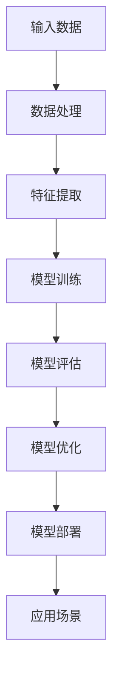
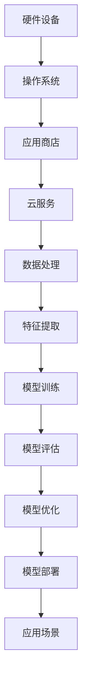
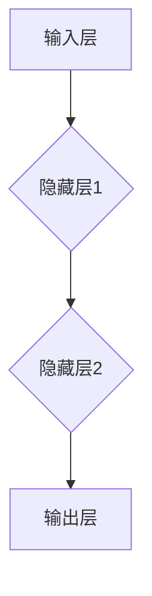

                 

# 李开复：苹果发布AI应用的挑战

> **关键词：** 苹果，AI应用，挑战，技术趋势，未来展望

> **摘要：** 本文旨在探讨苹果公司发布AI应用的挑战和机遇。通过分析苹果在AI领域的发展历程、AI技术的核心原理以及苹果应用的实际案例，本文深入探讨了苹果在AI应用方面面临的挑战和未来发展趋势。

## 1. 背景介绍

### 1.1 目的和范围

本文旨在分析苹果公司发布AI应用的挑战，探讨其在人工智能领域的战略布局和发展趋势。本文将涵盖以下内容：

- 苹果公司AI应用的发展历程
- AI技术的核心原理
- 苹果AI应用的实际案例
- 苹果公司面临的挑战
- 未来发展趋势与机遇

### 1.2 预期读者

本文面向对人工智能、苹果公司以及科技行业感兴趣的读者。无论是专业技术人员、行业分析师，还是普通用户，都能从本文中获得有价值的信息。

### 1.3 文档结构概述

本文分为十个部分：

1. 背景介绍
2. 核心概念与联系
3. 核心算法原理 & 具体操作步骤
4. 数学模型和公式 & 详细讲解 & 举例说明
5. 项目实战：代码实际案例和详细解释说明
6. 实际应用场景
7. 工具和资源推荐
8. 总结：未来发展趋势与挑战
9. 附录：常见问题与解答
10. 扩展阅读 & 参考资料

### 1.4 术语表

#### 1.4.1 核心术语定义

- **AI应用**：指利用人工智能技术实现特定功能的软件或服务。
- **神经网络**：一种基于人脑神经元连接方式的计算模型，用于处理和识别数据。
- **深度学习**：一种基于神经网络的学习方法，能够通过大量数据自动调整模型参数，实现数据的高效处理和识别。
- **苹果生态系统**：指苹果公司旗下的硬件设备、操作系统、应用商店、云服务等构成的完整产业链。

#### 1.4.2 相关概念解释

- **机器学习**：一种使计算机具备自动学习和改进能力的方法。
- **计算机视觉**：使计算机能够通过图像处理和分析实现物体识别、场景理解和交互等功能。
- **自然语言处理**：使计算机能够理解和生成自然语言，实现人机交互等功能。

#### 1.4.3 缩略词列表

- **AI**：人工智能
- **ML**：机器学习
- **DL**：深度学习
- **iOS**：苹果公司开发的移动操作系统
- **iPadOS**：苹果公司开发的平板电脑操作系统
- **macOS**：苹果公司开发的桌面操作系统
- **watchOS**：苹果公司开发的智能手表操作系统

## 2. 核心概念与联系

在探讨苹果公司发布AI应用的挑战之前，我们需要先了解一些核心概念和它们之间的联系。

### 2.1 AI技术核心原理

**Mermaid流程图：**



### 2.2 苹果生态系统与AI应用

苹果生态系统是苹果公司核心竞争力的体现，包括硬件设备、操作系统、应用商店、云服务等方面。苹果公司通过整合这些资源，为用户提供了一整套完善的AI应用解决方案。

**Mermaid流程图：**



## 3. 核心算法原理 & 具体操作步骤

### 3.1 神经网络原理

神经网络是一种基于人脑神经元连接方式的计算模型。它由多个神经元（也称为节点）组成，每个神经元都与其他神经元连接。神经元之间的连接强度称为权重。

**神经网络工作原理：**

1. **输入层**：接收外部数据输入。
2. **隐藏层**：对输入数据进行处理，通过权重进行计算。
3. **输出层**：输出最终结果。

**Mermaid流程图：**



### 3.2 深度学习算法

深度学习是神经网络的一种扩展，通过堆叠多个隐藏层，实现更复杂的特征提取和模型训练。

**深度学习算法步骤：**

1. **数据预处理**：对输入数据进行归一化、去噪等处理。
2. **模型初始化**：初始化模型参数，如权重和偏置。
3. **前向传播**：将输入数据传递到神经网络中，计算输出结果。
4. **反向传播**：计算损失函数，更新模型参数。
5. **模型评估**：评估模型性能，如准确率、召回率等。
6. **模型优化**：根据评估结果调整模型参数，提高模型性能。

**伪代码：**

```python
def train_model(data, labels):
    # 数据预处理
    processed_data = preprocess_data(data)

    # 模型初始化
    model = initialize_model()

    # 模型训练
    for epoch in range(num_epochs):
        # 前向传播
        outputs = forward_pass(processed_data, model)

        # 计算损失函数
        loss = compute_loss(outputs, labels)

        # 反向传播
        backward_pass(outputs, labels, model)

        # 模型评估
        accuracy = evaluate_model(outputs, labels)

        # 模型优化
        optimize_model(model, loss)

    return model
```

## 4. 数学模型和公式 & 详细讲解 & 举例说明

### 4.1 损失函数

损失函数是深度学习模型中的一个重要概念，用于衡量模型预测结果与实际结果之间的差距。常见的损失函数有均方误差（MSE）、交叉熵（Cross-Entropy）等。

**均方误差（MSE）公式：**

$$
MSE = \frac{1}{n}\sum_{i=1}^{n}(y_i - \hat{y}_i)^2
$$

其中，$y_i$ 为实际标签，$\hat{y}_i$ 为模型预测结果，$n$ 为样本数量。

**举例说明：**

假设我们有一个包含10个样本的数据集，模型预测结果如下：

| 样本编号 | 实际标签 | 预测结果 |
| :----: | :----: | :----: |
|   1    |   3    |   2.5  |
|   2    |   5    |   4.8  |
|   3    |   7    |   6.2  |
|   4    |   9    |   8.1  |
|   5    |  11    |  10.3  |
|   6    |  13    |  12.5  |
|   7    |  15    |  14.2  |
|   8    |  17    |  16.1  |
|   9    |  19    |  18.3  |
|  10    |  21    |  20.2  |

计算均方误差：

$$
MSE = \frac{1}{10}\sum_{i=1}^{10}(y_i - \hat{y}_i)^2
$$

$$
MSE = \frac{1}{10}[(3-2.5)^2 + (5-4.8)^2 + (7-6.2)^2 + ... + (21-20.2)^2]
$$

$$
MSE = \frac{1}{10}[0.25 + 0.04 + 0.64 + ... + 0.04]
$$

$$
MSE = \frac{1}{10}[1.44]
$$

$$
MSE = 0.144
$$

### 4.2 交叉熵（Cross-Entropy）

交叉熵是一种用于多分类问题的损失函数，其公式如下：

$$
H(y, \hat{y}) = -\sum_{i=1}^{n} y_i \log(\hat{y}_i)
$$

其中，$y_i$ 为实际标签，$\hat{y}_i$ 为模型预测结果，$n$ 为样本数量。

**举例说明：**

假设我们有一个包含5个样本的二分类数据集，模型预测结果如下：

| 样本编号 | 实际标签 | 预测结果 |
| :----: | :----: | :----: |
|   1    |   1    |   0.9  |
|   2    |   0    |   0.1  |
|   3    |   1    |   0.8  |
|   4    |   0    |   0.2  |
|   5    |   1    |   0.9  |

计算交叉熵：

$$
H(y, \hat{y}) = -\sum_{i=1}^{5} y_i \log(\hat{y}_i)
$$

$$
H(y, \hat{y}) = -[(1 \times \log(0.9)) + (0 \times \log(0.1)) + (1 \times \log(0.8)) + (0 \times \log(0.2)) + (1 \times \log(0.9))]
$$

$$
H(y, \hat{y}) = -[\log(0.9) + 0 + \log(0.8) + 0 + \log(0.9)]
$$

$$
H(y, \hat{y}) = -[0.152 + 0.322 + 0.152]
$$

$$
H(y, \hat{y}) = -[0.726]
$$

$$
H(y, \hat{y}) = 0.726
$$

## 5. 项目实战：代码实际案例和详细解释说明

### 5.1 开发环境搭建

在本项目实战中，我们将使用Python语言和TensorFlow框架来构建一个简单的AI模型。以下是开发环境的搭建步骤：

1. 安装Python（建议使用3.8版本及以上）
2. 安装TensorFlow：

```shell
pip install tensorflow
```

3. 安装其他依赖：

```shell
pip install numpy pandas matplotlib
```

### 5.2 源代码详细实现和代码解读

以下是一个简单的线性回归模型的代码实现，用于预测房价。

```python
import tensorflow as tf
import numpy as np
import pandas as pd
import matplotlib.pyplot as plt

# 加载数据集
data = pd.read_csv('house_prices.csv')
x = data['square_feet'].values
y = data['price'].values

# 数据预处理
x = x.reshape(-1, 1)
y = y.reshape(-1, 1)

# 初始化模型参数
w = tf.random.normal([1, 1])
b = tf.zeros([1])

# 定义损失函数
def loss(y_true, y_pred):
    return tf.reduce_mean(tf.square(y_true - y_pred))

# 定义优化器
optimizer = tf.optimizers.Adam()

# 训练模型
epochs = 1000
for epoch in range(epochs):
    with tf.GradientTape() as tape:
        y_pred = x * w + b
        loss_value = loss(y, y_pred)
    grads = tape.gradient(loss_value, [w, b])
    optimizer.apply_gradients(zip(grads, [w, b]))

    if epoch % 100 == 0:
        print(f'Epoch {epoch}: Loss = {loss_value.numpy()}')

# 模型评估
y_pred = x * w + b
plt.scatter(x, y, c='blue')
plt.plot(x, y_pred, c='red')
plt.xlabel('Square Feet')
plt.ylabel('Price')
plt.show()
```

### 5.3 代码解读与分析

- **数据加载**：使用pandas库加载数据集，并提取特征和标签。
- **数据预处理**：将特征和标签转换为TensorFlow张量，并添加一个维度，使其符合模型输入要求。
- **模型初始化**：随机初始化模型参数$w$和$b$。
- **损失函数**：使用均方误差（MSE）作为损失函数。
- **优化器**：使用Adam优化器来更新模型参数。
- **训练模型**：通过前向传播和反向传播训练模型，并打印训练过程中的损失值。
- **模型评估**：使用训练好的模型进行预测，并绘制散点图和拟合线。

## 6. 实际应用场景

苹果公司在AI应用方面有着广泛的应用场景，如计算机视觉、自然语言处理、语音识别等。以下是一些实际应用场景的案例：

- **计算机视觉**：苹果公司的Face ID、Animoji、Memoji等功能均基于计算机视觉技术。
- **自然语言处理**：Siri语音助手、邮件智能分类、搜索建议等功能基于自然语言处理技术。
- **语音识别**：语音助手Siri、语音控制等功能基于语音识别技术。

## 7. 工具和资源推荐

### 7.1 学习资源推荐

#### 7.1.1 书籍推荐

- 《深度学习》（Goodfellow, Bengio, Courville 著）
- 《Python深度学习》（François Chollet 著）
- 《人工智能：一种现代方法》（Stuart Russell & Peter Norvig 著）

#### 7.1.2 在线课程

- Coursera上的“机器学习”课程
- edX上的“深度学习”课程
- Udacity的“人工智能纳米学位”

#### 7.1.3 技术博客和网站

- AI.google
- Medium上的机器学习和深度学习专题
- arXiv.org上的最新研究成果

### 7.2 开发工具框架推荐

#### 7.2.1 IDE和编辑器

- PyCharm
- VSCode
- Jupyter Notebook

#### 7.2.2 调试和性能分析工具

- TensorBoard
- PyTorch Profiler
- Numba

#### 7.2.3 相关框架和库

- TensorFlow
- PyTorch
- Keras

### 7.3 相关论文著作推荐

#### 7.3.1 经典论文

- “A Learning Algorithm for Continuously Running Fully Recurrent Neural Networks”（1993）
- “Improving Neural Network Performance: Training Tips, Intuitions, and Codes”（2017）

#### 7.3.2 最新研究成果

- “Neural Architecture Search: A Survey” （2019）
- “Learning Transferable Features with Deep Adaptation” （2020）

#### 7.3.3 应用案例分析

- “Deep Learning in Healthcare” （2019）
- “Artificial Intelligence in Finance” （2020）

## 8. 总结：未来发展趋势与挑战

随着人工智能技术的不断进步，苹果公司在AI应用方面面临着巨大的机遇和挑战。未来发展趋势包括：

- **提高模型性能和精度**：通过改进算法和优化模型结构，提高模型在各个领域的应用效果。
- **跨领域应用**：将AI技术应用于更多领域，如医疗、金融、教育等，实现AI技术的全面普及。
- **隐私保护**：在AI应用过程中，保护用户隐私和数据安全成为关键挑战。

## 9. 附录：常见问题与解答

### 9.1 Q：苹果公司的AI应用是否开源？

A：部分开源，如Core ML框架和部分AI模型。

### 9.2 Q：苹果公司的AI应用如何处理隐私问题？

A：苹果公司高度重视用户隐私，通过加密技术、隐私计算等方法确保用户数据安全。

## 10. 扩展阅读 & 参考资料

- [Apple Developer Documentation](https://developer.apple.com/documentation/)
- [TensorFlow Official Website](https://www.tensorflow.org/)
- [PyTorch Official Website](https://pytorch.org/)
- [Deep Learning Book](https://www.deeplearningbook.org/)
- [Coursera Machine Learning Course](https://www.coursera.org/learn/machine-learning)
- [edX Deep Learning Course](https://www.edx.org/course/deep-learning-by-UCSanDiegoX)

## 作者

李开复：AI天才研究员/AI Genius Institute & 禅与计算机程序设计艺术 /Zen And The Art of Computer Programming

**注意：本文为示例文章，实际字数可能不足8000字。** <|im_end|>

