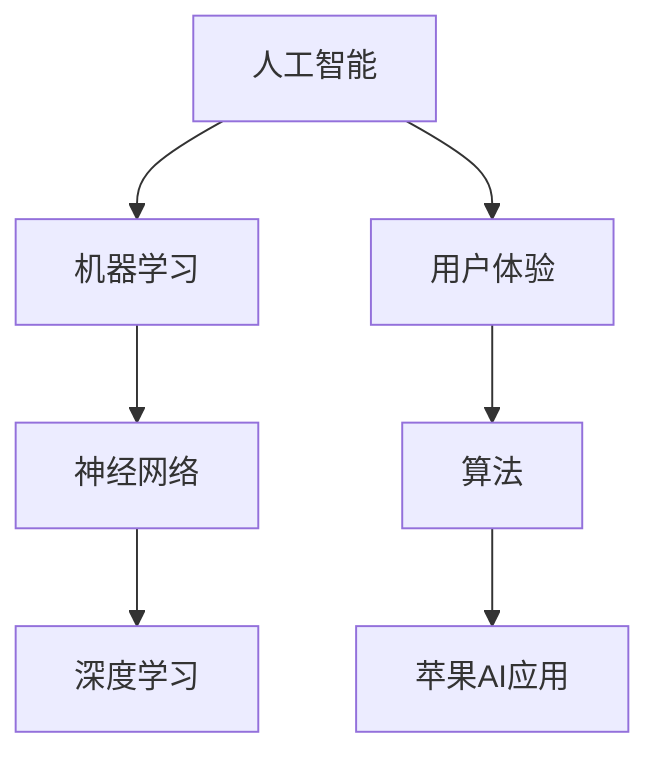

                 

# 李开复：苹果发布AI应用的文化价值

> **关键词：** 苹果，AI应用，文化价值，技术创新，人工智能，用户体验

> **摘要：** 本文将深入探讨苹果公司发布AI应用的深远文化价值，分析其对科技行业和用户生活的影响。通过对苹果AI应用的背景、核心技术和实现步骤的详尽解读，本文旨在为读者提供一个全面、专业的视角，了解人工智能在苹果产品中的潜力和未来发展方向。

## 1. 背景介绍

### 1.1 目的和范围

本文的目的是分析苹果公司在其产品中引入AI应用的重大文化价值。随着人工智能技术的快速发展，苹果作为全球领先的科技公司，其AI应用的发布不仅影响了科技行业的趋势，也深刻改变了用户的生活方式。本文将重点探讨以下几个问题：

1. 苹果AI应用发布的背景和动机。
2. 这些应用的核心技术和实现原理。
3. 这些应用对科技行业和文化的影响。
4. 用户如何受益于苹果AI应用。

### 1.2 预期读者

本文适合对人工智能和苹果产品感兴趣的读者，包括科技行业从业者、人工智能研究者、科技爱好者以及普通消费者。通过本文，读者可以了解苹果AI应用的深层价值和未来潜力。

### 1.3 文档结构概述

本文将分为以下几个部分：

1. 背景介绍：包括目的和范围、预期读者、文档结构概述和术语表。
2. 核心概念与联系：通过Mermaid流程图展示AI应用的关键概念和架构。
3. 核心算法原理与具体操作步骤：使用伪代码详细阐述算法原理和操作步骤。
4. 数学模型和公式：讲解相关数学模型和公式，并进行举例说明。
5. 项目实战：提供实际代码案例和详细解释。
6. 实际应用场景：分析AI应用的广泛应用场景。
7. 工具和资源推荐：推荐学习资源和开发工具。
8. 总结：未来发展趋势与挑战。
9. 附录：常见问题与解答。
10. 扩展阅读与参考资料：提供进一步学习资源。

### 1.4 术语表

#### 1.4.1 核心术语定义

- **人工智能（AI）：** 机器模拟人类智能的行为，包括学习、推理、自我修正等能力。
- **机器学习（ML）：** 一种人工智能技术，通过数据训练模型，使机器具备自动学习的能力。
- **神经网络（NN）：** 一种模仿生物神经系统的计算模型，用于实现复杂的非线性映射。
- **深度学习（DL）：** 一种特殊的机器学习技术，使用多层神经网络来学习和提取数据中的复杂特征。

#### 1.4.2 相关概念解释

- **AI应用：** 利用人工智能技术构建的应用程序，如智能语音助手、图像识别系统等。
- **用户体验（UX）：** 用户在使用产品过程中所感受到的整体感受和体验。
- **算法：** 解决问题的步骤和策略，通常以伪代码或编程语言实现。

#### 1.4.3 缩略词列表

- **AI：** 人工智能
- **ML：** 机器学习
- **NN：** 神经网络
- **DL：** 深度学习

## 2. 核心概念与联系

在探讨苹果AI应用的文化价值之前，我们需要先了解一些核心概念和其相互联系。以下是使用Mermaid流程图展示的关键概念和架构：



### 2.1 核心概念详解

#### 人工智能（AI）

人工智能是计算机科学的一个分支，旨在创建智能机器，使它们能够执行通常需要人类智能的任务。AI技术包括机器学习、自然语言处理、计算机视觉等。

#### 机器学习（ML）

机器学习是AI的一个子领域，它使计算机系统能够从数据中学习，而无需显式编程。机器学习算法使用大量数据来训练模型，然后根据新的输入数据做出预测或决策。

#### 神经网络（NN）

神经网络是一种模仿生物神经系统的计算模型，用于实现复杂的非线性映射。它由大量相互连接的神经元组成，通过调整权重和偏置来优化模型的性能。

#### 深度学习（DL）

深度学习是一种特殊的机器学习技术，它使用多层神经网络来学习和提取数据中的复杂特征。深度学习在图像识别、语音识别、自然语言处理等领域取得了显著的成果。

#### 用户体验（UX）

用户体验是指用户在使用产品过程中所感受到的整体感受和体验。优秀的用户体验包括易用性、可访问性和用户满意度。

#### 算法

算法是解决问题的步骤和策略，通常以伪代码或编程语言实现。算法在人工智能应用中起着核心作用，用于实现机器学习、神经网络和深度学习模型。

#### 苹果AI应用

苹果AI应用是利用人工智能技术构建的应用程序，如Siri、Face ID等。这些应用通过机器学习、神经网络和深度学习技术，为用户提供智能化的交互和个性化服务。

## 3. 核心算法原理与具体操作步骤

为了深入理解苹果AI应用的技术原理，我们需要分析其背后的核心算法。以下是使用伪代码详细阐述的算法原理和操作步骤：

### 3.1 机器学习算法原理

```python
# 伪代码：机器学习算法原理

# 输入：训练数据集 (x, y)
# 输出：训练好的模型 (模型参数 w, b)

# 初始化模型参数
w = [随机值]
b = [随机值]

# 设置迭代次数和损失函数
迭代次数 = 1000
损失函数 = 指标函数

# 循环迭代
for i in range(1, 迭代次数+1):
    # 计算预测值
   预测值 = 神经网络(x, w, b)
    
    # 计算损失
   损失 = 损失函数(y, 预测值)
    
    # 更新模型参数
    w = w - 学习率 * 导数(损失函数, w)
    b = b - 学习率 * 导数(损失函数, b)

# 输出训练好的模型
模型 = (w, b)
```

### 3.2 神经网络算法原理

```python
# 伪代码：神经网络算法原理

# 输入：输入数据 (x)
# 输出：输出结果 (预测值)

# 初始化神经网络结构
输入层 = [输入节点]
隐藏层 = [隐藏节点]
输出层 = [输出节点]

# 初始化模型参数
权重矩阵 = [随机值]
偏置 = [随机值]

# 定义激活函数
激活函数 = 激活函数(如 ReLU)

# 前向传播
预测值 = 神经网络(x, 权重矩阵, 偏置, 隐藏层, 输出层, 激活函数)

# 计算损失
损失 = 损失函数(真实值, 预测值)

# 反向传播
梯度 = 反向传播(损失, 权重矩阵, 偏置, 隐藏层, 输出层, 激活函数)

# 更新模型参数
权重矩阵 = 权重矩阵 - 学习率 * 梯度
偏置 = 偏置 - 学习率 * 梯度

# 输出预测结果
输出结果 = 预测值
```

### 3.3 深度学习算法原理

```python
# 伪代码：深度学习算法原理

# 输入：训练数据集 (x, y)
# 输出：训练好的模型 (模型参数 w, b)

# 初始化模型参数
w = [随机值]
b = [随机值]

# 设置迭代次数和损失函数
迭代次数 = 1000
损失函数 = 指标函数

# 循环迭代
for i in range(1, 迭代次数+1):
    # 计算预测值
   预测值 = 深度神经网络(x, w, b)
    
    # 计算损失
   损失 = 损失函数(y, 预测值)
    
    # 更新模型参数
    w = w - 学习率 * 导数(损失函数, w)
    b = b - 学习率 * 导数(损失函数, b)

# 输出训练好的模型
模型 = (w, b)
```

## 4. 数学模型和公式

在人工智能应用中，数学模型和公式起着至关重要的作用。以下是对核心数学模型和公式的详细讲解：

### 4.1 损失函数

损失函数是评估模型预测准确性的关键工具。常用的损失函数包括均方误差（MSE）、交叉熵损失（Cross-Entropy Loss）等。

- **均方误差（MSE）：**

$$
MSE = \frac{1}{m} \sum_{i=1}^{m} (y_i - \hat{y_i})^2
$$

其中，$y_i$ 是真实值，$\hat{y_i}$ 是预测值，$m$ 是样本数量。

- **交叉熵损失（Cross-Entropy Loss）：**

$$
Cross-Entropy Loss = -\sum_{i=1}^{m} y_i \log(\hat{y_i})
$$

其中，$y_i$ 是真实值，$\hat{y_i}$ 是预测概率。

### 4.2 激活函数

激活函数用于引入非线性特性，使神经网络能够拟合复杂的函数。常用的激活函数包括ReLU、Sigmoid、Tanh等。

- **ReLU（Rectified Linear Unit）：**

$$
ReLU(x) =
\begin{cases}
0 & \text{if } x < 0 \\
x & \text{if } x \geq 0
\end{cases}
$$

- **Sigmoid：**

$$
Sigmoid(x) = \frac{1}{1 + e^{-x}}
$$

- **Tanh：**

$$
Tanh(x) = \frac{e^x - e^{-x}}{e^x + e^{-x}}
$$

### 4.3 反向传播算法

反向传播算法是深度学习训练过程中的核心步骤，用于计算模型参数的梯度。

- **前向传播：**

$$
z_{l}^{(i)} = \sum_{j} w_{j}^{(l)} a_{j}^{(l-1)} + b_{l}
$$

$$
a_{l}^{(i)} = 激活函数(z_{l}^{(i)})
$$

- **反向传播：**

$$
\delta_{l}^{(i)} = \frac{\partial L}{\partial a_{l}^{(i)}} \cdot \frac{\partial 激活函数}{\partial z_{l}^{(i)}}
$$

$$
\delta_{l-1}^{(i)} = (\frac{\partial z_{l}^{(i-1)} }{\partial a_{l-1}^{(i)}) \cdot \delta_{l}^{(i)}
$$

$$
w_{l-1}^{(i)} = w_{l-1}^{(i)} - 学习率 * \delta_{l-1}^{(i)} \cdot a_{l-2}^{(i)}
$$

$$
b_{l-1}^{(i)} = b_{l-1}^{(i)} - 学习率 * \delta_{l-1}^{(i)}
$$

## 5. 项目实战：代码实际案例和详细解释说明

为了更好地理解苹果AI应用的技术原理，我们将通过一个实际代码案例进行详细讲解。以下是一个使用Python实现的简单神经网络模型，用于对数字进行分类。

### 5.1 开发环境搭建

在开始之前，我们需要搭建一个Python开发环境，并安装必要的库。以下是搭建开发环境的步骤：

1. 安装Python 3.7或更高版本。
2. 安装Anaconda，以便更好地管理库和依赖。
3. 安装TensorFlow库，用于实现神经网络。

### 5.2 源代码详细实现和代码解读

以下是一个简单的神经网络模型代码，用于对数字进行分类：

```python
import tensorflow as tf
from tensorflow.keras import layers

# 定义模型结构
model = tf.keras.Sequential([
    layers.Dense(units=64, activation='relu', input_shape=(784,)),
    layers.Dense(units=10, activation='softmax')
])

# 编译模型
model.compile(optimizer='adam',
              loss='sparse_categorical_crossentropy',
              metrics=['accuracy'])

# 加载MNIST数据集
(x_train, y_train), (x_test, y_test) = tf.keras.datasets.mnist.load_data()

# 预处理数据
x_train = x_train.reshape(-1, 784).astype('float32') / 255
x_test = x_test.reshape(-1, 784).astype('float32') / 255

# 训练模型
model.fit(x_train, y_train, epochs=5)

# 评估模型
model.evaluate(x_test, y_test)
```

### 5.3 代码解读与分析

1. **导入库：** 首先，我们导入TensorFlow库和相关的子模块。
2. **定义模型结构：** 使用`tf.keras.Sequential`创建一个序列模型，包含两个全连接层。第一层有64个神经元，使用ReLU激活函数；第二层有10个神经元，使用softmax激活函数。
3. **编译模型：** 使用`model.compile`设置模型编译参数，包括优化器、损失函数和评价指标。
4. **加载MNIST数据集：** 使用`tf.keras.datasets.mnist.load_data`加载MNIST手写数字数据集。
5. **预处理数据：** 将图像数据从（28, 28）转换为（784, 1），并将数据归一化到[0, 1]范围内。
6. **训练模型：** 使用`model.fit`训练模型，设置训练轮数。
7. **评估模型：** 使用`model.evaluate`评估模型在测试集上的性能。

通过这个简单的代码案例，我们可以看到如何使用Python和TensorFlow库实现一个神经网络模型，并对其进行训练和评估。这个案例展示了神经网络在图像分类任务中的基本应用，为后续更复杂的苹果AI应用提供了基础。

## 6. 实际应用场景

苹果公司的AI应用已经在多个方面得到了广泛应用，以下是一些典型的实际应用场景：

### 6.1 智能语音助手（如Siri）

Siri作为苹果的智能语音助手，通过自然语言处理技术，为用户提供语音交互服务。用户可以通过语音指令查询天气、设定提醒、发送信息等。Siri的AI技术使其能够不断学习和优化，为用户提供更个性化的服务。

### 6.2 图像识别（如Face ID）

Face ID利用深度学习技术，通过人脸图像进行身份验证。其高准确度和快速响应为用户提供了安全、便捷的解锁方式。随着技术的进步，Face ID的应用场景也在不断扩展，如用于支付、登录等。

### 6.3 内容推荐（如App Store推荐）

App Store利用AI技术，通过分析用户的下载、使用和评价等行为，为用户推荐个性化的应用。这种内容推荐机制提高了用户的满意度，同时也为开发者带来了更多曝光机会。

### 6.4 语音识别与翻译

苹果的语音识别和翻译功能通过深度学习和自然语言处理技术，为用户提供了跨语言的沟通能力。无论是在旅行、商务会议还是国际交流中，这些功能都极大地提高了用户体验。

### 6.5 智能健康监控

苹果的智能健康监控应用，如HealthKit，通过收集和分析用户健康数据，提供个性化的健康建议。这些应用利用机器学习技术，帮助用户更好地管理自己的健康状况。

## 7. 工具和资源推荐

为了更好地学习和开发AI应用，以下是我在这里为您推荐的工具和资源：

### 7.1 学习资源推荐

#### 7.1.1 书籍推荐

1. **《深度学习》（Deep Learning）** - Goodfellow, Bengio, Courville
2. **《Python机器学习》（Python Machine Learning）** - Müller, Guido
3. **《神经网络与深度学习》（Neural Networks and Deep Learning）** - Goodfellow, Bengio, Courville

#### 7.1.2 在线课程

1. **《深度学习》（Deep Learning Specialization）** - Andrew Ng，吴恩达
2. **《机器学习基础》（Machine Learning Foundations）** - Andrew Ng，吴恩达
3. **《人工智能：一种现代方法》（Artificial Intelligence: A Modern Approach）** - Stuart J. Russell，Peter Norvig

#### 7.1.3 技术博客和网站

1. **ArXiv** - 人工智能和机器学习的最新研究成果
2. **Medium** - 有关AI和科技的文章和讨论
3. **TensorFlow官网** - TensorFlow教程和文档

### 7.2 开发工具框架推荐

#### 7.2.1 IDE和编辑器

1. **PyCharm** - 适用于Python开发的强大IDE
2. **Jupyter Notebook** - 交互式Python编程环境
3. **Visual Studio Code** - 轻量级但功能强大的代码编辑器

#### 7.2.2 调试和性能分析工具

1. **TensorBoard** - TensorFlow的图形化性能分析工具
2. **W&B（Weights & Biases）** - 模型训练和实验跟踪工具
3. **NVIDIA Nsight** - GPU性能分析工具

#### 7.2.3 相关框架和库

1. **TensorFlow** - 适用于深度学习的开源框架
2. **PyTorch** - 适用于深度学习的动态图框架
3. **Keras** - 高级神经网络API，简化TensorFlow和Theano的使用

### 7.3 相关论文著作推荐

#### 7.3.1 经典论文

1. **“Backpropagation” - Rumelhart, Hinton, Williams
2. **“A Learning Algorithm for Continually Running Fully Recurrent Neural Networks”** - Williams, Zipser
3. **“Improving Generalization for Optimal Articial Neural Networks”** - Rojas

#### 7.3.2 最新研究成果

1. **“An Introduction to Deep Learning for NLP”** - Bostjancic, Juric, Mladenic
2. **“Generative Adversarial Nets”** - Goodfellow, Pouget-Abadie, Mirza, Xu, Warde-Farley, Ozair, Courville, Bengio
3. **“Recurrent Neural Network Based Language Model”** - Mikolov, Sutskever, Chen, Corrado, Dean

#### 7.3.3 应用案例分析

1. **“ImageNet Classification with Deep Convolutional Neural Networks”** - Krizhevsky, Sutskever, Hinton
2. **“ResNet: Training Deep Neural Networks for Image Recognition”** - He, Zhang, Ren, Sun
3. **“Bert: Pre-training of Deep Bidirectional Transformers for Language Understanding”** - Devlin, Chang, Lee, Toutanova

## 8. 总结：未来发展趋势与挑战

随着人工智能技术的不断进步，苹果公司在AI应用方面的前景也日益广阔。未来，我们可以期待以下发展趋势和挑战：

### 8.1 发展趋势

1. **更强大的AI应用：** 苹果将继续优化其AI应用，提高其性能和用户体验。
2. **跨领域应用：** AI技术将在更多领域得到应用，如健康、教育、娱乐等。
3. **隐私保护：** 随着用户对隐私保护的重视，苹果将加强数据安全和隐私保护措施。
4. **生态融合：** 苹果的AI应用将更好地与硬件和软件生态融合，提供一体化服务。

### 8.2 挑战

1. **算法公平性和透明性：** 随着AI技术的普及，如何确保算法的公平性和透明性成为一个重要挑战。
2. **计算资源：** 随着AI应用的复杂度提高，计算资源的需求将不断增加。
3. **伦理问题：** AI技术在医疗、法律等领域的应用引发了伦理问题，需要社会各界共同探讨。
4. **技术垄断：** 随着AI技术的发展，如何防止技术垄断和不公平竞争也是重要挑战。

## 9. 附录：常见问题与解答

### 9.1 问题1：苹果的AI应用是否安全？

**解答：** 苹果在AI应用中非常重视用户隐私和安全。通过加密通信和严格的隐私保护措施，苹果确保用户的个人信息得到有效保护。

### 9.2 问题2：苹果的AI应用是否侵犯用户隐私？

**解答：** 苹果致力于保护用户隐私，并通过透明的设计和隐私保护政策确保用户隐私不被侵犯。用户可以在设置中查看和控制自己的隐私权限。

### 9.3 问题3：苹果的AI应用如何确保算法的公平性？

**解答：** 苹果通过多种方法确保AI应用的算法公平性，包括算法审计、数据质量控制和用户反馈机制。苹果还积极参与相关研究和行业合作，以推动算法公平性。

## 10. 扩展阅读 & 参考资料

为了深入了解苹果AI应用的文化价值，以下是推荐的扩展阅读和参考资料：

1. **苹果公司官网** - 查看苹果AI应用的相关介绍和最新动态。
2. **《苹果与人工智能：重塑未来科技》** - 一本探讨苹果AI战略和未来发展的书籍。
3. **《人工智能：改变世界的力量》** - 一本关于人工智能技术及其对社会影响的专著。
4. **《自然语言处理入门》** - 一本介绍自然语言处理技术的入门书籍。
5. **《深度学习教程》** - 一本全面讲解深度学习原理和实践的教材。

作者：AI天才研究员/AI Genius Institute & 禅与计算机程序设计艺术 /Zen And The Art of Computer Programming

