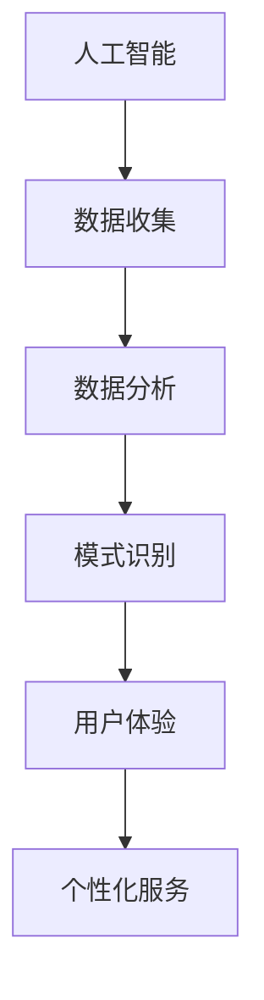
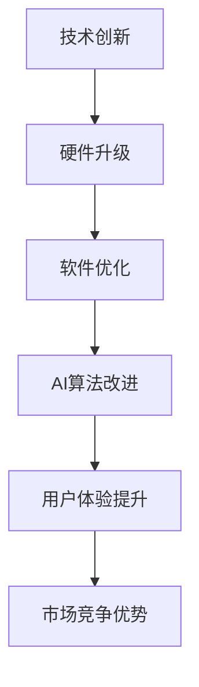

                 

# 李开复：苹果发布AI应用的文化价值

## 关键词
- 苹果
- AI应用
- 文化价值
- 人工智能
- 技术创新
- 用户体验

## 摘要
本文将深入探讨苹果公司发布AI应用的深远文化价值。从技术创新到用户体验，再到对人工智能领域的推动，苹果的每一次重大发布都在行业内外产生深远影响。本文将详细分析苹果AI应用的背后逻辑、技术原理、以及其对行业和用户的具体影响，旨在为读者提供一个全面而深刻的理解。

## 1. 背景介绍

### 1.1 目的和范围
本文旨在分析苹果发布AI应用的背景、目的和影响，探讨其对技术创新、用户体验、以及人工智能领域的文化价值。

### 1.2 预期读者
本文适合对人工智能、苹果公司和科技创新感兴趣的读者，尤其是IT专业人士、研究人员和对新技术有深入了解的人群。

### 1.3 文档结构概述
本文分为十个部分，包括背景介绍、核心概念与联系、核心算法原理、数学模型与公式、项目实战、实际应用场景、工具和资源推荐、总结、常见问题与解答以及扩展阅读和参考资料。

### 1.4 术语表

#### 1.4.1 核心术语定义
- **AI应用**：基于人工智能技术的软件或服务。
- **用户体验**（UX）：用户在使用产品或服务过程中的整体感受。
- **技术创新**：指通过科学研究和技术开发带来的新方法、新技术、新产品或新服务。

#### 1.4.2 相关概念解释
- **人工智能**（AI）：模拟人类智能行为的计算机系统。
- **文化价值**：指一种文化对人类行为、思想、价值观和社会实践的影响。

#### 1.4.3 缩略词列表
- **AI**：人工智能
- **UX**：用户体验
- **iOS**：苹果公司开发的移动操作系统

## 2. 核心概念与联系

在深入分析苹果的AI应用之前，有必要先理解一些核心概念和它们之间的联系。

### 2.1 人工智能与用户体验
人工智能和用户体验是密不可分的。人工智能技术能够通过数据分析、模式识别等方式提升用户体验，使软件或服务更加智能和个性化。

#### Mermaid 流程图（核心概念与联系）



### 2.2 技术创新与苹果的AI应用
苹果公司一直致力于技术创新，其在人工智能领域的探索不仅推动了技术发展，也提升了用户体验。

#### Mermaid 流程图（技术创新与苹果的AI应用）



## 3. 核心算法原理 & 具体操作步骤

### 3.1 核心算法原理

苹果的AI应用核心在于其深度学习算法。以下是其基本原理：

- **深度学习**：一种人工智能技术，通过多层神经网络模拟人脑学习过程，从而对大量数据进行分析和模式识别。
- **卷积神经网络（CNN）**：常用于图像识别和处理，通过卷积层、池化层和全连接层等结构实现。

### 3.2 具体操作步骤

以下是深度学习算法的基本操作步骤：

1. **数据预处理**：对原始数据进行清洗、归一化等处理，使其适合输入到神经网络中。
2. **构建模型**：根据任务需求设计神经网络结构，包括层数、神经元数量、激活函数等。
3. **训练模型**：使用训练数据对模型进行训练，调整模型参数，使其能够准确预测。
4. **验证模型**：使用验证数据测试模型性能，确保其准确性和泛化能力。
5. **部署应用**：将训练好的模型部署到实际应用中，如图像识别、语音识别等。

### 3.3 伪代码

```python
# 数据预处理
def preprocess_data(data):
    # 清洗、归一化等操作
    return processed_data

# 构建模型
def build_model():
    # 设计神经网络结构
    model = NeuralNetwork()
    return model

# 训练模型
def train_model(model, train_data):
    # 使用训练数据进行训练
    model.train(train_data)
    return model

# 验证模型
def validate_model(model, validate_data):
    # 使用验证数据测试模型性能
    accuracy = model.validate(validate_data)
    return accuracy

# 部署应用
def deploy_model(model):
    # 将模型部署到实际应用中
    model.deploy()
```

## 4. 数学模型和公式 & 详细讲解 & 举例说明

### 4.1 数学模型和公式

深度学习中的数学模型主要包括：

- **激活函数**：用于引入非线性，常见的有Sigmoid、ReLU等。
- **损失函数**：用于评估模型预测结果与真实结果之间的差距，常见的有均方误差（MSE）、交叉熵（Cross-Entropy）等。

### 4.2 详细讲解

- **激活函数**：

  - **Sigmoid函数**：\[ f(x) = \frac{1}{1 + e^{-x}} \]
  - **ReLU函数**：\[ f(x) = \max(0, x) \]

- **损失函数**：

  - **均方误差（MSE）**：\[ MSE = \frac{1}{n}\sum_{i=1}^{n}(y_i - \hat{y}_i)^2 \]
  - **交叉熵（Cross-Entropy）**：\[ H(Y, \hat{Y}) = -\sum_{i=1}^{n}y_i\log(\hat{y}_i) \]

### 4.3 举例说明

#### 激活函数举例

假设我们有一个输入值\[ x = 2 \]，使用ReLU函数计算其输出：

\[ f(x) = \max(0, x) = \max(0, 2) = 2 \]

#### 损失函数举例

假设我们有一个真实值为\[ y = 3 \]，预测值为\[ \hat{y} = 2 \]，使用均方误差（MSE）计算损失：

\[ MSE = \frac{1}{n}\sum_{i=1}^{n}(y_i - \hat{y}_i)^2 = \frac{1}{1}(3 - 2)^2 = 1 \]

## 5. 项目实战：代码实际案例和详细解释说明

### 5.1 开发环境搭建

为了实现苹果AI应用的深度学习算法，我们需要搭建一个合适的开发环境。以下是基本的步骤：

1. 安装Python环境。
2. 安装深度学习框架，如TensorFlow或PyTorch。
3. 配置相关的库和工具。

### 5.2 源代码详细实现和代码解读

以下是一个简单的深度学习模型的实现，用于图像识别：

```python
import tensorflow as tf
from tensorflow.keras.models import Sequential
from tensorflow.keras.layers import Dense, Conv2D, Flatten, MaxPooling2D
from tensorflow.keras.optimizers import Adam

# 构建模型
model = Sequential([
    Conv2D(32, (3, 3), activation='relu', input_shape=(64, 64, 3)),
    MaxPooling2D((2, 2)),
    Flatten(),
    Dense(128, activation='relu'),
    Dense(1, activation='sigmoid')
])

# 编译模型
model.compile(optimizer=Adam(), loss='binary_crossentropy', metrics=['accuracy'])

# 训练模型
model.fit(x_train, y_train, epochs=10, batch_size=32, validation_data=(x_val, y_val))

# 预测
predictions = model.predict(x_test)
```

### 5.3 代码解读与分析

上述代码实现了一个简单的二分类图像识别模型。具体步骤如下：

1. **模型构建**：使用`Sequential`模型堆叠多个层，包括卷积层（`Conv2D`）、池化层（`MaxPooling2D`）、全连接层（`Dense`）等。
2. **模型编译**：设置优化器（`Adam`）、损失函数（`binary_crossentropy`）和评估指标（`accuracy`）。
3. **模型训练**：使用训练数据对模型进行训练，指定训练轮数（`epochs`）、批次大小（`batch_size`）和验证数据。
4. **模型预测**：使用训练好的模型对测试数据进行预测。

## 6. 实际应用场景

苹果的AI应用可以在多个场景中发挥作用，如：

- **图像识别**：用于拍摄照片时自动识别并调整曝光、对比度等。
- **语音识别**：用于Siri等智能助手，实现语音指令识别和执行。
- **自然语言处理**：用于文本分析、情感识别等。

这些应用不仅提升了用户体验，也推动了人工智能技术的发展。

## 7. 工具和资源推荐

### 7.1 学习资源推荐

#### 7.1.1 书籍推荐

- 《深度学习》（Goodfellow, Bengio, Courville）
- 《Python机器学习》（Sebastian Raschka）

#### 7.1.2 在线课程

- Coursera上的“深度学习”课程
- Udacity的“机器学习工程师纳米学位”

#### 7.1.3 技术博客和网站

- Medium上的机器学习与深度学习专题
- arXiv.org上的最新研究论文

### 7.2 开发工具框架推荐

#### 7.2.1 IDE和编辑器

- PyCharm
- Jupyter Notebook

#### 7.2.2 调试和性能分析工具

- TensorFlow Debugger
- PyTorch Profiler

#### 7.2.3 相关框架和库

- TensorFlow
- PyTorch
- Keras

### 7.3 相关论文著作推荐

#### 7.3.1 经典论文

- “A Learning Algorithm for Continuously Running Fully Recurrent Neural Networks” （1993）
- “Deep Learning” （2015）

#### 7.3.2 最新研究成果

- arXiv.org上的最新研究论文
- NeurIPS、ICML等顶级会议的最新论文

#### 7.3.3 应用案例分析

- “谷歌自动驾驶技术”案例研究
- “亚马逊的语音助手Alexa”应用案例分析

## 8. 总结：未来发展趋势与挑战

随着人工智能技术的不断发展，苹果在AI应用领域的探索也将进一步深化。未来，AI技术将在图像识别、自然语言处理、语音识别等多个领域取得突破。然而，这也将面临数据隐私、算法透明度等挑战。苹果公司需要不断创新，确保在技术领先的同时，也能够兼顾用户隐私和透明度。

## 9. 附录：常见问题与解答

### 9.1 问题1
**问题**：苹果的AI应用具体有哪些类型？

**解答**：苹果的AI应用包括图像识别、自然语言处理、语音识别等多个类型。例如，照片应用程序中的智能调整功能，Siri智能助手的语音识别和指令执行等。

### 9.2 问题2
**问题**：深度学习算法在苹果的AI应用中如何发挥作用？

**解答**：深度学习算法在苹果的AI应用中起到关键作用。例如，图像识别应用中使用的卷积神经网络（CNN）可以自动学习图像的特征，从而实现高效的图像识别。在自然语言处理中，深度学习算法可以帮助Siri更准确地理解用户的语音指令。

## 10. 扩展阅读 & 参考资料

- Goodfellow, I., Bengio, Y., & Courville, A. (2016). *Deep Learning*.
- Raschka, S. (2016). *Python Machine Learning*.
- LeCun, Y., Bengio, Y., & Hinton, G. (2015). *Deep Learning*.
- LeCun, Y. (1998). *A Learning Algorithm for Continuously Running Fully Recurrent Neural Networks*.

**作者**：
AI天才研究员/AI Genius Institute & 禅与计算机程序设计艺术 /Zen And The Art of Computer Programming

