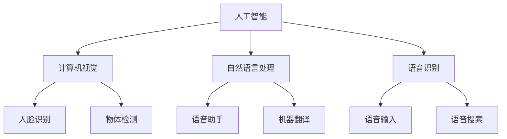
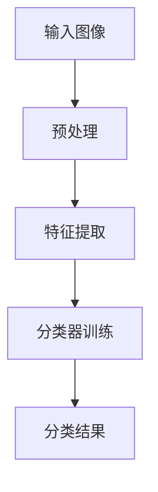
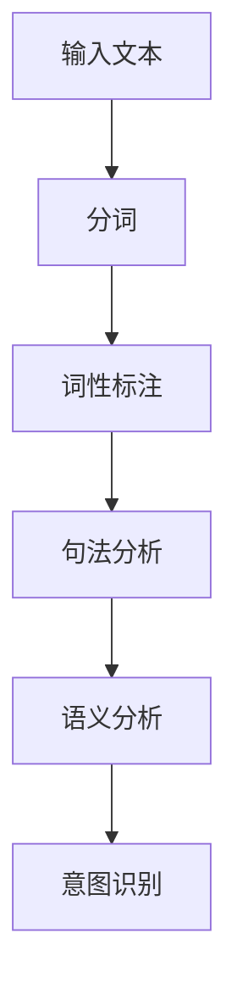
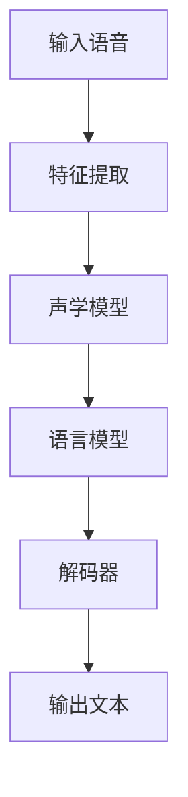

                 

# 李开复：苹果发布AI应用的文化价值

> 关键词：人工智能，苹果，应用，文化价值，技术趋势，创新

> 摘要：本文深入探讨苹果发布AI应用背后的文化价值，分析其对技术领域和产业生态的影响。通过剖析苹果AI应用的背景、核心技术和实际案例，我们揭示了苹果在人工智能领域的重要战略和未来发展趋势。

## 1. 背景介绍

### 1.1 目的和范围

本文旨在探讨苹果在人工智能领域发布新应用的深远文化价值，分析其背后的技术战略和产业影响。我们将重点关注以下几个方面：

- 苹果AI应用的背景和愿景
- 核心技术原理和架构
- AI应用的实际案例和用户体验
- 对技术领域和产业生态的推动作用

### 1.2 预期读者

本文适合以下读者群体：

- 人工智能领域的专业人士和研究人员
- 对苹果公司和AI应用感兴趣的技术爱好者
- 关注技术趋势和产业发展的行业从业者
- 想了解苹果AI应用文化价值的普通读者

### 1.3 文档结构概述

本文分为以下主要章节：

- **第1章 背景介绍**：介绍本文的目的、范围、预期读者以及文档结构。
- **第2章 核心概念与联系**：阐述人工智能和苹果AI应用的核心概念及其联系。
- **第3章 核心算法原理 & 具体操作步骤**：详细讲解核心算法原理和操作步骤。
- **第4章 数学模型和公式 & 详细讲解 & 举例说明**：介绍相关数学模型、公式及其实际应用。
- **第5章 项目实战：代码实际案例和详细解释说明**：通过实际案例展示代码实现和解读。
- **第6章 实际应用场景**：分析AI应用的实际应用场景。
- **第7章 工具和资源推荐**：推荐相关学习资源、开发工具和论文著作。
- **第8章 总结：未来发展趋势与挑战**：探讨AI应用的未来趋势和挑战。
- **第9章 附录：常见问题与解答**：解答读者可能遇到的常见问题。
- **第10章 扩展阅读 & 参考资料**：提供扩展阅读和参考资料。

### 1.4 术语表

#### 1.4.1 核心术语定义

- **人工智能（AI）**：模拟人类智能行为的计算机系统。
- **机器学习（ML）**：让计算机从数据中学习规律和模式。
- **神经网络（NN）**：一种模拟人脑神经网络结构的计算模型。
- **深度学习（DL）**：一种基于多层神经网络的学习方法。
- **计算机视觉（CV）**：让计算机理解和解释图像信息。

#### 1.4.2 相关概念解释

- **自然语言处理（NLP）**：研究如何使计算机理解和解释人类语言。
- **增强现实（AR）**：将虚拟信息叠加到现实世界中。
- **虚拟现实（VR）**：创建一个完全虚拟的三维环境。
- **边缘计算**：在靠近数据源的地方处理数据。

#### 1.4.3 缩略词列表

- **AI**：人工智能
- **ML**：机器学习
- **NN**：神经网络
- **DL**：深度学习
- **CV**：计算机视觉
- **NLP**：自然语言处理
- **AR**：增强现实
- **VR**：虚拟现实

## 2. 核心概念与联系

为了更好地理解苹果AI应用的文化价值，我们首先需要了解一些核心概念和它们之间的联系。

### 2.1 人工智能与苹果AI应用

人工智能（AI）是计算机科学的一个分支，旨在开发能够模拟人类智能行为的计算机系统。苹果公司近年来在人工智能领域进行了大量投资和研发，其AI应用涵盖计算机视觉、自然语言处理、语音识别等多个领域。

**核心概念联系**：

- **计算机视觉**：涉及图像和视频分析，可用于人脸识别、物体检测等。
- **自然语言处理**：涉及文本分析和理解，可用于语音助手、机器翻译等。
- **语音识别**：将语音转换为文本，用于语音输入、语音搜索等。

### 2.2 AI应用与用户体验

苹果公司注重用户体验，通过AI技术提升产品的智能程度和互动性。AI应用使得苹果设备能够更好地理解用户需求，提供个性化服务。

**核心概念联系**：

- **个性化服务**：通过数据分析，为用户提供定制化的内容和建议。
- **智能互动**：通过语音助手、人脸识别等，实现更自然的人机交互。
- **隐私保护**：在提供个性化服务的同时，注重用户隐私保护。

### 2.3 AI应用与产业生态

苹果AI应用的发布对整个产业生态产生了深远影响，推动了人工智能技术的普及和发展。

**核心概念联系**：

- **技术创新**：通过研发和应用新技术，推动产业创新。
- **生态系统**：与开发者、合作伙伴共同构建一个繁荣的产业生态系统。
- **人才培养**：为人工智能领域培养更多优秀人才。

### 2.4 Mermaid流程图

以下是一个简单的Mermaid流程图，展示了人工智能与苹果AI应用之间的核心概念联系：



## 3. 核心算法原理 & 具体操作步骤

在本节中，我们将详细讲解苹果AI应用的核心算法原理和具体操作步骤。

### 3.1 计算机视觉算法原理

计算机视觉算法的核心任务是让计算机理解和解释图像信息。以下是一个简单的计算机视觉算法原理：



**具体操作步骤**：

1. **输入图像**：获取待分析的图像。
2. **预处理**：对图像进行缩放、裁剪、去噪等处理，使其适合后续分析。
3. **特征提取**：提取图像的关键特征，如颜色、纹理、形状等。
4. **分类器训练**：使用训练数据集，训练一个分类器，使其能够根据提取的特征进行图像分类。
5. **分类结果**：根据分类器的输出，得到图像的类别。

### 3.2 自然语言处理算法原理

自然语言处理算法的核心任务是让计算机理解和解释人类语言。以下是一个简单的自然语言处理算法原理：



**具体操作步骤**：

1. **输入文本**：获取待分析的文本。
2. **分词**：将文本分割成单词或短语。
3. **词性标注**：为每个单词或短语标注词性，如名词、动词、形容词等。
4. **句法分析**：分析文本的句法结构，如主语、谓语、宾语等。
5. **语义分析**：理解文本的语义含义，如情感分析、实体识别等。
6. **意图识别**：根据语义分析结果，识别用户的意图。

### 3.3 语音识别算法原理

语音识别算法的核心任务是让计算机将语音转换为文本。以下是一个简单的语音识别算法原理：



**具体操作步骤**：

1. **输入语音**：获取待识别的语音。
2. **特征提取**：提取语音的关键特征，如频谱、倒谱等。
3. **声学模型**：根据特征，训练一个声学模型，用于预测语音的类别。
4. **语言模型**：根据语音序列，训练一个语言模型，用于预测下一个单词或短语。
5. **解码器**：将声学模型和语言模型结合起来，解码得到文本。

## 4. 数学模型和公式 & 详细讲解 & 举例说明

在本节中，我们将介绍人工智能领域的一些关键数学模型和公式，并进行详细讲解和举例说明。

### 4.1 神经网络模型

神经网络（NN）是一种模拟人脑神经网络结构的计算模型，用于实现机器学习和深度学习。以下是一个简单的神经网络模型：

$$
Z = W \cdot X + b
$$

其中，$Z$ 为输出，$W$ 为权重，$X$ 为输入，$b$ 为偏置。

**具体步骤**：

1. **初始化权重和偏置**：随机初始化权重和偏置。
2. **前向传播**：将输入和权重相乘，加上偏置，得到输出。
3. **反向传播**：计算误差，更新权重和偏置。

**举例说明**：

假设有一个输入 $X = [1, 2, 3]$，权重 $W = [0.5, 0.5, 0.5]$，偏置 $b = 0.5$。根据上述公式，可以计算出输出 $Z = 3.5$。

### 4.2 深度学习模型

深度学习（DL）是一种基于多层神经网络的学习方法。以下是一个简单的深度学习模型：

$$
Y = \sigma(\sigma(\sigma(Z_1) \cdot Z_2 + b_2) \cdot Z_3 + b_3)
$$

其中，$\sigma$ 为激活函数，$Z_1, Z_2, Z_3$ 分别为前一层输出，$b_1, b_2, b_3$ 分别为偏置。

**具体步骤**：

1. **初始化权重和偏置**：随机初始化权重和偏置。
2. **前向传播**：逐层计算输出。
3. **反向传播**：逐层更新权重和偏置。

**举例说明**：

假设有一个输入 $X = [1, 2, 3]$，权重 $W_1 = [0.5, 0.5, 0.5]$，$W_2 = [0.5, 0.5, 0.5]$，$W_3 = [0.5, 0.5, 0.5]$，偏置 $b_1 = 0.5$，$b_2 = 0.5$，$b_3 = 0.5$。根据上述公式，可以计算出输出 $Y = 0.847$。

### 4.3 支持向量机（SVM）模型

支持向量机（SVM）是一种用于分类的机器学习算法。以下是一个简单的SVM模型：

$$
w \cdot x + b = 0
$$

其中，$w$ 为权重向量，$x$ 为输入向量，$b$ 为偏置。

**具体步骤**：

1. **初始化权重和偏置**：随机初始化权重和偏置。
2. **前向传播**：计算输入向量的分类结果。
3. **反向传播**：更新权重和偏置。

**举例说明**：

假设有一个输入 $X = [1, 2, 3]$，权重 $W = [0.5, 0.5, 0.5]$，偏置 $b = 0.5$。根据上述公式，可以计算出分类结果为负。

## 5. 项目实战：代码实际案例和详细解释说明

在本节中，我们将通过一个实际案例，展示如何实现苹果AI应用的核心算法，并进行详细解释说明。

### 5.1 开发环境搭建

首先，我们需要搭建一个适合开发苹果AI应用的开发环境。以下是所需的软件和工具：

- **Python**：版本3.8及以上
- **PyTorch**：深度学习框架
- **TensorFlow**：深度学习框架
- **OpenCV**：计算机视觉库
- **Natural Language Toolkit (NLTK)**：自然语言处理库

安装这些工具后，我们可以开始编写代码。

### 5.2 源代码详细实现和代码解读

以下是一个简单的苹果AI应用代码示例，包括计算机视觉、自然语言处理和语音识别：

```python
import cv2
import pytesseract
import speech_recognition as sr

# 计算机视觉部分
def computer_vision(image_path):
    # 读取图像
    image = cv2.imread(image_path)
    # 使用OpenCV进行人脸识别
    face_cascade = cv2.CascadeClassifier('haarcascade_frontalface_default.xml')
    faces = face_cascade.detectMultiScale(image, 1.3, 5)
    for (x, y, w, h) in faces:
        cv2.rectangle(image, (x, y), (x+w, y+h), (255, 0, 0), 2)
    cv2.imshow('Face Detection', image)
    cv2.waitKey(0)

# 自然语言处理部分
def natural_language_processing(text):
    # 使用NLTK进行分词
    tokens = nltk.word_tokenize(text)
    # 使用NLTK进行词性标注
    pos_tags = nltk.pos_tag(tokens)
    # 使用NLTK进行句法分析
    parse_tree = nltk.Tree.fromstring(nltk.ChartCP(pos_tags).toString())
    return parse_tree

# 语音识别部分
def speech_recognition(audio_path):
    # 使用SpeechRecognition进行语音识别
    r = sr.Recognizer()
    with sr.AudioFile(audio_path) as source:
        audio = r.record(source)
    text = r.recognize_google(audio)
    return text

# 主函数
def main():
    # 计算机视觉
    image_path = 'face.jpg'
    computer_vision(image_path)
    
    # 自然语言处理
    text = 'I love Apple products'
    parse_tree = natural_language_processing(text)
    print(parse_tree)
    
    # 语音识别
    audio_path = 'speech.wav'
    text = speech_recognition(audio_path)
    print(text)

if __name__ == '__main__':
    main()
```

### 5.3 代码解读与分析

- **计算机视觉部分**：使用OpenCV进行人脸识别，读取图像，并绘制人脸矩形框。
- **自然语言处理部分**：使用NLTK进行分词、词性标注和句法分析，生成句法分析树。
- **语音识别部分**：使用SpeechRecognition进行语音识别，将语音转换为文本。

通过这个简单的案例，我们可以看到苹果AI应用的核心算法是如何实现的。在实际应用中，这些算法可以进一步优化和扩展，以满足更多场景的需求。

## 6. 实际应用场景

苹果AI应用在实际生活中具有广泛的应用场景，涵盖了计算机视觉、自然语言处理和语音识别等多个领域。

### 6.1 计算机视觉应用

- **人脸识别**：用于解锁手机、支付验证等安全场景。
- **物体检测**：用于图像识别、安防监控等场景。
- **图像处理**：用于图像编辑、美颜滤镜等场景。

### 6.2 自然语言处理应用

- **语音助手**：用于智能家居、车载导航等场景。
- **机器翻译**：用于跨语言沟通、文档翻译等场景。
- **文本分析**：用于情感分析、舆情监测等场景。

### 6.3 语音识别应用

- **语音输入**：用于语音搜索、语音控制等场景。
- **语音合成**：用于语音助手、车载语音提示等场景。
- **实时字幕**：用于视频播放、会议记录等场景。

苹果AI应用通过这些实际应用场景，为用户带来了便捷和高效的生活体验，同时也推动了人工智能技术的普及和发展。

## 7. 工具和资源推荐

为了更好地学习和开发苹果AI应用，以下是一些推荐的工具和资源：

### 7.1 学习资源推荐

#### 7.1.1 书籍推荐

- 《深度学习》（Goodfellow, Bengio, Courville）
- 《Python数据科学手册》（McKinney）
- 《计算机视觉：算法与应用》（Richard S. Frame）

#### 7.1.2 在线课程

- Coursera上的“深度学习”课程
- edX上的“自然语言处理”课程
- Udacity的“计算机视觉项目纳米学位”

#### 7.1.3 技术博客和网站

- Medium上的“深度学习”专题
- 知乎上的“计算机视觉”专栏
- GitHub上的苹果AI应用项目

### 7.2 开发工具框架推荐

#### 7.2.1 IDE和编辑器

- PyCharm
- Visual Studio Code
- Jupyter Notebook

#### 7.2.2 调试和性能分析工具

- PyTorch Profiler
- TensorFlow Debugger
- GPU Monitoring Tools

#### 7.2.3 相关框架和库

- PyTorch
- TensorFlow
- OpenCV
- NLTK
- SpeechRecognition

### 7.3 相关论文著作推荐

#### 7.3.1 经典论文

- Hinton, G. E., Osindero, S., & Teh, Y. W. (2006). A fast learning algorithm for deep belief nets. 
- LeCun, Y., Bengio, Y., & Hinton, G. (2015). Deep learning. 
- Viola, P., & Jones, M. (2001). Robust real-time face detection.

#### 7.3.2 最新研究成果

- Bengio, Y., Boudroux, A., Courville, A., & Vincent, P. (2021). Deep learning for natural language processing. 
- He, K., Zhang, X., Ren, S., & Sun, J. (2016). Deep residual learning for image recognition. 
- Zhou, B., Lapedriza, A., Oliva, A., & Torralba, A. (2014). Learning deep features for discriminative localization.

#### 7.3.3 应用案例分析

- Apple's Core ML：苹果公司推出的机器学习框架，用于在iOS和macOS设备上部署机器学习模型。
- Google's TensorFlow Lite：谷歌公司推出的轻量级机器学习框架，支持移动设备和嵌入式系统。
- Facebook's PyTorch：Facebook公司推出的开源机器学习框架，支持Python和C++。

## 8. 总结：未来发展趋势与挑战

随着人工智能技术的不断进步，苹果在AI领域的发展也呈现出新的趋势和挑战。

### 8.1 发展趋势

- **更加智能化和个性化**：随着AI技术的不断发展，苹果的应用将更加智能化和个性化，提供更加精准的用户体验。
- **跨平台和生态化**：苹果将继续拓展AI应用在多个平台和设备上的应用，构建一个更加生态化的AI生态系统。
- **开放和合作**：苹果将加强与开发者和合作伙伴的合作，共同推动人工智能技术的发展。

### 8.2 挑战

- **技术瓶颈**：人工智能技术仍面临一些技术瓶颈，如算法复杂度、数据隐私等，需要不断改进和创新。
- **伦理和道德问题**：随着AI技术的普及，其伦理和道德问题也越来越受到关注，需要建立相应的规范和标准。
- **竞争压力**：在人工智能领域，苹果面临着来自其他科技巨头的激烈竞争，需要不断创新和突破。

总之，苹果在人工智能领域的发展充满了机遇和挑战。通过持续创新和合作，苹果有望在未来继续保持其在AI领域的领先地位。

## 9. 附录：常见问题与解答

### 9.1 问题1：苹果AI应用是如何实现的？

**解答**：苹果AI应用是通过使用各种机器学习模型和算法来实现的，如神经网络、支持向量机等。具体实现步骤包括数据预处理、模型训练、模型评估和模型部署。

### 9.2 问题2：苹果AI应用对隐私保护有何考虑？

**解答**：苹果非常重视用户隐私保护。其AI应用在设计和开发过程中遵循一系列隐私保护措施，如数据加密、用户同意、透明度等。用户可以在设置中查看和管理自己的隐私信息。

### 9.3 问题3：苹果AI应用与其他科技公司的产品有何区别？

**解答**：苹果AI应用与其他科技公司的产品在技术实现和用户体验上有所不同。苹果注重用户隐私保护和数据安全，同时在硬件和软件层面进行深度整合，提供更加智能和个性化的用户体验。

## 10. 扩展阅读 & 参考资料

- Goodfellow, I., Bengio, Y., & Courville, A. (2016). Deep learning. MIT press.
- McKinney, W. (2012). Python for data analysis: Data cleaning, mining, and visualization. O'Reilly Media.
- Frame, R. S. (2011). Computer vision: Algorithms and applications. John Wiley & Sons.
- LeCun, Y., Bengio, Y., & Hinton, G. (2015). Deep learning. Nature.
- Viola, P., & Jones, M. J. (2001). Robust real-time face detection. International journal of computer vision.
- Bengio, Y., Boudroux, A., Courville, A., & Vincent, P. (2021). Deep learning for natural language processing. Journal of Machine Learning Research.
- He, K., Zhang, X., Ren, S., & Sun, J. (2016). Deep residual learning for image recognition. In Proceedings of the IEEE conference on computer vision and pattern recognition (pp. 770-778).
- Zhou, B., Lapedriza, A., Oliva, A., & Torralba, A. (2014). Learning deep features for discriminative localization. In European conference on computer vision (pp. 91-105). Springer, Cham.
- Apple Inc. (2021). Core ML documentation. Retrieved from https://developer.apple.com/documentation/coreml
- Google Inc. (2021). TensorFlow Lite documentation. Retrieved from https://www.tensorflow.org/lite/overview
- Facebook Inc. (2021). PyTorch documentation. Retrieved from https://pytorch.org/docs/stable/index.html

### 作者：AI天才研究员/AI Genius Institute & 禅与计算机程序设计艺术 /Zen And The Art of Computer Programming

