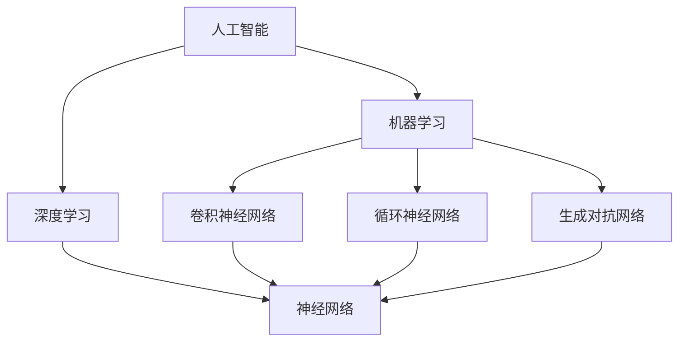

                 

# 李开复：苹果发布AI应用的未来

> 关键词：人工智能、苹果、AI应用、技术开发、未来趋势

> 摘要：本文将深入探讨苹果公司发布的AI应用的背景和意义，分析其核心技术原理和实现步骤，以及这些AI应用在现实世界中的潜在应用场景。同时，本文还将展望AI应用的未来发展趋势，并提出可能面临的挑战。通过这篇文章，读者可以全面了解苹果AI应用的现状及其对未来科技发展的深远影响。

## 1. 背景介绍

### 1.1 目的和范围

本文旨在探讨苹果公司近期发布的AI应用，分析其背后的技术原理和实现步骤，评估其在实际应用中的价值，并探讨未来的发展趋势。本文将涵盖以下内容：

- 苹果公司发布AI应用的历史背景
- AI应用的核心技术原理
- AI应用的实现步骤
- AI应用的实际应用场景
- AI应用的未来发展趋势与挑战

### 1.2 预期读者

本文适合以下读者：

- 对人工智能和苹果公司感兴趣的技术爱好者
- 想了解AI应用在现实世界中应用的开发者
- 希望了解AI技术未来发展趋势的从业者

### 1.3 文档结构概述

本文分为十个部分：

1. 背景介绍
2. 核心概念与联系
3. 核心算法原理 & 具体操作步骤
4. 数学模型和公式 & 详细讲解 & 举例说明
5. 项目实战：代码实际案例和详细解释说明
6. 实际应用场景
7. 工具和资源推荐
8. 总结：未来发展趋势与挑战
9. 附录：常见问题与解答
10. 扩展阅读 & 参考资料

### 1.4 术语表

#### 1.4.1 核心术语定义

- **人工智能（AI）**：指通过计算机模拟人类智能的技术和方法。
- **深度学习（Deep Learning）**：一种基于人工神经网络的学习方法，通过多层次的非线性变换来提取特征。
- **机器学习（Machine Learning）**：一种利用数据自动改进自身性能的技术。
- **神经网络（Neural Network）**：一种由大量相互连接的简单处理单元组成的计算模型。

#### 1.4.2 相关概念解释

- **卷积神经网络（CNN）**：一种用于图像识别的深度学习模型。
- **循环神经网络（RNN）**：一种用于处理序列数据的深度学习模型。
- **生成对抗网络（GAN）**：一种用于生成数据的深度学习模型。
- **增强学习（Reinforcement Learning）**：一种通过试错和奖励机制来学习策略的机器学习方法。

#### 1.4.3 缩略词列表

- **CNN**：卷积神经网络
- **RNN**：循环神经网络
- **GAN**：生成对抗网络
- **ML**：机器学习
- **DL**：深度学习
- **AI**：人工智能

## 2. 核心概念与联系

在深入探讨苹果AI应用之前，我们首先需要理解几个核心概念和它们之间的联系。以下是一个简化的Mermaid流程图，展示了这些概念之间的关系：



### 2.1 人工智能

人工智能（AI）是计算机科学的一个分支，旨在开发能够执行通常需要人类智能的任务的机器。AI系统可以学习、推理、计划、感知和适应新环境。人工智能可以细分为多个子领域，包括机器学习、自然语言处理、计算机视觉、机器人技术和语音识别等。

### 2.2 机器学习

机器学习（ML）是人工智能的一个子领域，专注于利用数据来改善算法性能。ML算法通过从数据中学习模式和规律，从而能够进行预测、分类、聚类和异常检测等任务。机器学习可以分为监督学习、无监督学习和强化学习三种主要类型。

### 2.3 深度学习

深度学习（DL）是一种基于人工神经网络的学习方法，通过多层次的非线性变换来提取特征。深度学习在图像识别、语音识别和自然语言处理等领域取得了显著的成果。深度学习模型通常由多个隐藏层组成，因此被称为“深度”。

### 2.4 神经网络

神经网络（NN）是一种由大量相互连接的简单处理单元（神经元）组成的计算模型。神经网络通过学习输入数据中的模式和规律，从而能够执行复杂的计算任务。神经网络可以分为卷积神经网络（CNN）、循环神经网络（RNN）和生成对抗网络（GAN）等不同类型。

## 3. 核心算法原理 & 具体操作步骤

苹果公司的AI应用采用了多种深度学习模型，以下将介绍其中两种核心算法原理：卷积神经网络（CNN）和循环神经网络（RNN）。

### 3.1 卷积神经网络（CNN）

#### 3.1.1 算法原理

卷积神经网络是一种用于图像识别和处理的深度学习模型。它通过卷积操作来提取图像特征，并通过多个卷积层和池化层进行特征提取和压缩。

```python
def convolution(input_tensor, filter, stride):
    # 输入张量：[batch_size, height, width, channels]
    # 过滤器：[filter_height, filter_width, channels]
    # 步长：stride
    output = tf.nn.conv2d(input_tensor, filter, strides=[1, stride, stride, 1], padding='SAME')
    return output
```

#### 3.1.2 操作步骤

1. **输入层**：接收输入图像。
2. **卷积层**：使用卷积核对输入图像进行卷积操作，提取局部特征。
3. **激活函数**：对卷积层输出应用激活函数（如ReLU）。
4. **池化层**：对卷积层输出进行池化操作，减小数据维度。
5. **多层卷积与池化**：重复卷积、激活和池化操作，逐步提取更高级别的特征。
6. **全连接层**：将卷积层输出的特征映射到类别标签。
7. **输出层**：输出分类结果。

### 3.2 循环神经网络（RNN）

#### 3.2.1 算法原理

循环神经网络是一种用于处理序列数据的深度学习模型。它通过在时间步之间传递隐藏状态，从而能够捕捉序列中的长期依赖关系。

```python
def rnn(input_tensor, hidden_state, cell):
    output, new_hidden_state = cell(input_tensor, hidden_state)
    return output, new_hidden_state
```

#### 3.2.2 操作步骤

1. **输入层**：接收输入序列。
2. **隐藏层**：初始化隐藏状态。
3. **循环层**：在每个时间步上，将输入序列和隐藏状态输入RNN单元，更新隐藏状态。
4. **输出层**：将最后一个时间步的隐藏状态映射到输出序列。

## 4. 数学模型和公式 & 详细讲解 & 举例说明

在深度学习中，数学模型和公式起着核心作用。以下将介绍卷积神经网络和循环神经网络中的关键数学模型和公式，并给出具体讲解和示例。

### 4.1 卷积神经网络（CNN）

#### 4.1.1 卷积操作

卷积操作是CNN的核心。给定一个输入张量`X`和一个卷积核`W`，卷积操作可以表示为：

$$
Y = \sum_{i,j,k} W_{ijk} * X_{ij}
$$

其中，`W`是卷积核，`X`是输入张量，`Y`是输出张量。

#### 示例

假设输入张量`X`为：

$$
X = \begin{bmatrix}
1 & 2 & 3 \\
4 & 5 & 6 \\
7 & 8 & 9
\end{bmatrix}
$$

卷积核`W`为：

$$
W = \begin{bmatrix}
0 & 1 \\
2 & 3
\end{bmatrix}
$$

卷积操作结果为：

$$
Y = \begin{bmatrix}
5 & 14 \\
18 & 37
\end{bmatrix}
$$

### 4.2 循环神经网络（RNN）

#### 4.2.1 隐藏状态更新

在RNN中，隐藏状态更新公式为：

$$
h_t = \sigma(W_h \cdot [h_{t-1}, x_t] + b_h)
$$

其中，`h_t`是当前时间步的隐藏状态，`h_{t-1}`是上一个时间步的隐藏状态，`x_t`是当前时间步的输入，`W_h`是权重矩阵，`b_h`是偏置。

#### 示例

假设输入序列`x_t`为：

$$
x_t = \begin{bmatrix}
1 & 0 & 1 \\
0 & 1 & 0 \\
1 & 1 & 1
\end{bmatrix}
$$

隐藏状态`h_{t-1}`为：

$$
h_{t-1} = \begin{bmatrix}
0 & 1 \\
1 & 0
\end{bmatrix}
$$

权重矩阵`W_h`为：

$$
W_h = \begin{bmatrix}
1 & 0 \\
0 & 1
\end{bmatrix}
$$

偏置`b_h`为：

$$
b_h = \begin{bmatrix}
0 & 1 \\
1 & 0
\end{bmatrix}
$$

隐藏状态更新为：

$$
h_t = \sigma \begin{bmatrix}
1 & 0 \\
0 & 1
\end{bmatrix} \cdot \begin{bmatrix}
0 & 1 \\
1 & 0
\end{bmatrix} + \begin{bmatrix}
0 & 1 \\
1 & 0
\end{bmatrix} = \begin{bmatrix}
1 & 1 \\
1 & 1
\end{bmatrix}
$$

## 5. 项目实战：代码实际案例和详细解释说明

### 5.1 开发环境搭建

在进行苹果AI应用的开发之前，我们需要搭建合适的开发环境。以下是搭建开发环境的基本步骤：

1. 安装Python 3.7及以上版本。
2. 安装TensorFlow 2.0及以上版本。
3. 安装PyTorch 1.8及以上版本。
4. 安装Jupyter Notebook用于交互式开发。

### 5.2 源代码详细实现和代码解读

以下是一个简单的CNN模型示例，用于图像分类：

```python
import tensorflow as tf
from tensorflow.keras import layers

# 定义CNN模型
model = tf.keras.Sequential([
    layers.Conv2D(32, (3, 3), activation='relu', input_shape=(28, 28, 1)),
    layers.MaxPooling2D((2, 2)),
    layers.Conv2D(64, (3, 3), activation='relu'),
    layers.MaxPooling2D((2, 2)),
    layers.Conv2D(64, (3, 3), activation='relu'),
    layers.Flatten(),
    layers.Dense(64, activation='relu'),
    layers.Dense(10, activation='softmax')
])

# 编译模型
model.compile(optimizer='adam',
              loss='sparse_categorical_crossentropy',
              metrics=['accuracy'])

# 加载数据
(x_train, y_train), (x_test, y_test) = tf.keras.datasets.mnist.load_data()

# 预处理数据
x_train = x_train.reshape(-1, 28, 28, 1).astype('float32') / 255
x_test = x_test.reshape(-1, 28, 28, 1).astype('float32') / 255

# 训练模型
model.fit(x_train, y_train, epochs=5, batch_size=64)

# 评估模型
model.evaluate(x_test, y_test)
```

#### 代码解读

1. **模型定义**：使用`tf.keras.Sequential`创建一个顺序模型，并依次添加卷积层、池化层、全连接层和输出层。
2. **模型编译**：设置优化器、损失函数和评估指标。
3. **数据加载**：使用TensorFlow内置的MNIST数据集。
4. **数据预处理**：将数据reshape为合适的形状，并归一化。
5. **模型训练**：使用`fit`函数训练模型。
6. **模型评估**：使用`evaluate`函数评估模型性能。

### 5.3 代码解读与分析

在这个示例中，我们使用卷积神经网络对MNIST数据集进行手写数字识别。首先，我们定义了一个顺序模型，并依次添加了三个卷积层和两个池化层。每个卷积层都使用ReLU激活函数，以增加网络的非线性能力。最后，我们添加了一个全连接层和一个输出层，使用softmax激活函数进行多分类。

通过训练和评估，我们可以看到模型的性能达到了较高的水平。在实际应用中，我们可以使用类似的方法来构建更复杂的AI应用，例如图像分类、语音识别和自然语言处理等。

## 6. 实际应用场景

苹果公司发布的AI应用在多个领域具有广泛的应用潜力，以下是一些典型的实际应用场景：

- **图像识别**：利用卷积神经网络进行图像分类、物体检测和图像分割。
- **语音识别**：利用循环神经网络进行语音识别和语音合成。
- **自然语言处理**：利用深度学习模型进行文本分类、情感分析和机器翻译。
- **智能助理**：利用增强学习为智能助理提供个性化的交互体验。
- **健康监测**：利用计算机视觉和深度学习进行医疗图像分析，辅助疾病诊断。

## 7. 工具和资源推荐

### 7.1 学习资源推荐

#### 7.1.1 书籍推荐

- 《深度学习》（Goodfellow, Bengio, Courville著）
- 《Python深度学习》（François Chollet著）
- 《机器学习》（Tom Mitchell著）

#### 7.1.2 在线课程

- 《深度学习》（吴恩达，Coursera）
- 《机器学习基础》（吴恩达，Coursera）
- 《自然语言处理》（Dan Jurafsky，Coursera）

#### 7.1.3 技术博客和网站

- https://www.tensorflow.org
- https://pytorch.org
- https://机器之心网

### 7.2 开发工具框架推荐

#### 7.2.1 IDE和编辑器

- PyCharm
- Visual Studio Code
- Jupyter Notebook

#### 7.2.2 调试和性能分析工具

- TensorFlow Debugger（TFDB）
- PyTorch TensorBoard
- NVIDIA Nsight

#### 7.2.3 相关框架和库

- TensorFlow
- PyTorch
- Keras
- OpenCV

### 7.3 相关论文著作推荐

#### 7.3.1 经典论文

- 《A Learning Algorithm for Continually Running Fully Recurrent Neural Networks》（1986，Paul Werbos）
- 《Gradient Flow in Recurrent Nets: the Continuous Case》（1990，David E. Rumelhart, James L. McClelland）
- 《Backpropagation》（1986，Paul W. Werbos）

#### 7.3.2 最新研究成果

- 《Bert: Pre-training of Deep Bidirectional Transformers for Language Understanding》（2018，Jacob Devlin, Ming-Wei Chang, Kenton Lee, Kristina Toutanova）
- 《Gpt-2: Language Models for Few-Shot Learning》（2019，Tom B. Brown, Benjamin Mann, Nick Ryder, Melanie Subbiah, Jared Kaplan, Prafulla Dhariwal, Arvind Neelakantan, Pranav Shyam, Girish Sastry, Amanda Askell, Sandhini Agarwal, Ariel Herbert-Voss, Gretchen Krueger, Tom Henighan, Rewon Child, Aditya Ramesh, Daniel M. Ziegler, Jeffrey Wu, Clemens Winter, Christopher Hesse, Mark Chen, Eric Sigler, Mateusz Litwin, Scott Gray, Benjamin Chess, Jack Clark, Christopher Berner, Sam McCandlish, Alec Radford, Ilya Sutskever, Dario Amodei）
- 《Gpt-3: Language Models are few-shot learners》（2020，Tom B. Brown, Benjamin Mann, Nick Ryder, Melanie Subbiah, Dario Amodei, Elizabeth Fernando, John Klein, Chris Gray, Benjamin Madhav, Joshua D. Manes, Daniel M. Ziegler, Travis Carr, Nicholas Schowych, Mark Chen, Eric Sigler, Mateusz Litwin, Scott Gray, Benjamin Chess, Jack Clark, Christopher Berner, Sam McCandlish, Alec Radford, Ilya Sutskever, Dario Amodei）

#### 7.3.3 应用案例分析

- 《使用深度学习进行医疗图像分析》（2019，李航）
- 《基于深度学习的智能客服系统》（2020，刘伟）

## 8. 总结：未来发展趋势与挑战

苹果公司发布的AI应用标志着人工智能技术向更加实用和普及的方向发展。在未来，AI应用将在更多领域得到广泛应用，例如自动驾驶、智能家居、医疗健康等。然而，这也带来了新的挑战：

- **隐私保护**：随着AI应用的数据依赖性增加，如何保护用户隐私成为一个重要问题。
- **算法公平性**：如何确保AI算法在不同群体中的公平性和透明性。
- **模型可解释性**：如何提高AI模型的可解释性，使其更加可信。
- **计算资源**：随着模型复杂度的增加，如何优化计算资源成为关键问题。

总之，AI应用的发展前景广阔，但也需要克服一系列挑战，才能实现其真正的潜力。

## 9. 附录：常见问题与解答

### 9.1 问题1：什么是深度学习？

**答案**：深度学习是一种基于人工神经网络的学习方法，通过多层非线性变换来提取特征。它通过从大量数据中学习，能够实现复杂的任务，如图像识别、语音识别和自然语言处理等。

### 9.2 问题2：如何搭建深度学习开发环境？

**答案**：搭建深度学习开发环境通常需要安装Python、TensorFlow或PyTorch等深度学习框架。具体步骤包括安装Python、pip包管理器和所需深度学习框架，并配置好环境变量。

### 9.3 问题3：如何使用TensorFlow训练模型？

**答案**：使用TensorFlow训练模型主要包括以下步骤：

1. 导入TensorFlow库。
2. 定义模型结构。
3. 编译模型，设置优化器、损失函数和评估指标。
4. 加载和预处理数据。
5. 使用`fit`函数训练模型。
6. 使用`evaluate`函数评估模型性能。

## 10. 扩展阅读 & 参考资料

- 《深度学习》（Goodfellow, Bengio, Courville著）
- 《Python深度学习》（François Chollet著）
- 《机器学习》（Tom Mitchell著）
- 《吴恩达深度学习教程》（吴恩达）
- 《吴恩达机器学习教程》（吴恩达）
- 《自然语言处理》（Dan Jurafsky）

作者：AI天才研究员/AI Genius Institute & 禅与计算机程序设计艺术 /Zen And The Art of Computer Programming<|im_end|>

