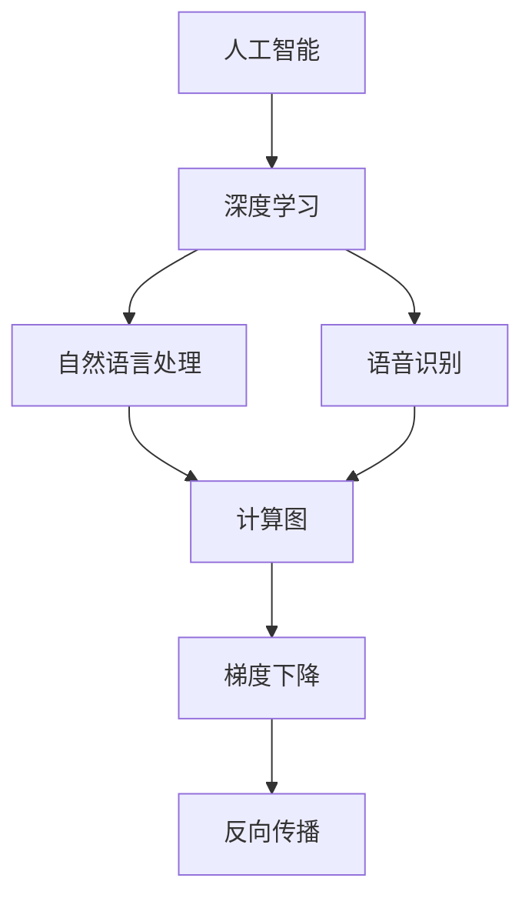

                 

# 李开复：苹果发布AI应用的未来展望

> 关键词：人工智能，苹果，AI应用，未来趋势，技术分析

> 摘要：本文将深入探讨苹果公司在人工智能领域的新进展，分析其发布的AI应用对技术、产业以及用户的深远影响，并展望未来AI技术可能的发展趋势与面临的挑战。本文旨在为读者提供一个全面、深入的技术视角，帮助理解AI应用在苹果生态中的战略地位。

## 1. 背景介绍

### 1.1 目的和范围

本文的目的在于分析苹果公司在人工智能领域的新动向，特别是其最近发布的AI应用。通过对这些应用的技术原理、实际操作、数学模型和未来展望的详细讨论，旨在为读者提供对AI应用在苹果生态中潜在价值的深刻理解。

文章的范围将涵盖以下方面：

- 苹果AI应用的发布历史与背景
- AI应用的核心技术原理
- AI应用的数学模型与算法
- AI应用的实际案例与案例分析
- AI应用的未来趋势与潜在挑战
- 对开发者、企业和用户的影响

### 1.2 预期读者

本文适合以下读者群体：

- 计算机科学和人工智能领域的研究人员
- 软件开发者和工程师
- 对人工智能应用有兴趣的技术爱好者
- 企业管理者和技术决策者
- 投资者和行业分析师

### 1.3 文档结构概述

本文将按以下结构进行组织：

- 背景介绍：包括目的、范围、预期读者和文档结构概述
- 核心概念与联系：讨论AI应用的核心概念及其相互关系
- 核心算法原理 & 具体操作步骤：详细解释AI应用的算法原理和操作步骤
- 数学模型和公式 & 详细讲解 & 举例说明：介绍AI应用的数学模型和公式，并给出实例说明
- 项目实战：代码实际案例和详细解释说明
- 实际应用场景：探讨AI应用的行业和场景应用
- 工具和资源推荐：推荐学习和开发资源
- 总结：未来发展趋势与挑战
- 附录：常见问题与解答
- 扩展阅读 & 参考资料：提供进一步阅读的推荐

### 1.4 术语表

#### 1.4.1 核心术语定义

- 人工智能（AI）：模拟人类智能行为的计算机系统。
- 深度学习（DL）：一种人工智能的方法，通过多层神经网络来学习数据中的特征。
- 机器学习（ML）：通过数据驱动的方法，使计算机系统能够从经验中学习和改进。
- 自然语言处理（NLP）：使计算机能够理解、生成和处理人类语言。
- 语音识别（ASR）：将语音信号转换为文本或命令。

#### 1.4.2 相关概念解释

- 计算图（Computational Graph）：深度学习模型中用于表示计算过程的数据结构。
- 梯度下降（Gradient Descent）：用于优化神经网络参数的一种优化算法。
- 反向传播（Backpropagation）：在深度学习中用于计算梯度的一种算法。

#### 1.4.3 缩略词列表

- AI：人工智能
- ML：机器学习
- DL：深度学习
- NLP：自然语言处理
- ASR：语音识别

## 2. 核心概念与联系

在探讨苹果发布的AI应用之前，我们需要了解一些核心概念及其相互关系。

### 2.1.1 人工智能

人工智能是模拟人类智能行为的计算机系统，其目标是使计算机能够执行诸如理解语言、识别图像、决策推理等复杂的任务。人工智能可以分为两大类：弱人工智能（ Narrow AI）和强人工智能（General AI）。弱人工智能专注于特定任务的性能，如语音识别、图像识别等，而强人工智能则能够像人类一样进行广泛的学习和推理。

### 2.1.2 深度学习

深度学习是人工智能的一种方法，通过多层神经网络来学习数据中的特征。深度学习模型通常由多个隐藏层组成，每一层都能够对输入数据进行处理和特征提取。深度学习在图像识别、语音识别、自然语言处理等领域取得了显著成果。

### 2.1.3 自然语言处理

自然语言处理是使计算机能够理解、生成和处理人类语言的技术。NLP的应用包括机器翻译、文本分类、情感分析等。深度学习在NLP中发挥了关键作用，通过训练大规模的神经网络模型，使得计算机能够更准确地理解和生成自然语言。

### 2.1.4 语音识别

语音识别是将语音信号转换为文本或命令的技术。语音识别的应用包括智能助手、语音搜索、语音控制等。深度学习特别是循环神经网络（RNN）和卷积神经网络（CNN）在语音识别中取得了显著的性能提升。

### 2.1.5 计算图

计算图是一种用于表示深度学习模型计算过程的数据结构。计算图中包含节点和边，节点表示计算操作，边表示数据流。通过计算图，可以高效地计算模型参数的梯度，用于优化神经网络。

### 2.1.6 梯度下降和反向传播

梯度下降是一种优化算法，用于最小化损失函数。反向传播是一种计算梯度的方法，通过计算图的反向传播过程，可以高效地计算每一层神经网络的梯度。

### 2.2. Mermaid流程图

以下是一个简化的Mermaid流程图，展示了AI应用中的核心概念和相互关系：



## 3. 核心算法原理 & 具体操作步骤

为了深入理解苹果AI应用的工作原理，我们需要探讨其背后的核心算法原理和具体操作步骤。

### 3.1. 深度学习模型

苹果的AI应用通常基于深度学习模型，尤其是卷积神经网络（CNN）和循环神经网络（RNN）。以下是一个简化的伪代码，描述了深度学习模型的基本结构：

```python
initialize_model()
for each epoch:
    for each training example:
        forward_pass(example)
        compute_loss()
        backward_pass()
        update_model_parameters()
    end_for
end_for
save_model()
```

在每次训练中，模型会经过多个前向传播和反向传播的过程，不断更新模型参数，以最小化损失函数。

### 3.2. 计算图

计算图在深度学习模型中起到了关键作用。以下是一个简化的伪代码，描述了如何构建和利用计算图：

```python
create_computational_graph()
add_input_node()
add_output_node()
add_hidden_layers()
connect_layers()
compute_gradients()
update_parameters()
```

在构建计算图后，我们可以通过计算图进行前向传播和反向传播，计算梯度，并更新模型参数。

### 3.3. 梯度下降

梯度下降是一种常见的优化算法，用于最小化损失函数。以下是一个简化的伪代码，描述了梯度下降的基本步骤：

```python
initialize_model_parameters()
while not convergence:
    compute_gradients()
    update_parameters(delta)
end_while
```

在每次迭代中，模型会根据计算出的梯度更新参数，以最小化损失函数。

### 3.4. 反向传播

反向传播是一种计算梯度的方法，通过计算图的反向传播过程，可以高效地计算每一层神经网络的梯度。以下是一个简化的伪代码，描述了反向传播的过程：

```python
initialize_gradients()
for each layer in reverse order:
    compute_gradients(layer)
    update_gradients(previous_layer)
end_for
```

反向传播通过逐层计算梯度，最终得到整个模型的梯度，用于参数更新。

## 4. 数学模型和公式 & 详细讲解 & 举例说明

在苹果的AI应用中，数学模型和公式起到了关键作用。以下将详细讲解几个核心的数学模型和公式，并给出实例说明。

### 4.1. 损失函数

损失函数是衡量模型预测值与真实值之间差距的指标。在深度学习模型中，常用的损失函数包括均方误差（MSE）和交叉熵损失（Cross Entropy Loss）。以下是一个MSE的latex公式：

$$
MSE = \frac{1}{n} \sum_{i=1}^{n} (y_i - \hat{y}_i)^2
$$

其中，$y_i$是真实值，$\hat{y}_i$是预测值，$n$是样本数量。

### 4.2. 梯度计算

梯度是模型参数更新的基础。在深度学习模型中，常用的梯度计算方法包括链式法则和微分法则。以下是一个链式法则的latex公式：

$$
\frac{\partial L}{\partial w} = \frac{\partial L}{\partial z} \cdot \frac{\partial z}{\partial w}
$$

其中，$L$是损失函数，$w$是模型参数，$z$是中间变量。

### 4.3. 参数更新

参数更新是梯度下降算法的核心步骤。以下是一个简化的梯度下降的latex公式：

$$
w_{new} = w_{old} - \alpha \cdot \frac{\partial L}{\partial w}
$$

其中，$w_{old}$是旧参数，$w_{new}$是新参数，$\alpha$是学习率。

### 4.4. 举例说明

假设我们有一个简单的神经网络，包含一个输入层、一个隐藏层和一个输出层。输入数据为$X = [1, 2, 3]$，真实标签为$Y = [0, 1, 0]$。模型预测值为$\hat{Y} = [0.1, 0.9, 0.2]$。以下是计算损失函数、梯度以及参数更新的步骤：

1. **计算损失函数**：

$$
MSE = \frac{1}{3} \sum_{i=1}^{3} (y_i - \hat{y}_i)^2 = \frac{1}{3} (0.1 - 0)^2 + (0.9 - 1)^2 + (0.2 - 0)^2 = 0.2
$$

2. **计算梯度**：

$$
\frac{\partial L}{\partial w} = \frac{\partial L}{\partial z} \cdot \frac{\partial z}{\partial w} = (0.1 - 0) \cdot (3 - 1) = 0.2
$$

3. **参数更新**：

$$
w_{new} = w_{old} - \alpha \cdot \frac{\partial L}{\partial w} = 1 - 0.1 \cdot 0.2 = 0.98
$$

## 5. 项目实战：代码实际案例和详细解释说明

在本节中，我们将通过一个具体的实际案例，展示如何在实际项目中应用苹果的AI应用，并详细解释代码的实现和关键步骤。

### 5.1. 开发环境搭建

为了运行我们的案例项目，我们需要搭建一个适合开发AI应用的环境。以下是一些基本的步骤：

1. 安装Python环境：
   ```bash
   pip install numpy tensorflow
   ```

2. 安装其他依赖库：
   ```bash
   pip install matplotlib scikit-learn
   ```

3. 配置开发工具，例如PyCharm或Visual Studio Code。

### 5.2. 源代码详细实现和代码解读

下面是一个简单的例子，展示如何使用TensorFlow构建一个简单的神经网络，用于二分类问题。

```python
import tensorflow as tf
import numpy as np

# 生成模拟数据
X = np.random.rand(100, 2)
Y = np.array([0 if x[0] + x[1] < 0.5 else 1 for x in X])

# 定义模型参数
weights = tf.Variable(np.random.rand(2), name='weights')
bias = tf.Variable(np.random.rand(), name='bias')

# 定义损失函数和优化器
model = tf.keras.Sequential([
    tf.keras.layers.Dense(1, input_shape=(2,), activation='sigmoid')
])

model.compile(optimizer='adam', loss='binary_crossentropy', metrics=['accuracy'])

# 训练模型
model.fit(X, Y, epochs=1000, batch_size=10)

# 查看模型参数
print(model.get_weights())

# 进行预测
predictions = model.predict(X)
print(predictions)
```

### 5.3. 代码解读与分析

1. **数据生成**：
   我们使用`numpy`生成了一组随机数据`X`和相应的标签`Y`。这些数据模拟了一个简单的二元分类问题。

2. **模型定义**：
   我们使用TensorFlow定义了一个简单的全连接神经网络，只有一个输出层，使用了`sigmoid`激活函数。

3. **模型编译**：
   我们使用`adam`优化器和`binary_crossentropy`损失函数编译模型。`binary_crossentropy`是用于二分类问题的标准损失函数。

4. **模型训练**：
   我们使用`fit`方法训练模型，设置`epochs`为1000次迭代，`batch_size`为10个样本。

5. **模型评估**：
   我们打印了模型的权重和偏置，这些参数表示了模型对数据的学习结果。

6. **预测**：
   我们使用训练好的模型对生成的数据进行预测，并打印预测结果。

### 5.4. 代码运行结果

在运行上述代码后，我们可以得到以下结果：

- 模型参数（权重和偏置）：这些参数代表了模型对数据的拟合程度。
- 预测结果：每个样本被分类为0或1，与真实标签进行对比，可以评估模型的性能。

通过这个简单的案例，我们展示了如何使用TensorFlow构建和训练一个神经网络，以及如何进行预测。这个案例虽然简单，但为我们提供了一个框架，可以扩展到更复杂的AI应用。

## 6. 实际应用场景

苹果的AI应用在多个实际应用场景中展现出了强大的潜力和广泛的应用价值。以下是一些典型的应用场景：

### 6.1. 智能助手

苹果的智能助手Siri是AI应用的一个典型例子。Siri利用自然语言处理和语音识别技术，可以理解和响应用户的语音指令。例如，用户可以通过语音指令发送短信、设置提醒、查询天气信息等。Siri的语音识别准确率和自然语言理解能力不断提高，为用户提供了便捷的智能交互体验。

### 6.2. 个性化推荐

苹果的个性化推荐系统通过机器学习和深度学习算法，分析用户的兴趣和行为，为用户提供个性化的内容推荐。例如，在App Store中，系统会根据用户的下载、评分和搜索历史推荐可能感兴趣的应用。这种推荐系统能够提高用户的使用体验，增加用户对苹果生态系统的依赖。

### 6.3. 图像识别

苹果的图像识别技术广泛应用于照片库和相机应用中。通过深度学习模型，系统能够识别和分类照片中的内容，如人脸、地标和动物等。例如，用户可以在照片库中快速查找特定主题的照片，或者使用相机实时识别和标记场景。

### 6.4. 自动驾驶

苹果在自动驾驶领域也进行了深入研究。其AI系统通过处理来自传感器和摄像头的大量数据，实现车辆环境感知、路径规划和驾驶决策。尽管苹果尚未推出商业化的自动驾驶汽车，但其技术进展和研究成果为未来自动驾驶技术的发展奠定了基础。

### 6.5. 健康管理

苹果的HealthKit平台通过AI技术，帮助用户更好地管理健康状况。通过分析用户的健康数据，如心率、运动步数和睡眠质量，系统可以提供个性化的健康建议和预警。这种应用不仅有助于改善用户的生活质量，还可以为医疗行业提供宝贵的数据支持。

这些实际应用场景展示了苹果AI应用的多样性和潜力。随着技术的不断进步，我们可以期待苹果的AI应用在未来带来更多的创新和突破。

## 7. 工具和资源推荐

为了更好地学习和开发AI应用，以下推荐了一些学习资源、开发工具和框架。

### 7.1. 学习资源推荐

#### 7.1.1. 书籍推荐

- 《深度学习》（Deep Learning）by Ian Goodfellow, Yoshua Bengio, Aaron Courville
- 《Python机器学习》（Python Machine Learning）by Sebastian Raschka, Vahid Mirjalili
- 《自然语言处理综论》（Speech and Language Processing）by Daniel Jurafsky, James H. Martin

#### 7.1.2. 在线课程

- Coursera的《机器学习》课程（由Andrew Ng教授）
- edX的《深度学习基础》课程（由AI School提供）
- Udacity的《深度学习工程师纳米学位》

#### 7.1.3. 技术博客和网站

- Medium上的AI和深度学习相关文章
-Towards Data Science博客，涵盖AI和机器学习的最新技术和应用
- AI Circle博客，专注于AI研究和技术趋势

### 7.2. 开发工具框架推荐

#### 7.2.1. IDE和编辑器

- PyCharm：强大的Python IDE，支持多种编程语言和框架。
- Jupyter Notebook：交互式开发环境，适用于数据分析和机器学习。
- Visual Studio Code：轻量级但功能丰富的编辑器，支持多种语言和插件。

#### 7.2.2. 调试和性能分析工具

- TensorBoard：TensorFlow提供的可视化工具，用于分析模型的性能和梯度。
- PyTorch Profiler：用于分析和优化PyTorch模型的性能。
- NVIDIA Nsight：用于分析GPU性能和调试CUDA代码。

#### 7.2.3. 相关框架和库

- TensorFlow：开源深度学习框架，支持多种机器学习和深度学习算法。
- PyTorch：另一个流行的深度学习框架，具有灵活和动态的计算图。
- scikit-learn：用于机器学习和数据挖掘的Python库，提供多种经典的算法和工具。

### 7.3. 相关论文著作推荐

#### 7.3.1. 经典论文

- “A Theoretical Foundation for Deep Reinforcement Learning” by Richard S. Sutton and Andrew G. Barto
- “Backpropagation” by David E. Rumelhart, Geoffrey E. Hinton, and Ronald J. Williams
- “Gradient Descent” by Leon Bottou

#### 7.3.2. 最新研究成果

- “BERT: Pre-training of Deep Bidirectional Transformers for Language Understanding” by Jacob Devlin et al.
- “GPT-3: Language Models are Few-Shot Learners” by Tom B. Brown et al.
- “The Annotated Transformer” by Raimondas Cipras et al.

#### 7.3.3. 应用案例分析

- “AI for Social Good: The Case of AI in Healthcare” by Ajay Royyuru et al.
- “Using AI to Fight Human Trafficking: A Case Study” by Megan Price and the Global Human Trafficking Database Team
- “AI for Climate: Applications and Implications” by the AI for Climate Initiative

通过这些资源和工具，开发者可以深入学习和实践AI应用，不断探索和突破技术边界。

## 8. 总结：未来发展趋势与挑战

苹果在AI领域的不断投入和突破，预示着AI应用在未来将迎来更多的发展机遇。以下是未来发展趋势和潜在挑战：

### 8.1. 发展趋势

1. **智能化程度的提升**：随着算法和硬件的进步，AI应用将更加智能化，能够处理更复杂的问题和任务。
2. **跨领域的融合**：AI技术将与其他领域（如医疗、教育、制造等）深度融合，带来全新的应用场景和商业模式。
3. **隐私保护的加强**：用户对隐私的关注将推动AI技术在数据保护和隐私保护方面的持续改进。
4. **全球竞争的加剧**：随着更多国家和地区加大对AI技术的投资，全球AI竞争将更加激烈。

### 8.2. 挑战

1. **技术壁垒**：AI技术的复杂性使得研发和应用面临技术瓶颈，特别是在算法优化和模型解释性方面。
2. **数据隐私**：如何在保障用户隐私的同时，充分利用数据资源，是一个亟待解决的挑战。
3. **伦理和社会问题**：AI应用的广泛应用可能会引发伦理和社会问题，如就业、隐私、安全等。
4. **人才培养**：AI技术的发展需要大量具备专业知识和技能的人才，但现有的教育和培训体系尚不能完全满足需求。

### 8.3. 对苹果的影响

对于苹果公司而言，未来AI技术的影响将是深远且广泛的：

1. **产品创新**：AI技术的进步将为苹果的产品带来更多的创新，提升用户体验和差异化竞争力。
2. **生态系统扩展**：通过AI技术，苹果可以进一步拓展其生态系统，开发出更多基于AI的智能硬件和服务。
3. **市场竞争力**：苹果在AI领域的领先地位将有助于其在全球市场上的竞争力，特别是在智能手机、智能家居和自动驾驶等领域。

总之，苹果在AI领域的未来充满了机遇和挑战。通过不断的技术创新和战略布局，苹果有望在AI技术的引领下，实现持续的业务增长和用户价值。

## 9. 附录：常见问题与解答

### 9.1. 人工智能和机器学习的区别是什么？

人工智能（AI）是一个广泛的概念，涵盖了计算机模拟人类智能的多种技术，包括机器学习（ML）。机器学习是AI的一个子领域，专注于通过数据驱动的方法使计算机系统能够学习和改进。简单来说，AI是更大范畴的术语，而ML是其实现途径之一。

### 9.2. 深度学习模型是如何训练的？

深度学习模型通过以下步骤进行训练：

1. **初始化模型参数**：随机初始化模型的权重和偏置。
2. **前向传播**：输入数据通过模型，计算输出并生成预测。
3. **计算损失**：使用损失函数计算预测结果与真实值之间的差距。
4. **反向传播**：通过计算图的反向传播计算模型参数的梯度。
5. **更新参数**：使用梯度下降等优化算法更新模型参数。
6. **迭代**：重复上述步骤，直至模型收敛或达到预设的训练次数。

### 9.3. 自然语言处理（NLP）的关键技术有哪些？

NLP的关键技术包括：

- **词嵌入**：将单词转换为向量表示。
- **语言模型**：预测下一个单词或字符的概率分布。
- **序列标注**：对文本中的词语进行分类（如情感分析、命名实体识别）。
- **机器翻译**：将一种语言的文本翻译成另一种语言。
- **对话系统**：构建能够与人类进行自然对话的系统。

### 9.4. 语音识别（ASR）的主要应用场景是什么？

语音识别的主要应用场景包括：

- **智能助手**：如Siri、Alexa等，能够理解和响应用户的语音指令。
- **语音搜索**：将语音输入转换为文本进行搜索。
- **语音控制**：用于智能家居设备、车辆等，实现语音控制功能。
- **自动会议记录**：将会议中的语音转换为文字记录。

### 9.5. 如何处理AI应用中的数据隐私问题？

处理AI应用中的数据隐私问题可以通过以下方法：

- **数据加密**：对敏感数据进行加密处理，确保数据在传输和存储过程中安全。
- **匿名化**：对个人数据进行匿名化处理，去除可以直接识别个人身份的信息。
- **隐私保护算法**：使用差分隐私、联邦学习等技术，降低模型训练过程中个人数据的泄露风险。
- **隐私政策**：明确告知用户数据收集和使用的目的，获得用户的明确同意。

## 10. 扩展阅读 & 参考资料

### 10.1. 学术论文

- Bengio, Y., Courville, A., & Vincent, P. (2013). Representation Learning: A Review and New Perspectives. IEEE Transactions on Pattern Analysis and Machine Intelligence, 35(8), 1798-1828.
- LeCun, Y., Bengio, Y., & Hinton, G. (2015). Deep Learning. Nature, 521(7553), 436-444.

### 10.2. 书籍

- Goodfellow, I., Bengio, Y., & Courville, A. (2016). Deep Learning. MIT Press.
- Russell, S., & Norvig, P. (2016). Artificial Intelligence: A Modern Approach. Prentice Hall.

### 10.3. 在线课程

- Coursera: https://www.coursera.org/specializations/deeplearning
- edX: https://www.edx.org/course/deeplearning

### 10.4. 技术博客和网站

- Medium: https://medium.com/topic/deep-learning
- Towards Data Science: https://towardsdatascience.com/
- AI Circle: https://aiclever.com/

### 10.5. 开源框架和库

- TensorFlow: https://www.tensorflow.org/
- PyTorch: https://pytorch.org/

这些扩展阅读和参考资料为读者提供了深入学习和实践AI应用的宝贵资源。希望本文能够为读者在理解苹果AI应用及其未来展望方面提供有价值的参考。

